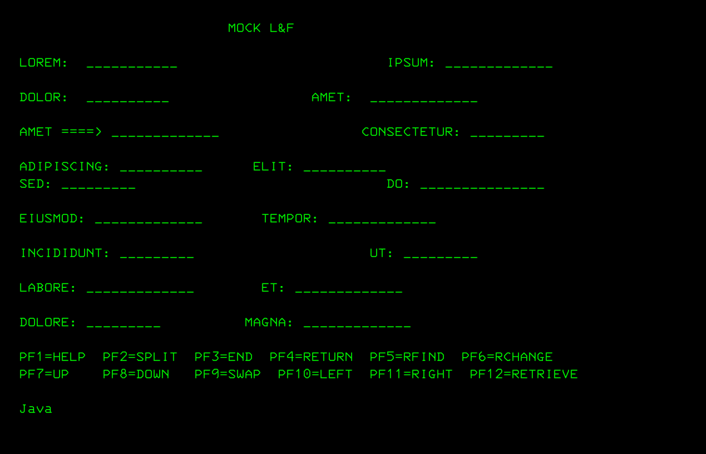
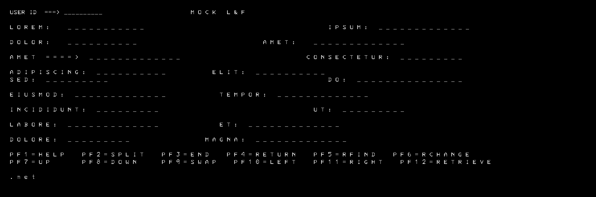
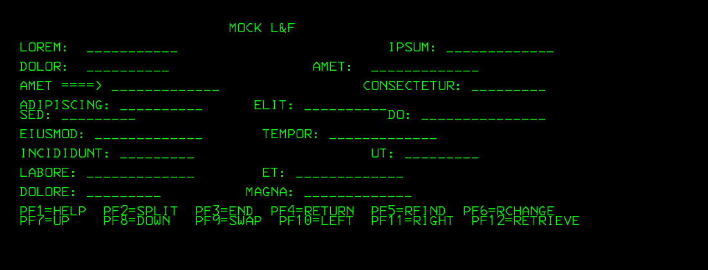

### Usage
```cmd
pushd java
mvn package
java -jar target\example.teller-screen.jar -screenfile ..\input\example.txt -outputfile ..\images\console1.png
popd
```
```text
Wrote ..\images\console1.png
```



```cmd
pushd csharp/windows-forms
cd Program/bin/Debug
.\teller_screen.exe -screenfile=..\..\..\..\..\input\example.txt -outputfile=..\..\..\..\..\images\console2.png
popd
```
```text
Wrote "..\..\..\..\..\images\console2.png"
```



```
python teller_screen.py --screenfile ..\input\example.txt --outputfile ..\images\console3.png
```
```text
Wrote ..\images\console3.png
```




```sh
BASE_URL='https://github.com/ryanoasis/nerd-fonts'
curl -skLo ~/Downloads/3270NerdFontMono-Regular.ttf "$BASE_URL/raw/refs/heads/master/patched-fonts/3270/3270NerdFontMono-Regular.ttf"
```
switch to Windows console (elevated)
```cmd
set FILENAME=3270NerdFontMono-Regular.ttf
copy /y "%USERPROFILE%\Downloads\%FILENAME%" "C:\Windows\Fonts\"
set FONT_NAME=3270 Nerd Font Mono
reg.exe add "HKLM\SOFTWARE\Microsoft\Windows NT\CurrentVersion\Fonts" /v "%FONT_NAME% (TrueType)" /t REG_SZ /d "%FILENAME%" /f
```
```cmd
.\teller_screen.exe -screenfile=..\..\..\..\..\input\example.txt -outputfile=..\..\..\..\..\images\console4.png -font=c:\Users\kouzm\Downloads\3270NerdFontMono-Regular.ttf -debug=true
```
```text
Using font c:\Users\kouzm\Downloads\3270NerdFontMono-Regular.ttf
```
```text
                         MOCK L&F

LOREM:  ___________                         IPSUM: _____________

DOLOR:  __________                 AMET:  _____________

AMET ====> _____________                 CONSECTETUR: _________

ADIPISCING: __________      ELIT: __________
SED: _________                              DO: _______________

EIUSMOD: _____________       TEMPOR: _____________

INCIDIDUNT: _________                     UT: _________

LABORE: _____________        ET: _____________

DOLORE: _________          MAGNA: _____________

PF1=HELP  PF2=SPLIT  PF3=END  PF4=RETURN  PF5=RFIND  PF6=RCHANGE
PF7=UP    PF8=DOWN   PF9=SWAP  PF10=LEFT  PF11=RIGHT  PF12=RETRIEVE

.net
```
```text
Wrote "..\..\..\..\..\images\console2.png"
```
> NOTE: the text that is printed  to console is used to generate a fake TN3270 Tesminal window.

#### OCR
```sh
docker pull minidocks/imagemagick
docker pull jitesoft/tesseract-ocr
```

> NOTE not using "$HOME" - it may easily be pointing to __SMB__ drive
```
export WORKDIR=/c/Users/$USERNAME/Documents/images
mkdir -p $WORKDIR
```
```
cp images/console1.png  $WORKDIR/input.png

docker run --rm -v "$WORKDIR:/work:Z" minidocks/imagemagick magick /work/input.png $OPTIONS_STRING /work/prepared.png
```
```
ls $WORKDIR/prepared.png
/c/Users/kouzm/Documents/images/prepared.png
```
```
docker run --rm -v "$WORKDIR:/work:Z" jitesoft/tesseract-ocr /work/prepared.png /work/result
```
```text
libgomp: Thread creation failed: Operation not permitted
ObjectCache(0x7fc48fe10300)::~ObjectCache(): WARNING! LEAK! object 0x561019774230 still has count 1 (id /usr/local/share/tessdata/eng.traineddatalstm-punc-dawg)
ObjectCache(0x7fc48fe10300)::~ObjectCache(): WARNING! LEAK! object 0x5610198b2040 still has count 1 (id /usr/local/share/tessdata/eng.traineddatalstm-word-dawg)
ObjectCache(0x7fc48fe10300)::~ObjectCache(): WARNING! LEAK! object 0x5610198b1fd0 still has count 1 (id /usr/local/share/tessdata/eng.traineddatalstm-number-dawg)
```

pick the older less aggressive release
```sh
docker pull jitesoft/tesseract-ocr:5.4.1-alpine
```

```sh
docker run --rm -v "$WORKDIR:/work:Z" jitesoft/tesseract-ocr:5.4.1-alpine /work/prepared.png /work/result
```

```text
Error loading shared library libtiff.so.5: No such file or directory (needed by /usr/local/lib/libleptonica.so.6)
Error loading shared library libwebpmux.so.3: No such file or directory (needed by /usr/local/lib/libleptonica.so.6)
Error relocating /usr/local/lib/libleptonica.so.6: TIFFPrintDirectory: symbol not found
...
```

pick the yet older release
```sh
docker pull jitesoft/tesseract-ocr:5.3.3-alpine
```

```sh
docker run --rm -v "$WORKDIR:/work:Z" jitesoft/tesseract-ocr:5.4.1-alpine /work/prepared.png /work/result
cat "$WORKDIR/result.txt"
```
```text
Estimating resolution as 173
```

```
ADIPISCING:
SED:

LABORE:

DOLORE:

PF1=HELP PF2=SPLIT PF3=
PF=!

PF7=UP PF8=DOWN

MOCK L&F

IPSUM: ______
AMET:
CONSECTETUR: ________
ELIT:
TEMPOR: ~______
UT: Li
ET: ~
MAGNA

END PF4=RETURN PFS=RFIND PFO=RCHANGE
SWAP PF1IQ=LEFT PF11=RIGHT PF12=RETRIEVE
```

### Comparison

The same sample screen was drawn by Java, .Net and Python using three (actually, 4) different rendering libraries
The OCR results are shown below

```sh
./scan_screenshot.sh  images/console1.png
```


```text
Estimating resolution as 173
```
```text
OCK L&F

ADIPISCING: ELIT:

SED: 2 DO Le
EIUSMOD: ~______ TEMPOR: ~______

INCIDIDUNT: _________ UT: Li

LABORE: ~_______ ET: ~

DOLORE: MAGNA

PF1=HELP PF2=SPLIT PF3=END PF4=RETURN PF5S=RFIND PFO=RCHANGE
PF7=UP. PF8=DOWN PF9=SWAP PFIO=LEFT PF11=RIGHT PF12=RETRIEVE

Java
```


```sh
./scan_screenshot.sh  images/console2.png
```


```text
USER ID

NGE
TRIEVE
```
> NOTE: the original image is stamped with : `.net` but it was not recognized by OCR
```sh
./scan_screenshot.sh  images/console3.png
```

```text
Estimating resolution as 185
```
```
MOCK L&F
LOREM:
DOLOR:
AMET ====>

INCIDIDUNT:
LABORE:
DOLORE:

BESEHBLP BEZ=SPLIT BEA=EN
Bere o 0 BeBSIAN | Se¥=Ka

Python
```
```
cat input/example.txt
```
```text
                         MOCK L&F

LOREM:  ___________                         IPSUM: _____________

DOLOR:  __________                 AMET:  _____________

AMET ====> _____________                 CONSECTETUR: _________

ADIPISCING: __________      ELIT: __________
SED: _________                              DO: _______________

EIUSMOD: _____________       TEMPOR: _____________

INCIDIDUNT: _________                     UT: _________

LABORE: _____________        ET: _____________

DOLORE: _________          MAGNA: _____________

PF1=HELP  PF2=SPLIT  PF3=END  PF4=RETURN  PF5=RFIND  PF6=RCHANGE
PF7=UP    PF8=DOWN   PF9=SWAP  PF10=LEFT  PF11=RIGHT  PF12=RETRIEVE

```
### Troubleshooting

The `jitesoft/tesseract-ocr:latest` image failed in __Docker Toolbox__ with:

```text
libgomp: Thread creation failed: Operation not permitted
```

An older `:jessie` image was tried next, based on the assumption that an older Debian-based image might not yet exhibit 
the aggressive threading/runtime behavior. But it was - that did not resolve the problem.

Next, `:5.4.1-alpine` was tried, but it failed because of incompatible or missing `TIFF/WebP` runtime libraries required by `Leptonica`.

Finally, the `:5.3.3-alpine` worked and successfully produced the __OCR__ output.
### Following Steps

__ImageMagick__: *Where is the interesting rectangle?*
__Tesseract__: *What characters are inside it?*
__ML/ranking__: *Which preprocessing variant gives the best result?*


### Troubleshooting
```text
Using font C:\Users\kouzm\Downloads
Exception :System.Runtime.InteropServices.ExternalException (0x80004005): A generic error occurred in GDI+.
   at System.Drawing.Text.PrivateFontCollection.AddFontFile(String filename)
   at Program.TellerScreen.Main() TellerScreen.cs:line 94
```
### See Also

  * [pure Javascript OCR](https://github.com/naptha/tesseract.js)
  * https://github.com/tesseract-ocr/tessdoc/blob/main/Command-Line-Usage.md
  
---
### Author
[Serguei Kouzmine](kouzmine_serguei@yahoo.com)
