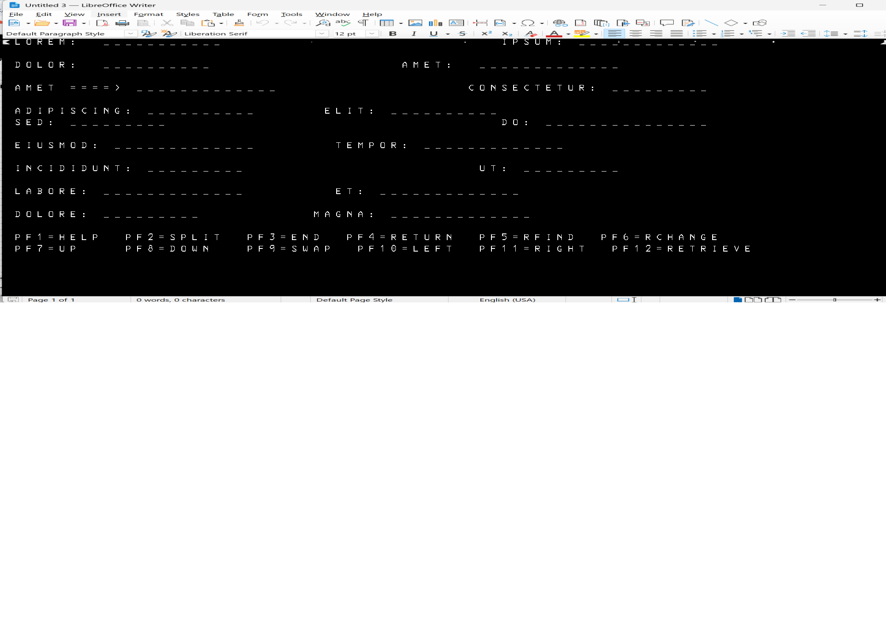

### Info
This is essentially the same code as in Windows Forms, but it uses the currently abandoned 
 [mono/xwt](https://github.com/mono/xwt)
 cross-platform UI toolkit for creating desktop applications with .NET and Mono

### Usage

* download nuget packages and construct `packages` directory manually to avoid fighting with old `nuget.exe` problems:
```sh
curl -sLko ~/Downloads/xwt.0.2.251.nupkg https://www.nuget.org/api/v2/package/Xwt/0.2.251
curl -sLko ~/Downloads/xwt.gtk.0.2.251.nupkg https://www.nuget.org/api/v2/package/Xwt.Gtk/0.2.251
curl -sLko ~/Downloads/xwt.gtk.windows.0.2.251.nupkg https://www.nuget.org/api/v2/package/Xwt.Gtk.Windows/0.2.251
```

```sh
mkdir -p packages/{Xwt.0.2.251,Xwt.Gtk.0.2.251,Xwt.Gtk.Windows.0.2.251}
```
```text
pushd packages/Xwt.0.2.251
unzip -x ~/Downloads/xwt.0.2.251.nupkg lib/net472/Xwt.dll
popd
pushd packages/Xwt.Gtk.0.2.251
unzip -x ~/Downloads/xwt.gtk.0.2.251.nupkg lib/net472/*
popd
pushd packages/Xwt.Gtk.Windows.0.2.251
unzip -x ~/Downloads/xwt.gtk.windows.0.2.251.nupkg lib/net472/*
popd
```
the `packages` directory will have

```txt
Xwt.0.2.251/lib/net472/Xwt.dll
Xwt.Gtk.0.2.251/lib/net472/Xwt.Gtk.dll
Xwt.Gtk.Windows.0.2.251/lib/net472/Xwt.Gtk.Windows.dll
```
compile the app.
Install two MSI 

  * `mono-5.16.1-gtksharp-2.12.45-win32-0`
  * `mono-5.16.1-x64-0.msi`
from https://download.mono-project.com/archive/5.16.1/windows-installer/index.html
followed by installing the `gtk-sharp-2.12.45.msi`
__GTK#__ __2__ (__GTK Sharp__ __2__) runtime package downloaded from https://www.mono-project.com/download/stable/

select download labeled

__GTK# for .NET__
Installer for running Gtk#-based applications on Microsoft .NET.


Launch 32 bit Windows environment
```cmd
c:\windows\syswow64\cmd.exe
```

the compiled teller_screen.exe was an WOW64 / 32-bit application
```
.\teller_screen.exe -screenfile=example.txt
```
this  produces `console.png` in the default monospace font.

https://www.mono-project.com/docs/gui/gtksharp/
select download labeled __GTK# for .NET__ Installer for running Gtk#-based applications on __Microsoft .NET__:


run the application
      
```cmd
.\teller_screen.exe -screenfile=example.txt
```
> NOTE: the `screenfille` argument is required if one has not provided, the application prints usage message and exits
```
Usage: teller_screen -screenfile=<filename> [-outputfile=<filename>] [-font=<font>] [-antialias] [-debug]
```


> NOTE: Both the Mono distribution and the standalone GTK# for .NET
> runtime install their own `gtksharpglue-2.dll`. This is intentional in
> the tested setup: the two runtime installations are separate, even though
> they contain similarly named GTK# glue libraries.
> ```cmd
> dir /b/s c:\gtksharpglue*
> 
> ```
> ```
> c:\Program Files (x86)\GtkSharp\2.12\bin\gtksharpglue-2.dll
> c:\Program Files (x86)\Mono\bin\gtksharpglue-2.dll
> ```


#### Building on Ubuntu

The existing Xwt project/solution can also be built and run on Ubuntu using
the historical Mono/xbuild toolchain. No application-code port was required
for this experiment.

Install the initial Mono build tooling:

```sh
sudo apt-get install mono-xbuild mono-tools-devel
```
The first build attemot failed during Csc execution:
```text
Target CoreCompile:
    Target CoreCompile needs to be built as output file 'obj/x86/Debug/Utils.dll' does not exist.
    Task "Csc"
        ...
    Task "Csc" execution -- FAILED
```

Installing the complete Mono environment allowed the build to progress:
```
sudo apt install -qqy mono-complete
```
The next build exposed the project's old Xwt dependencies:
```
warning : Reference 'Xwt' not resolved
warning : Reference 'Xwt.Gtk' not resolved
warning : Reference 'Xwt.Gtk.Windows' not resolved
```
These assemblies were already present in the Windows-side packages
directory. Rather than repeating the semi-manual dependency collection
process on the second host, the existing directory was copied across:
```
scp -r . sergueik@192.168.12.161:Downloads/packages

```
and restored into the project on Ubuntu.

This was reasonable for this particular experiment because the Xwt packages
being used here contain the managed assemblies required by the project and
there was no native code in these project dependencies that needed to be
rebuilt for the target host.

The project explicitly references:

```text
Xwt
Xwt.Gtk
Xwt.Gtk.Windows
```

There was initially some concern that the Windows-specific
Xwt.Gtk.Windows reference might have to be removed for the Linux build.
It turned out not to be necessary: the existing project could be built
without pruning that reference.

The resulting executable could then be invoked with Mono:

```sg
mono Program/bin/Debug/teller_screen.exe
```
which confirmed that the application had built successfully:
```text
Usage: teller_screen -screenfile=<filename> [-outputfile=<filename>] [-font=<font>] [-antialias] [-debug]
```

The first actual runtime failure was the Xwt reaching for GTK backend:
```text
Unhandled Exception:
System.Exception: Toolkit could not be loaded
---> System.IO.FileNotFoundException:
Could not load file or assembly 'gtk-sharp, Version=2.12.0.0'
```
This identified GTK# 2 as a separate runtime dependency of the old Xwt GTK
backend.

Install it with:
```sh
sudo apt-get install gtk-sharp2
```
After that the application progressed to processing the requested input
file.

There was a further difference involving the relative screenfile path.
The application appears to honor the relative path when run on Windows, while
the invocation from Program/bin/Debug on Ubuntu resulted in the application
looking for example.txt in that working directory.

This path-handling difference is not investigated further here; copying the
test input into the working directory was sufficient to continue the
experiment:

```
cd Program/bin/Debug
cp ../../../../../example.txt .
mono teller_screen.exe -screenfile=example.txt
```

the application then ran successfully and produced the PNG, with the
remaining issue being font availability:

```text
Font 'Courier New' not available in the system. Using 'Noto Sans' instead
```




Result: the old Xwt project can be built and executed on Ubuntu with the
existing source and project structure. The main portability work consists of
reconstructing the historical Mono, Xwt and GTK# runtime environment and
providing an appropriate font; the rendering code itself did not require a
Linux-specific rewrite


#### Troubleshooting

When the GTK stack is missing or some other inconsistency in the setup the following errors will be observed at application start time
```cmd
.\teller_screen.exe -screenfile=example.txt
```
> NOTE: the `screenfille` argument is required if one has not provided, the application prints usage message and exits
```
Usage: teller_screen -screenfile=<filename> [-outputfile=<filename>] [-font=<font>] [-antialias] [-debug]
```

```
Необработанное исключение: System.Exception: Toolkit could not be loaded ---> 
System.IO.FileNotFoundException: 
Не удалось загрузить файл или сборку "gdk-sharp, Version=2.12.0.0, Culture=neutral, PublicKeyToken=35e10195dab3c99f" либо одну из их зависимостей. Не удается найти указанный файл.
   в Xwt.GtkBackend.GtkEngine.InitializeBackends()
   в Xwt.Backends.ToolkitEngineBackend.Initialize(Toolkit toolkit, Boolean isGuest, Boolean initializeToolkit)
   в Xwt.Toolkit.Initialize(Boolean isGuest, Boolean initializeToolkit)
   в Xwt.Toolkit.LoadBackend(String type, Boolean isGuest, Boolean initializeToolkit, Boolean throwIfFails)
```


```text
Необработанное исключение: System.Exception: Toolkit could not be loaded ---> 
System.IO.FileNotFoundException: 
Не удалось загрузить файл или сборку "gdk-sharp, Version=2.12.0.0, Culture=neutral, PublicKeyToken=35e10195dab3c99f"
либо одну из их зависимостей. Не удается найти указанный файл.
   в Xwt.GtkBackend.GtkEngine.InitializeBackends()
   в Xwt.Backends.ToolkitEngineBackend.Initialize(Toolkit toolkit, Boolean isGuest, Boolean initializeToolkit)
   в Xwt.Toolkit.Initialize(Boolean isGuest, Boolean initializeToolkit)
   в Xwt.Toolkit.LoadBackend(String type, Boolean isGuest, Boolean initializeToolkit, Boolean throwIfFails)
```

download  https://www.dll-files.com/libglib-2.0-0.dll.html
```
Необработанное исключение: System.Exception: Toolkit could not be loaded ---> System.DllNotFoundException: 
Не удается загрузить DLL "libglib-2.0-0.dll": Не найден указанный модуль. (Исключение из HRESULT: 0x8007007E)
   в GLib.Marshaller.g_utf16_to_utf8(Char* native_str, IntPtr len, IntPtr items_read, IntPtr items_written, IntPtr& error)
   в GLib.Marshaller.StringToPtrGStrdup(String str)
   в GLib.Global.set_ProgramName(String value)
   в Gtk.Application.SetPrgname()
   в Gtk.Application.Init()
   в Xwt.GtkBackend.GtkEngine.InitializeApplication()
   в Xwt.Backends.ToolkitEngineBackend.Initialize(Toolkit toolkit, Boolean isGuest, Boolean initializeToolkit)
   в Xwt.Toolkit.Initialize(Boolean isGuest, Boolean initializeToolkit)
   в Xwt.Toolkit.LoadBackend(String type, Boolean isGuest, Boolean initializeToolkit, Boolean throwIfFails)
   --- Конец трассировки внутреннего стека исключений ---
   в Xwt.Toolkit.LoadBackend(String type, Boolean isGuest, Boolean initializeToolkit, Boolean throwIfFails)
   в Xwt.Toolkit.Load(String fullTypeName, Boolean isGuest, Boolean initializeToolkit)
   в Xwt.Application.Initialize(String backendType, Boolean initializeToolkit)
   в Xwt.Application.Initialize(ToolkitType type)
   в Program.TellerScreen.Main() в c:\developer\sergueik\springboot_study\basic-imagemagick-tesseract-ocr\csharp\xwt\UI\TellerScreen.cs:строка 81
```

```text
Необработанное исключение: System.Exception: Toolkit could not be loaded ---> System.BadImageFormatException: 
Была сделана попытка загрузить программу, имеющую неверный формат. (Исключение из HRESULT: 0x8007000B)
   в GLib.Marshaller.g_utf16_to_utf8(Char* native_str, IntPtr len, IntPtr items_read, IntPtr items_written, IntPtr& error)
   в GLib.Marshaller.StringToPtrGStrdup(String str)
   в GLib.Global.set_ProgramName(String value)
   в Gtk.Application.SetPrgname()
   в Gtk.Application.Init()
   в Xwt.GtkBackend.GtkEngine.InitializeApplication()
   в Xwt.Backends.ToolkitEngineBackend.Initialize(Toolkit toolkit, Boolean isGuest, Boolean initializeToolkit)
   в Xwt.Toolkit.Initialize(Boolean isGuest, Boolean initializeToolkit)
   в Xwt.Toolkit.LoadBackend(String type, Boolean isGuest, Boolean initializeToolkit, Boolean throwIfFails)

```

switch to 32 bit

```text
Необработанное исключение: System.Exception: Toolkit could not be loaded ---> System.Reflection.TargetInvocationException: 
Адресат вызова создал исключение. ---> System.TypeInitializationException: 
Инициализатор типа "Xwt.GtkBackend.GtkFontBackendHandler" выдал исключение. ---> 
System.DllNotFoundException: Не удается загрузить DLL "glibsharpglue-2": 
Не найдена указанная процедура. (Исключение из HRESULT: 0x8007007F)
   в GLib.ObjectManager.gtksharp_get_type_id(IntPtr raw)
   в GLib.ObjectManager.GetTypeOrParent(IntPtr obj)
   в GLib.ObjectManager.CreateObject(IntPtr raw)
   в GLib.Object.GetObject(IntPtr o, Boolean owned_ref)
   в GLib.Object.GetObject(IntPtr o)
   в Gdk.PangoHelper.ContextGet()
   в Xwt.GtkBackend.GtkFontBackendHandler..cctor()
```

download GTK# 2 (GTK Sharp 2) runtime package from https://www.mono-project.com/docs/gui/gtksharp/
- does not solve

docker run -it mono:latest bash

try 

https://download.mono-project.com/archive/6.12.0/windows-installer/index.html


```cmd
copy /y "c:\Program Files (x86)\GtkSharp\2.12\bin\glibsharpglue-2.dll" .
```
```cmd
.\teller_screen.exe -screenfile=example.txt
```
```
Необработанное исключение: System.Exception: Toolkit could not be loaded ---> 
System.Reflection.TargetInvocationException: Адресат вызова создал исключение. --->
 System.TypeInitializationException: Инициализатор типа "Xwt.GtkBackend.GtkFontBackendHandler" выдал исключение. ---> 
 System.DllNotFoundException: Не удается загрузить DLL "glibsharpglue-2": Не найдена указанная процедура.
 (Исключение из HRESULT: 0x8007007F)
   в GLib.ObjectManager.gtksharp_get_type_id(IntPtr raw)
   в GLib.ObjectManager.GetTypeOrParent(IntPtr obj)
   в GLib.ObjectManager.CreateObject(IntPtr raw)
   в GLib.Object.GetObject(IntPtr o, Boolean owned_ref)
   в GLib.Object.GetObject(IntPtr o)
   в Gdk.PangoHelper.ContextGet()
   в Xwt.GtkBackend.GtkFontBackendHandler..cctor()
   --- Конец трассировки внутреннего стека исключений ---
   в Xwt.GtkBackend.GtkFontBackendHandler..ctor()
   --- Конец трассировки внутреннего стека исключений ---
   в System.RuntimeTypeHandle.CreateInstance(RuntimeType type, Boolean publicOnly, Boolean noCheck, Boolean& canBeCached, RuntimeMethodHandleInternal& ctor, Boolean& bNeedSecurityCheck)
   в System.RuntimeType.CreateInstanceSlow(Boolean publicOnly, Boolean skipCheckThis, Boolean fillCache, StackCrawlMark& stackMark)
   в System.RuntimeType.CreateInstanceDefaultCtor(Boolean publicOnly, Boolean skipCheckThis, Boolean fillCache, StackCrawlMark& stackMark)
   в System.Activator.CreateInstance(Type type, Boolean nonPublic)
   в System.Activator.CreateInstance(Type type)
   в Xwt.Backends.ToolkitEngineBackend.CreateBackend(Type backendType)
   в Xwt.Backends.ToolkitEngineBackend.CreateBackend[T]()
   в Xwt.Toolkit.Initialize(Boolean isGuest, Boolean initializeToolkit)
   в Xwt.Toolkit.LoadBackend(String type, Boolean isGuest, Boolean initializeToolkit, Boolean throwIfFails)
   --- Конец трассировки внутреннего стека исключений ---
   в Xwt.Toolkit.LoadBackend(String type, Boolean isGuest, Boolean initializeToolkit, Boolean throwIfFails)
   в Xwt.Toolkit.Load(String fullTypeName, Boolean isGuest, Boolean initializeToolkit)
   в Xwt.Application.Initialize(String backendType, Boolean initializeToolkit)
   в Xwt.Application.Initialize(ToolkitType type)
   в Program.TellerScreen.Main() в c:\developer\sergueik\springboot_study\basic-imagemagick-tesseract-ocr\csharp\xwt\UI\TellerScreen.cs:строка 81
```

```sh
cd Program/bin/Debug
test -f ../../../../../example.txt && echo file exists
```
```text
file exists
```sh
mono teller_screen.exe -screenfile=../../../../../example.txt
```
> NOTE apparenrtly the path resolution doe not work
```text
Unhandled Exception:
System.IO.FileNotFoundException: Could not find file "/home/sergueik/src/springboot_study/basic-imagemagick-tesseract-ocr/csharp/xwt/Program/bin/Debug/example.txt"
File name: '/home/sergueik/src/springboot_study/basic-imagemagick-tesseract-ocr/csharp/xwt/Program/bin/Debug/example.txt'
  at System.IO.FileStream..ctor (System.String path, System.IO.FileMode mode, System.IO.FileAccess access, System.IO.FileShare share, System.Int32 bufferSize, System.Boolean anonymous, System.IO.FileOptions options) [0x0019e] in <d636f104d58046fd9b195699bcb1a744>:0 

```

### See Also:


---

### Author
[Serguei Kouzmine](kouzmine_serguei@yahoo.com)
