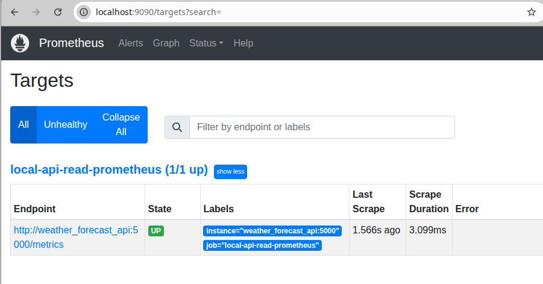

### Info

refactored replica of [WesleySkeen/Grafana-Data-Sources](https://github.com/WesleySkeen/Grafana-Data-Sources)


### Usage
```sh
docker pull mcr.microsoft.com/dotnet/sdk:6.0
docker pull mcr.microsoft.com/dotnet/sdk:6.0
docker pull prom/prometheus:v2.41.0
docker pull grafana/promtail:2.5.0
docker pull grafana/loki:2.5.0
docker pull grafana/grafana:10.4.13
docker pull openzipkin/zipkin
docker pull jaegertracing/all-in-one:latest
docker pull jaegertracing/example-hotrod:latest
```

```
pushd app
docker build --pull --no-cache -t weather_forecast_api -f Dockerfile .
```
```sh
docker-compose -f docker-compose.yml --build -d up
```

```shell
curl http://localhost:4000/metrics
```
```text
# TYPE process_runtime_dotnet_gc_collections_count counter
# HELP process_runtime_dotnet_gc_collections_count Number of garbage collections that have occurred since process start.
process_runtime_dotnet_gc_collections_count{generation="gen2"} 0 1776624150749
process_runtime_dotnet_gc_collections_count{generation="gen1"} 0 1776624150749
process_runtime_dotnet_gc_collections_count{generation="gen0"} 0 1776624150749
...
# TYPE process_runtime_dotnet_assemblies_count gauge
# HELP process_runtime_dotnet_assemblies_count The number of .NET assemblies that are currently loaded.
process_runtime_dotnet_assemblies_count 147 1776624150749

# TYPE process_runtime_dotnet_exceptions_count counter
# HELP process_runtime_dotnet_exceptions_count Count of exceptions that have been thrown in managed code, since the observation started. The value will be unavailable until an exception has been thrown after OpenTelemetry.Instrumentation.Runtime initialization.
process_runtime_dotnet_exceptions_count 1 1776624150749

# EOF
```

To confirm promethius can access the API metric scraping endpoint, browse to Browse to the `http://localhost:9090/targets` You should see 




### Note

```text
ERROR: Named volume "prometheus/prometheus.yml:/etc/prometheus/prometheus.yml:ro" is used in service "prometheus" but no declaration was found in the volumes section
```
* heavy volume usage leads to some nodes exiting
```sh
docker-compose logs grafana
```
```text
mkdir: can't create directory '/var/lib/grafana/plugins': Permission denied
grafana_1               | GF_PATHS_DATA='/var/lib/grafana' is not writable.
```

```sh
docker-compose logs loki
```
```text
loki_1                  | failed parsing config: read /etc/loki/local-config.yml: is a directory
```
