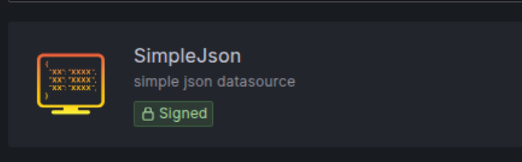
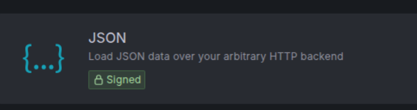

### Info 

replica of [Opvolger/json.grafana.datasources](https://github.com/Opvolger/json.grafana.datasources) a [simple-json](https://github.com/grafana/simple-json-backend-datasource)(NOTE: deprecated in favor []()) datasource with alerting support- requires one to run own REST http 1.1 server
### Usage

NOTE: now installation of the now legacy plugin on the Grafana node may be required:

```sh
grafana-cli plugins install grafana-simple-json-datasource
```

### Data initial table load /info
Post the following info into `http://localhost:8181/storedata/set_info`, or via [swagger](http://localhost:8181/swagger)

```json
{
  "name": "test_enkel",
  "info": {
    "description": "Overzicht voor test_enkel",
    "type": "default"
  },
  "table": [
    {
        "jsonvalue":  "key",
        "type":  "string",
        "text":  "Machinename"
    },
    {
        "jsonvalue":  "kolom_bool",
        "type":  "bool",
        "text":  "bool kolom"
    },
    {
        "jsonvalue":  "kolom_time",
        "type":  "time",
        "text":  "tijd kolom"
    },
    {
        "jsonvalue":  "kolom_string",
        "type":  "string",
        "text":  "string kolom"
    }
  ]
}
```
This will lead to creation of a 'test' directory within the data folder, containing two files: `table.json` and `info.json`.

### Sending Data

POST the following information to [storedata/send_data](http://localhost:8181/storedata/send_data); this can be done via [Swagger](http://localhost:8181/swagger).

```json
{
  "name": "test_enkel",
  "json_data": [ 
    { "key": "machine1", "kolom_bool": true, "kolom_time": "2020-10-27T21:24:31.78Z", "kolom_string": "iets" },
    { "key": "machine2", "kolom_bool": true, "kolom_time": "2020-10-27T21:24:31.78Z", "kolom_string": "iets meer" },
    { "key": "machine3", "kolom_bool": false, "kolom_time": "2020-10-28T21:24:31.78Z", "kolom_string": "iets minder" },
    { "key": "machine4", "kolom_bool": false, "kolom_time": "2020-11-27T21:24:31.78Z", "kolom_string": "niets" },
    { "key": "machine5", "kolom_bool": true, "kolom_time": "2019-10-27T21:24:31.78Z", "kolom_string": "hoi iets" }
  ] 
}
```

For futher information see original project.

### Troubleshooting

Error in runtime, after seeing node 'UP' for a little while:
```text
jsongrafanadatasources | crit: Microsoft.AspNetCore.Hosting.Diagnostics[6]
jsongrafanadatasources |       Application startup exception
jsongrafanadatasources |       System.InvalidOperationException: Endpoint Routing does not support 'IApplicationBuilder.UseMvc(...)'. To use 'IApplicationBuilder.UseMvc' set 'MvcOptions.EnableEndpointRouting = false' inside 'ConfigureServices(...).
jsongrafanadatasources |          at Microsoft.AspNetCore.Builder.MvcApplicationBuilderExtensions.UseMvc(IApplicationBuilder app, Action`1 configureRoutes)
jsongrafanadatasources |          at Microsoft.AspNetCore.Builder.MvcApplicationBuilderExtensions.UseMvc(IApplicationBuilder app)
jsongrafanadatasources |          at Json.Grafana.DataSources.Startup.Configure(IApplicationBuilder app, IHostingEnvironment env) in /src/json.grafana.datasources/Startup.cs:line 73
jsongrafanadatasources |          at System.RuntimeMethodHandle.InvokeMethod(Object target, Span`1& arguments, Signature sig, Boolean constructor, Boolean wrapExceptions)
jsongrafanadatasources |          at System.Reflection.RuntimeMethodInfo.Invoke(Object obj, BindingFlags invokeAttr, Binder binder, Object[] parameters, CultureInfo culture)
jsongrafanadatasources |          at Microsoft.AspNetCore.Hosting.ConfigureBuilder.Invoke(Object instance, IApplicationBuilder builder)
jsongrafanadatasources |          at Microsoft.AspNetCore.Hosting.ConfigureBuilder.<>c__DisplayClass4_0.<Build>b__0(IApplicationBuilder builder)
jsongrafanadatasources |          at Microsoft.AspNetCore.Hosting.ConventionBasedStartup.Configure(IApplicationBuilder app)
jsongrafanadatasources |          at Microsoft.AspNetCore.Mvc.Filters.MiddlewareFilterBuilderStartupFilter.<>c__DisplayClass0_0.<Configure>g__MiddlewareFilterBuilder|0(IApplicationBuilder builder)
jsongrafanadatasources |          at Microsoft.AspNetCore.HostFilteringStartupFilter.<>c__DisplayClass0_0.<Configure>b__0(IApplicationBuilder app)
jsongrafanadatasources |          at Microsoft.AspNetCore.Hosting.WebHost.BuildApplication()
jsongrafanadatasources | Unhandled exception. System.InvalidOperationException: Endpoint Routing does not support 'IApplicationBuilder.UseMvc(...)'. To use 'IApplicationBuilder.UseMvc' set 'MvcOptions.EnableEndpointRouting = false' inside 'ConfigureServices(...).
jsongrafanadatasources |    at Microsoft.AspNetCore.Builder.MvcApplicationBuilderExtensions.UseMvc(IApplicationBuilder app, Action`1 configureRoutes)
jsongrafanadatasources |    at Microsoft.AspNetCore.Builder.MvcApplicationBuilderExtensions.UseMvc(IApplicationBuilder app)
jsongrafanadatasources |    at Json.Grafana.DataSources.Startup.Configure(IApplicationBuilder app, IHostingEnvironment env) in /src/json.grafana.datasources/Startup.cs:line 73
jsongrafanadatasources |    at System.RuntimeMethodHandle.InvokeMethod(Object target, Span`1& arguments, Signature sig, Boolean constructor, Boolean wrapExceptions)
jsongrafanadatasources |    at System.Reflection.RuntimeMethodInfo.Invoke(Object obj, BindingFlags invokeAttr, Binder binder, Object[] parameters, CultureInfo culture)
jsongrafanadatasources |    at Microsoft.AspNetCore.Hosting.ConfigureBuilder.Invoke(Object instance, IApplicationBuilder builder)
jsongrafanadatasources |    at Microsoft.AspNetCore.Hosting.ConfigureBuilder.<>c__DisplayClass4_0.<Build>b__0(IApplicationBuilder builder)
jsongrafanadatasources |    at Microsoft.AspNetCore.Hosting.ConventionBasedStartup.Configure(IApplicationBuilder app)
jsongrafanadatasources |    at Microsoft.AspNetCore.Mvc.Filters.MiddlewareFilterBuilderStartupFilter.<>c__DisplayClass0_0.<Configure>g__MiddlewareFilterBuilder|0(IApplicationBuilder builder)
jsongrafanadatasources |    at Microsoft.AspNetCore.HostFilteringStartupFilter.<>c__DisplayClass0_0.<Configure>b__0(IApplicationBuilder app)
jsongrafanadatasources |    at Microsoft.AspNetCore.Hosting.WebHost.BuildApplication()
jsongrafanadatasources |    at Microsoft.AspNetCore.Hosting.WebHost.StartAsync(CancellationToken cancellationToken)
jsongrafanadatasources |    at Microsoft.AspNetCore.Hosting.WebHostExtensions.RunAsync(IWebHost host, CancellationToken token, String startupMessage)
jsongrafanadatasources |    at Microsoft.AspNetCore.Hosting.WebHostExtensions.RunAsync(IWebHost host, CancellationToken token, String startupMessage)
jsongrafanadatasources |    at Microsoft.AspNetCore.Hosting.WebHostExtensions.RunAsync(IWebHost host, CancellationToken token)
jsongrafanadatasources |    at Microsoft.AspNetCore.Hosting.WebHostExtensions.Run(IWebHost host)
jsongrafanadatasources |    at Json.Grafana.DataSources.Program.Main(String[] args) in /src/json.grafana.datasources/Program.cs:line 10
jsongrafanadatasources | Application startup exception: System.InvalidOperationException: Endpoint Routing does not support 'IApplicationBuilder.UseMvc(...)'. To use 'IApplicationBuilder.UseMvc' set 'MvcOptions.EnableEndpointRouting = false' inside 'ConfigureServices(...).
jsongrafanadatasources |    at Microsoft.AspNetCore.Builder.MvcApplicationBuilderExtensions.UseMvc(IApplicationBuilder app, Action`1 configureRoutes)
jsongrafanadatasources |    at Microsoft.AspNetCore.Builder.MvcApplicationBuilderExtensions.UseMvc(IApplicationBuilder app)
jsongrafanadatasources |    at Json.Grafana.DataSources.Startup.Configure(IApplicationBuilder app, IHostingEnvironment env) in /src/json.grafana.datasources/Startup.cs:line 73
jsongrafanadatasources |    at System.RuntimeMethodHandle.InvokeMethod(Object target, Span`1& arguments, Signature sig, Boolean constructor, Boolean wrapExceptions)
jsongrafanadatasources |    at System.Reflection.RuntimeMethodInfo.Invoke(Object obj, BindingFlags invokeAttr, Binder binder, Object[] parameters, CultureInfo culture)
jsongrafanadatasources |    at Microsoft.AspNetCore.Hosting.ConfigureBuilder.Invoke(Object instance, IApplicationBuilder builder)
jsongrafanadatasources |    at Microsoft.AspNetCore.Hosting.ConfigureBuilder.<>c__DisplayClass4_0.<Build>b__0(IApplicationBuilder builder)
jsongrafanadatasources |    at Microsoft.AspNetCore.Hosting.ConventionBasedStartup.Configure(IApplicationBuilder app)
jsongrafanadatasources |    at Microsoft.AspNetCore.Mvc.Filters.MiddlewareFilterBuilderStartupFilter.<>c__DisplayClass0_0.<Configure>g__MiddlewareFilterBuilder|0(IApplicationBuilder builder)
jsongrafanadatasources |    at Microsoft.AspNetCore.HostFilteringStartupFilter.<>c__DisplayClass0_0.<Configure>b__0(IApplicationBuilder app)
jsongrafanadatasources |    at Microsoft.AspNetCore.Hosting.WebHost.BuildApplication()
```

after fixing the bootstrap code, the excetpion becomes

```text
rces | crit: Microsoft.AspNetCore.Hosting.Diagnostics[6]
jsongrafanadatasources |       Application startup exception
jsongrafanadatasources |       System.MissingMethodException: Method not found: 'Void Microsoft.AspNetCore.StaticFiles.StaticFileMiddleware..ctor(Microsoft.AspNetCore.Http.RequestDelegate, Microsoft.AspNetCore.Hosting.IHostingEnvironment, Microsoft.Extensions.Options.IOptions`1<Microsoft.AspNetCore.Builder.StaticFileOptions>, Microsoft.Extensions.Logging.ILoggerFactory)'.
jsongrafanadatasources |          at Swashbuckle.AspNetCore.SwaggerUI.SwaggerUIMiddleware.CreateStaticFileMiddleware(RequestDelegate next, IHostingEnvironment hostingEnv, ILoggerFactory loggerFactory, SwaggerUIOptions options)
jsongrafanadatasources |          at Swashbuckle.AspNetCore.SwaggerUI.SwaggerUIMiddleware..ctor(RequestDelegate next, IHostingEnvironment hostingEnv, ILoggerFactory loggerFactory, SwaggerUIOptions options)
jsongrafanadatasources |          at System.RuntimeMethodHandle.InvokeMethod(Object target, Span`1& arguments, Signature sig, Boolean constructor, Boolean wrapExceptions)
jsongrafanadatasources |          at System.Reflection.RuntimeConstructorInfo.Invoke(BindingFlags invokeAttr, Binder binder, Object[] parameters, CultureInfo culture)
jsongrafanadatasources |          at Microsoft.Extensions.Internal.ActivatorUtilities.ConstructorMatcher.CreateInstance(IServiceProvider provider)
jsongrafanadatasources |          at Microsoft.Extensions.Internal.ActivatorUtilities.CreateInstance(IServiceProvider provider, Type instanceType, Object[] parameters)
jsongrafanadatasources |          at Microsoft.AspNetCore.Builder.UseMiddlewareExtensions.<>c__DisplayClass5_0.<UseMiddleware>b__0(RequestDelegate next)
jsongrafanadatasources |          at Microsoft.AspNetCore.Builder.ApplicationBuilder.Build()
jsongrafanadatasources |          at Microsoft.AspNetCore.Hosting.WebHost.BuildApplication()
jsongrafanadatasources | Unhandled exception. System.MissingMethodException: Method not found: 'Void Microsoft.AspNetCore.StaticFiles.StaticFileMiddleware..ctor(Microsoft.AspNetCore.Http.RequestDelegate, Microsoft.AspNetCore.Hosting.IHostingEnvironment, Microsoft.Extensions.Options.IOptions`1<Microsoft.AspNetCore.Builder.StaticFileOptions>, Microsoft.Extensions.Logging.ILoggerFactory)'.
jsongrafanadatasources |    at Swashbuckle.AspNetCore.SwaggerUI.SwaggerUIMiddleware.CreateStaticFileMiddleware(RequestDelegate next, IHostingEnvironment hostingEnv, ILoggerFactory loggerFactory, SwaggerUIOptions options)
jsongrafanadatasources |    at Swashbuckle.AspNetCore.SwaggerUI.SwaggerUIMiddleware..ctor(RequestDelegate next, IHostingEnvironment hostingEnv, ILoggerFactory loggerFactory, SwaggerUIOptions options)
jsongrafanadatasources |    at System.RuntimeMethodHandle.InvokeMethod(Object target, Span`1& arguments, Signature sig, Boolean constructor, Boolean wrapExceptions)
jsongrafanadatasources |    at System.Reflection.RuntimeConstructorInfo.Invoke(BindingFlags invokeAttr, Binder binder, Object[] parameters, CultureInfo culture)
jsongrafanadatasources |    at Microsoft.Extensions.Internal.ActivatorUtilities.ConstructorMatcher.CreateInstance(IServiceProvider provider)
jsongrafanadatasources |    at Microsoft.Extensions.Internal.ActivatorUtilities.CreateInstance(IServiceProvider provider, Type instanceType, Object[] parameters)
jsongrafanadatasources |    at Microsoft.AspNetCore.Builder.UseMiddlewareExtensions.<>c__DisplayClass5_0.<UseMiddleware>b__0(RequestDelegate next)
jsongrafanadatasources |    at Microsoft.AspNetCore.Builder.ApplicationBuilder.Build()
jsongrafanadatasources |    at Microsoft.AspNetCore.Hosting.WebHost.BuildApplication()
jsongrafanadatasources |    at Microsoft.AspNetCore.Hosting.WebHost.StartAsync(CancellationToken cancellationToken)
jsongrafanadatasources |    at Microsoft.AspNetCore.Hosting.WebHostExtensions.RunAsync(IWebHost host, CancellationToken token, String startupMessage)
jsongrafanadatasources |    at Microsoft.AspNetCore.Hosting.WebHostExtensions.RunAsync(IWebHost host, CancellationToken token, String startupMessage)
jsongrafanadatasources |    at Microsoft.AspNetCore.Hosting.WebHostExtensions.RunAsync(IWebHost host, CancellationToken token)
jsongrafanadatasources |    at Microsoft.AspNetCore.Hosting.WebHostExtensions.Run(IWebHost host)
jsongrafanadatasources |    at Json.Grafana.DataSources.Program.Main(String[] args) in /src/json.grafana.datasources/Program.cs:line 10
jsongrafanadatasources exited with code 139 
```
```sh
docker-compose ps
```
```text
                   Name                                 Command               State               Ports
-------------------------------------------------------------------------------------------------------------------
basic-aspnetcore-json-datasource_grafana_1   /run.sh                          Up      0.0.0.0:8182->3000/tcp
jsongrafanadatasources                       dotnet Json.Grafana.DataSo ...   Up      443/tcp, 0.0.0.0:8181->80/tcp
```
### Simplifying the Project Folder Structure and Settings

```sh
jq '.profiles.Program' < Program/Properties/launchSettings.json
```
```json
{
  "commandName": "Project",
  "applicationUrl": "http://localhost:5000",
  "environmentVariables": {
    "ASPNETCORE_ENVIRONMENT": "Development"
  }
}
```
### Download Grafana JSON Data Source Plugin

> NOTE The instructions below actually install the newer JSON API Grafana Plugin [sompod-json-datasource](https://grafana.com/grafana/plugins/simpod-json-datasource/)
- not the Simple JSON Data Source


```sh
curl -skLo simpod-json-datasource.zip https://grafana.com/api/plugins/simpod-json-datasource/versions/0.6.7/download 
unzip -x simpod-json-datasource.zip
```
```sh
docker-compose cp simpod-json-datasource grafana:/var/lib/grafana/plugins/simpod-json-datasource
```
> NOTE: `docker-compose` did not support `cp` before __2.x__ release

```sh
ID=$(docker container ls | grep grafana_1 | awk '{print $1}')
docker cp simpod-json-datasource $ID:/var/lib/grafana/plugins/simpod-json-datasource
docker cp grafana-simple-json-datasource $ID:/var/lib/grafana/plugins/grafana-simple-json-datasource
```
> NOTE: restart the Grafana server. Grafana loads plugins into memory during its startup sequence; it does not automatically scan the directory for new content while running

```sh
docker-compose stop grafana
docker-compose start grafana
```

>NOTE: It appears that newer Grafana only listens to IP6:
```sh
docker exec -it $ID sh
```

```sh
apt-get install -y -q net-tools curl
netstat -ant
```
```text
tcp        0      0 127.0.0.11:41449        0.0.0.0:*               LISTEN      
tcp        0      0 172.21.0.2:54820        34.120.177.193:443      ESTABLISHED 
tcp        0      0 172.21.0.2:54816        34.120.177.193:443      ESTABLISHED 
tcp        0      0 :::3000                 :::*                    LISTEN   
```

need to explicitly set `GF_SERVER_HTTP_ADDR` envoronment in `docker-compose.yaml`

Alternatively (if not air-gapped) may install `grafana-simple-json-datasource` in traditional way:
```sh
docker exec -it $ID sh
```
```sh
grafana-cli plugins install grafana-simple-json-datasource
```
```text
Deprecation warning: The standalone 'grafana-cli' program is deprecated and will be removed in the future. Please update all uses of 'grafana-cli' to 'grafana cli'
✔ Downloaded and extracted grafana-simple-json-datasource v1.4.2 zip successfully to /var/lib/grafana/plugins/grafana-simple-json-datasource
```

```sh
docker cp $ID:/var/lib/grafana/plugins/grafana-simple-json-datasource ./grafana-simple-json-datasource
```
```text
Successfully copied 87kB to /home/sergueik/src/springboot_study/basic-aspnetcore-json-datasource/grafana-simple-json-datasource
```

```sh
docker-compose restart grafana
```
```text
Restarting basic-aspnetcore-json-datasource_grafana_1 ... done
```


Alternarively copy the directory

`https://github.com/grafana/simple-json-datasource/tree/master/dist`:
```sh
./restore.sh grafana simple-json-datasource dist master simple-json-datasource
```
```text
dist/README.md
dist/css/query-editor.css
dist/datasource.js
dist/datasource.js.map
dist/img/simpleJson_logo.svg
dist/module.js
dist/module.js.map
dist/partials/annotations.editor.html
dist/partials/config.html
dist/partials/query.editor.html
dist/partials/query.options.html
dist/plugin.json
dist/query_ctrl.js
dist/query_ctrl.js.map
Restoring: dist/README.md
From: https://raw.githubusercontent.com/grafana/simple-json-datasource/master/dist/README.md
curl -fsSL https://raw.githubusercontent.com/grafana/simple-json-datasource/master/dist/README.md -o simple-json-datasource/dist/README.md
Restoring: dist/css/query-editor.css
From: https://raw.githubusercontent.com/grafana/simple-json-datasource/master/dist/css/query-editor.css
curl -fsSL https://raw.githubusercontent.com/grafana/simple-json-datasource/master/dist/css/query-editor.css -o simple-json-datasource/dist/css/query-editor.css
Restoring: dist/datasource.js
From: https://raw.githubusercontent.com/grafana/simple-json-datasource/master/dist/datasource.js
curl -fsSL https://raw.githubusercontent.com/grafana/simple-json-datasource/master/dist/datasource.js -o simple-json-datasource/dist/datasource.js
Restoring: dist/datasource.js.map
From: https://raw.githubusercontent.com/grafana/simple-json-datasource/master/dist/datasource.js.map
curl -fsSL https://raw.githubusercontent.com/grafana/simple-json-datasource/master/dist/datasource.js.map -o simple-json-datasource/dist/datasource.js.map
Restoring: dist/img/simpleJson_logo.svg
From: https://raw.githubusercontent.com/grafana/simple-json-datasource/master/dist/img/simpleJson_logo.svg
curl -fsSL https://raw.githubusercontent.com/grafana/simple-json-datasource/master/dist/img/simpleJson_logo.svg -o simple-json-datasource/dist/img/simpleJson_logo.svg
Restoring: dist/module.js
From: https://raw.githubusercontent.com/grafana/simple-json-datasource/master/dist/module.js
curl -fsSL https://raw.githubusercontent.com/grafana/simple-json-datasource/master/dist/module.js -o simple-json-datasource/dist/module.js
Restoring: dist/module.js.map
From: https://raw.githubusercontent.com/grafana/simple-json-datasource/master/dist/module.js.map
curl -fsSL https://raw.githubusercontent.com/grafana/simple-json-datasource/master/dist/module.js.map -o simple-json-datasource/dist/module.js.map
Restoring: dist/partials/annotations.editor.html
From: https://raw.githubusercontent.com/grafana/simple-json-datasource/master/dist/partials/annotations.editor.html
curl -fsSL https://raw.githubusercontent.com/grafana/simple-json-datasource/master/dist/partials/annotations.editor.html -o simple-json-datasource/dist/partials/annotations.editor.html
Restoring: dist/partials/config.html
From: https://raw.githubusercontent.com/grafana/simple-json-datasource/master/dist/partials/config.html
curl -fsSL https://raw.githubusercontent.com/grafana/simple-json-datasource/master/dist/partials/config.html -o simple-json-datasource/dist/partials/config.html
Restoring: dist/partials/query.editor.html
From: https://raw.githubusercontent.com/grafana/simple-json-datasource/master/dist/partials/query.editor.html
curl -fsSL https://raw.githubusercontent.com/grafana/simple-json-datasource/master/dist/partials/query.editor.html -o simple-json-datasource/dist/partials/query.editor.html
Restoring: dist/partials/query.options.html
From: https://raw.githubusercontent.com/grafana/simple-json-datasource/master/dist/partials/query.options.html
curl -fsSL https://raw.githubusercontent.com/grafana/simple-json-datasource/master/dist/partials/query.options.html -o simple-json-datasource/dist/partials/query.options.html
Restoring: dist/plugin.json
From: https://raw.githubusercontent.com/grafana/simple-json-datasource/master/dist/plugin.json
curl -fsSL https://raw.githubusercontent.com/grafana/simple-json-datasource/master/dist/plugin.json -o simple-json-datasource/dist/plugin.json
Restoring: dist/query_ctrl.js
From: https://raw.githubusercontent.com/grafana/simple-json-datasource/master/dist/query_ctrl.js
curl -fsSL https://raw.githubusercontent.com/grafana/simple-json-datasource/master/dist/query_ctrl.js -o simple-json-datasource/dist/query_ctrl.js
Restoring: dist/query_ctrl.js.map
From: https://raw.githubusercontent.com/grafana/simple-json-datasource/master/dist/query_ctrl.js.map
curl -fsSL https://raw.githubusercontent.com/grafana/simple-json-datasource/master/dist/query_ctrl.js.map -o simple-json-datasource/dist/query_ctrl.js.map
```

examine the `app`:
```sh
curl -s http://localhost:8181/swagger/v1/swagger.json | jq '.'
```
```json
{
  "openapi": "3.0.1",
  "info": {
    "title": "Json Grafana DataSources",
    "version": "v1"
  },
  "paths": {
    "/export/json/{name}/{date}": {
      "get": {
        "tags": [
          "Export"
        ],
        "parameters": [
          {
            "name": "name",
            "in": "path",
            "required": true,
            "schema": {
              "type": "string"
            }
          },
          {
            "name": "date",
            "in": "path",
            "required": true,
            "schema": {
              "type": "string",
              "format": "date-time"
            }
          }
        ],
        "responses": {
          "200": {
            "description": "Success",
            "content": {
              "text/plain": {
                "schema": {
                  "$ref": "#/components/schemas/JsonExport"
                }
              },
              "application/json": {
                "schema": {
                  "$ref": "#/components/schemas/JsonExport"
                }
              },
              "text/json": {
                "schema": {
                  "$ref": "#/components/schemas/JsonExport"
                }
              }
            }
          }
        }
      }
    },
    "/export/csv/{name}/{date}": {
      "get": {
        "tags": [
          "Export"
        ],
        "parameters": [
          {
            "name": "name",
            "in": "path",
            "required": true,
            "schema": {
              "type": "string"
            }
          },
          {
            "name": "date",
            "in": "path",
            "required": true,
            "schema": {
              "type": "string",
              "format": "date-time"
            }
          }
        ],
        "responses": {
          "200": {
            "description": "Success"
          }
        }
      }
    },
    "/simpeljson": {
      "get": {
        "tags": [
          "SimpelJson"
        ],
        "responses": {
          "200": {
            "description": "Success",
            "content": {
              "text/plain": {
                "schema": {
                  "type": "string"
                }
              },
              "application/json": {
                "schema": {
                  "type": "string"
                }
              },
              "text/json": {
                "schema": {
                  "type": "string"
                }
              }
            }
          }
        }
      }
    },
    "/simpeljson/search": {
      "post": {
        "tags": [
          "SimpelJson"
        ],
        "responses": {
          "200": {
            "description": "Success",
            "content": {
              "application/json": {
                "schema": {
                  "type": "array",
                  "items": {
                    "type": "string"
                  }
                }
              }
            }
          }
        }
      }
    },
    "/simpeljson/annotations": {
      "post": {
        "tags": [
          "SimpelJson"
        ],
        "requestBody": {
          "content": {
            "application/json-patch+json": {
              "schema": {}
            },
            "application/json": {
              "schema": {}
            },
            "text/json": {
              "schema": {}
            },
            "application/*+json": {
              "schema": {}
            }
          }
        },
        "responses": {
          "200": {
            "description": "Success",
            "content": {
              "application/json": {
                "schema": {
                  "type": "array",
                  "items": {
                    "$ref": "#/components/schemas/TimeSerie"
                  }
                }
              }
            }
          }
        }
      }
    },
    "/simpeljson/query": {
      "post": {
        "tags": [
          "SimpelJson"
        ],
        "requestBody": {
          "content": {
            "application/json-patch+json": {
              "schema": {}
            },
            "application/json": {
              "schema": {}
            },
            "text/json": {
              "schema": {}
            },
            "application/*+json": {
              "schema": {}
            }
          }
        },
        "responses": {
          "200": {
            "description": "Success",
            "content": {
              "application/json": {
                "schema": {
                  "type": "array",
                  "items": {
                    "$ref": "#/components/schemas/Table"
                  }
                }
              }
            }
          },
          "500": {
            "description": "Server Error"
          }
        }
      }
    },
    "/storedata/{name}": {
      "get": {
        "tags": [
          "StoreData"
        ],
        "parameters": [
          {
            "name": "name",
            "in": "path",
            "required": true,
            "schema": {
              "type": "string"
            }
          }
        ],
        "responses": {
          "200": {
            "description": "Success",
            "content": {
              "application/json": {
                "schema": {
                  "$ref": "#/components/schemas/GetInfo"
                }
              }
            }
          }
        }
      }
    },
    "/storedata/set_info": {
      "post": {
        "tags": [
          "StoreData"
        ],
        "requestBody": {
          "content": {
            "application/json-patch+json": {
              "schema": {
                "$ref": "#/components/schemas/GetInfo"
              }
            },
            "application/json": {
              "schema": {
                "$ref": "#/components/schemas/GetInfo"
              }
            },
            "text/json": {
              "schema": {
                "$ref": "#/components/schemas/GetInfo"
              }
            },
            "application/*+json": {
              "schema": {
                "$ref": "#/components/schemas/GetInfo"
              }
            }
          }
        },
        "responses": {
          "200": {
            "description": "Success"
          }
        }
      }
    },
    "/storedata/send_data": {
      "post": {
        "tags": [
          "StoreData"
        ],
        "requestBody": {
          "content": {
            "application/json-patch+json": {
              "schema": {
                "$ref": "#/components/schemas/SendData"
              }
            },
            "application/json": {
              "schema": {
                "$ref": "#/components/schemas/SendData"
              }
            },
            "text/json": {
              "schema": {
                "$ref": "#/components/schemas/SendData"
              }
            },
            "application/*+json": {
              "schema": {
                "$ref": "#/components/schemas/SendData"
              }
            }
          }
        },
        "responses": {
          "200": {
            "description": "Success"
          }
        }
      }
    },
    "/storedatakeyvalue/{name}": {
      "get": {
        "tags": [
          "StoreDataKeyValue"
        ],
        "parameters": [
          {
            "name": "name",
            "in": "path",
            "required": true,
            "schema": {
              "type": "string"
            }
          }
        ],
        "responses": {
          "200": {
            "description": "Success",
            "content": {
              "application/json": {
                "schema": {
                  "$ref": "#/components/schemas/GetInfo"
                }
              }
            }
          }
        }
      }
    },
    "/storedatakeyvalue/set_info": {
      "post": {
        "tags": [
          "StoreDataKeyValue"
        ],
        "requestBody": {
          "content": {
            "application/json-patch+json": {
              "schema": {
                "$ref": "#/components/schemas/GetInfo"
              }
            },
            "application/json": {
              "schema": {
                "$ref": "#/components/schemas/GetInfo"
              }
            },
            "text/json": {
              "schema": {
                "$ref": "#/components/schemas/GetInfo"
              }
            },
            "application/*+json": {
              "schema": {
                "$ref": "#/components/schemas/GetInfo"
              }
            }
          }
        },
        "responses": {
          "200": {
            "description": "Success"
          }
        }
      }
    },
    "/storedatakeyvalue/send_data": {
      "post": {
        "tags": [
          "StoreDataKeyValue"
        ],
        "requestBody": {
          "content": {
            "application/json-patch+json": {
              "schema": {
                "$ref": "#/components/schemas/SendKeyValueData"
              }
            },
            "application/json": {
              "schema": {
                "$ref": "#/components/schemas/SendKeyValueData"
              }
            },
            "text/json": {
              "schema": {
                "$ref": "#/components/schemas/SendKeyValueData"
              }
            },
            "application/*+json": {
              "schema": {
                "$ref": "#/components/schemas/SendKeyValueData"
              }
            }
          }
        },
        "responses": {
          "200": {
            "description": "Success"
          }
        }
      }
    }
  },
  "components": {
    "schemas": {
      "GetInfo": {
        "type": "object",
        "properties": {
          "name": {
            "type": "string",
            "nullable": true
          },
          "info": {
            "$ref": "#/components/schemas/GetInfoJson"
          },
          "table": {
            "type": "array",
            "items": {
              "$ref": "#/components/schemas/InfoJsonColumn"
            },
            "nullable": true
          }
        },
        "additionalProperties": false
      },
      "GetInfoJson": {
        "type": "object",
        "properties": {
          "description": {
            "type": "string",
            "nullable": true
          },
          "type": {
            "$ref": "#/components/schemas/TypeData"
          }
        },
        "additionalProperties": false
      },
      "InfoJsonColumn": {
        "type": "object",
        "properties": {
          "jsonValue": {
            "type": "string",
            "nullable": true
          },
          "type": {
            "$ref": "#/components/schemas/TypeDataColumn"
          },
          "text": {
            "type": "string",
            "nullable": true
          }
        },
        "additionalProperties": false
      },
      "JsonExport": {
        "type": "object",
        "properties": {
          "name": {
            "type": "string",
            "nullable": true
          },
          "json_data": {
            "$ref": "#/components/schemas/Table"
          },
          "info": {
            "$ref": "#/components/schemas/GetInfoJson"
          }
        },
        "additionalProperties": false
      },
      "SendData": {
        "type": "object",
        "properties": {
          "name": {
            "type": "string",
            "nullable": true
          },
          "json_data": {
            "nullable": true
          }
        },
        "additionalProperties": false
      },
      "SendKeyValueData": {
        "type": "object",
        "properties": {
          "name": {
            "type": "string",
            "nullable": true
          },
          "json_data": {
            "nullable": true
          },
          "subject": {
            "type": "string",
            "nullable": true
          }
        },
        "additionalProperties": false
      },
      "Table": {
        "type": "object",
        "properties": {
          "columns": {
            "type": "array",
            "items": {
              "$ref": "#/components/schemas/InfoJsonColumn"
            },
            "nullable": true
          },
          "rows": {
            "type": "array",
            "items": {},
            "nullable": true
          },
          "type": {
            "type": "string",
            "nullable": true
          }
        },
        "additionalProperties": false
      },
      "TimeSerie": {
        "type": "object",
        "properties": {
          "target": {
            "type": "string",
            "nullable": true
          },
          "datapoints": {
            "type": "array",
            "items": {
              "type": "array",
              "items": {
                "type": "number",
                "format": "float"
              }
            },
            "nullable": true
          }
        },
        "additionalProperties": false
      },
      "TypeData": {
        "enum": [
          0,
          1
        ],
        "type": "integer",
        "format": "int32"
      },
      "TypeDataColumn": {
        "enum": [
          0,
          1,
          2,
          3
        ],
        "type": "integer",
        "format": "int32"
      }
    }
  }
}
```
Configure __SimpleJson__ data source in __Grafana__




>NOTE: not __JSON__:



Enter `http://app:80/simpeljson` in __URL__. __Save &amp; test__ should report `Data source is working` 


### See Also

  * [simple-json-backend-datasource](https://github.com/grafana/simple-json-backend-datasource)
  * [fake datasource for grafana-simplejson](https://github.com/bergquist/fake-simple-json-datasource)
  * grafana __JSON Datasource__ [Golang implementation](https://github.com/smcquay/jsonds)
  * yet another JSON DataSource [grafana plugin](https://grafana.com/grafana/plugins/marcusolsson-json-datasource/) - this plugin is now in maintenance mode, no new features will be added
 * Grafana Infinity Datasource [grafana plugin](https://grafana.com/grafana/plugins/yesoreyeram-infinity-datasource/) - visualize data from JSON, CSV, XML, GraphQL and HTML endpoints. 


### Author

[Serguei Kouzmine](kouzmine_serguei@yahoo.com)
