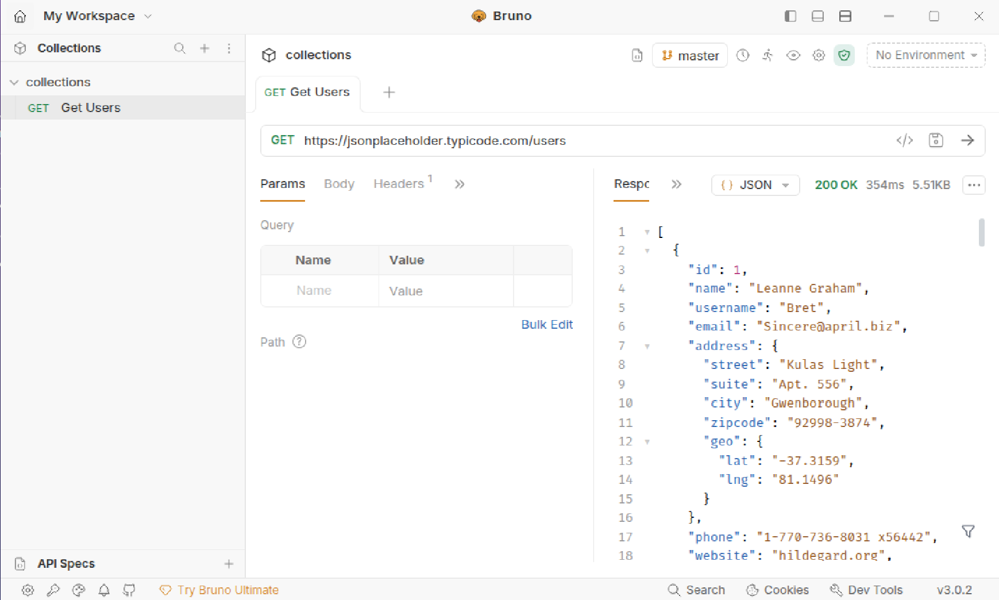
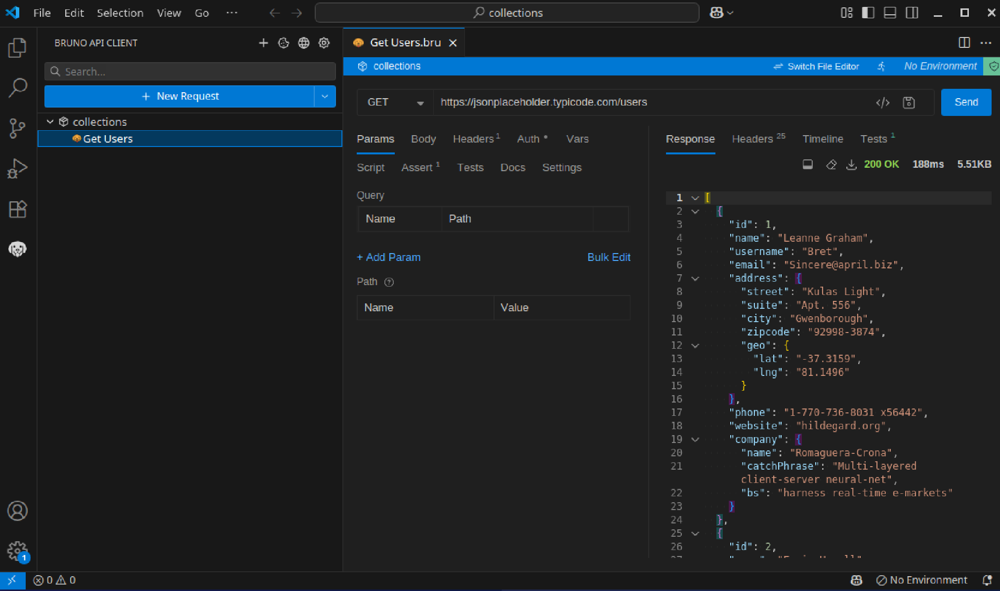

### Info

This directory contains basic bruno install for educational [](https://docs.usebruno.com/)
There is no
The `Dockerfile` is presumably from [https://github.com/alpine-docker/multi-arch-docker-images/blob/master/bruno/Dockerfile](https://github.com/alpine-docker/multi-arch-docker-images/blob/master/bruno/Dockerfile)

It is simply an `npm install`: 

### Testing

* download __Bruno CLI__ image
```sh
VERSION=1.16.0
VERSION=1.30.0
docker pull alpine/bruno:$VERSION
```
> NOTE: image size - moderately heavy (for a CLI app, that is)
```sh
VERSION=1.30.0
docker run -it --rm -v "$(pwd)/collections":/apps -w /apps alpine/bruno:$VERSION run --env=dev
```

> NOTE:  the instruction on docker hub lacks port info

also the command will fail with
```text
You can run only at the root of a collection
```  
To workaround, install bruno on the host sysem following the standalonge 
___Linux Install Instructions__ [page](https://docs.usebruno.com/get-started/bruno-basics/download#using-package-managers-1) copied below

```sh
curl -skfSL "https://keyserver.ubuntu.com/pks/lookup?op=get&search=0x9FA6017ECABE0266" | gpg --dearmor | sudo tee /etc/apt/keyrings/bruno.gpg > /dev/null 
sudo chmod 644 /etc/apt/keyrings/bruno.gpg 
echo "deb [arch=amd64 signed-by=/etc/apt/keyrings/bruno.gpg] http://debian.usebruno.com/ bruno stable" | sudo tee /etc/apt/sources.list.d/bruno.list
sudo apt update && sudo apt install -y -q bruno
```

altrenatively download deb  from https://github.com/usebruno/bruno/releases and install via dpkg.

> Note: the keyserver is for xx?
and create collection from within there

> NOTE: "Browse" will start from current user home directory. There will be an entry to current directory in quick launch area.
> NOTE: Bruno will attempt to create a new folder with the same name in the chosen directory, so you may like to edit the inputs
Also you will need to make sure the directory is initially empty if it exists
this will create a json file `collections/bruno.json`:
```json
{
  "version": "1",
  "name": "collections",
  "type": "collection",
  "ignore": [
    "node_modules",
    ".git"
  ]
}
```
likewise create a dev environment
this will create a custom format file `collections/environments/dev.bru`:
```text
vars {
}
```	

and a request `collections/Get Users.bru':
```text
meta {
  name: Get Users
  type: http
  seq: 1
}

get {
  url: https://jsonplaceholder.typicode.com/users
  body: none
  auth: inherit
}

assert {
  res.body.length: gt 0
}

settings {
  encodeUrl: true
  timeout: 0
}

```
After these steps can re-run Docker command which will output:
```text
Requests:    0 passed, 0 total
Tests:       0 passed, 0 total
Assertions:  0 passed, 0 total
Ran all requests - 0 ms

Requests:    0 passed, 0 total
Tests:       0 passed, 0 total
Assertions:  0 passed, 0 total
```

 and remove bruno repo and key
```sh
/usr/bin/bruno
```
the app logs its start info in docker logs:
```
```

```sh
docker pull alpine:3.15
```
```sh
docker pull node:18-alpine
```
```sh
docker build -f Dockerfile.vanilla -t basic-bruno-alpine-vanilla .
```
			
```sh
docker image ls basic-bruno-alpine-vanilla:latest
```
```text
REPOSITORY                   TAG       IMAGE ID       CREATED          SIZE
basic-bruno-alpine-vanilla   latest    6f1249754fbc   54 seconds ago   384MB
```
```sh
docker build -f Dockerfile.node20-alpine -t basic-bruno .
```
```sh
docker image ls basic-bruno:latest
```
```text
REPOSITORY    TAG       IMAGE ID       CREATED          SIZE
basic-bruno   latest    cbe9bad26844   51 seconds ago   406MB
```
```sh
docker run -it basic-bruno 
```
```text
Bru CLI 2.15.1
```


```sh
docker run -it --rm -v "$(pwd)/collections":/apps -w /apps basic-bruno-alpine-vanilla help
```
```text
Usage: bru <command> [options]

Commands:
  bru import <type>   Import a collection from other formats
  bru run [paths...]  Run one or more requests/folders

Options:
      --version  Show version number                                   [boolean]
  -h, --help     Show help                                             [boolean]
```
  
```sh
docker run -it --rm -v "$(pwd)/collections":/apps -w /apps basic-bruno run
```
```text
Get Users (200 OK) - 2760 ms
Assertions
   ✓ res.body.length: gt 0

📊 Execution Summary
┌───────────────┬──────────────┐
│ Metric        │    Result    │
├───────────────┼──────────────┤
│ Status        │    ✓ PASS    │
├───────────────┼──────────────┤
│ Requests      │ 1 (1 Passed) │
├───────────────┼──────────────┤
│ Tests         │     0/0      │
├───────────────┼──────────────┤
│ Assertions    │     1/1      │
├───────────────┼──────────────┤
│ Duration (ms) │     2760     │
└───────────────┴──────────────┘
```
or
```sh
docker run -it basic-bruno-alpine-vanilla
```
```text
Bru CLI 2.15.1
```
```sh
docker run -it --rm -v "$(pwd)/collections":/apps -w /apps basic-bruno-alpine-vanilla run
```
```text
Get Users (200 OK) - 2790 ms
Assertions
   ✓ res.body.length: gt 0

📊 Execution Summary
┌───────────────┬──────────────┐
│ Metric        │    Result    │
├───────────────┼──────────────┤
│ Status        │    ✓ PASS    │
├───────────────┼──────────────┤
│ Requests      │ 1 (1 Passed) │
├───────────────┼──────────────┤
│ Tests         │     0/0      │
├───────────────┼──────────────┤
│ Assertions    │     1/1      │
├───────────────┼──────────────┤
│ Duration (ms) │     2790     │
└───────────────┴──────────────┘

```
```sh
docker run -it --rm -p 3000:3000 --name bruno-gui -v $(pwd)/collections:/app/bruno -w /app/bruno ghcr.io/davidkarlsen/bruno-image:main run
```
```text
Cannot open directory /etc/ssl/certs to load OpenSSL certificates.
Get Users (200 OK) - 193 ms
Assertions
   ✓ res.body.length: gt 0

📊 Execution Summary
┌───────────────┬──────────────┐
│ Metric        │    Result    │
├───────────────┼──────────────┤
│ Status        │    ✓ PASS    │
├───────────────┼──────────────┤
│ Requests      │ 1 (1 Passed) │
├───────────────┼──────────────┤
│ Tests         │     0/0      │
├───────────────┼──────────────┤
│ Assertions    │     1/1      │
├───────────────┼──────────────┤
│ Duration (ms) │     193      │
└───────────────┴──────────────┘

```
 > Note: much faster, reason unclear

###  Misc
```
Verifying checksum of node-v20.9.0-linux-x64-musl.tar.xz
a3cfa3eabebdcbb677256227b9ff44dad88bff37fd9de886077d670dc8fddb6b  node-v20.9.0-linux-x64-musl.tar.xz

echo a3cfa3eabebdcbb677256227b9ff44dad88bff37fd9de886077d670dc8fddb6b  node-v20.9.0-linux-x64-musl.tar.xz | sha256sum -c  -
node-v20.9.0-linux-x64-musl.tar.xz: OK

```
### VS Code

```sh
docker pull martinussuherman/alpine-code-server
```
```sh
docker inspect martinussuherman/alpine-code-server |jq '.[].Config|.Entrypoint,.Cmd'
```
```text
[
  "entrypoint-su-exec",
  "code-server"
]
[
  "--bind-addr 0.0.0.0:8080"
]

```
```sh
docker run -d martinussuherman/alpine-code-server
```
```text
ed4e8d1b0a6e81aa2cca4af888e89c82a44cfc21605f03519a09bf0b6a27e026
```
```sh
ID=$(docker ps --format '{{.ID}} {{.Image}}' | grep martinussuherman/alpine-code-server | cut -f 1 -d ' ')
echo $ID
```
```text
ed4e8d1b0a6e
```
```sh
docker exec -it $ID sh
```
```sh
# which code-server
```
```text
/usr/bin/code-server
```

```
```sh
ps | grep code-serve[r]
```
```text
    1 vscode    0:00 node /usr/lib/code-server --bind-addr 0.0.0.0:8080
   37 vscode    0:00 /usr/bin/node /usr/lib/code-server --bind-addr 0.0.0.0:8080
```

#### Troubeshoot

```sh
/usr/bin/code-server
```
```text
s1 [Error]: The "path" argument must be of type string. Received type undefined
    at mt (file:///opt/vscode-server-linux-x64/out/server-main.js:3:20113)
    at join (file:///opt/vscode-server-linux-x64/out/server-main.js:3:28810)
    at _c (file:///opt/vscode-server-linux-x64/out/server-main.js:27:98090)
    at b6 (file:///opt/vscode-server-linux-x64/out/server-main.js:27:96230)
    at file:///opt/vscode-server-linux-x64/out/server-main.js:220:2124
    at ModuleJob.run (node:internal/modules/esm/module_job:217:25)
    at async ModuleLoader.import (node:internal/modules/esm/loader:316:24)
    at async loadESM (node:internal/process/esm_loader:34:7)
    at async handleMainPromise (node:internal/modules/run_main:66:12) {
  code: 'ERR_INVALID_ARG_TYPE'
}

```
https://code.visualstudio.com/docs/remote/vscode-server

### Bruno Desktop Application

#### Bruno Desktop App / Debian package

installing via apt. Not trying snap on older Ubuntu.
For the Bruno APT repository (hosted at debian.usebruno.com), the GPG key ID is:
```text
9FA6017ECABE0266
```
proceed directly
```sh
sudo mkdir -p /etc/apt/keyrings
sudo mkdir /root/.gnupg

sudo gpg --no-default-keyring \
  --keyring /etc/apt/keyrings/bruno.gpg \
  --keyserver keyserver.ubuntu.com \
  --recv-keys 9FA6017ECABE0266
```
```text
gpg: WARNING: unsafe permissions on homedir '/root/.gnupg'

gpg: /root/.gnupg/trustdb.gpg: trustdb created
gpg: key 9FA6017ECABE0266: public key "Anoop M D <anoop.md1421@gmail.com>" imported
gpg: Total number processed: 1
gpg:               imported: 
```
```sh
sudo chmod 700 /root/.gnupg
```

```sh
echo "deb [signed-by=/etc/apt/keyrings/bruno.gpg] http://debian.usebruno.com/ bruno stable" \
  | sudo tee /etc/apt/sources.list.d/bruno.list
```

```sh
sudo apt update
sudo apt install bruno
```
```
/usr/bin/bruno &
```



NOTE: the default command does not work
```sh
curl -fsSL "https://keyserver.ubuntu.com" | gpg --dearmor | sudo tee /etc/apt/keyrings/bruno.gpg > /dev/null
```
```txt
gpg: no valid OpenPGP data found.
```
because https://keyserver.ubuntu.com won’t work (that’s just the keyserver homepage, not a direct key export endpoint), and
search for `bruno` returns the internal server  error page.


The bruno Debian package you installed (e.g., /opt/Bruno/bruno) is just the desktop Electron/API client app.
That package does not include the CLI (command-line) tool that the VS Code extension expects.

####  Bruno CLI (bru) is separate
The CLI is published as an npm package named @usebruno/cli. 
```sh
nodejs --version
```
```txt
v20.19.2
```
the version newer than 18 LTS is OK. You may also upgrade nodejs if you know what you are doing.
```sh
sudo npm install -g @usebruno/cli
```
this command will use unicode pseudo progress bar, docker-compose style. at the end
```txt
added 2 packages, removed 5 packages, and changed 459 packages in 1m

61 packages are looking for funding
  run `npm fund` for details
npm notice
npm notice New major version of npm available! 10.8.2 -> 11.8.0
npm notice Changelog: https://github.com/npm/cli/releases/tag/v11.8.0
npm notice To update run: npm install -g npm@11.8.0
npm notice
```
This provides the bru command that you run in terminals and that the VS Code extension expects for certain commands

NOTE: the VS Code Bruno extension requires desktop Electron features that are missing from lightweight container / remote / browser VS Code environment.
There is no workaround; one must use the CLI directly.

Alternatively, install Bruno VS Code Extension and run Bruno from VS Code




Download __Bruno VSIX__ from within __VS Code__ -
there is no explicit download link on the [Bruno VS Code extension page](https://marketplace.visualstudio.com/items?itemName=bruno-api-client.bruno)


#### IntelliJ IDEA

> NOTE, starting with release
[Version 2025.3 build 253.30387.90](https://youtrack.jetbrains.com/articles/IDEA-A-2100662610/IntelliJ-IDEA-2025.3.2-253.30387.90-build-Release-Notes) 
released 22 January 2026 [there is no longer](https://youtrack.jetbrains.com/projects/IDEA/issues/IDEA-333148/Missing-Community-Edition-download-of-IntelliJ-IDEA-on-https-www.jetbrains.com-idea-nextversion-or-https-www.jetbrains.com-idea) a __Community Edition__ - the last of the type is  
is [Version 2025.2.6.1 Build: 252.28539.33](https://youtrack.jetbrains.com/articles/IDEA-A-2100662603/IntelliJ-IDEA-2025.2.6.1-252.28539.33-build-Release-Notes)

```sh
curl -skLo ~/Downloads/ideaIC-2025.2.6.1.tar.gz https://download.jetbrains.com/idea/ideaIC-2025.2.6.1.tar.gz
```

```sh
pushd ~/Downloads
ls -hl idea*
```
```text
-rw-rw-r-- 1 sergueik sergueik 1.5G Feb  1 23:17 idea-2025.3.2.tar.gz
-rw-rw-r-- 1 sergueik sergueik 1.2G Feb  1 23:24 ideaIC-2025.2.6.1.tar.gz
```
```
pushd ~/Downloads

tar xzvf  ideaIC-2025.2.6.1.tar.gz idea-IC-252.28539.33/lib/ idea-IC-252.28539.33/modules/  idea-IC-252.28539.33/jbr/ idea-IC-252.28539.33/bin/ idea-IC-252.28539.33/product-info.json idea-IC-252.28539.33/plugins/plugin-classpath.txt idea-IC-252.28539.33/plugins/java idea-IC-252.28539.33/plugins/maven/ idea-IC-252.28539.33/plugins/Kotlin
```

```sh
~/Downloads/idea-IC-252.28539.33/bin/idea
```
there is currently no Bruno Plugin available on the official JetBrains Marketplace. There is an open-source initiative within the Bruno community to explore and develop potential IDE integrations, including one for the IntelliJ platform. These efforts are still in early stages

### See Also

  * Bruno CLI: Run and Test Your Collections from the Command Line [blog](https://blog.usebruno.com/bruno-cli)
  * https://github.com/usebruno/bruno/issues/5331
  * https://github.com/davidkarlsen/bruno-image - a maintained bruno-cli image.  focus on the CLI functionality for test execution, not the GUI. 
  * https://docs.usebruno.com/vs-code-extension/install-config 
  * https://marketplace.visualstudio.com/items?itemName=bruno-api-client.bruno
  * [IntelliJ IDEA Downloads - Other versions](https://www.jetbrains.com/idea/download/other/)
  
---
### Author
[Serguei Kouzmine](kouzmine_serguei@yahoo.com)
