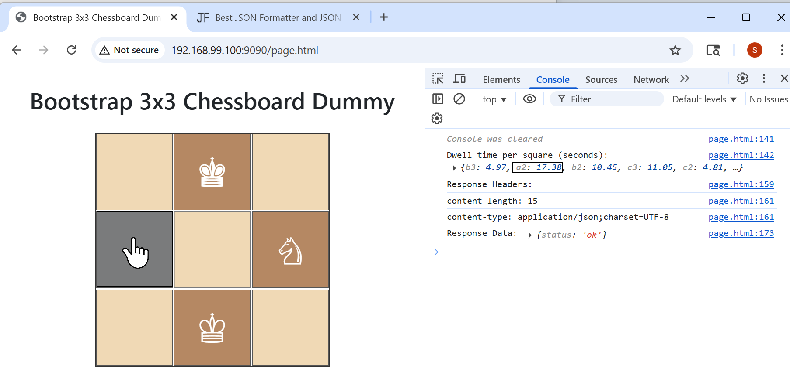

### Info 

This project provides a simplified, educational demonstration of core concepts used in commercial End User Monitoring (EUM) solutions, such as capturing user interaction events (here, mouse dwell time on UI elements) and reporting metrics to a backend service.


While real-world EUM agents involve far more complexity—including performance timing, error tracking, session correlation, data batching, security, and integration with backend APM systems—this example illustrates a fundamental part of their workflow in an accessible way.


###  Background on Commercial EUM JS Injections

EUM solutions inject JavaScript snippets into web pages to monitor user interactions like clicks, page views, errors, timings, etc. Commercial tools like Dynatrace and AppDynamics have proprietary EUM agents that provide rich user interaction telemetry, but these are usually closed source and tied to their platforms.
ELK does not have an official EUM part — Elastic focuses more on backend APM, logs, and metrics, but has limited frontend/user interaction support out of the box.


### NOTE


This example is safe by design and does NOT perform any malicious or unauthorized actions, such as:


  * Session stealing
  * Cross-origin script injection
  * Phishing or credential harvesting


The data collected is limited to anonymous interaction metrics (mouse hover times per square) and does not include sensitive user information.


Cross-Origin Resource Sharing (CORS) is properly configured on the backend to allow only trusted origins to send data, preventing misuse.


The example code is intended solely for learning and demonstration, not for production use or deployment in untrusted environments.

### Application  Architecture

The cluster of applications run on docker consists of

  * `app1`:** Static content server (plain Apache2) serving the subject pages (e.g., chessboard UI) — minimal footprint, illustrating the client side EUM without applcation integration.
   *   `app2`: EUM metric processoras EUM metric collector configured with full CORS access from subject pages and performing statistical analysis and wrappping arriving data (JSON POST handling) illustrated with Mojolicious backend serving .
  * `app3` (optional, WIP): another subject app with alternative EUM processing including applicsation integration  (WIP) represented by an Nginx container for alternate data processing, proxying, or load balancing tasks.

### Note
 
   * CORS Configuration: In a production environment, avoid using a wildcard (*) for Access-Control-Allow-Origin. Instead, specify the exact origins that are allowed to access your resources.
    * Data Validation: Always validate and sanitize incoming data to prevent injection attacks.
    * Sensitive Information: Ensure that no sensitive user information is captured or transmitted without proper consent and security measures.Wikipedia


on a related subject there was a exciting pure JS capable of rendering MRTD payload in canvas (i guess). Can Pure Perl emit mrtg formatted compact data files?



```text
app2  | [2025-08-12 22:54:29.57301] [6] [info] Received payload: "{\"b3\":4.97,\"a2\":17.38,\"b2\":10.45,\"c3\":11.05,\"c2\":4.81,\"a1\":0.54,\"b1\":18.34,\"a3\":0.24,\"c1\":0.1}"
```
client console log shows one payload worth of EUM data:
```text
page.html:141 Console was cleared
page.html:142 Dwell time per square (seconds):
{
  "c3": 0.25,
  "b3": 11.25,
  "c2": 0.03,
  "b2": 0.06,
  "a2": 0.25,
  ...`
}

```
### Typical operational workflow in commercial EUM solutions (Dynatrace / AppDynamics):
    1. Customer adds JS snippet
At build time or runtime, the customer’s origin web server injects a JavaScript agent snippet into all HTML pages. Sometimes this is done automatically by a plugin, middleware, or via manual template modification.
    2. JS agent collects RUM data
The agent monitors user interactions (clicks, inputs, AJAX, errors, performance timings).
    3. Agent sends telemetry to backend
Data is sent to the vendor’s backend collector service (or customer-managed collector).
    4. Data aggregation & analysis
Backend aggregates, stores, visualizes metrics for performance and UX monitoring.


### Scenario: Chessboard user interaction monitoring
    • Subject page: a chessboard rendered as an HTML grid or SVG.
    • Goal: measure which squares users’ mouse hovers or clicks on most frequently.
    • Purpose: understand user attention, potential threat zones, or strategic interest areas on the board.

one can send simoler metric e.g. indicating page is opened:

```js
<script>
  function sendMetrics(data) {
    fetch('http://localhost:4000/report', {
      method: 'POST',
      mode: 'cors',
      headers: { 'Content-Type': 'application/json' },
      body: JSON.stringify(data)
    }).catch(e => console.error('Error sending metrics', e));
  }

  // Example: send dummy metric after page load
  window.onload = () => {
    sendMetrics({ event: 'page_loaded', timestamp: Date.now() });
  };
</script>

```
