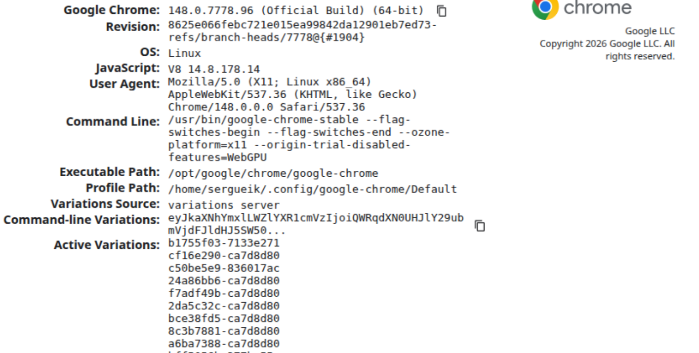

### Info

This directory contains a `Dockerfile` from [zenika/alpine-chrome](https://github.com/Zenika/alpine-chrome/blob/master/Dockerfile) but switched to __maven/jdk8__ apline base [image]( https://hub.docker.com/r/zenika/alpine-maven/tags) with maven and chromium to run the test suites. Note: the `chromium` binary installs some X libraries but is runnable in headless mode in console mode.

### Usage

#### Host Based Test (Optional)

* install the `chromium-browser` locally
```sh
apt-get install -q -y chomium-browser
```
* download and place into `/usr/bin` the `chromedriver`
```sh
wget https://chromedriver.storage.googleapis.com/89.0.4389.23/chromedriver_linux64.zip -O ~/Downloads/chromedriver_linux64.zip
cd ~/Downloads
unzip -f chromedriver_linux64.zip
sudo mv chromedriver /usr/bin
```
* compile test project. Note the need to remove the target directory

```sh
cd demo
sudo rm -fr target
mvn test-compile
mvn test
cd ..
```
- the test runs the chmromium headless and saves a pdf file into current directory

#### Docker Test


* Probe image availab ility in vendor mirror is needed:

```sh
IMAGE=anapsix/alpine-java:8u202b08_jdk
if docker manifest inspect vendor.mirror.com/docker-hub/library/$IMAGE >/dev/null 2>&1; then
  1>&2 echo 'exists'
else
  1>&2 echo 'missing'
fi
```
* build the image with the `chromium` and `chromium-driver` installed via `apk` installer accepting that both will be relatively old versions

```sh
docker pull anapsix/alpine-java:8u202b08_jdk
IMAGE='basic-maven-chromium'
docker build -t $IMAGE -f Dockerfile .
```
Retry if observe intermittent
```txt
ERROR: http://dl-cdn.alpinelinux.org/alpine/v3.8/main: network error (check Internet connection and firewall)
WARNING: Ignoring APKINDEX.adfa7ceb.tar.gz: No such file or directory
```
* run chromium directly in the container:

```sh
export NAME=$IMAGE
docker run --rm --name $NAME -it $IMAGE /usr/bin/chromium-browser --headless --disable-gpu  --no-sandbox --dump-dom https://www.wikipedia.org | grep -i 'title="English"'
```
```text
<li><a href="//en.wikipedia.org/" lang="en" title="English">English</a></li>
```
```sh
export NAME=$IMAGE
docker run --rm --name $NAME -it $IMAGE /usr/bin/chromium-browser --headless --disable-gpu  --no-sandbox --dump-dom chrome://version
```

```text
<html><head></head><body></body></html>
```
> NOTE if using `eclipse-temurin:11-jdk-alpine` instead of `anapsix/alpine-java:8u202b08_jdk` one will need to add `glibc`/ `musl`layer - error in runtime:
```text
Error relocating /usr/lib/libshaderc_shared.so.1: spvValidatorOptionsSetFriendlyNames: symbol not found
Error relocating /usr/lib/libglslang.so.15: spvValidatorOptionsSetWorkgroupScalarBlockLayout: symbol not found
Error relocating /usr/lib/libglslang.so.15: _ZN8spvtools38CreateEliminateDeadInputComponentsPassEv: symbol not found
Error relocating /usr/lib/libglslang.so.15: _ZN8spvtools23CreateAggressiveDCEPassEbb: symbol not found
Error relocating /usr/lib/libglslang.so.15: _ZN8spvtools39CreateEliminateDeadOutputComponentsPassEv: symbol not found
Error relocating /usr/lib/libglslang.so.15: _ZN8spvtools35CreateEliminateDeadOutputStoresPassEPSt13unordered_setIjSt4hashIjESt8equal_toIjESaIjEES7_: symbol not found
Error relocating /usr/lib/libglslang.so.15: _ZN8spvtools26CreateAnalyzeLiveInputPassEPSt13unordered_setIjSt4hashIjESt8equal_toIjESaIjEES7_: symbol not found
Error relocating /usr/lib/libglslang.so.15: _ZN8spvtools42CreateEliminateDeadInputComponentsSafePassEv: symbol not found
Error relocating /usr/lib/libglslang.so.15: _ZN8spvtools26CreateInterpolateFixupPassEv: symbol not found
Error relocating /usr/lib/libglslang.so.15: spvValidatorOptionsSetAllowOffsetTextureOperand: symbol not found
```
this will print HTML in console
> NOTE: the version of chromium-browser in the container will be rather old, but common options (`dump-dom`, `print-to-pdf`,`screenshot`) are supported
```sh
docker run --rm -it $IMAGE sh
```
or 
```sh
ID=$(docker container ls -a |grep $IMAGE| head -1 | awk '{print $1}')
docker start $ID
docker exec -it $ID sh
```
In container:
```sh
/usr/bin/chromium-browser --headless --disable-gpu --no-sandbox --screenshot https://www.wikipedia.org
```
if there is a firewal issue preventing accessing `https://wikipedia.org` use the browser banner page instread:
```sh
export NAME=$IMAGE
docker run --name $NAME -it $IMAGE /usr/bin/chromium-browser --headless --disable-gpu --no-sandbox --screenshot "chrome://version"
```

> NOTE: the Chrome will discover it is run by application and headlessly and will provide a blank page  instead of usual



```sh
docker cp $NAME:/screenshot.png . 
docker container rm -f $NAME 
```
```text
[0514/135855.716202:ERROR:gpu_process_transport_factory.cc(1016)] Lost UI shared context.
[0514/135855.724092:WARNING:dns_config_service_posix.cc(333)] Failed to read DnsConfig.
[0514/135855.877407:ERROR:gl_implementation.cc(292)] Failed to load /usr/lib/chromium/swiftshader/libGLESv2.so: Error loading shared library /usr/lib/chromium/swiftshader/libGLESv2.so: No such file or directory
[0514/135855.883876:ERROR:viz_main_impl.cc(201)] Exiting GPU process due to errors during initialization
[0514/135859.015076:INFO:headless_shell.cc(590)] Written to file screenshot.png.
```
What matters is the last line:
```text
Written to file screenshot.png.
```
```sh
file screenshot.png
```
```text
screenshot.png: PNG image data, 800 x 600, 8-bit/color RGBA, non-interlaced
```
```sh
/usr/bin/chromium-browser --headless --disable-gpu --no-sandbox --print-pdf https://www.wikipedia.org
```

```text
Written to file output.pdf.
```
> NOTE: the `print-pdf` chrome commandline option is not guaranteed to work


* run some ultra basic regular Selenium test via maven providing the source dir via bind mount:

```sh
docker run -it -v $PWD/demo:/demo -w /demo $IMAGE mvn clean test
```
for repeated runs use the commands:

```sh
ID=$(docker container ls -a |grep $IMAGE| head -1 | awk '{print $1}')
docker start $ID 
docker exec -it -w /demo $ID mvn clean test
```
which returns
```text
[WARNING] Tests run: 2, Failures: 0, Errors: 0, Skipped: 1, Time elapsed: 11.261 s - in example.ChromiumBrowserTest
[INFO] 
[INFO] Results:
[INFO] 
[WARNING] Tests run: 2, Failures: 0, Errors: 0, Skipped: 1
```
> NOTE: the same test will fail with Selenium __4.7.2__:
```text
[INFO]
[INFO] Results:
[INFO]
[ERROR] Failures:
[ERROR]   ChromiumBrowserTest.downloadPDF:116
Expected: is <true>
     but: was <false>
[INFO]
[ERROR] Tests run: 2, Failures: 1, Errors: 0, Skipped: 0

```
that is confirmed through
```sh
ID=$(docker container ls -a |grep $IMAGE| head -1 | awk '{print $1}')
docker start $ID
docker exec -it $ID sh -c 'test -f /demo/sample.pdf && echo OK'
```
will print
```sh
OK
```
and basic CDP test (e.g. copy from [sergueik/cdp4j_tests](https://github.com/sergueik/cdp4j_tests)
```sh
git clone https://github.com/sergueik/cdp4j_tests demo.cdp
docker run -it -v "$PWD/demo.cdp":/demo -w /demo -e USE_CHROMIUM=true $IMAGE mvn clean test
```
from mounted host directory
* alternatively connect into the container
```sh
docker run -v demo -it $IMAGE sh
```
### Cleanup

if there is no other stopped containers 
```sh
docker container prune -f
docker image prune -f 
docker volume prune -f
```

selectively
```sh
docker container ls -a | grep $IMAGE | awk '{print $1}' | xargs -IX docker container rm X
```
### Note

* in the current layout the `target` directory in `demo` project becomes owned by root account.

### File Download Test

```java
@Test
public void downloadPDF() {
  url = "http://www.africau.edu/images/default/sample.pdf";
  driver.get(url);
  try {
    Thread.sleep(5000);
  } catch (InterruptedException e) {
  }
  File file = new File((downloadDirectory != null ? downloadDirectory : "/tmp") + "/" + "sample.pdf");
  assertThat(file.exists(), is(false));
  File f = new File(System.getProperty("user.dir") + "/" + "sample.pdf");
  assertThat(f.exists(), is(true));
}
```
```sh
docker run -e DOWNLOAD_DIRECTORY=/tmp -it -v "$PWD/demo":/demo -w /demo $IMAGE mvn clean test ;  CONTAINER=$(docker container ls -a |grep $IMAGE | head -1 | cut -f1 -d ' '); docker container start $CONTAINER;docker exec -it $CONTAINER sh -c "find / -iname '*pdf' 2>/dev/null"
```
```sh
fe728cfc1b7e
/demo/sample.pdf
```
The setting seems to have no effect:
```java

chromeOptions.setExperimentalOption("prefs", new HashMap<String, Object>() {
  {
    put("profile.default_content_settings.popups", 0);
    put("download.default_directory", downloadDirectory != null ? downloadDirectory : "/tmp");
    put("download.prompt_for_download", false);
    put("download.directory_upgrade", true);
    put("safebrowsing.enabled", false);
    put("plugins.always_open_pdf_externally", true);
    put("plugins.plugins_disabled", new ArrayList() {
      {
        add("Chrome PDF Viewer");
      }
    });
  }
});
```


### See Also
 * blog on [running Chrome in Docker](https://medium.com/@sahajamit/can-selenium-chrome-dev-tools-recipe-works-inside-a-docker-container-afff92e9cce5)

### NOTE

* the issue observed occasionally
```sh
fetch http://dl-cdn.alpinelinux.org/alpine/v3.11/main/x86_64/APKINDEX.tar.gz
ERROR: unable to select packages:
  /bin/sh (virtual):D	
    provided by: busybox-1.33.0-r6
                 busybox-1.31.1-r10
```
* in attempt to solve, replicate `Dockerfile` from [](https://github.com/Zenika/alpine-maven/blob/master/jdk8/Dockerfile) upgrade the base jdk to e.g. alpine3.9 and do a image cleanup with [dependency traversal](https://stackoverflow.com/questions/36584122/how-to-get-the-list-of-dependent-child-images-in-docker)
```sh
ID=$(docker image ls  |grep 'zenika/alpine-maven' | head -1| awk '{print $1}')
docker inspect --format='{{.Id}} {{.Parent}}'     $(docker images --filter since=$ID --quiet)
```
and remove all and start over

### Alternatrive CDP test
```sh
docker run -it -v "$PWD/demo.cdp":/demo -w /demo $IMAGE mvn clean test -Dtest=BrowserVersionTest 2>&1 | tee a.log
```
this produces massive output (it runs in debug mode) illustrating the browser is managed by Selenium (Chrome Driver, Chrome DevTools Protocol):

```text
-------------------------------------------------------
 T E S T S
-------------------------------------------------------
Running example.BrowserVersionTest
HEADLESS: true
...

[1778787275.589][INFO]: Launching chrome: /usr/bin/chromium-browser -remote-debugging-port=9222 --disable-background-networking --disable-client-side-phishing-detection --disable-default-apps --disable-dev-shm-usage --disable-extensions --disable-gpu --disable-hang-monitor --disable-popup-blocking --disable-prompt-on-repost --disable-sync --disable-web-resources --enable-automation --enable-logging --force-fieldtrials=SiteIsolationExtensions/Control --headless --ignore-certificate-errors --ignore-ssl-errors=true --log-level=0 --metrics-recording-only --no-first-run --no-sandbox --password-store=basic --remote-debugging-port=0 --ssl-protocol=any --test-type=webdriver --use-mock-keychain --user-data-dir=/tmp/.org.chromium.Chromium.loAppp data:,
[0514/193436.319136:ERROR:gpu_process_transport_factory.cc(1016)] Lost UI shared context.

DevTools listening on ws://127.0.0.1:38983/devtools/browser/fdc65641-05a6-4ccb-b04a-0ad54fcc05f3
[0514/193436.342378:WARNING:dns_config_service_posix.cc(333)] Failed to read DnsConfig.
[1778787276.366][DEBUG]: DevTools request: http://localhost:38983/json/version
[1778787276.455][DEBUG]: DevTools response: {
   "Browser": "HeadlessChrome/68.0.3440.75",
   "Protocol-Version": "1.3",
   "User-Agent": "Mozilla/5.0 (X11; Linux x86_64) AppleWebKit/537.36 (KHTML, like Gecko) HeadlessChrome/68.0.3440.75 Safari/537.36",
   "V8-Version": "6.8.275.24",
   "WebKit-Version": "537.36 (@cf598d63a4f1b9e7cd14f2a8433276b196e3e07d)",
   "webSocketDebuggerUrl": "ws://localhost:38983/devtools/browser/fdc65641-05a6-4ccb-b04a-0ad54fcc05f3"
}

[1778787276.455][DEBUG]: DevTools request: http://localhost:38983/json
[1778787276.534][DEBUG]: DevTools response: [ {
   "description": "",
   "devtoolsFrontendUrl": "/devtools/inspector.html?ws=localhost:38983/devtools/page/B4D3A83EFF0C94B4C7BFB8983F242D95",
   "id": "B4D3A83EFF0C94B4C7BFB8983F242D95",
   "title": "",
   "type": "page",
   "url": "data:,",
   "webSocketDebuggerUrl": "ws://localhost:38983/devtools/page/B4D3A83EFF0C94B4C7BFB8983F242D95"
} ]

[1778787276.534][DEBUG]: DevTools request: http://localhost:38983/json
[1778787276.577][DEBUG]: DevTools response: [ {
   "description": "",
   "devtoolsFrontendUrl": "/devtools/inspector.html?ws=localhost:38983/devtools/page/B4D3A83EFF0C94B4C7BFB8983F242D95",
   "id": "B4D3A83EFF0C94B4C7BFB8983F242D95",
   "title": "",
   "type": "page",
   "url": "data:,",
   "webSocketDebuggerUrl": "ws://localhost:38983/devtools/page/B4D3A83EFF0C94B4C7BFB8983F242D95"
} ]

[1778787276.577][INFO]: resolved localhost to ["::1","127.0.0.1"]
[1778787276.604][DEBUG]: DEVTOOLS COMMAND Log.enable (id=1) {

}
[1778787276.604][DEBUG]: DEVTOOLS COMMAND DOM.getDocument (id=2) {

}
[1778787276.604][DEBUG]: DEVTOOLS COMMAND Target.setAutoAttach (id=3) {
   "autoAttach": true,
   "waitForDebuggerOnStart": false
}
[1778787276.604][DEBUG]: DEVTOOLS COMMAND Page.enable (id=4) {

}
[1778787276.604][DEBUG]: DEVTOOLS COMMAND Page.enable (id=5) {

}
[1778787276.690][DEBUG]: DEVTOOLS RESPONSE Log.enable (id=1) {

}
[1778787276.704][DEBUG]: DEVTOOLS RESPONSE DOM.getDocument (id=2) {
   "root": {
      "backendNodeId": 1,
      "baseURL": "about:blank",
      "childNodeCount": 1,
      "children": [ {
         "attributes": [  ],
         "backendNodeId": 2,
         "childNodeCount": 2,
         "children": [ {
            "attributes": [  ],
            "backendNodeId": 3,
            "childNodeCount": 0,
            "localName": "head",
            "nodeId": 3,
            "nodeName": "HEAD",
            "nodeType": 1,
            "nodeValue": "",
            "parentId": 2
         }, {
            "attributes": [  ],
            "backendNodeId": 4,
            "childNodeCount": 0,
            "localName": "body",
            "nodeId": 4,
            "nodeName": "BODY",
            "nodeType": 1,
            "nodeValue": "",
            "parentId": 2
         } ],
         "frameId": "B4D3A83EFF0C94B4C7BFB8983F242D95",
         "localName": "html",
         "nodeId": 2,
         "nodeName": "HTML",
         "nodeType": 1,
         "nodeValue": "",
         "parentId": 1
      } ],
      "documentURL": "",
      "localName": "",
      "nodeId": 1,
      "nodeName": "#document",
      "nodeType": 9,
      "nodeValue": "",
      "xmlVersion": ""
   }
}
[1778787276.739][DEBUG]: DEVTOOLS RESPONSE Target.setAutoAttach (id=3) {

}
[1778787276.740][DEBUG]: DEVTOOLS RESPONSE Page.enable (id=4) {

}
[1778787276.742][DEBUG]: DEVTOOLS RESPONSE Page.enable (id=5) {

}
[1778787276.742][DEBUG]: DEVTOOLS COMMAND Runtime.enable (id=6) {

}
[1778787276.822][DEBUG]: DEVTOOLS EVENT Page.frameNavigated {
   "frame": {
      "id": "B4D3A83EFF0C94B4C7BFB8983F242D95",
      "loaderId": "83F4445A670B99A62B9F4EFAC8784DA3",
      "mimeType": "text/plain",
      "securityOrigin": "://",
      "url": "data:,"
   }
}
[1778787276.822][DEBUG]: DEVTOOLS EVENT DOM.documentUpdated {

}
[1778787276.822][DEBUG]: DEVTOOLS COMMAND DOM.getDocument (id=7) {

}
[1778787276.823][DEBUG]: DEVTOOLS EVENT Page.loadEventFired {
   "timestamp": 444170.79793
}
[1778787276.823][DEBUG]: DEVTOOLS EVENT Page.frameStoppedLoading {
   "frameId": "B4D3A83EFF0C94B4C7BFB8983F242D95"
}
[1778787276.823][DEBUG]: DEVTOOLS EVENT DOM.documentUpdated {

}
[1778787276.823][DEBUG]: DEVTOOLS COMMAND DOM.getDocument (id=8) {

}
[1778787276.824][DEBUG]: DEVTOOLS EVENT Page.domContentEventFired {
   "timestamp": 444170.80033
}
[1778787276.850][DEBUG]: DEVTOOLS EVENT Runtime.executionContextCreated {
   "context": {
      "auxData": {
         "frameId": "B4D3A83EFF0C94B4C7BFB8983F242D95",
         "isDefault": true
      },
      "id": 1,
      "name": "",
      "origin": "://"
   }
}
[1778787276.853][DEBUG]: DEVTOOLS RESPONSE Runtime.enable (id=6) {

}
[1778787276.867][DEBUG]: DEVTOOLS RESPONSE DOM.getDocument (id=7) {
   "root": {
      "backendNodeId": 5,
      "baseURL": "data:,",
      "childNodeCount": 1,
      "children": [ {
         "attributes": [  ],
         "backendNodeId": 6,
         "childNodeCount": 2,
         "children": [ {
            "attributes": [  ],
            "backendNodeId": 7,
            "childNodeCount": 0,
            "localName": "head",
            "nodeId": 7,
            "nodeName": "HEAD",
            "nodeType": 1,
            "nodeValue": "",
            "parentId": 6
         }, {
            "attributes": [  ],
            "backendNodeId": 8,
            "childNodeCount": 0,
            "localName": "body",
            "nodeId": 8,
            "nodeName": "BODY",
            "nodeType": 1,
            "nodeValue": "",
            "parentId": 6
         } ],
         "frameId": "B4D3A83EFF0C94B4C7BFB8983F242D95",
         "localName": "html",
         "nodeId": 6,
         "nodeName": "HTML",
         "nodeType": 1,
         "nodeValue": "",
         "parentId": 5
      } ],
      "documentURL": "data:,",
      "localName": "",
      "nodeId": 5,
      "nodeName": "#document",
      "nodeType": 9,
      "nodeValue": "",
      "xmlVersion": ""
   }
}
[1778787276.868][DEBUG]: DEVTOOLS RESPONSE DOM.getDocument (id=8) {
   "root": {
      "backendNodeId": 5,
      "baseURL": "data:,",
      "childNodeCount": 1,
      "children": [ {
         "attributes": [  ],
         "backendNodeId": 6,
         "childNodeCount": 2,
         "children": [ {
            "attributes": [  ],
            "backendNodeId": 7,
            "childNodeCount": 0,
            "localName": "head",
            "nodeId": 11,
            "nodeName": "HEAD",
            "nodeType": 1,
            "nodeValue": "",
            "parentId": 10
         }, {
            "attributes": [  ],
            "backendNodeId": 8,
            "childNodeCount": 0,
            "localName": "body",
            "nodeId": 12,
            "nodeName": "BODY",
            "nodeType": 1,
            "nodeValue": "",
            "parentId": 10
         } ],
         "frameId": "B4D3A83EFF0C94B4C7BFB8983F242D95",
         "localName": "html",
         "nodeId": 10,
         "nodeName": "HTML",
         "nodeType": 1,
         "nodeValue": "",
         "parentId": 9
      } ],
      "documentURL": "data:,",
      "localName": "",
      "nodeId": 9,
      "nodeName": "#document",
      "nodeType": 9,
      "nodeValue": "",
      "xmlVersion": ""
   }
}
[1778787276.868][DEBUG]: DEVTOOLS COMMAND Page.enable (id=9) {

}
[1778787276.871][DEBUG]: DEVTOOLS RESPONSE Page.enable (id=9) {

}
[1778787276.871][DEBUG]: DEVTOOLS COMMAND Runtime.enable (id=10) {

}
[1778787276.873][DEBUG]: DEVTOOLS RESPONSE Runtime.enable (id=10) {

}
[1778787276.874][DEBUG]: DEVTOOLS COMMAND Runtime.evaluate (id=11) {
   "expression": "(function() { // Copyright (c) 2012 The Chromium Authors. All rights reserved.\n// Use of this source code is governed by a BSD-style license that can be\n// found in the LICENSE file.\n\n/**\n * Enum f...",
   "returnByValue": true
}
[1778787276.951][DEBUG]: DEVTOOLS RESPONSE Runtime.evaluate (id=11) {
   "result": {
      "type": "object",
      "value": {
         "status": 0,
         "value": 1
      }
   }
}
[1778787276.951][INFO]: RESPONSE InitSession {
   "acceptInsecureCerts": false,
   "acceptSslCerts": false,
   "applicationCacheEnabled": false,
   "browserConnectionEnabled": false,
   "browserName": "chrome",
   "chrome": {
      "chromedriverVersion": "2.38 (f91d32489882be7df38da3422a19713bfd113fa5)",
      "userDataDir": "/tmp/.org.chromium.Chromium.loAppp"
   },
   "cssSelectorsEnabled": true,
   "databaseEnabled": false,
   "goog:chromeOptions": {
      "debuggerAddress": "localhost:38983"
   },
   "handlesAlerts": true,
   "hasTouchScreen": false,
   "javascriptEnabled": true,
   "locationContextEnabled": true,
   "mobileEmulationEnabled": false,
   "nativeEvents": true,
   "networkConnectionEnabled": false,
   "pageLoadStrategy": "normal",
   "platform": "Linux",
   "rotatable": false,
   "~~~": "..."
}
```
### Troubleshooting

```text
1778776694.598][INFO]: RESPONSE InitSession unknown error: Chrome failed to start: exited abnormally
  (unknown error: DevToolsActivePort file doesn't exist)
  (The process started from chrome location /usr/bin/chromium-browser is no longer running, so ChromeDriver is assuming that Chrome has crashed.)
example.ShadowRootDomTest  Time elapsed: 1.231 sec  <<< ERROR!
org.openqa.selenium.WebDriverException: unknown error: Chrome failed to start: exited abnormally
  (unknown error: DevToolsActivePort file doesn't exist)
  (The process started from chrome location /usr/bin/chromium-browser is no longer running, so ChromeDriver is assuming that Chrome has crashed.)
  (Driver info: chromedriver=2.38 (f91d32489882be7df38da3422a19713bfd113fa5),platform=Linux 5.15.0-177-generic x86_64) (WARNING: The server did not provide any stacktrace information)
Command duration or timeout: 333 milliseconds

```
Mapping:


|Major|	Java|
|-----|-----|
|52|8|
|55|11|
|57|13|
|61|17|
|65|21|

> NOTE:  Maven/Gradle intentionally hide test sources from main compilation


```sh
pushd demo
mvn dependency:copy-dependencies compile test-compile
popd
```
```sh
docker run -it -v $PWD/demo:/demo -w /demo -e USE_CHROMIUM=true $IMAGE java -cp target/test-classes:target/classes:target/dependency/* example.Application
```
```sh
pushd demo.cdp
mvn dependency:copy-dependencies compile test-compile
popd
```


```sh
docker run -it -v $PWD/demo.cdp:/demo -w /demo -e USE_CHROMIUM=true $IMAGE java -cp target/test-classes:target/classes:target/dependency/* example.Application
```
### See Also

  * https://alpinelinux.org/releases/
  * https://developer.chrome.com/blog/headless-chrome/
  * [python - Running Selenium with Headless Chrome Webdriver - Stack Overflow](https://stackoverflow.com/questions/53657215/running-selenium-with-headless-chrome-webdriver)
  * [python - Selenium: WebDriverException:Chrome failed to start: crashed as google-chrome is no longer running so ChromeDriver is assuming that Chrome has crashed](https://stackoverflow.com/questions/53073411/selenium-webdriverexceptionchrome-failed-to-start-crashed-as-google-chrome-is)
  * [how To Run Selenium With Chrome In Docker](https://stackoverflow.com/questions/45323271/how-to-run-selenium-with-chrome-in-docker)

### Author
[Serguei Kouzmine](kouzmine_serguei@yahoo.com)
