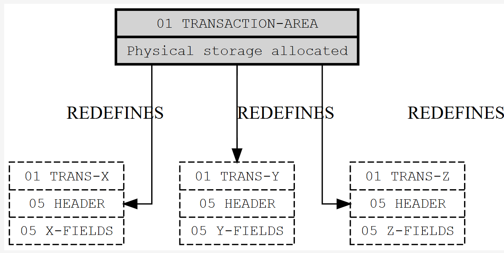
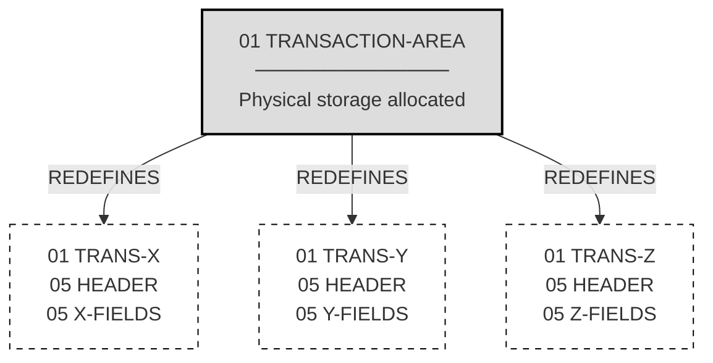
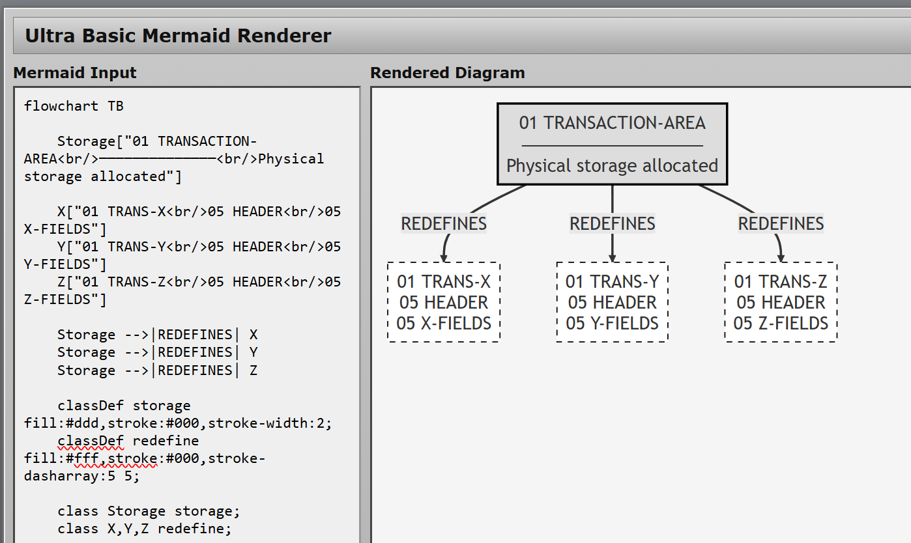
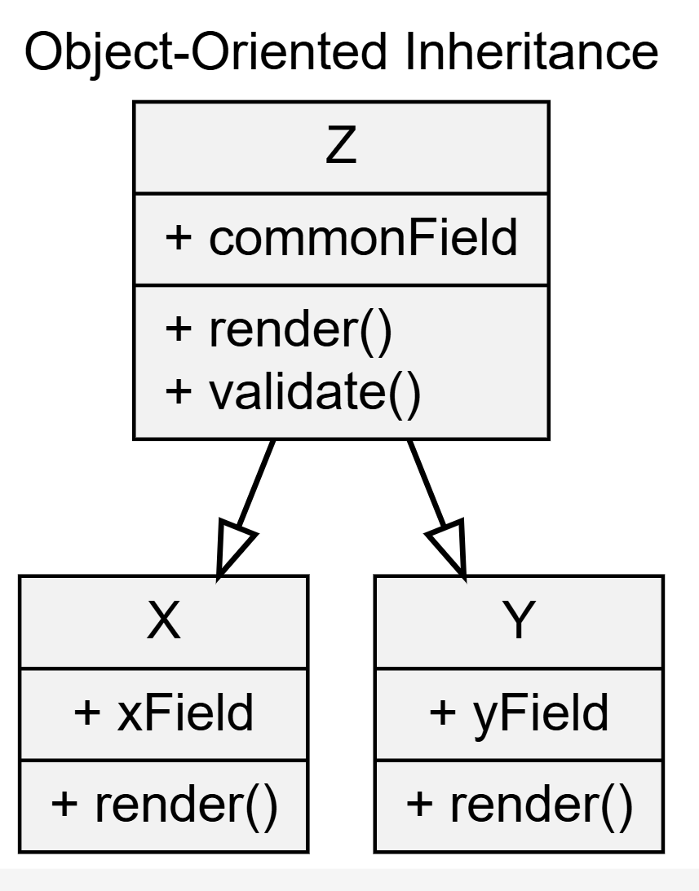
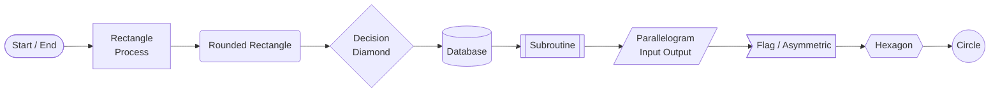

###  Info


This directory contains docker build flow to construct  __CobolToJson__ - *Convert Cobol Data Files to JSON*
 - with all its dependencies from the source. To enforce portability, all processes run in Docker containers, multi-step

### Background

* Build Stages:


* Docker Build:


### Usage

* get images

```sh
docker pull maven:3.9.5-eclipse-temurin-11-alpine
docker pull eclipse-temurin:11-jre-alpine
```
* build 1st dependency
```
export REPO=https://github.com/bmTas/cb2xml
export COMMIT=97f8dc8
export NAME=cb2xml
export POM=pom.$NAME.xml
cp avoid_$NAME_deps.txt avoid_deps.txt
docker build -t $NAME --build-arg REPO=$REPO --build-arg COMMIT=$COMMIT --build-arg POM=$POM -f Dockerfile.BUILD-DEPENDENCY .
```
* build 2nd dependency
```
export REPO=https://github.com/bmTas/JRecord
export COMMIT=f50ece71
export NAME=jrecord
export POM=pom.$NAME.xml
cp avoid_$NAME_deps.txt avoid_deps.txt
docker build -t $NAME --build-arg REPO=$REPO --build-arg COMMIT=$COMMIT --build-arg POM=$POM -f Dockerfile.BUILD-DEPENDENCY2 .
```
build app
```sh
export REPO=https://github.com/bmTas/CobolToJson
export COMMIT=99b0aa2
export NAME=cobol2json
export POM=pom.$NAME.xml
docker build -t $NAME --build-arg REPO=$REPO --build-arg COMMIT=$COMMIT --build-arg POM=$POM -f Dockerfile.BUILD-APP .
```
* build the app runtime container

```sh
docker build -t app -f Dockerfile.APP .
```
* confirm the app can run
```sh
docker run app
```
```text

  Program options:

          -cobol	- Cobol  copybook used to "interpret" the data (you must supply either a cobol or cb2xml copybook
          -cb2xml	- Cb2xml copybook used to "interpret" the data

          -input	- Input file
          -output	- Output file
          -font  	- Characterset used in the Cobol data file (e.g. IBM037 for US-EBCIDIC)
          -pretty  	- Wether to pretty print the JSON

          -dropCopybookName	- (true/false) wether to drop the cobol copybook name from the start of the Json Tags

          -tagFormat     	- How Cobol Variable names are reformated to Xml tags:
                Asis       - Use the Cobol Variable name
                Underscore - Convert - to _,         COBOL-VAR-NAME ==> COBOL_VAR_NAME
                CamelCase  - Convert to Camel Case,  COBOL-VAR-NAME ==> cobolVarName

          -fileOrganisation	- "file organisation" of the Cobol data file
		Text    	- Standard Windows/Unix text file (single byte characterset)
		FixedWidth	- File where lines (records) are the same length no \n
		UnicodeText    	- Standard Windows/Unix Unicode text file
		FixedText    	- Fixed width Text (possibly unicode)
		Mainframe_VB	- Mainframe VB, file consists of <record-length><record-data>
		GNUCobol_VB	- GNU Cobol VB, file consists of <record-length><record-data>

          -dialect	- Cobol Dialect
		Mainframe	- Mainframe cobol
		Futjitsu	- Fujitsu PC cobol
		GNUCobol	- GNU Cobol (little endian, ie intel)
		GNUCobolBE	- GNU Cobol (big endian, ie IBM, Sun(oracle))

          -split	- Split Copybook Option
		None	- No Split
		01	- Split on 01
		Highest	- On Highest Repeating

          -recordSelection	- Record Selection, can be used multiple times
                            	  format: -recordSelection RecordName field=value

          -recordParent   	- Record Parent, can be used multiple times
                            	  format: -recordParent    RecordName ParentRecord


```
* run example
```sh
docker run -w /app/Example -v $(pwd)/Example:/app/Example app -cobol cobol/DTAR020a.cbl -fileOrganisation FixedWidth -font cp037 -input in/DTAR020.bin -output DTAR020.json
```
```sh
ls -l Example/DTAR020.json
```
```text
-rw-r--r-- 1 root root 90174 Jan 18 20:57 Example/DTAR020.json
```
```sh
cat Example/DTAR020.json | jq '.sss[0:3]'
```
```json
[
  {
    "DTAR020-KCODE-STORE-KEY": {
      "DTAR020-KEYCODE-NO": "69684558",
      "DTAR020-STORE-NO": 20
    },
    "DTAR020-DATE": 40118,
    "DTAR020-DEPT-NO": 280,
    "DTAR020-QTY-SOLD": 1,
    "DTAR020-SALE-PRICE": 19
  },
  {
    "DTAR020-KCODE-STORE-KEY": {
      "DTAR020-KEYCODE-NO": "69684558",
      "DTAR020-STORE-NO": 20
    },
    "DTAR020-DATE": 40118,
    "DTAR020-DEPT-NO": 280,
    "DTAR020-QTY-SOLD": -1,
    "DTAR020-SALE-PRICE": -19
  },
  {
    "DTAR020-KCODE-STORE-KEY": {
      "DTAR020-KEYCODE-NO": "69684558",
      "DTAR020-STORE-NO": 20
    },
    "DTAR020-DATE": 40118,
    "DTAR020-DEPT-NO": 280,
    "DTAR020-QTY-SOLD": 1,
    "DTAR020-SALE-PRICE": 5.01
  }
]
```
### Inventory

```sh
docker image ls
```
```text
REPOSITORY        TAG                               IMAGE ID       CREATED          SIZE
app               latest                            8bbbff74016c   19 minutes ago   171MB
cobol2json        latest                            bf44405afa07   20 minutes ago   338MB
jrecord           latest                            3470d9d371da   22 minutes ago   381MB
cb2xml            latest                            5e21966a2d42   24 minutes ago   364MB
eclipse-temurin   11-jre-alpine                     f135099692b9   2 months ago     169MB
maven             3.9.5-eclipse-temurin-11-alpine   37ef041f8432   2 years ago      305MB
```
### Running Standalone Shell Script

> Note: Source-based vendoring is a dependency management strategy where a project copies the source code of its third-party dependencies directly into its own repository, typically within a vendor directory, rather than relying on a package manager to install them on demand.This approach ensures that the exact version of the dependency is stored alongside the project's own code, creating a self-contained codebase that enhances build reproducibility and eliminates external dependencies during builds. 

```sh
./build_all.sh
```
or
```cmd
build_all.cmd
```
or 
```powershell
.\build_all.ps1   
```
these commands will product a lot of console output culminating with
```text
OK: dependencies are exploded

==> Validating Maven repo isolation
OK: Maven repo contains only pinned/vendor dependencies

==> BUILD COMPLETE
    Shaded JAR: target/cobolToJson-0.93.3.jar
    Maven repo: /home/sergueik/src/springboot_study/basic-cobol2json-cb2xml-jrecord-build/build/m2
```
or
```text
[INFO] BUILD SUCCESS
[INFO] ------------------------------------------------------------------------
[INFO] Total time:  01:16 min
[INFO] Finished at: 2026-01-20T15:21:34-05:00
[INFO] ------------------------------------------------------------------------
Built target\cobolToJson-0.93.3.jar

OK: shaded jar structure valid


    Shaded JAR: target\cobolToJson-0.93.3.jar
    Maven repo: build\m2
```
or

```text
==> Inspecting shaded JAR
Manifest-Version: 1.0
Archiver-Version: Plexus Archiver
Created-By: Apache Maven 3.6.1
Built-By: kouzm
Build-Jdk: 11.0.12
Main-Class: net.sf.cobolToJson.Data2Json


OK: shaded jar structure valid

==> Validating Maven repo isolation

==> BUILD COMPLETE
    Shaded JAR: ...\build\cobol2json\target\cobolToJson-0.93.3.jar
    Maven repo: ...\build\m2
```

```sh
java -jar build/cobol2json/target/cobolToJson-0.93.3.jar -cobol Example/cobol/DTAR020a.cbl -fileOrganisation FixedWidth -font cp037 -input Example/in/DTAR020.bin -output DTAR020.json
```
or
```cmd
java -jar build\cobol2json\target\cobolToJson-0.93.3.jar -cobol Example\cobol\DTAR020a.cbl -fileOrganisation FixedWidth -font cp037 -input Example\in\DTAR020.bin -output DTAR020.json
```
```sh
jq ".sss[0:3]" < DTAR020.json 
```
```json
[
  {
    "DTAR020-KCODE-STORE-KEY": {
      "DTAR020-KEYCODE-NO": "69684558",
      "DTAR020-STORE-NO": 20
    },
    "DTAR020-DATE": 40118,
    "DTAR020-DEPT-NO": 280,
    "DTAR020-QTY-SOLD": 1,
    "DTAR020-SALE-PRICE": 19
  },
  {
    "DTAR020-KCODE-STORE-KEY": {
      "DTAR020-KEYCODE-NO": "69684558",
      "DTAR020-STORE-NO": 20
    },
    "DTAR020-DATE": 40118,
    "DTAR020-DEPT-NO": 280,
    "DTAR020-QTY-SOLD": -1,
    "DTAR020-SALE-PRICE": -19
  },
  {
    "DTAR020-KCODE-STORE-KEY": {
      "DTAR020-KEYCODE-NO": "69684558",
      "DTAR020-STORE-NO": 20
    },
    "DTAR020-DATE": 40118,
    "DTAR020-DEPT-NO": 280,
    "DTAR020-QTY-SOLD": 1,
    "DTAR020-SALE-PRICE": 5.01
  }
]

```
### Standalone Dockerfile


```sh
docker build -f Dockerfile -t app .
```
```sh
docker run --rm app
```
```text
  Program options:

          -cobol        - Cobol  copybook used to "interpret" the data (you must supply either a cobol or cb2xml copybook
          -cb2xml       - Cb2xml copybook used to "interpret" the data

          -input        - Input file
          -output       - Output file
          -font         - Characterset used in the Cobol data file (e.g. IBM037 for US-EBCIDIC)
          -pretty       - Wether to pretty print the JSON

          -dropCopybookName     - (true/false) wether to drop the cobol copybook name from the start of the Json Tags

          -tagFormat            - How Cobol Variable names are reformated to Xml tags:
                Asis       - Use the Cobol Variable name
                Underscore - Convert - to _,         COBOL-VAR-NAME ==> COBOL_VAR_NAME
                CamelCase  - Convert to Camel Case,  COBOL-VAR-NAME ==> cobolVarName

          -fileOrganisation     - "file organisation" of the Cobol data file
                Text            - Standard Windows/Unix text file (single byte characterset)
                FixedWidth      - File where lines (records) are the same length no \n
                UnicodeText     - Standard Windows/Unix Unicode text file
                FixedText       - Fixed width Text (possibly unicode)
                Mainframe_VB    - Mainframe VB, file consists of <record-length><record-data>
                GNUCobol_VB     - GNU Cobol VB, file consists of <record-length><record-data>

          -dialect      - Cobol Dialect
                Mainframe       - Mainframe cobol
                Futjitsu        - Fujitsu PC cobol
                GNUCobol        - GNU Cobol (little endian, ie intel)
                GNUCobolBE      - GNU Cobol (big endian, ie IBM, Sun(oracle))

          -split        - Split Copybook Option
                None    - No Split
                01      - Split on 01
                Highest - On Highest Repeating

          -recordSelection      - Record Selection, can be used multiple times
                                  format: -recordSelection RecordName field=value

          -recordParent         - Record Parent, can be used multiple times
                                  format: -recordParent    RecordName ParentRecord


```
```sh
docker run -w /app/Example -v $(pwd)/Example:/app/Example app -cobol cobol/DTAR020a.cbl -fileOrganisation FixedWidth -font cp037 -input in/DTAR020.bin -output DTAR020.json
```
```
jq '.sss[0:1]' <  DTAR020.json
```
### Docker-specific Note

The container is executed with an explicit working directory (`-w /app/Example`) and a narrowly scoped bind mount (`-v $(pwd)/Example:/app/Example`). This design choice is intentional and technically sound.

The application JAR is baked into the image at build time and resides in the image filesystem. Docker’s overlay filesystem semantics dictate that **a bind mount completely masks the target directory inside the container**. If the entire `/app` directory (or `/app/Example`) were mounted from the host without care, the pre-copied JAR inside the image would disappear at runtime, replaced by the host directory contents. This is a common and subtle Docker pitfall.

By mounting **only the data subdirectory** and keeping the executable artifacts inside the image layer, the container preserves:
- a deterministic runtime environment,
- a stable executable JAR,
- and a clean separation between *code* (image) and *data* (volume).

This approach prevents accidental shadowing of the application binary while still allowing input/output files to flow naturally between host and container.

The result confirms correct behavior:
- The JSON output is generated inside the mounted directory and persists on the host.
- File ownership reflects container execution (`root:root`), which is expected unless user remapping is configured.
- The output size (~90 KB) is consistent with full record expansion rather than truncated or schema-only output.

The JSON content itself demonstrates correctness at multiple levels:
- EBCDIC input (`cp037`) is decoded accurately.
- Fixed-width parsing preserves signed numeric semantics (negative quantities and prices are correctly represented).
- COBOL group fields are mapped into nested JSON objects rather than flattened or lossy structures.
- Decimal handling is preserved (`5.01`), indicating correct PIC and scale interpretation rather than integer coercion.

Using `jq` to slice and inspect the first records provides a strong sanity check: the data is structurally valid, semantically faithful to the COBOL copybook, and immediately consumable by downstream tooling without post-processing.

This execution pattern also scales well to automation. Because the image encapsulates the executable and runtime dependencies, automated pipelines can safely:
- pull the image,
- mount only input/output directories,
- run deterministic conversions,
- and archive results.

For automated image acquisition, the same model supports scripted downloads via `docker pull` (or registry mirroring in air-gapped environments), without requiring any changes to runtime invocation. The image remains immutable; only data varies.

In short, this setup is good because it respects Docker filesystem semantics, preserves image integrity, produces verifiable results, and is automation-friendly by design.

### Troubleshooting
            
```text
[ERROR] Some problems were encountered while processing the POMs:
[FATAL] Non-readable POM /build/src/Source/pom.xml: /build/src/Source/pom.xml (No such file or directory) @
 @
```
examine the project
```sh
git clone --depth 50 https://github.com/bmTas/JRecord $TEMP/project; pushd $TEMP/project; find . -name pom.xml; popd
```
fix the loose maven command in the `Dockerfile`
```text
[ERROR] Failed to execute goal on project cobolToJson: Could not resolve dependencies for project net.sf:cobolToJson:jar:0.93.4: The following artifacts could not be resolved: net.sf.jrecord:JRecord:jar:0.93.4 (absent): Could not find artifact net.sf.jrecord:JRecord:jar:0.93.4 in jitpack.io (https://jitpack.io) -> [Help 1]
```
examine the bad commit and use the one commit earlier
```
https://github.com/bmTas/JRecord/commit/5eee51b478cf8d9480014273e80ed02b68198586
```
failure to run the fat jar:
```sh
docker run -it cobol2json sh
```
```text
Error: Unable to initialize main class net.sf.cobolToJson.Data2Json
Caused by: java.lang.NoClassDefFoundError: net/sf/JRecord/Common/RecordException

```
```sh
docker run -it --entrypoint='' cobol2json sh
```

```sh
unzip -l src/target/cobolToJson-0.93.3.jar |grep jar
```
```text
Archive:  src/target/cobolToJson-0.93.3.jar
```
> NOTE: no dependency jars in the fat jar
```txt
```

```sh
docker run -v $(pwd):/app app -cobol Example/cobol/DTAR020a.cbl -fileOrganisation FixedWidth -font cp037 -input Example/in/DTAR020.bin -output DTAR020.json
```
```text
Error: Unable to access jarfile /app/cobolToJson.jar
```
one should not map the developer machine directory to workdir


* incorrectly packaged `app.jar`
```sh
docker run ap 
```
```text
Error: Could not find or load main class net.sf.cobolToJson.Data2Json
Caused by: java.lang.ClassNotFoundException: net.sf.cobolToJson.Data2Json
```
```sh
docker run --entrypoint='' -it app sh
```
```sh
unzip -l  app.jar  | grep Data2Json
```
*nothing output*

compare

```sh
docker build -t app -f Dockerfile.APP .
```
```sh
docker run --entrypoint='' -it app sh
```

```sh
unzip -l cobolToJson.jar  | grep Cobol2Json
```
```text
     6266  01-19-2026 01:46   net/sf/cobolToJson/Cobol2Json.class
     1510  01-19-2026 01:46   net/sf/cobolToJson/impl/Cobol2JsonSchema$IntStack.class
      244  01-19-2026 01:46   net/sf/cobolToJson/impl/Cobol2JsonSchema$1.class
     1480  01-19-2026 01:46   net/sf/cobolToJson/impl/Cobol2JsonImp$ReadManager.class
    14354  01-19-2026 01:46   net/sf/cobolToJson/impl/Cobol2JsonSchema.class
     1483  01-19-2026 01:46   net/sf/cobolToJson/impl/Cobol2JsonImp$IntStack.class
      235  01-19-2026 01:46   net/sf/cobolToJson/impl/Cobol2JsonImp$1.class
    35925  01-19-2026 01:46   net/sf/cobolToJson/impl/Cobol2JsonImp.class
     7962  01-19-2026 01:46   net/sf/cobolToJson/def/ICobol2Json.class
```

```sh
docker run -w /app/Example -v $(pwd)/Example:/app/Example app -cobol cobol/DTAR020a.cbl -fileOrganisation FixedWidth -font cp037 -input in/DTAR020.bin -output DTAR020.json
```
```text
Exception in thread "main" java.lang.NoClassDefFoundError: net/sf/cb2xml/def/ICopybookJrUpd
        at net.sf.cobolToJson.impl.Cobol2JsonImp.newCobol2Json(Cobol2JsonImp.java:959)
        at net.sf.cobolToJson.Cobol2Json.newCobol2Json(Cobol2Json.java:41)
        at net.sf.cobolToJson.Cobol2Json.newJsonConverter(Cobol2Json.java:95)
        at net.sf.cobolToJson.Data2Json.main(Data2Json.java:30)
Caused by: java.lang.ClassNotFoundException: net.sf.cb2xml.def.ICopybookJrUpd
        at java.base/jdk.internal.loader.BuiltinClassLoader.loadClass(Unknown Source)
        at java.base/jdk.internal.loader.ClassLoaders$AppClassLoader.loadClass(Unknown Source)
        at java.base/java.lang.ClassLoader.loadClass(Unknown Source)
        ... 4 more
```
```sh
docker run -it --entrypoint='' cobol2json sh
```

```sh
unzip -l src/target/cobolToJson-0.93.3.jar  |grep cb2xml
```
```text
     4443  01-19-2026 17:12   net/sf/cobolToJson/def/Icb2xml2Json.class
        0  01-18-2026 22:18   net/sf/JRecord/External/cb2xml/
      788  01-18-2026 22:18   net/sf/JRecord/External/cb2xml/CobolCopybookReader.class
      236  01-18-2026 22:18   net/sf/JRecord/External/cb2xml/IReadCopybook.class
     1130  01-18-2026 22:18   net/sf/JRecord/External/cb2xml/Cb2xmlCopybookReader.class
      459  01-18-2026 22:18   net/sf/JRecord/def/IO/builders/Icb2xmlIOProvider.class
      932  01-18-2026 22:18   net/sf/JRecord/def/IO/builders/Icb2xmlLoadOptions.class
     2655  01-18-2026 22:18   net/sf/JRecord/def/IO/builders/Icb2xmlIOBuilder.class
     4357  01-18-2026 22:18   net/sf/JRecord/def/IO/builders/Icb2xmlMultiFileIOBuilder.class
```

```sh
jar tvf /root/.m2/repository/net/sf/cb2xml/1.01.08/cb2xml-1.01.08.jar  |grep ICopybookJrUpd
```
```text
281 Mon Jan 19 13:39:38 GMT 2026 net/sf/cb2xml/def/ICopybookJrUpd.class
```

```sh
unzip -c src/target/cobolToJson-0.93.3.jar  META-INF/MANIFEST.MF
```
```text
Archive:  src/target/cobolToJson-0.93.3.jar
  inflating: META-INF/MANIFEST.MF
Manifest-Version: 1.0
Created-By: Maven JAR Plugin 3.3.0
Build-Jdk-Spec: 11
Main-Class: net.sf.cobolToJson.Data2Json
```

error in `pom.cobol2json.xml`
```xml
<include>net.sf.cb2xml:cb2xml</include>
```

```xml
<include>net.sf:cb2xml</include>
```
```sh
docker run -w /app/Example -v $(pwd)/Example:/app/Example app -cobol cobol/DTAR020a.cbl -fileOrganisation FixedWidth -font cp037 -input in/DTAR020.bin -output DTAR020.json
```
```text
Exception in thread "main" java.io.FileNotFoundException: in/DTAR020.bin (No such file or directory)
        at java.base/java.io.FileInputStream.open0(Native Method)
        at java.base/java.io.FileInputStream.open(Unknown Source)
        at java.base/java.io.FileInputStream.<init>(Unknown Source)
        at java.base/java.io.FileInputStream.<init>(Unknown Source)
        at net.sf.cobolToJson.impl.Cobol2JsonImp.cobol2json(Cobol2JsonImp.java:108)
        at net.sf.cobolToJson.Data2Json.main(Data2Json.java:31)
```
running from __WSL__
```sh
docker run -it --entrypoint='' cobol2json sh
```

```sh
rm -fr /root/.m2/repository/com/github/bmTas/cb2xml/
mvn -DskipTests package
```
```text
[INFO] Scanning for projects...
[INFO]
[INFO] -------------------------< net.sf:cobolToJson >-------------------------
[INFO] Building CobolToJson 0.93.3
[INFO]   from pom.xml
[INFO] --------------------------------[ jar ]---------------------------------
Downloading from jitpack.io: https://jitpack.io/com/github/bmTas/cb2xml/1.01.08/cb2xml-1.01.08.pom
Downloaded from jitpack.io: https://jitpack.io/com/github/bmTas/cb2xml/1.01.08/cb2xml-1.01.08.pom (2.3 kB at 1.3 kB/s)
Downloading from jitpack.io: https://jitpack.io/com/github/bmTas/cb2xml/1.01.08/cb2xml-1.01.08.jar
Downloaded from jitpack.io: https://jitpack.io/com/github/bmTas/cb2xml/1.01.08/cb2xml-1.01.08.jar (453 kB at 588 kB/s)
[INFO]
[INFO] --- resources:3.3.1:resources (default-resources) @ cobolToJson ---
[WARNING] Using platform encoding (UTF-8 actually) to copy filtered resources, i.e. build is platform dependent!
[INFO] skip non existing resourceDirectory /build/src/src/main/resources
[INFO]
[INFO] --- compiler:3.11.0:compile (default-compile) @ cobolToJson ---
[INFO] Nothing to compile - all classes are up to date
[INFO]
[INFO] --- resources:3.3.1:testResources (default-testResources) @ cobolToJson ---
[WARNING] Using platform encoding (UTF-8 actually) to copy filtered resources, i.e. build is platform dependent!
[INFO] Copying 73 resources from src/test/resources to target/test-classes
[INFO]
[INFO] --- compiler:3.11.0:testCompile (default-testCompile) @ cobolToJson ---
[INFO] Nothing to compile - all classes are up to date
[INFO]
[INFO] --- surefire:3.5.2:test (default-test) @ cobolToJson ---
[INFO] Tests are skipped.
[INFO]
[INFO] --- jar:3.3.0:jar (default-jar) @ cobolToJson ---
[INFO]
[INFO] --- shade:3.5.0:shade (default) @ cobolToJson ---
[INFO] Including net.sf:cb2xml:jar:1.01.08 in the shaded jar.
[INFO] Including net.sf.jrecord:JRecord:jar:0.93.3 in the shaded jar.
[INFO] Including com.fasterxml.jackson.core:jackson-core:jar:2.17.2 in the shaded jar.
[INFO] Excluding com.github.bmTas:cb2xml:jar:1.01.08 from the shaded jar.
[WARNING] JRecord-0.93.3.jar, cobolToJson-0.93.3.jar define 582 overlapping classes and resources:
[WARNING]   - META-INF/maven/net.sf.jrecord/JRecord/pom.properties
[WARNING]   - META-INF/maven/net.sf.jrecord/JRecord/pom.xml
[WARNING]   - net.sf.JRecord.ByteIO.AbstractByteReader
[WARNING]   - net.sf.JRecord.ByteIO.AbstractByteWriter
[WARNING]   - net.sf.JRecord.ByteIO.BaseByteTextReader
[WARNING]   - net.sf.JRecord.ByteIO.BaseByteTextReader$1
[WARNING]   - net.sf.JRecord.ByteIO.BaseByteTextReader$FindLines
[WARNING]   - net.sf.JRecord.ByteIO.BaseByteTextReader$StdFindLines
[WARNING]   - net.sf.JRecord.ByteIO.BinaryByteWriter
[WARNING]   - net.sf.JRecord.ByteIO.ByteIOProvider
[WARNING]   - 572 more...
[WARNING] JRecord-0.93.3.jar, cb2xml-1.01.08.jar, cobolToJson-0.93.3.jar, jackson-core-2.17.2.jar define 1 overlapping resource:
[WARNING]   - META-INF/MANIFEST.MF
[WARNING] cb2xml-1.01.08.jar, cobolToJson-0.93.3.jar define 333 overlapping classes and resources:
[WARNING]   - META-INF/maven/net.sf/cb2xml/pom.properties
[WARNING]   - META-INF/maven/net.sf/cb2xml/pom.xml
[WARNING]   - net.sf.cb2xml.Cb2Xml
[WARNING]   - net.sf.cb2xml.Cb2Xml2
[WARNING]   - net.sf.cb2xml.Cb2Xml3
[WARNING]   - net.sf.cb2xml.Cb2Xml3$BldrImp
[WARNING]   - net.sf.cb2xml.Cb2Xml3$BldrImp$DoCblAnalyse
[WARNING]   - net.sf.cb2xml.CobolPreprocessor
[WARNING]   - net.sf.cb2xml.CopyBookAnalyzer
[WARNING]   - net.sf.cb2xml.CopyBookAnalyzer$Item
[WARNING]   - 323 more...
[WARNING] cobolToJson-0.93.3.jar, jackson-core-2.17.2.jar define 226 overlapping classes and resources:
[WARNING]   - META-INF.versions.11.com.fasterxml.jackson.core.io.doubleparser.BigSignificand
[WARNING]   - META-INF.versions.11.com.fasterxml.jackson.core.io.doubleparser.FastDoubleSwar
[WARNING]   - META-INF.versions.11.com.fasterxml.jackson.core.io.doubleparser.FastIntegerMath
[WARNING]   - META-INF.versions.17.com.fasterxml.jackson.core.io.doubleparser.FastDoubleSwar
[WARNING]   - META-INF.versions.17.com.fasterxml.jackson.core.io.doubleparser.FastIntegerMath
[WARNING]   - META-INF.versions.21.com.fasterxml.jackson.core.io.doubleparser.FastDoubleSwar
[WARNING]   - META-INF.versions.21.com.fasterxml.jackson.core.io.doubleparser.FastIntegerMath
[WARNING]   - META-INF.versions.9.module-info
[WARNING]   - META-INF/FastDoubleParser-LICENSE
[WARNING]   - META-INF/FastDoubleParser-NOTICE
[WARNING]   - 216 more...
[WARNING] maven-shade-plugin has detected that some files are
[WARNING] present in two or more JARs. When this happens, only one
[WARNING] single version of the file is copied to the uber jar.
[WARNING] Usually this is not harmful and you can skip these warnings,
[WARNING] otherwise try to manually exclude artifacts based on
[WARNING] mvn dependency:tree -Ddetail=true and the above output.
[WARNING] See https://maven.apache.org/plugins/maven-shade-plugin/
[INFO] Replacing original artifact with shaded artifact.
[INFO] Replacing /build/src/target/cobolToJson-0.93.3.jar with /build/src/target/cobolToJson-0.93.3-shaded.jar
[INFO] ------------------------------------------------------------------------
[INFO] BUILD SUCCESS
[INFO] ------------------------------------------------------------------------
[INFO] Total time:  14.678 s
[INFO] Finished at: 2026-01-19T17:58:15Z
[INFO] ------------------------------------------------------------------------
```

```sh
mvn dependency:tree -Dverbose
```
```text
[INFO] Scanning for projects...
[INFO]
[INFO] -------------------------< net.sf:cobolToJson >-------------------------
[INFO] Building CobolToJson 0.93.3
[INFO]   from pom.xml
[INFO] --------------------------------[ jar ]---------------------------------
[INFO]
[INFO] --- dependency:3.6.0:tree (default-cli) @ cobolToJson ---
[INFO] net.sf:cobolToJson:jar:0.93.3
[INFO] +- net.sf:cb2xml:jar:1.01.08:compile
[INFO] +- net.sf.jrecord:JRecord:jar:0.93.3:compile
[INFO] |  \- com.github.bmTas:cb2xml:jar:1.01.08:compile
[INFO] +- com.fasterxml.jackson.core:jackson-core:jar:2.17.2:compile
[INFO] \- junit:junit:jar:4.13.1:test
[INFO]    \- org.hamcrest:hamcrest-core:jar:1.3:test
```

in `/root/.m2/repository/net/sf/jrecord/JRecord/0.93.3/JRecord-0.93.3.pom` three is still

```xml
   <dependencies>
                <dependency>
                        <groupId>com.github.bmTas</groupId>
                        <artifactId>cb2xml</artifactId>
                        <version>1.01.08</version>
                </dependency
```


#### Maven Offline Dependency Installation and Fat JAR Integrity

This project is built in a fully offline and restricted environment. Maven does not treat a dependency as available simply because a JAR file exists on disk. For Maven (via the Aether resolver), an artifact is considered installed only
when its full repository metadata is present and consistent.

A valid local Maven artifact must include, at minimum, the following files in the local repository layout:

```text
~/.m2/repository/<groupId path>/<artifactId>/<version>/
  <artifactId>-<version>.jar
  <artifactId>-<version>.pom
  &#95;remote.repositories
  <artifactId>-<version>.jar.sha1   (optional but commonly present)
```

If any of these files are missing, Maven may attempt to resolve the artifact from a remote repository, fail with `ArtifactNotFoundException`, or produce an incomplete build output. Copying only the JAR file is therefore insufficient; the POM and repository metadata are mandatory.

During `mvn dependency:go-offline`, `mvn package`, or shaded (fat) JAR builds,
Maven performs strict dependency validation.
It reads the application `pom.xml`, resolves all declared dependencies, validates each dependency as a complete Maven artifact, and fails immediately if any artifact metadata is incomplete. For this reason, all dependencies must be explicitly installed into a local Maven repository before the application build executes.

In unrestricted environments this is typically done with:

```sh
mvn -DskipTests install
```
In this project, upstream source repositories cannot be collected from internet. 
Instead, dependencies are built in isolated Docker builder images, and the resulting local Maven repository directories are copied verbatim into the application build image. Copying the entire artifac

### TODO:

* in upstream `JRecord`, there is still dependency on `com.github.bmTas.cb2xml:1.01.08`: 
```text
[INFO] Downloading from jitpack.io: https://jitpack.io/com/github/bmTas/cb2xml/1.01.08/cb2xml-1.01.08.pom
[INFO] Downloaded from jitpack.io: https://jitpack.io/com/github/bmTas/cb2xml/1.01.08/cb2xml-1.01.08.pom (2.3 kB at 792 B/s)
[INFO] Downloading from jitpack.io: https://jitpack.io/com/github/bmTas/cb2xml/1.01.08/cb2xml-1.01.08.jar
[INFO] Downloaded from jitpack.io: https://jitpack.io/com/github/bmTas/cb2xml/1.01.08/cb2xml-1.01.08.jar (453 kB at 1.1 MB/s)
```
### About Redefines

* Copybook-Like Flowchart (Graphviz)



> NOTE, __Graphviz__ counterpart __Mermaid__ is fully supported by GitHub -
one gets the diagram embedded by annotating the fenced area with `mermaid` 

Source
```code
flowchart TB

    Storage["01 TRANSACTION-AREA<br/>──────────────<br/>Physical storage allocated"]

    X["01 TRANS-X<br/>05 HEADER<br/>05 X-FIELDS"]
    Y["01 TRANS-Y<br/>05 HEADER<br/>05 Y-FIELDS"]
    Z["01 TRANS-Z<br/>05 HEADER<br/>05 Z-FIELDS"]

    Storage -->|REDEFINES| X
    Storage -->|REDEFINES| Y
    Storage -->|REDEFINES| Z

    classDef storage fill:#ddd,stroke:#000,stroke-width:2;
    classDef redefine fill:#fff,stroke:#000,stroke-dasharray:5 5;

    class Storage storage;
    class X,Y,Z redefine;
```

* Copybook-Like Flowchart (Mermaid)






There is apparently resemblence to successor UML


	

####
| Engineering Style | Typical Origin | Mermaid Fidelity |
|-------------------|----------------|------------------|
| UML Class | Rational Rose, Enterprise Architect, Visio | ★★★★★ |
| Entity Relationship / SQL Schema | ERWin, Oracle Designer, pgModeler | ★★★★★ |
| Sequence / OAuth2 / OIDC | PlantUML, MSC, RFC illustrations | ★★★★★ |
| State Machine | Harel Statecharts | ★★★★★ |
| Flowchart | Graphviz DOT, Visio | ★★★★☆ |
| COBOL Copybook (`REDEFINES`) | IBM mainframe documentation | ★★★★☆ |
| C `struct` / `union` Memory Layout | Compiler and ABI documentation | ★★★★☆ |
| Binary File / Packet Layout | RFCs, protocol specifications | ★★★★☆ |
| Workflow Foundation | Visual Studio WF Designer | ★★★★☆ |
| UiPath Workflow | UiPath Studio | ★★★★☆ |
| BPMN-style Business Process | Visio, BizTalk, Blue Prism | ★★★★☆ |
| CI/CD Pipeline | Jenkins, GitHub Actions, GitLab CI | ★★★★★ |
| Kubernetes Architecture | CNCF ecosystem | ★★★★★ |
| Git Graph | gitk, GitHub | ★★★★★ |
| Gantt Timeline | Microsoft Project | ★★★★☆ |
| Organization Chart | Visio, PowerPoint | ★★★★★ |
| Mind Map | XMind, FreeMind | ★★★★★ |

#### Blue Prism Learning Edition

The official free demo version for learning __Blue Prism__ on a virtual machine is the 
__Blue Prism Learning Edition__
, which offers a standalone local database installation and an extended 180-day license.

The __Blue Prism__ has a very distinctive visual language.
It is usually called a __Blue Prism Process Diagram__ (at the business level) or __Blue Prism Object Diagram__
 (inside a __Business Object__). Collectively they are often referred to simply as __Blue Prism Process Studio__ diagrams.
 
the notation is proprietary, although it borrows heavily from classic __Business Process Model and Notation__ ([BPMN](https://en.wikipedia.org/wiki/Business_Process_Model_and_Notation)) flowcharts chrome.

The core stages are:

|Shape  | 	Stage |	Purpose|
|------|--------|------|
|Rounded ellipse	| Start	|Entry point|
|Rounded ellipse	|End	|Exit point|
|Rectangle	|Action	|Call Business Object or Process|
|Diamond	|Decision|	Branch|
|Page icon	|Page	|Jump to another page|
|Data symbol|	Calculation	|Expression / variable assignment|
|Document/grid	|Collection	|Table-like data|
|Envelope/database	|Data Item	|Variables|
|Lightning / warning|	Exception	|Throw or catch exception|
|Wait symbol	|Wait|	Synchronization / polling|
|Loop connector	|Loop|	Iterate over Collection|
 

Unlike __`BPMN__, the notation is proprietary, although it borrows heavily from classic flowcharts.

__Mermaid__ can emulate  ★★★★☆ (4.5/5).

It can reproduce

  * Start / End
  * Decisions
  * Actions
  * Exception paths
  * Loops
  * Orthogonal flow (mostly)
  * Page grouping
  * Swimlanes (using subgraphs)
  
The only things missing are Blue Prism's exact stencil icons and its routing algorithm

__Blue Prism__ stores processes internally in its repository database, but it also supports exporting them as `XML` packages (`.bprelease`).


These exports contain

* Processes
  * Business Objects
  * Pages
  * Stages
  * Variables
  * Links
  * Metadata

The emitted `XML` describes the graph explicitly—each stage has an `ID`, type, coordinates, and outgoing links—so 
in principle it is quite feasible to write a converter to __Mermaid__ or __Graphviz__


__Blue Prism__ is actually one of the more promising candidates for such conversion because its model is fundamentally a `graph`:

A converter could map approximately as follows:

| Blue Prism |	Mermaid |
|-----------|-------------| 
| Start|	`([Start])` |
| End  |	`([End])`  |
| Action |	`[Action]`  |
| Decision |	`{Decision}`  |
| Calculation |	`[Calculation]`  |
| Collection |  `[(Collection)]`  |
| Exception	|`[/Exception/`] or a *styled* node  |
| Page	|subgraph  |
| Link	|`-->`  |


| Style	| Recognition |
|------|------| 
| Microsoft Visio Flowchart| 	★★★★★ |
| Windows Workflow Foundation (XAML designer)| 	★★★★☆ |
| Blue Prism Process Studio	| ★★★★☆ |
| UiPath Workflow	| ★★★★★ |
| BizTalk Orchestration	| ★★★☆☆ |
| BPMN 2.0	| ★★★★★ |


When the original `.bprelease` `XML` is available, 
roughly 90–99% of the information needed to reconstruct the process is already present in structured form. 
The remaining effort is primarily translation into another notation. 


Starting from a screenshot, by contrast, first requires recovering that structure from pixels, making the task substantially more difficult.


A `.bprelease` (or __WF__ `XAML`, or __BPMN__ `XML`) is effectively a lossless representation of the process. 
A screenshot is a lossy rendering.

Even if one had an ideal computer vision system, some information simply no longer exists in the image.

For example, a screenshot may irretrievably lose:

  * exact connector attachment points
  * z-order of overlapping connectors
  * hidden or collapsed regions
  * stage identifiers
  * object IDs
  * namespace/type information
  * data types
  * properties not rendered visually
  * off-screen pages
  * comments not expanded
  * metadata

typical enterprise screenshot might be:

  * 1920×1080 pixels
  * JPEG or PNG
  * anti-aliased fonts
  * scaled to 125% or 150% DPI
  * compressed for email or documentation
  
If a process contains 150–300 stages, each stage may occupy only a few thousand pixels. 
Text can be blurred, connector endpoints merge visually, and thin orthogonal lines become ambiguous.


That's not an AI limitation—it's an information theory limitation.

Worst of all, A raster image has no notion of semantic completeness. A reconstructed workflow cannot be measured by visual similarity alone because the remaining uncertainty is concentrated in precisely the elements that define behavior.

```code
flowchart LR

    A([Start / End])

    B[Rectangle<br/>Process]

    C(Rounded Rectangle)

    D{Decision<br/>Diamond}

    E[(Database)]

    F[[Subroutine]]

    G[/Parallelogram<br/>Input Output/]

    H>Flag / Asymmetric]

    I{{Hexagon}}

    J((Circle))

    A --> B
    B --> C
    C --> D
    D --> E
    E --> F
    F --> G
    G --> H
    H --> I
    I --> J
	
```


### See Also
 
 * [cb2xml](https://github.com/bmTas/cb2xml)
 * [JRecord](https://github.com/bmTas/JRecord)
 * [CobolToJson](https://github.com/bmTas/CobolToJson)
 * [Sourceforge download](https://sourceforge.net/projects/coboltojson/) - __CobolToJson__ *Convert Cobol Data Files to JSON*

---
### Author
[Serguei Kouzmine](mailto:kouzmine_serguei@yahoo.com)
