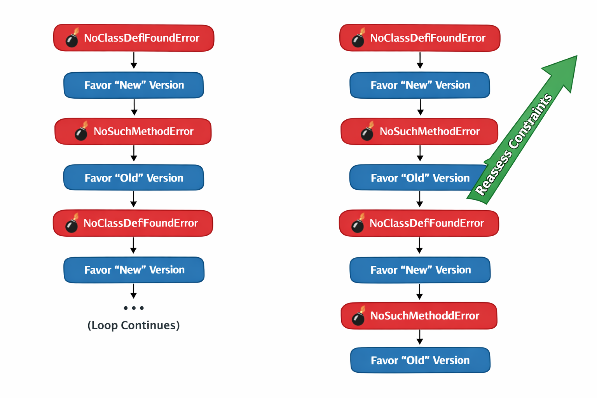
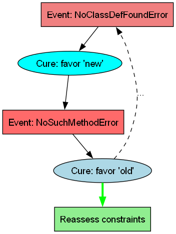

We encountered a recurring dependency conflict (__Spring Boot__ vs __Logback__ versions `1.4.x` and `1.5.x`).
Attempts to resolve the issue through sophisticated dependency version management resulted in alternating runtime failures: `NoSuchMethodError` and `NoClassDefFoundError`.

The same failure signatures reappeared across iterations, suggesting that the dependency configuration __did not__ __converge__, effectively reaching a __dead end__.

In hindsight, it would have been more efficient to replace the __conflicting components__ and avoid the dependency alignment problem entirely.

Iterative troubleshooting is only effective if the diagnostic loop recognizes repeated failure signatures; otherwise, it can continue exploring the same solution space *indefinitely*.

Psychologically, the situation has a strong __Edge of Tomorrow__ feeling: while the *"You will have to die. Every day”* option is technically available, it quickly becomes exhausting and signals unproductivity to a human engineer.

Instead, one can pause with a simple question: *“Is there really no better approach?”*

By carefully guiding the agent (and oneself) to __detect__ the endless loop, weigh __risks__ and __constraints__, and consider __constructive__ __exits__, the human-natural solution — __replace__ the component, __reassess__ constraints, and explore __boundaries__ — becomes the __`higher-value__ __strategy__, transforming repeated iteration into insight-driven progress.

### Note

While reviewing technical solutions and identifying the precise cause of a failure can be complex, spotting repetition of the same failure pattern is comparatively easy.
$
When identical error signatures reappear across iterations, it is an immediate indication that the troubleshooting process has stopped making progress and is likely exploring the same solution space repeatedly.

Recognizing this early allows engineers to step back, reassess assumptions, and consider alternative approaches instead of continuing non-converging adjustments. 

This low-cost detection saves one's mental cycles, allowing a shift from repeated troubleshooting attempts to deeper analysis of the underlying constraints.

Words like “but”, “also”, “too”, “however”, “actually” often act as logical speed bumps.
