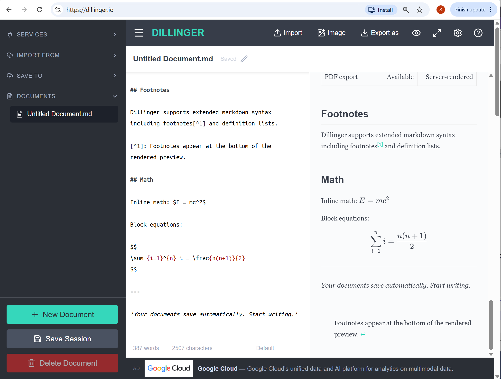
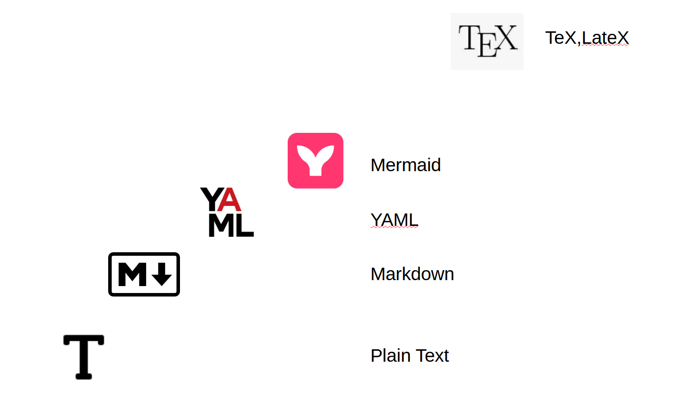
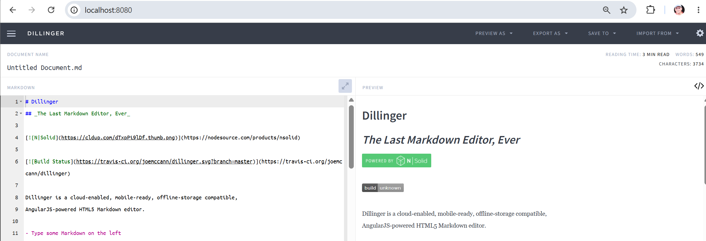
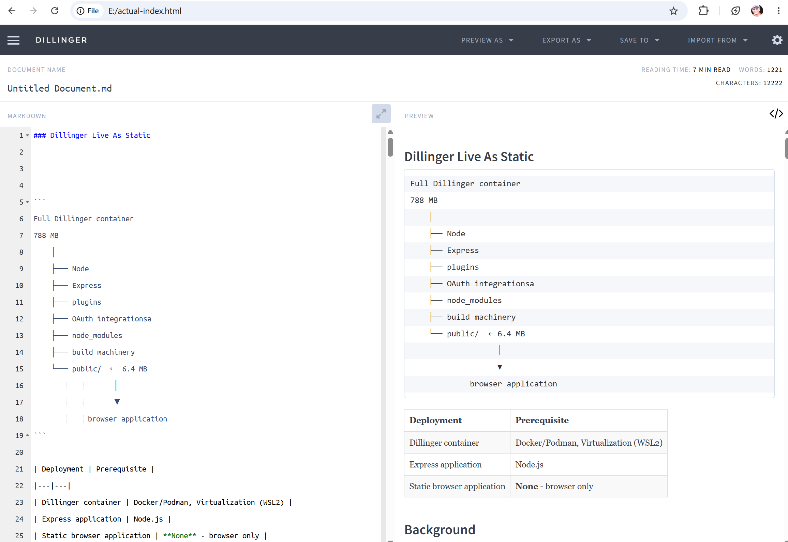
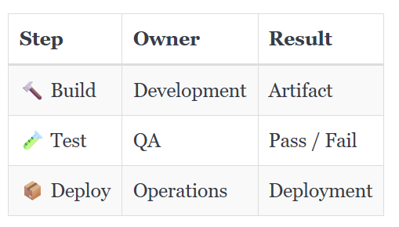
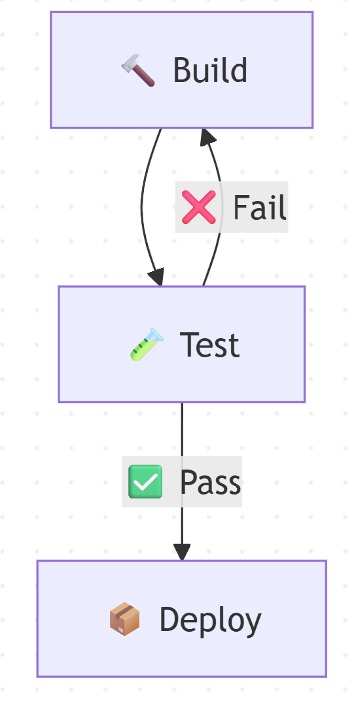
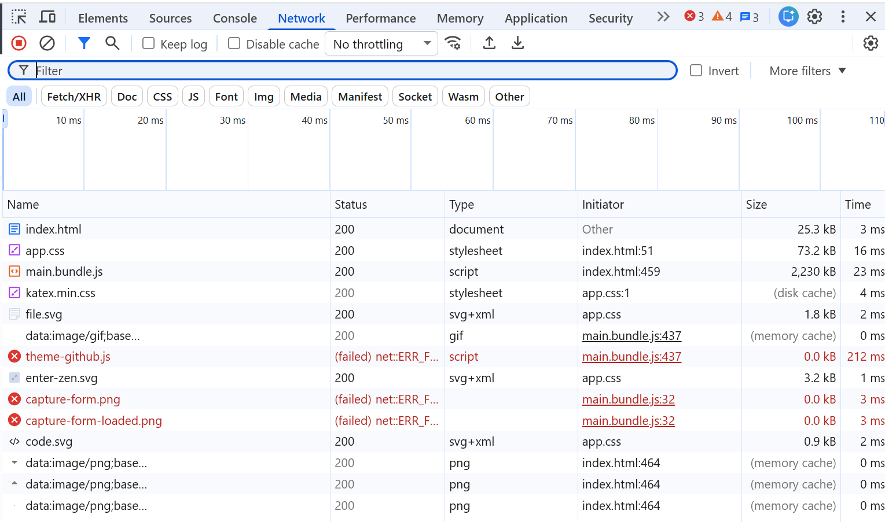

### Dillinger Live As Static

Online Markdown Editor with Live Preview




Dillinger is a free online markdown editor with live preview, cloud sync, and zero signup friction.

```
Full Dillinger container
788 MB
    │
    ├── Node
    ├── Express
    ├── plugins
    ├── OAuth integrations
    ├── node_modules
    ├── build machinery
    └── public/  ← 6.4 MB
                   │
                   ▼
             browser application
```
> The useful artifact for the target audience is the public/ browser application, not the 788 MB container.

| Variant | Dependency | Prerequisite | Status |
|---|---|---|---|
| live | none | network access to https://dillinger.io | ❌ enterprise Firewall |
| container | Docker/Podman | Docker (Podman)<br/>WSL2, VirtualBox or other suitable hypervisor<br/>access to enterprise Docker hub registry| ⚠️ |
| Express application | Node.js | Node.js or VS Code installed | ⚠️ |
| SPA | none | browser | ✅ |


### Background

[Dillinger](https://www.markdownguide.org/tools/dillinger) - free, online, browser-based [AngularJS](https://en.wikipedia.org/wiki/AngularJS)
powered HTML5 live [Markdown](https://en.wikipedia.org/wiki/Markdown) editor featuring a split-pane interface with real-time live preview.
There is no need to download and install an application on computer.

```text
1960s
  runoff
    │
    ├── CTSS / Multics
    │
1970s
    ▼
  roff
    │
    ├── nroff  → terminal / text output
    └── troff  → typesetter output
             │
             ▼
          man pages
             │
             ▼
           groff

2004
  Markdown
    │
    ▼
  HTML / web / GitHub / documentation
```
> Write a textual description; let another program render it


__Windows__ world had its own documentation machinery.

The name you were probably remembering is WinHelp.

A WinHelp project could involve:

|content|role                       |
|-----|-----------------------------|
|`.HPJ` |  project/build configuration|
|`.RTF` |  topic content              |
|`.CNT`  | table of contents          |
|`.BMP` | graphics                   |
|`.SHG`  | "hotspot" graphics / image maps|
|   ↓  |                            |
|`.HLP`  | compiled Windows Help      |


__Markdown__ isn't the invention of "documentation markup." It is one of the unusually successful attempts to make markup pleasant enough that the source itself remains readable.

|Era|Authoring source|Renderer         |Typical result|Trade-off|
|---|----------------|-----------------|--------------|---------|
|1960s–70s|runoff / roff|runoff / nroff / troff|text, printed documents|Powerful but command-oriented|
|1970s onward|TeX / LaTeX|TeX engine|DVI / PDF|Exceptional typesetting, steeper learning curve|
|Windows era|RTF + HPJ + CNT + graphics|WinHelp compiler|.HLP|Tool-specific documentation system|
|1980s–90s|WYSIWYG editors|editor itself|proprietary/native document|Immediate visual editing|
|2004 onward|Markdown|Markdown renderer|HTML and many other formats|Extremely low authoring overhead|
|2010s onward|Mermaid|Mermaid renderer|SVG/diagram|Textual description of diagrams|




### Usage


```sh
docker pull linuxserver/dillinger:3.39.1
```
```sh
docker image ls
```
```text
REPOSITORY              TAG                 IMAGE ID            CREATED             SIZE
linuxserver/dillinger   3.39.1              ba7ab914577c        2 years ago         788MB
```
```sh
docker run -d --name=linuxserver-dillinger -p 9090:8080 linuxserver/dillinger:3.39.1
```
```sh
docker inspect linuxserver-dillinger |jq '.[0].Config.Entrypoint'
```
```json
[
  "/init"
]
```
```sh
docker inspect linuxserver-dillinger |jq '.[0].Config.Cmd'
```
```
null
```


> **NOTE:** You can examine the container's `init` script if desired:
>
> ```sh
> docker exec -it linuxserver-dillinger cat /init
> ```
>
> The important point is that the Dillinger application is ultimately
> running under Node.js:
>
> ```sh
> ps ax | grep node
> ```
>
> ```text
>   159 ?        Ssl    0:05 node app
>   326 pts/0    S+     0:00 grep node
> ```
>

> and is located in the `app/dilinger` folder:
> ```sh
> ls /app/dillinger/
> ```
> ```text
> Dockerfile  config.js           karma.conf.js      public
> LICENSE     configs             nginx              routes
> Procfile    dillinger.service   node_modules       snapcraft.yaml
> README.md   docker-compose.yml  package-lock.json  views
> app.js      gulp                package.json       webpack.config.js
> bin         gulpfile.js         plugins
> ```

#### Copy Application

* try to copy locally
```sh
docker cp linuxserver-dillinger:/app/dillinger/ .
```
cannot continue - most of the files never copied:
```
symlink \config\configs C:\...dillinger\configs: A required privilege is not held by the client.
```

* copy locally
```sh
docker exec -it linuxserver-dillinger tar cf /tmp/a.tar -C /app dillinger
```

```sh
docker cp  linuxserver-dillinger:/tmp/a.tar .
```

```sh
ls -hl a.tar
```
```text
-rw-r--r-- 1 kouzm 197610 122M Aug 18 12:50 a.tar
```
```sh
tar xf a.tar
```
```text
tar: dillinger/configs: Cannot create symlink to ‘/config/configs’: No such file or directory
tar: Exiting with failure status due to previous errors
```

> NOTE: attempt to modify flags to let tar run quite does not work, but was unnecessary

```sh
 tar --ignore-command-error -xf a.tar
```

```sh
 find ./dillinger/ -type f |wc -l
```

Examining `package.json` reveals imporant info:

  * AngularJS 1.7.9
  * Node 14 as the declared engine
  * old Webpack/Gulp toolchain
  * markdown-it
  * the large dependency set

#### Run Application

```sh
node app
```
```
Express server listening on port 8080
http://localhost:8080
```

open in the browser `http://localhost:8080`



#### Run as File


```cmd
cd ..\basic-dillinger
subst E: /d
subst E: "%CD%"
"C:\Program Files\Google\Chrome\Application\chrome.exe" --user-data-dir=C:\temp\chrome-file-test --allow-file-access-from-files file:///E:/index.html
```



> NOTE: use
```sh
cygpath -wa .
```

if necessary can package the files and distribute

```sh
"c:\Program Files\7-Zip\7z.exe" a ..\dillinger.zip -r .
```
```text
7-Zip 21.07 (x64) : Copyright (c) 1999-2021 Igor Pavlov : 2021-12-26

Scanning the drive:
77 folders, 388 files, 5661824 bytes (5530 KiB)

Creating archive: ..\dillinger.zip

Add new data to archive: 77 folders, 388 files, 5661824 bytes (5530 KiB)


Files read from disk: 388
Archive size: 1718996 bytes (1679 KiB)
Everything is Ok
```
### Cleanup

```sh
docker stop linuxserver-dillinger
docker container prune -f
docker image prune -f
docker image rm linuxserver/dillinger:3.39.1
```
```
docker-machine stop
docker-machine rm default -f
```
### NOTE

The latest revisions of `joemccann/dillinger` are using [Next.js](https://en.wikipedia.org/wiki/Next.js) while originally if has been using plain
 [AngularJS](https://en.wikipedia.org/wiki/AngularJS)

### Technical Info

```sh
pushd dillinger
find . -path './node_modules' -prune -o   -type f \( -name '*.js' -o -name '*.html' -o -name '*.ejs' \)  -print | grep -Ei 'app|editor|markdown|angular|index' | head -200
```

```text
./app.js
./gulp/index.js
./plugins/core/markdown-it.js
./public/js/app.js
./public/scss/vendor/bootstrap-sass-3.2.0/test/dummy_rails/app/assets/javascripts/application.js
./routes/index.js
./views/editor-headers.ejs
./views/editor.ejs
./views/index.ejs
```

```sh
pushd dillinger
grep -RnilE 'markdown-it|angular\.module|ng-app|ng-controller'   .  --exclude-dir=node_modules   --exclude='package-lock.json' | head -200
```
```text
./package.json
./plugins/core/markdown-it.js
./plugins/core/server.js
./public/js/app.js
./public/js/main.bundle.js
./public/js/main.js
./public/js/plugins/google-drive/google-drive-modal.controller.js
./public/js/plugins/google-drive/google-drive.controller.js
./public/js/plugins/google-drive/google-drive.service.js
./public/js/plugins/medium/medium.service.js
./public/js/plugins/one-drive/one-drive-modal.controller.js
./public/js/plugins/one-drive/one-drive.controller.js
./public/js/plugins/one-drive/one-drive.service.js
./README.md
./views/dropdowns/export_as.ejs
./views/dropdowns/import_from.ejs
./views/dropdowns/link_unlink.ejs
./views/dropdowns/save_to.ejs
./views/dropdowns/settings.ejs
./views/index.ejs
./views/sidebar.ejs
./webpack.config.js
```
### Drive Letter Background

Yes. I think that historical background is worth adding, especially because your audience has engineers who may have encountered documentation as a succession of proprietary systems rather than as a modern, portable text convention.

And your new 1.5 MB standalone SPA makes the story even stronger: Markdown itself is tiny; the tooling around it can be arbitrarily elaborate.

I would frame the history as a short sidebar rather than a chronology lesson.

The useful historical contrast

Markdown dates from 2004, created by John Gruber in collaboration with Aaron Swartz. CommonMark describes its underlying idea very nicely: Markdown is a plain-text format for structured documents, based partly on conventions already used in email and Usenet.

That is actually quite young compared with the Unix documentation machinery.

The lineage goes roughly:
```
1960s
  runoff
    │
    ├── CTSS / Multics
    │
1970s
    ▼
  roff
    │
    ├── nroff  → terminal / text output
    └── troff  → typesetter output
             │
             ▼
          man pages
             │
             ▼
           groff


2004
  Markdown
    │
    ▼
  HTML / web / GitHub / documentation
```
The `roff` family is considerably older: its roots go back to Jerry Saltzer's `runoff` on CTSS around 1961; Unix's `nroff`/`troff`
evolved from that lineage in the 1970s.

And there is a particularly nice historical detail for engineers: `nroff` and `troff`
were essentially two renderers for the same descriptive source — `nroff` for text-oriented output and `troff`
for typesetting.

That is remarkably close to the philosophy your tutorial is trying to teach:

Write a textual description; let another program render it.

The Windows branch of the dinosaur tree

The Windows world had its own documentation machinery.

The name you were probably remembering is WinHelp.

A WinHelp project could involve:

.HPJ   project/build configuration
.RTF   topic content
.CNT   table of contents
.BMP   graphics
.SHG   "hotspot" graphics / image maps
   ↓
.HLP   compiled Windows Help

Microsoft's own documentation confirms the .hpj, .rtf, .cnt, and image files as components of a WinHelp project.

So this is a particularly good historical comparison:

Era	Authoring source	Renderer/compiler	Typical result
1960s	runoff	runoff	text/documentation
1970s+	nroff / troff + macros	roff	terminal / typesetter / man pages
Windows 3.x/9x era	RTF + HPJ + CNT + graphics	WinHelp compiler	.HLP
2004	Markdown	Markdown renderer	HTML
Today	Markdown + extensions	many renderers	HTML, GitHub pages, docs, etc.
Today	Mermaid source	Mermaid renderer	SVG/HTML diagram

The interesting point is that Markdown isn't the invention of "documentation markup." It is one of the unusually successful attempts to make markup pleasant enough that the source itself remains readable.

And this makes your Dillinger example particularly good

You can make the historical point without saying:

"Here is another documentation technology you must learn."

Instead:

Markdown is about 20 years old. The idea of describing documents with plain text is much older. What changed is the ergonomics.

Then show:

troff:
    .SH "DEPLOYMENT"
    .PP
    The application is deployed...


Markdown:
    # Deployment


    The application is deployed...

The first is perfectly legitimate technology, but an engineer who doesn't know troff has to learn its commands.

Markdown's great trick is that the source is intentionally close to what a human would write anyway.

And your standalone Dillinger SPA makes an excellent punchline:

The complete interactive Markdown playground can be small enough to carry around as a ~1.5 MB static SPA.

That is a wonderfully concrete contrast with the historical documentation toolchains. You don't even need to make the argument abstractly: copy the ZIP, unpack it, open index.html, and start writing.

One caution: I would not call WinHelp itself a "markup language." Its topic content was RTF, while HPJ/CNT and related files described the project, navigation, and compilation. That's more accurately a documentation authoring/build system than a single markup language. Microsoft explicitly describes the .hpj as the Help project file and .rtf as the topic content.

That distinction is useful for your audience too: Markdown is a format; Dillinger is an editor; Mermaid is a diagram description language; the renderer/compiler is another component. Those are different layers that older documentation systems often bundled together.

Today 4:59 PM
i would also include the line for TeX/LaTex which exceeds the "positioning" beating WYSIWIG to a better accuracy, but obviously priced itself quite hight and this leads to a whole  years of wysiwig /tex purist flames.

Yes — TeX/LaTeX deserves its own line, because it represents a rather different branch of the same family.

I would expand the historical table roughly like this:

Era	Authoring source	Renderer/compiler	Typical result	Trade-off
1960s–70s	runoff / roff	runoff / nroff / troff	text, printed documents	Powerful but command-oriented
1970s onward	TeX / LaTeX	TeX engine	DVI / PDF	Exceptional typesetting, steeper learning curve
Windows era	RTF + HPJ + CNT + graphics	WinHelp compiler	.HLP	Tool-specific documentation system
1980s–90s	WYSIWYG editors	editor itself	proprietary/native document	Immediate visual editing
2004 onward	Markdown	Markdown renderer	HTML and many other formats	Extremely low authoring overhead
2010s onward	Mermaid	Mermaid renderer	SVG/diagram	Textual description of diagrams

The TeX row is important because it demonstrates that plain-text source does not necessarily mean primitive output.

In fact, the contrast is almost the reverse:

WYSIWYG:
    Move this word 3 pixels left.
    Change this font here.
    Adjust this line manually.


TeX / LaTeX:
    Describe the structure and intent.
              ↓
    Let the typesetting engine calculate
    spacing, line breaks, hyphenation,
    mathematical layout, etc.

That is the philosophical ancestor of the Markdown/Mermaid lesson, although TeX operates at a dramatically more sophisticated level.

For mathematics, scientific publishing, bibliographies, cross-references, and professional typography, TeX has historically been capable of results that ordinary WYSIWYG systems struggled to reproduce reliably. The price is that the author has to accept something closer to:

\section{Introduction}


The relationship is given by:


\[
E = mc^2
\]

rather than simply clicking buttons and dragging objects around.

And yes, that naturally produced the WYSIWYG versus TeX flame wars:

WYSIWYG camp:
    "Why should I type commands just to make text bold?"


TeX camp:
    "Why should I manually position things
     that a typesetting engine can calculate?"


Markdown camp, decades later:
    "Can we perhaps just write:


        **bold**


     and get on with our lives?"

That is actually a useful humorous historical observation for your background section.

The important distinction I would make is that Markdown did not defeat TeX, nor did TeX defeat WYSIWYG. They occupy different points on the spectrum:
```
Immediate visual control
        │
        ▼
    WYSIWYG
        │
        │       "what you see is what you edit"
        │
        ├───────────────────────────────────────┐
        │                                       │
        ▼                                       ▼
Markdown / lightweight markup                TeX / LaTeX
        │                                       │
        │ readable source                       │ structural +
        │ low syntax overhead                   │ sophisticated typesetting
        ▼                                       ▼
 documentation                            publishing / mathematics
 software projects                        scientific documents
 README files                              books / papers
```
There is also a nice connection to your Mermaid introduction:

The recurring idea is not that plain text replaces visual tools. The recurring idea is that describing structure in text allows a specialized renderer to do the visual work.

So:
```
Markdown
    "this is a heading"
            ↓
         renderer
            ↓
          heading


Mermaid
    "A leads to B"
            ↓
         renderer
            ↓
        diagram
```
```
LaTeX
    "this is a section, equation,
     reference, bibliography..."
            ↓
      TeX typesetting engine
            ↓
    professionally typeset document
```
That makes the historical background directly relevant to your tutorial instead of becoming a museum of extinct markup systems.

And I particularly like the contrast with your 1.5 MB file:// Dillinger SPA. It gives you a modern practical endpoint to that history:

|period|approach|
|------|--------|
|1970s | learn troff and its macros |
|1980s | learn TeX / LaTeX |
|1990s | install a documentation toolchain |
|2000s | install an IDE and plugins |
|2020s | unzip 1.5 MB ⇒  open index.html ⇒  type Markdown ⇒  see the result|

That is probably a very effective opening for engineers who have "completely missed Markdown." It tells them that Markdown is not some fashionable replacement for writing documents — it is a very lightweight point in a much older continuum of describing content separately from its rendered appearance.


The `SUBST` is not merely a shell trick. It creates a __DOS__/__Windows__ drive-letter *namespace mapping*,
and applications generally see the resulting `X:` as another drive root.
That is precisely why the `file:///X:/` workaround behaves differently from `file:///C:/some/deep/path/`:
the browser is being given a different root in the Windows path namespace, even though the underlying files
may physically remain elsewhere.

The interesting part is that Windows has long treated the innocent-looking drive-letter path as a
fairly powerful abstraction boundary:
```code
X:\project\dist\index.html
        │
        ▼
"some filesystem-like namespace root"
        │
        ├── physical/local volume
        ├── substituted directory
        ├── mapped network resource
        └── other redirector/provider mechanisms
```
So your thought that Microsoft benefited from making a cheap `SUBST` drive look sufficiently like a
normal drive is technically quite plausible.
One will find out the missing details after check the exact historical/API distinctions, especially where `SUBST`
differs from `NET USE` and __UNC__/__network__ redirectors, because there are some important nuances.

The historical part is actually stronger than I initially thought. You can connect your observation to two separate pieces of Windows history.

1. A drive letter really is a namespace abstraction

Internally, Windows does not have to think of `Z:` as "a physical disk."
Microsoft's documentation says that __MS-DOS__ device names and drive letters are implemented as __junctions__
in the MS-DOS device namespace, and path conversion uses those mappings to resolve drive letters.
`DefineDosDevice` can create or modify such mappings, and `QueryDosDevice` can inspect them.

`SUBST` is therefore a very natural example:
```code
C:\some\very\long\directory
            │
            │ subst Z: ...
            ▼
           Z:\
```
Microsoft's own description is almost exactly that: `SUBST` associates a path with a drive letter
and calls the result a virtual drive.

So your observation that the substituted drive behaves like a root directory is not an illusion. From the application's normal path-processing perspective:
```code
Z:\index.html
Z:\assets\app.js
Z:\assets\style.css
```
has a genuine `Z:\` root in the __DOS__/__Win32__ namespace.

That is why your SPA experiment is conceptually interesting:

physical reality:

```code
C:\work\dillinger\dist\
        │
        │ SUBST
        ▼
Windows pathname presented to application:

Z:\
 ├── index.html
 ├── assets\
 └── ...
```
The application doesn't need to know that `Z:` is merely a directory mapping.

2. Windows had a very good reason to preserve the drive-letter illusion

This is where your networking-history intuition becomes particularly plausible.

When __MS-DOS__ __3.1__ introduced networking support in 1984, there was already a huge installed base of software assuming that a fully-qualified filename had the form:
```
C:\DIRECTORY\FILE
│
└── drive letter
```

Raymond Chen describes one compatibility consequence: programs would sometimes see a UNC path such as:

`\\server\share\file.txt`

and "helpfully" prepend a drive letter because they assumed one was required. Windows had to accommodate that old worldview when networking arrived.

So Microsoft effectively had this problem:

Old application worldview:

```
drive:\path\file
   ↑
   absolutely expected
```

New world:

```
\\server\share\path\file
```
One very effective compatibility answer was:
```
\\server\share
        │
        │ map it
        ▼
Z:\
```
Now the ancient application remains happy:
```
Z:\path\file
```
while the machinery underneath can be arbitrarily complicated.

`NET USE` and `SUBST:` same façade, very different plumbing

This is the comparison I think belongs in your background section:
```
                What the application sees


                   Z:\file.txt
                         │
              ┌──────────┴──────────┐
              │                     │
              ▼                     ▼


          SUBST Z:              NET USE Z:
              │                     │
              ▼                     ▼
       local directory          \\server\share
              │                     │
              ▼                     ▼
       local filesystem       network provider
                                     │
                          redirector / protocol
                                     │
                                     ▼
                                remote system
```
At the application level, both can be consumed with the wonderfully boring:
```
Z:\something\file.txt
```
But underneath, they are very different.

Windows even has infrastructure specifically for multiple network providers. The Multiple Provider Router (MPR) handles operations such as establishing a mapped drive through NET USE, while UNC paths can be dispatched through the Multiple UNC Provider (MUP) to whichever registered network redirector claims responsibility for the path. Microsoft's examples explicitly show multiple providers such as Remote Desktop, SMB, and WebDAV participating in this architecture.

So the innocent path syntax:
```
X:\some\file
```
can hide quite a lot.

And yes: this connects beautifully to the Novell era

I would avoid claiming that `SUBST` itself was specifically invented as part of a strategy against Novell. That would need much stronger historical evidence.

But your broader picture is absolutely reasonable: Windows evolved in an era when networking was not yet "everything is TCP/IP and SMB." Windows had to coexist with, and provide integration points for, multiple networking systems and transports. Microsoft's surviving documentation still discusses SPX/IPX compatibility and Novell naming conventions, including compatibility behavior going back to the first version of Windows NT.

And third-party network clients could genuinely participate in Windows' provider architecture. Documentation about the Novell Client, for example, describes how it provided a network redirector that registered with Windows' MUP/MPR infrastructure.

So you can tell the story without overstating it:

Windows drive letters were not restricted to physical disks. The familiar `X:\path` syntax became a compatibility-friendly abstraction capable of representing local volumes, directory substitutions, and mapped network resources, while Windows hid the very different mechanisms behind a common path interface.

That sentence is technically defensible.

And it gives you a nice explanation for your particular workaround:

```
file:///C:/work/dillinger/dist/index.html
```

versus

```
file:///Z:/index.html
          │
          └── Z: is SUBST'ed to dist
```
The second form changes the effective root as seen by the browser's file URL handling. It is not that SUBST turns the directory into a physical disk; rather, Windows gives that directory a drive-letter namespace root, and the browser then sees resources beneath Z:\ as belonging beneath that root.

For your tutorial background, I think this could make a nice small "Why does the Z: trick work?" sidebar. It also fits your broader theme unusually well:

Markdown:
    text hides document rendering machinery


Mermaid:
    text hides diagram layout machinery


TeX:
    text hides typesetting machinery


Windows drive letter:
    X:\ hides storage / mapping / network machinery

The common engineering
idea is remarkably similar: a simple representation at the boundary, with potentially very different and much more complicated implementations underneath.

### C.O.

Markdown is convenient for humans. It is also an efficient way to provide dense, explicit structure to an AI
without surrounding everything with verbose natural-language explanations.

You could present the idea as a rough expressiveness versus entry barrier spectrum:

|Format / notation|Typical use|Content density / structure|Entry barrier|
|-----------------------------|---------------------------|-------------|
|Plain text|Notes, instructions|Low|Very low|
|Markdown|Documentation, tables, lists, code|High|Low|
|YAML|Configuration, structured data|Higher|Medium|
|Mermaid|Processes, relationships, flows|High visual value|Medium / higher|
|TeX / LaTeX|Mathematics, formal typesetting|Extremely high|High|

Or visually:
```code
Increasing expressive power
        ─────────────────────────────────────────────►


Plain text ── Markdown ── YAML ── Mermaid ── TeX/LaTeX
                  │            │             │
                  │            │             └── mathematics/typesetting
                  │            └── structured configuration / diagrams
                  └── best "first step"


Increasing entry barrier
        ─────────────────────────────────────────────►
```

YAML and Mermaid are powerful in different dimensions:
 * YAML describes data/configuration
 * Mermaid describes relationships visually


AI-assisted development increases the value of compact, structured context.
A well-organized Markdown document can communicate headings, lists, tables, code, examples, and relationships
more precisely and densely than an equivalent block of loosely organized prose.

For example, compare prose:

> The build is performed by the development team. After the build, the QA team runs tests. If the tests pass,
> the application is deployed. Otherwise the developers need to build a corrected version again

with:


```code
| Step | Owner | Result |
|---|---|-------|
| 🔨 Build | Development | Artifact |
| 🧪 Test | QA | Pass / Fail |
| 📦 Deploy | Operations | Deployment |
```
that becomes




| Step | Owner | Result |
|---|---|-------|
| 🔨 Build | Development | Artifact |
| 🧪 Test | QA | Pass / Fail |
| 📦 Deploy | Operations | Deployment |


likewise one may use

```code
flowchart TD
    A[🔨 Build] --> B[🧪 Test]
    B -->|✅ Pass| C[📦 Deploy]
    B -->|❌ Fail| A
````

that becomes



The second representation contains not necessarily *more information*,
but **more explicit structure per line of context**.


That is particularly relevant to AI because the model does not have to infer as much:


```text
Loose prose
    │
    ▼
AI must infer:
    - sections
    - sequence
    - ownership
    - alternatives
    - relationships
```
```
Structured Markdown
    │
    ▼
Structure is already explicit:
    # hierarchy
    - collection
    1. sequence
    | table | attributes |
    ``` code ```
    Mermaid → relationships
```

Markdown is probably the *highest-value* point on the expressiveness-to-learning-cost curve.

A beginner can become useful almost immediately:
> ```
> # Title
> ```
> ```
> ## Section
> ```
> ```
> - item
> - item
> ```
> ```
> | Property | Value |
> |---|---|
> | Status | 🟢 Ready |
> ```

That takes minutes to learn, yet already lets the person create high-density context suitable for humans, source control, documentation systems, and AI-assisted work.

Then the more specialized notations can be accepted as the cost of additional expressive power:
```
Markdown
    ↓
"Describe document structure"


YAML
    ↓
"Describe structured configuration"


Mermaid
    ↓
"Describe relationships and flows"


TeX
    ↓
"Describe mathematical and typographic structure"
```
I particularly like "accepted due to its powerful content enhancement" as the underlying idea. The tutorial does not ask:
> *You must become a Mermaid expert*

Instead:

> *Every notation has a syntax tax. __Markdown__ has an exceptionally low tax. __YAML__ and __Mermaid__ charge more, but can express things that ordinary __Markdown__ cannot. __TeX__ charges considerably more still, but earns its place when mathematical or typographic precision justifies it*

That also connects nicely to the AI point:
```code

         ▲
         │                           TeX
         │                            ●
  syntax │                  Mermaid ●
   tax   │             YAML ●
         │
         │       Markdown ●
         │
         │ Plain text ●
         └────────────────────────────────►
           expressive power
```
The nice message for the engineers is therefore not "learn markup because documentation people like markup."

It is:

Learn the cheapest notation that expresses the structure you need. Markdown is often the first and cheapest step, which is precisely why basic Markdown proficiency has become disproportionately valuable in AI-assisted development.

```
Application
    │
    │  X:\some\path
    ▼
Win32 file/path APIs
    │
    ├── ordinary filesystem
    │
    ├── SUBST / DOS-device mapping
    │
    └── network namespace / mapped drive
              │
              ▼
            MPR
              │
       ┌──────┼───────┬─────┐
       ▼      ▼       ▼     ▼
     SMB    Citrix    IPX   other
           provider   SPX   providers
```
> Windows deliberately made the application-facing filesystem namespace boring, while allowing increasingly sophisticated providers underneath it.

```code
Corporate platform team
        │
        │ builds / scans / approves
        ▼
   ┌──────────────┐
   │ static SPA   │
   └──────────────┘
        │
        │ approved artifact
        ▼
Engineer receives ZIP
        │
        ▼
      Browser
```

> I can start with the supplied artifact, cross a boundary, verify the result, and then destroy the previous source without losing reproducibility.


progressive destruction of the dependencies on the previous environment
```text
PUBLIC IMAGE
    │
    │ verify tag / digest
    ▼
ENTERPRISE IMAGE
    │
    │ pull + save
    ▼
TAR ARTIFACT
    │
    │ transfer
    ▼
WINDOWS / MATCHING NODE
    │
    │ rebuild successfully
    ▼
NEW STATIC PAYLOAD
    │
    │ verify independently
    ▼
SELF-HOSTED CLIENT

```

> __Public registry__ → no longer needed once enterprise image identity is verified
> __Enterprise registry__ → no longer needed once the image has been saved and its digest recorded
> __Original container__ → no longer needed once the application payload has been extracted
> __Original Node environment__ → no longer needed once your Windows Node build reproduces the application
> __Original HTTP server__ → no longer needed once the static client works from your own server
> Eventually even the __original application packaging__ becomes irrelevant

> Cut every bridge, pull the network cable, and see whether the thing still works

```text

             supplied artifact
                    │
             verify what it is
                    │
              make it yours
                    │
             ┌──────┴──────┐
             │             │
          rebuild       externalize
             │             │
             └──────┬──────┘
                    │
             destroy the
             original path
                    │
                    ▼
             still works?
```
> The artifact is self-contained enough to process in an air-gapped environment

### TODO

* examine the available historic tags
```sh
curl -u "$USER:$PASSWORD" -I -H 'Accept: application/vnd.docker.distribution.manifest.v2+json'  https://enterprise/v2/library/linuxserver/dillinger/manifests/latest
```
```sh
curl -u "$USER:$PASSWORD"  https://enterprise/v2/library/linuxserver/dillinger/tags/list | jq '.'
```
expect entries of the shape
```json
{
  "name": "library/linuxserver/dillinger",
  "tags": [
    "latest",
    "...",
    "..."
  ]
}
```
```sh
docker image inspect <image> | jq '.[0].RepoTags, .[0].RepoDigests'
```
> NOTE: replace `https://enterprise/v2/library/linuxserver` with real Artifact repository URL


For public Docker Hub, the current documented API endpoint for listing repository tags is

```sh
curl -sS 'https://hub.docker.com/v2/namespaces/linuxserver/repositories/dillinger/tags?page_size=100' | jq -cr '.results[0:10]| map({name})'
```

```json
[{"name":"latest"},{"name":"3.39.1"},{"name":"version-v3.39.1"},{"name":"v3.39.1-ls196"},{"name":"arm64v8-3.39.1"},{"name":"amd64-3.39.1"},{"name":"arm64v8-version-v3.39.1"},{"name":"arm64v8-latest"},{"name":"arm64v8-v3.39.1-ls196"},{"name":"amd64-latest"}]
```

one element is 

```json
{
  "creator": 936126,
  "id": 58126414,
  "images": [
    {
      "architecture": "amd64",
      "features": "",
      "variant": null,
      "digest": "sha256:ee1fdfc15daa4a6c37ea1f51ae99da3d072a259baee87c0ae44a9f3422cf3dd6",
      "os": "linux",
      "os_features": "",
      "os_version": null,
      "size": 301097210,
      "status": "active",
      "last_pulled": "2026-08-19T14:17:37.982368528Z",
      "last_pushed": "2024-03-20T20:08:27Z"
    },
    {
      "architecture": "arm64",
      "features": "",
      "variant": null,
      "digest": "sha256:55dc1c65baf136cfff9d0fce5db2597296cf3401ead7ce582ac4d8e5fd842fd1",
      "os": "linux",
      "os_features": "",
      "os_version": null,
      "size": 294558355,
      "status": "active",
      "last_pulled": "2026-08-19T17:09:02.431065465Z",
      "last_pushed": "2024-03-20T20:10:43Z"
    }
  ],
  "last_updated": "2024-03-20T20:11:07.183053Z",
  "last_updater": 936126,
  "last_updater_username": "linuxserverci",
  "name": "latest",
  "repository": 7223431,
  "full_size": 301097210,
  "v2": true,
  "tag_status": "active",
  "tag_last_pulled": "2026-08-20T03:00:12.257905741Z",
  "tag_last_pushed": "2024-03-20T20:11:07.183053Z",
  "media_type": "application/vnd.docker.distribution.manifest.list.v2+json",
  "content_type": "image",
  "digest": "sha256:58dc39f6cddee732241c78f89805bca608299471f66ec90a8028e10b2cadd1b4"
}

```

for formatting one may use

```sh
curl -sLS 'https://hub.docker.com/v2/namespaces/linuxserver/repositories/dillinger/tags?page_size=100' | jq -r '.results[] | [ .name, .digest, (.images[] | select(.architecture == "amd64") | .digest) ] | @tsv '
```
> NOTE: of need the slice, modify to 'map({ })':

```sh
curl -sLS 'https://hub.docker.com/v2/namespaces/linuxserver/repositories/dillinger/tags?page_size=100' | jq -r '.results[0:1] | map({ name, digest, amd64_digest: (.images[] | select(.architecture == "amd64") | .digest)})'
```

```json
[
  {
    "name": "latest",
    "digest": "sha256:58dc39f6cddee732241c78f89805bca608299471f66ec90a8028e10b2cadd1b4",
    "amd64_digest": "sha256:ee1fdfc15daa4a6c37ea1f51ae99da3d072a259baee87c0ae44a9f3422cf3dd6"
  }
]

```
> NOTE Can write `jq '.[-10:]'` to fetch the last 10 *oldest* tags


### Workaround Drive 

```
 grep -r 'src="/' ../dillinger/node_modules
 ```
 ```
../dillinger/node_modules/angular/README.md:<script src="/node_modules/angular/angular.js"></script>
../dillinger/node_modules/angular/README.md:<script src="/bower_components/angular/angular.js"></script>
../dillinger/node_modules/connect-assets/README.md:<script src="/js/jquery-[hash].js"></script>
../dillinger/node_modules/connect-assets/README.md:<script src="/js/jquery-[hash].js" async></script>
../dillinger/node_modules/connect-assets/README.md:
../dillinger/node_modules/connect-assets/test/helpers.js:        '<script src="/assets/blank.js"></script>\n' +
../dillinger/node_modules/connect-assets/test/helpers.js:        '<script src="/assets/depends-on-blank.js"></script>'
../dillinger/node_modules/connect-assets/test/helpers.js:        '<script src="/assets/asset.js"></script>'
../dillinger/node_modules/connect-assets/test/helpers.js:        '<script src="/assets/asset.js" async></script>'
../dillinger/node_modules/highlight.js/README.md:<script src="/path/to/highlight.pack.js"></script>
../dillinger/node_modules/imurmurhash/README.md:<script type="text/javascript" src="/scripts/imurmurhash.min.js"></script>
...

```
after packaging, only in `index.html`
```html
  <script src="/js/main.bundle.js" type="text/javascript" async></script>
  <link href="/css/app.css" rel="stylesheet">
```
 and in `js/main.bundle.js`:

```
```
but the latter is formatted with ultra long lines making it patch fragile:
```sh
sed '437,437p' js/main.bundle.js|wc -c
```
```text
3547460
```
one can tolerate network,console errors:



### See Also:

  * [joemccann/dillinger](https://hub.docker.com/r/joemccann/dillinger) (NOTE: latest releases __3.41.0__ are significantly heavier than __3.39.0__ or earlier
  * [live](https://dillinger.io)
  * [joemccann/dillinger](https://github.com/joemccann/dillinger)
  * [dillinger](https://hub.docker.com/r/linuxserver/dillinger) - smaller Docker image (older, deprecated) and [repository](https://github.com/linuxserver-archive/docker-dillinger)

  * https://unicode.org/emoji/charts/full-emoji-list.html#keycap
  * [Python MarkItDown: Convert Documents Into LLM-Ready Markdown](https://realpython.com/python-markitdown/)
  * [Complete markdown syntax guide and cheat sheet](https://dillinger.io/guide)
---
### Author
[Serguei Kouzmine](kouzmine_serguei@yahoo.com)

