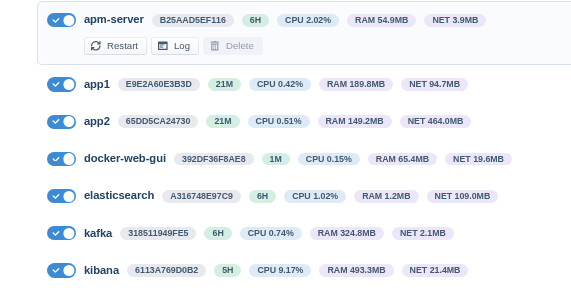
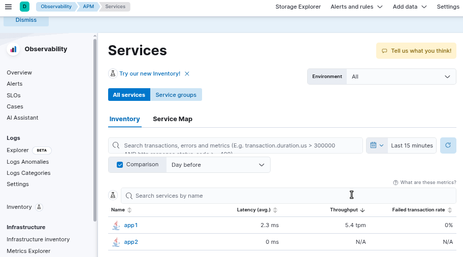
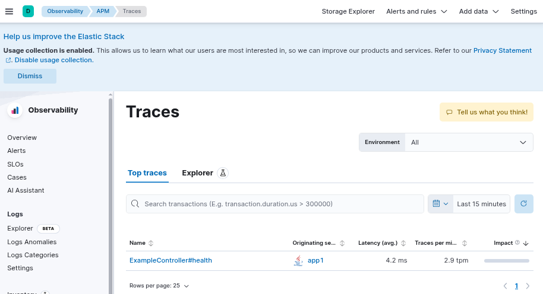
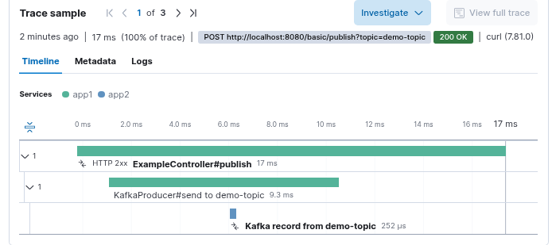
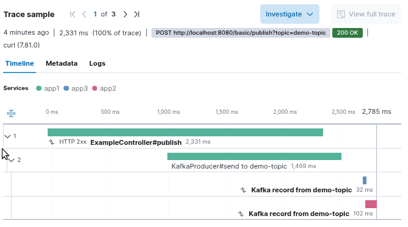
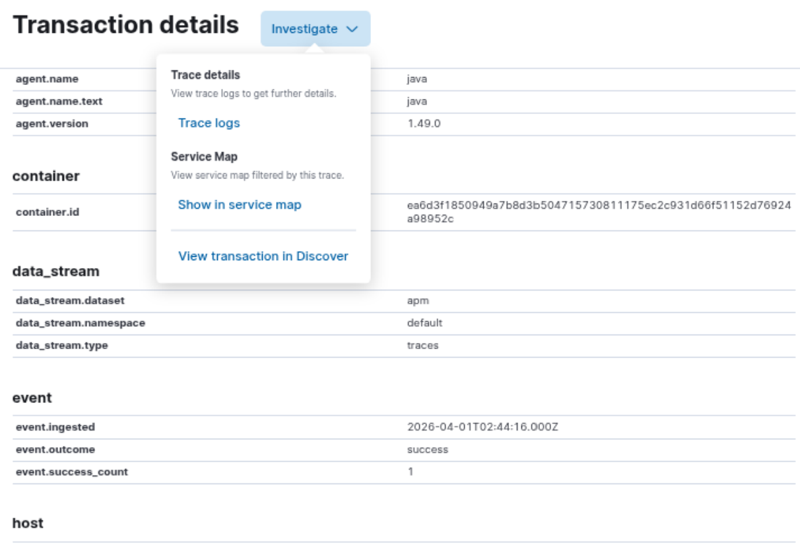

### Usage

*  build app
```sh
for F in app1 app2 app3; do pushd  $F; mvn package ;   popd; done
```
* build cluster 
```sh
VERSION=8.17.8

docker pull docker.elastic.co/apm/apm-server:$VERSION
docker pull kibana:$VERSION
docker pull elasticsearch:$VERSION
docker pull confluentinc/cp-kafka:7.6.0
docker pull eclipse-temurin:11-jre-alpine
```
```sh
docker-compose up --build -d
```

this will construct a minimal cluster running Java Spriung apps exchanging messages through Kafka.

> NOTE if you want to only rebuild `app1`, `app2` then
```sh
docker-compose stop app1 app2 app3
docker-compose rm -f app1 app2 app3
``` 
```sh
docker-compose ps
```




```txt
   Name                   Command                  State                            Ports                     
---------------------------------------------------------------------------------------------------------------
apm-server      /usr/bin/tini -- /usr/loca ...   Up (healthy)   0.0.0.0:8200->8200/tcp,:::8200->8200/tcp       
app1            java -javaagent:/home/elas ...   Up (healthy)   0.0.0.0:8080->8080/tcp,:::8080->8080/tcp       
app2            java -javaagent:/home/elas ...   Up                                                            
elasticsearch   /bin/tini -- /usr/local/bi ...   Up (healthy)   0.0.0.0:9200->9200/tcp,:::9200->9200/tcp,      
                                                                9300/tcp                                       
kafka           /etc/confluent/docker/run        Up             0.0.0.0:9092->9092/tcp,:::9092->9092/tcp       
kibana          /bin/tini -- /usr/local/bi ...   Up (healthy)   0.0.0.0:5601->5601/tcp,:::5601->5601/tcp  
```
Both services are known to Elastic




* Start the transaction

```sh
curl http://localhost:8080/basic/health; echo $?
```
```
0
```
```sh
curl -sv -XPOST "http://localhost:8080/basic/publish?topic=demo-topic" -H 'Content-Type: application/json' -d "{\"name\": \"new value $(date +%c)\"}"
```
```text
published 21 to demo-topic
```
>NOTE:  currently only one topic `demo-topic` is known to `app2` and is har oded.

* confirm the payload was posted to Kafka
```sh
docker-compose logs app1
```
```text
app1             | 2026-03-30 21:42:50.221  INFO 1 --- [io-8080-exec-10] o.a.kafka.common.utils.AppInfoParser     : Kafka commitId: f8c67dc3ae0a3265
app1             | 2026-03-30 21:42:50.221  INFO 1 --- [io-8080-exec-10] o.a.kafka.common.utils.AppInfoParser     : Kafka startTimeMs: 1774906970218
app1             | 2026-03-30 21:42:50.799  INFO 1 --- [ad | producer-1] org.apache.kafka.clients.Metadata        : [Producer clientId=producer-1] Resetting the last seen epoch of partition demo-topic-0 to 4 since the associated topicId changed from null to GuyR47BRTwmatE3NTgxTJQ
app1             | 2026-03-30 21:42:50.803  INFO 1 --- [ad | producer-1] org.apache.kafka.clients.Metadata        : [Producer clientId=producer-1] Cluster ID: MkU3OEVBNTcwNTJENDM2Qg
app1             | 2026-03-30 21:42:50.811  INFO 1 --- [ad | producer-1] o.a.k.c.p.internals.TransactionManager   : [Producer clientId=producer-1] ProducerId set to 1002 with epoch 0
app1             | published 21 to demo-topic
```

* confirm the payload is present on Kafka

```sh
docker-compose exec kafka kafka-topics --bootstrap-server localhost:9092 --list
```

```text
__consumer_offsets
demo-topic
your-topic
```

```sh
docker-compose exec kafka kafka-console-consumer --bootstrap-server localhost:9092 --topic demo-topic --from-beginning
```
abort by `^C`
```text
{"name": "value"}
{"name": "new value"}
^CProcessed a total of 2 messages
```
* confirm the payload is colleted by `app2`,`app3` from Kafka

```sh
docker-compose logs app2
```
```text
app2             | received: {"name": "new value"}
```
```sh
docker-compose logs app3
```
```text
container    : demo-group-3: partitions assigned: [demo-topic-0]
app3             | received: {"name": "new value"}
app3             | traceparent = 00-91de0612610170e0e2dac7e5f5f0e86b-931e2ce0a734206b-01
app3             | elasticapmtraceparent = ��ap��������k�,�4 k
app3             | tracestate = es=s:1
```

Examine the Elastic APM Trace context propagation over Kafka find the operation that starts it




One can see the trace in action by drilling into waterfall steps 

in :

role | property           |    value 
-----|------------------- | ---------------------
__app1__ | `span.id`             | `f89f900d2ef87c5a`	
__app2__  | `parent.id`          | `f89f900d2ef87c5a`


There is also a flow fragments:


when `app2`, `app3` in same grop only one receives:


when both `app2` and `app3` receive both are shown 



to find out why  one was slower than the other onn can jump to trace logs:



of course for the quety to return something one has to *collect the logs* first:

```sql
trace.id:"91de0612610170e0e2dac7e5f5f0e86b" OR
 (not trace.id:* AND "91de0612610170e0e2dac7e5f5f0e86b")
```

> NOTE: In order to access ELK __Service Maps__, one must be subscribed to an __Elastic Platinum license__

### Technical Details
```sh
docker-compose run kafka kafka-console-consumer --bootstrap-server localhost:9092 --topic demo-topic --from-beginning --property print.headers=true
```
```text
traceparent:00-602de1168690be4a4eeccb1290a10092-04e9f6c9463d8fb8-01,elasticapmtraceparent:`-����JN��������F=��,tracestate:es=s:1	{"name": "new value"}
```
also can print headers in the `app2`:
```text
app2             | received: {"name": "new value"}
app2             | traceparent = 00-cc112640a8c24a15f1b18ca6818408fd-c0e9ee0231d14d2e-01
app2             | elasticapmtraceparent = �&@��J񱌦�����1�M.
app2             | tracestate = es=s:1
```

### Cleanup

```sh
docker-compose stop ; docker-compose rm -f 

docker image prune -f
docker container prune -f
docker image ls | grep -Ei '^basic-elk-kafka-cluster' | awk '{print $1'} | xargs -IX   docker image rm X
docker image rm "docker.elastic.co/apm/apm-server:8.17.8" "confluentinc/cp-kafka:7.6.0" "elasticsearch:8.17.8" "kibana:8.17.8"
docker volume prune -f
```
starving ELK:

```sh
curl -s http://localhost:9200/_cat/indices/.kibana*?v

```
```text
health status index                                uuid                   pri rep docs.count docs.deleted store.size pri.store.size dataset.size
red    open   .kibana_usage_counters_8.17.8_001    N77N1EtAQoy7G6IaF2DACg   1   0
red    open   .kibana_security_solution_8.17.8_001 wIhZyk9JSIK1P9WFYRTQcw   1   0
red    open   .kibana_8.17.8_001                   uBOSZBmMRYmRWVuZoK22OA   1   0
red    open   .kibana_ingest_8.17.8_001            SZuzWKifQuqefK64RBPmMw   1   0
red    open   .kibana_analytics_8.17.8_001         p8MOaDGdT_OgBvW_rx4dLA   1   0
red    open   .kibana_task_manager_8.17.8_001      zufOYaw6Q8mc8rf55Ny0nw   1   0
red    open   .kibana_alerting_cases_8.17.8_001    3jWr_-SsSP2XNQBk-1vlmQ   1   0

```
```sh
curl -X DELETE "http://localhost:9200/.kibana*"
```
```json
{
  "error": {
    "root_cause": [
      {
        "type": "illegal_argument_exception",
        "reason": "Wildcard expressions or all indices are not allowed"
      }
    ],
    "type": "illegal_argument_exception",
    "reason": "Wildcard expressions or all indices are not allowed"
  },
  "status": 400
}
```
```sh
docker-compose exec elasticsearch sh
```
```sh
curl -X DELETE "http://localhost:9200/.kibana_usage_counters_8.17.8_001"
curl -X DELETE "http://localhost:9200/.kibana_security_solution_8.17.8_001"
curl -X DELETE "http://localhost:9200/.kibana_8.17.8_001"
curl -X DELETE "http://localhost:9200/.kibana_ingest_8.17.8_001"
curl -X DELETE "http://localhost:9200/.kibana_analytics_8.17.8_001"
curl -X DELETE "http://localhost:9200/.kibana_task_manager_8.17.8_001"
curl -X DELETE "http://localhost:9200/.kibana_alerting_cases_8.17.8_001"

```
```json
{
  "acknowledged": true
}

```
```sh
curl -X GET "localhost:9200/_cluster/allocation/explain?pretty"
```
```json
{
  "note" : "No shard was specified in the explain API request, so this response explains a randomly chosen unassigned shard. There may be other unassigned shards in this cluster which cannot be assigned for different reasons. It may not be possible to assign this shard until one of the other shards is assigned correctly. To explain the allocation of other shards (whether assigned or unassigned) you must specify the target shard in the request to this API. See https://www.elastic.co/guide/en/elasticsearch/reference/8.17/cluster-allocation-explain.html for more information.",
  "index" : ".kibana_ingest_8.17.8_001",
  "shard" : 0,
  "primary" : true,
  "current_state" : "unassigned",
  "unassigned_info" : {
    "reason" : "INDEX_CREATED",
    "at" : "2026-03-30T15:35:40.792Z",
    "last_allocation_status" : "no"
  },
  "can_allocate" : "no",
  "allocate_explanation" : "Elasticsearch isn't allowed to allocate this shard to any of the nodes in the cluster. Choose a node to which you expect this shard to be allocated, find this node in the node-by-node explanation, and address the reasons which prevent Elasticsearch from allocating this shard there.",
  "node_allocation_decisions" : [
    {
      "node_id" : "YjIWHJOBTUujt4Uo9SLQ8g",
      "node_name" : "elasticsearch",
      "transport_address" : "172.18.0.2:9300",
      "node_attributes" : {
        "ml.allocated_processors" : "4",
        "ml.machine_memory" : "8320856064",
        "transform.config_version" : "10.0.0",
        "xpack.installed" : "true",
        "ml.config_version" : "12.0.0",
        "ml.max_jvm_size" : "536870912",
        "ml.allocated_processors_double" : "4.0"
      },
      "roles" : [
        "data",
        "data_cold",
        "data_content",
        "data_frozen",
        "data_hot",
        "data_warm",
        "ingest",
        "master",
        "ml",
        "remote_cluster_client",
        "transform"
      ],
      "node_decision" : "no",
      "weight_ranking" : 1,
      "deciders" : [
        {
          "decider" : "disk_threshold",
          "decision" : "NO",
          "explanation" : "the node is above the high watermark cluster setting [cluster.routing.allocation.disk.watermark.high=90%], having less than the minimum required [2.1gb] free space, actual free: [361.4mb], actual used: [98.3%]"
        }
      ]
    }
  ]
}

```
```sh
df -h /
```
reveals just few (361 is a good  estimate) MB left after all unfinished Docker containers business

### Background


Elasticsearch tracks asynchronous tracing in Kafka-based systems using distributed tracing, typically via Elastic APM, to link decoupled producers and consumers. Interceptors propagate trace metadata through Kafka headers, allowing end-to-end visibility of message flows. This enables monitoring of Kafka lag, latency, and message lifecycles in Kibana dashboards

> NOTE: To  engage disctibuted tracing one instruments the producer + consumer apps, not the Kafka broker container
Kafka itself is just transporting bytes. The trace context lives in message headers, not inside the broker runtime.

### See Also

  * [observability in Distributed Systems](https://www.baeldung.com/distributed-systems-observability)
  * [how to monitor containerized Kafka with Elastic Observability](https://www.elastic.co/blog/how-to-monitor-containerized-kafka-with-elastic-observability)
  * [ELK Kafka Integration](https://www.elastic.co/docs/reference/integrations/kafka) 	
  * [micrometer Observation and Spring Kafka](https://www.baeldung.com/spring-kafka-micrometer)
  * [structured logging in Spring Boot 3.4](https://spring.io/blog/2024/08/23/structured-logging-in-spring-boot-3-4)
  * https://github.com/blacktop/docker-elasticsearch-alpine
  * https://github.com/lludlow/elasticsearch-kibana-alpine
  

---
### Author
[Serguei Kouzmine](kouzmine_serguei@yahoo.com)
