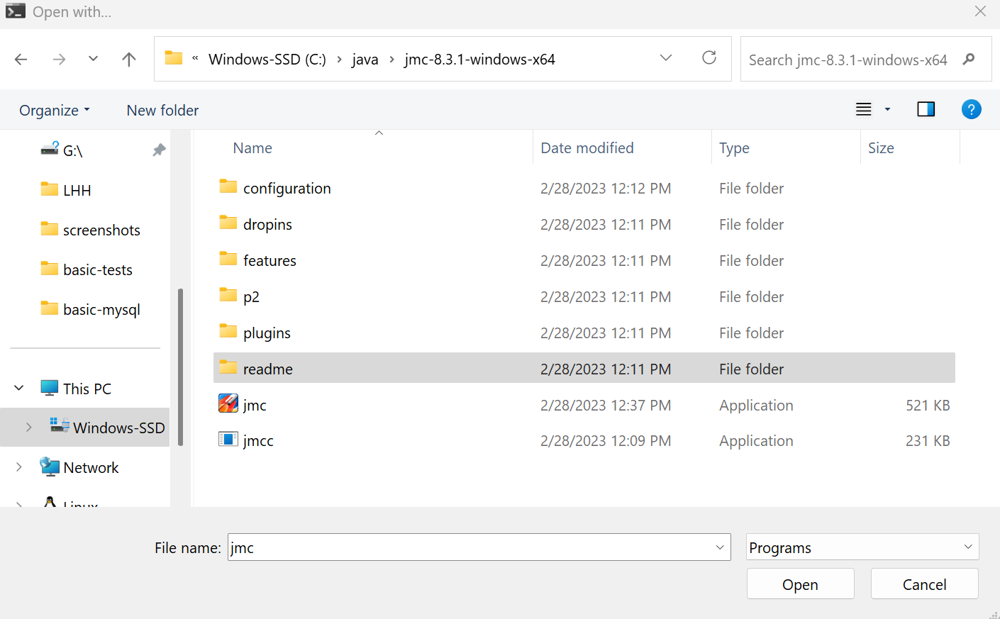
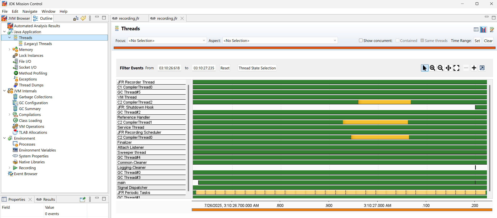

### Info

Fluent Application clained to fail to write the flight recorder jar

###  Test

```sh
mvn -Dmaven.test.skip=true package
```
run with Flight Recorder
```sh
java -XX:StartFlightRecording:filename=recording.jfr,duration=10s,settings=profile,dumponexit=true -jar target/example.basic-fluent-springboot.jar --myparam=val

```
note: to launch in fluent call one has to pick recent version of parent.

```cmd

dir  *.jfr

07/26/2025  03:10 AM           470,919 recording.jfr

```
examine the file
```cmd
start recording.jfr
```

choose the app to open:


ignore the dependency error:
```text
org.osgi.framework.BundleException: Could not resolve module: org.apache.felix.scr [5]
  Unresolved requirement: Import-Package: org.apache.felix.service.command; version="[1.0.0,2.0.0)"; resolution:="optional"
  Unresolved requirement: Import-Package: org.osgi.service.cm; version="[1.6.0,2.0.0)"; resolution:="optional"
  Unresolved requirement: Import-Package: org.osgi.service.component; version="[1.4.0,1.5.0)"

	at org.eclipse.osgi.container.Module.start(Module.java:463)


```
open JMC and load file from there. You will be able to see performance details:


### See Also
  * [JDK Mission Control](https://docs.oracle.com/en/java/java-components/jdk-mission-control/)

### Author
[Serguei Kouzmine](kouzmine_serguei@yahoo.com)
