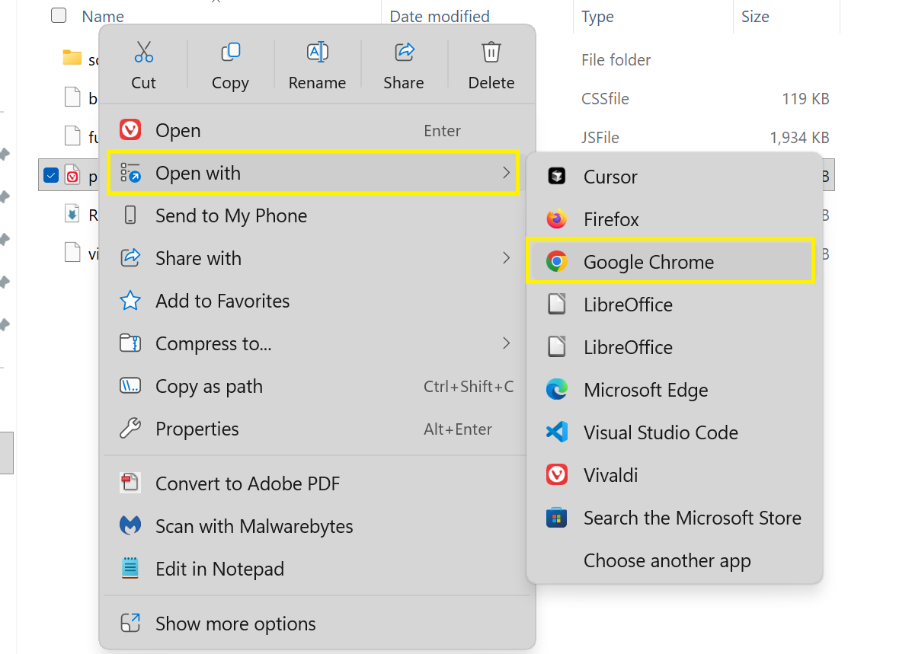
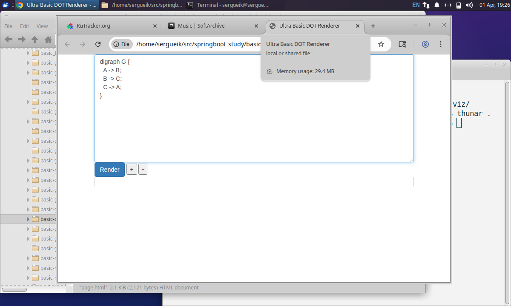
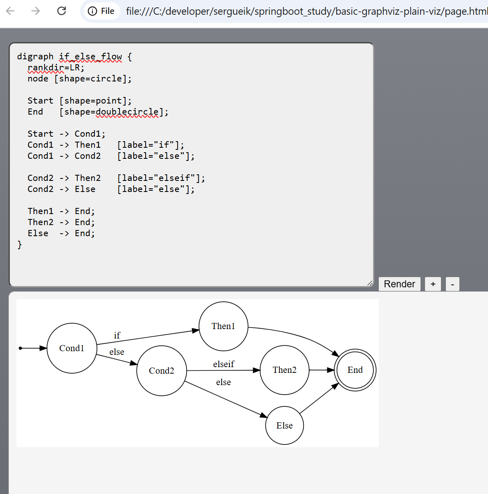

### Info

__Copilot__ and equivalent __AI__ prone to produce voluminous [Mermaid](https://en.wikipedia.org/wiki/Mermaid_(software)) or [Graphviz](https://graphviz.org/Gallery) [DOT](https://en.wikipedia.org/wiki/DOT_(graph_description_language)) *flowchart-like* markdown that is technically correct but mentally expensive to parse.
This lightweight __DOT__ renderer is for air-gapped and constrained environments
for machine-generated flow descriptions

An AI asissted engineer can:

* copy/paste/render Mermaid/DOT-like structures
* instantly reduce cognitive load
* inspect loops, fanout, dead ends
* reason visually

do it even on isolated systems without exposing the subject infomation to official __Graphviz__ [Playground](https://magjac.com/graphviz-visual-editor) 

* zero external dependencies
* no web fonts
* no CDN Bootstrap assumptions (bootstrap-free)
* no icons from libraries
* everything relative-path local
* strong “runs from a USB stick or shared folder” nostalgia
* behaves well in Explorer / Finder / Thunar / Dolphin / Nautilus

### Usage



>NOTE it will be rendere entirely locally





> NOTE: use zoom buttons to fit the graph to div

#### Updating to Latest (Optional)

store fikes locally. Replace URL with your enterprise artifactory or CDN

```sh
curl -skLO https://cdn.jsdelivr.net/npm/viz.js@2.1.2/viz.js 
curl -skLO https://cdn.jsdelivr.net/npm/viz.js@2.1.2/full.render.js
```

### Background


### Unrelated Tool Comparison

The [Viz.js](https://visjs.org/) is a sharply purposed hierarchical acyclic dependency flowchart decision tree graph layout driver
much higher abstraction level than the other canonical library


[D3.js](https://d3js.org/) is a somewhat low-level data driven dom svg canvas manipulation driver offering complete control over layout animation interaction and high flexibility with a steep learning curve tag

`word`  → literal meaning
✌️word ✌️ → sarcastic (opposite) meaning
# Heavyweight IDEs vs Lightweight, Text-Centric Tools

Heavyweight, terse, gesture-driven, obscure Cascading Menu–ToolBar–Dialog–Configuration–Wizard–spoiled IDEs (AutoCAD-style UI), such as:

- Visual Studio (classic and modern pseudo-light VS Code)
- IntelliJ
- Eclipse  

are rapidly losing cultural dominance to tools that are more **text-centric, composable, and scriptable**.

---

## Main Challenges of the AutoCAD Approach

Over time, these IDEs became:

- Discoverable (users develop click-around muscle memory)  
- Bloated and mentally expensive  
- Feature-evolving proprietary project formats  
- Praised for mouse-centric workflows  

As a result, developers end up wasting cycles on:

- *Where* something lives in the UI  
- How to apply trivial command options through IDE’s Tools → Options → Preferences dialog chains  
- Instead of *what* the operation actually is  

This is **IDE choreography** rather than domain knowledge.

---

### Mouse-Driven Workflows Fail When Tasks Are:

- Repetitive  
- To be documented  
- To be reproduced  
- To be automated  
- To engage under CI/CD pipelines  

You cannot adequately record actions like “click here, then drag that, then press this button.”  

**Anti-Champions:** Visual Studio (classic flavor), IntelliJ, XCode  
**Subtle Twist:** 100% DIY = Visual Studio Code  

> **Note:** VS Code claims to be not really a “heavy IDE,” but a sophisticated text editor with plugins and a command palette.

Key differences:

- Keyboard-first  
- Command-driven (`Ctrl+Shift+P`)  
- JSON configuration with no hidden option  
- Deeply integrates terminal  
- UI treated as **optional sugar**, not mandatory ritual  

---

### AutoCAD Analogy

AutoCAD (and similar CAD tools) became infamous for:

- Cryptic gestures  
- Icon forests  
- Ancient commands mixed with modern UI  
- Ultra-steep learning curves  

Professionals often discover **command mode inside AutoCAD** as a faster and more reliable workflow.  

---

### Still Dangerous

Heavy IDEs are **not dying soon enough to relax**, but are becoming:

- Secondary  
- Optional  
- Front-ends to CLI tools  
- Code browsers more than code drivers  

Classic IDEs (IntelliJ, Eclipse, Visual Studio heavy mode) assume:

1. Open one project  
2. Load all metadata  
3. Index everything  
4. Build one universe  

In contrast, **text-based / lightweight tools** scale horizontally and allow:

- Side-by-side reasoning  
- Mental comparison  
- Experimentation  
- Branch archaeology  
- Fast switching  

---

### IDE Features Are Valuable — When Freed from Monoliths

IDE features like pretty-print, auto-indent, and structured editing are valuable — but only when they **don’t imprison the workflow inside a single heavy project universe**.  

Nobody seriously wants to go back to:

- Manual indentation  
- Raw Notepad editing  
- Visually broken code  

Code is better understood when **pretty-printed**. This feature is a **core productivity tool**, but one also needs:

- Multiple independent IDE instances  
- Ability to open the **same project or even the same file in several instances**  
- Syntax highlighting, auto-indent, refactoring help, pretty-print — **without ceremony**  

Using the **Windows or macOS clipboard** across IDE instances is often all that’s needed to adapt existing working code into a new context.

---

### VS Code’s Single-Project Limitation

VS Code can run multiple windows, but it **quietly enforces a single-project ownership model** when trying to open the same project twice. Instead of giving two independent instances, it often:

- Redirects the second launch to the already-open window  
- Reuses the same workspace state  
- Blocks the attempt entirely depending on settings and platform  

Learning how to brute-force VS Code behavior changes is **extremely complex**.  

> So while VS Code looks lightweight, it still inherits a **core assumption from heavy IDEs**: one project = one authoritative workspace.


---
### Author
[Serguei Kouzmine](kouzmine_serguei@yahoo.com)
