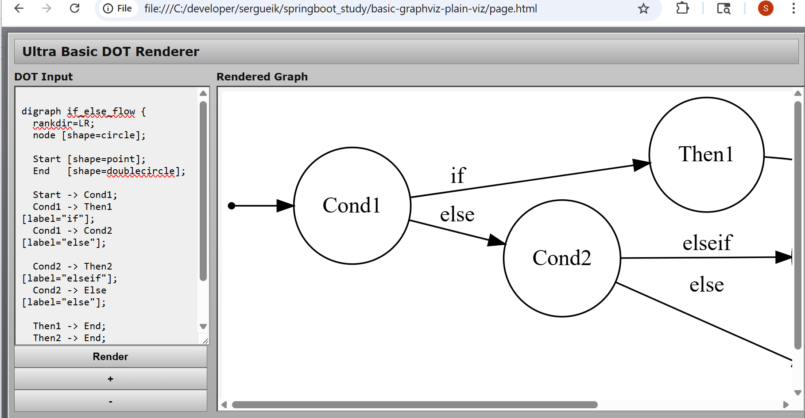
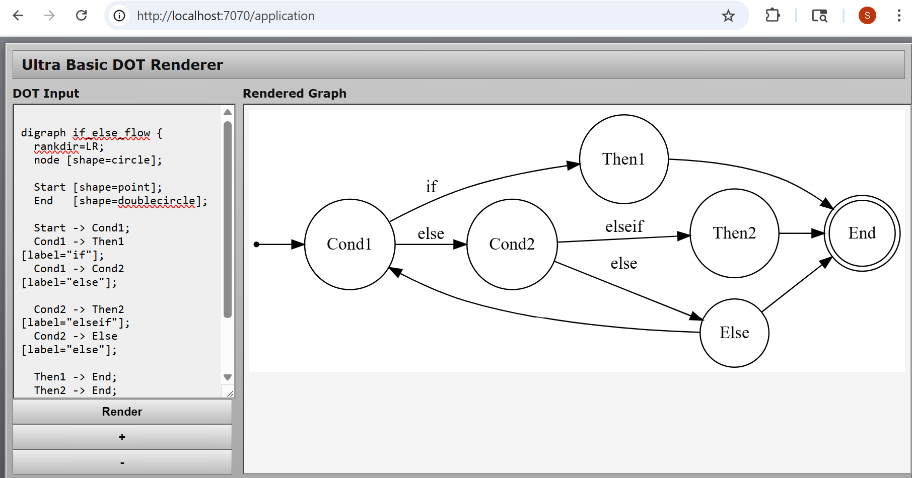

### Info

__Copilot__ and equivalent __AI__ prone to produce voluminous [Mermaid](https://en.wikipedia.org/wiki/Mermaid_(software)) or [Graphviz](https://graphviz.org/Gallery) [DOT](https://en.wikipedia.org/wiki/DOT_(graph_description_language)) *flowchart-like* markdown that is technically correct but mentally expensive to parse.
This lightweight __DOT__ renderer is for air-gapped and constrained environments
for machine-generated flow descriptions

An AI asissted engineer can:

* copy/paste/render Mermaid/DOT-like structures
* instantly reduce cognitive load
* inspect loops, fanout, dead ends
* reason visually

do it even on isolated systems without exposing the subject infomation to official __Graphviz__ [Playground](https://magjac.com/graphviz-visual-editor) 

* zero external dependencies
* no web fonts
* no CDN Bootstrap assumptions (bootstrap-free)
* no icons from libraries
* everything relative-path local
* strong “runs from a USB stick or shared folder” nostalgia
* behaves well in Explorer / Finder / Thunar / Dolphin / Nautilus

### Usage

* run local
```sh
start /c/Program\ Files/Google/Chrome/Application/chrome.exe local/page.html
```

> NOTE: 
Double-click index.html from:
  
  * Windows __Explorer__
  * __Finder__
  * __Thunar__
  * __Dolphin__
  * __Nautilus__
  
…and it *works*

>NOTE it will be rendere entirely locally




> NOTE: use zoom buttons to fit the graph to div

* run as static page  on top of __Spring Boot__ or other runtime
```cmd
pushd static
mvn -DskipTests package
java -jar target\example.static_page.jar
```
```sh
mvn -DskipTests spring-boot:run
```
```sh
start /c/Program\ Files/Google/Chrome/Application/chrome.exe http://localhost:7070/application
```

#### Updating to Latest (Optional)

store fikes locally. Replace URL with your enterprise artifactory or CDN

```sh
curl -skLO https://cdn.jsdelivr.net/npm/viz.js@2.1.2/viz.js 
curl -skLO https://cdn.jsdelivr.net/npm/viz.js@2.1.2/full.render.js
```

### Background


### Unrelated Tool Comparison

The [Viz.js](https://visjs.org/) is a sharply purposed hierarchical acyclic dependency flowchart decision tree graph layout driver
much higher abstraction level than the other canonical library


[D3.js](https://d3js.org/) is a somewhat low-level data driven dom svg canvas manipulation driver offering complete control over layout animation interaction and high flexibility with a steep learning curve tag

`word`  → literal meaning
✌️word ✌️ → sarcastic (opposite) meaning
# Heavyweight IDEs vs Lightweight, Text-Centric Tools

Heavyweight, terse, gesture-driven, obscure Cascading Menu–ToolBar–Dialog–Configuration–Wizard–spoiled IDEs (AutoCAD-style UI), such as:

- Visual Studio (classic and modern pseudo-light VS Code)
- IntelliJ
- Eclipse  

are rapidly losing cultural dominance to tools that are more **text-centric, composable, and scriptable**.

---

## Main Challenges of the AutoCAD Approach

Over time, these IDEs became:

- Discoverable (users develop click-around muscle memory)  
- Bloated and mentally expensive  
- Feature-evolving proprietary project formats  
- Praised for mouse-centric workflows  

As a result, developers end up wasting cycles on:

- *Where* something lives in the UI  
- How to apply trivial command options through IDE’s Tools → Options → Preferences dialog chains  
- Instead of *what* the operation actually is  

This is **IDE choreography** rather than domain knowledge.

---

### Mouse-Driven Workflows Fail When Tasks Are:

- Repetitive  
- To be documented  
- To be reproduced  
- To be automated  
- To engage under CI/CD pipelines  

You cannot adequately record actions like “click here, then drag that, then press this button.”  

**Anti-Champions:** Visual Studio (classic flavor), IntelliJ, XCode  
**Subtle Twist:** 100% DIY = Visual Studio Code  

> **Note:** VS Code claims to be not really a “heavy IDE,” but a sophisticated text editor with plugins and a command palette.

Key differences:

- Keyboard-first  
- Command-driven (`Ctrl+Shift+P`)  
- JSON configuration with no hidden option  
- Deeply integrates terminal  
- UI treated as **optional sugar**, not mandatory ritual  

---

### AutoCAD Analogy

AutoCAD (and similar CAD tools) became infamous for:

- Cryptic gestures  
- Icon forests  
- Ancient commands mixed with modern UI  
- Ultra-steep learning curves  

Professionals often discover **command mode inside AutoCAD** as a faster and more reliable workflow.  

---

### Still Dangerous

Heavy IDEs are **not dying soon enough to relax**, but are becoming:

- Secondary  
- Optional  
- Front-ends to CLI tools  
- Code browsers more than code drivers  

Classic IDEs (IntelliJ, Eclipse, Visual Studio heavy mode) assume:

1. Open one project  
2. Load all metadata  
3. Index everything  
4. Build one universe  

In contrast, **text-based / lightweight tools** scale horizontally and allow:

- Side-by-side reasoning  
- Mental comparison  
- Experimentation  
- Branch archaeology  
- Fast switching  

---

### IDE Features Are Valuable — When Freed from Monoliths

IDE features like pretty-print, auto-indent, and structured editing are valuable — but only when they **don’t imprison the workflow inside a single heavy project universe**.  

Nobody seriously wants to go back to:

- Manual indentation  
- Raw Notepad editing  
- Visually broken code  

Code is better understood when **pretty-printed**. This feature is a **core productivity tool**, but one also needs:

- Multiple independent IDE instances  
- Ability to open the **same project or even the same file in several instances**  
- Syntax highlighting, auto-indent, refactoring help, pretty-print — **without ceremony**  

Using the **Windows or macOS clipboard** across IDE instances is often all that’s needed to adapt existing working code into a new context.

---

### VS Code’s Single-Project Limitation

VS Code can run multiple windows, but it **quietly enforces a single-project ownership model** when trying to open the same project twice. Instead of giving two independent instances, it often:

- Redirects the second launch to the already-open window  
- Reuses the same workspace state  
- Blocks the attempt entirely depending on settings and platform  

Learning how to brute-force VS Code behavior changes is **extremely complex**.  

> So while VS Code looks lightweight, it still inherits a **core assumption from heavy IDEs**: one project = one authoritative workspace.


#### 

Spring in general already feels closer to the age of steam engines than modern lightweight machinery: immense utility, formidable complexity, and an alarming number of moving parts.

Spring Batch takes this aesthetic even further — so monumental that one can barely breathe near it, with a design philosophy that feels almost aggressively anti-agile and proudly non-reactive.


one who had always felt there was something distinctly vintage about the Spring Framework.
Google eventually confirmed it by tracing spring technology back to 1493.


Google tracing spring technology back to 1493 merely confirmed the architectural direction.

The idea of storing mechanical energy in a compact spring so a device could be shorter, more controllable, and operable with one hand was genuinely advanced engineering thinking for the time. [Leonardo da Vinci](https://en.wikipedia.org/wiki/Leonardo_da_Vinci) studied spiral and steel springs extensively in the Madrid Codices.

One may imagine that when Leonardo da Vinci was asked to solve the difficult problem of firing a 15th-century pistol with one hand, he thought for a while and finally declared:

*You can use Spring*.


Legend says that when  [Leonardo da Vinci](https://en.wikipedia.org/wiki/Leonardo_da_Vinci) was asked how to fire a 15th-century innovated [MatchLock](https://en.wikipedia.org/wiki/Matchlock) pistol - a decisive improvement over the older [Hand Cannon](https://en.wikipedia.org/wiki/Hand_cannon) - with *one hand* - 
, he studied the matter long and hard then allegedly summarizes the solution in one line:

* *"Use Spring"* 

Five centuries later, software engineers are still recovering from that architectural decision.
```dot
digraph ci-pipeline {
  rankdir=LR;
  node [shape=none];

  Trigger [label=<
    <svg width="64" height="64" xmlns="http://www.w3.org/2000/svg">
      <rect x="8" y="12" width="48" height="40" fill="#ddd" stroke="#333" stroke-width="2"/>
      <line x1="8" y1="24" x2="56" y2="24" stroke="#333" stroke-width="2"/>
      <line x1="20" y1="6" x2="20" y2="18" stroke="#333" stroke-width="3"/>
      <line x1="44" y1="6" x2="44" y2="18" stroke="#333" stroke-width="3"/>
    </svg>
  >, labelloc=b];

  Approve [label=<
    <svg width="64" height="64" xmlns="http://www.w3.org/2000/svg">
      <circle cx="32" cy="20" r="10" fill="#ddd" stroke="#333" stroke-width="2"/>
      <rect x="18" y="34" width="28" height="18" fill="#ddd" stroke="#333" stroke-width="2"/>
    </svg>
  >, labelloc=b];

  Publish [label=<
    <svg width="64" height="64" xmlns="http://www.w3.org/2000/svg">
      <rect x="10" y="34" width="44" height="18" fill="#ddd" stroke="#333" stroke-width="2"/>
      <line x1="32" y1="10" x2="32" y2="40" stroke="#333" stroke-width="3"/>
      <polygon points="24,20 32,10 40,20" fill="#333"/>
    </svg>
  >, labelloc=b];

  Trigger -> Approve -> Publish;
}
```
leads to
```text
DOT render error:
in label of node Publish
```
the
```dot
digraph ci-pipeline {
  rankdir=LR;
  node [shape=none];

  Publish [image="data:image/svg+xml;base64,PHN2ZyB4bWxucz0iLi4uIiB3aWR0aD0iNjQiIGhlaWdodD0iNjQiPjxyZWN0ICB4PSIxMCIgeT0iMzQiIHdpZHRoPSI0NCIgaGVpZ2h0PSIxOCIgc3R5bGU9ImZpbGw6I2RkZDsiIC8+PC9zdmc+", labelloc=b];

}

```
leads to
```text
DOT render error:
renderer for svg is unavailable
```

the

```dot

digraph test {
  node [shape=none];
  A [image="data:image/svg+xml;base64,PHN2ZyB4bWxucz0iLi4uIiB3aWR0aD0iNjQiIGhlaWdodD0iNjQiPjxyZWN0ICB4PSIxMCIgeT0iMzQiIHdpZHRoPSI0NCIgaGVpZ2h0PSIxOCIgc3R5bGU9ImZpbGw6I2RkZDsiIC8+PC9zdmc+"];
}
```

leads to

```text
DOT render error:
undefined
```
The raw `<svg>...</svg>` inside `label=<...>` is __NOT__ supported

What Graphviz calls HTML-like labels is not real HTML/XML. It supports a small subset like:

  * `<TABLE>`
  * `<TR>`
  * `<TD>`
  * `<BR/>`
  * `<FONT>`
  * ``

…but not arbitrary `<svg>` tag

### Design vs. Publish
```dot
digraph ci-pipeline {
  rankdir=LR;

  // draft mode
  Trigger [shape=box, label="Schedule"];
  // Trigger [shape=none, image="schedule.png", label="schedule", labelloc=b];

  Approve [shape=diamond, label="Review"];
  // Approve [shape=none, image="approval.png", label="Review", labelloc=b];

  Publish [shape=box3d, label="Publish"];
  // Publish [shape=none, image="upload.png", label="Publish", labelloc=b];

  Trigger -> Approve -> Publish;
}

```
design can be viewed via `viz.js`:


once design is finished the final version can be produced via `dot.exe` [download](https://graphviz.org/download/):

```cmd
dot.exe -Tpng -o screenshots/ci-pipeline.png  ci-pipeline.dot
```

> NOTE cannot include `svg` art this way due to missing plugin:
```cmd
dot.exe -Tpng -o ci-pipeline-svg.png  ci-pipeline-svg.dot
```
```text
Warning: No loadimage plugin for "svg:cairo"
```


### See Also
 
  * [graphviz Node Shapes](https://graphviz.org/doc/info/shapes.html)
  * [forum discussion](https://qna.habr.com/q/734991)(in Russian)
 

---
### Author
[Serguei Kouzmine](kouzmine_serguei@yahoo.com)
