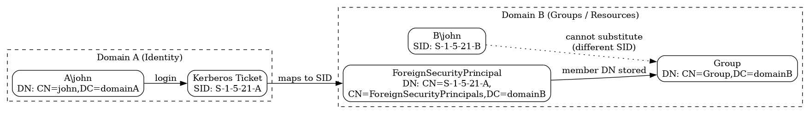
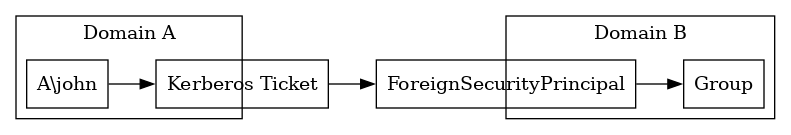
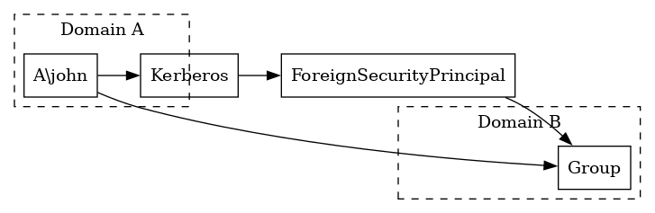

###  Info

Clone of [graphviz-server](https://github.com/omerio/graphviz-server) lightweight Java HTTP server wrapping the locally installed [graphviz](http://www.graphviz.org/) binary installed locally.  Replaced running the `/usr/bin/dot` with *pure Java* __Nashorn__ and later __GraalVM JS__

### Usage 
```sh
mvn -Psingle clean package
```

run in foreground
```sh
java -jar target/example.graphviz-java-fat.jar 8080
```

interact with
```sh
curl -v -X POST http://localhost:8080/ -d @../basic-graphviz/color.dota -o color.png
```

```text
> POST / HTTP/1.1
> Host: localhost:8080
> User-Agent: curl/7.81.0
> Accept: */*
> Content-Length: 278
> Content-Type: application/x-www-form-urlencoded
>

* Mark bundle as not supporting multiuse

< HTTP/1.1 200 OK
< Date: Fri, 06 Feb 2026 19:57:55 GMT
< Server: DotGraphics/1.1
< Content-Length: 0
<
* Connection #0 to host localhost left intact
```
NOTICE the response length is 0, investigate.

examine console logs

```text
14:57:18.891 INFO  example.DotGraphics - Listening on port 8080
14:57:21.988 INFO  example.DotGraphics - Incoming connection from /127.0.0.1
14:57:22.012 INFO  example.DotGraphics - New connection thread
14:57:22.038 INFO  o.a.http.protocol.HttpRequestHandler - POST / [Host: localhost:8080, User-Agent: curl/7.81.0, Accept: */*, Content-Length: 27, Content-Type: application/x-www-form-urlencoded]
14:57:22.039 INFO  o.a.http.protocol.HttpRequestHandler - Incoming entity content (27 bytes): ../basic-graphviz/color.dot
14:57:22.050 INFO  o.a.http.protocol.HttpRequestHandler - Responded with Success
14:57:55.978 INFO  example.DotGraphics - Incoming connection from /127.0.0.1
14:57:55.979 INFO  example.DotGraphics - New connection thread
14:57:55.980 INFO  o.a.http.protocol.HttpRequestHandler - POST / [Host: localhost:8080, User-Agent: curl/7.81.0, Accept: */*, Content-Length: 278, Content-Type: application/x-www-form-urlencoded]
14:57:55.980 INFO  o.a.http.protocol.HttpRequestHandler - Incoming entity content (278 bytes): graph {    { rank=same; white}    { rank=same; cyan; yellow; pink}    { rank=same; red; green; blue}    { rank=same; black}    white -- cyan -- blue    white -- yellow -- green    white -- pink -- red    cyan -- green -- black    yellow -- red -- black    pink -- blue -- black}
14:57:55.980 INFO  o.a.http.protocol.HttpRequestHandler - Responded with Success
```
after fixing the code,

```sh
curl -v -X POST http://localhost:8080/ -d @../basic-graphviz/color.dot -o color.png
```

```text
onnected to localhost (127.0.0.1) port 8080 (#0)
> POST / HTTP/1.1
> Host: localhost:8080
> User-Agent: curl/7.81.0
> Accept: */*
> Content-Length: 278
> Content-Type: application/x-www-form-urlencoded
>
} [278 bytes data]
* Mark bundle as not supporting multiuse
< HTTP/1.1 200 OK
< Date: Fri, 06 Feb 2026 20:46:00 GMT
< Server: DotGraphics/1.1
< Content-Length: 32547
< Content-Type: image/png
<
{ [20480 bytes data]
100 32825  100 32547  100   278   533k   4663 --:--:-- --:--:-- --:--:--  543k
* Connection #0 to host localhost left intact
```
the `color.png` is written to current directory 
the console log shows

```text
20:11:07.181 INFO  example.GraphViz - Using Graphviz engine: graal
20:11:07.182 INFO  example.DotGraphics - Listening on port 8080
20:11:07.186 INFO  example.GraphvizGraalEngine - Initializing GraalJS context...
20:11:07.411 INFO  example.GraphvizGraalEngine - Loading /META-INF/resources/webjars/viz.js-graphviz-java/2.1.3/viz.js
20:11:08.108 INFO  example.GraphvizGraalEngine - Loaded /META-INF/resources/webjars/viz.js-graphviz-java/2.1.3/viz.js, length=11717
20:11:08.108 INFO  example.GraphvizGraalEngine - Loading /META-INF/resources/webjars/viz.js-graphviz-java/2.1.3/full.render.js
20:11:10.672 INFO  example.GraphvizGraalEngine - Loaded /META-INF/resources/webjars/viz.js-graphviz-java/2.1.3/full.render.js, length=2402990
20:11:10.672 INFO  example.GraphvizGraalEngine - Viz.js loaded successfully.
20:11:10.673 INFO  example.GraphViz - Graphviz engine, 19578363 created
20:11:13.037 INFO  example.GraphvizGraalEngine - SVG generated, length=1178
20:11:13.934 INFO  example.GraphViz - Graphviz engine warmup complete, 2614 bytes generated

20:49:18.755 INFO  example.DotGraphics - Incoming connection from /0:0:0:0:0:0:0:1
20:49:18.774 INFO  example.DotGraphics - New connection thread
20:49:18.780 INFO  o.a.http.protocol.HttpRequestHandler - POST / [Host: localhost:8080, User-Agent: curl/8.12.1, Accept: */*, Content-Length: 278, Content-Type: application/x-www-form-urlencoded]
20:49:18.782 INFO  o.a.http.protocol.HttpRequestHandler - Incoming entity content (278 bytes): graph {    { rank=same; white}    { rank=same; cyan; yellow; pink}    { rank=same; red; green; blue}    { rank=same; black}    white -- cyan -- blue    white -- yellow -- green    white -- pink -- red    cyan -- green -- black    yellow -- red -- black    pink -- blue -- black}
20:49:18.786 INFO  o.a.http.protocol.HttpRequestHandler - valid dot content
20:49:18.787 INFO  o.a.http.protocol.HttpRequestHandler - requesting graph type:
20:49:18.787 INFO  o.a.http.protocol.HttpRequestHandler - graph {    { rank=same; white}    { rank=same; cyan; yellow; pink}    { rank=same; red; green; blue}    { rank=same; black}    white -- cyan -- blue    white -- yellow -- green    white -- pink -- red    cyan -- green -- black    yellow -- red -- black    pink -- blue -- black}
20:49:19.628 INFO  example.GraphvizGraalEngine - SVG generated, length=4897
20:49:19.775 INFO  o.a.http.protocol.HttpRequestHandler - Responded with Success
```
#### Package in Container

```sh
mvn clean package
```

> NOTE: GraalJS is *much* faster at runtime compared to Nashorn which is interpreted, but the upfront JAR “cost” is *significant* - the dependency alone is ~50 MB. 
```sh
docker pull eclipse-temurin:17-jre-alpine
export NAME=example-graphviz-graalvm-java
docker build -t $NAME -f Dockerfile .
```

```sh
docker container stop $NAME
docker container rm $NAME
```

```sh
docker run -p 8080:8080 --name $NAME -d $NAME
```
if the container is hosted locally, run

```sh
curl -sfX POST http://localhost:8080/ -d @../basic-graphviz/color.dot -o color.png
echo $?
```
```text
0
```
when the docker is run in a VM update the host address 
```sh
curl -sf --connect-timeout 5 --max-time 10 -X POST http://192.168.99.102:8080/ -d @../basic-graphviz/color.dot -o color.png
```
the resulting file will be saved in local directory.

```sh
docker logs $NAME
```

```text
23:49:55.252 INFO  example.DotGraphics - Listening on port 8080
23:49:55.225 INFO  example.GraphViz - Initializing Graphviz engine...
03:09:02.156 INFO  example.GraphViz - Using Graphviz engine: graal   
03:09:02.160 INFO  example.GraphvizGraalEngine - Initializing GraalJS context...
03:09:02.162 INFO  example.DotGraphics - Listening on port 8080
03:09:02.473 INFO  example.GraphvizGraalEngine - Loading /META-INF/resources/webjars/viz.js-graphviz-java/2.1.3/viz.js
03:09:03.197 INFO  example.GraphvizGraalEngine - Loaded /META-INF/resources/webjars/viz.js-graphviz-java/2.1.3/viz.js, length=11717
03:09:03.197 INFO  example.GraphvizGraalEngine - Loading /META-INF/resources/webjars/viz.js-graphviz-java/2.1.3/full.render.js
03:09:05.222 INFO  example.GraphvizGraalEngine - Loaded /META-INF/resources/webjars/viz.js-graphviz-java/2.1.3/full.render.js, length=2402990
03:09:05.222 INFO  example.GraphvizGraalEngine - Viz.js loaded successfully.
03:09:05.223 INFO  example.GraphViz - Graphviz engine, 1518529528 created
03:09:06.901 INFO  example.DotGraphics - Incoming connection from /127.0.0.1
03:09:06.927 INFO  example.DotGraphics - New connection thread
03:09:06.937 INFO  o.a.http.protocol.HttpRequestHandler - GET /health [Host: localhost:8080, User-Agent: curl/7.81.0, Accept: */*]
03:09:06.948 INFO  o.a.http.protocol.HttpRequestHandler - Responded with Success
03:09:07.268 INFO  example.GraphvizGraalEngine - SVG generated, length=1178
03:09:07.834 INFO  example.GraphViz - Graphviz engine warmup complete, 2731 bytes generated
03:09:15.039 INFO  example.DotGraphics - Incoming connection from /172.17.0.1
03:09:15.040 INFO  example.DotGraphics - New connection thread
03:09:15.041 INFO  o.a.http.protocol.HttpRequestHandler - POST / [Host: localhost:8080, User-Agent: curl/7.81.0, Accept: */*, Content-Length: 278, Content-Type: application/x-www-form-urlencoded]
03:09:15.042 INFO  o.a.http.protocol.HttpRequestHandler - Incoming entity content (278 bytes): graph {    { rank=same; white}    { rank=same; cyan; yellow; pink}    { rank=same; red; green; blue}    { rank=same; black}    white -- cyan -- blue    white -- yellow -- green    white -- pink -- red    cyan -- green -- black    yellow -- red -- black    pink -- blue -- black}
03:09:15.045 INFO  o.a.http.protocol.HttpRequestHandler - valid dot content
03:09:15.046 INFO  o.a.http.protocol.HttpRequestHandler - requesting graph type: 
03:09:15.046 INFO  o.a.http.protocol.HttpRequestHandler - graph {    { rank=same; white}    { rank=same; cyan; yellow; pink}    { rank=same; red; green; blue}    { rank=same; black}    white -- cyan -- blue    white -- yellow -- green    white -- pink -- red    cyan -- green -- black    yellow -- red -- black    pink -- blue -- black}
03:09:16.941 INFO  example.GraphvizGraalEngine - SVG generated, length=4897
03:09:17.127 INFO  o.a.http.protocol.HttpRequestHandler - Responded with Success
``` 
### Pass properties individually via JVM command-line

```sh
docker run --rm \
  -p 8080:8080 \
  -e JAVA_OPTS="-Dgraphviz.engine=nashorn -Dserver.port=8080 -Dfile.encoding=UTF-8" \
  --name $NAME \
  $NAME 
```

### Pass an application.properties via File Path or Via Volume

NOTE: choosing GraalVM, which is not ready 
```sh
docker run --rm \
  -p 8080:8080 \
  -v /path/to/local/application.properties:/config/application.properties:ro \
  --name $NAME \
  $NAME 
```

```sh
docker run --rm \
  --ulimit nproc=4096 \
  --ulimit stack=8388608 \
  -p 8080:8080 \
  -e GRAPHVIZ_ENGINE=graal \
  -e JAVA_OPTS="-Xms256m -Xmx512m -Dgraphviz.engine=graal -Dserver.port=8080 -Dfile.encoding=UTF-8 -Dpolyglotimpl.DisableMultiReleaseCheck=true" \
  --name $NAME \
  $NAME
```

### Troubleshooting 
There is a `<skip>` configuration option but it is *not* 100% reliable for executions in top-level `<build>` with descriptors. The __only__ fully reliable approach is to not have the `maven-assembly` plugin bound in top-level build at all, and move it entirely into a profile. 
```text
22:59:03.053 INFO  example.GraphViz - Using Graphviz engine: graal
22:59:03.761 ERROR example.GraphViz - Graphviz warmup failed
org.graalvm.polyglot.PolyglotException: java.lang.IllegalStateException: No language for id regex found. Supported languages are: [js]
        at com.oracle.truffle.polyglot.PolyglotEngineException.illegalState(PolyglotEngineException.java:137) 
```

WIP 
```cmd
java -cp target\lib\*;target\example.graphviz-java.jar example.DotGraphics 8080 
```

```txt
19:26:26.246 INFO  example.GraphViz - Using Graphviz engine: graal
19:26:26.246 INFO  example.DotGraphics - Listening on port 8080
19:26:26.250 INFO  example.GraphvizGraalEngine - Initializing GraalJS context...
19:26:26.463 INFO  example.GraphvizGraalEngine - GraalJS context created.
19:26:26.464 INFO  example.GraphvizGraalEngine - Loaded viz.js, length=11717
19:26:27.129 INFO  example.GraphvizGraalEngine - Loaded full.render.js, length=2402990
19:26:29.383 INFO  example.GraphvizGraalEngine - Viz function found and executable.
19:26:29.383 INFO  example.GraphViz - Graphviz engine, 1945915791 created
19:26:29.383 INFO  example.GraphvizGraalEngine - in renderPng
19:26:29.383 INFO  example.GraphvizGraalEngine - about to eval (function(dot) {

    var viz = new Viz();
    var done = false;
    var resultBase64 = null;
    viz.renderString(dot, { format: 'png-image' })
        .then(function(p) {
            var arr = new Uint8Array(p);
            resultBase64 = Array.from(arr).map(b => String.fromCharCode(b)).join('');
            done = true;
        })
        .catch(function(e) { throw e; });
    while(!done) {}
    return resultBase64;
}) 
19:26:29.388 INFO  example.GraphvizGraalEngine - about to send source graph { a -- b } 
```

GraalVM JS runs in a single-threaded event loop for async operations like renderString. 
That while loop blocks the event loop, so the `.then()` callback never runs. 
Result: the code waits forever ΓÇö appears *hang* in

```java
String resultStr = fn.execute(dotSource).asString();
```


```txt
20:00:39.120 INFO  example.GraphvizGraalEngine - Viz.js loaded successfully.
20:00:39.120 INFO  example.GraphViz - Graphviz engine, 19578363 created
20:00:39.120 INFO  example.GraphvizGraalEngine - renderPng called
20:00:41.520 ERROR example.GraphvizGraalEngine - PNG conversion error
java.lang.RuntimeException: Expected SVG string, got: Promise{[[PromiseStatus]]: "resolved", [[PromiseValue]]: "<?xml version=\"1.0\" encoding=\"UTF-8\" standalone=\"no\"?>\n<!DOCTYPE svg PUBLIC \"-//W3C//DTD SVG 1.1//EN\"\n \"http://www.w3.org/Graphics/SVG/1.1/DTD/svg11.dtd\">\n<!-- Generated by graphviz version 2.44.0 (20200408.0750)\n -->\n<!-- Pages: 1 -->\n<svg width=\"62pt\" height=\"116pt\"\n viewBox=\"0.00 0.00 62.00 116.00\" xmlns=\"http://www.w3.org/2000/svg\" xmlns:xlink=\"http://www.w3.org/1999/xlink\">\n<g id=\"graph0\" class=\"graph\" transform=\"scale(1 1) rotate(0) translate(4 112)\">\n<polygon fill=\"white\" stroke=\"transparent\" points=\"-4,4 -4,-112 58,-112 58,4 -4,4\"/>\n<!-- a -->\n<g id=\"node1\" class=\"node\">\n<title>a</title>\n<ellipse fill=\"none\" stroke=\"black\" cx=\"27\" cy=\"-90\" rx=\"27\" ry=\"18\"/>\n<text text-anchor=\"middle\" x=\"27\" y=\"-85.8\" font-family=\"Times,serif\" font-size=\"14.00\">a</text>\n</g>\n<!-- b -->\n<g id=\"node2\" class=\"node\">\n<title>b</title>\n<ellipse fill=\"none\" stroke=\"black\" cx=\"27\" cy=\"-18\" rx=\"27\" ry=\"18\"/>\n<text text-anchor=\"middle\" x=\"27\" y=\"-13.8\" font-family=\"Times,serif\" font-size=\"14.00\">b</text>\n</g>\n<!-- a&#45;&#45;b -->\n<g id=\"edge1\" class=\"edge\">\n<title>a&#45;&#45;b</title>\n<path fill=\"none\" stroke=\"black\" d=\"M27,-71.7C27,-60.85 27,-46.92 27,-36.1\"/>\n</g>\n</g>\n</svg>\n"}
```

`Viz.js` __2.x__ is fully asynchronous under the hood. Every render call (even `renderString`) now returns a JavaScript `Promise`.

__GraalJS__ exposes that `Promise` as a `Value`, but `Value.asHostObject()` cannot convert a Promise directly to `byte[]`.


```txt
[0.007s][warning][os,thread] Failed to start thread "VM Thread" - pthread_create failed (EPERM) for attributes: stacksize: 1024k, guardsize: 4k, detached. Error occurred during initialization of VM Cannot create VM thread. Out of system resources.
``` 
use a newer Docker environment 

### NOTE 

| Vendor                         | GraalVM JS included? | Notes                                                                 |
|--------------------------------|--------------------|-----------------------------------------------------------------------|
| Eclipse Temurin / AdoptOpenJDK  | ❌ No               | Standard builds only include the JVM and core libraries. GraalJS is not bundled. |
| Oracle JDK / Oracle OpenJDK     | ❌ No               | Same as above; Nashorn is included up to Java 15, removed in 17.      |
| Amazon Corretto                 | ❌ No               | Standard builds do not include GraalVM.                               |
| Zulu / Liberica / SAP Machine   | ❌ No               | GraalVM only via separate GraalVM release.                             |
| GraalVM distributions           | ✅ Yes              | Full GraalVM CE or Enterprise builds include GraalJS and Truffle languages. |  

### Memorable ChatGPT Feedback Openers 

 

 


### Graphviz Warning (Advanced) 

When using Graphviz to draw swimlane-style diagrams with `subgraph cluster_*` instruction, be careful when combining clusters with explicit `rank` constraints such as `rank=same`. 
Nodes that belong to a cluster should not also be forced into a global `rank` group. Mixing these two layout rules can confuse GraphvizΓÇÖs layout engine and may lead to warnings such as:

```text
node X was already in a rankset, deleted from cluster
``` 
and in some versions even a `segmentation fault` (crash) without detail. 
This happens because: 
`cluster_*` defines a visual grouping (a swimlane or box), 
`rank=same` tries to override the vertical or horizontal position of nodes, 
Graphviz cannot always *reconcile* both constraints safely. 
Beginner-friendly rule of thumb: 
Use clusters for swimlanes (Domain A / Domain B). 
Let Graphviz decide node positioning automatically. 
Avoid `rank=same` when nodes are inside clusters. 
Do not try to manually align nodes across different clusters unless you fully understand Graphviz ranking rules. 
Keeping the layout simple makes the diagram more stable, easier to maintain, and portable across Graphviz versions.  ### Note on diagram layout and Graphviz limitations 

Diagram **A**:

 
Correctly conveys the logical flow and overall sequence of the process,

but some element alignment could be visually improved.

Such fine adjustments are trivial in a graphical editors,

yet become difficult and fragile when expressed in __Graphviz__ (__LaTeX__-style) declarative layout.

Diagram **B**:



Diagram **C**:



demonstrate progress toward better alignment and readability, but should still be considered *not quite final*. 
Further attempts to precisely control node positioning and alignment in Graphviz

(for example, by adding more `rank` constraints across clusters) risk introducing

conflicting layout rules.

This can lead to unstable rendering behavior, including warnings, distorted layouts,

or even segmentation faults depending on the Graphviz version: ```sh
dot -Tpng -o domain-flow-3.png domain-flow-broken.dot
```

```text
Warning: A_Kerberos was already in a rankset, deleted from cluster AD_CrossDomain
Warning: FSP_john was already in a rankset, deleted from cluster AD_CrossDomain
Segmentation fault
```

For this reason, the diagrams intentionally avoid aggressive manual positioning.

The goal is to preserve conceptual clarity and portability rather than to overfit

the layout to one specific Graphviz implementation.  #### Remark: Advantages of Code-Resembling Diagram Tools 
Using code-resembling tools such as [LaTeX](https://www.latex-project.org/) and [Graphviz](https://graphviz.org/)  

brings significant advantages for creating technical material compared to poor-format, raw dataΓÇôbased tools (__XML__, __JSON__) or visual workflow designers such as 

[Drawio](https://www.drawio.com), [n8n](https://n8n.io/), [Windows Workflow Visual Studio Designer](), [UIPath](https://www.uipath.com/product/studio), [PEGA](https://help.roboticautomation.pega.com/80/Welcome_to_Pega_Robotics.htm), etc.: 

1. **Clarity of intent** ΓÇô Even in ASCII or code form, the logical structure and flow are immediately visible. Unlike XML/JSON or drag-and-drop blocks, the creatorΓÇÖs intention is explicit.

2. **Readable abstraction** ΓÇô You describe *what* you want (nodes, edges, clusters) rather than *how to serialize it*, keeping focus on design, not syntax.

3. **Compactness** ΓÇô Complex relationships are conveyed in very few lines of code, compared to verbose XML/JSON structures or visual pipelines.

4. **Maintainability** ΓÇô Small edits to the code immediately reflect in the rendered diagram, without reconstructing large workflow blocks.

5. **Expressiveness** ΓÇô Layout, grouping, and flow semantics can be encoded clearly and readably, which is nearly impossible with poorly structured visual workflow dumps.

**[Jenkins](https://www.jenkins.io) comparison:**

- *Before (classic XML pipelines)*: Job definitions are stored as large XML files; understanding the sequence, dependencies, or approval steps is difficult without rendering or reading raw XML.  

- *After (Pipeline as code / declarative Jenkinsfile)*: The workflow is expressed as readable code; stages, triggers, and post-actions are explicit, versionable, and easy to modify ΓÇö very similar to the clarity Graphviz or LaTeX code brings to diagrams.

> The extra effort to switch from clickΓÇædragΓÇæandΓÇædrop tools to ΓÇ£author modeΓÇ¥ (codeΓÇæoriented diagrams and pipelines) pays off immediately in clarity, maintainability, and portability ΓÇö a benefit that existed even before AI assistance, and has become even more relevant today. 
### ChiWriter 
ChiWriter ΓÇö a WYSIWYG scientific text editor for MSΓÇæDOS that was a popular interactive alternative to TeX in its day. Its interface wasnΓÇÖt dragΓÇæandΓÇædrop, but it was a visual, extendedΓÇæmode editor that let users compose mathematical and scientific text directly on screen instead of editing raw TeX source. 
🔹 ChiWriter 
A scientific text processor for MSΓÇæDOS, released in 1986.

It was widely used by scientists before TeX and LaTeX became mainstream due to easier interactive editing on DOS PCs.

While ChiWriter didnΓÇÖt use TeX itself (it was easier to interactively compose documents), it directly addressed the same problem domain: producing technical text with mathematical notation in an interactive editor under DOS, without forcing users to memorize LaTeX syntax.

Other DOS editors existed with rich keybindings or textΓÇæmode UIs (e.g., QEdit, PCΓÇæWrite, Brief, MultiΓÇæEdit, TDE) but ChiWriter matches your description best when you talk about extended character text mode and interactive math layout compared to TeXΓÇÖs raw source style.

If you want, I can also list screenshots or download references for these classic editors.

yes that was it please share link to chewriter era screen shot

HereΓÇÖs a classic MSΓÇæDOS era screenshot of ChiWriter that you can reference or include:

4

These show how ChiWriter looked as a WYSIWYG scientific editor running under DOS ΓÇö with formulae, boxed text, and extended character support visible on screen. ChiWriter was one of the first interactive editors that made scientific text much more approachable than pure TeX code, running on common IBM PCΓÇæclass hardware.

Reference / download page for ChiWriter:

https://winworldpc.com/product/chiwriter/42

 ΓÇö includes screenshots and version information. 
Would you like a readyΓÇætoΓÇæembed screenshot snippet (with alt text and caption) for your README or documentation? 
that is a valuable addition and a attention catcher! 
Absolutely ΓÇö ChiWriter screenshots are a perfect visual hook! They immediately convey the historical context and make the point that ΓÇ£interactive, codeΓÇæresembling editorsΓÇ¥ have long been a productivity booster, even before modern tools like LaTeX, Graphviz, or pipelines. 
You can embed it in your README or slides as something like this: 
### Historical Precedent: ChiWriter

__ChiWriter__ was an interactive WYSIWYG scientific text editor for MSΓÇæDOS (1986) that let users compose mathematical and technical content visually, using extended character text mode ΓÇö a predecessor and alternative to TeX:


In the late 1980s and early 1990s, there really was a sort of *ideological split* between the two camps:

__ChiWriter__ users: Loved the interactive __WYSIWYG__ approach, ΓÇ£see it on screen as you type,ΓÇ¥ fast and practical for small to medium scientific documents. They often mocked TeX/LaTeX as slow, arcane, and overcomplicated ΓÇö a system for people who ΓÇ£enjoy memorizing cryptic commands.ΓÇ¥

__TeX__/__LaTeX__ purists: Treated __ChiWriter__ as a toy or deadΓÇæend tool. They emphasized precision, standardization, and portability, and often scoffed at the idea of producing scientific papers in a proprietary DOS editor. ΓÇ£Real work is typeset in TeX,ΓÇ¥ was the mantra.

The irony: both groups were trying to solve the same problem ΓÇö creating readable, publishable scientific documents ΓÇö but from entirely different philosophies. ChiWriter prioritized immediate visual feedback and usability, TeX prioritized portability and rigor.

The true irony lies in the audience: the ChiWriter and TeX users were professional scientists, trained to explain and analyze observations through intent, principles, and **find** the **laws** governing phenomena. Yet many fell into the ChiWriter trap ΓÇö prioritizing immediate visual convenience over the reproducibility, standardization, and rigor that TeX provided. 

To a biased reader, this is *precisely* TarantinoΓÇÖs trick in *Reservoir Dogs*: the full plot is essentially revealed in the opening scene, yet most viewers donΓÇÖt watch ΓÇ£closelyΓÇ¥ and still spend the next two hours fully engaged.

__ChiWriter__ was brilliant for its time, but it was always a *niche* solution. 

Its limitations became obvious quickly:

  * Platform-locked ΓÇö __DOS__-only, no easy path to Windows or cross-platform.
  * Proprietary and stagnant ΓÇö development didnΓÇÖt keep up with __LaTeX__ and emerging standards.
  * Limited extensibility ΓÇö adding complex macros, packages, or modern document features was nearly impossible.
  * Non-standard output ΓÇö printing or sharing documents outside the __ChiWriter__ ecosystem was cumbersome.
  * It was an elegant stopgap, showing the value of interactive, codeΓÇæoriented authoring, but ultimately a dead end compared to __TeX__/__LaTeX__, which offered platform independence, robust typesetting, and a thriving ecosystem.
  * In hindsight, itΓÇÖs a perfect example of why a clever tool can be useful yet doomed if it canΓÇÖt scale, standardize, or integrate ΓÇö a nice historical cautionary tale for modern workflow design.

In retrospect, the similarity between ChiWriter and Tetris is striking:  

both involve intensive keyboard interaction to achieve a goal.  

In ChiWriter, one produces complex-layout documents through typing mastery, ignoring that the document could be done more efficiently in LaTeX;  

in Tetris, the end result is the same regardless of how long one lasts playing.  
Both demonstrate the human attraction to **effort is rewarding in itself**,  

even when efficiency or inevitability suggests otherwise.

I personally knew a scientist who was a world-leading expert in **renormalization theory** ΓÇö a topic in Elementary Particle Physics known for its heavy mathematics, deep analytical work, expensive computational modeling, and making high-stakes predictions. Yet he famously had a soft spot for both **ChiWriter** and **Tetris**.

the heart of the anecdote: itΓÇÖs intentional, conscious choice in the face of inefficiency, not ignorance. The ΓÇ£secret messageΓÇ¥ is really about human agency and deliberate engagement:

The scientist knew that spending hours on Tetris or ChiWriter could be seen as inefficient or trivial.
Yet he chose to do it anyway, valuing the process, mastery, or simple enjoyment.

Discussing ΓÇ£which is better ΓÇö TeX or ChiWriter?ΓÇ¥ was off-limits because it would miss the point: the choice wasnΓÇÖt about efficiency, it was about personal engagement and the reward of effort itself.

### Authz Auth Lag

Academically, what you observed is a mismatch between:

* Authentication domain (Identity Store of IdP)
* Authorization domain (Local Authorization Store of service)

In formal language:

The subject exists in the __Identity Store__ but has no entry in the __Authorization / Entitlement Store__ of the resource domain.

Which is exactly the same class of problem as:

AD ForeignSecurityPrincipals

* Cross-realm Kerberos
* OAuth external users
* Federation mapping

taxonomy you can use.

## Authentication (AuthN) ΓÇö ΓÇ£Who are you?ΓÇ¥

**Identity Store**
- Stores users / principals
- Examples: LDAP, Active Directory, RHDS
- Academic term: Directory Information Base (DIB)

**Credential Store**
- Stores password hashes, certificates, MFA secrets
- Also called: Authentication Database / Credential Repository

**Directory Service**
- Hierarchical identity store (LDAP, AD, X.500)

**Security Principal Repository**
- Users, service accounts, computer accounts


## Authorization (AuthZ) ΓÇö ΓÇ£What are you allowed to do?ΓÇ¥

**Authorization Store**
- Stores roles, groups, permissions

**Policy Store**
- Stores authorization rules (XACML, OPA, etc.)

**Access Control Database**
- Subject → resource relationships

**Entitlement Store**
- Enterprise IAM term for permissions

**Group / Role Repository**
- RBAC-based systems (AD groups, LDAP groups)


## Decision vs Storage (formal model)

**PDP ΓÇö Policy Decision Point**
- Makes authorization decision

**PEP ΓÇö Policy Enforcement Point**
- Enforces decision

**PIP ΓÇö Policy Information Point**
- Supplies attributes from storage

**Policy Information Store**
- Backend data for PDP/PIP


## Classical Access Control Models

- RBAC ΓÇö Role-Based Access Control  
- ABAC ΓÇö Attribute-Based Access Control  
- DAC ΓÇö Discretionary Access Control  
- MAC ΓÇö Mandatory Access Control  


## OAuth / Federation Context

**Identity Provider (IdP) Store**
- Authenticates the user (Azure AD, Keycloak, Okta)

**Authorization Server Store**
- Stores scopes, clients, consent

**Resource Server Authorization Store**
- Local mapping of external identity → internal roles
- Also called:
  - Local Account Store
  - Federated Identity Mapping Store
  - Foreign Principal Store

**Token / Session Store**
- Short-lived auth state


## Root Cause Pattern (your case)

The subject exists in the **Identity Store**  
but is missing or not yet effective in the **Authorization / Entitlement Store**.

This is a synchronization / trust-boundary problem between:
- Authentication domain
- Authorization domain

### Escalation Statemet

Hello, John can authenticate successfully but is still not recognized as a member of organization Z. He was added to group X in domain D, but authorization has not taken effect. Could you help check the federation mapping and entitlement store synchronization?


### Entitlement/ License Capacity Problem
The team in charge confirms
ItΓÇÖs an entitlement / license capacity problem. And yes, this same pattern absolutely applies to GitHub Copilot and any other metered SaaS tied to ΓÇ£organization membershipΓÇ¥.

LetΓÇÖs walk through what this means and what the user sign-up journey looks like in practice

### 🔑 Key Idea

For services like __GitHub Copilot__, access requires three conditions at the same time:

* __Identity__ ΓÇô the system knows who you are
* __Authorization__ ΓÇô the system knows you belong to the right organization and group
*  __Entitlement__ (__License__) ΓÇô a paid seat is available and assigned to you

If any one of these is missing, the service will not work ΓÇö even if login succeeds.

#### 1️⃣ Identity (Authentication)

This answers the question:

* Who are you?

Handled by:

* `username` / `password`
* SSO
* MFA (phone app, RSA token, etc.)

Result:

* ΓÇ£This user is Alice/ Bob.ΓÇ¥

This step alone does not grant access to __Copilot__ or other enterprise tools.

#### 2️⃣ Authorization (Organization & Group Membership)

This answers the question:

* Do you belong to the right organization and groups?

Backed by directory systems such as:

* Active Directory / Entra ID (Azure AD)
* LDAP / RHDS
* IAM group databases

The service checks:

* Is the user in organization __O__ ?
* Is the user in group __G__?
* Is the account trusted by this tenant?

Typical error messages:

* ΓÇ£Not a member of organizationΓÇ¥
* ΓÇ£User not authorizedΓÇ¥
* ΓÇ£Not in the circle of trustΓÇ¥


This is where stale data and replication delays cause trouble.

#### 3️⃣ Entitlement (License / Seat Availability)

This answers the question:

* Is there a paid license assigned to this user?

__Copilot__ like all SAAS services is metered:

* each *user* needs a *seat*
* *seats* are *finite*
* *unused* or *stale* accounts block new users

If licenses are exhausted, users may authenticate successfully and still be rejected.

Typical symptoms:

* user exists
* group membership is correct
* but access is still denied

because no license is free

At this point, the message ΓÇ£hold on until advised to continueΓÇ¥ becomes clear:
the system is not broken ΓÇö one of the three required conditions has not yet aligned.


what was just described is Obasically Auth 2.0 “on behalf of” the user, sometimes called the “delegated authorization” 
or authorization code flow with PKCE.

Here’s how it matches your scenario:

Concept	GitHub Copilot Flow	OAuth 2.0 Equivalent
User login	Engineer authenticates via GitHub / SSO	Resource Owner authenticates
MFA / 2FA	Phone app, RSA token, TOTP	Part of authentication, optional second factor
Plugin request	Plugin opens browser and waits for code	OAuth Client requests Authorization Code
“Copy code and continue”	User copies code from browser to plugin (or localhost redirect)	Authorization Code returned to Client
Token exchange	Plugin exchanges code + PKCE verifier for access token	Authorization Code exchanged for Access Token
Token storage	Windows Credential Manager / Keychain / GNOME Keyring	Client stores token securely (local secret store)
API calls	Plugin calls GitHub APIs on user’s behalf	OAuth Access Token used for Resource Server requests
Org & license check	GitHub validates membership & Copilot seat	Resource Server enforces scope / policy
Key takeaway

The plugin never knows your password or MFA secret.

The token represents your identity and granted permissions, not the machine.

Machine trust is optional; it’s sometimes used as a policy condition (conditional access), but the OAuth token is still the principal.

So yes — it’s OAuth 2.0 “on behalf of user”, exactly like a delegated flow in enterprise apps.

 


### Links 

curated list of high‑quality official Microsoft learning, Pluralsight courses, and academic resources that cover key topics in identity, OAuth/OIDC, authentication/authorization, Azure AD, and security patterns. You can use these for self‑study or sharing with colleagues.

📘 Microsoft Learn (Official, Free)

Microsoft Learn provides structured, hands‑on learning paths with modules and sandbox environments.

Identity & Access Management (IAM)

Azure Active Directory fundamentals
https://learn.microsoft.com/en-us/learn/paths/azure-ad-fundamentals/

Secure your cloud identity with Azure AD
https://learn.microsoft.com/en-us/learn/paths/secure-identity-azure-ad/

Implement authentication with OAuth2 and OpenID Connect
https://learn.microsoft.com/en-us/learn/modules/secure-app-authentication-oauth2/

Manage user identities and access
https://learn.microsoft.com/en-us/learn/paths/manage-identities-access/

🎓 Pluralsight Courses (Paid / Subscription)

Pluralsight offers deeper concept and scenario‑based courses.

Identity & Security

OAuth 2.0: The Big Picture – Janani Ravi
https://www.pluralsight.com/courses/oauth2-big-picture

OAuth and OpenID Connect in ASP.NET Core – Kevin Dockx
https://www.pluralsight.com/courses/oauth-openid-connect-aspnetcore

Authentication and Authorization with Azure AD – Vittorio Bertocci
https://www.pluralsight.com/courses/azure-ad-identity-authentication-authorization

Azure Active Directory Deep Dive – Scott Densmore
https://www.pluralsight.com/courses/azure-active-directory-deep-dive

Identity and Access Management Fundamentals
https://www.pluralsight.com/courses/identity-access-management-fundamentals

🎓 Academic & Standards References
OAuth 2.0 & OIDC Specifications

OAuth 2.0 (RFC 6749)
https://datatracker.ietf.org/doc/html/rfc6749

OAuth 2.0 Threat Model and Security Considerations (RFC 6819)
https://datatracker.ietf.org/doc/html/rfc6819

OpenID Connect Core 1.0
https://openid.net/specs/openid-connect-core-1_0.html

These are the authoritative standards behind the flows used by GitHub, Azure AD, Google, and many others.

🎓 University‑level Online & Textbooks
Online Courses

Stanford CS253: Web Security
https://web.stanford.edu/class/cs253/

(Free course with slides, videos, and readings covering OAuth, tokens, sessions)

Coursera: Identity and Access Management Specialization
(Search for IAM on Coursera for structured academic content)
https://www.coursera.org/search?query=identity%20and%20access%20management

Recommended Texts

OAuth 2 in Action – Justin Richer & Antonio Sanso
(Pragmatic guide with diagrams, patterns, pitfalls)

Securing DevOps – Julien Vehent
(Great chapters on delegated auth, OAuth/OIDC, API security)

📘 Supplemental Hands‑On & API Docs
Microsoft Docs (Detailed)

Azure AD | OAuth 2.0 & OpenID Connect protocols
https://learn.microsoft.com/en-us/azure/active-directory/develop/v2-protocols-oidc

Azure AD | App registration and tokens
https://learn.microsoft.com/en-us/azure/active-directory/develop/app-objects-and-service-principals

Azure AD | Token cache and refresh tokens
https://learn.microsoft.com/en-us/azure/active-directory/develop/msal-token-cache

GitHub Docs (Copilot / OAuth)

OAuth Apps on GitHub
https://docs.github.com/en/developers/apps/building-oauth-apps

GitHub Copilot Authentication
https://docs.github.com/en/copilot/getting-started-with-github-copilot/about-github-copilot

📌 Suggested Learning Path (Sequence)

Azure AD fundamentals (Microsoft Learn)

OAuth 2.0: The Big Picture (Pluralsight)

Implement authentication with OAuth2 & OpenID Connect (Microsoft Learn)

Standards: Read OAuth2 (RFC 6749) / OIDC specs

Deep dive: Azure AD Authentication/Authorization (Pluralsight)

Practice: Build demo app using OAuth/OIDC (Hands‑on)
Your analogy is spot-on:
like Formula I pit stop mechanics teaching nurses how to deliver critical patients to intensive care when time matters ΓÇö this is a procedural clarity model, not a deep theory lesson.

### Historical

Formula 1-inspired, high-stakes patient handoff protocols have revolutionized critical care by adapting pit stop choreography to reduce errors.

https://pubmed.ncbi.nlm.nih.gov/17474955/
 — Patient handover from surgery to intensive care: using Formula 1 pit‑stop and aviation models to improve safety and quality

### Process

step by step, from the moment the engineer clicks ΓÇ£GitHub Copilot: LoginΓÇ¥ in the IDE and accepts the ΓÇ£Copy code and continueΓÇ¥ link, with focus on where the token ends up.

🔑 Key Idea

The Copilot plugin acts as an OAuth client. The login flow is mostly:

* Authenticate the user
* Verify organization/group membership
* Issue access token to the plugin

Step-by-Step Flow

* Engineer clicks ΓÇ£LoginΓÇ¥ in IntelliJ (or another IDE).
* Plugin opens a browser window to GitHubΓÇÖs OAuth endpoint.
* The request includes a redirect URI (often http://localhost:PORT) and a PKCE challenge.
* User signs in via GitHub / SSO
* Username/password (or cached SSO session)
* MFA (RSA token, TOTP, push notification)
* User consents / clicks ΓÇ£Copy code and continueΓÇ¥
* The browser shows a short code
* The plugin waits for the code or user to paste it
* Plugin receives authorization code

Either automatically via localhost redirect or manually via code copy/paste

* The code is valid for a short time and cannot be reused
* Plugin exchanges code for OAuth token
* Sends code + PKCE verifier to GitHub token endpoint

Receives:

* Access token (short-lived, used for API calls)
* Optional refresh token (if supported, longer-lived)
* Token storage on userΓÇÖs machine

On Windows, most modern IDEs store tokens in the user profile secret storage:

Control Panel → User Accounts → Credential Manager → Windows Credentials

IDE-specific credential stores may also exist (JetBrains Password Safe, Keychain on macOS, GNOME Keyring on Linux)

The token is encrypted at rest (linked to the current user profile / OS keychain)

Subsequent plugin requests use this token without asking the user again, until it expires or is revoked

Plugin uses token for API calls

Requests like /user/copilot/session, /repos, etc.

The token represents the user identity + granted scopes

The machine itself is not a principal, only a temporary conduit

⚠️ Notes

The localhost HTTPS redirect may trigger self-signed certificate warnings ΓÇö this is normal, only for local plugin callback.

If a token is already stored, the plugin may skip browser login entirely.

If authorization fails (license unavailable, org membership missing), the token may be issued but API calls are rejected.

On Windows, check Credential Manager → Generic Credentials → GitHub Copilot / JetBrains IDE to see stored tokens.

✅ Mental Model

Browser / MFA = proves user identity

Authorization code / PKCE = securely passes proof to plugin

Token in secret store = allows plugin to act on userΓÇÖs behalf

Service checks org + license = final access decision

### Misc.

🔑 Host Trust vs. OAuth “On Behalf Of” Flow
1️⃣ Host / Machine Trust

The machine itself (computer, IDE host) is recognized and trusted by the service.

Example: device is registered in Intune, has conditional access policies, or a certificate installed.

The service can allow actions from that machine without repeatedly asking for MFA — but the user’s identity is still required for permissions.

Key point: machine trust ≠ delegated authorization — it only influences policy decisions, not ownership of tokens.

2️⃣ OAuth 2.0 Delegated Authorization (“On Behalf Of”)

The plugin/IDE acts as a client, requesting permission to act on behalf of a user.

Steps:

User authenticates (SSO, password, MFA).

Plugin receives an authorization code (via browser redirect or copy/paste).

Plugin exchanges code for an access token (stored locally).

Plugin calls APIs using user’s identity + granted scopes, not the machine identity.

Key point: tokens represent the user, not the host. The machine may help relay, but it is not the principal.

✅ TL;DR
Aspect	Host/Machine Trust	OAuth On Behalf Of
Principal	Machine	User
Token	Optional	Mandatory
Policy impact	Conditional access, device-based rules	API access, org/group membership, license
Who acts?	Machine	Plugin on behalf of user
Example	Intellij IDE running on trusted workstation	GitHub Copilot plugin calling GitHub APIs    
### See Also

  * https://github.com/omerio/graphviz-server
  * https://github.com/omerio/graphviz-webapp
  * https://hub.docker.com/r/mejran/graphviz-server
  * https://github.com/blackears/svgSalamander SVG engine for Java
  * https://mvnrepository.com/artifact/guru.nidi/graphviz-java/0.18.1
  * https://javadoc.io/doc/guru.nidi/graphviz-java/latest/index.html
  * https://sergeytihon.com/tag/graphviz/
---
### Author

[Serguei Kouzmine](kouzmine_serguei@yahoo.com)  
