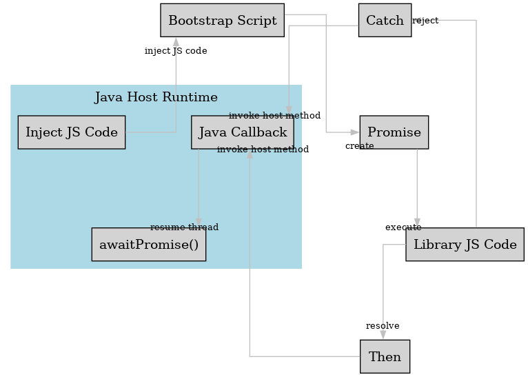
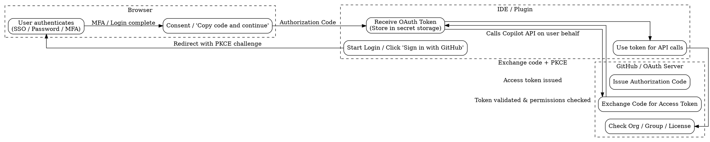
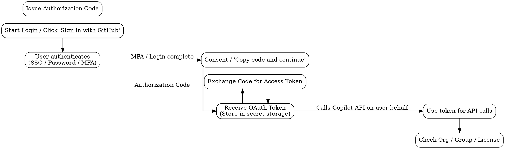
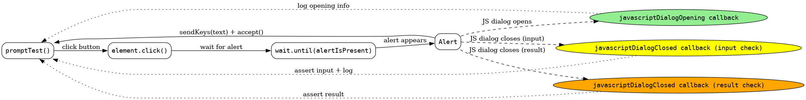
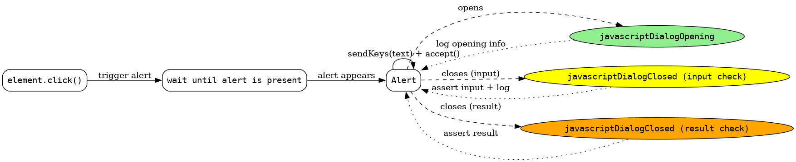
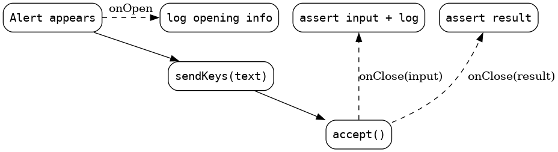

### Graphviz Java HTTP Server (Pure Java Rendering)

Clone of [graphviz-server](https://github.com/omerio/graphviz-server), a lightweight Java HTTP server wrapping the locally installed [Graphviz](http://www.graphviz.org/) binary.

This version replaces direct `/usr/bin/dot` execution with **pure Java** using **Nashorn** or **GraalVM JS**.

---
#### Complex Host–Embedded Runtime Control Loop



> This diagram illustrates the terse control flow between a Java host runtime, embedded JavaScript engine (GraalVM) and Graphviz Js Library (Viz.js), showing bootstrap injection, Promise execution, and callback-based resumption of Java control flow (then/catch paths). Java does not do not strictly need two separate `CompletableFutures` for `resolve` and `reject` - a single `CompletableFuture<T>` is OK. if needed in JS callbacks one can do:
```text
Javacript Library
            ├─ resolve → JavaCallback.resolve
            └─ reject  → JavaCallback.reject
```
and on Java side,
```text
CompletableFuture<Result>
                   ├─ thenAccept(...)        // Then path
                   └─ exceptionally(...)     // Catch path
```
```java
CompletableFuture<Result> future = new CompletableFuture<>();

public void resolve(Result r) {
    future.complete(r);
}

public void reject(String error) {
    future.completeExceptionally(new RuntimeException(error));
}

```
### Usage

```cmd
set java_home=c:\java\jdk-17.0.12
c:\java\init.cmd
```
default profile
```cmd
mvn package
```
```cmd
java -cp target\example.graphviz-java.jar;target\lib\* example.DotGraphics 8080
```
```sh
curl -s -X POST http://localhost:8080/ -d @../basic-graphviz/color.dot -o color.png
```
```text

17:35:14.874 INFO  example.DotGraphics - Listening on port 8080
17:35:14.872 INFO  example.GraphViz - Using Graphviz engine: graal
17:35:14.882 INFO  example.GraphvizGraalEngine - Initializing GraalJS context...
17:35:15.277 INFO  example.GraphvizGraalEngine - Loading /META-INF/resources/webjars/viz.js-graphviz-java/2.1.3/viz.js
17:35:16.149 INFO  example.GraphvizGraalEngine - Loaded /META-INF/resources/webjars/viz.js-graphviz-java/2.1.3/viz.js, length=11717
17:35:16.149 INFO  example.GraphvizGraalEngine - Loading /META-INF/resources/webjars/viz.js-graphviz-java/2.1.3/full.render.js
17:35:17.829 INFO  example.GraphvizGraalEngine - Loaded /META-INF/resources/webjars/viz.js-graphviz-java/2.1.3/full.render.js, length=2402990
17:35:17.829 INFO  example.GraphvizGraalEngine - Viz.js loaded successfully.
17:35:17.830 INFO  example.GraphViz - Graphviz engine, 1488395499 created
17:35:19.370 INFO  example.GraphvizGraalEngine - SVG generated, length=1178
17:35:20.677 INFO  example.GraphViz - Graphviz engine warmup complete, 2614 bytes generated
17:37:28.571 INFO  example.DotGraphics - Incoming connection from /0:0:0:0:0:0:0:1
17:37:28.607 INFO  example.DotGraphics - New connection thread
17:37:28.623 INFO  o.a.http.protocol.HttpRequestHandler - POST / [Host: localhost:8080, User-Agent: curl/8.12.1, Accept: */*, Content-Length: 278, Content-Type: application/x-www-form-urlencoded]
17:37:28.625 INFO  o.a.http.protocol.HttpRequestHandler - Incoming entity content (278 bytes): graph {    { rank=same; white}    { rank=same; cyan; yellow; pink}    { rank=same; red; green; blue}    { rank=same; black}    white -- cyan -- blue    white -- yellow -- green    white -- pink -- red    cyan -- green -- black    yellow -- red -- black    pink -- blue -- black}
17:37:28.635 INFO  o.a.http.protocol.HttpRequestHandler - valid dot content
17:37:28.637 INFO  o.a.http.protocol.HttpRequestHandler - requesting graph type:
17:37:28.638 INFO  o.a.http.protocol.HttpRequestHandler - graph {    { rank=same; white}    { rank=same; cyan; yellow; pink}    { rank=same; red; green; blue}    { rank=same; black}    white -- cyan -- blue    white -- yellow -- green    white -- pink -- red    cyan -- green -- black    yellow -- red -- black    pink -- blue -- black}
17:37:30.804 INFO  example.GraphvizGraalEngine - SVG generated, length=4897
17:37:31.158 INFO  o.a.http.protocol.HttpRequestHandler - Responded with Success


```
### Shade ("Fat") Jar

pass the profile argument
```sh
mvn -Psingle clean package
```

#### Run in foreground

```sh
java -jar target/example.graphviz-java-fat.jar 8080
```

#### Interact with the server

```sh
curl -v -X POST http://localhost:8080/ -d @../basic-graphviz/color.dot -o color.png
```

**Example curl request headers and response:**

```text
> POST / HTTP/1.1
> Host: localhost:8080
> User-Agent: curl/7.81.0
> Accept: */*
> Content-Length: 278
> Content-Type: application/x-www-form-urlencoded

* Mark bundle as not supporting multiuse
< HTTP/1.1 200 OK
< Date: Fri, 06 Feb 2026 20:46:00 GMT
< Server: DotGraphics/1.1
< Content-Length: 32547
< Content-Type: image/png
```

**Console log sample:**

```text
20:11:07.181 INFO  example.GraphViz - Using Graphviz engine: graal
20:11:07.182 INFO  example.DotGraphics - Listening on port 8080
20:11:07.186 INFO  example.GraphvizGraalEngine - Initializing GraalJS context...
20:11:07.411 INFO  example.GraphvizGraalEngine - Loading /META-INF/resources/webjars/viz.js-graphviz-java/2.1.3/viz.js
20:11:08.108 INFO  example.GraphvizGraalEngine - Loaded viz.js, length=11717
20:11:10.672 INFO  example.GraphvizGraalEngine - Loaded full.render.js, length=2402990
20:11:10.672 INFO  example.GraphvizGraalEngine - Viz.js loaded successfully.
20:11:10.673 INFO  example.GraphViz - Graphviz engine warmup complete
```
### Exporting to Draw.io

Resurrect explicit output format negotiation and make it first-class REST behavior, then short-circuit [Batik](https://xmlgraphics.apache.org/batik/) when __SVG__ is requested

```sh
curl -sX POST http://localhost:8080/?format=svg -d @color.dot  -o color.svg
```
or "RPC-style":
```sh
curl -sX POST http://localhost:8080/svg -d @color.dot  -o color.svg
```

this will write `color.svg`:
```xml
<?xml version="1.0" encoding="UTF-8" standalone="no"?>
<!DOCTYPE svg PUBLIC "-//W3C//DTD SVG 1.1//EN"
 "http://www.w3.org/Graphics/SVG/1.1/DTD/svg11.dtd">
<!-- Generated by graphviz version 2.44.0 (20200408.0750)
 -->
<!-- Pages: 1 -->
<svg width="234pt" height="260pt"
 viewBox="0.00 0.00 233.59 260.00" xmlns="http://www.w3.org/2000/svg" xmlns:xlink="http://www.w3.org/1999/xlink">
<g id="graph0" class="graph" transform="scale(1 1) rotate(0) translate(4 256)">
<polygon fill="white" stroke="transparent" points="-4,4 -4,-256 229.59,-256 229.59,4 -4,4"/>
<!-- white -->
<g id="node1" class="node">
<title>white</title>
<ellipse fill="none" stroke="black" cx="121.32" cy="-234" rx="32.48" ry="18"/>
<text text-anchor="middle" x="121.32" y="-229.8" font-family="Times,serif" font-size="14.00">white</text>
...
</svg>
```
> NOTE: The original design (POST / → png, POST /svg → svg) was not incorrect, but was more "RPC-style routing" than modern resource-oriented REST. /?format=svgKeeping both options recognized

---

### Docker Packaging

```sh
mvn clean package
```

```sh
docker pull eclipse-temurin:17-jre-alpine
export NAME=example-graphviz-graalvm-java
docker build -t $NAME -f Dockerfile .
docker container stop $NAME || true
docker container rm $NAME || true
docker run -p 8080:8080 --name $NAME -d $NAME
```

Test from host:

```sh
curl -sfX POST http://localhost:8080/ -d @../basic-graphviz/color.dot -o color.png
echo $?
```

Test from VM:

```sh
curl -sf --connect-timeout 5 --max-time 10 -X POST http://192.168.99.102:8080/ -d @../basic-graphviz/color.dot -o color.png
```

View container logs:

```sh
docker logs $NAME
```

### JVM Property Overrides

Pass properties via command-line:

```sh
docker run --rm \
  -p 8080:8080 \
  -e JAVA_OPTS="-Dgraphviz.engine=nashorn -Dserver.port=8080 -Dfile.encoding=UTF-8" \
  --name $NAME \
  $NAME
```

Pass `application.properties` via volume:

```sh
docker run --rm \
  -p 8080:8080 \
  -v /path/to/local/application.properties:/config/application.properties:ro \
  --name $NAME \
  $NAME
```

---

## Troubleshooting

- GraalJS is **much faster** than Nashorn but increases JAR size (~50 MB).
- `Viz.js` 2.x is fully **asynchronous**; using `while(!done){}` blocks the event loop and will hang rendering.
- Use a newer Docker environment to avoid thread creation errors:

```txt
[0.007s][warning][os,thread] Failed to start thread "VM Thread" - pthread_create failed
```

- Avoid aggressive manual `rank` constraints across clusters in Graphviz; mixing `cluster_*` and `rank=same` can cause warnings or crashes:

```text
node X was already in a rankset, deleted from cluster
Segmentation fault
```

---

## Authentication vs Authorization Concepts

### Authentication (AuthN)

- **Identity Store**: LDAP, Active Directory, RHDS
- **Credential Store**: Password hashes, certificates, MFA
- **Directory Service**: Hierarchical storage of users and principals

### Authorization (AuthZ)

- **Authorization Store**: Roles, groups, permissions
- **Policy Store**: XACML, OPA, etc.
- **Access Control Database**: Maps subjects to resources
- **Entitlement Store**: Enterprise IAM permissions

### OAuth / Delegated Authorization

For services like GitHub Copilot:

| Concept              | GitHub Flow                          | OAuth 2 Equivalent                 |
|--------------------- |------------------------------------ |---------------------------------- |
| User login           | Engineer authenticates via GitHub/SSO | Resource Owner authenticates      |
| MFA / 2FA            | Phone app, RSA token, TOTP           | Optional second factor             |
| Plugin request       | Plugin opens browser, waits for code | OAuth Client requests Auth Code   |
| Copy code / continue | User pastes code back into plugin    | Authorization Code Grant / PKCE   |

**Root cause pattern**:

- Subject exists in **Identity Store** but not yet in **Authorization / Entitlement Store**.
- Common in AD ForeignSecurityPrincipals, cross-realm Kerberos, OAuth external users, and federation mapping.

---

## Historical Context: ChiWriter

**ChiWriter** (MS-DOS, 1986) was a WYSIWYG scientific editor for mathematical and technical content:


- Interactive, extended character support
- Visual feedback while typing
- Alternative to TeX/LaTeX
- Platform-locked, proprietary, niche

**Lesson**: Code-oriented, interactive editors have always offered clarity and productivity, long before modern tools like Graphviz or declarative pipelines.

---

## Advantages of Code-Oriented Diagrams

- Clarity of intent
- Readable abstraction
- Compactness
- Maintainability
- Expressiveness

**Example**: Graphviz vs. Drawio or XML pipelines. Declarative code shows *what* you want rather than *how to serialize it*.

---
### Graphviz Diagrams

One of the strengths of Graphviz (especially when combined with an agentic tool) is how naturally intent can be expressed and refined.
Instead of manually dragging boxes, the author describes the flow and then adjusts it using plain language.

Below is an example based on a familiar OAuth2 “on behalf of the user” delegated authorization flow.

The first version is generated automatically from a textual description.
It is logically correct, but visually suboptimal.


Rendered with:
```sh
dot -Tpng -o screenshots/oauth2-delegated-auth-flow-poor-layout.png scratch/oauth2-delegated-auth-flow-poor-layout.dot
```

**Initial generated diagram (poor layout)**


**Natural-language correction prompt**

Instead of manually repositioning boxes, the layout is corrected using intent:

> the flow heavily gravitates west.
i like to ask put actors in the following order
on the left plugin / ide
in the middle the browser
on the right oauth server.
currently the browser is on the left, ide on the right and oauth server underneath


**Updated diagram description**:

Final result:


#### Key takeaway

This demonstrates how Graphviz supports an intent-driven workflow:

* Start from a conceptual description
* Render a first draft
* Refine the diagram using natural language (“move actors left/right”, “align lanes”, “clarify flow”)
* Preserve the diagram as reproducible code

Instead of pixel-level manipulation, the author works at the level of meaning and structure, which makes the diagram:

* auditable
* versionable
* repeatable
* and easy to evolve as understanding improves

An additional advantage is that such diagrams are **combinable and scalable**.
Individual subflows can be refined independently and later merged into larger system-level views.
Unlike XML/JSON-based workflow tools (for example, [n8n](https://en.wikipedia.org/wiki/N8n) or
[UiPath](https://en.wikipedia.org/wiki/UiPath), which quickly become hard to tweak and reason about
even for relatively simple flows, DOT remains readable and malleable as complexity grows.
Compare the classic [Jenkins](https://en.wikipedia.org/wiki/Jenkins_(software))
"Freestyle project" with [Pipeline](https://www.jenkins.io/doc/book/pipeline/).

With a DSL-based diagrams, “polishing” a large flow piece by piece is not intimidating.
Changes remain local, understandable, and reversible.
This encourages iterative improvement rather than discouraging modification through visual clutter or brittle GUI layouts.

From a management perspective, this enables work to be distributed across a team according to **subject-matter expertise** rather than tooling expertise.
Each contributor can focus on the part of the flow they understand best (authentication, authorization, data flow, infrastructure, policy), without needing to master a complex visual editor.
The “language-like” nature of DOT makes collaboration practical and inclusive.

This also aligns with established practice in the [Jupyter](https://en.wikipedia.org/wiki/Project_Jupyter) and data science communities.
Just as [gnuplot](https://en.wikipedia.org/wiki/Gnuplot) has long been recognized for reproducible data visualization, Graphviz and DOT are implicitly used in modern AI and ML tooling.
Frameworks such as TensorFlow and scikit-learn already model computation and dependency graphs internally in ways that closely resemble DOT.
For AI practitioners, this style of representation is natural and familiar.

This provides a strong argument when communicating with senior management:

* “Everyone can read it.”
* “No one is locked into a single tool or editor.”
* “It integrates naturally with engineering, data science, and documentation workflows.”
* “It is already aligned with how modern AI systems think about structure and flow.”

This is not exotic, this is already mainstream among the most demanding communities.
This approach is already standard in the Jupyter and AI communities.
In fact Graphviz plays the same pivital role with flows that gnuplot plays with data in the Jupyter ecosystem.
Even when people don’t write DOT directly, their tools generate and consume Graphviz diagrams every day. We’re simply making that practice explicit and reusable for architecture and flows.
If you embrace Jupyter, and [TensorFlow](https://en.wikipedia.org/wiki/TensorFlow), [scikit-learn](https://en.wikipedia.org/wiki/Scikit-learn), or [PyTorch](https://en.wikipedia.org/wiki/PyTorch) you already embraced __Graphviz__


The focus shifts away from individual technical achievement in a narrow programming environment and toward shared understanding of system intent and behavior.
This makes it easier for management to approve lightweight, standard tooling (for example, installing Graphviz via apt, yum, or chocolatey) in place of heavyweight proprietary diagram editors.

In short, Graphviz turns diagrams into living artifacts:
not pictures to be manually drawn and forgotten, but structured knowledge that can be reviewed, evolved, and trusted over time.
### Confluence Graphviz Plugin

This document summarizes what is meant by the Wikipedia note:

> **"Confluence has a Graphviz plugin."**

and explains which plugin this refers to, how it works, how it is installed, and how it is used.

---

## 1. Which “Graphviz plugin” for Confluence?

Historically, this refers to third-party Confluence add-ons such as:

- **Graphviz Plugin for Confluence**
- **Graphviz Macro**
- **DOT Macro**
- **Graph Visualization Plugin**

These plugins provide a **Confluence macro** that allows users to embed Graphviz DOT language directly into wiki pages and render diagrams.

Example usage in a Confluence page:

```text
{graphviz}
digraph G {
  A -> B;
  B -> C;
}
{graphviz}
```
### Memorable ChatGPT Feedback Openers

- 
- 
- 
- 


### Example Test Flow Visualization

This example demonstrates how a dense test flow logic
can be visualized using __Graphviz__.
Each iteration simplifies the diagram to focus on key aspects of the test scenario.

Sample Test Fragment (`@Before`/`@After` code not shown):

```java
@Test
public void promptTest() {
    // register listeners
    chromeDevTools.addListener(Page.javascriptDialogOpening(),
        event -> System.err.println("Dialog opening: " + event.getMessage()));
    chromeDevTools.addListener(Page.javascriptDialogClosed(),
        event -> {
            assertThat(event.getUserInput(), notNullValue());
            assertThat(event.getUserInput(), is(text));
        });
    chromeDevTools.addListener(Page.javascriptDialogClosed(),
        event -> assertThat(event.getResult(), is(true)));

    element = findButton();
    element.click();
    alert = wait.until(ExpectedConditions.alertIsPresent());
    alert.sendKeys(text);
    alert.accept();
}
```
remarkably a lot of going on during this test

#### Iteration 1 – Full Flow with promptTest() Node

Rendered image:



Dot source:

```java
digraph promptTestFlow {
    rankdir=LR;
    node [shape=box, style=rounded];

    TestMethod [label="promptTest()"];
    Button [label="element.click()"];
    AlertWait [label="wait until alert"];
    Alert [label="Alert"];

    DialogOpenCB [label="javascriptDialogOpening", shape=ellipse, style=filled, fillcolor=lightgreen];
    DialogClosedInputCB [label="javascriptDialogClosed (input)", shape=ellipse, style=filled, fillcolor=yellow];
    DialogClosedResultCB [label="javascriptDialogClosed (result)", shape=ellipse, style=filled, fillcolor=orange];

    TestMethod -> Button;
    Button -> AlertWait;
    AlertWait -> Alert;
    Alert -> TestMethod [label="sendKeys + accept()"];

    Alert -> DialogOpenCB [style=dashed];
    Alert -> DialogClosedInputCB [style=dashed];
    Alert -> DialogClosedResultCB [style=dashed];

    DialogOpenCB -> TestMethod [style=dotted];
    DialogClosedInputCB -> TestMethod [style=dotted];
    DialogClosedResultCB -> TestMethod [style=dotted];
}
```
#### Iteration 2 – Removing promptTest() Node (Storybook Approach)

Rendered image:



Dot source:


```java
digraph promptStory {
    rankdir=LR;
    node [shape=box, style=rounded];

    ButtonClick [label="element.click()"];
    AlertWait [label="wait until alert"];
    Alert [label="Alert"];

    DialogOpenCB [label="javascriptDialogOpening", shape=ellipse, style=filled, fillcolor=lightgreen];
    DialogClosedInputCB [label="javascriptDialogClosed (input)", shape=ellipse, style=filled, fillcolor=yellow];
    DialogClosedResultCB [label="javascriptDialogClosed (result)", shape=ellipse, style=filled, fillcolor=orange];

    ButtonClick -> AlertWait;
    AlertWait -> Alert;
    Alert -> Alert [label="sendKeys + accept()"];

    Alert -> DialogOpenCB [style=dashed];
    Alert -> DialogClosedInputCB [style=dashed];
    Alert -> DialogClosedResultCB [style=dashed];

    DialogOpenCB -> Alert [style=dotted];
    DialogClosedInputCB -> Alert [style=dotted];
    DialogClosedResultCB -> Alert [style=dotted];
}

```
#### Iteration 3 – SwimLane Approximation of Alert Lifecycle

Rendered image:



Dot source:

```java
digraph alertSwimlane {
    rankdir=TB;
    node [shape=box, style=rounded];

    subgraph lane_alert {
        label="Alert"; style=dashed; color=lightblue;
        AlertAppear [label="Alert appears"];
        AlertInput [label="sendKeys(text)"];
        AlertAccept [label="accept()"];
    }

    subgraph lane_openCB {
        label="javascriptDialogOpening"; style=dashed; color=lightgreen;
        DialogOpenCB [label="log opening info"];
    }

    subgraph lane_closedInputCB {
        label="javascriptDialogClosed (input)"; style=dashed; color=yellow;
        DialogClosedInputCB [label="assert input + log"];
    }

    subgraph lane_closedResultCB {
        label="javascriptDialogClosed (result)"; style=dashed; color=orange;
        DialogClosedResultCB [label="assert result"];
    }

    AlertAppear -> AlertInput -> AlertAccept;

    AlertAppear -> DialogOpenCB [label="onOpen", style=dashed];
    AlertAccept -> DialogClosedInputCB [label="onClose(input)", style=dashed];
    AlertAccept -> DialogClosedResultCB [label="onClose(result)", style=dashed];

    { rank=same; AlertAppear; DialogOpenCB; DialogClosedInputCB; DialogClosedResultCB; }
    { rank=same; AlertInput; }
    { rank=same; AlertAccept; }
}

```
> Note: Graphviz does not provide true swimlane support; this layout approximates swimlanes using clusters and horizontal alignment.

#### Conclusion

This example demonstrates the progression from a full method diagram to a key storybook abstraction, and finally to a swimlane-style lifecycle of the "subject" (alert dialog).
Each iteration performs a close-up refocus, isolating key actors and events and clarifying the flow of asynchronous callbacks in complex code.

With the .dot sources and rendered images provided for reference, the diagrammatic approach allows quick comprehension of otherwise dense procedural logic.


### See Also

  * [Graphviz gallery](https://graphviz.org/gallery/)
  * [Graphviz Visual Editor](https://magjac.com/graphviz-visual-editor/)
  * https://github.com/omerio/graphviz-server
  * https://github.com/omerio/graphviz-webapp
  * https://hub.docker.com/r/mejran/graphviz-server
  * https://github.com/blackears/svgSalamander SVG engine for Java
  * https://mvnrepository.com/artifact/guru.nidi/graphviz-java/0.18.1
  * https://javadoc.io/doc/guru.nidi/graphviz-java/latest/index.html
  * https://sergeytihon.com/tag/graphviz/
  * https://pikabu.ru/story/rub_goldberg_i_ego_mashinyi_9986808?ysclid=mlfs8nk32o584914016
  * https://youtu.be/GvnEBX9aedY
  * https://sarielhp.org/misc/dot/gallery
  * web based dor viewers:
    + https://edotor.net
    + `viz.js` based in-browser render [app](https://dreampuf.github.io/GraphvizOnline/?engine=dot) and [github source](https://github.com/dreampuf/GraphvizOnline)
    + __graphviz-visual-editor__ - server-side, node.js [github project](https://github.com/magjac/graphviz-visual-editor) and [app](https://magjac.com/graphviz-visual-editor/) - uses [dot.js](https://github.com/magjac/graphviz-visual-editor/blob/master/src/dot.js)
    + https://www.webgraphviz.com - also uses `viz.js`
  * [Confluence Installing plugins overview](https://confluence.atlassian.com/spaces/CONF27/pages/145097161/Installing%2Bplugins%2Boverview)
  * [Confluence Flowchart Macro documentation](https://confluence.atlassian.com/display/conf29/flowchart%2Bmacro)
  * [Atlassian Marketplace](https://marketplace.atlassian.com/apps/257/graphviz-diagrams-for-confluence)
  * [Forge-based Graphviz Confluence plugin - also on Atlassian Marketplace](https://marketplace.atlassian.com/apps/1230982/graphviz-for-confluence?utm_source)
  * [Excalidraw Graphviz Diagrams Visual Editor for Confluence](https://marketplace.atlassian.com/apps/1237691/excalidraw-graphviz-diagrams-for-confluence)

---
### Author

[Serguei Kouzmine](kouzmine_serguei@yahoo.com)
