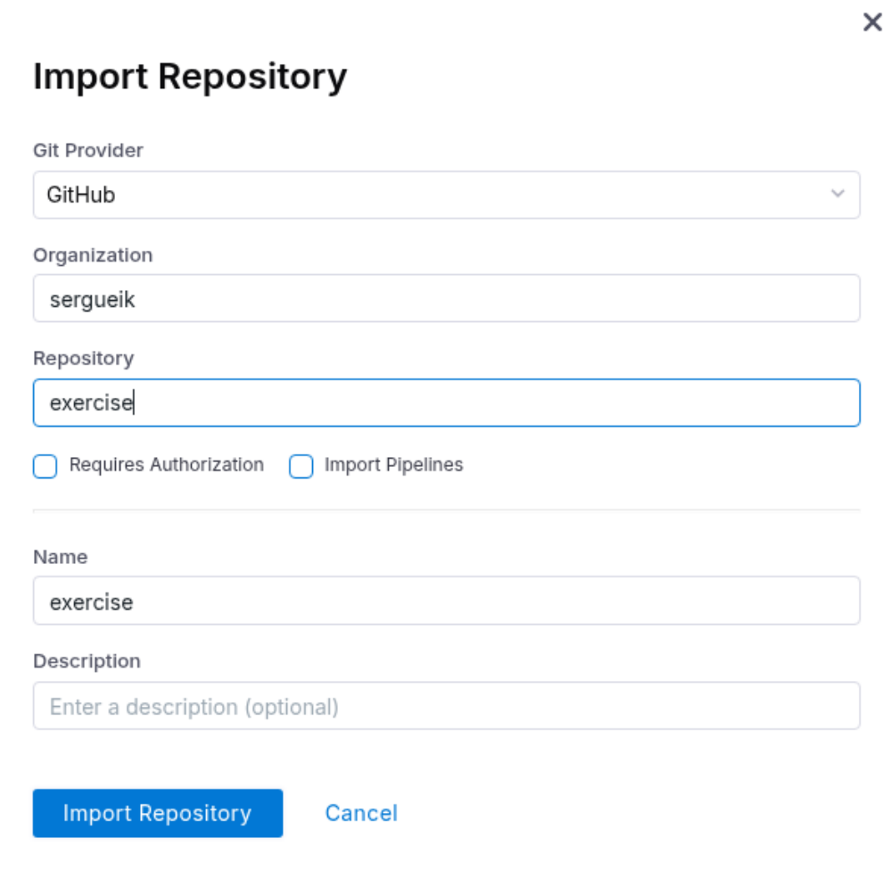
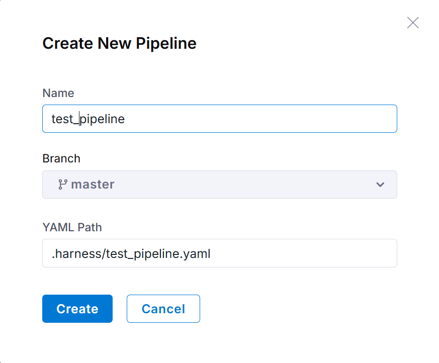
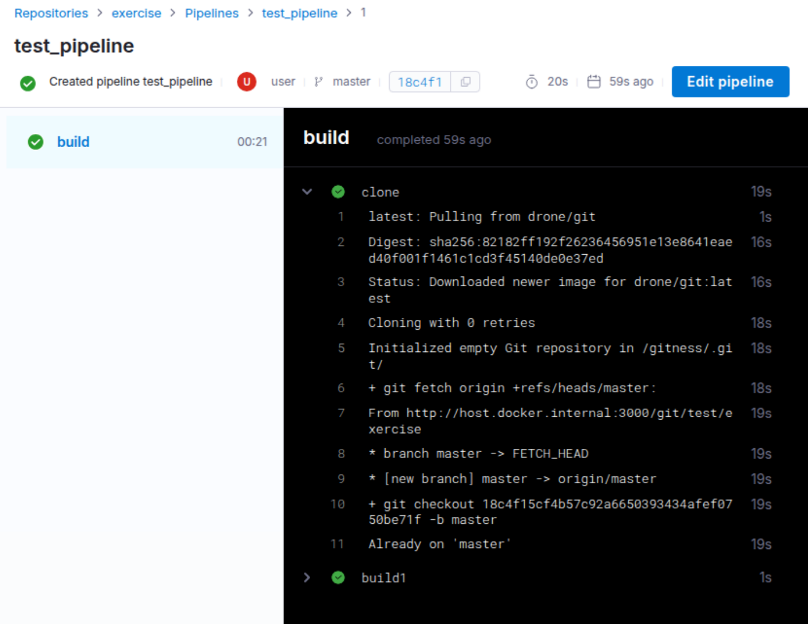
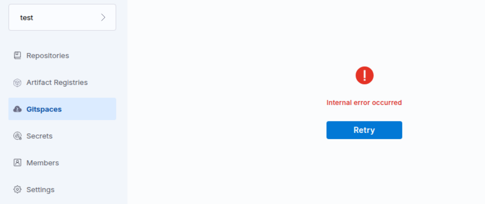

### info

This directory contains the install of __Harness Open Source__ *an all-in-one platform that ...*  - It is not just the __Harness Delegate__, actually

---
### Usage
```sh
TAG='3.2.0'
TAG='3.0.1'
docker pull harness/harness:$TAG
```
it will attempt to access all other containers run locally
```sh
TAG='3.2.0'
TAG='3.0.1'
docker run -d \
  -p 3000:3000 -p 3022:3022 \
  -v /var/run/docker.sock:/var/run/docker.sock \
  -v /tmp/harness:/data \
  --name opensource \
  --restart always \
  harness/harness:$TAG
```
add repository. For pipeline, import yaml from maven [sample](https://developer.harness.io/docs/open-source/pipelines/samples/maven)
but use a smaller image `openjdk:8-jdk-alpine3.9`





If seeing the error
```text
Error response from daemon: client version 1.41 is too new. Maximum supported API version is 1.40
```
downgrade to `3.0.1`

NOTE: aftrer recycling the container, the already made changes are still present:



```sh
$ docker-machine ssh
```
```text
   ( '>')
  /) TC (\   Core is distributed with ABSOLUTELY NO WARRANTY.
 (/-_--_-\)           www.tinycorelinux.net
```
```sh
ls /tmp/harness
```
```text
cleanup          database.sqlite  repos            shared_temp
```
to move to another machine

```sh
mkdir /tmp/harness
cp -R ~/harness/ /tmp/harness
sudo chown -R root:root /tmp/harness/
```

> NOTE, some basic functionality is broken in the default configuration, e.g. [Haeness Open Source Gitspaces](https://developer.harness.io/docs/category/gitspaces)



```text
Failed to load resource: http://192.168.99.100:3000/api/v1/spaces/test/+/gitspaces?page=1&limit=20 the server responded with a status of 500 (Internal Server Error)
```

---
### See Also

  * Harness Open Source [documentation](https://developer.harness.io/docs/open-source)
  * __Harness Open Source__ Docker hub[images](https://hub.docker.com/r/harness/harness)
  * __Harness Delegate__ Docker hub[images](https://hub.docker.com/r/harness/delegate)

---
### Author
[Serguei Kouzmine](kouzmine_serguei@yahoo.com)

