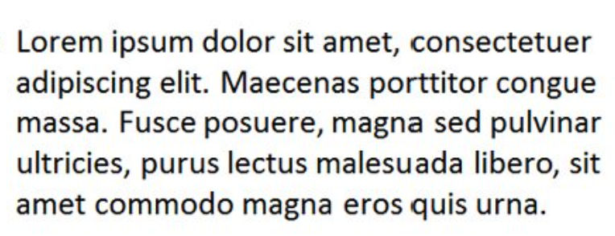
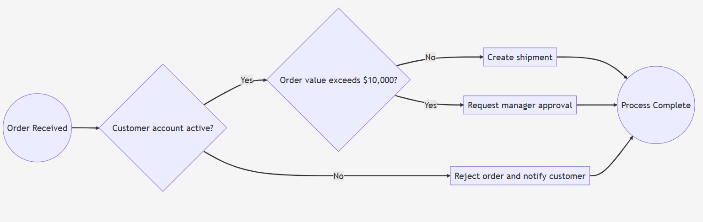
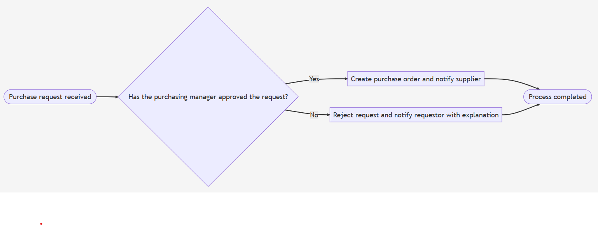
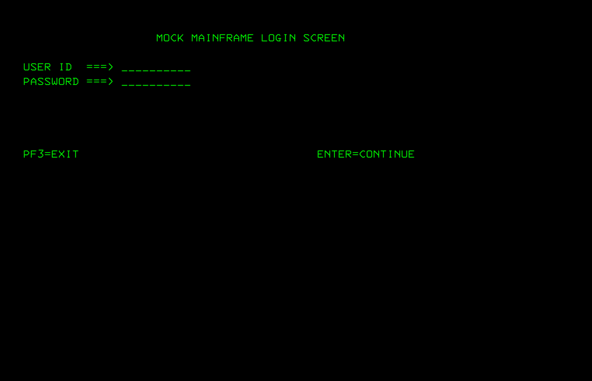
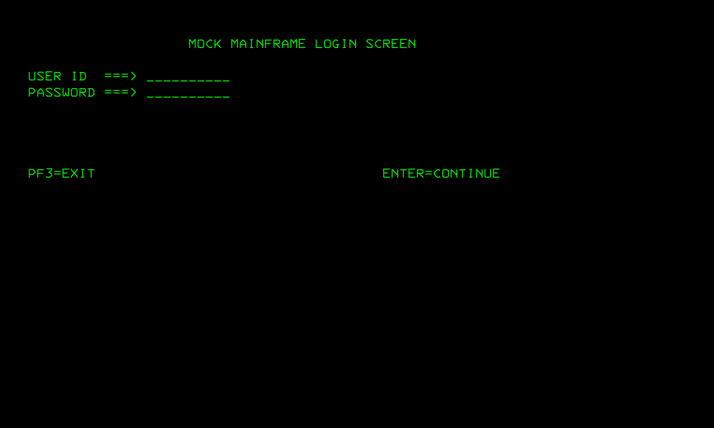
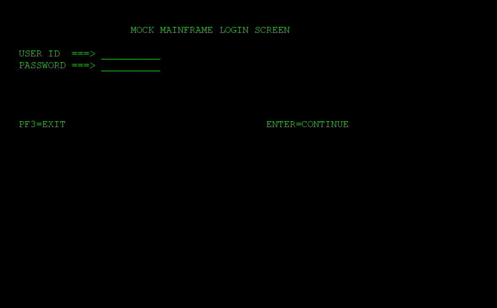
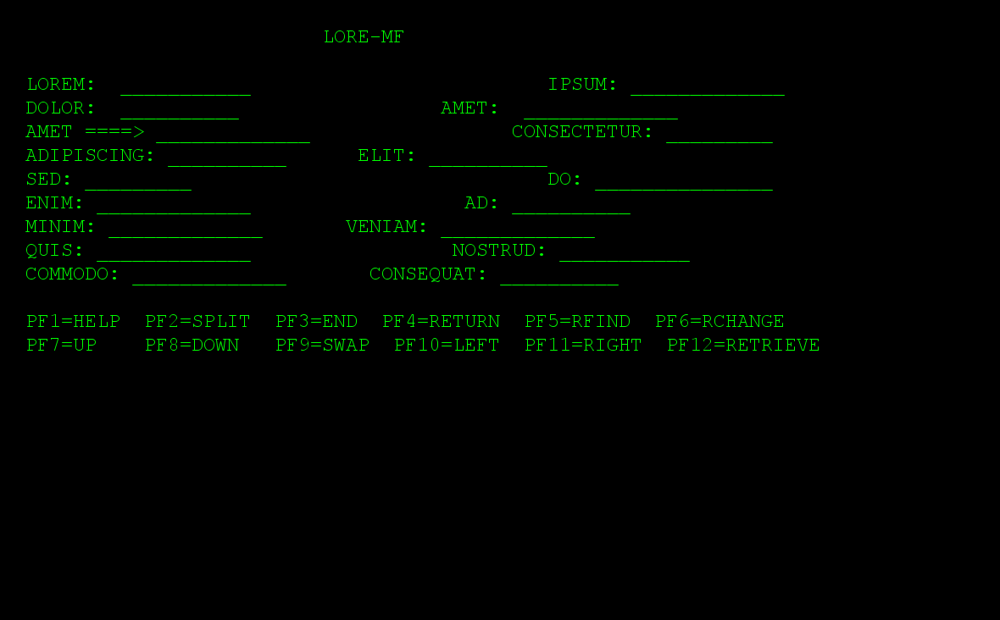

### Usage

```
docker pull minidocks/imagemagick
docker pull jitesoft/tesseract-ocr
```	
This experiment evaluates whether a simple OCR pipeline (ImageMagick + Tesseract) can extract reusable business knowledge from workflow diagrams

#### Control experiment: plain text



```sh
./scan_screenshot.sh images/text.png
```
```text
Lorem ipsum dolor sit amet, consectetuer
adipiscing elit. Maecenas porttitor congue
massa. Fusce posuere, magna sed pulvinar
ultricies, purus lectus malesuada libero, sit
amet commodo magna eros quis urna.
```

A workflow diagram is not primarily a text artifact. Even a simple "no fancy" workflow diagram typically contains far more structural information than textual information. The labels may represent only a small fraction of the artifact, while the majority of the representation describes shapes, connectors, positioning, grouping, and visual relationships

In addition, many workflow formats are shared with graphical IDEs or modeling tools. The file may contain a significant amount of authoring metadata: coordinates, layout information, editor state, object identifiers, style definitions, and other information required by the tool. This information is useful to the authoring environment but has little direct business meaning.

OCR extracts the visible labels, but it discards the very information that makes the diagram a process: the topology and relationships
### Challenges
#### Challenge 1: workflow diagram
`diagram1.mermaid`:
```code
flowchart LR

Start((Order Received))
Cond1{"Customer account active?"}
Cond2{"Order value exceeds $10,000?"}
Then1["Create shipment"]
Then2["Request manager approval"]
Else["Reject order and notify customer"]
End((Process Complete))
Start --> Cond1
Cond1 -->|Yes| Cond2
Cond1 -->|No| Else
Cond2 -->|Yes| Then2
Cond2 -->|No| Then1
Then1 --> End
Then2 --> End
Else --> End
```


Can OCR recover the business process from the rendered diagram?

```sh
./scan_screenshot.sh images/diagram1.png 
```
```text
Order value exceeds $10,000?

mplete |

/
```
Activity labels were discovered, but decision logic and branching were gone.

#### Challenge 2: business process

`diagram2.mermaid`:
```code
flowchart LR

Start([Purchase request received])
Decision{"Has the purchasing manager approved the request?"}
Approve["Create purchase order and notify supplier"]
Reject["Reject request and notify requestor with explanation"]
End([Process completed])

Start --> Decision
Decision -->|Yes| Approve
Decision -->|No| Reject
Approve --> End
Reject --> End
```


```sh
./scan_screenshot.sh images/diagram2.png
```
```text
Create purchase order and notify supplier

Reject request and notify requestor with explanation

Process completed
```

Observation:
The extracted text reads like a business process description, 
but it no longer conveys the rule that determines which path is executed

### Findings

|Business information |OCR recovered |
|-----------------|-----------|
|Activity labels       | 	✅ Mostly    |
|Decision conditions |	⚠️ Partial|
|Branching logic	 |❌         |
|Sequence	         |❌         |
|Process semantics	 |❌         |

### Note

A typical workflow diagram contains far more structural information than textual information. The labels may occupy only a small fraction of the artifact, while the majority of the representation describes geometry: nodes, edges, positions, grouping, routing, and visual relationships. OCR extracts mainly the labels and discards most of the structure.

A workflow diagram is already a highly optimized visual representation. The majority of its information content is *not* text.

A large fraction of the file representation may be:
  * geometry (coordinates, bounding boxes, connectors),
  * rendering instructions,
  * editor metadata,
  * collaboration/versioning information,
  * application-specific state

### Troubleshooting

```text
Error, could not create TXT output file: Permission denied
cat: /tmp/tmp.Emwe1AX3aD/result.txt: No such file or dir
```
check the image configuration
```sh
docker inspect jitesoft/tesseract-ocr | grep -i User
```

```text
"User": "tesseract",
```

### Cleanup
```
docker image rm jitesoft/tesseract-ocr:latest minidocks/imagemagick:latest
```

### 3270 Terminal Text Extaction

a.k.a. OCR'ing teller screens

Font shape and spacing is important. One may need to find a close match to fonts used by Blue Prism , UiPath - these are likely resular True Type fonts. For the purpose of exercise take a public 3270 fonts

```sh
apt-get install fonts-3270
```
apt source entry to add if not present:

|Distro | Package                                        | repo|
|-------|------------------------------------------------|-----|
|Debian |https://packages.debian.org/sid/fonts/fonts-3270| https://packages.debian.org/sid/fonts/fonts-3270|
|Ubuntu |http://packages.ubuntu.com/impish/fonts-3270| https://packages.ubuntu.com/impish/fonts/fonts-3270|

direct
```sh
BASE_URL='https://github.com/ryanoasis/nerd-fonts'
curl -skLo ~/Downloads/3270NerdFontMono-Regular.ttf "$BASE_URL/raw/refs/heads/master/patched-fonts/3270/3270NerdFontMono-Regular.ttf"
```
switch to Windows console (elevated)
```cmd
set FILENAME=3270NerdFontMono-Regular.ttf
copy /y "%USERPROFILE%\Downloads\%FILENAME%" "C:\Windows\Fonts\"
set FONT_NAME=3270 Nerd Font Mono
reg.exe add "HKLM\SOFTWARE\Microsoft\Windows NT\CurrentVersion\Fonts" /v "%FONT_NAME% (TrueType)" /t REG_SZ /d "%FILENAME%" /f
```
> NOTE there is quite a lot of 3270 fonts in the dir
> NOTE: the direct s3 link suggested in `https://github.com/rbanffy/3270font` no longer works:
> ```sh
> curl -skLo ~/Downloads/fonts-3270.zip https://3270font.s3.amazonaws.com/3270_fonts_d916271.zip
> ```



```sh
./scan_screenshot.sh images/console1.png 
```
result is printed to console:
```text
Estimating resolution as 172 
MOCK MAINFRAME LOGIN SCREEN 
USER ID) ===> _ 
PASSWORD ===> _. 

PF3=EXIT ENTER=CONT INUE
```


```sh
mvn package
pushd images
java -jar ../target/example.teller-screen.jar 
popd
```



```sh
./scan_screenshot.sh images/console2.png
```
result is printed to console:
```text
MOCK MAINFRAME LOGIN SCREEN

USER ID
PASSWORD ===

PF3=EXIT ENTER=CONT INUE
```
```
sudo apt-get install ttf-mscorefonts-installer
```
```sh
export FONT_PATH=/usr/share/fonts/truetype/msttcorefonts/Courier_New.ttf
```
```sh
mvn package
pushd images
java -jar ../target/example.teller-screen.jar 
popd
```


```sh
./scan_screenshot.sh images/console3.png
```


```text
Estimating resolution as 184
MOCK MAINFRAME LOGIN SCREEN

USER ID
PASSWORD ===>

PF3=EXIT ENTER=CONT INUE
```
__close inspection__:

|defect |explanation |
|-------|------------|
|`ID)` instead of `ID` | glyph/spacing recognition issue|
|underscore runs collapsing to single `_` | exactly the kind of character/grid issue worth investigating.
|`_ .` after PASSWORD | likely rendering/segmentation interaction|
|extra space in `CONT INUE` | character spacing / word segmentation|


### Troublshooting

missing dependency - :
```text
java -jar target/example.teller-screen.jar 

Exception in thread "main" java.lang.UnsatisfiedLinkError: 
Can't load library: /usr/lib/jvm/java-11-openjdk-amd64/lib/libawt_xawt.so 
at java.base/java.lang.ClassLoader.loadLibrary(ClassLoader.java:2638) 
at java.base/java.lang.Runtime.load0(Runtime.java:768)
```
```sh
find /usr/lib/jvm -name 'libawt_xawt.so'
```
machine has no jdk, only heaadless jre:
```sh
java -version
```
```text
openjdk version "11.0.31" 2026-04-21
OpenJDK Runtime Environment (build 11.0.31+11-post-1ubuntu1-22.04.2-Ubuntu)
OpenJDK 64-Bit Server VM (build 11.0.31+11-post-1ubuntu1-22.04.2-Ubuntu, mixed mode, sharing)
```
```sh
readlink -f "$(which java)"
```
```text
/usr/lib/jvm/java-11-openjdk-amd64/bin/java
```
```sh
dpkg -l | grep openjdk
```
```text
ii  openjdk-11-jre-headless:amd64           11.0.31+11-1ubuntu1~22.04.2                      amd64        OpenJDK Java runtime, using Hotspot JIT (headless)
```
```sh
sudo apt install openjdk-11-jdk
```

The `libawt` error goes away
but now need to tune the code to use 
```text
ii  fonts-3270     2.3.1-1      all          monospaced font based on IBM 3270 
```

```sh
dpkg -L fonts-3270
```
```text
/.
/usr
/usr/share
/usr/share/doc
/usr/share/doc/fonts-3270
/usr/share/doc/fonts-3270/README.md.gz
/usr/share/doc/fonts-3270/changelog.Debian.gz
/usr/share/doc/fonts-3270/copyright
/usr/share/fonts
/usr/share/fonts/opentype
/usr/share/fonts/opentype/3270
/usr/share/fonts/opentype/3270/3270-Regular.otf
/usr/share/fonts/opentype/3270/3270Condensed-Regular.otf
/usr/share/fonts/opentype/3270/3270SemiCondensed-Regular.otf
/usr/share/metainfo
/usr/share/metainfo/fonts-3270.metainfo.xml
```
### Next Step
S0 = pristine synthetic 3270-looking screen

Then create:

S1 = slightly overexposed
S2 = noisy
S3 = reduced contrast
S4 = brown on dark gray
S5 = vintage / color-shifted
S6 = slight character-position jitter





```sh
./scan_screenshot.sh images/console5.png
```
```txt
Estimating resolution as 185
=>
ADIPISCING:
SED:

ENIM:
MINIM:
QUIS:
COMMODO :

PF1=HELP PF2=SPLIT
PF 7=UP

LORE-MF

IPSUM:
AMET:
CONSECTETUR:
ELIT:
DO:
AD:
VENIAM:
NOSTRUD:
CONSEQUAT:

PF3=END PF4=RETURN PFS=RFIND PF6=RCHANGE
WAP PF1O=LEFT PF11=RIGHT PF12=RETRIEVE


```

```
cat example.text 
```
```
                        MOCK L&F

LOREM:  ___________                         IPSUM: _____________

DOLOR:  __________                 AMET:  _____________

AMET ====> _____________                 CONSECTETUR: _________

ADIPISCING: __________      ELIT: __________
SED: _________                              DO: _______________

EIUSMOD: _____________       TEMPOR: _____________

INCIDIDUNT: _________                     UT: _________

LABORE: _____________        ET: _____________

DOLORE: _________          MAGNA: _____________

ALIQUA: _____________       UT: __________

ENIM: _____________                  AD: __________

MINIM: _____________       VENIAM: _____________

QUIS: _____________                 NOSTRUD: ___________

EXERCITATION: _________          ULLAMCO: _____________

LABORIS: _____________       NISI: __________

UT: _____________                  ALIQUIP: ___________

EX: _____________          EA: _____________

COMMODO: _____________       CONSEQUAT: __________

                         ...

			 PF1=HELP  PF2=SPLIT  PF3=END  PF4=RETURN  PF5=RFIND  PF6=RCHANGE
			 PF7=UP    PF8=DOWN   PF9=SWAP  PF10=LEFT  PF11=RIGHT  PF12=RETRIEVE

```
```
mvn package
mkdir results
```
```sh
java -jar target/example.teller-screen.jar  -screenfile example.text  -outputfile images/console.png 
```
```sh
./scan_screenshot.sh  images/console.png | tee results/console.txt /dev/stderr
```
```text
Estimating resolution as 179
MOCK L&F

LOREM: IPSUM:
DOLOR: AMET:

AMET =

ADIPISCING: __________ ELIT: ~_________

SED: ______-__ DO: _______________
EIUSMOD: _____________ TEMPOR: __________
INCIDIDUNT: _________ UT: ~W
LABORE: _____________ ET: ~----_--

DOLORE: _________ MAGNA: ___--

ALIQUA: UT:

ENIM: AD:

MOCK L&F

LOREM: IPSUM:
DOLOR: AMET:

AMET =

ADIPISCING: __________ ELIT: ~_________

SED: ______-__ DO: _______________
EIUSMOD: _____________ TEMPOR: __________
INCIDIDUNT: _________ UT: ~W
LABORE: _____________ ET: ~----_--

DOLORE: _________ MAGNA: ___--

ALIQUA: UT:

ENIM: AD:

```

### Python Corner
```sh
sudo python3 -m pip install pillow
```
```text
Requirement already satisfied: pillow in /usr/lib/python3/dist-packages (9.0.1)
```

```sh
python3 teller_screen.py --screenfile example.txt --outputfile images/console6.png --textfile console6.txt
```


```sh
./scan_screenshot.sh  images/console6.png "-channel RGB -negate" | tee results/console.txt /dev/stderr
```
```
Estimating resolution as 180
Detected 11 diacritics
MOCK L&F

LOREM:

DOLOR: AMET:
AMET ====> ___-

QPIPISCING

INCIDIDUNT:
LABORE:
DOLORE:
ALIQUA:
ENIM:
MINIM:
Quis: NOSTRUD:
EXERCITATION: ULLAMCO:
LABORIS: __9- NISI: __-_--_e
UT: ALIQUIP: _-o
EX: _ EA:

BESEHE HELP BE: =SPLIT BESZENR PE4=RETURN BE? REIND PE eT RCHANGE
PFr=UP =D PF4=SWAP PFIQ=LEFT PF11=RIGHT PF12=RETRIEVE
MOCK L&F

LOREM:

DOLOR: AMET:
AMET ====> ___-

QPIPISCING

INCIDIDUNT:
LABORE:
DOLORE:
ALIQUA:
ENIM:
MINIM:
Quis: NOSTRUD:
EXERCITATION: ULLAMCO:
LABORIS: __9- NISI: __-_--_e
UT: ALIQUIP: _-o
EX: _ EA:

BESEHE HELP BE: =SPLIT BESZENR PE4=RETURN BE? REIND PE eT RCHANGE
PFr=UP =D PF4=SWAP PFIQ=LEFT PF11=RIGHT PF12=RETRIEVE

```
```sh
cat console6.txt
```
```text
                         MOCK L&F

LOREM:  ___________                         IPSUM: _____________

DOLOR:  __________                 AMET:  _____________

AMET ====> _____________                 CONSECTETUR: _________

ADIPISCING: __________      ELIT: __________
SED: _________                              DO: _______________

EIUSMOD: _____________       TEMPOR: _____________

INCIDIDUNT: _________                     UT: _________

LABORE: _____________        ET: _____________

DOLORE: _________          MAGNA: _____________

ALIQUA: _____________       UT: __________

ENIM: _____________                  AD: __________

MINIM: _____________       VENIAM: _____________

QUIS: _____________                 NOSTRUD: ___________

EXERCITATION: _________          ULLAMCO: _____________

LABORIS: _____________       NISI: __________

UT: _____________                  ALIQUIP: ___________

EX: _____________          EA: _____________

COMMODO: _____________       CONSEQUAT: __________

                         ...

PF1=HELP  PF2=SPLIT  PF3=END  PF4=RETURN  PF5=RFIND  PF6=RCHANGE
PF7=UP    PF8=DOWN   PF9=SWAP  PF10=LEFT  PF11=RIGHT  PF12=RETRIEVE

```
> NOTE: visually it is clear that the quality of screen image from Python generator is inferior compared to Java due primarily less advanced font metric and appropriate line-spacing calculation calculation

#### Next Steps

Add a Python loop around it with a more ML oriented options - labeling, exloring all ML options

```
3270/Courier-like glyph geometry
        +
hard/pixel-ish rasterization
        +
yellow / gray-ish phosphor foreground
        +
very dark blue/black background
        +
display/photo/capture artifacts
        +
color fringing at high-contrast edges
```
```sh
              logical screen
                    │
                    ▼
             font + metrics
                    │
                    ▼
              rasterization
                    │
          ┌─────────┴─────────┐
          │                   │
     rendering hint       color scheme
          │                   │
          └─────────┬─────────┘
                    ▼
              pristine PNG
                    │
                    ▼
             degradation
          ┌─────────┼─────────┐
          │         │         │
       noise    exposure   color fringe
          │         │         │
          └─────────┼─────────┘
                    ▼
               OCR input
``` 
### Unrelated

The next step is understanding what information exists, categorizing it, and identifying the relationships that make it valuable.

---

### See Also

  * https://www.bollynook.com/en/lyrics/19270/urvasi/
### Author
[Serguei Kouzmine](kouzmine_serguei@yahoo.com)
