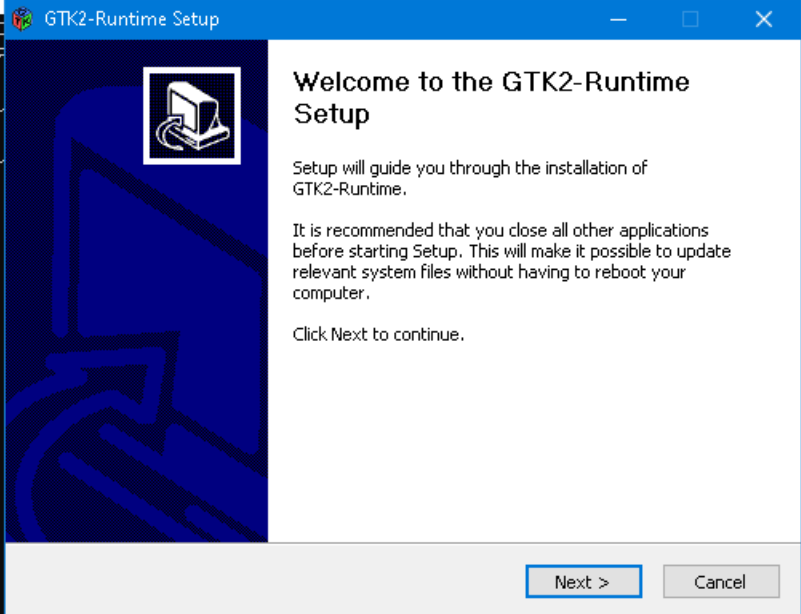
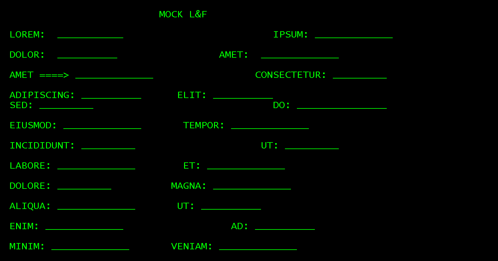

### Info
This is essentially the same code as in Windows Forms, but it uses the currently abandoned 
uses [mono/xwt](https://github.com/mono/xwt)
 cross-platform UI toolkit for creating desktop applications with .NET and Mono

### Usage

* download nuget packages and construct `packages` directory manually to avoid fighting with old `nuget.exe` problems:
```sh
curl -sLko ~/Downloads/xwt.0.2.251.nupkg https://www.nuget.org/api/v2/package/Xwt/0.2.251
curl -sLko ~/Downloads/xwt.gtk.0.2.251.nupkg https://www.nuget.org/api/v2/package/Xwt.Gtk/0.2.251
curl -sLko ~/Downloads/xwt.gtk.windows.0.2.251.nupkg https://www.nuget.org/api/v2/package/Xwt.Gtk.Windows/0.2.251
```

```sh
mkdir -p packages/{Xwt.0.2.251,Xwt.Gtk.0.2.251,Xwt.Gtk.Windows.0.2.251}
```
```text
pushd packages/Xwt.0.2.251
unzip -x ~/Downloads/xwt.0.2.251.nupkg lib/net472/Xwt.dll
popd
pushd packages/Xwt.Gtk.0.2.251
unzip -x ~/Downloads/xwt.gtk.0.2.251.nupkg lib/net472/*
popd
pushd packages/Xwt.Gtk.Windows.0.2.251
unzip -x ~/Downloads/xwt.gtk.windows.0.2.251.nupkg lib/net472/*
popd
```
the `packages` directory will have

```txt
Xwt.0.2.251/lib/net472/Xwt.dll
Xwt.Gtk.0.2.251/lib/net472/Xwt.Gtk.dll
Xwt.Gtk.Windows.0.2.251/lib/net472/Xwt.Gtk.Windows.dll
```
compile the app.
Install two MSI 

  * `mono-5.16.1-gtksharp-2.12.45-win32-0`
  * `mono-5.16.1-x64-0.msi`
from https://download.mono-project.com/archive/5.16.1/windows-installer/index.html
followed by installing the `gtk-sharp-2.12.45.msi`
__GTK#__ __2__ (__GTK Sharp__ __2__) runtime package downloaded from  https://www.mono-project.com/docs/gui/gtksharp/

select download labeled

__GTK# for .NET__
Installer for running Gtk#-based applications on Microsoft .NET.



Launch 32 bit Windows environment
```cmd
c:\windows\syswow64\cmd.exe
```

the compiled teller_screen.exe was an WOW64 / 32-bit application
```
.\teller_screen.exe -screenfile=example.txt
```
this  produces `console.png` in the default monospace font.

https://www.mono-project.com/docs/gui/gtksharp/
select download labeled __GTK# for .NET__ Installer for running Gtk#-based applications on __Microsoft .NET__:


run the application
      
```cmd
.\teller_screen.exe -screenfile=example.txt
```
> NOTE: the `screenfille` argument is required if one has not provided, the application prints usage message and exits
```
Usage: teller_screen -screenfile=<filename> [-outputfile=<filename>] [-font=<font>] [-antialias] [-debug]
```



#### Troubleshooting

When the GTK stack is missing or some other inconsistency in the setup the following errors will be observed at application start time
```cmd
.\teller_screen.exe -screenfile=example.txt
```
> NOTE: the `screenfille` argument is required if one has not provided, the application prints usage message and exits
```
Usage: teller_screen -screenfile=<filename> [-outputfile=<filename>] [-font=<font>] [-antialias] [-debug]
```

```
Необработанное исключение: System.Exception: Toolkit could not be loaded ---> 
System.IO.FileNotFoundException: 
Не удалось загрузить файл или сборку "gdk-sharp, Version=2.12.0.0, Culture=neutral, PublicKeyToken=35e10195dab3c99f" либо одну из их зависимостей. Не удается найти указанный файл.
   в Xwt.GtkBackend.GtkEngine.InitializeBackends()
   в Xwt.Backends.ToolkitEngineBackend.Initialize(Toolkit toolkit, Boolean isGuest, Boolean initializeToolkit)
   в Xwt.Toolkit.Initialize(Boolean isGuest, Boolean initializeToolkit)
   в Xwt.Toolkit.LoadBackend(String type, Boolean isGuest, Boolean initializeToolkit, Boolean throwIfFails)
```


```text
Необработанное исключение: System.Exception: Toolkit could not be loaded ---> 
System.IO.FileNotFoundException: 
Не удалось загрузить файл или сборку "gdk-sharp, Version=2.12.0.0, Culture=neutral, PublicKeyToken=35e10195dab3c99f"
либо одну из их зависимостей. Не удается найти указанный файл.
   в Xwt.GtkBackend.GtkEngine.InitializeBackends()
   в Xwt.Backends.ToolkitEngineBackend.Initialize(Toolkit toolkit, Boolean isGuest, Boolean initializeToolkit)
   в Xwt.Toolkit.Initialize(Boolean isGuest, Boolean initializeToolkit)
   в Xwt.Toolkit.LoadBackend(String type, Boolean isGuest, Boolean initializeToolkit, Boolean throwIfFails)
```

download  https://www.dll-files.com/libglib-2.0-0.dll.html
```
Необработанное исключение: System.Exception: Toolkit could not be loaded ---> System.DllNotFoundException: 
Не удается загрузить DLL "libglib-2.0-0.dll": Не найден указанный модуль. (Исключение из HRESULT: 0x8007007E)
   в GLib.Marshaller.g_utf16_to_utf8(Char* native_str, IntPtr len, IntPtr items_read, IntPtr items_written, IntPtr& error)
   в GLib.Marshaller.StringToPtrGStrdup(String str)
   в GLib.Global.set_ProgramName(String value)
   в Gtk.Application.SetPrgname()
   в Gtk.Application.Init()
   в Xwt.GtkBackend.GtkEngine.InitializeApplication()
   в Xwt.Backends.ToolkitEngineBackend.Initialize(Toolkit toolkit, Boolean isGuest, Boolean initializeToolkit)
   в Xwt.Toolkit.Initialize(Boolean isGuest, Boolean initializeToolkit)
   в Xwt.Toolkit.LoadBackend(String type, Boolean isGuest, Boolean initializeToolkit, Boolean throwIfFails)
   --- Конец трассировки внутреннего стека исключений ---
   в Xwt.Toolkit.LoadBackend(String type, Boolean isGuest, Boolean initializeToolkit, Boolean throwIfFails)
   в Xwt.Toolkit.Load(String fullTypeName, Boolean isGuest, Boolean initializeToolkit)
   в Xwt.Application.Initialize(String backendType, Boolean initializeToolkit)
   в Xwt.Application.Initialize(ToolkitType type)
   в Program.TellerScreen.Main() в c:\developer\sergueik\springboot_study\basic-imagemagick-tesseract-ocr\csharp\xwt\UI\TellerScreen.cs:строка 81
```

```text
Необработанное исключение: System.Exception: Toolkit could not be loaded ---> System.BadImageFormatException: 
Была сделана попытка загрузить программу, имеющую неверный формат. (Исключение из HRESULT: 0x8007000B)
   в GLib.Marshaller.g_utf16_to_utf8(Char* native_str, IntPtr len, IntPtr items_read, IntPtr items_written, IntPtr& error)
   в GLib.Marshaller.StringToPtrGStrdup(String str)
   в GLib.Global.set_ProgramName(String value)
   в Gtk.Application.SetPrgname()
   в Gtk.Application.Init()
   в Xwt.GtkBackend.GtkEngine.InitializeApplication()
   в Xwt.Backends.ToolkitEngineBackend.Initialize(Toolkit toolkit, Boolean isGuest, Boolean initializeToolkit)
   в Xwt.Toolkit.Initialize(Boolean isGuest, Boolean initializeToolkit)
   в Xwt.Toolkit.LoadBackend(String type, Boolean isGuest, Boolean initializeToolkit, Boolean throwIfFails)

```

switch to 32 bit

```text
Необработанное исключение: System.Exception: Toolkit could not be loaded ---> System.Reflection.TargetInvocationException: 
Адресат вызова создал исключение. ---> System.TypeInitializationException: 
Инициализатор типа "Xwt.GtkBackend.GtkFontBackendHandler" выдал исключение. ---> 
System.DllNotFoundException: Не удается загрузить DLL "glibsharpglue-2": 
Не найдена указанная процедура. (Исключение из HRESULT: 0x8007007F)
   в GLib.ObjectManager.gtksharp_get_type_id(IntPtr raw)
   в GLib.ObjectManager.GetTypeOrParent(IntPtr obj)
   в GLib.ObjectManager.CreateObject(IntPtr raw)
   в GLib.Object.GetObject(IntPtr o, Boolean owned_ref)
   в GLib.Object.GetObject(IntPtr o)
   в Gdk.PangoHelper.ContextGet()
   в Xwt.GtkBackend.GtkFontBackendHandler..cctor()
```

download GTK# 2 (GTK Sharp 2) runtime package from https://www.mono-project.com/docs/gui/gtksharp/
- does not solve

docker run -it mono:latest bash

try 

https://download.mono-project.com/archive/6.12.0/windows-installer/index.html


```cmd
copy /y "c:\Program Files (x86)\GtkSharp\2.12\bin\glibsharpglue-2.dll" .
```
```cmd
.\teller_screen.exe -screenfile=example.txt
```
```
Необработанное исключение: System.Exception: Toolkit could not be loaded ---> 
System.Reflection.TargetInvocationException: Адресат вызова создал исключение. --->
 System.TypeInitializationException: Инициализатор типа "Xwt.GtkBackend.GtkFontBackendHandler" выдал исключение. ---> 
 System.DllNotFoundException: Не удается загрузить DLL "glibsharpglue-2": Не найдена указанная процедура.
 (Исключение из HRESULT: 0x8007007F)
   в GLib.ObjectManager.gtksharp_get_type_id(IntPtr raw)
   в GLib.ObjectManager.GetTypeOrParent(IntPtr obj)
   в GLib.ObjectManager.CreateObject(IntPtr raw)
   в GLib.Object.GetObject(IntPtr o, Boolean owned_ref)
   в GLib.Object.GetObject(IntPtr o)
   в Gdk.PangoHelper.ContextGet()
   в Xwt.GtkBackend.GtkFontBackendHandler..cctor()
   --- Конец трассировки внутреннего стека исключений ---
   в Xwt.GtkBackend.GtkFontBackendHandler..ctor()
   --- Конец трассировки внутреннего стека исключений ---
   в System.RuntimeTypeHandle.CreateInstance(RuntimeType type, Boolean publicOnly, Boolean noCheck, Boolean& canBeCached, RuntimeMethodHandleInternal& ctor, Boolean& bNeedSecurityCheck)
   в System.RuntimeType.CreateInstanceSlow(Boolean publicOnly, Boolean skipCheckThis, Boolean fillCache, StackCrawlMark& stackMark)
   в System.RuntimeType.CreateInstanceDefaultCtor(Boolean publicOnly, Boolean skipCheckThis, Boolean fillCache, StackCrawlMark& stackMark)
   в System.Activator.CreateInstance(Type type, Boolean nonPublic)
   в System.Activator.CreateInstance(Type type)
   в Xwt.Backends.ToolkitEngineBackend.CreateBackend(Type backendType)
   в Xwt.Backends.ToolkitEngineBackend.CreateBackend[T]()
   в Xwt.Toolkit.Initialize(Boolean isGuest, Boolean initializeToolkit)
   в Xwt.Toolkit.LoadBackend(String type, Boolean isGuest, Boolean initializeToolkit, Boolean throwIfFails)
   --- Конец трассировки внутреннего стека исключений ---
   в Xwt.Toolkit.LoadBackend(String type, Boolean isGuest, Boolean initializeToolkit, Boolean throwIfFails)
   в Xwt.Toolkit.Load(String fullTypeName, Boolean isGuest, Boolean initializeToolkit)
   в Xwt.Application.Initialize(String backendType, Boolean initializeToolkit)
   в Xwt.Application.Initialize(ToolkitType type)
   в Program.TellerScreen.Main() в c:\developer\sergueik\springboot_study\basic-imagemagick-tesseract-ocr\csharp\xwt\UI\TellerScreen.cs:строка 81
```

### See Also:


---

### Author
[Serguei Kouzmine](kouzmine_serguei@yahoo.com)
