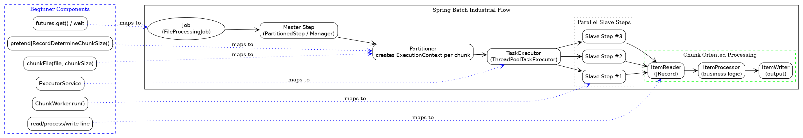

### Info

### TODO



### 🎯 Baby-goal simplified file processor

#### 1️⃣ Assumptions

| Aspect | Assumption in simplified project |
|--------|--------------------------------|
| Line validity | Every line is valid; no validation errors expected |
| Inter-line dependencies | None; lines are independent |
| Failure recovery | None; if a worker fails, the whole run fails |
| Restartability | Not supported |
| Metrics | Optional, lightweight; mainly throughput |
| Thread safety | Trivial; each worker owns its own file chunk |

---

#### 2️⃣ Responsibilities

- Split a **big file** into **N chunks** (`chunkFile`)  
- Assign each chunk to a **ChunkWorker**  
- Process chunks in parallel using a **fixed thread pool**  
- Optionally log per-worker **lines processed / progress**  
- Measure **throughput / elapsed time** to study acceleration vs chunk count and pool size  

---

#### 3️⃣ Benchmarking intent

You are explicitly targeting **performance prediction**:

| Parameter | What to test |
|-----------|--------------|
| Number of chunks | e.g., 10, 50, 100 |
| Thread pool size | e.g., 10 |
| Metrics | Wall-clock time, throughput |
| Observation | Acceleration vs number of chunks / threads |

- Expect **linear acceleration up to a point** (e.g., 10 threads + 10 chunks → ~10× speed improvement)  
- Diminishing returns as chunks increase beyond a threshold (50 → 100 chunks)  

This gives you **empirical insight** before committing to Spring Batch complexity.

---

#### 4️⃣ Advantages of freezing this version

1. **Controlled benchmark**  
   - Only parsing logic affects performance; no external Spring Batch metadata overhead  
2. **Predictable behavior**  
   - Every run is deterministic for given chunk/thread configuration  
3. **Simple tuning knobs**  
   - Adjust `chunkSize` and `poolSize` independently  
4. **Baseline for next target**  
   - Provides a “speed ceiling” reference when you eventually migrate to Spring Batch


### Usage
```sh
mvn clean package
```

```sh
java -cp target\example.metered-reader.jar;target\lib\* example.Runner -inputfile example.bin -copybookfile example.cbl -debug true -maxcount 10 | c:\tools\jq.exe "."
```
```json
{
  "CUSTOMER-ID": "AAAAAAAAAA",
  "CUSTOMER-NAME": "AAAAAAAAAAAAAAAAAAAA",
  "ACCOUNT-NUMBER": "33376",
  "ACCOUNT-TYPE": "AA",
  "OPEN-DATE": "255479",
  "BALANCE": "0.00",
  "CREDIT-LIMIT": "0.00",
  "STATUS-CODE": "A",
  "LAST-ACTIVITY-DATE": "716164",
  "RESERVED-FLAG": "A"
}
```
```sh
java -cp target\example.metered-reader.jar;target\lib\* example.Runner -inputfile example.bin -copybookfile example.cbl -maxrows 10 | c:\tools\jq.exe "[.]" | jq ".[0:10]"
```
```sh
java -cp target\example.metered-reader.jar;target\lib\* example.Runner -inputfile example.bin -copybookfile example.cbl -maxrows 1000000 -debug true 1>nul
[inputfile, copybookfile, maxrows, debug]
Processed 1000000 records in 6720 ms

```

```cmd
pushd ..\basic-jrecord-dummydata
java -cp target\example.generator.jar;target\lib\* example.Generator  -outputfile example.bin -copybookfile example.cbl -maxrows 1000
copy  /y example.bin ..\basic-jrecord-meteredreader\
popd
```
> NOTE: argument duplication
```cmd
java -cp target\example.metered-reader.jar;target\lib\* example.Runner -debug true -benchmark true -inputfile example.bin -copybookfile example.cbl -maxrows 10  -p copybookFile=example.cbl -p inputFile=example.bin -p maxRows=10
```
```text	
[inputfile, copybookfile, maxrows, p, debug, benchmark]
Run jmh benchmarks with -p copybookFile=example.cbl -p inputFile=example.bin -p maxRows=10 -r 1 -wi 1 -f 1# JMH version: 1.37
# VM version: JDK 11.0.12, OpenJDK 64-Bit Server VM, 11.0.12+7-LTS
# VM invoker: c:\java\jdk-11.0.12\bin\java.exe
# VM options: <none>
# Blackhole mode: full + dont-inline hint (auto-detected, use -Djmh.blackhole.autoDetect=false to disable)
# Warmup: 1 iterations, 200 ms each
# Measurement: 2 iterations, 1 s each
# Timeout: 10 min per iteration
# Threads: 1 thread, will synchronize iterations
# Benchmark mode: Throughput, ops/time
# Benchmark: example.utils.CopyBookReaderBenchmark.parseRecordsBencmark
# Parameters: (copybookFile = example.cbl, inputFile = example.bin, maxRows = 10, page = cp037)

# Run progress: 0.00% complete, ETA 00:00:02
# Fork: 1 of 1
# Warmup Iteration   1: 
ParseRecords copybook:example.cbl input:example.bin maxRows: 10
{"CUSTOMER-ID":"AAAAAAAAAA","CUSTOMER-NAME":"7cb08291-3","ACCOUNT-NUMBER":"48787","ACCOUNT-TYPE":"AA","OPEN-DATE":"255479","BALANCE":"819.01","CREDIT-LIMIT":"0.00","STATUS-CODE":"A","LAST-ACTIVITY-DATE":"716164","RESERVED-FLAG":"A"}
{"CUSTOMER-ID":"AAAAAAAAAA","CUSTOMER-NAME":"551b20ac-7","ACCOUNT-NUMBER":"41218","ACCOUNT-TYPE":"AA","OPEN-DATE":"255479","BALANCE":"6355.15","CREDIT-LIMIT":"0.00","STATUS-CODE":"A","LAST-ACTIVITY-DATE":"716164","RESERVED-FLAG":"A"}
{"CUSTOMER-ID":"AAAAAAAAAA","CUSTOMER-NAME":"f02588c9-8","ACCOUNT-NUMBER":"74969","ACCOUNT-TYPE":"AA","OPEN-DATE":"255479","BALANCE":"8969.51","CREDIT-LIMIT":"0.00","STATUS-CODE":"A","LAST-ACTIVITY-DATE":"716164","RESERVED-FLAG":"A"}
{"CUSTOMER-ID":"AAAAAAAAAA","CUSTOMER-NAME":"2ad7e5c0-5","ACCOUNT-NUMBER":"98190","ACCOUNT-TYPE":"AA","OPEN-DATE":"255479","BALANCE":"9605.88","CREDIT-LIMIT":"0.00","STATUS-CODE":"A","LAST-ACTIVITY-DATE":"716164","RESERVED-FLAG":"A"}
{"CUSTOMER-ID":"AAAAAAAAAA","CUSTOMER-NAME":"0c60fe4b-5","ACCOUNT-NUMBER":"62902","ACCOUNT-TYPE":"AA","OPEN-DATE":"255479","BALANCE":"6058.16","CREDIT-LIMIT":"0.00","STATUS-CODE":"A","LAST-ACTIVITY-DATE":"716164","RESERVED-FLAG":"A"}
{"CUSTOMER-ID":"AAAAAAAAAA","CUSTOMER-NAME":"709b3264-9","ACCOUNT-NUMBER":"80016","ACCOUNT-TYPE":"AA","OPEN-DATE":"255479","BALANCE":"8437.64","CREDIT-LIMIT":"0.00","STATUS-CODE":"A","LAST-ACTIVITY-DATE":"716164","RESERVED-FLAG":"A"}
{"CUSTOMER-ID":"AAAAAAAAAA","CUSTOMER-NAME":"74474550-9","ACCOUNT-NUMBER":"64728","ACCOUNT-TYPE":"AA","OPEN-DATE":"255479","BALANCE":"7783.04","CREDIT-LIMIT":"0.00","STATUS-CODE":"A","LAST-ACTIVITY-DATE":"716164","RESERVED-FLAG":"A"}
{"CUSTOMER-ID":"AAAAAAAAAA","CUSTOMER-NAME":"66685a33-f","ACCOUNT-NUMBER":"61963","ACCOUNT-TYPE":"AA","OPEN-DATE":"255479","BALANCE":"6580.04","CREDIT-LIMIT":"0.00","STATUS-CODE":"A","LAST-ACTIVITY-DATE":"716164","RESERVED-FLAG":"A"}
{"CUSTOMER-ID":"AAAAAAAAAA","CUSTOMER-NAME":"9796f1b7-4","ACCOUNT-NUMBER":"93715","ACCOUNT-TYPE":"AA","OPEN-DATE":"255479","BALANCE":"5248.93","CREDIT-LIMIT":"0.00","STATUS-CODE":"A","LAST-ACTIVITY-DATE":"716164","RESERVED-FLAG":"A"}
{"CUSTOMER-ID":"AAAAAAAAAA","CUSTOMER-NAME":"f8fd2389-d","ACCOUNT-NUMBER":"15028","ACCOUNT-TYPE":"AA","OPEN-DATE":"255479","BALANCE":"9625.82","CREDIT-LIMIT":"0.00","STATUS-CODE":"A","LAST-ACTIVITY-DATE":"716164","RESERVED-FLAG":"A"}
Processed 10 records in 128 ms
3.095 ops/s
Iteration   1: 
ParseRecords copybook:example.cbl input:example.bin maxRows: 10
{"CUSTOMER-ID":"AAAAAAAAAA","CUSTOMER-NAME":"7cb08291-3","ACCOUNT-NUMBER":"48787","ACCOUNT-TYPE":"AA","OPEN-DATE":"255479","BALANCE":"819.01","CREDIT-LIMIT":"0.00","STATUS-CODE":"A","LAST-ACTIVITY-DATE":"716164","RESERVED-FLAG":"A"}
{"CUSTOMER-ID":"AAAAAAAAAA","CUSTOMER-NAME":"551b20ac-7","ACCOUNT-NUMBER":"41218","ACCOUNT-TYPE":"AA","OPEN-DATE":"255479","BALANCE":"6355.15","CREDIT-LIMIT":"0.00","STATUS-CODE":"A","LAST-ACTIVITY-DATE":"716164","RESERVED-FLAG":"A"}
{"CUSTOMER-ID":"AAAAAAAAAA","CUSTOMER-NAME":"f02588c9-8","ACCOUNT-NUMBER":"74969","ACCOUNT-TYPE":"AA","OPEN-DATE":"255479","BALANCE":"8969.51","CREDIT-LIMIT":"0.00","STATUS-CODE":"A","LAST-ACTIVITY-DATE":"716164","RESERVED-FLAG":"A"}
{"CUSTOMER-ID":"AAAAAAAAAA","CUSTOMER-NAME":"2ad7e5c0-5","ACCOUNT-NUMBER":"98190","ACCOUNT-TYPE":"AA","OPEN-DATE":"255479","BALANCE":"9605.88","CREDIT-LIMIT":"0.00","STATUS-CODE":"A","LAST-ACTIVITY-DATE":"716164","RESERVED-FLAG":"A"}
{"CUSTOMER-ID":"AAAAAAAAAA","CUSTOMER-NAME":"0c60fe4b-5","ACCOUNT-NUMBER":"62902","ACCOUNT-TYPE":"AA","OPEN-DATE":"255479","BALANCE":"6058.16","CREDIT-LIMIT":"0.00","STATUS-CODE":"A","LAST-ACTIVITY-DATE":"716164","RESERVED-FLAG":"A"}
{"CUSTOMER-ID":"AAAAAAAAAA","CUSTOMER-NAME":"709b3264-9","ACCOUNT-NUMBER":"80016","ACCOUNT-TYPE":"AA","OPEN-DATE":"255479","BALANCE":"8437.64","CREDIT-LIMIT":"0.00","STATUS-CODE":"A","LAST-ACTIVITY-DATE":"716164","RESERVED-FLAG":"A"}
{"CUSTOMER-ID":"AAAAAAAAAA","CUSTOMER-NAME":"74474550-9","ACCOUNT-NUMBER":"64728","ACCOUNT-TYPE":"AA","OPEN-DATE":"255479","BALANCE":"7783.04","CREDIT-LIMIT":"0.00","STATUS-CODE":"A","LAST-ACTIVITY-DATE":"716164","RESERVED-FLAG":"A"}
{"CUSTOMER-ID":"AAAAAAAAAA","CUSTOMER-NAME":"66685a33-f","ACCOUNT-NUMBER":"61963","ACCOUNT-TYPE":"AA","OPEN-DATE":"255479","BALANCE":"6580.04","CREDIT-LIMIT":"0.00","STATUS-CODE":"A","LAST-ACTIVITY-DATE":"716164","RESERVED-FLAG":"A"}
{"CUSTOMER-ID":"AAAAAAAAAA","CUSTOMER-NAME":"9796f1b7-4","ACCOUNT-NUMBER":"93715","ACCOUNT-TYPE":"AA","OPEN-DATE":"255479","BALANCE":"5248.93","CREDIT-LIMIT":"0.00","STATUS-CODE":"A","LAST-ACTIVITY-DATE":"716164","RESERVED-FLAG":"A"}
{"CUSTOMER-ID":"AAAAAAAAAA","CUSTOMER-NAME":"f8fd2389-d","ACCOUNT-NUMBER":"15028","ACCOUNT-TYPE":"AA","OPEN-DATE":"255479","BALANCE":"9625.82","CREDIT-LIMIT":"0.00","STATUS-CODE":"A","LAST-ACTIVITY-DATE":"716164","RESERVED-FLAG":"A"}
Processed 10 records in 6 ms

...

Processed 10 records in 1 ms
744.146 ops/s


Result "example.utils.CopyBookReaderBenchmark.parseRecordsBencmark":
  586.196 ops/s


# Run complete. Total time: 00:00:02

REMEMBER: The numbers below are just data. To gain reusable insights, you need to follow up on
why the numbers are the way they are. Use profilers (see -prof, -lprof), design factorial
experiments, perform baseline and negative tests that provide experimental control, make sure
the benchmarking environment is safe on JVM/OS/HW level, ask for reviews from the domain experts.
Do not assume the numbers tell you what you want them to tell.

Benchmark                                     (copybookFile)  (inputFile)  (maxRows)  (page)   Mode  Cnt    Score   Error  Units
CopyBookReaderBenchmark.parseRecordsBencmark     example.cbl  example.bin         10   cp037  thrpt    2  586.196          ops/s

```
```cmd
java -Dlog4j.configurationFile=log4j-perf.xml  -cp target\example.metered-reader.jar;target\lib\* example.Runner -debug true -benchmark true -inputfile example.bin -copybookfile example.cbl -maxrows 10  -p copybookFile=example.cbl -p inputFile=example.bin -p maxRows=10
```
```text

[inputfile, copybookfile, maxrows, p, debug, benchmark]
Run jmh benchmarks with -p copybookFile=example.cbl -p inputFile=example.bin -p maxRows=10 -r 1 -wi 1 -f 1WARNING: An illegal reflective access operation has occurred
WARNING: Illegal reflective access by org.openjdk.jmh.util.Utils (file:/C:/developer/sergueik/springboot_study/basic-jrecord-meteredreader/target/lib/jmh-core-1.37.jar) to method java.io.Console.encoding()
WARNING: Please consider reporting this to the maintainers of org.openjdk.jmh.util.Utils
WARNING: Use --illegal-access=warn to enable warnings of further illegal reflective access operations
WARNING: All illegal access operations will be denied in a future release
# JMH version: 1.37
# VM version: JDK 11.0.12, OpenJDK 64-Bit Server VM, 11.0.12+7-LTS
# VM invoker: c:\java\jdk-11.0.12\bin\java.exe
# VM options: -Dlog4j.configurationFile=log4j-perf.xml
# Blackhole mode: full + dont-inline hint (auto-detected, use -Djmh.blackhole.autoDetect=false to disable)
# Warmup: 1 iterations, 200 ms each
# Measurement: 2 iterations, 1 s each
# Timeout: 10 min per iteration
# Threads: 1 thread, will synchronize iterations
# Benchmark mode: Throughput, ops/time
# Benchmark: example.utils.CopyBookReaderBenchmark.parseRecordsBencmark
# Parameters: (copybookFile = example.cbl, inputFile = example.bin, maxRows = 10, page = cp037)

# Run progress: 0.00% complete, ETA 00:00:02
# Fork: 1 of 1
# Warmup Iteration   1: 1.511 ops/s
Iteration   1: 786.283 ops/s
Iteration   2: 1998.780 ops/s


Result "example.utils.CopyBookReaderBenchmark.parseRecordsBencmark":
  1392.531 ops/s


# Run complete. Total time: 00:00:03

REMEMBER: The numbers below are just data. To gain reusable insights, you need to follow up on
why the numbers are the way they are. Use profilers (see -prof, -lprof), design factorial
experiments, perform baseline and negative tests that provide experimental control, make sure
the benchmarking environment is safe on JVM/OS/HW level, ask for reviews from the domain experts.
Do not assume the numbers tell you what you want them to tell.

Benchmark                                     (copybookFile)  (inputFile)  (maxRows)  (page)   Mode  Cnt     Score   Error  Units
CopyBookReaderBenchmark.parseRecordsBencmark     example.cbl  example.bin         10   cp037  thrpt    2  1392.531          ops/s


```


```sh
java -Dlogback.configurationFile=logback-perf.xml -cp target\example.metered-reader.jar;target\lib\* example.Runner -debug true -benchmark true -inputfile example.bin -copybookfile example.cbl -maxrows 10  -p copybookFile=example.cbl -p inputFile=example.bin -p maxRows=10

```
```text

java -Dlogback.configurationFile=logback-perf.xml -cp target\example.metered-reader.jar;target\lib\* example.Runner -debug true -benchmark true -inputfile example.bin -copybookfile example.cbl -maxrows 10  -p copybookFile=example.cbl -p inputFile=example.bin -p maxRows=10
[inputfile, copybookfile, maxrows, p, debug, benchmark]
Run jmh benchmarks with -p copybookFile=example.cbl -p inputFile=example.bin -p maxRows=10 -r 1 -wi 1 -f 1WARNING: An illegal reflective access operation has occurred
WARNING: Illegal reflective access by org.openjdk.jmh.util.Utils (file:/C:/developer/sergueik/springboot_study/basic-jrecord-meteredreader/target/lib/jmh-core-1.37.jar) to method java.io.Console.encoding()
WARNING: Please consider reporting this to the maintainers of org.openjdk.jmh.util.Utils
WARNING: Use --illegal-access=warn to enable warnings of further illegal reflective access operations
WARNING: All illegal access operations will be denied in a future release
# JMH version: 1.37
# VM version: JDK 11.0.12, OpenJDK 64-Bit Server VM, 11.0.12+7-LTS
# VM invoker: c:\java\jdk-11.0.12\bin\java.exe
# VM options: -Dlogback.configurationFile=logback-perf.xml
# Blackhole mode: full + dont-inline hint (auto-detected, use -Djmh.blackhole.autoDetect=false to disable)
# Warmup: 1 iterations, 200 ms each
# Measurement: 2 iterations, 1 s each
# Timeout: 10 min per iteration
# Threads: 1 thread, will synchronize iterations
# Benchmark mode: Throughput, ops/time
# Benchmark: example.utils.CopyBookReaderBenchmark.parseRecordsBencmark
# Parameters: (copybookFile = example.cbl, inputFile = example.bin, maxRows = 10, page = cp037)

# Run progress: 0.00% complete, ETA 00:00:02
# Fork: 1 of 1
# Warmup Iteration   1: 1.917 ops/s
Iteration   1: 516.887 ops/s
Iteration   2: 963.301 ops/s


Result "example.utils.CopyBookReaderBenchmark.parseRecordsBencmark":
  740.094 ops/s


# Run complete. Total time: 00:00:02

REMEMBER: The numbers below are just data. To gain reusable insights, you need to follow up on
why the numbers are the way they are. Use profilers (see -prof, -lprof), design factorial
experiments, perform baseline and negative tests that provide experimental control, make sure
the benchmarking environment is safe on JVM/OS/HW level, ask for reviews from the domain experts.
Do not assume the numbers tell you what you want them to tell.

Benchmark                                     (copybookFile)  (inputFile)  (maxRows)  (page)   Mode  Cnt    Score   Error  Units
CopyBookReaderBenchmark.parseRecordsBencmark     example.cbl  example.bin         10   cp037  thrpt    2  740.094          ops/s
```
### NOTE


So your output:

ParseRecords copybook:example.cbl ...
Processed 10 records in 6 ms
... hundreds of times


means:

__JMH___ is invoking your @Benchmark method in a loop to gather statistically meaningful timing data.

This is intentional and required for accuracy.

By default JMH uses time-based iterations, not count-based.

Each iteration runs for about 1 second (default):
### Cons Pros
## Hot-Path vs End-to-End Spring Batch Benchmarking

When benchmarking a system with Spring Batch and jRecord parsing, there are **two main approaches**, each with distinct trade-offs.

### 1️⃣ Hot-Path / Microbenchmark

**Goal:** Measure the actual work you care about (e.g., jRecord parsing) as cleanly as possible.

**Characteristics:**
- Calls only the **core method(s)** (`CopyBookReader.parseRecord`)
- Uses **in-memory input**, minimal setup
- Can be parallelized easily (ExecutorService / ForkJoinPool / Spring Batch Step TaskExecutor)
- Logging silenced → no noisy output
- JMH-friendly: iterations, warmup, forks controlled

**Advantages:**
- Measures **true acceleration** from chunking, multi-threading, or code changes
- Results are reproducible and interpretable
- Lightweight: no Spring Batch or DB overhead
- Faster iterations → quicker tuning and experimentation

**Challenges:**
- Not “realistic” end-to-end: ignores Spring Batch infrastructure
- No insight into framework-induced delays, transaction commits, or listeners
- May be dismissed by some developers as “not the full job”

**When to use:** To optimize and compare **algorithmic improvements** or parallelization effects.

---

### 2️⃣ End-to-End / Job Benchmark

**Goal:** Measure performance of **the full Spring Batch Job**, including all Steps, readers, writers, and infrastructure.

**Characteristics:**
- Uses Spring Boot / Spring Batch context, JobLauncher, JobRepository, StepExecution
- Might include in-memory or DB-based readers/writers
- Parallel execution controlled via TaskExecutor in Steps
- Logging may be suppressed for clarity

**Advantages:**
- Shows **realistic throughput** in production-like scenario
- Includes framework overhead, so results represent what users actually experience
- Good for **capacity planning**

**Challenges:**
- High overhead: Spring Batch setup, context initialization, listeners, commit operations dominate runtime
- Harder to isolate improvements in the “hot path”
- Slow iterations → slower JMH benchmarking
- Results are noisier, harder to attribute to a single change
- Requires careful configuration to silence logging and avoid extra I/O

**When to use:** To benchmark **end-to-end job performance** or **validate production throughput**, after microbenchmarks are stable.

---

### 🔹 Summary Table

| Aspect | Hot-path | End-to-end job |
|--------|----------|----------------|
| What is measured | Core processing / algorithm | Full Spring Batch execution |
| Overhead | Minimal | Significant (Step, JobLauncher, listeners) |
| Reproducibility | High | Medium |
| Iteration speed | Fast | Slow |
| Insights | Pure acceleration | Realistic throughput |
| Complexity | Low | High |

---

### ✅ Practical approach

1. **Start with hot-path benchmark** to tune the core jRecord logic and parallel chunk processing.
2. **Optionally run end-to-end job benchmark** to see how framework overhead affects actual throughput.
3. **Document both** — it’s very persuasive:
   - “raw acceleration = X ops/sec, full job throughput = Y ops/sec”

> Essentially, **hot-path is usually the winner** for understanding performance improvements.
> End-to-end benchmarks are more for validation and real-world context.

### Bottom Line
JobLauncher is the library interface for starting a Spring Batch Job.

You cannot call jobLauncher.run() meaningfully without a Spring context containing the Job and Step beans.

In a JMH benchmark:

Initialize Spring context once:
```java
@Setup(Level.Trial)
public void setup() {
    context = new AnnotationConfigApplicationContext();
    context.register(BatchConfig.class); // your Job/Step beans
    context.refresh();

    jobLauncher = context.getBean(JobLauncher.class);
    job = context.getBean(Job.class);
}
```
Fetch JobLauncher and Job beans.  Benchmark calls:
```java
@Benchmark
public void runFullJob() throws Exception {
    jobLauncher.run(job, params);
}
```
Close context after all iterations:
```java
@TearDown(Level.Trial)
public void tearDown() {
   context.close();
}
```

If one is calling Spring Batch code without a context:

  * There is no `JobLauncher` bean
  * There is no `JobRepository`, `StepExecution`, or `Step` beans
  * Calling `new SimpleJobLauncher()` manually is possible, but one will need to manually configure the `JobRepository`, `PlatformTransactionManager`, etc. — essentially re-implementing the Spring Batch plumbing.

Spring Batch is not a standalone process. It runs inside a Spring context. Normally you get JobLauncher by:
```java
@Autowired
private JobLauncher jobLauncher;

@Autowired
private Job job;
```

or via manual context setup:

```java
AnnotationConfigApplicationContext context = new AnnotationConfigApplicationContext();
context.register(BatchConfig.class); // your @Configuration with Job/Step beans
context.refresh();
```
## 🔑 Concise Ranking Table (Key Arguments Only)

| Criterion | **#1 Console App (CLI + Threads + Chunks)** | **#2 Spring CommandLineRunner (wraps #1)** | **#3 Spring Batch Job** |
|----------|---------------------------------------------|---------------------------------------------|--------------------------|
| Control of chunk & thread parameters | ⭐⭐⭐ **Full, direct** | ⭐⭐⭐ **Same as #1** | ⭐ Framework-controlled |
| Code reuse from baseline | ⭐ Native | ⭐ Full reuse | ❌ Rewrite required |
| Framework in hot path | ❌ None | ❌ None | ✅ Yes |
| Validity of JMH performance findings | ⭐⭐⭐ Strong | ⭐⭐⭐ Strong | ⭐ Weak / assumed |
| Effort vs performance insight | ⭐⭐⭐ Best ROI | ⭐⭐ Good | ⭐ Low ROI |
| Risk of fighting the framework | ❌ None | ❌ None | ⭐ High |

---

## 🏆 Final Ranking (by stated priorities)

1. **#1 Console App** – baseline & performance lab
2. **#2 Spring CommandLineRunner** – same engine, better wiring
3. **#3 Spring Batch** – different engine, uncertain carryover

---

## 🧠 One-paragraph takeaway

The console implementation (#1) allows direct control of chunking and threading and is therefore the most reliable environment for discovering performance gains with JMH. These gains transfer trivially to the Spring CommandLineRunner variant (#2) because the same code path is reused. In contrast, Spring Batch (#3) enforces its own execution model, requires rewriting the core loop, and makes performance improvements only “expected to hold” rather than demonstrably reproducible.


### See Also:

 
 * [cb2xml](https://github.com/bmTas/cb2xml)
 * [JRecord](https://github.com/bmTas/JRecord)
 * [CobolToJson](https://github.com/bmTas/CobolToJson)
 * [Sourceforge download](https://sourceforge.net/projects/coboltojson/) convert cobol Data Files to JSON
 * [Sourceforge download](https://sourceforge.net/projects/jrecord/files/JRecord/0.93.3/JRecord-0.93.3-src.zip/download) of JRecord jar bundle (old version)
 * [sourceforge project](https://sourceforge.net/projects/jrecord/) 
 * [JRecord Wiki](https://sourceforge.net/p/jrecord/wiki/Home/)
 * [JRecord Discussion](https://sourceforge.net/p/jrecord/discussion/)

---
### Author
[Serguei Kouzmine](kouzmine_serguei@yahoo.com)
