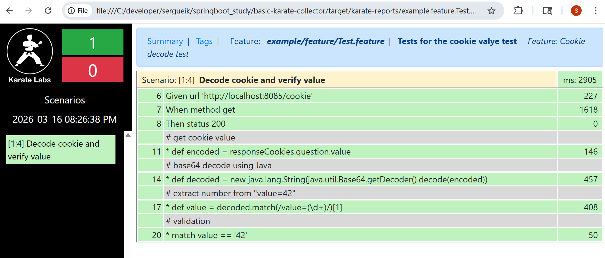

### Info

Assume there is a dummy server running on `8085` responding to a `GET` request of `/cookie` with a `200` and a cookie `question: value=42`	

```sh
pushd app 
mvn -DskipTests -nptB spring-boot:run
```

```text
2026-03-16 20:14:28.896  INFO 16652 --- [           main] o.s.s.concurrent.ThreadPoolTaskExecutor  : Initializing ExecutorService 'applicationTaskExecutor'
2026-03-16 20:14:29.067  INFO 16652 --- [           main] o.s.b.w.embedded.tomcat.TomcatWebServer  : Tomcat started on port(s): 8085 (http) with context path ''
2026-03-16 20:14:29.077  INFO 16652 --- [           main] example.Application                      : Started Application in 1.99 seconds (JVM running for 2.448)
2026-03-16 20:16:15.137  INFO 16652 --- [nio-8085-exec-1] o.a.c.c.C.[Tomcat].[localhost].[/]       : Initializing Spring DispatcherServlet 'dispatcherServlet'
2026-03-16 20:16:15.138  INFO 16652 --- [nio-8085-exec-1] o.s.web.servlet.DispatcherServlet        : Initializing Servlet 'dispatcherServlet'
2026-03-16 20:16:15.145  INFO 16652 --- [nio-8085-exec-1] o.s.web.servlet.DispatcherServlet        : Completed initialization in 7 ms
2026-03-16 20:16:15.164  INFO 16652 --- [nio-8085-exec-1] example.controller.CookieController      : data: value=42/dmFsdWU9NDI=
```

```sh
curl -sv http://localhost:8085/cookie
```

```text
< HTTP/1.1 200

< Set-Cookie: question=dmFsdWU9NDI=; Path=/; Domain=localhost; Max-Age=86400; Expires=Wed, 18 Mar 2026 00:16:15 GMT; Secure; HttpOnly
< Content-Length: 0
< Date: Tue, 17 Mar 2026 00:16:15 GMT
<
* Connection #0 to host localhost left intact
```


The [Karate](https://github.com/karatelabs/karate/wiki/Get-Started) test will execute a Karate feature script performing this request, collecting the cookie named "question", base64-decoding it, 
and extracting the value using the regexp "value="
then considering the scenario a success if the value is equal to 42

The feature file will look like this:
```cucumber
Feature: Cookie decode test

  Scenario: Decode cookie and verify value

    Given url 'http://localhost:8085/cookie'
    When method get
    Then status 200

    # get cookie value
    * def encoded = responseCookies.question.value

    # base64 decode using Java
    * def decoded = new java.lang.String(java.util.Base64.getDecoder().decode(encoded))

    # extract number from "value=42"
    * def value = decoded.match(/value=(\\d+)/)[1]

    # validation
    * match value == '42'
```
there is also a dummy Java class 'ExampleTest.java':

```java

package example;

import com.intuit.karate.junit5.Karate;

public class ExampleTest {

  @Karate.Test
  Karate testUi() 
          return Karate.run("classpath:example/feature/Test.feature");
  }
}

```

the test can be run like

```sh
mvn -ntp -B test
```
this will print to the console

```text

---------------------------------------------------------
feature: classpath:example/feature/Test.feature
scenarios:  1 | passed:  1 | failed:  0 | time: 1.6395
---------------------------------------------------------

Karate version: 1.4.1
======================================================
elapsed:   6.14 | threads:    1 | thread time: 1.64
features:     1 | skipped:    0 | efficiency: 0.27
scenarios:    1 | passed:     1 | failed: 0
======================================================

HTML report: (paste into browser to view) | Karate version: 1.4.1

file:///C:/developer/sergueik/springboot\_study/basic-karate-collector/target/karate-reports/karate-summary.html
===================================================================
```
this produces `target/karate-reports`:

```text
target/karate-reports/
├── example.feature.Test.html
├── example.feature.Test.karate-json.txt
├── favicon.ico
├── karate-labs-logo-ring.svg
├── karate-logo.png
├── karate-logo.svg
├── karate-summary.html
├── karate-summary-json.txt
├── karate-tags.html
├── karate-timeline.html
└── res
    ├── bootstrap.min.css
    ├── bootstrap.min.js
    ├── jquery.min.js
    ├── jquery.tablesorter.min.js
    ├── karate-report.css
    ├── karate-report.js
    ├── vis.min.css
    └── vis.min.js
```
The result looks like

```cmd
"c:\\Program Files\\Google\\Chrome\\Application\\chrome.exe" -url file:///C:/developer/sergueik/springboot\_study/basic-karate-collector/target/karate-reports/karate-summary.html
```

```sh
google-chrome -url file://$(pwd)/target/karate-reports/karate-summary.html \&
```



Alternatively one can run

```sh
./karate.sh src/test/java/example/feature/Test.feature
```

```cmd
karate.bat src\test\java\example\feature\Test.feature
```
or

```sh
docker pull maven:3.9.3-eclipse-temurin-11-alpine
IMAGE=basic-karate-jdk11-maven
docker build -t $IMAGE .
```

```sh
docker container rm -f $IMAGE
docker run -d --name $IMAGE $IMAGE
docker cp $IMAGE:/work/target target
```

```sh
jq ".featureSummary[0].failedCount" target\karate-reports\karate-summary-json.txt
```
which will give

```text
0
```

### Background

Karate is an open-source API, performance, and UI test automation framework built on Java and JavaScript, yet designed to remove the entry barriers of either language. It uniquely integrates API testing, UI automation, scientifically accurate performance testing (via Gatling), and service virtualization (mocking) into a single cohesive tool. Inspired by Cucumber, Karate employs a simple Gherkin - based syntax (`.feature` files) reminiscent of early BDD DSLs independently found in the Ruby ecosystem (`spec` files).
Karate feature files achieve the same goals that spec-driven frameworks in Ruby, Puppet, or InSpec do: tests are understandable and even writable by domain experts without Java or JavaScript experience, making automation accessible.

Karate should not be viewed as Cucumber under a different brand, but rather as a specialized toolset designed specifically for API testing.

In the API testing domain, Karate deliberately abandons Cucumber’s full flexibility in favor of a “simple English,” precise scenario subset of Gherkin`

This leads to another advantage: Karate keeps HTTP requests, data and test logic in a single script, with optional embedded JavaScript for more complex scenarios, improving readability and maintainability

```cucumber
* def payload =
"""
{
  sub: 'test-user',
  role: 'admin',
  iss: 'test-suite'
}
"""

* def secret = 'dummy-secret'

* def token = karate.jwtSign(payload, secret)

Given url 'https://httpbin.org/something'
And header Authorization = 'Bearer ' + token
When method get
Then status 200
```
or
```cucumber
Feature: Inline JWT generation demo

Scenario: create a fake JWT with inline JS
    # define payload
    * def payload = { sub: 'test-user', role: 'admin', iss: 'karate-demo' }

    # inline JS function to make a fake JWT
    * def makeJwt =
    """
    function(payload){
        function base64Encode(obj){
            return java.util.Base64.getUrlEncoder().withoutPadding().encodeToString(JSON.stringify(obj).getBytes('UTF-8'));
        }
        var header = { alg: 'HS256', typ: 'JWT' };
        var token = base64Encode(header) + '.' + base64Encode(payload) + '.fake-signature';
        return token;
    }
    """

    # generate the token
    * def token = makeJwt(payload)

    # just print for demo
    * print 'JWT:', token
```
*longer version*:

Karate makes an important sacrifice by dropping Cucumber’s full flexibilityi — originally valuable for acceptance tests describing complex user journeys — in favor of a precise “simple-English” subset of the Gherkin language that aligns naturally with REST API testing
This fully eliminates the need for boilerplate Java "step definitions" plumbing code:

```cucumber
@userStory("U02")
Feature: Login and Logout

  @scenarioID("U02-TS01")
  Scenario: Login with valid credentials
    When the user logs in with username "john" and password "secret123"
    Then the login should succeed
```
```java
   private String username;
    private String password;
    private boolean loginResult;

    @When("^the user logs in with username \"([^\"]*)\" and password \"([^\"]*)\"$")
    public void login_with_credentials(String username, String password) throws Throwable {
        this.username = username;
...
```
* Karate equivalent - note: the regex step-definition plumbing is gone

```
Scenario: Login with valid credentials
  Given url baseUrl + '/login'
  And request { username: 'john', password: 'secret123' }
  When method post
  Then status 200
```
making tests concise, readable, and maintainable without sacrificing clarity or expressiveness.
For UI automation, Karate extends into Selenium-like capabilities, providing a DSL for waits, captures, Shadow DOM, iframe handling, file uploads/downloads, and visual verifications. This addresses all major modern web UI testing needs, from dynamic content synchronization to complex DOM manipulations, offering a comprehensive, low-code solution for both API and UI testing. 

These features place Karate in the same league as advanced JavaScript-based frameworks like 
* Playwright
* Cypress
* TestCafe
* WebDriverIO

but they also make it a clear productivity winner over classic pure Selenium, by reducing boilerplate, simplifying test maintenance, and providing richer built-in support for modern web UI challenges.


Another standout aspect is Karate’s HTML page tree-view for step results and debugging, providing instant, clear, hierarchical visibility into every test step — a level of clarity and maintainability that most modern frameworks do not offer

To get similar functionality with tools like TestNG, SpecFlow, Cucumber, or Selenium, teams typically add external reporting add‑ons that require setup, configuration, and often build tool/plugin work:
* Allure Report – requires explicit setup
* ExtentReports
Combined with its scientifically accurate performance testing, Karate offers a complete, low-code automation ecosystem that is robust, accessible, and highly recognized by its community.

### See Also

  * [REST API Testing with Karate](https://www.baeldung.com/karate-rest-api-testing)
  * standalne karate.jar [download](https://github.com/karatelabs/karate/tree/master/karate-netty#standalone-jar)
  * running karate standalone executable JAR (50 MB) which only requires a JRE to run, without maven or gradle [documentation](https://github.com/karatelabs/karate/blob/master/karate-netty/README.md)
  * [Skipping Tests With Gradle](https://www.baeldung.com/gradle-skip-tests)
  * https://github.com/fertekton/karate-api/blob/main/src/test/java/Yevo/BackEndTests.java
  * https://stackoverflow.com/questions/53272230/could-not-create-service-of-type-scriptpluginfactory-using-buildscopeservices-cr
  * https://github.com/gradle/gradle/issues/8436
  * https://github.com/figroc/tensorflow-serving-client/issues/11
  * [docker image](https://hub.docker.com/r/ptrthomas/karate-chrome) with X server (XVFB), VNC, Google Chrome
  * [jenkins cucumber reports plugin](https://plugins.jenkins.io/cucumber-reports/)
  * [Karate and Cucumber Frameworks: A Comparative Study](https://milestone.tech/tips-and-tricks/karate-framework-and-cucumber-framework-a-comparative-study)


### Author
[Serguei Kouzmine](kouzmine\_serguei@yahoo.com)


