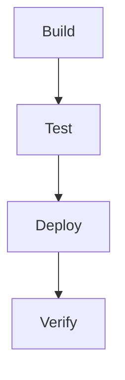
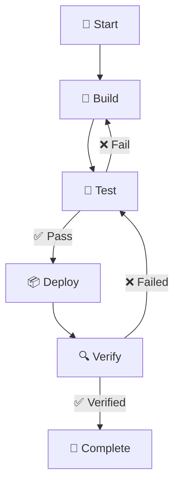

> NOTE
Markdown is not a document editor. Mermaid is not a drawing program. Both are descriptions of things that another tool renders.

Need	Author with
Narrative / documentation	Markdown
Lists of things	Markdown
Structured comparison	Markdown table
Code/configuration	Markdown fenced code
Process / sequence	Mermaid
More complicated visual model	Mermaid, later


Markdown source                    Rendered document

# Deployment Process          →    Deployment Process

1. Build the application      →    1. Build the application
2. Run tests                       2. Run tests
3. Deploy to staging               3. Deploy to staging
4. Verify                          4. Verify


| Step | Owner | Status |      →    ┌──────┬───────┬────────┐
|------|------- |--------|           │ Step │ Owner │ Status │
| Build| Dev   | Done   |           ├──────┼───────┼────────┤

...

#### Bad Table(renders verbatim)
| Step | Owner | Status |
|------|-- ----- |--------  |
| Build| Dev   | Done   | 

#### Fixed Table

| Step  | Owner | Status |
|-------|-------|--------|
| Build | Dev   | Done   |

```code
| Status | Meaning |
|--------|---------|
| 🟢 | Ready |
| 🟡 | In progress |
| 🔴 | Blocked |
```

| Status | Meaning |
|--------|---------|
| 🟢 | Ready |
| 🟡 | In progress |
| 🔴 | Blocked |


> NOTE If an emoji appears black-and-white in the editor, this does not mean the Markdown is wrong. Emoji are Unicode characters; their visual appearance depends on the font and rendering application. A browser is usually a better place to experiment with them than a basic text editor.


* [Dillinger — Online Markdown Editor](https://dillinger.io)
* [Mermaid Live Editor](https://mermaid.live/)
* [Unicode Full Emoji List](https://unicode.org/emoji/charts/full-emoji-list.html
* [Markdown Guide — Basic Syntax](https://www.markdownguide.org/basic-syntax)
* [Markdown Guide — Extended Syntax](https://www.markdownguide.org/extended-syntax/)


### Flow Charts 

* this is done by mmemrmaid. Github renders it navitely, but dillinger does not.

```code
flowchart TD
    A[Build] --> B[Test]
    B --> C[Deploy]
    C --> D[Verify]
```


```code
flowchart TD
    A[🚀 Start] --> B[🔨 Build]
    B --> C[🧪 Test]

    C -->|✅ Pass| D[📦 Deploy]
    C -->|❌ Fail| B

    D --> E[🔍 Verify]
    E -->|✅ Verified| F[🎉 Complete]
    E -->|❌ Failed| C
```




Emoji in node labels — 🚀, 🔨, 🧪, etc.
Named connectors — |✅ Pass| and |❌ Fail|
A feedback loop — failed tests return to Build
A second decision/feedback path — failed verification returns to Test
A normal forward path — Build → Test → Deploy → Verify → Complete

The visual story is also immediately understandable:
```code
              ┌──────────────┐
              │   🔨 Build   │◄──────────┐
              └──────┬───────┘           │
                     │                   │
                     ▼                   │
              ┌──────────────┐           │
              │   🧪 Test    │           │
              └───┬──────┬───┘           │
            ❌ Fail   │   ✅ Pass         │
                  └───┘       │           │
                              ▼           │
                       📦 Deploy          │
                           │              │
                           ▼              │
                       🔍 Verify ─────────┘
                           │
                           ▼
                      🎉 Complete
```
I think this is a much better second example than introducing several Mermaid diagram types. 
It gives the engineers their first glimpse of the important idea that Mermaid isn't merely "boxes connected by arrows": the connections themselves can carry meaning.

For the tutorial, I'd have them paste the code into Mermaid Live Editor and then deliberately change ❌ Fail to something like ⚠️ Retry, or change the loop target. That makes the editor immediately interactive rather than just another documentation link.

Ad
