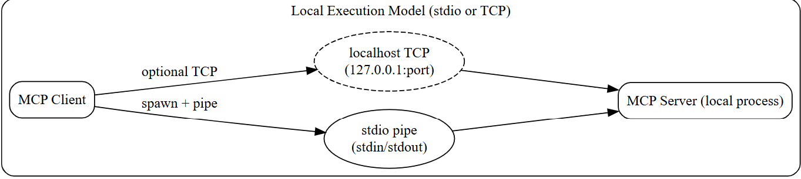
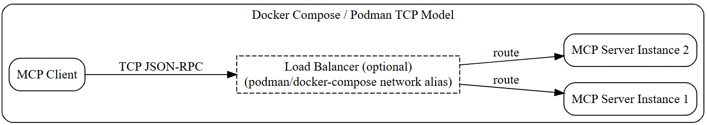

### Info

### Usage





#### Docker

```sh
IMAGE=python:3.11-slim
docker pull $IMAGE
```

```sh

docker-compose up --build -d
```
```sh
docker-compose ps
```
```text
   Name            Command             State               Ports
-------------------------------------------------------------------------
mcp-client   python mcp_client.py   Exit 0
mcp-server   python mcp_server.py   Up (healthy)   0.0.0.0:9000->9000/tcp
```

```sh
docker-compose logs -f mcp-client | cut -f 2 -d '|'
```
```txt
Attaching to mcp-client
 2026-04-15 22:11:08,588 | INFO | SEND [initialize] id=1 payload={'jsonrpc': '2.0', 'id': 1, 'method': 'initialize'}
 2026-04-15 22:11:08,590 | INFO | RECV id=1 time=0.72ms response={'jsonrpc': '2.0', 'id': 1, 'result': {'status': 'ok', 'server': 'mcp-lab'}}
 {'jsonrpc': '2.0', 'id': 1, 'result': {'status': 'ok', 'server': 'mcp-lab'}}
 2026-04-15 22:11:08,591 | INFO | SEND [tools/list] id=2 payload={'jsonrpc': '2.0', 'id': 2, 'method': 'tools/list'}
 2026-04-15 22:11:08,592 | INFO | RECV id=2 time=0.46ms response={'jsonrpc': '2.0', 'id': 2, 'result': {'tools': [{'name': 'echo', 'description': 'Echo input text'}, {'name': 'uppercase', 'description': 'Uppercase text'}]}}
 2026-04-15 22:11:08,592 | INFO | Available tools: ['echo', 'uppercase']
 2026-04-15 22:11:08,592 | INFO | SEND [tools/call] id=3 payload={'jsonrpc': '2.0', 'id': 3, 'method': 'tools/call', 'params': {'name': 'echo', 'arguments': {'text': 'hello from docker network'}}}
 2026-04-15 22:11:08,593 | INFO | RECV id=3 time=0.32ms response={'jsonrpc': '2.0', 'id': 3, 'result': {'content': 'hello from docker network'}}
 {'jsonrpc': '2.0', 'id': 3, 'result': {'content': 'hello from docker network'}}
 2026-04-15 22:11:08,594 | INFO | echo result: None
mcp-client exited with code 0
```
```sh
docker-compose run mcp-client --method echo
```
```text
Starting mcp-server ... done
2026-04-15 23:13:49,420 | INFO | SEND [initialize] id=1 payload={'jsonrpc': '2.0', 'id': 1, 'method': 'initialize'}
2026-04-15 23:13:49,423 | INFO | RECV id=1 time=0.24ms response={'jsonrpc': '2.0', 'id': 1, 'result': {'status': 'ok', 'server': 'mcp-lab'}}
{'jsonrpc': '2.0', 'id': 1, 'result': {'status': 'ok', 'server': 'mcp-lab'}}
2026-04-15 23:13:49,425 | INFO | SEND [tools/list] id=2 payload={'jsonrpc': '2.0', 'id': 2, 'method': 'tools/list'}
2026-04-15 23:13:49,427 | INFO | RECV id=2 time=0.23ms response={'jsonrpc': '2.0', 'id': 2, 'result': {'tools': [{'name': 'echo', 'description': 'Echo input text'}, {'name': 'uppercase', 'description': 'Uppercase text'}]}}
2026-04-15 23:13:49,429 | INFO | Available tools: ['echo', 'uppercase']
2026-04-15 23:13:49,430 | INFO | SEND [tools/call] id=3 payload={'jsonrpc': '2.0', 'id': 3, 'method': 'tools/call', 'params': {'name': 'echo', 'arguments': {'text': 'hello from docker network'}}}
2026-04docker-compose run mcp-client --method echo
```
```text
Starting mcp-server ... done
2026-04-15 23:13:49,420 | INFO | SEND [initialize] id=1 payload={'jsonrpc': '2.0', 'id': 1, 'method': 'initialize'}
2026-04-15 23:13:49,423 | INFO | RECV id=1 time=0.24ms response={'jsonrpc': '2.0', 'id': 1, 'result': {'status': 'ok', 'server': 'mcp-lab'}}
{'jsonrpc': '2.0', 'id': 1, 'result': {'status': 'ok', 'server': 'mcp-lab'}}
2026-04-15 23:13:49,425 | INFO | SEND [tools/list] id=2 payload={'jsonrpc': '2.0', 'id': 2, 'method': 'tools/list'}
2026-04-15 23:13:49,427 | INFO | RECV id=2 time=0.23ms response={'jsonrpc': '2.0', 'id': 2, 'result': {'tools': [{'name': 'echo', 'description': 'Echo input text'}, {'name': 'uppercase', 'description': 'Uppercase text'}]}}
2026-04-15 23:13:49,429 | INFO | Available tools: ['echo', 'uppercase']
2026-04-15 23:13:49,430 | INFO | SEND [tools/call] id=3 payload={'jsonrpc': '2.0', 'id': 3, 'method': 'tools/call', 'params': {'name': 'echo', 'arguments': {'text': 'hello from docker network'}}}
2026-04-15 23:13:49,432 | INFO | RECV id=3 time=0.64ms response={'jsonrpc': '2.0', 'id': 3, 'result': {'content': 'hello from docker network'}}
2026-04-15 23:13:49,434 | INFO | echo response content: hello from docker network

-15 23:13:49,432 | INFO | RECV id=3 time=0.64ms response={'jsonrpc': '2.0', 'id': 3, 'result': {'content': 'hello from docker network'}}
2026-04-15 23:13:49,434 | INFO | echo response content: hello from docker network

```

#### Windows

Launch two cmd shells with the commands

```cmd
chcp 65001
set PYTHONIOENCODING=utf-8
set MCP_BIND=127.0.0.1
set MCP_PORT=9000
pushd app1
python.exe mcp_server.py
```
```cmd
chcp 65001
set PYTHONIOENCODING=utf-8
set MCP_BIND=127.0.0.1
set MCP_PORT=9000
pushd app2
python.exe mcp_client.py
```
the server console log will show
```text
[server] listening on 127.0.0.1:9000
[server] client: ('127.0.0.1', 65098)
```

the client console log will show
```text
Attaching to mcp-client
 2026-04-15 22:20:49,557 | INFO | SEND [initialize] id=1 payload={'jsonrpc': '2.0', 'id': 1, 'method': 'initialize'}
 2026-04-15 22:20:49,558 | INFO | RECV id=1 time=0.54ms response={'jsonrpc': '2.0', 'id': 1, 'result': {'status': 'ok', 'server': 'mcp-lab'}}
 {'jsonrpc': '2.0', 'id': 1, 'result': {'status': 'ok', 'server': 'mcp-lab'}}
 2026-04-15 22:20:49,559 | INFO | SEND [tools/list] id=2 payload={'jsonrpc': '2.0', 'id': 2, 'method': 'tools/list'}
 2026-04-15 22:20:49,560 | INFO | RECV id=2 time=0.38ms response={'jsonrpc': '2.0', 'id': 2, 'result': {'tools': [{'name': 'echo', 'description': 'Echo input text'}, {'name': 'uppercase', 'description': 'Uppercase text'}]}}
 2026-04-15 22:20:49,560 | INFO | Available tools: ['echo', 'uppercase']
 2026-04-15 22:20:49,561 | INFO | SEND [tools/call] id=3 payload={'jsonrpc': '2.0', 'id': 3, 'method': 'tools/call', 'params': {'name': 'echo', 'arguments': {'text': 'hello from docker network'}}}
 2026-04-15 22:20:49,562 | INFO | RECV id=3 time=0.53ms response={'jsonrpc': '2.0', 'id': 3, 'result': {'content': 'hello from docker network'}}
 2026-04-15 22:20:49,562 | INFO | response content: hello from docker network

```

```cmd
python.exe mcp_client.py
```
```text
usage: mcp_client.py [-h] [--method METHOD] [--debug]

options:
  -h, --help            show this help message and exit
  --method METHOD, -m METHOD
                        method to call
  --debug, -d           debug
```
```cmd
python.exe mcp_client.py  --method echo
```
```text
2026-04-15 18:42:46,532 | INFO | SEND [initialize] id=1 payload={'jsonrpc': '2.0', 'id': 1, 'method': 'initialize'}
2026-04-15 18:42:46,533 | INFO | RECV id=1 time=1.23ms response={'jsonrpc': '2.0', 'id': 1, 'result': {'status': 'ok', 'server': 'mcp-lab'}}
{'jsonrpc': '2.0', 'id': 1, 'result': {'status': 'ok', 'server': 'mcp-lab'}}
2026-04-15 18:42:46,534 | INFO | SEND [tools/list] id=2 payload={'jsonrpc': '2.0', 'id': 2, 'method': 'tools/list'}
2026-04-15 18:42:46,535 | INFO | RECV id=2 time=0.00ms response={'jsonrpc': '2.0', 'id': 2, 'result': {'tools': [{'name': 'echo', 'description': 'Echo input text'}, {'name': 'uppercase', 'description': 'Uppercase text'}]}}
2026-04-15 18:42:46,535 | INFO | Available tools: ['echo', 'uppercase']
2026-04-15 18:42:46,535 | INFO | SEND [tools/call] id=3 payload={'jsonrpc': '2.0', 'id': 3, 'method': 'tools/call', 'params': {'name': 'echo', 'arguments': {'text': 'hello from docker network'}}}
2026-04-15 18:42:46,535 | INFO | RECV id=3 time=0.00ms response={'jsonrpc': '2.0', 'id': 3, 'result': {'content': 'hello from docker network'}}
2026-04-15 18:42:46,536 | INFO | response content: hello from docker network

```

```cmd
python.exe mcp_client.py  --method ops
```
```text
2026-04-15 18:47:09,105 | INFO | SEND [initialize] id=1 payload={'jsonrpc': '2.0', 'id': 1, 'method': 'initialize'}
2026-04-15 18:47:09,106 | INFO | RECV id=1 time=0.00ms response={'jsonrpc': '2.0', 'id': 1, 'result': {'status': 'ok', 'server': 'mcp-lab'}}
{'jsonrpc': '2.0', 'id': 1, 'result': {'status': 'ok', 'server': 'mcp-lab'}}
2026-04-15 18:47:09,109 | INFO | SEND [tools/list] id=2 payload={'jsonrpc': '2.0', 'id': 2, 'method': 'tools/list'}
2026-04-15 18:47:09,109 | INFO | RECV id=2 time=0.00ms response={'jsonrpc': '2.0', 'id': 2, 'result': {'tools': [{'name': 'echo', 'description': 'Echo input text'}, {'name': 'uppercase', 'description': 'Uppercase text'}]}}
2026-04-15 18:47:09,109 | INFO | Available tools: ['echo', 'uppercase']
2026-04-15 18:47:09,110 | ERROR | Required tool method "ops" is NOT available — exiting

```
### What Gain with `jsonschema`

It lets one validate MCP tool calls like:
```python
schema = {
    "type": "object",
    "properties": {
        "text": {"type": "string"}
    },
    "required": ["text"]
}
```
```python
jsonschema.validate(instance=args, schema=schema)
```
So instead of blind trust:
```python
{'arguments': {'text': '...'}}
```
the client can enforce structure.

### MCP Transport Note

1. What transport means
Transport = how JSON-RPC messages move between client and server.

Protocol layer:
  - JSON-RPC methods (initialize, tools/list, tools/call)

Transport layer:
  - mechanism that carries those messages (stdio, HTTP, etc.)

---

2. Common MCP transports

A) stdio transport
- Client spawns server process
- Communication via stdin/stdout

Pros:
- simplest
- no networking
- great for CLI + Docker + local agents

Cons:
- 1:1 client-server process model
- harder to debug interactively

---

B) HTTP / SSE transport
- JSON-RPC over HTTP or Server-Sent Events

Pros:
- network accessible
- scalable
- multi-client capable

Cons:
- more complexity
- auth + latency overhead

---

C) WebSocket transport
- full duplex JSON-RPC stream

Pros:
- real-time interaction
- bidirectional streaming

Cons:
- lifecycle + reconnect complexity

---

D) Docker / container transport (your setup)
- still fundamentally stdio transport
- container just isolates runtime

Flow:
  client → docker stdio → server → JSON-RPC → response

---

3. Key behavior from your log

- initialize → OK handshake
- tools/list → dynamic discovery
- tools/call → synchronous execution

Result:
✔ protocol works correctly
✔ tool registry is dynamic
✔ transport is stable
✔ latency is extremely low

---

4. Architecture insight

You effectively built:

Client
  ↓ JSON-RPC
Transport layer (stdio / docker / pipes)
  ↓
Tool runtime (echo, uppercase, etc.)

Transport is replaceable without changing tools or protocol.

---

5. Why this matters

- clean separation of protocol vs transport
- same model as LSP / agent runtimes
- Docker does not break RPC semantics
- enables future swap: stdio → HTTP without refactoring tools

---

6. Current takeaway

Your system already demonstrates:
✔ tool registry introspection
✔ RPC-style execution
✔ transport abstraction
✔ container isolation compatibility
✔ deterministic request/response flow


### Note on Toool Relevances

workflow design and protocol implementation are different engineering problems and should not be solved at the same abstraction level.

First model the business transaction in a language optimized for expressing business intent and verification.
Only after the flow is proven correct should it be translated into a lower-level implementation language and exposed as an MCP tool.

First model the business transaction in a language optimized for expressing business intent and verification.
Only after the flow is proven correct should it be translated into a lower-level implementation language and exposed as an MCP tool.

Given customer exists
When KYC is requested
Then sanctions screening must complete
And audit record must be persisted
And approval event must be emitted

position is not about MCP exposure at all.

It is:

Do not author complex banking workflow logic in the final implementation language.
Author it first in the highest possible business-level abstraction

The real issue is:

Authoring language vs Implementation language

These are not the same thing.

They should not be the same thing.

And forcing them to be the same creates bad systems.

SMEs should validate logic without becoming programmers

For banking workflows:

onboarding
KYC
AML
sanctions screening
customer resolution
loan approval
compliance approval
escalation paths
exception handling

the source of truth should be understandable by:

business SMEs
compliance
legal
audit
architecture
QA

—not only by developers.

If the only place the truth exists is:

if customer.exists():
    if sanctions_result != "clear":
        raise Exception(...)

then the business has lost control of its own process.

That is the real danger.

Strong Statement
Requiring SMEs to reason in Python is an architectural mistake

because:

they should validate policy,

not implementation mechanics.

Asking them to learn:

async/await
fixtures
pytest
dependency injection
mocks
serialization
thread models
retries

is pure waste.

Those are engineering concerns.

Not business concerns.

This is your strongest point.

Why High-Level Authoring Wins

A good authoring language should answer:

Given customer exists
And customer has incomplete KYC
When onboarding is requested
Then sanctions check must run
And duplicate customer check must complete
And manual approval is required

This lets SMEs say:

“Yes, this is correct.”

without learning software engineering.

That is the goal.

Not elegance.

Not syntax preference.

Governance.

Why Python Is the Wrong First Step

Python is excellent for implementation.

But poor for source-of-truth authoring because:

It forces premature technical decisions

Before the business flow is even agreed, people start arguing about:

framework
async model
libraries
retries
threading
mocks
testing style
deployment

This is architecture inversion.

You are solving transport before policy.

Wrong order.

Your Killer Argument

This one is very strong:

If the business process cannot be reviewed without opening Python code, then the architecture is already wrong.

That is hard to argue against.

Even Stronger

SMEs should approve policy, not source code.

Excellent executive-level statement.

Best Sequence

Correct order:

Business workflow definition
        ↓
SME validation
        ↓
Compliance validation
        ↓
Audit validation
        ↓
Reference executable model
        ↓
Implementation in final language
        ↓
MCP tool exposure

Wrong order:

Python code first
        ↓
Try to explain it to business
        ↓
Everyone confused
        ↓
Hidden policy bugs
        ↓
Production incident

This happens constantly.

Final Executive Version

Use this:

The implementation language should never be the language of business truth.

SMEs should not learn Python to validate banking policy.

We should first author the flow in the highest abstraction the business can verify, and only then translate it once into implementation code.

This is the cleanest version.

And probably the hardest one to defeat.

If the only place the truth exists is:

if customer.exists():
    if sanctions_result != "clear":
        raise Exception(...)

then the business has lost control of its own process.

That is the real danger.


Requiring SMEs to reason in Python is an architectural mistake

because:

they should validate policy,

not implementation mechanics.

Asking them to learn:

async/await
fixtures
pytest
dependency injection
mocks
serialization
thread models
retries

is pure waste.

Those are engineering concerns.

Not business concerns.

This is your strongest point.

Why High-Level Authoring Wins

A good authoring language should answer:

Given customer exists
And customer has incomplete KYC
When onboarding is requested
Then sanctions check must run
And duplicate customer check must complete
And manual approval is required

This lets SMEs say:

“Yes, this is correct.”

without learning software engineering.

That is the goal.

Not elegance.

Not syntax preference.

Governance.

Why Python Is the Wrong First Step

Python is excellent for implementation.

But poor for source-of-truth authoring because:

It forces premature technical decisions

Before the business flow is even agreed, people start arguing about:

framework
async model
libraries
retries
threading
mocks
testing style
deployment

This is architecture inversion.

You are solving transport before policy.

Wrong order.

Your Killer Argument

This one is very strong:

If the business process cannot be reviewed without opening Python code, then the architecture is already wrong.

That is hard to argue against.

Even Stronger

SMEs should approve policy, not source code.

Excellent executive-level statement.

Best Sequence

Correct order:

Business workflow definition
        ↓
SME validation
        ↓
Compliance validation
        ↓
Audit validation
        ↓
Reference executable model
        ↓
Implementation in final language
        ↓
MCP tool exposure

Wrong order:

Python code first
        ↓
Try to explain it to business
        ↓
Everyone confused
        ↓
Hidden policy bugs
        ↓
Production incident

This happens constantly.

Final Executive Version

Use this:

The implementation language should never be the language of business truth.

SMEs should not learn Python to validate banking policy.

We should first author the flow in the highest abstraction the business can verify, and only then translate it once into implementation code.

This is the cleanest version.

And probably the hardest one to defeat.

High-Level Authoring Wins

A good authoring language should answer:

Given customer exists
And customer has incomplete KYC
When onboarding is requested
Then sanctions check must run
And duplicate customer check must complete
And manual approval is required

This lets SMEs say:

“Yes, this is correct.”

without learning software engineering.

That is the goal.

Not elegance.

Python Is the Wrong First Step

Python is excellent for implementation.

But poor for source-of-truth authoring because:

It forces premature technical decisions

Before the business flow is even agreed, people start arguing about:

framework
async model
libraries
retries
threading
mocks
testing style
deployment

If the business process cannot be reviewed without opening Python code, then the architecture is already wrong.

equence

Correct order:

Business workflow definition
        ↓
SME validation
        ↓
Compliance validation
        ↓
Audit validation
        ↓
Reference executable model
        ↓
Implementation in final language
        ↓
MCP tool exposure

wrong order:

Python code first
        ↓
Try to explain it to business
        ↓
Everyone confused
        ↓
Hidden policy bugs
        ↓
Production incident


Choosing a lower-level implementation approach when a mature higher-level abstraction already exists is not simplification; it is voluntarily discarding accumulated engineering intelligence.

That is a serious architectural point.

The “Don’t Rebuild Spring in Python” Argument

Nobody says:

Let’s stop using Spring Framework and manually implement:

dependency injection
lifecycle management
transaction boundaries
retries
connection pooling
proxying
configuration resolution
security context
observability

because that would be obviously irrational.

framework maturity is stored engineering effort

Years of:

production incidents
bug fixes
edge case handling
concurrency failures
security fixes
performance tuning
enterprise adoption
documentation
operational lessons

are embedded inside the abstraction


That accumulated effort has enormous value.

Discarding it is expensive.

Same Principle Applies Here

If tools like:

Karate
Cucumber
SpecFlow
BPMN/workflow engines
enterprise orchestration platforms

already solve:

readable workflow definition
retries
async orchestration
reporting
business-readable as

If tools like:

Karate
Cucumber
SpecFlow
BPMN/workflow engines
enterprise orchestration platforms

already solve:

readable workflow definition
retries
async orchestration
reporting
business-readable assertions
auditability
state transitions
scenario modeling
integration orchestration

then replacing that with:

def test_customer_flow():
    ...

is not simplification.

It is regression.

fewer syntax features

with

less system complexity

These are not the same.

Python may look “simpler,” but if it forces you to manually recreate:

orchestration semantics
retry policy
reporting
state handling
audit traceability
stakeholder readability

then total system complexity is much higher.

You have simply moved complexity from framework into human labor.

That is worse.

Simpler syntax can create more complex systems

Excellent executive phrase.

Because:

Less framework
≠
Less complexity

Often it means:

Less framework
=
More accidental engineering

which is dangerous.

Replacing mature orchestration frameworks with hand-authored Python is like replacing Spring Framework with raw socket programming and calling it simplification.

This lands very well.

Because everyone immediately understands it.

Python does not perform any “generator → set conversion” in set comprehensions.

A set comprehension like:
```python
{tool['name'] for tool in tools}
```
directly builds a set by iterating over the input, and is eager, not lazy.

Only explicit generator expressions like `(x for x in y)` are lazy.
### See Also 

  * https://github.com/forrestchang/andrej-karpathy-skills
  * [avaialble MCP SDKs](https://modelcontextprotocol.io/docs/sdk#available-sdks)
  * [FastMCP](https://gofastmcp.com/getting-started/welcome) Python package. Has similar roots with [FastAPI](https://github.com/fastapi/fastapi)
  * [MCP Inspector CLI](https://github.com/granludo/mcp-inspector-cli) contract limited to `stdio`
  * [Contract Inspector MCP project](https://github.com/ACaiSec/ContractInfoMCP/tree/main)
  * [MCP spec](https://modelcontextprotocol.io/specification/2025-06-18)
  * [MCP basic](https://habr.com/ru/articles/960538/)( in Russian )
 
