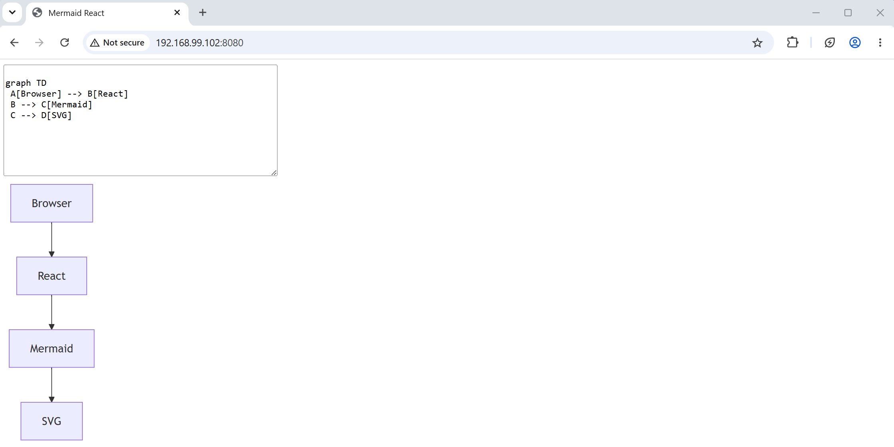
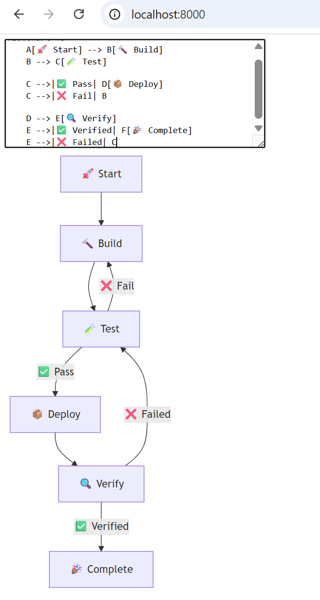
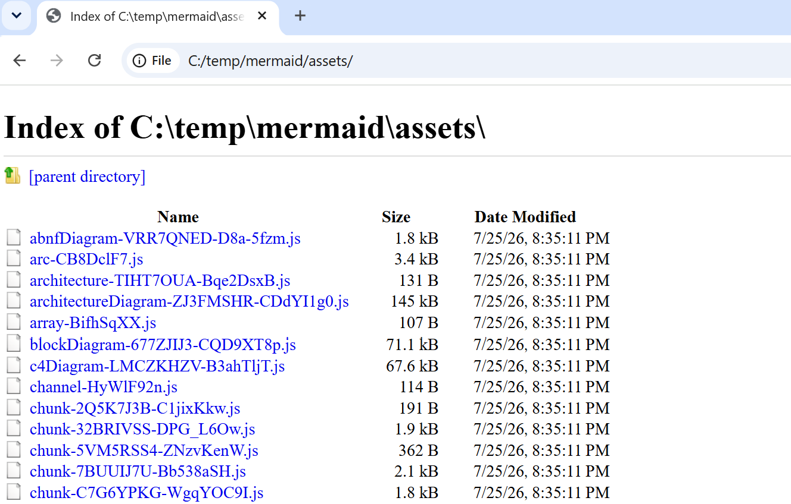
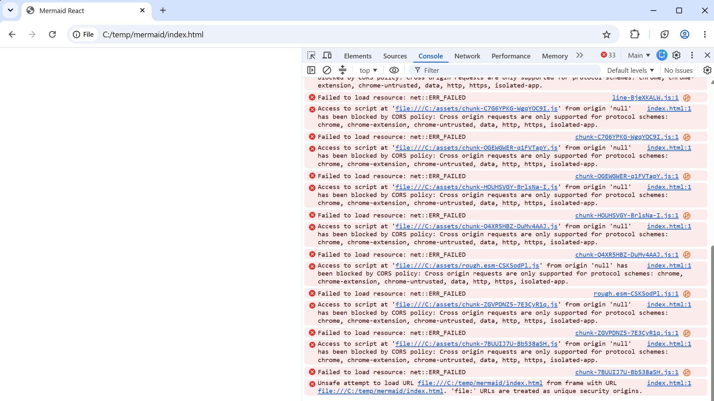
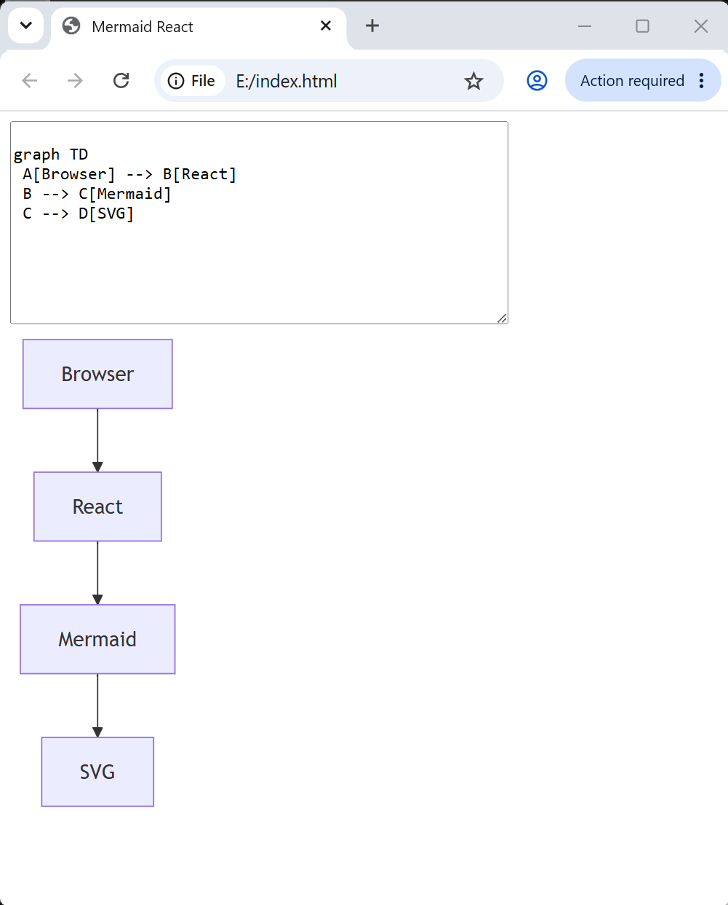

### Info

Latest [Mermaid](https://github.com/mermaid-js/mermaid) bundled with [React](https://github.com/react/react) library for web and native user interfaces and [Vite](https://github.com/vitejs/vite) fast next generation frontend tooling in order to run dist as a static resource (partial success)

### Background

### Usage


```sh
docker pull node:22.12.0-alpine
docker pull nginx:1.30.3-alpine3.23
```
```sh
IMAGE=mermaid-react
docker build -t $IMAGE -f Dockerfile .
```
```text
Step 1/15 : FROM node:22.12.0-alpine AS builder
 ---> 3448d7ddbc59
Step 2/15 : WORKDIR /app
 ---> Running in b8dff4eb8b95
Removing intermediate container b8dff4eb8b95
 ---> 68d6f41e2a11
Step 3/15 : COPY package*.json /app/
 ---> 1d416b30ac12
Step 4/15 : ARG NPM_REGISTRY
 ---> Running in e02c9cf90644
Removing intermediate container e02c9cf90644
 ---> 943dd5119d13
Step 5/15 : RUN if [ -n "$NPM_REGISTRY" ]; then         npm config set registry "$NPM_REGISTRY";     fi
 ---> Running in 73a4113eb1bc
Removing intermediate container 73a4113eb1bc
 ---> a053af262af4
Step 6/15 : RUN npm install  || { cat /root/.npm/_logs/*.log; exit 1; }
 ---> Running in 406120150a40

added 130 packages, and audited 131 packages in 1m

12 packages are looking for funding
  run `npm fund` for details

found 0 vulnerabilities
npm notice
npm notice New major version of npm available! 10.9.0 -> 12.0.1
npm notice Changelog: https://github.com/npm/cli/releases/tag/v12.0.1
npm notice To update run: npm install -g npm@12.0.1
npm notice
Removing intermediate container 406120150a40
 ---> db89988ca84e
Step 7/15 : COPY index.html vite.config.js /app/
 ---> aae14ba29fd7
Step 8/15 : ADD src /app/src
 ---> a1a4f3980586
Step 9/15 : RUN npm run build
 ---> Running in 0cc0c3c39900

> mermaid-react@0.1.0 build
> vite build

vite v8.1.5 building client environment for production...
transforming...✓ 2069 modules transformed.
rendering chunks...
computing gzip size...
dist/index.html                                         1.39 kB │ gzip:   0.43 kB
...
dist/assets/chunk-KEIR6QF5-Dj-OpFgW.js                662.68 kB │ gzip: 143.23 kB


✓ built in 7.38s
[plugin builtin:vite-reporter]
(!) Some chunks are larger than 500 kB after minification. Consider:
- Using dynamic import() to code-split the application
- Use build.rolldownOptions.output.codeSplitting to improve chunking: https://rolldown.rs/reference/OutputOptions.codeSplitting
- Adjust chunk size limit for this warning via build.chunkSizeWarningLimit.
Removing intermediate container 0cc0c3c39900
 ---> c3aa8487e083
Step 10/15 : FROM nginx:1.30.3-alpine3.23
 ---> d0701bd41f82
Step 11/15 : WORKDIR /usr/share/nginx/html
 ---> Running in 9a6efd166a84
Removing intermediate container 9a6efd166a84
 ---> 1a83951c10b0
Step 12/15 : COPY --from=builder /app/dist ./
 ---> 6560afb6ca74
Step 13/15 : COPY default.conf /etc/nginx/conf.d/
 ---> 3ee0e88e7508
Step 14/15 : EXPOSE 80
 ---> Running in fc895ac4db98
Removing intermediate container fc895ac4db98
 ---> 4da50624fffb
Step 15/15 : CMD ["nginx", "-g", "daemon off;"]
 ---> Running in 53523509582f
Removing intermediate container 53523509582f
 ---> 94885df73b62
Successfully built 94885df73b62
Successfully tagged mermaid-react:latest
```
```sh    
NAME=mermaid-react
docker run --name $NAME -d -p 8080:80 $IMAGE
```



### Note

```sh
rm -fr dist
docker cp $NAME:/usr/share/nginx/html dist
```
```cmd
pushd dist
python.exe -m http.server
```
```text
Serving HTTP on :: port 8000 (http://[::]:8000/) ...
```
then open the site in the browser `http://localhost:8000`



### Local File

Cannot open in the browser via `file://` when using the real DOS Drive letters:

when launched with 

```cmd
"C:\Program Files\Google\Chrome\Application\chrome.exe" --user-data-dir=C:\temp\chrome-file-test --allow-file-access-from-files file:///C:\developer\sergueik\springboot_study\basic-mermaid-react\dist\index.html
```
or
```cmd

"C:\Program Files\Google\Chrome\Application\chrome.exe" --user-data-dir=C:\temp\chrome-file-test --allow-file-access-from-files file:///C:/developer/sergueik/springboot_study/basic-mermaid-react/dist/index.html
```
it fails with `net::ERR_FILE_NOT_FOUND` error for multiple asset:

```text
Failed to load resource: net::ERR_FILE_NOT_FOUND index-BGiIaHVw.js:1 
Failed to load resource: net::ERR_FILE_NOT_FOUND chunk-Y2CYZVJY-DsF7k-Jl.js:1  
Failed to load resource: net::ERR_FILE_NOT_FOUND src-BMa7vLb8.js:1  
Failed to load resource: net::ERR_FILE_NOT_FOUND chunk-WYO6CB5R-C36byBU-.js:1  
Failed to load resource: net::ERR_FILE_NOT_FOUND dist-Q9n2Bb2K.js:1  
Failed to load resource: net::ERR_FILE_NOT_FOUND chunk-ICXQ74PX-_B4UKQEp.js:1  
Failed to load resource: net::ERR_FILE_NOT_FOUND path-BWPyau1x.js:1  
Failed to load resource: net::ERR_FILE_NOT_FOUND array-BifhSqXX.js:1  
Failed to load resource: net::ERR_FILE_NOT_FOUND line-BjeXKALW.js:1  
Failed to load resource: net::ERR_FILE_NOT_FOUND chunk-C7G6YPKG-WgqYOC9I.js:1  
Failed to load resource: net::ERR_FILE_NOT_FOUND chunk-OGEWGWER-q1FVTapY.js:1  
Failed to load resource: net::ERR_FILE_NOT_FOUND chunk-HOUHSVGY-BrlsNa-I.js:1  
Failed to load resource: net::ERR_FILE_NOT_FOUND chunk-Q4XR5HBZ-DuMv4AAJ.js:1  
Failed to load resource: net::ERR_FILE_NOT_FOUND rough.esm-CSKSodPl.js:1  
Failed to load resource: net::ERR_FILE_NOT_FOUND chunk-ZGVPDNZ5-7E3CyR1q.js:1  
Failed to load resource: net::ERR_FILE_NOT_FOUND chunk-7BUUIJ7U-Bb538aSH.js:1  
```


all files are present:
```cmd
dir /b/s /a-d assets | findstr -i "index-BGiIaHVw.js chunk-Y2CYZVJY-DsF7k-Jl.js src-BMa7vLb8.js  chunk-WYO6CB5R-C36byBU-.js dist-Q9n2Bb2K.js chunk-ICXQ74PX-_B4UKQEp.js  path-BWPyau1x.js array-BifhSqXX.js line-BjeXKALW.js chunk-C7G6YPKG-WgqYOC9I.js  chunk-OGEWGWER-q1FVTapY.jschunk-OGEWGWER-q1FVTapY.js chunk-HOUHSVGY-BrlsNa-I.js chunk-Q4XR5HBZ-DuMv4AAJ.js rough.esm-CSKSodPl.js chunk-ZGVPDNZ5-7E3CyR1q.js chunk-7BUUIJ7U-Bb538aSH.js"
```
```text
C:\developer\sergueik\springboot_study\basic-mermaid-react\dist\assets\array-BifhSqXX.js
C:\developer\sergueik\springboot_study\basic-mermaid-react\dist\assets\chunk-7BUUIJ7U-Bb538aSH.js
C:\developer\sergueik\springboot_study\basic-mermaid-react\dist\assets\chunk-C7G6YPKG-WgqYOC9I.js
C:\developer\sergueik\springboot_study\basic-mermaid-react\dist\assets\chunk-HOUHSVGY-BrlsNa-I.js
C:\developer\sergueik\springboot_study\basic-mermaid-react\dist\assets\chunk-ICXQ74PX-_B4UKQEp.js
C:\developer\sergueik\springboot_study\basic-mermaid-react\dist\assets\chunk-Q4XR5HBZ-DuMv4AAJ.js
C:\developer\sergueik\springboot_study\basic-mermaid-react\dist\assets\chunk-WYO6CB5R-C36byBU-.js
C:\developer\sergueik\springboot_study\basic-mermaid-react\dist\assets\chunk-Y2CYZVJY-DsF7k-Jl.js
C:\developer\sergueik\springboot_study\basic-mermaid-react\dist\assets\chunk-ZGVPDNZ5-7E3CyR1q.js
C:\developer\sergueik\springboot_study\basic-mermaid-react\dist\assets\dist-Q9n2Bb2K.js
C:\developer\sergueik\springboot_study\basic-mermaid-react\dist\assets\index-BGiIaHVw.js
C:\developer\sergueik\springboot_study\basic-mermaid-react\dist\assets\line-BjeXKALW.js
C:\developer\sergueik\springboot_study\basic-mermaid-react\dist\assets\path-BWPyau1x.js
C:\developer\sergueik\springboot_study\basic-mermaid-react\dist\assets\rough.esm-CSKSodPl.js
C:\developer\sergueik\springboot_study\basic-mermaid-react\dist\assets\src-BMa7vLb8.js

```
> NOTE: moving the files around does not help:






However it works successfully with new instance launched with option  --allow-file-access-from-files from e: drive. 

```cmd
cd dist
subst E: %CD%
"C:\Program Files\Google\Chrome\Application\chrome.exe" --user-data-dir=C:\temp\chrome-file-test --allow-file-access-from-files file:///E:/index.html
```


> NOTE: without the Chrome option `--allow-file-access-from-files` the error becomes:

```text
Access to script at 'file:///C:/assets/index-BGiIaHVw.js' from origin 'null' has been blocked by CORS policy: Cross origin requests are only supported for protocol schemes: chrome, chrome-extension, chrome-untrusted, data, http, https, isolated-app.
```
(repeated for other resources)

For option to have effect one has to close all running instances of Chrome browser, otherwise the new url will be served by the already launched instance.

### Cleanup

```sh
docker stop $NAME
docker container prune -f
docker image prune -f
docker image rm $IMAGE node:22.12.0-alpine nginx:1.30.3-alpine3.23
```
---

### Author
[Serguei Kouzmine](kouzmine_serguei@yahoo.com)
