[origin](https://github.com/FoggyBalrog/MermaidDotNet/blob/main/docs/diagrams/block-diagram.md)
# Block diagram<!-- omit from toc -->

*Official Mermaid documentation: [Block diagram](https://mermaid.js.org/syntax/block.html).*  

> [!NOTE]
> All Mermaid diagrams can be configured, by passing a `MermaidConfig` object to any of the methods in the `Mermaid` class. Read more on [Mermaid configuration](~/configuration.md).

## Simple block diagram

The following code sample shows how to create a simple Mermaid block diagram.

Use the `BlockDiagram` method of the `Mermaid` class to create a block diagram.

Add blocks with the `AddBlock` method, add links with the `AddLink` method, and generate the Mermaid code with the `Build` method.

```csharp
var diagram = Mermaid
    .BlockDiagram()
    .AddBlock("Frontend", out var frontend)
    .AddSpace()
    .AddBlock("Backend", out var backend)
    .AddSpace()
    .AddBlock("Database", out var database, shape: BlockShape.Cylindrical)
    .AddLink(frontend, backend, "HTTP")
    .AddLink(backend, database, "TCP")
    .Build();
```

The code above generates the following Mermaid code:

```text
block
    b0["Frontend"]
    space
    b1["Backend"]
    space
    b2[("Database")]
    b0 --"HTTP"--> b1
    b1 --"TCP"--> b2
```

That renders as:

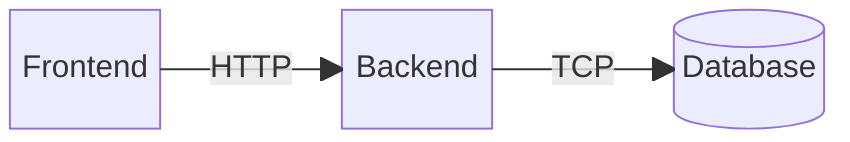

[⬆ Back to top](#block-diagram)

## Columns

Block diagrams can be laid out on a fixed number of columns. Pass a `columns` parameter to the `BlockDiagram` method.

Example:

```csharp
var diagram = Mermaid
    .BlockDiagram(columns: 3)
    .AddBlock("A", out _)
    .AddBlock("B", out _)
    .AddBlock("C", out _)
    .AddBlock("D", out _)
    .Build();
```

The code above generates the following Mermaid code:

```text
block
    columns 3
    b0["A"]
    b1["B"]
    b2["C"]
    b3["D"]
```

That renders as:

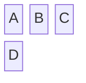

[⬆ Back to top](#block-diagram)

## Block shapes

Blocks can be rendered with different shapes by passing the `shape` parameter to `AddBlock`.

Example:

```csharp
var diagram = Mermaid
    .BlockDiagram()
    .AddBlock("Rectangle", out _, shape: BlockShape.Rectangle)
    .AddBlock("Round edges", out _, shape: BlockShape.RoundEdges)
    .AddBlock("Stadium", out _, shape: BlockShape.Stadium)
    .AddBlock("Subroutine", out _, shape: BlockShape.Subroutine)
    .AddBlock("Database", out _, shape: BlockShape.Cylindrical)
    .AddBlock("Circle", out _, shape: BlockShape.Circle)
    .AddBlock("Decision", out _, shape: BlockShape.Rhombus)
    .Build();
```

The code above generates the following Mermaid code:

```text
block
    b0["Rectangle"]
    b1("Round edges")
    b2(["Stadium"])
    b3[["Subroutine"]]
    b4[("Database")]
    b5(("Circle"))
    b6{"Decision"}
```

That renders as:

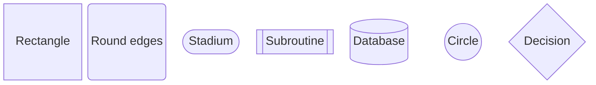

[⬆ Back to top](#block-diagram)

## Spaces

To add empty slots in the layout, use the `AddSpace` method, passing an optional `count` parameter to add multiple consecutive spaces.

Example:

```csharp
var diagram = Mermaid
    .BlockDiagram(columns: 3)
    .AddBlock("A", out _)
    .AddSpace()
    .AddBlock("B", out _)
    .AddSpace(2)
    .AddBlock("C", out _)
    .Build();
```

The code above generates the following Mermaid code:

```text
block
    columns 3
    b0["A"]
    space
    b1["B"]
    space:2
    b2["C"]
```

That renders as:

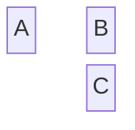

## Links

To connect blocks, use the `AddLink` method. Links can optionally display text.

Example:

```csharp
var diagram = Mermaid
    .BlockDiagram()
    .AddBlock("A", out var a)
    .AddSpace()
    .AddBlock("B", out var b)
    .AddLink(a, b)
    .Build();
```

The code above generates the following Mermaid code:

```text
block
    b0["A"]
    space
    b1["B"]
    b0 --> b1
```

That renders as:

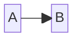


[⬆ Back to top](#block-diagram)

## Composite blocks

Composite blocks can be created with the `AddCompositeBlock` method. The `buildAction` receives a new `BlockDiagramBuilder` used to declare the nested blocks and links.

Example:

```csharp
Block api;
Block db;

var diagram = Mermaid
    .BlockDiagram(columns: 3)
    .AddBlock("UI", out var ui)
    .AddSpace()
    .AddCompositeBlock(builder => builder
            .AddBlock("API", out api)
            .AddSpace()
            .AddBlock("DB", out db, shape: BlockShape.Cylindrical)
            .AddLink(api, db),
        columns: 1,
        width: 2)
    .AddLink(ui, api, "calls")
    .Build();
```

The code above generates the following Mermaid code:

```text
block
    columns 3
    b0["UI"]
    space
    block:composite0:2
        columns 1
        b1["API"]
        space
        b2[("DB")]
        b1 --> b2
    end
    b0 --"calls"--> b1
```

That renders as:

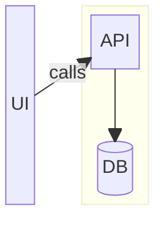

[⬆ Back to top](#block-diagram)

## Custom styling

To apply custom CSS styling to a block, use the `StyleBlock` method.

Example:

```csharp
var diagram = Mermaid
    .BlockDiagram()
    .AddBlock("Critical", out var critical)
    .StyleBlock(critical, "fill:#ffcccc,stroke:#cc0000,stroke-width:2px")
    .Build();
```

The code above generates the following Mermaid code:

```text
block
    b0["Critical"]
    style b0 fill:#ffcccc,stroke:#cc0000,stroke-width:2px
```

That renders as:

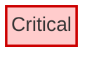

[⬆ Back to top](#block-diagram)
[origin](https://github.com/FoggyBalrog/MermaidDotNet/blob/main/docs/diagrams/class-diagram.md)
# Class diagram<!-- omit from toc -->

*Official Mermaid documentation: [Class diagram](https://mermaid.js.org/syntax/classDiagram.html).*

> [!NOTE]
> All Mermaid diagrams can be configured, by passing a `MermaidConfig` object to any of the methods in the `Mermaid` class. Read more on [Mermaid configuration](~/configuration.md).

## Simple class diagram

The following code sample shows how to create a simple Mermaid class diagram.

Use the `ClassDiagram` method of the `Mermaid` class to create a class diagram.

Add classes with the `AddClass` method, and add properties and methods with the `AddProperty` and `AddMethod` methods.

Add relationships with the `AddRelationship` method.

Generate the diagram mermaid code with the `Build` method.

```csharp
var diagram = Mermaid
    .ClassDiagram()
    .AddClass("Animal", out var animal)
    .AddClass("Dog", out var dog)
    .AddProperty(animal, "int", "Age")
    .AddMethod(animal, null, "Breathe")
    .AddMethod(animal, "Energy", "Eat", parameters: 
    [
        ("Food", "food")
    ])
    .AddMethod(dog, "Sound", "Bark", parameters: 
    [
        ("int", "times"),
        ("int", "volume")
    ])
    .AddRelationship(animal, dog, RelationshipType.Inheritance, label: "A dog is an animal")
    .Build();
```

The code above generates the following Mermaid code:

```text
classDiagram
    class Animal {
        +int Age
        +Breathe()
        +Eat(Food food) Energy
    }
    class Dog {
        +Bark(int times, int volume) Sound
    }
    Animal <|-- Dog : A dog is an animal
```

That renders as:

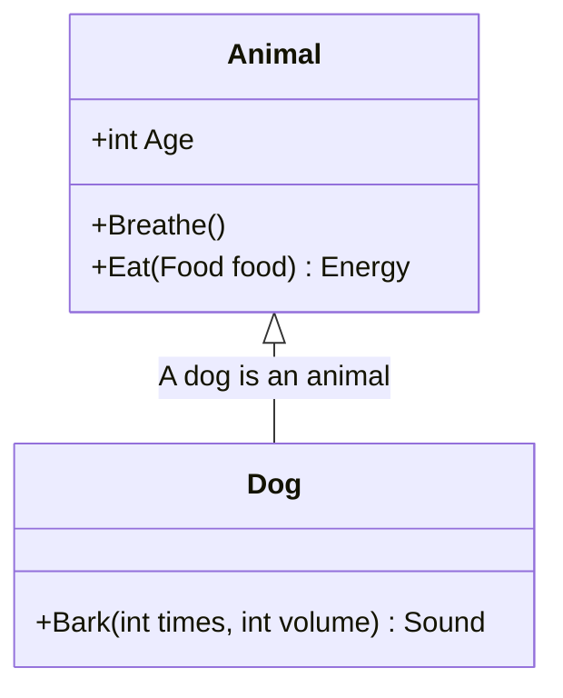

[⬆ Back to top](#class-diagram)

## Title

The title of the class diagram can be set by passing a `title` parameter to the `ClassDiagram` method.

Example:

```csharp
var diagram = Mermaid
    .ClassDiagram("My Title")
    .AddClass("Animal", out var animal)
    .Build();
```

The code above generates the following Mermaid code:

```text
---
title: My Title
---
classDiagram
    class Animal
```

That renders as:

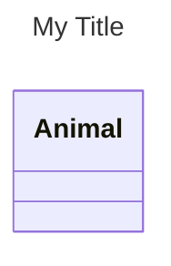

## Class label

Whitespaces and special characters are not allowed in class names. To set a label for a class, pass a `label` parameter to the `AddClass` method.

Example:

```csharp
var diagram = Mermaid
    .ClassDiagram()
    .AddClass("c1", out var c1, "Hello World!")
    .AddClass("c2", out var c2, "Hello World!")
    .AddProperty(c1, "int", "Age")
    .AddMethod(c1, null, "Breathe")
    .Build();
```

The code above generates the following Mermaid code:

```text
classDiagram
    class c1["Hello World!"] {
        +int Age
        +Breathe()
    }
    class c2["Hello World!"]
```

That renders as:

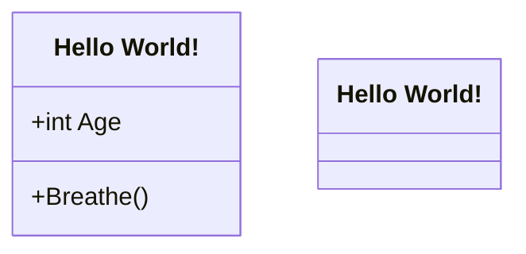

[⬆ Back to top](#class-diagram)

## Class annotation

To add an annotation to a class, pass an `annotation` parameter to the `AddClass` method.

Example:

```csharp
var diagram = Mermaid
    .ClassDiagram()
    .AddClass("c1", out var c1, annotation: "foo")
    .AddClass("c2", out var c2, annotation: "bar")
    .AddProperty(c1, "int", "Age")
    .AddMethod(c1, null, "Breathe")
    .Build();
```

The code above generates the following Mermaid code:

```text
classDiagram
    class c1 {
        <<foo>>
        +int Age
        +Breathe()
    }
    class c2 {
        <<bar>>
    }
```

That renders as:

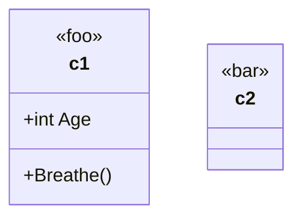

[⬆ Back to top](#class-diagram)

## Class properties

To add properties to a class, use the `AddProperty` method.

Example:

```csharp
var diagram = Mermaid
    .ClassDiagram()
    .AddClass("Animal", out var animal)
    .AddProperty(animal, "int", "Age")
    .Build();
```

The code above generates the following Mermaid code:

```text
classDiagram
    class Animal {
        +int Age
    }
```

That renders as:

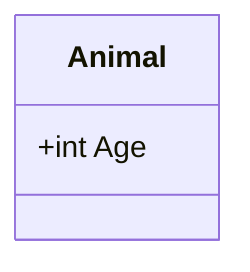

[⬆ Back to top](#class-diagram)

## Class methods

To add methods to a class, use the `AddMethod` method. Metods can optionally have visibility and parameters.

Example:

```csharp
var diagram = Mermaid
    .ClassDiagram()
    .AddClass("Animal", out var animal)
    .AddClass("Dog", out var dog)
    .AddProperty(animal, "int", "Age")
    .AddMethod(animal, null, "Breathe")
    .AddMethod(animal, "void", "Eat", Visibilities.Public | Visibilities.Abstract,
                [
        ("Food", "food")
    ])
    .AddMethod(dog, "Sound", "Bark", parameters: [
        ("int", "times"),
        ("int", "volume")
    ])
    .AddRelationship(animal, dog, RelationshipType.Inheritance, label: "A dog is an animal")
    .Build();
```

The code above generates the following Mermaid code:

```text
classDiagram
    class Animal {
        +int Age
        +Breathe()
        +Eat(Food food)* void
    }
    class Dog {
        +Bark(int times, int volume) Sound
    }
    Animal <|-- Dog : A dog is an animal
```

That renders as:

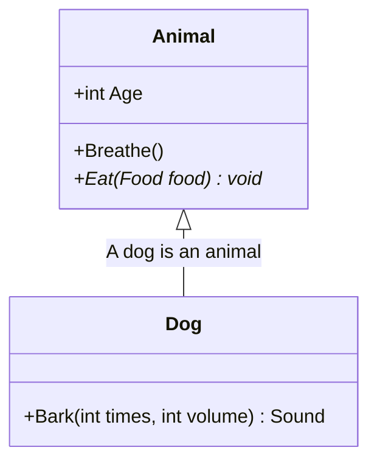

[⬆ Back to top](#class-diagram)

## Relationships

To add a relationship between two classes, use the `AddRelationship` method. A relationship can be one or two way, where each side can be of the following types:

- `Inheritance`
- `Composition`
- `Aggregation`
- `Association`
- `Unspecified`

Single-way example:

```csharp
var diagram = Mermaid
    .ClassDiagram()
    .AddClass("c1", out var c1)
    .AddClass("c2", out var c2)
    .AddRelationship(c1, c2, RelationshipType.Inheritance)
    .Build();
```

The code above generates the following Mermaid code:

```text
classDiagram
    c1 <|-- c2
```

That renders as:

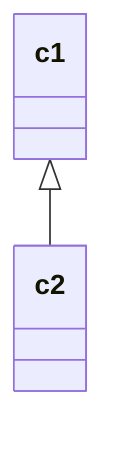

Two-way example:

```csharp
var diagram = Mermaid
    .ClassDiagram()
    .AddClass("c1", out var c1)
    .AddClass("c2", out var c2)
    .AddRelationship(c1, c2, RelationshipType.Inheritance, toRelationshipType: RelationshipType.Composition)
    .Build();
```

The code above generates the following Mermaid code:

```text
classDiagram
    c1 <|--* c2
```

That renders as:

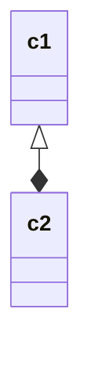

[⬆ Back to top](#class-diagram)

## Relationship cardinalities

To add cardinalities to a relationship, pass `fromCardinality` and/or `toCardinality` parameters to the `AddRelationship` method.

Example:

```csharp
var diagram = Mermaid
    .ClassDiagram()
    .AddClass("c1", out var c1)
    .AddClass("c2", out var c2)
    .AddClass("c3", out var c3)
    .AddClass("c4", out var c4)
    .AddRelationship(c1, c2, RelationshipType.Inheritance, fromCardinality: Cardinality.One)
    .AddRelationship(c3, c4, RelationshipType.Inheritance, toCardinality: Cardinality.Range("a", "b"))
    .Build();
```

The code above generates the following Mermaid code:

```text
classDiagram
    c1 "1" <|-- c2
    c3 <|--"a..b"  c4
```

That renders as:

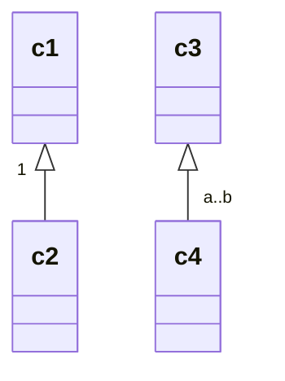

[⬆ Back to top](#class-diagram)

## Relationship link style

To set the style of the link between classes, pass a `linkStyle` parameter to the `AddRelationship` method.

It can be one of the following values:

- `Solid` (default)
- `Dashed`

Example:

```csharp
var diagram = Mermaid
    .ClassDiagram()
    .AddClass("c1", out var c1)
    .AddClass("c2", out var c2)
    .AddClass("c3", out var c3)
    .AddClass("c4", out var c4)
    .AddRelationship(c1, c2, RelationshipType.Inheritance, linkStyle: LinkStyle.Solid)
    .AddRelationship(c3, c4, RelationshipType.Inheritance, linkStyle: LinkStyle.Dashed)
    .Build();
```

The code above generates the following Mermaid code:

```text
classDiagram
    c1 <|-- c2
    c3 <|.. c4
```

That renders as:

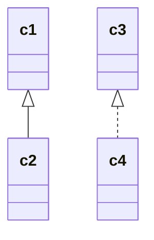

[⬆ Back to top](#class-diagram)

## Namespaces

Classes can be defined in a namespace. Use the `AddNamespace` method to add a namespace to the diagram, and define classes within it with the lambda method.

Example:

```csharp
var diagram = Mermaid
    .ClassDiagram()
    .AddClass("c1", out var c1)
    .AddClass("c2", out var c2)
    .AddNamespace("ns1", builder => builder
        .AddClass("c3", out var c3)
        .AddClass("c4", out var c4)
        .AddRelationship(c3, c4, RelationshipType.Inheritance))
    .AddClass("c5", out var c5)
    .AddNamespace("ns2", builder => builder
        .AddClass("c6", out var c6)
        .AddClass("c7", out var c7)
        .AddRelationship(c6, c7, RelationshipType.Inheritance)
        .AddRelationship(c1, c7, RelationshipType.Inheritance))
    .Build();
```

The code above generates the following Mermaid code:

```text
classDiagram
    class c2
    namespace ns1 {
        class c3
        class c4
    }
    class c5
    namespace ns2 {
        class c6
        class c7
    }
    c3 <|-- c4
    c6 <|-- c7
    c1 <|-- c7
```

That renders as:

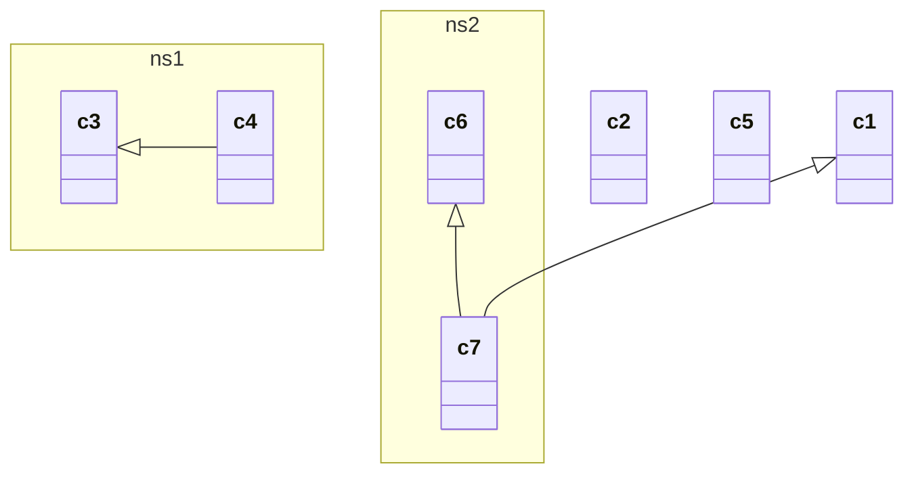

[⬆ Back to top](#class-diagram)

## Direction

The direction of the class diagram can be set by passing a `direction` parameter to the `ClassDiagram` method.

It can be one of the following values:

- `TopToBottom`
- `BottomToTop`
- `LeftToRight`
- `RightToLeft`

Example:

```csharp
var diagram = Mermaid
    .ClassDiagram("Bottom to Top", ClassDiagramDirection.BottomToTop)
    .AddClass("c1", out var d2c1)
    .AddClass("c2", out var d2c2)
    .AddRelationship(d2c1, d2c2, RelationshipType.Inheritance)
    .Build();
```

The code above generates the following Mermaid code:

```text
---
title: Bottom to Top
---
classDiagram
    direction BT
    c1 <|-- c2
```

That renders as:

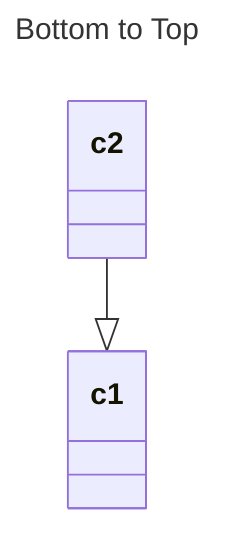

[⬆ Back to top](#class-diagram)

## Interaction

Classes can have an hyperlink or a javascript callback attached to them, by either using the `AddHyperlink` or `AddCallback` methods.

Example:

```csharp
var diagram = Mermaid
    .ClassDiagram()
    .AddClass("c1", out var c1)
    .AddClass("c2", out var c2)
    .AddClass("c3", out var c3)
    .AddClass("c4", out var c4)
    .AddCallback(c1, "callback")
    .AddCallback(c2, "callback", "tooltip")
    .AddHyperlink(c3, "https://example.com")
    .AddHyperlink(c4, "https://example.com", "tooltip")
    .AddRelationship(c1, c2, RelationshipType.Inheritance)
    .AddRelationship(c3, c4, RelationshipType.Inheritance)
    .Build();
```

The code above generates the following Mermaid code:

```text
classDiagram
    c1 <|-- c2
    c3 <|-- c4
    click c1 call callback()
    click c2 call callback() "tooltip"
    click c3 href "https://example.com"
    click c4 href "https://example.com" "tooltip"
```

That renders as:

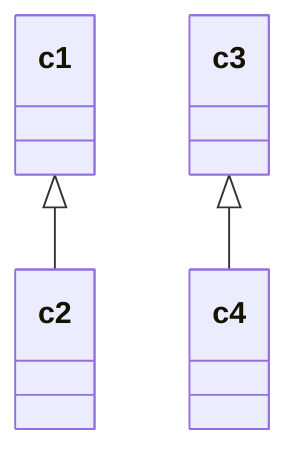

[⬆ Back to top](#class-diagram)

## Notes

Notes can be added to the diagram, eihter generally or to a specific class, by using the `AddNote` method.

Example:

```csharp
var diagram = Mermaid
    .ClassDiagram()
    .AddClass("c1", out var c1)
    .AddNote("General note")
    .AddNote("Specific note", c1)
    .Build();
```

The code above generates the following Mermaid code:

```text
classDiagram
    note "General note"
    note for c1 "Specific note"
    class c1
```

That renders as:

```mermaid
classDiagram
    note "General note"
    note for c1 "Specific note"
    class c1
```

[⬆ Back to top](#class-diagram)

## Custom styling

Classes can be styled by using the `StyleWithRawCss` method, when using raw CSS, or the `StyleWithCssClass` method, when using a CSS class. CSS classes can be applied to multiple classes at once.

Example:

```csharp
var diagram = Mermaid
    .ClassDiagram()
    .AddClass("c1", out var c1)
    .AddClass("c2", out var c2)
    .AddClass("c3", out var c3)
    .StyleWithRawCss(c1, "fill:#f9f,stroke:#333,stroke-width:4px")
    .StyleWithCssClass("styleClass", c2, c3)
    .Build();
```

The code above generates the following Mermaid code:

```text
classDiagram
    class c1
    class c2
    class c3
    style c1 fill:#f9f,stroke:#333,stroke-width:4px
    cssClass "c2,c3" styleClass
```

That renders as:

```mermaid
classDiagram
    class c1
    class c2
    class c3
    style c1 fill:#f9f,stroke:#333,stroke-width:4px
    cssClass "c2,c3" styleClass
```

[⬆ Back to top](#class-diagram)
[origin](https://github.com/FoggyBalrog/MermaidDotNet/blob/main/docs/diagrams/entity-relationship-diagram.md)
# Entity relationship diagram<!-- omit from toc -->

*Official Mermaid documentation: [Entity Relationship Diagram](https://mermaid.js.org/syntax/entityRelationshipDiagram.html).*

> [!NOTE]
> All Mermaid diagrams can be configured, by passing a `MermaidConfig` object to any of the methods in the `Mermaid` class. Read more on [Mermaid configuration](~/configuration.md).

## Simple diagram

The following code sample shows how to create a simple entity relationship diagram.

Use the `EntityRelationshipDiagram` proerty of the `Mermaid` class to start building an entity relationship diagram.

Add entities to the diagram using the `AddEntity` method.

Add relationships between entities using the `AddRelationship` method.

Generate the diagram mermaid code with the `Build` method.

Example:

```csharp
Mermaid
    .EntityRelationshipDiagram()
    .AddEntity("Customer", out var c)
    .AddEntity("Order", out var o)
    .AddEntity("Product", out var p)
    .AddRelationship(Cardinality.ExactlyOne, c, Cardinality.ZeroOrMore, o, "places")
    .AddRelationship(Cardinality.ExactlyOne, o, Cardinality.OneOrMore, p, "contains")
    .Build();
```

The code above generates the following Mermaid code:

```text
erDiagram
    Customer ||--o{ Order : "places"
    Order ||--|{ Product : "contains"
```

That renders as:

```mermaid
erDiagram
    Customer ||--o{ Order : "places"
    Order ||--|{ Product : "contains"
```

[⬆ Back to top](#entity-relationship-diagram)

## Cardinality

Cardinality must be defined for each end of a relationship and may be one of the following values:

- `ZeroOrOne`
- `ExactlyOne`
- `ZeroOrMore`
- `OneOrMore`

[⬆ Back to top](#entity-relationship-diagram)

## Attributes

Attributes may be added to entities, using the optional `attributes` parameter of the `AddEntity` method.

Attributes must at least ave a type and a name. Thay can additionally have keys and a comment.

Example:

```csharp
Mermaid
    .EntityRelationshipDiagram()
    .AddEntity("E1", out var e1, ("string", "foo"), ("int", "bar", EntityAttributeKeys.Primary | EntityAttributeKeys.Unique))
    .AddEntity("E2", out var e2, ("string", "baz", EntityAttributeKeys.Foreign, "hello"), ("int", "qux", "world"))
    .AddRelationship(Cardinality.ExactlyOne, e1, Cardinality.ZeroOrMore, e2, "has")
    .Build();
```

The code above generates the following Mermaid code:

```text
erDiagram
    E1 {
        string foo
        int bar PK, UK
    }
    E2 {
        string baz FK "hello"
        int qux "world"
    }
    E1 ||--o{ E2 : "has"
```

That renders as:

```mermaid
erDiagram
    E1 {
        string foo
        int bar PK, UK
    }
    E2 {
        string baz FK "hello"
        int qux "world"
    }
    E1 ||--o{ E2 : "has"
```

[⬆ Back to top](#entity-relationship-diagram)

## Identification

Relationships may be classified as either *identifying* (by default) or *non-identifying* and these are rendered with either solid or dashed lines respectively.

Use the optional `relationshipType` parameter of the `AddRelationship` method to specify the relationship type.

Example:

```csharp
Mermaid
    .EntityRelationshipDiagram()
    .AddEntity("E1", out var e1)
    .AddEntity("E2", out var e2)
    .AddRelationship(Cardinality.ExactlyOne, e1, Cardinality.ZeroOrMore, e2, "foo", RelationshipType.NonIdentifying)
    .Build();
```

The code above generates the following Mermaid code:

```text
erDiagram
    E1 ||..o{ E2 : "foo"
```

That renders as:

```mermaid
erDiagram
    E1 ||..o{ E2 : "foo"
```

[⬆ Back to top](#entity-relationship-diagram)[origin](https://github.com/FoggyBalrog/MermaidDotNet/blob/main/docs/diagrams/flowchart.md)
# Flowchart<!-- omit from toc -->

*Official Mermaid documentation: [Flowchart](https://mermaid.js.org/syntax/flowchart.html).*

> [!NOTE]
> All Mermaid diagrams can be configured, by passing a `MermaidConfig` object to any of the methods in the `Mermaid` class. Read more on [Mermaid configuration](~/configuration.md).

## Simple flowchart

The following code sample shows how to create a simple Mermaid flowchart.

Use the `Flowchart` method of the `Mermaid` class to create a flowchart.

Add nodes with the `AddNode` method, and link them with the `AddLink` method.

Generate the diagram mermaid code with the `Build` method.

```csharp
string diagram = Mermaid
    .Flowchart()
    .AddNode("N1", out var n1)
    .AddNode("N2", out var n2)
    .AddNode("N3", out var n3)
    .AddLink(n1, n2, out var l1, "some text")
    .AddLink(n2, n3, out var l2)
    .Build();
```

The code above generates the following Mermaid code:

```text
flowchart TB
    id1["N1"]
    id2["N2"]
    id3["N3"]
    id1 -->|"some text"| id2
    id2 --> id3
```

That renders as:

```mermaid
flowchart TB
    id1["N1"]
    id2["N2"]
    id3["N3"]
    id1 -->|"some text"| id2
    id2 --> id3
```

[⬆ Back to top](#flowchart)

## Orientation

The orientation of the flowchart can be set by passing an `orientation` parameter to the `Flowchart` method. 

It can be one of the following values:

- `TopToBottom` (default)
- `BottomToTop`
- `LeftToRight`
- `RightToLeft`

```csharp
Mermaid.Flowchart(orientation: FlowchartOrientation.BottomToTop)
```

[⬆ Back to top](#flowchart)

## Node shape

The shape of the nodes can be set by passing a `shape` parameter to the `AddNode` method.

It can be one of the following values:

- `Rectangle` (default)
- `RoundEdges`
- `Stadium`
- `Subroutine`
- `Cylindrical`
- `Circle`
- `DoubleCircle`
- `Asymmetric`
- `Rhombus`
- `Hexagon`
- `Parallelogram`
- `ParallelogramAlt`
- `Trapezoid`
- `TrapezoidAlt`

Example:

```csharp
string diagram = Mermaid
    .Flowchart()
    .AddNode("N1", out _, NodeShape.Rectangle)
    .AddNode("N2", out _, NodeShape.RoundEdges)
    .AddNode("N3", out _, NodeShape.Stadium)
    .AddNode("N4", out _, NodeShape.Subroutine)
    .AddNode("N5", out _, NodeShape.Cylindrical)
    .AddNode("N6", out _, NodeShape.Circle)
    .AddNode("N7", out _, NodeShape.DoubleCircle)
    .AddNode("N8", out _, NodeShape.Asymmetric)
    .AddNode("N9", out _, NodeShape.Rhombus)
    .AddNode("N10", out _, NodeShape.Hexagon)
    .AddNode("N11", out _, NodeShape.Parallelogram)
    .AddNode("N12", out _, NodeShape.ParallelogramAlt)
    .AddNode("N13", out _, NodeShape.Trapezoid)
    .AddNode("N14", out _, NodeShape.TrapezoidAlt)
    .Build();
```

The code above generates the following Mermaid code:

```text
flowchart TB
    id1["N1"]
    id2("N2")
    id3(["N3"])
    id4[["N4"]]
    id5[("N5")]
    id6(("N6"))
    id7((("N7")))
    id8>"N8"]
    id9{"N9"}
    id10{{"N10"}}
    id11[/"N11"/]
    id12[\"N12"\]
    id13[/"N13"\]
    id14[\"N14"/]
```

That renders as:

```mermaid
flowchart TB
    id1["N1"]
    id2("N2")
    id3(["N3"])
    id4[["N4"]]
    id5[("N5")]
    id6(("N6"))
    id7((("N7")))
    id8>"N8"]
    id9{"N9"}
    id10{{"N10"}}
    id11[/"N11"/]
    id12[\"N12"\]
    id13[/"N13"\]
    id14[\"N14"/]
```

[⬆ Back to top](#flowchart)

## Node expanded shapes

Nodes can have an expanded shape, by using the `AddnodeWithExpandedShape` method, tithe the `shape` parameter, that can be one of the following values:

- `NotchRect`
- `Hourglass`
- `Bolt`
- `Brace`
- `BraceR`
- `Braces`
- `LeanR`
- `LeanL`
- `Cyl`
- `Diam`
- `Delay`
- `HCyl`
- `LinCyl`
- `CurvTrap`
- `DivRect`
- `Doc`
- `Rounded`
- `Tri`
- `Fork`
- `WinPane`
- `FCirc`
- `LinDoc`
- `LinRect`
- `NotchPent`
- `FlipTri`
- `SlRect`
- `TrapT`
- `Docs`
- `StRect`
- `Odd`
- `Flag`
- `Hex`
- `TrapB`
- `Rect`
- `Circle`
- `SmCirc`
- `DblCirc`
- `FrCirc`
- `BowRect`
- `FrRect`
- `CrossCirc`
- `TagDoc`
- `TagRect`
- `Stadium`
- `Text`

Example:

```csharp
string diagram = Mermaid
    .Flowchart()
    .AddNodeWithExpandedShape("N1", out _, ExpandedNodeShape.NotchRect)
    .AddNodeWithExpandedShape("N2", out _, ExpandedNodeShape.Hourglass)
    .AddNodeWithExpandedShape("N3", out _, ExpandedNodeShape.Bolt)
    .AddNodeWithExpandedShape("N4", out _, ExpandedNodeShape.Brace)
    .AddNodeWithExpandedShape("N5", out _, ExpandedNodeShape.BraceR)
    .AddNodeWithExpandedShape("N6", out _, ExpandedNodeShape.Braces)
    .AddNodeWithExpandedShape("N7", out _, ExpandedNodeShape.LeanR)
    .AddNodeWithExpandedShape("N8", out _, ExpandedNodeShape.LeanL)
    .AddNodeWithExpandedShape("N9", out _, ExpandedNodeShape.Cyl)
    .AddNodeWithExpandedShape("N10", out _, ExpandedNodeShape.Diam)
    .AddNodeWithExpandedShape("N11", out _, ExpandedNodeShape.Delay)
    .AddNodeWithExpandedShape("N12", out _, ExpandedNodeShape.HCyl)
    .AddNodeWithExpandedShape("N13", out _, ExpandedNodeShape.LinCyl)
    .AddNodeWithExpandedShape("N14", out _, ExpandedNodeShape.CurvTrap)
    .AddNodeWithExpandedShape("N15", out _, ExpandedNodeShape.DivRect)
    .AddNodeWithExpandedShape("N16", out _, ExpandedNodeShape.Doc)
    .AddNodeWithExpandedShape("N17", out _, ExpandedNodeShape.Rounded)
    .AddNodeWithExpandedShape("N18", out _, ExpandedNodeShape.Tri)
    .AddNodeWithExpandedShape("N19", out _, ExpandedNodeShape.Fork)
    .AddNodeWithExpandedShape("N20", out _, ExpandedNodeShape.WinPane)
    .AddNodeWithExpandedShape("N21", out _, ExpandedNodeShape.FCirc)
    .AddNodeWithExpandedShape("N22", out _, ExpandedNodeShape.LinDoc)
    .AddNodeWithExpandedShape("N23", out _, ExpandedNodeShape.LinRect)
    .AddNodeWithExpandedShape("N24", out _, ExpandedNodeShape.NotchPent)
    .AddNodeWithExpandedShape("N25", out _, ExpandedNodeShape.FlipTri)
    .AddNodeWithExpandedShape("N26", out _, ExpandedNodeShape.SlRect)
    .AddNodeWithExpandedShape("N27", out _, ExpandedNodeShape.TrapT)
    .AddNodeWithExpandedShape("N28", out _, ExpandedNodeShape.Docs)
    .AddNodeWithExpandedShape("N29", out _, ExpandedNodeShape.StRect)
    .AddNodeWithExpandedShape("N30", out _, ExpandedNodeShape.Odd)
    .AddNodeWithExpandedShape("N31", out _, ExpandedNodeShape.Flag)
    .AddNodeWithExpandedShape("N32", out _, ExpandedNodeShape.Hex)
    .AddNodeWithExpandedShape("N33", out _, ExpandedNodeShape.TrapB)
    .AddNodeWithExpandedShape("N34", out _, ExpandedNodeShape.Rect)
    .AddNodeWithExpandedShape("N35", out _, ExpandedNodeShape.Circle)
    .AddNodeWithExpandedShape("N36", out _, ExpandedNodeShape.SmCirc)
    .AddNodeWithExpandedShape("N37", out _, ExpandedNodeShape.DblCirc)
    .AddNodeWithExpandedShape("N38", out _, ExpandedNodeShape.FrCirc)
    .AddNodeWithExpandedShape("N39", out _, ExpandedNodeShape.BowRect)
    .AddNodeWithExpandedShape("N40", out _, ExpandedNodeShape.FrRect)
    .AddNodeWithExpandedShape("N41", out _, ExpandedNodeShape.CrossCirc)
    .AddNodeWithExpandedShape("N42", out _, ExpandedNodeShape.TagDoc)
    .AddNodeWithExpandedShape("N43", out _, ExpandedNodeShape.TagRect)
    .AddNodeWithExpandedShape("N44", out _, ExpandedNodeShape.Stadium)
    .AddNodeWithExpandedShape("N45", out _, ExpandedNodeShape.Text)
    .Build();
```

The code above generates the following Mermaid code:

```text
flowchart TB
    id1@{ shape: notch-rect, label: "N1" }
    id2@{ shape: hourglass, label: "N2" }
    id3@{ shape: bolt, label: "N3" }
    id4@{ shape: brace, label: "N4" }
    id5@{ shape: brace-r, label: "N5" }
    id6@{ shape: braces, label: "N6" }
    id7@{ shape: lean-r, label: "N7" }
    id8@{ shape: lean-l, label: "N8" }
    id9@{ shape: cyl, label: "N9" }
    id10@{ shape: diam, label: "N10" }
    id11@{ shape: delay, label: "N11" }
    id12@{ shape: h-cyl, label: "N12" }
    id13@{ shape: lin-cyl, label: "N13" }
    id14@{ shape: curv-trap, label: "N14" }
    id15@{ shape: div-rect, label: "N15" }
    id16@{ shape: doc, label: "N16" }
    id17@{ shape: rounded, label: "N17" }
    id18@{ shape: tri, label: "N18" }
    id19@{ shape: fork, label: "N19" }
    id20@{ shape: win-pane, label: "N20" }
    id21@{ shape: f-circ, label: "N21" }
    id22@{ shape: lin-doc, label: "N22" }
    id23@{ shape: lin-rect, label: "N23" }
    id24@{ shape: notch-pent, label: "N24" }
    id25@{ shape: flip-tri, label: "N25" }
    id26@{ shape: sl-rect, label: "N26" }
    id27@{ shape: trap-t, label: "N27" }
    id28@{ shape: docs, label: "N28" }
    id29@{ shape: st-rect, label: "N29" }
    id30@{ shape: odd, label: "N30" }
    id31@{ shape: flag, label: "N31" }
    id32@{ shape: hex, label: "N32" }
    id33@{ shape: trap-b, label: "N33" }
    id34@{ shape: rect, label: "N34" }
    id35@{ shape: circle, label: "N35" }
    id36@{ shape: sm-circ, label: "N36" }
    id37@{ shape: dbl-circ, label: "N37" }
    id38@{ shape: fr-circ, label: "N38" }
    id39@{ shape: bow-rect, label: "N39" }
    id40@{ shape: fr-rect, label: "N40" }
    id41@{ shape: cross-circ, label: "N41" }
    id42@{ shape: tag-doc, label: "N42" }
    id43@{ shape: tag-rect, label: "N43" }
    id44@{ shape: stadium, label: "N44" }
    id45@{ shape: text, label: "N45" }
```

That renders as:

```mermaid
flowchart TB
    id1@{ shape: notch-rect, label: "N1" }
    id2@{ shape: hourglass, label: "N2" }
    id3@{ shape: bolt, label: "N3" }
    id4@{ shape: brace, label: "N4" }
    id5@{ shape: brace-r, label: "N5" }
    id6@{ shape: braces, label: "N6" }
    id7@{ shape: lean-r, label: "N7" }
    id8@{ shape: lean-l, label: "N8" }
    id9@{ shape: cyl, label: "N9" }
    id10@{ shape: diam, label: "N10" }
    id11@{ shape: delay, label: "N11" }
    id12@{ shape: h-cyl, label: "N12" }
    id13@{ shape: lin-cyl, label: "N13" }
    id14@{ shape: curv-trap, label: "N14" }
    id15@{ shape: div-rect, label: "N15" }
    id16@{ shape: doc, label: "N16" }
    id17@{ shape: rounded, label: "N17" }
    id18@{ shape: tri, label: "N18" }
    id19@{ shape: fork, label: "N19" }
    id20@{ shape: win-pane, label: "N20" }
    id21@{ shape: f-circ, label: "N21" }
    id22@{ shape: lin-doc, label: "N22" }
    id23@{ shape: lin-rect, label: "N23" }
    id24@{ shape: notch-pent, label: "N24" }
    id25@{ shape: flip-tri, label: "N25" }
    id26@{ shape: sl-rect, label: "N26" }
    id27@{ shape: trap-t, label: "N27" }
    id28@{ shape: docs, label: "N28" }
    id29@{ shape: st-rect, label: "N29" }
    id30@{ shape: odd, label: "N30" }
    id31@{ shape: flag, label: "N31" }
    id32@{ shape: hex, label: "N32" }
    id33@{ shape: trap-b, label: "N33" }
    id34@{ shape: rect, label: "N34" }
    id35@{ shape: circle, label: "N35" }
    id36@{ shape: sm-circ, label: "N36" }
    id37@{ shape: dbl-circ, label: "N37" }
    id38@{ shape: fr-circ, label: "N38" }
    id39@{ shape: bow-rect, label: "N39" }
    id40@{ shape: fr-rect, label: "N40" }
    id41@{ shape: cross-circ, label: "N41" }
    id42@{ shape: tag-doc, label: "N42" }
    id43@{ shape: tag-rect, label: "N43" }
    id44@{ shape: stadium, label: "N44" }
    id45@{ shape: text, label: "N45" }
```

[⬆ Back to top](#flowchart)

## Links

Links between nodes can have a label, using the `text` parameter of the `AddLink` method.

Their line style and ending can be set by using the `lineStyle` and `ending` parameters.

They can be set as multidirectional by using the `multidirectional` parameter.

Thay can be added extra length by using the `extraLength` parameter.

The `lineStyle` parameter can be one of the following values:

- `Solid` (default)
- `Dotted`
- `Thick`
- `Invisible`

The `ending` parameter can be one of the following values:

- `Arrow` (default)
- `Circle`
- `Cross`
- `Open`

Example:

```csharp
string diagram = Mermaid
    .Flowchart()
    .AddNode("N1", out var n1)
    .AddNode("N2", out var n2)
    .AddNode("N3", out var n3)
    .AddLink(n1, n2, out var l1, "l1", LinkLineStyle.Dotted, LinkEnding.Arrow, true)
    .AddLink(n2, n3, out var l2, "l2", LinkLineStyle.Thick, LinkEnding.Circle, true, 2)
    .Build();
```

The code above generates the following Mermaid code:

```text
flowchart TB
    id1["N1"]
    id2["N2"]
    id3["N3"]
    id1 <-.->|"l1"| id2
    id2 o====o|"l2"| id3
```

That renders as:

```mermaid
flowchart TB
    id1["N1"]
    id2["N2"]
    id3["N3"]
    id1 <-.->|"l1"| id2
    id2 o====o|"l2"| id3
```

[⬆ Back to top](#flowchart)

## Subgraphs

Subgraphs can be created by using the `AddSubgraph` method.

Example:

```csharp
string diagram = Mermaid
    .Flowchart()
    .AddNode("N1", out var n1)
    .AddNode("N2", out var n2)
    .AddNode("N3", out var n3)
    .AddNode("N4", out var n4)
    .AddNode("N5", out var n5)
    .AddLink(n1, n2, out var l1)
    .AddSubgraph("SG1", out var sg1, builder => builder
        .AddLink(n2, n3, out var l2)
        .AddLink(n3, n4, out var l3)
        .AddSubgraph("SG1.1", out var sg11, builder => builder
            .AddLink(n1, n5, out var l4))
    .AddLink(n4, n1, out var l5)
    .AddSubgraph("SG2", out var sg2, builder => builder
        .AddNode("N6", out var n6)
        .AddNode("N7", out var n7)
        .AddLink(n6, n7, out var l6), FlowchartOrientation.BottomToTop)
    .AddLink(n1, sg1, out var l7)
    .AddLink(sg2, n4, out var l8)
    .AddLink(sg1, sg2, out var l9)
    .AddLinkChain([n2, sg2], [n1, sg1], out l10)
    .Build();
```

The code above generates the following Mermaid code:

```text
flowchart TB
    id1["N1"]
    id2["N2"]
    id3["N3"]
    id4["N4"]
    id5["N5"]
    id1 --> id2
    subgraph sub7 [SG1]
    id2 --> id3
    id3 --> id4
    subgraph sub10 [SG1.1]
    id1 --> id5
    end
    end
    id4 --> id1
    subgraph sub15 [SG2]
    direction BT
    id16["N6"]
    id17["N7"]
    id16 --> id17
    end
    id1 --> sub7
    sub15 --> id4
    sub7 --> sub15
    id2 & sub15 --> id1 & sub7
```

That renders as:

```mermaid
flowchart TB
    id1["N1"]
    id2["N2"]
    id3["N3"]
    id4["N4"]
    id5["N5"]
    id1 --> id2
    subgraph sub7 [SG1]
    id2 --> id3
    id3 --> id4
    subgraph sub10 [SG1.1]
    id1 --> id5
    end
    end
    id4 --> id1
    subgraph sub15 [SG2]
    direction BT
    id16["N6"]
    id17["N7"]
    id16 --> id17
    end
    id1 --> sub7
    sub15 --> id4
    sub7 --> sub15
    id2 & sub15 --> id1 & sub7
```

[⬆ Back to top](#flowchart)

## Interaction

Nodes can have an hyperlink or a javascript callback attached to them, by either using the `AddHyperlink` or `AddCallback` methods.

Example:

```csharp
string diagram = Mermaid
    .Flowchart()
    .AddNode("N1", out var n1)
    .AddNode("N2", out var n2)
    .AddHyperlink(n1, "https://example.com", "tooltip 1", HyperlinkTarget.Blank)
    .AddCallback(n2, "callback", "tooltip 2")
    .Build();
```

The code above generates the following Mermaid code:

```text
flowchart TB
    id1["N1"]
    click id1 "https://example.com" "tooltip 1" _blank
    id2["N2"]
    click id2 callback "tooltip 2"
```

That renders as:

```mermaid
flowchart TB
    id1["N1"]
    click id1 "https://example.com" "tooltip 1" _blank
    id2["N2"]
    click id2 callback "tooltip 2"
```

[⬆ Back to top](#flowchart)

## Styling

### Styling links

Links can be styled with CSS by using the `StyleLinks` method.

Example:

```csharp
string diagram = Mermaid
    .Flowchart()
    .AddNode("N1", out Node n1)
    .AddNode("N2", out Node n2)
    .AddLink(n1, n2, out Link l1)
    .AddLink(n2, n1, out Link l2)
    .AddLink(n1, n2, out Link l3)
    .AddLink(n2, n1, out Link l4)
    .StyleLinks("stroke: red;", l1, l3)
    .Build();
```

The code above generates the following Mermaid code:

```text
flowchart TB
    id1["N1"]
    id2["N2"]
    id1 --> id2
    id2 --> id1
    id1 --> id2
    id2 --> id1
    linkStyle 0,2 stroke: red;
```

That renders as:

```mermaid
flowchart TB
    id1["N1"]
    id2["N2"]
    id1 --> id2
    id2 --> id1
    id1 --> id2
    id2 --> id1
    linkStyle 0,2 stroke: red;
```

[⬆ Back to top](#flowchart)

### Stytling curves

#### Flowchart default curve style

Set the `Flowchart.Curve` property of the `MermadConfig` object. See [Mermaid configuration](~/configuration.md) or [the official Mermaid documentation](https://mermaid.js.org/config/setup/interfaces/mermaid.MermaidConfig.html#flowchart) for more information.

[⬆ Back to top](#flowchart)

#### Individual link curve style

Pass the optional `curveStyle` parameter to the `AddLink` method. Provide a value will override the default curve style set in the configuration.

Example:

```csharp
string diagram = Mermaid
    .Flowchart()
    .AddNode("N1", out var n1)
    .AddNode("N2", out var n2)
    .AddNode("N3", out var n3)
    .AddLink(n1, n2, out var _, curveStyle: CurveStyle.BumpX)
    .AddLink(n1, n3, out var _, curveStyle: CurveStyle.BumpY)
    .Build();
```

The code above generates the following Mermaid code:

```text
flowchart TB
    id1["N1"]
    id2["N2"]
    id3["N3"]
    id1 e0@--> id2
    e0@{ curve: bumpX}
    id1 e1@--> id3
    e1@{ curve: bumpY}
```

That renders as:

```mermaid
flowchart TB
    id1["N1"]
    id2["N2"]
    id3["N3"]
    id1 e0@--> id2
    e0@{ curve: bumpX}
    id1 e1@--> id3
    e1@{ curve: bumpY}
```

[⬆ Back to top](#flowchart)

### Styling nodes

#### Raw CSS

Nodes can be styled with raw CSS by using the `StyleNodes` method.

Example:

```csharp
string diagram = Mermaid
    .Flowchart()
    .AddNode("N1", out Node n1)
    .AddNode("N2", out Node n2)
    .AddNode("N3", out Node n3)
    .StyleNodes("fill: red;", n1)
    .StyleNodes("fill: green;", n2, n3)
    .Build();
```

The code above generates the following Mermaid code:

```text
flowchart TB
    id1["N1"]
    id2["N2"]
    id3["N3"]
    style id1 fill: red;
    style id2 fill: green;
    style id3 fill: green;
```

That renders as:

```mermaid
flowchart TB
    id1["N1"]
    id2["N2"]
    id3["N3"]
    style id1 fill: red;
    style id2 fill: green;
    style id3 fill: green;
```

[⬆ Back to top](#flowchart)

#### CSS classes

Nodes can be styled with CSS classes by using the `DefineCssClass` to define a CSS class and the `StyleNodes` method to apply it to nodes.

Example:

```csharp
string diagram = Mermaid
    .Flowchart()
    .AddNode("N1", out Node n1)
    .AddNode("N2", out Node n2)
    .AddNode("N3", out Node n3)
    .DefineCssClass("class1", "fill: red;", out CssClass class1)
    .DefineCssClass("class2", "color: cyan;", out CssClass class2)
    .StyleNodes(class1, n1, n3)
    .StyleNodes(class2, n1, n2)
    .Build();
```

The code above generates the following Mermaid code:

```text
flowchart TB
    id1[""N1""]
    id2[""N2""]
    id3[""N3""]
    classDef class1 fill: red;
    classDef class2 color: cyan;
    class id1,id3 class1
    class id1,id2 class2
```

That renders as:

```mermaid
flowchart TB
    id1[""N1""]
    id2[""N2""]
    id3[""N3""]
    classDef class1 fill: red;
    classDef class2 color: cyan;
    class id1,id3 class1
    class id1,id2 class2
```

If the CSS classes qre defined outside of the mermaid code (e.g. in a CSS file), use the `StyleNodesWithPredefinedCssClass` method instead. This will omit the `classDef` statements.

[⬆ Back to top](#flowchart)[origin](https://github.com/FoggyBalrog/MermaidDotNet/blob/main/docs/diagrams/gantt-diagram.md)
# Gantt diagram<!-- omit from toc -->

*Official Mermaid documentation: [Gantt diagrams](https://mermaid.js.org/syntax/gantt.html).*

> [!NOTE]
> All Mermaid diagrams can be configured, by passing a `MermaidConfig` object to any of the methods in the `Mermaid` class. Read more on [Mermaid configuration](~/configuration.md).

## Simple diagram

The following code sample shows how to create a simple Mermaid Gantt diagram.

Use the `GanttDiagram` method of the `Mermaid` class to create a Gantt diagram.

Add tasks with the `AddTask` method.

Generate the diagram mermaid code with the `Build` method.

```csharp
string diagram = Mermaid
    .GanttDiagram()
    .AddTask("Foo", DateTimeOffset.Parse("2024-05-01"), DateTimeOffset.Parse("2024-05-05"), out _)
    .AddTask("Bar", DateTimeOffset.Parse("2024-05-03"), DateTimeOffset.Parse("2024-05-08"), out _)
    .Build();
```

The code above generates the following Mermaid code:

```text
gantt
    dateFormat YYYY-MM-DD
    Foo: task1, 2024-05-01, 2024-05-05
    Bar: task2, 2024-05-03, 2024-05-08
```

That renders as:

```mermaid
gantt
    dateFormat YYYY-MM-DD
    Foo: task1, 2024-05-01, 2024-05-05
    Bar: task2, 2024-05-03, 2024-05-08
```

[⬆ Back to top](#gantt-diagram)

## Task bounds

Tasks can be bounded several ways:

- With a start and end date.
- With a start date and duration.
- With the end date of a previous task and an end date.
- With the end date of a previous task and a duration.
- With the end date of a previous task and the start date of a next task.

Example:

```csharp
string diagram = Mermaid
    .GanttDiagram()
    .AddTask("Foo", DateTimeOffset.Parse("2024-05-01"), DateTimeOffset.Parse("2024-05-05"), out var t1)
    .AddTask("Bar", DateTimeOffset.Parse("2024-05-08"), TimeSpan.FromDays(3), out var t2)
    .AddTask("Baz", t1, DateTimeOffset.Parse("2024-05-09"), out var t3)
    .AddTask("Qux", t1, TimeSpan.FromDays(2), out var t4)
    .AddTask("Quux", DateTimeOffset.Parse("2024-05-04"), t2, out var t5)
    .AddTask("Corge", t1, t2, out var t6)
    .Build();
```

The code above generates the following Mermaid code:

```text
gantt
    dateFormat YYYY-MM-DD
    Foo: task1, 2024-05-01, 2024-05-05
    Bar: task2, 2024-05-08, 3d
    Baz: task3, after task1, 2024-05-09
    Qux: task4, after task1, 2d
    Quux: task5, 2024-05-04, until task2
    Corge: task6, after task1, until task2
```

That renders as:

```mermaid
gantt
    dateFormat YYYY-MM-DD
    Foo: task1, 2024-05-01, 2024-05-05
    Bar: task2, 2024-05-08, 3d
    Baz: task3, after task1, 2024-05-09
    Qux: task4, after task1, 2d
    Quux: task5, 2024-05-04, until task2
    Corge: task6, after task1, until task2
```

[⬆ Back to top](#gantt-diagram)

## Task tags

Optional tags can be added to tasks by using the `tags` parameter of the `AddTask` method.

Tags can be any combination of the following values:

- `Active`
- `Done`
- `Critical`
- `Milestone`

Example:

```csharp
string diagram = Mermaid
    .GanttDiagram()
    .AddTask("Task 1", DateTimeOffset.Parse("2024-05-01"), DateTimeOffset.Parse("2024-05-05"), out var t2, TaskTags.Done)
    .AddTask("Task 2", DateTimeOffset.Parse("2024-05-01"), DateTimeOffset.Parse("2024-05-05"), out var t6, TaskTags.Active | TaskTags.Critical)
    .AddTask("Task 3", DateTimeOffset.Parse("2024-05-01"), DateTimeOffset.Parse("2024-05-05"), out var t15, TaskTags.Active | TaskTags.Done | TaskTags.Critical | TaskTags.Milestone)
    .Build();
```

The code above generates the following Mermaid code:

```text
gantt
    dateFormat YYYY-MM-DD
    Task 1: done, task1, 2024-05-01, 2024-05-05
    Task 2: active, crit, task2, 2024-05-01, 2024-05-05
    Task 3: active, done, crit, milestone, task3, 2024-05-01, 2024-05-05
```

That renders as:

```mermaid
gantt
    dateFormat YYYY-MM-DD
    Task 1: done, task1, 2024-05-01, 2024-05-05
    Task 2: active, crit, task2, 2024-05-01, 2024-05-05
    Task 3: active, done, crit, milestone, task3, 2024-05-01, 2024-05-05
```

[⬆ Back to top](#gantt-diagram)

## Sections

Sections can be added to the diagram with the `AddSection` method. All tasks following a section will be placed in that section, until another section is added. Tasks before the first section will be placed in the default section.

Example:

```csharp
string diagram = Mermaid
    .GanttDiagram()
    .AddTask("Foo", DateTimeOffset.Parse("2024-05-01"), DateTimeOffset.Parse("2024-05-05"), out var t1)
    .AddSection("Section 1")
    .AddTask("Bar", DateTimeOffset.Parse("2024-05-08"), TimeSpan.FromDays(3), out var t2)
    .AddTask("Baz", t1, DateTimeOffset.Parse("2024-05-09"), out var t3)
    .AddTask("Qux", t1, TimeSpan.FromDays(2), out var t4)
    .AddSection("Section 2")
    .AddTask("Quux", DateTimeOffset.Parse("2024-05-04"), t2, out var t5)
    .AddTask("Corge", t1, t2, out var t6)
    .Build();
```

The code above generates the following Mermaid code:

```text
gantt
    dateFormat YYYY-MM-DD
    Foo: task1, 2024-05-01, 2024-05-05
    section Section 1
        Bar: task2, 2024-05-08, 3d
        Baz: task3, after task1, 2024-05-09
        Qux: task4, after task1, 2d
    section Section 2
        Quux: task5, 2024-05-04, until task2
        Corge: task6, after task1, until task2
```

That renders as:

```mermaid
gantt
    dateFormat YYYY-MM-DD
    Foo: task1, 2024-05-01, 2024-05-05
    section Section 1
        Bar: task2, 2024-05-08, 3d
        Baz: task3, after task1, 2024-05-09
        Qux: task4, after task1, 2d
    section Section 2
        Quux: task5, 2024-05-04, until task2
        Corge: task6, after task1, until task2
```

[⬆ Back to top](#gantt-diagram)

## Vertical markers

Vertical markers can be added to the diagram with the `AddVerticalMarker` method.

Example:
```csharp
string diagram = Mermaid
    .GanttDiagram()
    .AddTask("Foo", Date("2024-05-01"), Date("2024-05-05"), out GanttTask t1)
    .AddTask("Bar", Date("2024-05-08"), Date("2024-05-12"), out GanttTask t2)
    .AddVerticalMarker("Milestone 1", Date("2024-05-03"))
    .AddVerticalMarker("Milestone 2", Date("2024-05-10"), TimeSpan.FromDays(1))
    .Build();
```

The code above generates the following Mermaid code:

```text
gantt
    dateFormat YYYY-MM-DD
    Foo: task1, 2024-05-01, 2024-05-05
    Bar: task2, 2024-05-08, 2024-05-12
    Milestone 1: vert, vert1, 2024-05-03, 0ms
    Milestone 2: vert, vert2, 2024-05-10, 1d
```

That renders as:

```mermaid
gantt
    dateFormat YYYY-MM-DD
    Foo: task1, 2024-05-01, 2024-05-05
    Bar: task2, 2024-05-08, 2024-05-12
    Milestone 1: vert, vert1, 2024-05-03, 0ms
    Milestone 2: vert, vert2, 2024-05-10, 1d
```

[⬆ Back to top](#gantt-diagram)

## Interaction

Tasks can have an hyperlink or a javascript callback attached to them, by either using the `AddHyperlink` or `AddCallback` methods.

Example:

```csharp
string diagram = Mermaid
    .GanttDiagram()
    .AddTask("Foo", DateTimeOffset.Parse("2024-05-01"), DateTimeOffset.Parse("2024-05-05"), out var t1)
    .AddTask("Bar", DateTimeOffset.Parse("2024-05-08"), DateTimeOffset.Parse("2024-05-12"), out var t2)
    .AddHyperlink(t1, "https://example.com")
    .AddCallback(t2, "myFunction")
    .Build();
```

The code above generates the following Mermaid code:

```text
gantt
    dateFormat YYYY-MM-DD
    Foo: task1, 2024-05-01, 2024-05-05
    click task1 href "https://example.com"
    Bar: task2, 2024-05-08, 2024-05-12
    click task2 call myFunction()
```

That renders as:

```mermaid
gantt
    dateFormat YYYY-MM-DD
    Foo: task1, 2024-05-01, 2024-05-05
    click task1 href "https://example.com"
    Bar: task2, 2024-05-08, 2024-05-12
    click task2 call myFunction()
```

[⬆ Back to top](#gantt-diagram)

## Customization

The Gantt diagram by passing optional parameters to the `GanttDiagram` method. The following parameters can be customized (in addition to the `MermaidConfig` object that can be passed to any diagram builder method):
- `title`: The title of the diagram.
- `hideTodayMarker`: Whether to hide the today marker.
- `dateFormat`: The date format. See format [here](https://day.js.org/docs/en/parse/string-format/).

Example:

```csharp
string diagram = Mermaid
    .GanttDiagram(
        title: "My Gantt",
        compactMode: true,
        hideTodayMarker: true,
        dateFormat: "DD-MM-YYYY",
        axisFormat: "%d-%m",
        tickInterval: "1week",
        weekIntervalStartDay: "monday")
    .AddTask("Foo", DateTimeOffset.Parse("2024-05-01"), DateTimeOffset.Parse("2024-05-05"), out var t1)
    .Build();
```

The code above generates the following Mermaid code:

```text
---
title: My Gantt
---
gantt
    dateFormat DD-MM-YYYY
    todayMarker off
    Foo: task1, 01-05-2024, 05-05-2024
```

That renders as:

```mermaid
---
title: My Gantt
---
gantt
    dateFormat DD-MM-YYYY
    todayMarker off
    Foo: task1, 01-05-2024, 05-05-2024
```

[⬆ Back to top](#gantt-diagram)

## Styling

### Today marker

The today marker can be styled by passing CSS to the `todayMarkerCss` parameter of the `GanttDiagram` method. 

Example:

```csharp
string diagram = Mermaid
    .GanttDiagram(todayMarkerCss: "stroke:red,stroke-width:10px")
    .AddTask("Foo", DateTimeOffset.Parse("2024-05-01"), DateTimeOffset.Parse("2024-05-05"), out var t1)
    .Build();
```

The code above generates the following Mermaid code:

```text
gantt
    todayMarker stroke:red,stroke-width:10px
    Foo: task1, 01-05-2024, 05-05-2024
```

That renders as:

```mermaid
gantt
    todayMarker stroke:red,stroke-width:10px
    Foo: task1, 01-05-2024, 05-05-2024
```

[⬆ Back to top](#gantt-diagram)[origin](https://github.com/FoggyBalrog/MermaidDotNet/blob/main/docs/diagrams/git-graph.md)
# Git Graph<!-- omit from toc -->

*Official Mermaid documentation: [Git Graphs](https://mermaid.js.org/syntax/gitgraph.html).*

> [!NOTE]
> All Mermaid diagrams can be configured, by passing a `MermaidConfig` object to any of the methods in the `Mermaid` class. Read more on [Mermaid configuration](~/configuration.md).

## Simple diagram

The following code sample shows how to create a simple Mermaid git graph.

Use the `GitGraph` method of the `Mermaid` class to create a git graph.

Add git commits with the `Commit` method, branches with the `Branch` method, merges with the `Merge` method, and checkouts with the `Checkout` method (or `CheckoutMain` to checkout the main branch).

Generate the diagram mermaid code with the `Build` method.

```csharp
string graph = Mermaid
    .GitGraph()
    .Commit()
    .Branch("dev", out Branch dev)
    .Commit()
    .Checkout(dev)
    .Commit()
    .Commit()
    .CheckoutMain()
    .Commit()
    .Merge(dev)
    .Commit()
    .Build();
```

The code above generates the following Mermaid code:

```text
gitGraph
    commit
    branch dev
    commit
    checkout dev
    commit
    commit
    checkout main
    commit
    merge dev
    commit
```

That renders as:

```mermaid
gitGraph
    commit
    branch dev
    commit
    checkout dev
    commit
    commit
    checkout main
    commit
    merge dev
    commit
```

[⬆ Back to top](#git-graph)

## Branch ordering

By default, branches are ordered in the order they were created.

To change the order of branches, use the optional `order` parameter of the `Branch` method.

NB: the main branch order is always `0`.

```csharp
string graph = Mermaid
    .GitGraph()
    .Branch("dev", out Branch dev, order: 1)
    .Branch("feature", out Branch feature, order: 3)
    .Branch("bugfix", out Branch bugfix, order: 2)
    .Commit()
    .Checkout(feature)
    .Commit()
    .Checkout(bugfix)
    .Commit()
    .Checkout(dev)
    .Commit()
    .Build();
```

The code above generates the following Mermaid code:

```text
gitGraph
    branch dev order: 1
    branch feature order: 3
    branch bugfix order: 2
    commit
    checkout feature
    commit
    checkout bugfix
    commit
    checkout dev
    commit
```

That renders as:

```mermaid
gitGraph
    branch dev order: 1
    branch feature order: 3
    branch bugfix order: 2
    commit
    checkout feature
    commit
    checkout bugfix
    commit
    checkout dev
    commit
```

[⬆ Back to top](#git-graph)

## Commit types

Commits can have different types. The type of a commit can be set by passing the `type` parameter to the `Commit` method.

The following commit types are available:

- `Normal` (default)
- `Highlight`
- `Reverse`

Example:

```csharp
string graph = Mermaid
    .GitGraph()
    .Commit(type: CommitType.Normal)
    .Commit(type: CommitType.Highlight)
    .Commit(type: CommitType.Reverse)
    .Build();
```

The code above generates the following Mermaid code:

```text
gitGraph
    commit
    commit type: HIGHLIGHT
    commit type: REVERSE
```

That renders as:

```mermaid
gitGraph
    commit
    commit type: HIGHLIGHT
    commit type: REVERSE
```

[⬆ Back to top](#git-graph)

## Commit tags

Commits can have tags. The tag of a commit can be set by passing the `tag` parameter to the `Commit` method.

Example:

```csharp
string graph = Mermaid
    .GitGraph()
    .Commit(tag: "v1.0.0")
    .Build();
```

The code above generates the following Mermaid code:

```text
gitGraph
    commit tag: "v1.0.0"
```

That renders as:

```mermaid
gitGraph
    commit tag: "v1.0.0"
```

[⬆ Back to top](#git-graph)

## Commit id

Commits can have an id. The id of a commit can be set by passing the `id` parameter to the `Commit` method.

Example:

```csharp
string graph = Mermaid
    .GitGraph()
    .Commit(id: "foo")
    .Build();
```

The code above generates the following Mermaid code:

```text
gitGraph
    commit id: "foo"
```

That renders as:

```mermaid
gitGraph
    commit id: "foo"
```

[⬆ Back to top](#git-graph)

## Title

The title of the graph can be set by passing the `title` parameter to the `GitGraph` method.

Example:

```csharp
string graph = Mermaid
    .GitGraph(title: "My Git Graph")
    .Commit()
    .Build();
```

The code above generates the following Mermaid code:

```text
---
title: My Git Graph
---
gitGraph TB:
    commit
```

That renders as:

```mermaid
---
title: My Git Graph
---
gitGraph TB:
    commit
```

[⬆ Back to top](#git-graph)
[origin](https://github.com/FoggyBalrog/MermaidDotNet/blob/main/docs/diagrams/kanban-diagram.md)
# Kanban Diagram<!-- omit from toc -->

*Official Mermaid documentation: [Kanban Diagram](https://mermaid.js.org/syntax/kanban.html).*

> [!NOTE]
> All Mermaid diagrams can be configured, by passing a `MermaidConfig` object to any of the methods in the `Mermaid` class. Read more on [Mermaid configuration](~/configuration.md).

## Simple kanban diagram

The following code sample shows how to create a simple Mermaid kanban diagram.

Use the `KanbanDiagram` method of the `Mermaid` class to create a kanban diagram. You ca provide an optional `title` argument.

Add columns with the `AddColumn` method. Use the optional second argument builder to add tasks to the columd with the `AddTask` method, than can take optional metadata.

Generate the diagram mermaid code with the `Build` method.

```csharp
string diagram = Mermaid
    .KanbanDiagram("some title")
    .AddColumn("foo", x => x
        .AddTask("t1")
        .AddTask("t2", assigned: "Alice", ticket: "JIRA-123", priority: Priority.VeryHigh))
    .AddColumn("bar", x => x
        .AddTask("t3", assigned: "Alice", priority: Priority.VeryHigh)
        .AddTask("t4", ticket: "JIRA-123"))
    .AddColumn("baz")
    .Build();
```

The code above generates the following Mermaid code:

```text
---
title: some title
---
kanban
    column0[foo]
        task00[t1]
        task01[t2]@{ assigned: 'Alice', ticket: JIRA-123, priority: 'Very High' }
    column1[bar]
        task10[t3]@{ assigned: 'Alice', priority: 'Very High' }
        task11[t4]@{ ticket: JIRA-123 }
    column2[baz]
```

That renders as:

```mermaid
---
title: some title
---
kanban
    column0[foo]
        task00[t1]
        task01[t2]@{ assigned: 'Alice', ticket: JIRA-123, priority: 'Very High' }
    column1[bar]
        task10[t3]@{ assigned: 'Alice', priority: 'Very High' }
        task11[t4]@{ ticket: JIRA-123 }
    column2[baz]
```

[⬆ Back to top](#kanban-diagram)[origin](https://github.com/FoggyBalrog/MermaidDotNet/blob/main/docs/diagrams/mind-map.md)
# Mind Map<!-- omit from toc -->

*Official Mermaid documentation: [Mindmaps](https://mermaid.js.org/syntax/mindmap.html).*

> [!NOTE]
> All Mermaid diagrams can be configured, by passing a `MermaidConfig` object to any of the methods in the `Mermaid` class. Read more on [Mermaid configuration](~/configuration.md).

## Simple diagram

The following code sample shows how to create a simple Mermaid mind map.

Use the `MindMap` method of the `Mermaid` class to create a mind map, passing the root node text as a parameter.

Add nodes with the `AddNode` method, with an optional `parent` node parameter.

Generate the diagram mermaid code with the `Build` method.

```csharp
var mindMap = Mermaid
    .MindMap("Root")
    .AddNode("Node 1", out var node1)
    .AddNode("Node 2", out var node2, node1)
    .AddNode("Node 3", out var node3, node1)
    .AddNode("Node 4", out var node4, node2)
    .AddNode("Node 5", out var node5, node2)
    .AddNode("Node 6", out var node6, node3)
    .AddNode("Node 7", out var node7, node3)
    .Build();
```

The code above generates the following Mermaid code:

```text
mindmap
    Root
        Node 1
            Node 2
                Node 4
                Node 5
            Node 3
                Node 6
                Node 7
```

That renders as:

```mermaid
mindmap
    Root
        Node 1
            Node 2
                Node 4
                Node 5
            Node 3
                Node 6
                Node 7
```

[⬆ Back to top](#mind-map)

## Node shapes

Nodes can have different shapes. The shape of a node can be set by passing the `shape` parameter to the `AddNode` method, or the `MindMap` method for the root node.

It can be one of the following values:

- `Default`
- `Square`
- `RoundedSquare`
- `Circle`
- `Bang`
- `Cloud`
- `Hexagon`

Example:

```csharp
var mindMap = Mermaid
    .MindMap("Root", rootShape: NodeShape.Hexagon)
    .AddNode("Node 1", out var node1, shape: NodeShape.Square)
    .AddNode("Node 2", out var node2, shape: NodeShape.RoundedSquare, parent: node1)
    .AddNode("Node 3", out var node3, shape: NodeShape.Circle, parent: node1)
    .AddNode("Node 4", out var node4, shape: NodeShape.Bang, parent: node2)
    .AddNode("Node 5", out var node5, shape: NodeShape.Cloud, parent: node2)
    .Build();
```

The code above generates the following Mermaid code:

```text
mindmap
    id0{{Root}}
        id1[Node 1]
            id2(Node 2)
                id3))Node 4((
                id3)Node 5(
            id2((Node 3))
```

That renders as:

```mermaid
mindmap
    id0{{Root}}
        id1[Node 1]
            id2(Node 2)
                id3))Node 4((
                id3)Node 5(
            id2((Node 3))
```

[⬆ Back to top](#mind-map)

## Styling

### Icons

Text icons can be added to nodes by passing the `icon` parameter to the `AddNode` method, or the `rootIcon` parameter to the `MindMap` method for the root node.

Example:

```csharp
string mindMap = Mermaid
    .MindMap("Root", rootIcon: "fa fa-home")
    .AddNode("Node 1", out Node node1, icon: "fa fa-book")
    .AddNode("Node 2", out Node _, icon: "fa fa-hat-wizard", parent: node1)
    .Build();
```

The code above generates the following Mermaid code:

```text
mindmap
    Root
    ::icon(fa fa-home)
        Node 1
        ::icon(fa fa-book)
            Node 2
            ::icon(fa fa-hat-wizard)
```

That renders as:

```mermaid
mindmap
    Root
    ::icon(fa fa-home)
        Node 1
        ::icon(fa fa-book)
            Node 2
            ::icon(fa fa-hat-wizard)
```

[⬆ Back to top](#mind-map)

### Classes

CSS classes can be added to nodes by passing the `classes` parameter to the `AddNode` method, or the `rootClasses` parameter to the `MindMap` method for the root node.

Example:

```csharp
string mindMap = Mermaid
    .MindMap("Root", rootClasses: ["class1", "class2"])
    .AddNode("Node 1", out Node node1, classes: ["class3", "class4"])
    .AddNode("Node 2", out Node _, classes: ["class5", "class6"], parent: node1)
    .Build();
```

The code above generates the following Mermaid code:

```text
mindmap
    Root
    ::: class1 class2
        Node 1
        ::: class3 class4
            Node 2
            ::: class5 class6
```

That renders as:

```mermaid
mindmap
    Root
    ::: class1 class2
        Node 1
        ::: class3 class4
            Node 2
            ::: class5 class6
```

[⬆ Back to top](#mind-map)

### Markdown

Node text can be rendered as Markdown by passing the `isMarkdown` parameter to the `AddNode` method, or the `rootIsMarkdown` parameter to the `MindMap` method for the root node.

> [!NOTE]
> Mermaid does not support Markdown rendering for node with default shape.

Example:

```csharp
string mindMap = Mermaid
    .MindMap("**Root**", rootIsMarkdown: true, rootShape: NodeShape.Square)
    .AddNode("**Node 1**", out Node node1, isMarkdown: true, shape: NodeShape.Square)
    .AddNode("**Node 2**", out Node _, parent: node1, isMarkdown: true, shape: NodeShape.Square)
    .Build();
```

The code above generates the following Mermaid code:

```text
mindmap
    id0["`**Root**`"]
        id1["`**Node 1**`"]
            id2["`**Node 2**`"]
```

That renders as:

```mermaid
mindmap
    id0["`**Root**`"]
        id1["`**Node 1**`"]
            id2["`**Node 2**`"]
```

[⬆ Back to top](#mind-map)[origin](https://github.com/FoggyBalrog/MermaidDotNet/blob/main/docs/diagrams/packet-diagram.md)
# Packet Diagram<!-- omit from toc -->

*Official Mermaid documentation: [Packet Diagram](https://mermaid.js.org/syntax/packet.html).*

> [!NOTE]
> All Mermaid diagrams can be configured, by passing a `MermaidConfig` object to any of the methods in the `Mermaid` class. Read more on [Mermaid configuration](~/configuration.md).

## Simple packet diagram

The following code sample shows how to create a simple Mermaid packet diagram.

Use the `PacketDiagram` method of the `Mermaid` class to create a packet diagram. You ca provide an optional `title` argument.

Add fields with the `AddFieldWithEnd` (where you specify the end bit) or `AddFieldWithBits` (where you specify the bits length) methods.

Generate the diagram mermaid code with the `Build` method.

```csharp
string diagram = Mermaid
    .PacketDiagram("some title")
    .AddFieldWithEnd(10, "foo")
    .AddFieldWithBits(5, "bar")
    .AddFieldWithEnd(25, "baz")
    .Build();
```

The code above generates the following Mermaid code:

```text
---
title: some title
---
packet
0-10: "foo"
+5: "bar"
16-25: "baz"
```

That renders as:

```mermaid
---
title: some title
---
packet
0-10: "foo"
+5: "bar"
16-25: "baz"
```

[⬆ Back to top](#packet-diagram)[origin](https://github.com/FoggyBalrog/MermaidDotNet/blob/main/docs/diagrams/pie-chart.md)
# Pie Chart<!-- omit from toc -->

*Official Mermaid documentation: [Pie Chart](https://mermaid.js.org/syntax/pie.html).*

> [!NOTE]
> All Mermaid diagrams can be configured, by passing a `MermaidConfig` object to any of the methods in the `Mermaid` class. Read more on [Mermaid configuration](~/configuration.md).

## Simple pie chart

The following code sample shows how to create a simple Mermaid pie chart.

Use the `PieChart` method of the `Mermaid` class to create a pie chart.

Add data sets with the `AddDataSet` method.

Generate the diagram mermaid code with the `Build` method.

```csharp
var pieChart = Mermaid
    .PieChart()
    .AddDataSet("Label1", 42.7)
    .AddDataSet("Label2", 57.3)
    .Build();
```

The code above generates the following Mermaid code:

```text
pie
    "Label1": 42.7
    "Label2": 57.3
```

That renders as:

```mermaid
pie
    "Label1": 42.7
    "Label2": 57.3
```

[⬆ Back to top](#pie-chart)

## Display values on legend

The values can be displayed on the legend by setting the `displayValuesOnLegend` parameter of the `PieChart` method to `true`.

Example:

```csharp
var pieChart = Mermaid
    .PieChart(displayValuesOnLegend: true)
    .AddDataSet("Label1", 42.7)
    .AddDataSet("Label2", 57.3)
    .Build();
```

The code above generates the following Mermaid code:

```text
pie showData
    "Label1": 42.7
    "Label2": 57.3
```

That renders as:

```mermaid
pie showData
    "Label1": 42.7
    "Label2": 57.3
```

[⬆ Back to top](#pie-chart)

## Title

The title of the pie chart can be set by setting the `title` parameter of the `PieChart` method.

Example:

```csharp
var pieChart = Mermaid
    .PieChart(title: "My Pie Chart")
    .AddDataSet("Label1", 42.7)
    .AddDataSet("Label2", 57.3)
    .Build();
```

The code above generates the following Mermaid code:

```text
---
title: My Pie Chart
---
pie
    "Label1": 42.7
    "Label2": 57.3
```

That renders as:

```mermaid
---
title: My Pie Chart
---
pie
    "Label1": 42.7
    "Label2": 57.3
```

[⬆ Back to top](#pie-chart)[origin](https://github.com/FoggyBalrog/MermaidDotNet/blob/main/docs/diagrams/quadrant-chart.md)
# Quadrant chart<!-- omit from toc -->

*Official Mermaid documentation: [Quadrant chart](https://mermaid.js.org/syntax/quadrantChart.html).*

> [!NOTE]
> All Mermaid diagrams can be configured, by passing a `MermaidConfig` object to any of the methods in the `Mermaid` class. Read more on [Mermaid configuration](~/configuration.md).

## Simple diagram

The following code sample shows how to create a simple Mermaid quadrant chart.

Use the `QuadrantChart` method of the `Mermaid` class to create a quadrant chart.

Add points with the `AddPoint` method. Coordinates must be between 0 and 1 included.

Generate the diagram mermaid code with the `Build` method.

```csharp
var quadrantChart = Mermaid
    .QuadrantChart()
    .AddPoint("A", 0.1, 0.2)
    .AddPoint("B", 0.3, 0.4)
    .Build();
```

The code above generates the following Mermaid code:

```text
quadrantChart
    A: [0.1, 0.2]
    B: [0.3, 0.4]
```

That renders as:

```mermaid
quadrantChart
    A: [0.1, 0.2]
    B: [0.3, 0.4]
```

[⬆ Back to top](#quadrant-chart)

## Title

The title of the quadrant chart can be set by setting the `title` parameter of the `QuadrantChart` method.

Example:

```csharp
var quadrantChart = Mermaid
    .QuadrantChart(title: "Some title")
    .AddPoint("A", 0.1, 0.2)
    .AddPoint("B", 0.3, 0.4)
    .Build();
```

The code above generates the following Mermaid code:

```text
---
title: Some title
---
quadrantChart
    A: [0.1, 0.2]
    B: [0.3, 0.4]
```

That renders as:

```mermaid
---
title: Some title
---
quadrantChart
    A: [0.1, 0.2]
    B: [0.3, 0.4]
```

[⬆ Back to top](#quadrant-chart)

## Quadrant labels

Quadrant labels can be set by setting the `quadrants` parameter of the `QuadrantChart` method.

Example:

```csharp
var quadrantChart = Mermaid
    .QuadrantChart(
        quadrant1: "Quadrant 1",
        quadrant2: "Quadrant 2",
        quadrant3: "Quadrant 3",
        quadrant4: "Quadrant 4")
    .AddPoint("A", 0.1, 0.2)
    .AddPoint("B", 0.3, 0.4)
    .Build();
```

The code above generates the following Mermaid code:

```text
quadrantChart
    quadrant-1 Quadrant 1
    quadrant-2 Quadrant 2
    quadrant-3 Quadrant 3
    quadrant-4 Quadrant 4
    A: [0.1, 0.2]
    B: [0.3, 0.4]
```

That renders as:

```mermaid
quadrantChart
    quadrant-1 Quadrant 1
    quadrant-2 Quadrant 2
    quadrant-3 Quadrant 3
    quadrant-4 Quadrant 4
    A: [0.1, 0.2]
    B: [0.3, 0.4]
```

[⬆ Back to top](#quadrant-chart)

## Axis labels

Axis labels can be set by using the `SetXAxisLabel` and `SetYAxisLabel` methods. They can take one or two parameters. If only one parameter is provided, it will be used as the label positioned at the start of the axis. If two parameters are provided, the first will be used as the label positioned at the start of the axis, and the second will be used as the label positioned at the end of the axis.

Example:

```csharp
var quadrantChart = Mermaid
    .QuadrantChart()
    .SetXAxisLabel("Left", "Right")
    .SetYAxisLabel("Bottom", "Top")
    .AddPoint("A", 0.1, 0.2)
    .AddPoint("B", 0.3, 0.4)
    .Build();
```

The code above generates the following Mermaid code:

```text
quadrantChart
    x-axis Left --> Right
    y-axis Bottom --> Top
    A: [0.1, 0.2]
    B: [0.3, 0.4]
```

That renders as:

```mermaid
quadrantChart
    x-axis Left --> Right
    y-axis Bottom --> Top
    A: [0.1, 0.2]
    B: [0.3, 0.4]
```

[⬆ Back to top](#quadrant-chart)

## Styling

### Point styling

Point styling can be configured by passing CSS or style class to the `AddPoint` method.

Example:

```csharp
string quadrantChart = Mermaid
    .QuadrantChart()
    .DefineCssClass("foo", "color: #ff0000", out var foo)
    .AddPoint("A", 0.1, 0.2, "radius: 25")
    .AddPoint("B", 0.3, 0.4, "radius: 10", foo)
    .AddPoint("C", 0.5, 0.6, cssClass: foo)
    .Build();
```

The code above generates the following Mermaid code:

```text
quadrantChart
    A: [0.1, 0.2] radius: 25
    B:::foo: [0.3, 0.4] radius: 10
    C:::foo: [0.5, 0.6]
    classDef foo color: #ff0000
```

That renders as:

```mermaid
quadrantChart
    A: [0.1, 0.2] radius: 25
    B:::foo: [0.3, 0.4] radius: 10
    C:::foo: [0.5, 0.6]
    classDef foo color: #ff0000
```

[⬆ Back to top](#quadrant-chart)
[origin](https://github.com/FoggyBalrog/MermaidDotNet/blob/main/docs/diagrams/requirement-diagram.md)
# Requirement diagram<!-- omit from toc -->

*Official Mermaid documentation: [Requirement diagram](https://mermaid.js.org/syntax/requirementDiagram.html).*

> [!NOTE]
> All Mermaid diagrams can be configured, by passing a `MermaidConfig` object to any of the methods in the `Mermaid` class. Read more on [Mermaid configuration](~/configuration.md).

## Simple diagram

The following code sample shows how to create a simple Mermaid requirement diagram.

Use the `RequirementDiagram` method of the `Mermaid` class to create a requirement diagram.

Add requirements with the `AddRequirement` method.

Add elements with the `AddElement` method.

Add relationships with the `AddRelationship` method.

Generate the diagram mermaid code with the `Build` method.

```csharp
string diagram = Mermaid
    .RequirementDiagram()
    .AddRequirement("Requirement 1", out var requirement1)
    .AddRequirement("Requirement 2", out var requirement2)
    .AddElement("Element 1", out var element1)
    .AddElement("Element 2", out var element2)
    .AddRelationship(element1, requirement1, RelationshipType.Satisfies)
    .AddRelationship(element2, requirement2, RelationshipType.Satisfies)
    .Build();
```

The code above generates the following Mermaid code:

```text
requirementDiagram
    requirement "Requirement 1" {
    }
    requirement "Requirement 2" {
    }
    element "Element 1" {
    }
    element "Element 2" {
    }
    "Element 1" - satisfies -> "Requirement 1"
    "Element 2" - satisfies -> "Requirement 2"
```

That renders as:

```mermaid
requirementDiagram
    requirement "Requirement 1" {
    }
    requirement "Requirement 2" {
    }
    element "Element 1" {
    }
    element "Element 2" {
    }
    "Element 1" - satisfies -> "Requirement 1"
    "Element 2" - satisfies -> "Requirement 2"
```

[⬆ Back to top](#requirement-diagram)

## Relationship types

Relationship type can be set by setting the `type` parameter of the `AddRelationship` method.

The following relationship types are available:

- `Contains`
- `Copies`
- `Derives`
- `Satisfies`
- `Verifies`
- `Refines`
- `Traces`

Example:

```csharp
string diagram = Mermaid
    .RequirementDiagram()
    .AddRequirement("Requirement 1", out var requirement1)
    .AddRequirement("Requirement 2", out var requirement2)
    .AddElement("Element 1", out var element1)
    .AddElement("Element 2", out var element2)
    .AddRelationship(element1, requirement1, RelationshipType.Copies)
    .AddRelationship(element2, requirement2, RelationshipType.Contains)
    .Build();
```

The code above generates the following Mermaid code:

```text
requirementDiagram
    requirement "Requirement 1" {
    }
    requirement "Requirement 2" {
    }
    element "Element 1" {
    }
    element "Element 2" {
    }
    "Element 1" - copies -> "Requirement 1"
    "Element 2" - contains -> "Requirement 2"
```

That renders as:

```mermaid
requirementDiagram
    requirement "Requirement 1" {
    }
    requirement "Requirement 2" {
    }
    element "Element 1" {
    }
    element "Element 2" {
    }
    "Element 1" - copies -> "Requirement 1"
    "Element 2" - contains -> "Requirement 2"
```

[⬆ Back to top](#requirement-diagram)

## Requirement details

A requirement can have the following details:

- `ID`
- `Text`
- `Type`
- `Risk`
- `VerifyMethod`

The `ID` and `Text` can contain any string value.

The `Type` can have the following values:

- `Default` (default)
- `Functional`
- `Interface`
- `Performance`
- `Physical`
- `Design`

The `Risk` can have the following values:

- `Undefined` (default)
- `Low`
- `Medium`
- `High`

The `VerifyMethod` can have the following values:

- `Undefined` (default)
- `Analysis`
- `Inspection`
- `Test`
- `Demonstration`

Example:

```csharp
string diagram = Mermaid
    .RequirementDiagram()
    .AddRequirement("Requirement 1", out var requirement1, "REQ-001", "This is a requirement", RequirementType.Interface, RequirementRisk.High, RequirementVerificationMethod.Inspection)
    .Build();
```

The code above generates the following Mermaid code:

```text
requirementDiagram
    interfaceRequirement "Requirement 1" {
        id: "REQ-001"
        text: "This is a requirement"
        risk: High
        verifyMethod: Inspection
    }
```

That renders as:

```mermaid
requirementDiagram
    interfaceRequirement "Requirement 1" {
        id: "REQ-001"
        text: "This is a requirement"
        risk: High
        verifyMethod: Inspection
    }
```

[⬆ Back to top](#requirement-diagram)

## Elements details

An element can have the following details:

- `Type`
- `DocRef`

Both can contain any string value.

Example:

```csharp
string diagram = Mermaid
    .RequirementDiagram()
    .AddElement("Element 1", out var element1, "Type 1", "example.com/doc1")
    .Build();
```

The code above generates the following Mermaid code:

```text
requirementDiagram
    element "Element 1" {
        type: "Type 1"
        docRef: "example.com/doc1"
    }
```

That renders as:

```mermaid
requirementDiagram
    element "Element 1" {
        type: "Type 1"
        docRef: "example.com/doc1"
    }
```

[⬆ Back to top](#requirement-diagram)
[origin](https://github.com/FoggyBalrog/MermaidDotNet/blob/main/docs/diagrams/sankey-diagram.md)
# Sankey diagram<!-- omit from toc -->

*Official Mermaid documentation: [Sankey diagram](https://mermaid.js.org/syntax/sankey.html).*

> [!NOTE]
> All Mermaid diagrams can be configured, by passing a `MermaidConfig` object to any of the methods in the `Mermaid` class. Read more on [Mermaid configuration](~/configuration.md).

## Simple sankey diagram

The following code sample shows how to create a simple Mermaid sankey diagram.

Use the `SankeyDiagram` method of the `Mermaid` class to create a state diagram.

Add flows with the `AddFlow` method, and empty lines with the `AddEmptyLine` method (empty lines are not rendered in the final diagram but can be used for better readability of the generated mermaid code).

Generate the diagram mermaid code with the `Build` method.

```csharp
var diagram = Mermaid
    .SankeyDiagram()
    .AddFlow("A", "B", 30)
    .AddEmptyLine()
    .AddFlow("B", "C", 20)
    .AddFlow("B", "D", 10)
    .Build();
```

The code above generates the following Mermaid code:

```text
sankey
A,B,30

B,C,20
B,D,10
```

That renders as:

```mermaid
sankey
A,B,30

B,C,20
B,D,10
```

[⬆ Back to top](#sankey-diagram)
[origin](https://github.com/FoggyBalrog/MermaidDotNet/blob/main/docs/diagrams/sequence-diagram.md)
# Sequence Diagram<!-- omit from toc -->

*Official Mermaid documentation: [Sequence Diagram](https://mermaid.js.org/syntax/sequenceDiagram.html).*

> [!NOTE]
> All Mermaid diagrams can be configured, by passing a `MermaidConfig` object to any of the methods in the `Mermaid` class. Read more on [Mermaid configuration](~/configuration.md).

## Simple diagram

The following code sample shows how to create a simple Mermaid sequence diagram.

Use the `SequenceDiagram` property of the `Mermaid` class to create a sequence diagram.

Add members with the `AddMember` method, and send messages with the `SendMessage` method.

Generate the diagram mermaid code with the `Build` method.

```csharp
Mermaid
    .SequenceDiagram()
    .AddMember(Alice, out var a)
    .AddMember(Bob, out var b)
    .SendMessage(a, b, $"Hello {b.Name}!")
    .SendMessage(b, a, $"Hello {a.Name}!")
    .Build();
```

The code above generates the following Mermaid code:

```text
sequenceDiagram
    participant Alice
    participant Bob
    Alice->>Bob: Hello Bob!
    Bob->>Alice: Hello Alice!
```

That renders as:

```mermaid
sequenceDiagram
    participant Alice
    participant Bob
    Alice->>Bob: Hello Bob!
    Bob->>Alice: Hello Alice!
```

[⬆ Back to top](#sequence-diagram)

## Autonumbering

Autonumbering can be enabled (it is disabled by default) by setting the `autonumber` argument of the `SequenceDiagram` method to `true`.

Example:

```csharp
string diagram = Mermaid
    .SequenceDiagram(autonumber: true)
    .AddMember("Alice", MemberType.Participant, out var m1)
    .AddMember("Bob", MemberType.Participant, out var m2)
    .SendMessage(m1, m2, $"Hello {m2.Name}!")
    .SendMessage(m2, m1, $"Hello {m1.Name}!")
    .Build();
```

The code above generates the following Mermaid code:

```text
sequenceDiagram
    autonumber
    participant Alice
    participant Bob
    Alice ->> Bob: Hello Bob!
    Bob ->> Alice: Hello Alice!
```

That renders as:

```mermaid
sequenceDiagram
    autonumber
    participant Alice
    participant Bob
    Alice ->> Bob: Hello Bob!
    Bob ->> Alice: Hello Alice!
```

[⬆ Back to top](#sequence-diagram)

## Arrow and line types

Different arrow and line types can be used.

Use the `arrowType` and `lineType` optional parameters in the `SendMessage` method.

Arrow types (table):

| Arrow type | Mermaid code | Description       |
| ---------- | ------------ | ----------------- |
| None       | `>`          | No arrow          |
| Filled     | `>>`         | Filled arrow head |
| Open       | `)`          | Open arrow head   |
| Cross      | `x`          | Cross |

Line types (table):

| Line type | Mermaid code | Description |
| --------- | ------------ | ----------- |
| Solid     | `-`          | Solid line  |
| Dotted    | `--`         | Dotted line |

```csharp
string diagram = Mermaid
    .SequenceDiagram()
    .AddMember(Alice, out var a)
    .AddMember(Bob, out var b)
    .SendMessage(a, b, $"Hello {b.Name}!", lineType: LineType.Dotted, arrowType: ArrowType.Open)
    .Build();
```

The code above generates the following Mermaid code:

```text
sequenceDiagram
    participant Alice
    participant Bob
    Alice--)Bob: Hello Bob!
```

That renders as:

```mermaid
sequenceDiagram
    participant Alice
    participant Bob
    Alice--)Bob: Hello Bob!
```

[⬆ Back to top](#sequence-diagram)

## Member types

Members can be of type `Participant`, `Actor`, `Boundary`, `Control`, `Entity`, `Database`, `Collections` or `Queue`.

Use the `AddMember` method with the right `MemberType` argument.

```csharp
string diagram = Mermaid
    .SequenceDiagram()
    .AddMember("Alice", out _, MemberType.Participant) // or just `.AddMember("Alice", out _)`
    .AddMember("Bob", out _, MemberType.Actor)
    .AddMember("Charlie", out _, MemberType.Boundary)
    .AddMember("David", out _, MemberType.Control)
    .AddMember("Eve", out _, MemberType.Entity)
    .AddMember("Frank", out _, MemberType.Database)
    .AddMember("Grace", out _, MemberType.Collections)
    .AddMember("Heidi", out _, MemberType.Queue)
    .Build();
```

The code above generates the following Mermaid code:

```text
sequenceDiagram
    participant Alice
    actor Bob
    participant Charlie@{ "type" : "boundary" }
    participant David@{ "type" : "control" }
    participant Eve@{ "type" : "entity" }
    participant Frank@{ "type" : "database" }
    participant Grace@{ "type" : "collections" }
    participant Heidi@{ "type" : "queue" }
```

That renders as:

```mermaid
sequenceDiagram
    participant Alice
    actor Bob
    participant Charlie@{ "type" : "boundary" }
    participant David@{ "type" : "control" }
    participant Eve@{ "type" : "entity" }
    participant Frank@{ "type" : "database" }
    participant Grace@{ "type" : "collections" }
    participant Heidi@{ "type" : "queue" }
```

[⬆ Back to top](#sequence-diagram)

## Member links

Members can be linked to URLs.

Use the `AddLink` method as many times as needed to add links to members.

Example:

```csharp
string diagram = Mermaid
    .SequenceDiagram()
    .AddMember("Alice", MemberType.Participant, out var a)
    .AddMember("Bob", MemberType.Participant, out var b)
    .AddLink(a, "Dashboard", "https://dashboard.contoso.com/alice")
    .AddLink(a, "Wiki", "https://wiki.contoso.com/alice")
    .AddLink(b, "Dashboard", "https://dashboard.contoso.com/bob")
    .AddLink(b, "Wiki", "https://wiki.contoso.com/bob")
    .SendMessage(a, b, $"Hello {b.Name}!")
    .SendMessage(b, a, $"Hello {a.Name}!")
    .Build();
```

The code above generates the following Mermaid code:

```text
sequenceDiagram
    participant Alice
    participant Bob
    link Alice: Dashboard @ https://dashboard.contoso.com/alice
    link Alice: Wiki @ https://wiki.contoso.com/alice
    link Bob: Dashboard @ https://dashboard.contoso.com/bob
    link Bob: Wiki @ https://wiki.contoso.com/bob
    Alice ->> Bob: Hello Bob!
    Bob ->> Alice: Hello Alice!
```

That renders as:

```mermaid
sequenceDiagram
    participant Alice
    participant Bob
    link Alice: Dashboard @ https://dashboard.contoso.com/alice
    link Alice: Wiki @ https://wiki.contoso.com/alice
    link Bob: Dashboard @ https://dashboard.contoso.com/bob
    link Bob: Wiki @ https://wiki.contoso.com/bob
    Alice ->> Bob: Hello Bob!
    Bob ->> Alice: Hello Alice!
```

NB: links should show up on a lenu when clicking on the member name. It may not render correctly in some markdown viewers like GitHub.

[⬆ Back to top](#sequence-diagram)

## Member creation and destruction

Members can be created and destroyed, using create and destroy messages.

Use the `SendCreateMessage` and `SendDestroyMessage` methods.

```csharp
string diagram = Mermaid
    .SequenceDiagram()
    .AddMember(Alice, out var a)
    .AddMember(Bob, out var b)
    .SendMessage(a, b, $"Hello {b.Name}, how are you?")
    .SendMessage(b, a, "Fine, thank you. And you?")
    .SendCreateMessage(a, "Carl", MemberType.Participant, out var c, "Hi Carl!")
    .SendCreateMessage(c, "Donald", MemberType.Actor, out _, "Hi!")
    .SendDestroyMessage(a, c, DestructionTarget.Recipient, "We are too many", arrowType: ArrowType.Cross)
    .SendDestroyMessage(b, a, DestructionTarget.Sender, "I agree")
    .Build();
```

The code above generates the following Mermaid code:

```text
sequenceDiagram
    participant Alice
    participant Bob
    Alice ->> Bob: Hello Bob, how are you?
    Bob ->> Alice: Fine, thank you. And you?
    create participant Carl
    Alice ->> Carl: Hi Carl!
    create actor Donald
    Carl ->> Donald: Hi!
    destroy Carl
    Alice -x Carl: We are too many
    destroy Bob
    Bob ->> Alice: I agree
```

That renders as:

```mermaid
sequenceDiagram
    participant Alice
    participant Bob
    Alice ->> Bob: Hello Bob, how are you?
    Bob ->> Alice: Fine, thank you. And you?
    create participant Carl
    Alice ->> Carl: Hi Carl!
    create actor Donald
    Carl ->> Donald: Hi!
    destroy Carl
    Alice -x Carl: We are too many
    destroy Bob
    Bob ->> Alice: I agree
```

[⬆ Back to top](#sequence-diagram)

## Boxes

Members can be grouped in boxes.

Use the `AddBox` method to create a box, and the `AddMember` method with the box as argument to add a member to the box.

Example:

```csharp
string diagram = Mermaid
    .SequenceDiagram()
    .AddBox("Box1", out var box1, Color.Aquamarine)
    .AddBox("Box2", out var box2, Color.FromArgb(70, 55, 56, 57))
    .AddBox("Box3", out var box3)
    .AddMember(Alice, out var a, box: box1)
    .AddMember(Bob, out var b, box: box1)
    .AddMember(Charlie, out var c, box: box2)
    .AddMember(David, out var d, box: box3)
    .AddMember(Eve, out var e)
    .SendMessage(a, b, $"Hello {b.Name}!")
    .SendMessage(b, c, $"Hello {c.Name}!")
    .SendMessage(c, d, $"Hello {d.Name}!")
    .SendMessage(d, e, $"Hello {e.Name}!")
    .SendMessage(e, a, $"Hello {a.Name}!")
    .Build();
```

The code above generates the following Mermaid code:

```text
sequenceDiagram
    box Aquamarine Box1
    participant Alice
    participant Bob
    end
    box rgba(55, 56, 57, 0.27) Box2
    participant Charlie
    end
    box Transparent Box3
    participant David
    end
    participant Eve
    Alice ->> Bob: Hello Bob!
    Bob ->> Charlie: Hello Charlie!
    Charlie ->> David: Hello David!
    David ->> Eve: Hello Eve!
    Eve ->> Alice: Hello Alice!
```

That renders as:

```mermaid
sequenceDiagram
    box Aquamarine Box1
    participant Alice
    participant Bob
    end
    box rgba(55, 56, 57, 0.27) Box2
    participant Charlie
    end
    box Transparent Box3
    participant David
    end
    participant Eve
    Alice ->> Bob: Hello Bob!
    Bob ->> Charlie: Hello Charlie!
    Charlie ->> David: Hello David!
    David ->> Eve: Hello Eve!
    Eve ->> Alice: Hello Alice!
```

[⬆ Back to top](#sequence-diagram)

## Activation and deactivation

Members can be activated and deactivated.

Use the optional `activationType` parameter in the `SendMessage` method.

Example:

```csharp
string diagram = Mermaid
    .SequenceDiagram()
    .AddMember(Alice, out var a)
    .AddMember(John, out var j)
    .SendMessage(a, j, "Hello John, how are you?", activationType: ActivationType.Activate)
    .SendMessage(a, j, "John, can you hear me?", activationType: ActivationType.Activate)
    .SendMessage(j, a, "Hi Alice, I can hear you!", activationType: ActivationType.Deactivate)
    .SendMessage(j, a, "I feel great!", activationType: ActivationType.Deactivate)
    .Build();
```

The code above generates the following Mermaid code:

```text
sequenceDiagram
    participant Alice
    participant John
    Alice ->>+ John: Hello John, how are you?
    Alice ->>+ John: John, can you hear me?
    John ->>- Alice: Hi Alice, I can hear you!
    John ->>- Alice: I feel great!
```

That renders as:

```mermaid
sequenceDiagram
    participant Alice
    participant John
    Alice ->>+ John: Hello John, how are you?
    Alice ->>+ John: John, can you hear me?
    John ->>- Alice: Hi Alice, I can hear you!
    John ->>- Alice: I feel great!
```

[⬆ Back to top](#sequence-diagram)

## Notes

Notes can be added to the diagram, either right or left of a member, or over two members:

Use the `AddNoteRightOf`, `AddNoteLeftOf` and `AddNoteOver` methods.


Example:

```csharp
string diagram = Mermaid
    .SequenceDiagram()
    .AddMember(Alice, out var a)
    .AddMember(Bob, out var b)
    .AddMember(Charlie, out var c)
    .AddNoteOver(a, b, "This is a note")
    .AddNoteRightOf(c, "This is another note")
    .SendMessage(a, b, $"Hello {b.Name}!")
    .AddNoteOver(a, c, "This is a note")
    .SendMessage(b, c, $"Hello {c.Name}!")
    .AddNoteLeftOf(b, "This is another note")
    .Build();
```

The code above generates the following Mermaid code:

```text
sequenceDiagram
    participant Alice
    participant Bob
    participant Charlie
    note over Alice, Bob: This is a note
    note right of Charlie: This is another note
    Alice ->> Bob: Hello Bob!
    note over Alice, Charlie: This is a note
    Bob ->> Charlie: Hello Charlie!
    note left of Bob: This is another note
```

That renders as:

```mermaid
sequenceDiagram
    participant Alice
    participant Bob
    participant Charlie
    note over Alice, Bob: This is a note
    note right of Charlie: This is another note
    Alice ->> Bob: Hello Bob!
    note over Alice, Charlie: This is a note
    Bob ->> Charlie: Hello Charlie!
    note left of Bob: This is another note
```

[⬆ Back to top](#sequence-diagram)

## Loops

Loops can be added to the diagram.

Use the `AddLoop` method to create a loop, and add any kind of diagram elements inside the loop using the builder from the lambda expression.

Example:

```csharp
string diagram = Mermaid
    .SequenceDiagram()
    .AddMember(Alice, out var a)
    .AddMember(Bob, out var b)
    .SendMessage(a, b, "Hello Bob!")
    .AddLoop("Every minute", builder => builder
        .SendMessage(b, a, "Hello Alice!")
        .SendMessage(b, a, "Can you hear me?"))
    .SendMessage(a, b, "Yes, I can hear you!")
    .Build();
```

The code above generates the following Mermaid code:

```text
sequenceDiagram
    participant Alice
    participant Bob
    Alice ->> Bob: Hello Bob!
    loop Every minute
        Bob ->> Alice: Hello Alice!
        Bob ->> Alice: Can you hear me?
    end
    Alice ->> Bob: Yes, I can hear you!
```

That renders as:

```mermaid
sequenceDiagram
    participant Alice
    participant Bob
    Alice ->> Bob: Hello Bob!
    loop Every minute
        Bob ->> Alice: Hello Alice!
        Bob ->> Alice: Can you hear me?
    end
    Alice ->> Bob: Yes, I can hear you!
```

[⬆ Back to top](#sequence-diagram)

## Alternative paths

Alternative paths can be added to the diagram.

Use the `Alternatives` method to create alternative paths, and add any number of alternative paths. Each alternative path consists of a title and a lambda expression with the builder to add any kind of diagram elements inside the it.

Example:

```csharp
string diagram = Mermaid
    .SequenceDiagram()
    .AddMember(Alice, out var a)
    .AddMember(Bob, out var b)
    .SendMessage(a, b, "Hello Bob!")
    .Alternatives(
        ("Bob is happy", builder => builder
        .SendMessage(b, a, "Hello Alice!")
            .SendMessage(b, a, "Can you hear me?")
            .Alternatives(
                ("Alice is happy", builder => builder
                    .SendMessage(a, b, "Yes, I can hear you!")),
                ("Alice is sad", builder => builder
                    .SendMessage(a, b, "No, I can't hear you!")))),
        ("Bob is sad", builder => builder
            .SendMessage(b, a, "Hello Alice.")
            .Alternatives(
                ("Alice is happy", builder => builder
                    .SendMessage(a, b, "Sorry to hear that.")),
                ("Alice is sad", builder => builder
                    .SendMessage(a, b, "Me too.")))))
    .SendMessage(a, b, "Bye")
    .Build();
```

The code above generates the following Mermaid code:

```text
sequenceDiagram
    participant Alice
    participant Bob
    Alice ->> Bob: Hello Bob!
    alt Bob is happy
        Bob ->> Alice: Hello Alice!
        Bob ->> Alice: Can you hear me?
        alt Alice is happy
            Alice ->> Bob: Yes, I can hear you!
        else Alice is sad
            Alice ->> Bob: No, I can't hear you!
        end
    else Bob is sad
        Bob ->> Alice: Hello Alice.
        alt Alice is happy
            Alice ->> Bob: Sorry to hear that.
        else Alice is sad
            Alice ->> Bob: Me too.
        end
    end
    Alice ->> Bob: Bye
```

That renders as:

```mermaid
sequenceDiagram
    participant Alice
    participant Bob
    Alice ->> Bob: Hello Bob!
    alt Bob is happy
        Bob ->> Alice: Hello Alice!
        Bob ->> Alice: Can you hear me?
        alt Alice is happy
            Alice ->> Bob: Yes, I can hear you!
        else Alice is sad
            Alice ->> Bob: No, I can't hear you!
        end
    else Bob is sad
        Bob ->> Alice: Hello Alice.
        alt Alice is happy
            Alice ->> Bob: Sorry to hear that.
        else Alice is sad
            Alice ->> Bob: Me too.
        end
    end
    Alice ->> Bob: Bye
```

[⬆ Back to top](#sequence-diagram)

## Parallel actions

Parallel actions can be added to the diagram.

Use the `Parallels` method to create parallel actions, and add any number of parallel actions. Each parallel action consists of a title and a lambda expression with the builder to add any kind of diagram elements inside the it.

Example:

```csharp
string diagram = Mermaid
    .SequenceDiagram()
    .AddMember(Alice, out var a)
    .AddMember(Bob, out var b)
    .AddMember(Charlie, out var c)
    .AddMember(David, out var d)
    .AddMember(Eve, out var e)
    .Parallels(
        ("Alice to Bob", builder => builder
            .SendMessage(a, b, "Hello Bob!")
            .SendMessage(b, a, "Hello Alice!")),
        ("Eve to David", builder => builder
            .SendMessage(e, d, "Hello David!")
            .SendMessage(d, e, "Hello Eve!")),
        ("Bob to Eve", builder => builder
            .SendMessage(b, e, "Hello Eve!")
            .SendMessage(e, b, "Hello Bob!")),
        ("Alice to Charlie", builder => builder
            .SendMessage(a, c, "Hello Charlie!")
            .SendMessage(c, a, "Hello Alice!")
            .Parallels(
                ("Charlie to Bob", builder => builder
                    .SendMessage(c, b, "Talked to Alice")),
                ("Charlie to Eve", builder => builder
                    .SendMessage(c, e, "Talked to Alice")))))
    .Build();
```

The code above generates the following Mermaid code:

```text
sequenceDiagram
    participant Alice
    participant Bob
    participant Charlie
    participant David
    participant Eve
    par Alice to Bob
        Alice ->> Bob: Hello Bob!
        Bob ->> Alice: Hello Alice!
    and Eve to David
        Eve ->> David: Hello David!
        David ->> Eve: Hello Eve!
    and Bob to Eve
        Bob ->> Eve: Hello Eve!
        Eve ->> Bob: Hello Bob!
    and Alice to Charlie
        Alice ->> Charlie: Hello Charlie!
        Charlie ->> Alice: Hello Alice!
        par Charlie to Bob
            Charlie ->> Bob: Talked to Alice
        and Charlie to Eve
            Charlie ->> Eve: Talked to Alice
        end
    end
```

That renders as:

```mermaid
sequenceDiagram
    participant Alice
    participant Bob
    participant Charlie
    participant David
    participant Eve
    par Alice to Bob
        Alice ->> Bob: Hello Bob!
        Bob ->> Alice: Hello Alice!
    and Eve to David
        Eve ->> David: Hello David!
        David ->> Eve: Hello Eve!
    and Bob to Eve
        Bob ->> Eve: Hello Eve!
        Eve ->> Bob: Hello Bob!
    and Alice to Charlie
        Alice ->> Charlie: Hello Charlie!
        Charlie ->> Alice: Hello Alice!
        par Charlie to Bob
            Charlie ->> Bob: Talked to Alice
        and Charlie to Eve
            Charlie ->> Eve: Talked to Alice
        end
    end
```

[⬆ Back to top](#sequence-diagram)

## Critical regions

Critical regions can be added to the diagram.

Use the `Critical` method to create a critical region, containing any number of diagram elements, and zero to many optional regions, also containing any number of diagram elements. Each region consists of a title and a lambda expression with the builder to add any kind of diagram elements inside the it.

Example:

```csharp
string diagram = Mermaid
    .SequenceDiagram()
    .AddMember(Service, out var s)
    .AddMember("DB 1", out var db1)
    .AddMember("DB 2", out var db2)
    .Critical("Connect to DB1", builder => builder
        .SendMessage(s, db1, "Connect", LineType.Dotted, ArrowType.None)
        .Critical("Connect to DB2", builder => builder
            .SendMessage(s, db2, "Connect", LineType.Dotted, ArrowType.None),
            ("Network error", builder => builder
                .SendMessage(s, db1, "Disconnect", LineType.Dotted, ArrowType.Cross)
                .SendMessage(s, s, "Log error", LineType.Dotted, ArrowType.None)),
            ("Network timeout", builder => builder
                .SendMessage(s, db1, "Disconnect", LineType.Dotted, ArrowType.Cross)
                .SendMessage(s, s, "Log timeout", LineType.Dotted, ArrowType.None))),
        ("Network error", builder => builder
                .SendMessage(s, s, "Log error", LineType.Dotted, ArrowType.None)),
            ("Network timeout", builder => builder
                .SendMessage(s, s, "Log timeout", LineType.Dotted, ArrowType.None)))
    .Build();
```

The code above generates the following Mermaid code:

```text
sequenceDiagram
    participant Service
    participant DB 1
    participant DB 2
    critical Connect to DB1
        Service --> DB 1: Connect
        critical Connect to DB2
            Service --> DB 2: Connect
        option Network error
            Service --x DB 1: Disconnect
            Service --> Service: Log error
        option Network timeout
            Service --x DB 1: Disconnect
            Service --> Service: Log timeout
        end
    option Network error
        Service --> Service: Log error
    option Network timeout
        Service --> Service: Log timeout
    end
```

That renders as:

```mermaid
sequenceDiagram
    participant Service
    participant DB 1
    participant DB 2
    critical Connect to DB1
        Service --> DB 1: Connect
        critical Connect to DB2
            Service --> DB 2: Connect
        option Network error
            Service --x DB 1: Disconnect
            Service --> Service: Log error
        option Network timeout
            Service --x DB 1: Disconnect
            Service --> Service: Log timeout
        end
    option Network error
        Service --> Service: Log error
    option Network timeout
        Service --> Service: Log timeout
    end
```

[⬆ Back to top](#sequence-diagram)

## Breaks

Breaks can be added to the diagram.

Use the `AddBreak` method to create a break, and add any kind of diagram elements inside the break using the builder from the lambda expression.

Example:

```csharp
string diagram = Mermaid
    .SequenceDiagram()
    .AddMember(Alice, out var a)
    .AddMember(Bob, out var b)
    .SendMessage(a, b, "Hello!")
    .Break("Something happens", builder => builder
        .SendMessage(a, b, "Bye!"))
    .Build();
```

The code above generates the following Mermaid code:

```text
sequenceDiagram
    participant Alice
    participant Bob
    Alice ->> Bob: Hello!
    break Something happens
        Alice ->> Bob: Bye!
    end
```

That renders as:

```mermaid
sequenceDiagram
    participant Alice
    participant Bob
    Alice ->> Bob: Hello!
    break Something happens
        Alice ->> Bob: Bye!
    end
```

[⬆ Back to top](#sequence-diagram)

## Rectangles

Rectangles can be added to the diagram.

Use the `AddRectangle` method to create a rectangle, and add any kind of diagram elements inside the rectangle using the builder from the lambda expression.

Example:

```csharp
string diagram = Mermaid
    .SequenceDiagram()
    .AddMember(Alice, out var a)
    .AddMember(Bob, out var b)
    .AddRectangle(Color.AliceBlue, builder => builder
        .SendMessage(a, b, "Hello Bob!")
        .SendMessage(b, a, "Hello Alice!"))
    .AddRectangle(Color.DarkSeaGreen, builder => builder
        .SendMessage(a, b, "Can you hear me?")
        .SendMessage(b, a, "Yes, I can hear you."))
    .Build();
```

The code above generates the following Mermaid code:

```text
sequenceDiagram
    participant Alice
    participant Bob
    rect AliceBlue
        Alice ->> Bob: Hello Bob!
        Bob ->> Alice: Hello Alice!
    end
    rect DarkSeaGreen
        Alice ->> Bob: Can you hear me?
        Bob ->> Alice: Yes, I can hear you.
    end
```

That renders as:

```mermaid
sequenceDiagram
    participant Alice
    participant Bob
    rect AliceBlue
        Alice ->> Bob: Hello Bob!
        Bob ->> Alice: Hello Alice!
    end
    rect DarkSeaGreen
        Alice ->> Bob: Can you hear me?
        Bob ->> Alice: Yes, I can hear you.
    end
```

[⬆ Back to top](#sequence-diagram)

## Comments

Comments can be added. They are not rendered in the diagram, but can be used to add information to the code.

Use the `AddComment` method.

Example:

```csharp
string diagram = Mermaid
    .SequenceDiagram()
    .AddMember(Alice, out var a)
    .AddMember(Bob, out var b)
    .Comment("Alice is greeting Bob")
    .SendMessage(a, b, "Hello Bob!")
    .Comment("Bob is greeting Alice")
    .SendMessage(b, a, "Hello Alice!")
    .Build();
```

The code above generates the following Mermaid code:

```text
sequenceDiagram
    participant Alice
    participant Bob
    %% Alice is greeting Bob
    Alice ->> Bob: Hello Bob!
    %% Bob is greeting Alice
    Bob ->> Alice: Hello Alice!
```

That renders as:

```mermaid
sequenceDiagram
    participant Alice
    participant Bob
    %% Alice is greeting Bob
    Alice ->> Bob: Hello Bob!
    %% Bob is greeting Alice
    Bob ->> Alice: Hello Alice!
```[origin](https://github.com/FoggyBalrog/MermaidDotNet/blob/main/docs/diagrams/state-diagram.md)
# State diagram<!-- omit from toc -->

*Official Mermaid documentation: [State diagram](https://mermaid.js.org/syntax/stateDiagram.html).*

> [!NOTE]
> All Mermaid diagrams can be configured, by passing a `MermaidConfig` object to any of the methods in the `Mermaid` class. Read more on [Mermaid configuration](~/configuration.md).

## Simple state diagram

The following code sample shows how to create a simple Mermaid state diagram.

Use the `StateDiagram` method of the `Mermaid` class to create a state diagram.

Add states with the `AddState` method, and transitions with the `AddTransitionFromStart`, `AddTransitionFromEnd`, and `AddStateTransition` methods.

Generate the diagram mermaid code with the `Build` method.

```csharp
var diagram = Mermaid
    .StateDiagram()
    .AddState("State 1", out var s1)
    .AddState("State 2", out var s2)
    .AddTransitionFromStart(s1)
    .AddStateTransition(s1, s2)
    .AddTransitionToEnd(s2)
    .Build();
```

The code above generates the following Mermaid code:

```text
stateDiagram-v2
    s1 : State 1
    s2 : State 2
    [*] --> s1
    s1 --> s2
    s2 --> [*]
```

That renders as:

```mermaid
stateDiagram-v2
    s1 : State 1
    s2 : State 2
    [*] --> s1
    s1 --> s2
    s2 --> [*]
```

[⬆ Back to top](#state-diagram)

## Title

The title of the state diagram can be set by passing a `title` parameter to the `StateDiagram` method.

Example:

```csharp
var diagram = Mermaid
    .StateDiagram("My title")
    .AddState("State 1", out var s1)
    .AddState("State 2", out var s2)
    .AddTransitionFromStart(s1)
    .AddStateTransition(s1, s2)
    .AddTransitionToEnd(s2)
    .Build();
```

The code above generates the following Mermaid code:

```text
---
title: My title
---
stateDiagram-v2
    s1 : State 1
    s2 : State 2
    [*] --> s1
    s1 --> s2
    s2 --> [*]
```

That renders as:

```mermaid
---
title: My title
---
stateDiagram-v2
    s1 : State 1
    s2 : State 2
    [*] --> s1
    s1 --> s2
    s2 --> [*]
```

[⬆ Back to top](#state-diagram)

## Direction

The direction of the state diagram can be set by passing a `direction` parameter to the `StateDiagram` method.

It can be one of the following values:

- `TopToBottom`
- `BottomToTop`
- `LeftToRight`
- `RightToLeft`

Example:

```csharp
var diagram = Mermaid
    .StateDiagram(direction: StateDiagramDirection.RightToLeft)
    .AddState("State 1", out var s1)
    .AddState("State 2", out var s2)
    .AddTransitionFromStart(s1)
    .AddStateTransition(s1, s2)
    .AddTransitionToEnd(s2)
    .Build();
```

The code above generates the following Mermaid code:

```text
stateDiagram-v2
    direction RL
    s1 : State 1
    s2 : State 2
    [*] --> s1
    s1 --> s2
    s2 --> [*]
```

That renders as:

```mermaid
stateDiagram-v2
    direction RL
    s1 : State 1
    s2 : State 2
    [*] --> s1
    s1 --> s2
    s2 --> [*]
```

[⬆ Back to top](#state-diagram)

## Transition descriptions

The transitions between states can have descriptions. Use the `description` parameter of the `AddTransitionFromStart`, `AddStateTransition` and `AddTransitionToEnd` methods.

Example:

```csharp
var diagram = Mermaid
    .StateDiagram()
    .AddState("State 1", out var s1)
    .AddState("State 2", out var s2)
    .AddTransitionFromStart(s1, "foo")
    .AddStateTransition(s1, s2, "bar")
    .AddTransitionToEnd(s2, "baz")
    .Build();
```

The code above generates the following Mermaid code:

```text
stateDiagram-v2
    s1 : State 1
    s2 : State 2
    [*] --> s1 : foo
    s1 --> s2 : bar
    s2 --> [*] : baz
```

That renders as:

```mermaid
stateDiagram-v2
    s1 : State 1
    s2 : State 2
    [*] --> s1 : foo
    s1 --> s2 : bar
    s2 --> [*] : baz
```

[⬆ Back to top](#state-diagram)

## Choice states

Choice states can be added with the `AddChoiceState` method.

Example:

```csharp
var diagram = Mermaid
    .StateDiagram()
    .AddState("State 1", out var s1)
    .AddChoiceState(out var c1)
    .AddState("State 2", out var s2)
    .AddState("State 3", out var s3)
    .AddStateTransition(s1, c1)
    .AddStateTransition(c1, s2, "foo")
    .AddStateTransition(c1, s3, "bar")
    .AddTransitionToEnd(s2)
    .AddTransitionToEnd(s3)
    .Build();
```

The code above generates the following Mermaid code:

```text
stateDiagram-v2
    s1 : State 1
    state s2 <<choice>>
    s3 : State 2
    s4 : State 3
    s1 --> s2
    s2 --> s3 : foo
    s2 --> s4 : bar
    s3 --> [*]
    s4 --> [*]
```

That renders as:

```mermaid
stateDiagram-v2
    s1 : State 1
    state s2 <<choice>>
    s3 : State 2
    s4 : State 3
    s1 --> s2
    s2 --> s3 : foo
    s2 --> s4 : bar
    s3 --> [*]
    s4 --> [*]
```

[⬆ Back to top](#state-diagram)

## Fork and join states

Fork and join states can be added with the `AddForkState` and `AddJoinState` methods.

Example:

```csharp
var diagram = Mermaid
    .StateDiagram()
    .AddState("State 1", out var s1)
    .AddForkState(out var f1)
    .AddState("State 2", out var s2)
    .AddState("State 3", out var s3)
    .AddJoinState(out var j1)
    .AddState("State 4", out var s4)
    .AddStateTransition(s1, f1)
    .AddStateTransition(f1, s2)
    .AddStateTransition(f1, s3)
    .AddStateTransition(s2, j1)
    .AddStateTransition(s3, j1)
    .AddStateTransition(j1, s4)
    .AddTransitionToEnd(s4)
    .Build();
```

The code above generates the following Mermaid code:

```text
stateDiagram-v2
    s1 : State 1
    state s2 <<fork>>
    s3 : State 2
    s4 : State 3
    state s5 <<join>>
    s6 : State 4
    s1 --> s2
    s2 --> s3
    s2 --> s4
    s3 --> s5
    s4 --> s5
    s5 --> s6
    s6 --> [*]
```

That renders as:

```mermaid
stateDiagram-v2
    s1 : State 1
    state s2 <<fork>>
    s3 : State 2
    s4 : State 3
    state s5 <<join>>
    s6 : State 4
    s1 --> s2
    s2 --> s3
    s2 --> s4
    s3 --> s5
    s4 --> s5
    s5 --> s6
    s6 --> [*]
```

[⬆ Back to top](#state-diagram)

## Notes

Notes can be added to states with the `AddNote` method.

Example:

```csharp
var diagram = Mermaid
    .StateDiagram()
    .AddState("State 1", out var s1)
    .AddState("State 2", out var s2)
    .AddNote(s1, NotePosition.Right, "foo")
    .AddNote(s2, NotePosition.Left, "bar")
    .AddTransitionFromStart(s1)
    .AddStateTransition(s1, s2)
    .AddTransitionToEnd(s2)
    .Build();
```

The code above generates the following Mermaid code:

```text
stateDiagram-v2
    s1 : State 1
    s2 : State 2
    note right of s1
        foo
    end note
    note left of s2
        bar
    end note
    [*] --> s1
    s1 --> s2
    s2 --> [*]
```

That renders as:

```mermaid
stateDiagram-v2
    s1 : State 1
    s2 : State 2
    note right of s1
        foo
    end note
    note left of s2
        bar
    end note
    [*] --> s1
    s1 --> s2
    s2 --> [*]
```

[⬆ Back to top](#state-diagram)

## Concurrency

A graph can be divided into concurrent subgraphs with the `AddConcurrency` method.

Example:

```csharp
var diagram = Mermaid
    .StateDiagram()
    .AddConcurrency("Active", out var c1,
        builder1 => builder1
        .AddState("State 2", out var s2)
        .AddState("State 3", out var s3)
        .AddTransitionFromStart(s2)
        .AddStateTransition(s2, s3)
        .AddTransitionToEnd(s3),
        builder2 => builder2
        .AddState("State 4", out var s4)
        .AddState("State 5", out var s5)
        .AddTransitionFromStart(s4)
        .AddStateTransition(s4, s5)
        .AddTransitionToEnd(s5),
        builder3 => builder3
        .AddState("State 6", out var s6)
        .AddState("State 7", out var s7)
        .AddTransitionFromStart(s6)
        .AddStateTransition(s6, s7)
        .AddTransitionToEnd(s7))
    .AddTransitionFromStart(c1)
    .AddTransitionToEnd(c1)
    .Build();
```

The code above generates the following Mermaid code:

```text
stateDiagram-v2
    state "Active" as s1 {
        s2 : State 2
        s3 : State 3
        [*] --> s2
        s2 --> s3
        s3 --> [*]
        --
        s8 : State 4
        s9 : State 5
        [*] --> s8
        s8 --> s9
        s9 --> [*]
        --
        s14 : State 6
        s15 : State 7
        [*] --> s14
        s14 --> s15
        s15 --> [*]
    }
    [*] --> s1
    s1 --> [*]
```

That renders as:

```mermaid
stateDiagram-v2
    state "Active" as s1 {
        s2 : State 2
        s3 : State 3
        [*] --> s2
        s2 --> s3
        s3 --> [*]
        --
        s8 : State 4
        s9 : State 5
        [*] --> s8
        s8 --> s9
        s9 --> [*]
        --
        s14 : State 6
        s15 : State 7
        [*] --> s14
        s14 --> s15
        s15 --> [*]
    }
    [*] --> s1
    s1 --> [*]
```

[⬆ Back to top](#state-diagram)

## Interaction

States can be made clickable by using the `AddStateLink` method.

Example:

```csharp
string diagram = Mermaid
    .StateDiagram()
    .AddState("State 1", out State s1)
    .AddState("State 2", out State s2)
    .AddStateLink(s1, "https://example.com/state1")
    .AddStateLink(s2, "https://example.com/state2", "State 2 Tooltip")
    .AddTransitionFromStart(s1)
    .AddStateTransition(s1, s2)
    .AddTransitionToEnd(s2)
    .Build();
```

The code above generates the following Mermaid code:

```text
stateDiagram-v2
    s1 : State 1
    s2 : State 2
    click s1 href ""https://example.com/state1""
    click s2 ""https://example.com/state2"" ""State 2 Tooltip""
    [*] --> s1
    s1 --> s2
    s2 --> [*]
```

That renders as:

```mermaid
stateDiagram-v2
    s1 : State 1
    s2 : State 2
    click s1 href "https://example.com/state1"
    click s2 "https://example.com/state2" "State 2 Tooltip"
    [*] --> s1
    s1 --> s2
    s2 --> [*]
```

[⬆ Back to top](#state-diagram)

## Custom styling

States can be styled by using the `DefineCssClass` and `StyleWithCssClass` methods. CSS classes can be applied to multiple states at once.

Example:

```csharp
string diagram = Mermaid
    .StateDiagram()
    .AddState("State 1", out State s1)
    .AddState("State 2", out State s2)
    .AddState("State 3", out State s3)
    .DefineCssClass("foo", "fill:#f00,color:white,font-weight:bold,stroke-width:2px,stroke:yellow", out var fooCssClass)
    .StyleWithCssClass(fooCssClass, s2, s3)
    .AddTransitionFromStart(s1)
    .AddStateTransition(s1, s2)
    .AddStateTransition(s2, s3)
    .AddTransitionToEnd(s3)
    .Build();
```

The code above generates the following Mermaid code:

```text
stateDiagram-v2
    classDef foo fill:#f00,color:white,font-weight:bold,stroke-width:2px,stroke:yellow
    s1 : State 1
    s2 : State 2
    s3 : State 3
    class s2,s3 foo
    [*] --> s1
    s1 --> s2
    s2 --> s3
    s3 --> [*]
```

That renders as:

```mermaid
stateDiagram-v2
    classDef foo fill:#f00,color:white,font-weight:bold,stroke-width:2px,stroke:yellow
    s1 : State 1
    s2 : State 2
    s3 : State 3
    class s2,s3 foo
    [*] --> s1
    s1 --> s2
    s2 --> s3
    s3 --> [*]
```

[⬆ Back to top](#state-diagram)
[origin](https://github.com/FoggyBalrog/MermaidDotNet/blob/main/docs/diagrams/timeline-diagram.md)
# Timeline diagram<!-- omit from toc -->

*Official Mermaid documentation: [Timeline](https://mermaid.js.org/syntax/timeline.html).*

> [!NOTE]
> All Mermaid diagrams can be configured, by passing a `MermaidConfig` object to any of the methods in the `Mermaid` class. Read more on [Mermaid configuration](~/configuration.md).

## Simple timeline

The following code sample shows how to create a simple Mermaid timeline.

Use the `TimelineDiagram` method of the `Mermaid` class to create a timeline.

Add events with the `AddEvent` method.

Generate the diagram mermaid code with the `Build` method.

```csharp
string diagram = Mermaid
    .TimelineDiagram()
    .AddEvents("2021", "Event 1", "Event 2")
    .AddEvents("2022", "Event 3")
    .AddEvents("2023", "Event 4", "Event 5", "Event 6")
    .Build();
```

The code above generates the following Mermaid code:

```text
timeline
    2021 : Event 1 : Event 2
    2022 : Event 3
    2023 : Event 4 : Event 5 : Event 6
```

That renders as:

```mermaid
timeline
    title Some title
    2021 : Event 1 : Event 2
    2022 : Event 3
    2023 : Event 4 : Event 5 : Event 6
```

[⬆ Back to top](#timeline-diagram)

## Title

The title of the timeline can be set by passing a `title` parameter to the `TimelineDiagram` method.

Example:

```csharp
string diagram = Mermaid
    .TimelineDiagram("Some title")
    .AddEvents("2021", "Event 1", "Event 2")
    .AddEvents("2022", "Event 3")
    .AddEvents("2023", "Event 4", "Event 5", "Event 6")
    .Build();
```

The code above generates the following Mermaid code:

```text
timeline
    title Some title
    2021 : Event 1 : Event 2
    2022 : Event 3
    2023 : Event 4 : Event 5 : Event 6
```

That renders as:

```mermaid
timeline
    title Some title
    2021 : Event 1 : Event 2
    2022 : Event 3
    2023 : Event 4 : Event 5 : Event 6
```

[⬆ Back to top](#timeline-diagram)

## Sections

Sections can be added to the timeline by using the `AddSection` method.

> [!NOTE]
> When adding sections, all events added before the first section are ignored.

Example:

```csharp
string diagram = Mermaid
    .TimelineDiagram("Some title")
    .AddSection("Section 1")
    .AddEvents("2021", "Event 1", "Event 2")
    .AddEvents("2022", "Event 3")
    .AddSection("Section 2")
    .AddEvents("2023", "Event 4", "Event 5", "Event 6")
    .Build();
```

The code above generates the following Mermaid code:

```text
timeline
    title Some title
    section Section 1
        2021 : Event 1 : Event 2
        2022 : Event 3
    section Section 2
        2023 : Event 4 : Event 5 : Event 6
```

That renders as:

```mermaid
timeline
    title Some title
    section Section 1
        2021 : Event 1 : Event 2
        2022 : Event 3
    section Section 2
        2023 : Event 4 : Event 5 : Event 6
```

[⬆ Back to top](#timeline-diagram)[origin](https://github.com/FoggyBalrog/MermaidDotNet/blob/main/docs/diagrams/user-journey-diagram.md)
# User journey diagram<!-- omit from toc -->

*Official Mermaid documentation: [User journey](https://mermaid.js.org/syntax/userJourney.html).*

> [!NOTE]
> All Mermaid diagrams can be configured, by passing a `MermaidConfig` object to any of the methods in the `Mermaid` class. Read more on [Mermaid configuration](~/configuration.md).

## Simple user journey diagram

The following code sample shows how to create a simple Mermaid user journey diagram.

Use the `UserJourneyDiagram` method to create a user journey diagram.

Add tasks with the `AddTask` method, and sections with the `AddSection` method.

Generate the diagram mermaid code with the `Build` method.

```csharp
var diagram = Mermaid
    .UserJourneyDiagram()
    .AddTask("Task 1", 1, "Actor 1", "Actor 2")
    .AddTask("Task 2", 2)
    .AddSection("Section 1")
    .AddTask("Task 3", 3)
    .AddTask("Task 4", 4, "Actor 3")
    .AddSection("Section 2")
    .AddTask("Task 5", 5, "Actor 1", "Actor 3")
    .AddTask("Task 6", 6, "Actor 2")
    .Build();
```

The code above generates the following Mermaid code:

```text
journey
    Task 1: 1: Actor 1, Actor 2
    Task 2: 2
    section Section 1
        Task 3: 3
        Task 4: 4: Actor 3
    section Section 2
        Task 5: 5: Actor 1, Actor 3
        Task 6: 6: Actor 2
```

That renders as:

```mermaid
journey
    Task 1: 1: Actor 1, Actor 2
    Task 2: 2
    section Section 1
        Task 3: 3
        Task 4: 4: Actor 3
    section Section 2
        Task 5: 5: Actor 1, Actor 3
        Task 6: 6: Actor 2
```

[⬆ Back to top](#user-journey-diagram)

## Title

The title of the user journey diagram can be set by passing a `title` parameter to the `UserJourneyDiagram` method.

Example:

```csharp
var diagram = Mermaid
    .UserJourneyDiagram("My title")
    .AddTask("Task 1", 1, "Actor 1", "Actor 2")
    .AddTask("Task 2", 2)
    .AddSection("Section 1")
    .AddTask("Task 3", 3)
    .AddTask("Task 4", 4, "Actor 3")
    .AddSection("Section 2")
    .AddTask("Task 5", 5, "Actor 1", "Actor 3")
    .AddTask("Task 6", 6, "Actor 2")
    .Build();
```

The code above generates the following Mermaid code:

```text
journey
    title My title
    Task 1: 1: Actor 1, Actor 2
    Task 2: 2
    section Section 1
        Task 3: 3
        Task 4: 4: Actor 3
    section Section 2
        Task 5: 5: Actor 1, Actor 3
        Task 6: 6: Actor 2
```

That renders as:

```mermaid
---
title: My title
---
journey
    Task 1: 1: Actor 1, Actor 2
    Task 2: 2
    section Section 1
        Task 3: 3
        Task 4: 4: Actor 3
    section Section 2
        Task 5: 5: Actor 1, Actor 3
        Task 6: 6: Actor 2
```

[⬆ Back to top](#user-journey-diagram)[origin](https://github.com/FoggyBalrog/MermaidDotNet/blob/main/docs/diagrams/xy-chart.md)
# XY Chart<!-- omit from toc -->

*Official Mermaid documentation: [XY chart](https://mermaid.js.org/syntax/xyChart.html).*

> [!NOTE]
> All Mermaid diagrams can be configured, by passing a `MermaidConfig` object to any of the methods in the `Mermaid` class. Read more on [Mermaid configuration](~/configuration.md).

## Simple XY chart

The following code sample shows how to create a simple Mermaid XY chart.

Use the `XYChart` method of the `Mermaid` class to create a XY chart, passing an optional `title` argument.

Add series with the `AddBarSeries` or `AddLineSeries` methods.

Generate the diagram mermaid code with the `Build` method.

```csharp
string diagram = Mermaid
    .XYChart("Some title")
    .AddBarSeries([20, 40, 60, 80, 100])
    .AddLineSeries([15, 95, 25, 75, 35])
    .Build();
```

The code above generates the following Mermaid code:

```text
---
title: Some title
---
xychart
bar [20, 40, 60, 80, 100]
line [15, 95, 25, 75, 35]
```

That renders as:

```mermaid
---
title: Some title
---
xychart
bar [20, 40, 60, 80, 100]
line [15, 95, 25, 75, 35]
```

[⬆ Back to top](#xy-chart)

## Orientation

By default, the XY chart is rendered in a vertical orientation. To render the chart in a horizontal orientation, use the `oritentation` parameter of the `XYChart` method:

```csharp
string diagram = Mermaid
    .XYChart(orientation: XYChartOrientation.Horizontal)
    .AddBarSeries([1, 2, 3, 4])
    .Build();
```

The code above generates the following Mermaid code:

```text
xychart horizontal
bar [1, 2, 3, 4]
```

That renders as:

```mermaid
xychart horizontal
bar [1, 2, 3, 4]
```

[⬆ Back to top](#xy-chart)

## Axes specifications

The X axis can be specified as either categorical or numeric, using the `WithCategoricalXAxis` or `WithNumericXAxis` methods.

The Y axis can be specified only as numeric, using the `WithNumericYAxis` method.

Both axes can be given only a title, using the `WithTitledXAxis` or `WithTitledYAxis` methods.


```csharp
string diagram = Mermaid
    .XYChart("Some title")
    .WithCategoricalXAxis(["Jan", "Feb", "Mar", "Apr", "May"], "Months")
    .WithNumericYAxis(0, 100, "Percentage")
    .AddBarSeries([20, 40, 60, 80, 100])
    .AddLineSeries([15, 95, 25, 75, 35])
    .Build();
```

The code above generates the following Mermaid code:

```text
---
title: Some title
---
xychart
x-axis "Months" ["Jan", "Feb", "Mar", "Apr", "May"]
y-axis "Percentage" 0 --> 100
bar [20, 40, 60, 80, 100]
line [15, 95, 25, 75, 35]
```

That renders as:

```mermaid
---
title: Some title
---
xychart
x-axis "Months" ["Jan", "Feb", "Mar", "Apr", "May"]
y-axis "Percentage" 0 --> 100
bar [20, 40, 60, 80, 100]
line [15, 95, 25, 75, 35]
```

[⬆ Back to top](#xy-chart)
