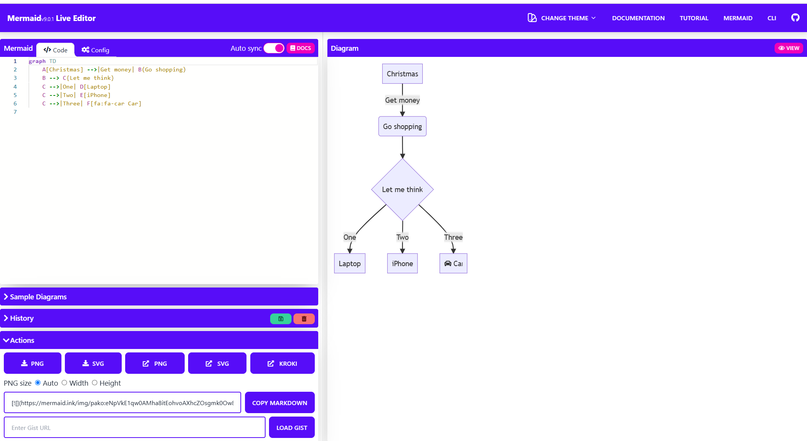

### Info

replica of the [mermaid-live-editor](https://github.com/mermaid-js/mermaid-live-editor) container for Edit, preview and share mermaid charts/diagrams taken
at `efafad1e8709854e77bea2d6f1abf212ed7482a9` to use node 18

### Usage
```sh
docker build -t mermaid-live -f Dockerfile .
```
```sh
docker run --name mermaid-live -p 8080:80  -d mermaid-live
```
```sh
docker ps 
```
```text
```
CONTAINER ID        IMAGE               COMMAND                  CREATED             STATUS              PORTS                  NAMES
85762a3f9290        mermaid-live                "/docker-entrypoint.…"   4 minutes ago       Up 4 minutes        0.0.0.0:8080->80/tcp   mermaid-live
```sh
curl -I http://192.168.99.100:8080/
```
```text
HTTP/1.1 200 OK
Server: nginx/1.30.3
Date: Fri, 24 Jul 2026 12:32:42 GMT
Content-Type: text/html
Content-Length: 2550
Last-Modified: Fri, 24 Jul 2026 05:51:14 GMT
Connection: keep-alive
ETag: "6a62fd52-9f6"
Accept-Ranges: bytes
```
open in the browser


### Troubleshooting
```sh
docker build -t test-alpine -f Dockerfile.alpine  .
```
```text
Sending build context to Docker daemon  546.8kB
Step 1/9 : FROM node:18.1.0-alpine AS builder
 ---> d94913fe64df
Step 2/9 : RUN apk update ../docker-web-gui/Dockerfile:    && apk add --update --no-cache python3 py3-pip g++ make docker-cli
 ---> Using cache
 ---> 384928ec0710
Step 3/9 : COPY --chown=node:node . /home
 ---> Using cache
 ---> 08532cf82e42
Step 4/9 : WORKDIR /home
 ---> Using cache
 ---> 1282ec7abf11
Step 5/9 : RUN yarn install
 ---> Running in ec77d198f5ac
yarn install v1.22.18
warning package.json: No license field
warning mermaid-live-editor@2.0.67: No license field
[1/4] Resolving packages...
[2/4] Fetching packages...
[3/4] Linking dependencies...
warning "analytics > @analytics/core > analytics-utils@1.0.10" has unmet peer dependency "@types/dlv@^1.0.0".
warning "mermaid > cypress-image-snapshot@4.0.1" has incorrect peer dependency "cypress@^4.5.0".
warning "mermaid > cypress-image-snapshot > jest-image-snapshot@4.2.0" has unmet peer dependency "jest@>=20 <=26".
[4/4] Building fresh packages...
error /home/node_modules/deasync: Command failed.
Exit code: 1
Command: node ./build.js
Arguments:
Directory: /home/node_modules/deasync
Output:
gyp info it worked if it ends with ok
gyp info using node-gyp@9.0.0
gyp info using node@18.1.0 | linux | x64
gyp info find Python using Python version 3.9.18 found at "/usr/bin/python3"
gyp http GET https://unofficial-builds.nodejs.org/download/release/v18.1.0/node-v18.1.0-headers.tar.gz
gyp http 200 https://unofficial-builds.nodejs.org/download/release/v18.1.0/node-v18.1.0-headers.tar.gz
gyp http GET https://unofficial-builds.nodejs.org/download/release/v18.1.0/SHASUMS256.txt
gyp http 200 https://unofficial-builds.nodejs.org/download/release/v18.1.0/SHASUMS256.txt
gyp info spawn /usr/bin/python3
gyp info spawn args [
gyp info spawn args   '/usr/local/lib/node_modules/npm/node_modules/node-gyp/gyp/gyp_main.py',
gyp info spawn args   'binding.gyp',
gyp info spawn args   '-f',
gyp info spawn args   'make',
gyp info spawn args   '-I',
gyp info spawn args   '/home/node_modules/deasync/build/config.gypi',
gyp info spawn args   '-I',
gyp info spawn args   '/usr/local/lib/node_modules/npm/node_modules/node-gyp/addon.gypi',
gyp info spawn args   '-I',
gyp info spawn args   '/root/.cache/node-gyp/18.1.0/include/node/common.gypi',
gyp info spawn args   '-Dlibrary=shared_library',
gyp info spawn args   '-Dvisibility=default',
gyp info spawn args   '-Dnode_root_dir=/root/.cache/node-gyp/18.1.0',
gyp info spawn args   '-Dnode_gyp_dir=/usr/local/lib/node_modules/npm/node_modules/node-gyp',
gyp info spawn args   '-Dnode_lib_file=/root/.cache/node-gyp/18.1.0/<(target_arch)/node.lib',
gyp info spawn args   '-Dmodule_root_dir=/home/node_modules/deasync',
gyp info spawn args   '-Dnode_engine=v8',
gyp info spawn args   '--depth=.',
gyp info spawn args   '--no-parallel',
gyp info spawn args   '--generator-output',
gyp info spawn args   'build',
gyp info spawn args   '-Goutput_dir=.'
gyp info spawn args ]
gyp info spawn make
gyp info spawn args [ 'BUILDTYPE=Release', '-C', 'build' ]
make: Entering directory '/home/node_modules/deasync/build'
make: printf: Operation not permitted
make: *** [deasync.target.mk:111: Release/obj.target/deasync/src/deasync.o] Error 127
make: Leaving directory '/home/node_modules/deasync/build'
gyp ERR! build error
gyp ERR! stack Error: `make` failed with exit code: 2
gyp ERR! stack     at ChildProcess.onExit (/usr/local/lib/node_modules/npm/node_modules/node-gyp/lib/build.js:194:23)
gyp ERR! stack     at ChildProcess.emit (node:events:527:28)
gyp ERR! stack     at ChildProcess._handle.onexit (node:internal/child_process:291:12)
gyp ERR! System Linux 4.19.130-boot2docker
gyp ERR! command "/usr/local/bin/node" "/usr/local/lib/node_modules/npm/node_modules/node-gyp/bin/node-gyp.js" "rebuild"
gyp ERR! cwd /home/node_modules/deasync
gyp ERR! node -v v18.1.0
gyp ERR! node-gyp -v v9.0.0
gyp ERR! not ok
Build failed
info Visit https://yarnpkg.com/en/docs/cli/install for documentation about this command.
The command '/bin/sh -c yarn install' returned a non-zero code: 1
```
in verbose run:
(fragment)
```text
verbose 122.227056749 Copying "/usr/local/share/.cache/yarn/v6/npm-monaco-editor-0.33.0-842e244f3750a2482f8a29c676b5684e75ff34af-integrity/node_modules/monaco-editor/esm/vs/editor/contrib/gotoSymbol/browser/link/goToDefinitionAtPosition.js" to "/home/node_modules/monaco-editor/esm/vs/editor/contrib/gotoSymbol/browser/link/goToDefinitionAtPosition.js".
verbose 122.227556443 Copying "/usr/local/share/.cache/yarn/v6/npm-monaco-editor-0.33.0-842e244f3750a2482f8a29c676b5684e75ff34af-integrity/node_modules/monaco-editor/esm/vs/editor/contrib/gotoSymbol/browser/peek/referencesController.js" to "/home/node_modules/monaco-editor/esm/vs/editor/contrib/gotoSymbol/browser/peek/referencesController.js".
verbose 122.227989488 Copying "/usr/local/share/.cache/yarn/v6/npm-monaco-editor-0.33.0-842e244f3750a2482f8a29c676b5684e75ff34af-integrity/node_modules/monaco-editor/esm/vs/editor/contrib/gotoSymbol/browser/peek/referencesTree.js" to "/home/node_modules/monaco-editor/esm/vs/editor/contrib/gotoSymbol/browser/peek/referencesTree.js".
verbose 122.228329838 Copying "/usr/local/share/.cache/yarn/v6/npm-monaco-editor-0.33.0-842e244f3750a2482f8a29c676b5684e75ff34af-integrity/node_modules/monaco-editor/esm/vs/editor/contrib/gotoSymbol/browser/peek/referencesWidget.css" to "/home/node_modules/monaco-editor/esm/vs/editor/contrib/gotoSymbol/browser/peek/referencesWidget.css".
verbose 122.228668807 Copying "/usr/local/share/.cache/yarn/v6/npm-monaco-editor-0.33.0-842e244f3750a2482f8a29c676b5684e75ff34af-integrity/node_modules/monaco-editor/esm/vs/editor/contrib/gotoSymbol/browser/peek/referencesWidget.js" to "/home/node_modules/monaco-editor/esm/vs/editor/contrib/gotoSymbol/browser/peek/referencesWidget.js".
verbose 122.229534582 Copying "/usr/local/share/.cache/yarn/v6/npm-monaco-editor-0.33.0-842e244f3750a2482f8a29c676b5684e75ff34af-integrity/node_modules/monaco-editor/esm/vs/editor/contrib/peekView/browser/media/peekViewWidget.css" to "/home/node_modules/monaco-editor/esm/vs/editor/contrib/peekView/browser/media/peekViewWidget.css".
verbose 122.230050347 Copying "/usr/local/share/.cache/yarn/v6/npm-monaco-editor-0.33.0-842e244f3750a2482f8a29c676b5684e75ff34af-integrity/node_modules/monaco-editor/esm/vs/editor/contrib/suggest/browser/media/suggest.css" to "/home/node_modules/monaco-editor/esm/vs/editor/contrib/suggest/browser/media/suggest.css".
verbose 122.230552368 Copying "/usr/local/share/.cache/yarn/v6/npm-monaco-editor-0.33.0-842e244f3750a2482f8a29c676b5684e75ff34af-integrity/node_modules/monaco-editor/min/vs/base/browser/ui/codicons/codicon/codicon.ttf" to "/home/node_modules/monaco-editor/min/vs/base/browser/ui/codicons/codicon/codicon.ttf".
[4/4] Building fresh packages...
verbose 123.490749895 [svelte-preprocess] Don't forget to install the preprocessors packages that will be used: node-sass/sass, stylus, less, postcss & postcss-load-config, coffeescript, pug, etc...
verbose 124.298364324
verbose 124.580080785
verbose 142.448562483 Error: /home/node_modules/deasync: Command failed.
Exit code: 1
Command: node ./build.js
Arguments:
Directory: /home/node_modules/deasync
Output:
gyp info it worked if it ends with ok
gyp info using node-gyp@9.0.0
gyp info using node@18.1.0 | linux | x64
gyp info find Python using Python version 3.9.18 found at "/usr/bin/python3"
gyp http GET https://unofficial-builds.nodejs.org/download/release/v18.1.0/node-v18.1.0-headers.tar.gz
gyp http 200 https://unofficial-builds.nodejs.org/download/release/v18.1.0/node-v18.1.0-headers.tar.gz
gyp http GET https://unofficial-builds.nodejs.org/download/release/v18.1.0/SHASUMS256.txt
gyp http 200 https://unofficial-builds.nodejs.org/download/release/v18.1.0/SHASUMS256.txt
gyp info spawn /usr/bin/python3
gyp info spawn args [
gyp info spawn args   '/usr/local/lib/node_modules/npm/node_modules/node-gyp/gyp/gyp_main.py',
gyp info spawn args   'binding.gyp',
gyp info spawn args   '-f',
gyp info spawn args   'make',
gyp info spawn args   '-I',
gyp info spawn args   '/home/node_modules/deasync/build/config.gypi',
gyp info spawn args   '-I',
gyp info spawn args   '/usr/local/lib/node_modules/npm/node_modules/node-gyp/addon.gypi',
gyp info spawn args   '-I',
gyp info spawn args   '/root/.cache/node-gyp/18.1.0/include/node/common.gypi',
gyp info spawn args   '-Dlibrary=shared_library',
gyp info spawn args   '-Dvisibility=default',
gyp info spawn args   '-Dnode_root_dir=/root/.cache/node-gyp/18.1.0',
gyp info spawn args   '-Dnode_gyp_dir=/usr/local/lib/node_modules/npm/node_modules/node-gyp',
gyp info spawn args   '-Dnode_lib_file=/root/.cache/node-gyp/18.1.0/<(target_arch)/node.lib',
gyp info spawn args   '-Dmodule_root_dir=/home/node_modules/deasync',
gyp info spawn args   '-Dnode_engine=v8',
gyp info spawn args   '--depth=.',
gyp info spawn args   '--no-parallel',
gyp info spawn args   '--generator-output',
gyp info spawn args   'build',
gyp info spawn args   '-Goutput_dir=.'
gyp info spawn args ]
gyp info spawn make
gyp info spawn args [ 'BUILDTYPE=Release', '-C', 'build' ]
make: Entering directory '/home/node_modules/deasync/build'
make: printf: Operation not permitted
make: *** [deasync.target.mk:111: Release/obj.target/deasync/src/deasync.o] Error 127
make: Leaving directory '/home/node_modules/deasync/build'
gyp ERR! build error
gyp ERR! stack Error: `make` failed with exit code: 2
gyp ERR! stack     at ChildProcess.onExit (/usr/local/lib/node_modules/npm/node_modules/node-gyp/lib/build.js:194:23)
gyp ERR! stack     at ChildProcess.emit (node:events:527:28)
gyp ERR! stack     at ChildProcess._handle.onexit (node:internal/child_process:291:12)
gyp ERR! System Linux 4.19.130-boot2docker
gyp ERR! command "/usr/local/bin/node" "/usr/local/lib/node_modules/npm/node_modules/node-gyp/bin/node-gyp.js" "rebuild"
gyp ERR! cwd /home/node_modules/deasync
gyp ERR! node -v v18.1.0
gyp ERR! node-gyp -v v9.0.0
gyp ERR! not ok
Build failed
    at ProcessTermError.ExtendableBuiltin (/opt/yarn-v1.22.18/lib/cli.js:721:66)
    at ProcessTermError.MessageError (/opt/yarn-v1.22.18/lib/cli.js:750:123)
    at new ProcessTermError (/opt/yarn-v1.22.18/lib/cli.js:790:113)
    at ChildProcess.<anonymous> (/opt/yarn-v1.22.18/lib/cli.js:25783:17)
    at ChildProcess.emit (node:events:527:28)
    at maybeClose (node:internal/child_process:1090:16)
    at ChildProcess._handle.onexit (node:internal/child_process:302:5)
error /home/node_modules/deasync: Command failed.
Exit code: 1
Command: node ./build.js
Arguments:
Directory: /home/node_modules/deasync
Output:
gyp info it worked if it ends with ok
gyp info using node-gyp@9.0.0
gyp info using node@18.1.0 | linux | x64
gyp info find Python using Python version 3.9.18 found at "/usr/bin/python3"
gyp http GET https://unofficial-builds.nodejs.org/download/release/v18.1.0/node-v18.1.0-headers.tar.gz
gyp http 200 https://unofficial-builds.nodejs.org/download/release/v18.1.0/node-v18.1.0-headers.tar.gz
gyp http GET https://unofficial-builds.nodejs.org/download/release/v18.1.0/SHASUMS256.txt
gyp http 200 https://unofficial-builds.nodejs.org/download/release/v18.1.0/SHASUMS256.txt
gyp info spawn /usr/bin/python3
gyp info spawn args [
gyp info spawn args   '/usr/local/lib/node_modules/npm/node_modules/node-gyp/gyp/gyp_main.py',
gyp info spawn args   'binding.gyp',
gyp info spawn args   '-f',
gyp info spawn args   'make',
gyp info spawn args   '-I',
gyp info spawn args   '/home/node_modules/deasync/build/config.gypi',
gyp info spawn args   '-I',
gyp info spawn args   '/usr/local/lib/node_modules/npm/node_modules/node-gyp/addon.gypi',
gyp info spawn args   '-I',
gyp info spawn args   '/root/.cache/node-gyp/18.1.0/include/node/common.gypi',
gyp info spawn args   '-Dlibrary=shared_library',
gyp info spawn args   '-Dvisibility=default',
gyp info spawn args   '-Dnode_root_dir=/root/.cache/node-gyp/18.1.0',
gyp info spawn args   '-Dnode_gyp_dir=/usr/local/lib/node_modules/npm/node_modules/node-gyp',
gyp info spawn args   '-Dnode_lib_file=/root/.cache/node-gyp/18.1.0/<(target_arch)/node.lib',
gyp info spawn args   '-Dmodule_root_dir=/home/node_modules/deasync',
gyp info spawn args   '-Dnode_engine=v8',
gyp info spawn args   '--depth=.',
gyp info spawn args   '--no-parallel',
gyp info spawn args   '--generator-output',
gyp info spawn args   'build',
gyp info spawn args   '-Goutput_dir=.'
gyp info spawn args ]
gyp info spawn make
gyp info spawn args [ 'BUILDTYPE=Release', '-C', 'build' ]
make: Entering directory '/home/node_modules/deasync/build'
make: printf: Operation not permitted
make: *** [deasync.target.mk:111: Release/obj.target/deasync/src/deasync.o] Error 127
make: Leaving directory '/home/node_modules/deasync/build'
gyp ERR! build error
gyp ERR! stack Error: `make` failed with exit code: 2
gyp ERR! stack     at ChildProcess.onExit (/usr/local/lib/node_modules/npm/node_modules/node-gyp/lib/build.js:194:23)
gyp ERR! stack     at ChildProcess.emit (node:events:527:28)
gyp ERR! stack     at ChildProcess._handle.onexit (node:internal/child_process:291:12)
gyp ERR! System Linux 4.19.130-boot2docker
gyp ERR! command "/usr/local/bin/node" "/usr/local/lib/node_modules/npm/node_modules/node-gyp/bin/node-gyp.js" "rebuild"
gyp ERR! cwd /home/node_modules/deasync
gyp ERR! node -v v18.1.0
gyp ERR! node-gyp -v v9.0.0
gyp ERR! not ok
Build failed
info Visit https://yarnpkg.com/en/docs/cli/install for documentation about this command.
verbose 167.856598433 Installing Cypress (version: 9.6.0)

[STARTED] Task without title.
[TITLE]  Downloading Cypress      0% 0s
[TITLE]  Downloading Cypress      1% 62s
...
[TITLE]  Downloading Cypress      99% 0s
[TITLE]  Downloaded Cypress
[SUCCESS]  Downloaded Cypress
[STARTED] Task without title.
[TITLE]  Unzipping Cypress        0% 0s
[TITLE]  Unzipping Cypress        1% 613s
...
[TITLE]  Unzipping Cypress        8% 226s
[TITLE]  Unzipping Cypress        8% 268s
[TITLE]  Unzipping Cypress        100% 0s
[TITLE]  Unzipped Cypress
[SUCCESS]  Unzipped Cypress
[STARTED] Task without title.
[TITLE]  Finished Installation   /root/.cache/Cypress/9.6.0
[SUCCESS]  Finished Installation   /root/.cache/Cypress/9.6.0

You can now open Cypress by running: node_modules/.bin/cypress open

https://on.cypress.io/installing-cypress
The command '/bin/sh -c set -ex     && yarn install --verbose' returned a non-zero code: 1
```

adding further modifications resolved the original issue without providing the clue what was wrong

```sh
docker build -t test-alpine -f Dockerfile.alpine  .
```
```text
Step 1/12 : FROM node:18.1.0-alpine AS builder
 ---> d94913fe64df
Step 2/12 : RUN apk update     && apk add --update --no-cache python3 py3-pip g++ make
 ---> Using cache
 ---> 5527fabdde1a
Step 3/12 : COPY --chown=node:node . /home
 ---> ce300f7ac090
Step 4/12 : WORKDIR /home
 ---> Running in ed6491589add
Removing intermediate container ed6491589add
 ---> 00986ee857a6
Step 5/12 : USER root
 ---> Running in 518e7de10da7
Removing intermediate container 518e7de10da7
 ---> d34d944230bd
Step 6/12 : RUN yarn install --ignore-scripts
 ---> Running in 1241c78a8152
yarn install v1.22.18
warning package.json: No license field
warning mermaid-live-editor@2.0.67: No license field
[1/4] Resolving packages...
[2/4] Fetching packages...
[3/4] Linking dependencies...
warning "analytics > @analytics/core > analytics-utils@1.0.10" has unmet peer dependency "@types/dlv@^1.0.0".
warning "mermaid > cypress-image-snapshot@4.0.1" has incorrect peer dependency "cypress@^4.5.0".
warning "mermaid > cypress-image-snapshot > jest-image-snapshot@4.2.0" has unmet peer dependency "jest@>=20 <=26".
[4/4] Building fresh packages...
warning Ignored scripts due to flag.
Done in 106.16s.
Removing intermediate container 1241c78a8152
 ---> 92069c4f5375
Step 7/12 : RUN cd node_modules/deasync &&     node /usr/local/lib/node_modules/npm/node_modules/node-gyp/bin/node-gyp.js configure
 ---> Running in 8663ab46d04d
gyp info it worked if it ends with ok
gyp info using node-gyp@9.0.0
gyp info using node@18.1.0 | linux | x64
gyp info find Python using Python version 3.9.18 found at "/usr/bin/python3"
gyp http GET https://unofficial-builds.nodejs.org/download/release/v18.1.0/node-v18.1.0-headers.tar.gz
gyp http 200 https://unofficial-builds.nodejs.org/download/release/v18.1.0/node-v18.1.0-headers.tar.gz
gyp http GET https://unofficial-builds.nodejs.org/download/release/v18.1.0/SHASUMS256.txt
gyp http 200 https://unofficial-builds.nodejs.org/download/release/v18.1.0/SHASUMS256.txt
gyp info spawn /usr/bin/python3
gyp info spawn args [
gyp info spawn args   '/usr/local/lib/node_modules/npm/node_modules/node-gyp/gyp/gyp_main.py',
gyp info spawn args   'binding.gyp',
gyp info spawn args   '-f',
gyp info spawn args   'make',
gyp info spawn args   '-I',
gyp info spawn args   '/home/node_modules/deasync/build/config.gypi',
gyp info spawn args   '-I',
gyp info spawn args   '/usr/local/lib/node_modules/npm/node_modules/node-gyp/addon.gypi',
gyp info spawn args   '-I',
gyp info spawn args   '/root/.cache/node-gyp/18.1.0/include/node/common.gypi',
gyp info spawn args   '-Dlibrary=shared_library',
gyp info spawn args   '-Dvisibility=default',
gyp info spawn args   '-Dnode_root_dir=/root/.cache/node-gyp/18.1.0',
gyp info spawn args   '-Dnode_gyp_dir=/usr/local/lib/node_modules/npm/node_modules/node-gyp',
gyp info spawn args   '-Dnode_lib_file=/root/.cache/node-gyp/18.1.0/<(target_arch)/node.lib',
gyp info spawn args   '-Dmodule_root_dir=/home/node_modules/deasync',
gyp info spawn args   '-Dnode_engine=v8',
gyp info spawn args   '--depth=.',
gyp info spawn args   '--no-parallel',
gyp info spawn args   '--generator-output',
gyp info spawn args   'build',
gyp info spawn args   '-Goutput_dir=.'
gyp info spawn args ]
gyp info ok
Removing intermediate container 8663ab46d04d
 ---> 179c73648fb1
Step 8/12 : RUN nl -ba node_modules/deasync/build/deasync.target.mk | sed -n '100,120p'
 ---> Running in 4d1667ed8d93
   100  all_deps += $(OBJS)
   101
   102  # CFLAGS et al overrides must be target-local.
   103  # See "Target-specific Variable Values" in the GNU Make manual.
   104  $(OBJS): TOOLSET := $(TOOLSET)
   105  $(OBJS): GYP_CFLAGS := $(DEFS_$(BUILDTYPE)) $(INCS_$(BUILDTYPE))  $(CFLAGS_$(BUILDTYPE)) $(CFLAGS_C_$(BUILDTYPE))
   106  $(OBJS): GYP_CXXFLAGS := $(DEFS_$(BUILDTYPE)) $(INCS_$(BUILDTYPE))  $(CFLAGS_$(BUILDTYPE)) $(CFLAGS_CC_$(BUILDTYPE))
   107
   108  # Suffix rules, putting all outputs into $(obj).
   109
   110  $(obj).$(TOOLSET)/$(TARGET)/%.o: $(srcdir)/%.cc FORCE_DO_CMD
   111          @$(call do_cmd,cxx,1)
   112
   113  # Try building from generated source, too.
   114
   115  $(obj).$(TOOLSET)/$(TARGET)/%.o: $(obj).$(TOOLSET)/%.cc FORCE_DO_CMD
   116          @$(call do_cmd,cxx,1)
   117
   118  $(obj).$(TOOLSET)/$(TARGET)/%.o: $(obj)/%.cc FORCE_DO_CMD
   119          @$(call do_cmd,cxx,1)
   120
Removing intermediate container 4d1667ed8d93
 ---> 3a33b8b9cd7d
Step 9/12 : RUN yarn build
 ---> Running in a7b9aac33c73
yarn run v1.22.18
warning package.json: No license field
$ svelte-kit build
vite v2.9.1 building for production...
transforming...
Browserslist: caniuse-lite is outdated. Please run:
  npx browserslist@latest --update-db
  Why you should do it regularly: https://github.com/browserslist/browserslist#browsers-data-updating

🌼 daisyUI components 2.14.2  https://github.com/saadeghi/daisyui
  ✔︎ Including:  base, components, themes[29], utilities


🌼 daisyUI components 2.14.2  https://github.com/saadeghi/daisyui
  ✔︎ Including:  base, components, themes[29], utilities

Use of eval is strongly discouraged, as it poses security risks and may cause issues with minification
✓ 72 modules transformed.
rendering chunks...
.svelte-kit/output/client/_app/manifest.json                                       3.70 KiB
.svelte-kit/output/client/_app/start-d8e4d14a.js                                   23.14 KiB / gzip: 8.49 KiB
.svelte-kit/output/client/_app/pages/__layout.svelte-cfeeb53e.js                   2.37 KiB / gzip: 1.26 KiB
.svelte-kit/output/client/_app/error.svelte-fc26f7f7.js                            1.56 KiB / gzip: 0.75 KiB
.svelte-kit/output/client/_app/pages/index.svelte-4aea3fb3.js                      0.88 KiB / gzip: 0.54 KiB
.svelte-kit/output/client/_app/pages/view.svelte-49f8715f.js                       0.55 KiB / gzip: 0.34 KiB
.svelte-kit/output/client/_app/chunks/index-3ccfa173.js                            10.59 KiB / gzip: 4.44 KiB
.svelte-kit/output/client/_app/chunks/preload-helper-d25c422b.js                   1.33 KiB / gzip: 0.80 KiB
.svelte-kit/output/client/_app/chunks/paths-396f020f.js                            0.08 KiB / gzip: 0.09 KiB
.svelte-kit/output/client/_app/chunks/singletons-d1fb5791.js                       0.05 KiB / gzip: 0.07 KiB
.svelte-kit/output/client/_app/chunks/theme-bc5599cb.js                            0.36 KiB / gzip: 0.27 KiB
.svelte-kit/output/client/_app/chunks/analytics.browser.es-da2e3609.js             31.16 KiB / gzip: 11.20 KiB
.svelte-kit/output/client/_app/chunks/analytics-plugin-ga.browser.es-1cdb0512.js   4.93 KiB / gzip: 2.02 KiB
.svelte-kit/output/client/_app/assets/pages/edit.svelte-3300ec7f.css               0.53 KiB / gzip: 0.29 KiB
.svelte-kit/output/client/_app/assets/util-c948b67a.css                            0.10 KiB / gzip: 0.10 KiB
.svelte-kit/output/client/_app/assets/pages/__layout.svelte-bf8d7cca.css           66.53 KiB / gzip: 11.29 KiB
.svelte-kit/output/client/_app/chunks/state-2db98e3a.js                            78.33 KiB / gzip: 23.73 KiB
.svelte-kit/output/client/_app/pages/edit.svelte-cf77660e.js                       115.30 KiB / gzip: 37.91 KiB
.svelte-kit/output/client/_app/chunks/util-3a497aa7.js                             1150.19 KiB / gzip: 325.54 KiB

(!) Some chunks are larger than 500 KiB after minification. Consider:
- Using dynamic import() to code-split the application
- Use build.rollupOptions.output.manualChunks to improve chunking: https://rollupjs.org/guide/en/#outputmanualchunks
- Adjust chunk size limit for this warning via build.chunkSizeWarningLimit.
vite v2.9.1 building SSR bundle for production...
transforming...
Use of eval is strongly discouraged, as it poses security risks and may cause issues with minification
✓ 51 modules transformed.
rendering chunks...
.svelte-kit/output/server/manifest.json                                      2.73 KiB
.svelte-kit/output/server/index.js                                           77.23 KiB
.svelte-kit/output/server/entries/endpoints/manifest.json.ts.js              0.68 KiB
.svelte-kit/output/server/entries/endpoints/_fallback_/manifest.json.ts.js   0.13 KiB
.svelte-kit/output/server/entries/pages/__layout.svelte.js                   1.77 KiB
.svelte-kit/output/server/entries/fallbacks/error.svelte.js                  0.72 KiB
.svelte-kit/output/server/entries/pages/edit.svelte.js                       25.32 KiB
.svelte-kit/output/server/entries/pages/index.svelte.js                      0.99 KiB
.svelte-kit/output/server/entries/pages/view.svelte.js                       0.47 KiB
.svelte-kit/output/server/chunks/paths-396f020f.js                           0.16 KiB
.svelte-kit/output/server/chunks/index-9f56e196.js                           3.88 KiB
.svelte-kit/output/server/chunks/theme-22f040df.js                           0.20 KiB
.svelte-kit/output/server/chunks/state-efe5b6a9.js                           29.15 KiB
.svelte-kit/output/server/chunks/history-4446fa52.js                         1.72 KiB
.svelte-kit/output/server/chunks/hooks-4d9cb55e.js                           0.15 KiB

Run npm run preview to preview your production build locally.

> Using @sveltejs/adapter-static
  You should set `config.kit.prerender.default` to `true` if no fallback is specified
  Wrote site to "docs"
  ✔ done
Done in 34.43s.
Removing intermediate container a7b9aac33c73
 ---> 80713860b020
Step 10/12 : FROM nginx:1.30.3-alpine3.23 as runner
 ---> d0701bd41f82
Step 11/12 : COPY ./nginx.conf /etc/nginx/conf.d/default.conf
 ---> Using cache
 ---> 9e0d6f998e95
Step 12/12 : COPY --from=builder --chown=nginx:nginx /home/docs /usr/share/nginx/html
 ---> e15ce13d3ac2
Successfully built e15ce13d3ac2
Successfully tagged test-alpine:latest
```


### Background

[Mermaid](https://en.wikipedia.org/wiki/Mermaid_(software)) - is an open-source JavaScript-based diagramming and charting software from a Markdown-like syntax flow DSL similar and more advanded than Graphviz scored in the Most Exciting Use of Technology
[Mermaid Wiki](https://mermaid.ai/open-source/intro/index.html)

[Live App](https://mermaid.live/) to learn practice


There official __Mermaid Live Editor__  Docker image is hosted on [GitHub Container Registry](ghcr.io/mermaid-js/mermaid-live-editor/mermaid-live-editor) (__GHCR__) 

### Author
[Serguei Kouzmine](kouzmine_serguei@yahoo.com)
