### Info

replica of the [mermaid-live-editor](https://github.com/mermaid-js/mermaid-live-editor) container for Edit, preview and share mermaid charts/diagrams taken
at `efafad1e8709854e77bea2d6f1abf212ed7482a9` to use node 18
### Usage


```sh
docker pull node:18.1.0-alpine
docker build -t test-alpine -f Dockerfile .
```
```text
Sending build context to Docker daemon  564.2kB
Step 1/10 : FROM node:18.1.0-alpine AS builder
18.1.0-alpine: Pulling from library/node
...
Digest: sha256:f4d6916c5625853e81994b5cb53ad3eb27e5fec9451c579d298fee0c508fe621
Status: Downloaded newer image for node:18.1.0-alpine
 ---> d94913fe64df
Step 2/10 : RUN apk update     && apk add --update --no-cache python3 py3-pip g++ make
 ---> Running in 571a493a3296
fetch https://dl-cdn.alpinelinux.org/alpine/v3.15/main/x86_64/APKINDEX.tar.gz
fetch https://dl-cdn.alpinelinux.org/alpine/v3.15/community/x86_64/APKINDEX.tar.gz
v3.15.11-31-g2a2ec278a7b [https://dl-cdn.alpinelinux.org/alpine/v3.15/main]
v3.15.11-31-g2a2ec278a7b [https://dl-cdn.alpinelinux.org/alpine/v3.15/community]
OK: 15865 distinct packages available
fetch https://dl-cdn.alpinelinux.org/alpine/v3.15/main/x86_64/APKINDEX.tar.gz
fetch https://dl-cdn.alpinelinux.org/alpine/v3.15/community/x86_64/APKINDEX.tar.gz
(1/51) Upgrading musl (1.2.2-r7 -> 1.2.2-r9)
(2/51) Installing binutils (2.37-r3)
...
(51/51) Installing py3-pip (20.3.4-r1)
Executing busybox-1.34.1-r5.trigger
OK: 257 MiB in 66 packages
 ---> Removed intermediate container 571a493a3296
 ---> 5e3077a07ebb
Step 3/10 : COPY --chown=node:node . /home
 ---> 61da5dbd7a70
Step 4/10 : WORKDIR /home
 ---> Running in 6cee117a33c8
 ---> Removed intermediate container 6cee117a33c8
 ---> c25f23c9468e
Step 5/10 : RUN yarn install --ignore-scripts
 ---> Running in 0b18a4b0f925
yarn install v1.22.18
warning package.json: No license field
warning mermaid-live-editor@2.0.67: No license field
[1/4] Resolving packages...
[2/4] Fetching packages...
[3/4] Linking dependencies...
warning "analytics > @analytics/core > analytics-utils@1.0.10" has unmet peer dependency "@types/dlv@^1.0.0".
warning "mermaid > cypress-image-snapshot@4.0.1" has incorrect peer dependency "cypress@^4.5.0".
warning "mermaid > cypress-image-snapshot > jest-image-snapshot@4.2.0" has unmet peer dependency "jest@>=20 <=26".
[4/4] Building fresh packages...
warning Ignored scripts due to flag.
Done in 58.95s.
 ---> Removed intermediate container 0b18a4b0f925
 ---> 86d27a57da55
Step 6/10 : RUN cd node_modules/deasync &&     node /usr/local/lib/node_modules/npm/node_modules/node-gyp/bin/node-gyp.js configure
 ---> Running in ec9fb22604bd
gyp info it worked if it ends with ok
gyp info using node-gyp@9.0.0
gyp info using node@18.1.0 | linux | x64
gyp info find Python using Python version 3.9.18 found at "/usr/bin/python3"
gyp http GET https://unofficial-builds.nodejs.org/download/release/v18.1.0/node-v18.1.0-headers.tar.gz
gyp http 200 https://unofficial-builds.nodejs.org/download/release/v18.1.0/node-v18.1.0-headers.tar.gz
gyp http GET https://unofficial-builds.nodejs.org/download/release/v18.1.0/SHASUMS256.txt
gyp http 200 https://unofficial-builds.nodejs.org/download/release/v18.1.0/SHASUMS256.txt
gyp info spawn /usr/bin/python3
gyp info spawn args [
gyp info spawn args   '/usr/local/lib/node_modules/npm/node_modules/node-gyp/gyp/gyp_main.py',
gyp info spawn args   'binding.gyp',
gyp info spawn args   '-f',
gyp info spawn args   'make',
gyp info spawn args   '-I',
gyp info spawn args   '/home/node_modules/deasync/build/config.gypi',
gyp info spawn args   '-I',
gyp info spawn args   '/usr/local/lib/node_modules/npm/node_modules/node-gyp/addon.gypi',
gyp info spawn args   '-I',
gyp info spawn args   '/root/.cache/node-gyp/18.1.0/include/node/common.gypi',
gyp info spawn args   '-Dlibrary=shared_library',
gyp info spawn args   '-Dvisibility=default',
gyp info spawn args   '-Dnode_root_dir=/root/.cache/node-gyp/18.1.0',
gyp info spawn args   '-Dnode_gyp_dir=/usr/local/lib/node_modules/npm/node_modules/node-gyp',
gyp info spawn args   '-Dnode_lib_file=/root/.cache/node-gyp/18.1.0/<(target_arch)/node.lib',
gyp info spawn args   '-Dmodule_root_dir=/home/node_modules/deasync',
gyp info spawn args   '-Dnode_engine=v8',
gyp info spawn args   '--depth=.',
gyp info spawn args   '--no-parallel',
gyp info spawn args   '--generator-output',
gyp info spawn args   'build',
gyp info spawn args   '-Goutput_dir=.'
gyp info spawn args ]
gyp info ok
 ---> Removed intermediate container ec9fb22604bd
 ---> f1bd279b6651
Step 7/10 : RUN yarn build
 ---> Running in aeef5dfad0f5
yarn run v1.22.18
warning package.json: No license field
$ svelte-kit build
vite v2.9.1 building for production...
transforming...
Browserslist: caniuse-lite is outdated. Please run:
  npx browserslist@latest --update-db
  Why you should do it regularly: https://github.com/browserslist/browserslist#browsers-data-updating

🌼 daisyUI components 2.14.2  https://github.com/saadeghi/daisyui
  ✔︎ Including:  base, components, themes[29], utilities


🌼 daisyUI components 2.14.2  https://github.com/saadeghi/daisyui
  ✔︎ Including:  base, components, themes[29], utilities

Use of eval is strongly discouraged, as it poses security risks and may cause issues with minification
✓ 72 modules transformed.
rendering chunks...
.svelte-kit/output/client/_app/manifest.json                                       3.70 KiB
...
.svelte-kit/output/client/_app/chunks/util-3a497aa7.js                             1150.19 KiB / gzip: 325.54 KiB

(!) Some chunks are larger than 500 KiB after minification. Consider:
- Using dynamic import() to code-split the application
- Use build.rollupOptions.output.manualChunks to improve chunking: https://rollupjs.org/guide/en/#outputmanualchunks
- Adjust chunk size limit for this warning via build.chunkSizeWarningLimit.
vite v2.9.1 building SSR bundle for production...
transforming...
Use of eval is strongly discouraged, as it poses security risks and may cause issues with minification
✓ 51 modules transformed.
rendering chunks...
.svelte-kit/output/server/manifest.json                                      2.73 KiB
.svelte-kit/output/server/index.js                                           77.13 KiB
...
.svelte-kit/output/server/chunks/hooks-4d9cb55e.js                           0.15 KiB

Run npm run preview to preview your production build locally.

> Using @sveltejs/adapter-static
  You should set `config.kit.prerender.default` to `true` if no fallback is specified
  Wrote site to "docs"
  ✔ done
Done in 16.49s.
 ---> Removed intermediate container aeef5dfad0f5
 ---> 2481935dfd7e
Step 8/10 : FROM nginx:1.30.3-alpine3.23 as runner
1.30.3-alpine3.23: Pulling from library/nginx
e6f31ffc071e: Pulling fs layer
...
f72ca0003135: Verifying Checksum
f72ca0003135: Download complete
f72ca0003135: Pull complete
Digest: sha256:0d3b80406a13a767339fbe2f41406d6c7da727ab89cf8fae399e81f780f814d1
Status: Downloaded newer image for nginx:1.30.3-alpine3.23
 ---> d0701bd41f82
Step 9/10 : COPY ./nginx.conf /etc/nginx/conf.d/default.conf
 ---> 461931964b11
Step 10/10 : COPY --from=builder --chown=nginx:nginx /home/docs /usr/share/nginx/html
 ---> acb997d6ff06
Successfully built acb997d6ff06
Successfully tagged test-alpine:latest
```

```sh
docker image ls
```
```text
REPOSITORY          TAG                 IMAGE ID            CREATED             SIZE
test-alpine         latest              1e52490045c7        6 hours ago         63.8MB
<none>              <none>              6c2f2d0a9aad        6 hours ago         1.41GB
nginx               1.30.3-alpine3.23   d0701bd41f82        4 weeks ago         62.2MB
node                18.1.0-alpine       d94913fe64df        4 years ago         171MB
```
```sh
docker run --name mermaid-live -p 8080:80 -d test-alpine
```
```sh
docker ps
```
```text
CONTAINER ID        IMAGE               COMMAND                  CREATED             STATUS              PORTS                  NAMES
653671f1d219        test-alpine         "/docker-entrypoint.…"   6 seconds ago       Up 6 seconds        0.0.0.0:8080->80/tcp   mermaid-live
```

```sh
curl -I http://192.168.99.100:8080/
```
```text
HTTP/1.1 200 OK
Server: nginx/1.30.3
Date: Fri, 24 Jul 2026 12:32:42 GMT
Content-Type: text/html
Content-Length: 2550
Last-Modified: Fri, 24 Jul 2026 05:51:14 GMT
Connection: keep-alive
ETag: "6a62fd52-9f6"
Accept-Ranges: bytes
```
open in the browser
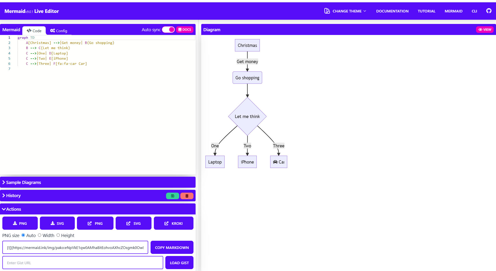

#### Using the generated static site without Docker

> NOTE: may need to stop Python server if running and leave `dist`

```sh
rm -fr dist
docker cp mermaid-live:/usr/share/nginx/html dist
```
The application is generated as a static web site (`docs/`). It can be served by any HTTP server.

However, Simply opening `index.html` with the `file://` protocol will not work because modern browsers block module loading and requests such as `manifest.json` from the local file system.


```cmd
pushd dist
start "c:\Program Files\Google\Chrome\Application\chrome.exe" file://%cd%\index.html
```
will fail with
```text
Access to manifest at 'file:///C:/developer/sergueik/springboot_study/basic-mermaid/dist/manifest.json' from origin 'null' has been blocked by CORS policy: Cross origin requests are only supported for protocol schemes: chrome, chrome-extension, chrome-untrusted, data, http, https, isolated-app.
manifest.json:1  Failed to load resource: net::ERR_FAILED
index.html:65 Access to script at 'file:///C:/_app/start-d8e4d14a.js' from origin 'null' has been blocked by CORS policy: Cross origin requests are only supported for protocol schemes: chrome, chrome-extension, chrome-untrusted, data, http, https, isolated-app.
start-d8e4d14a.js:1  Failed to load resource: net::ERR_FAILED
index.html:65 Access to script at 'file:///C:/_app/chunks/index-3ccfa173.js' from origin 'null' has been blocked by CORS policy: Cross origin requests are only supported for protocol schemes: chrome, chrome-extension, chrome-untrusted, data, http, https, isolated-app.
index-3ccfa173.js:1  Failed to load resource: net::ERR_FAILED
index.html:65 Access to script at 'file:///C:/_app/chunks/preload-helper-d25c422b.js' from origin 'null' has been blocked by CORS policy: Cross origin requests are only supported for protocol schemes: chrome, chrome-extension, chrome-untrusted, data, http, https, isolated-app.
preload-helper-d25c422b.js:1
```

The generated site must be served over HTTP. Any static web server can be used, for example:
```cmd
pushd dist
python.exe -m http.server
```
```text
Serving HTTP on :: port 8000 (http://[::]:8000/) ...
```
then open the site in the browser `http://localhost:8000`

if seeing errors:
```text
Fetch event handler is recognized as no-op. No-op fetch handler may bring overhead during navigation. Consider removing the handler if possible.
(index):5  GET http://localhost:8000/assets/index-BGiIaHVw.js net::ERR_ABORTED 404 (File not found)
(index):6  GET http://localhost:8000/assets/chunk-Y2CYZVJY-DsF7k-Jl.js net::ERR_ABORTED 404 (File not found)
```
rebuild and copy the `dist`

if seeing
```text

fetch https://dl-cdn.alpinelinux.org/alpine/v3.15/main/x86_64/APKINDEX.tar.gz
ERROR: https://dl-cdn.alpinelinux.org/alpine/v3.15/main: temporary error (try again later)
WARNING: Ignoring https://dl-cdn.alpinelinux.org/alpine/v3.15/main: No such file or directory
```
while
```sh
curl -I https://dl-cdn.alpinelinux.org/alpine/v3.15/main/x86_64/APKINDEX.tar.gz
```


```text
HTTP/2 200
content-security-policy: script-src 'self'
content-type: application/octet-stream
etag: "6a08aac9-9c436"
last-modified: Sat, 16 May 2026 17:35:05 GMT
referrer-policy: origin-when-cross-origin
server: nginx/1.29.0
strict-transport-security: max-age=63072000; includeSubDomains; preload
x-content-type-options: nosniff
x-frame-options: DENY
via: 1.1 varnish, 1.1 varnish
accept-ranges: bytes
age: 3
date: Wed, 29 Jul 2026 12:17:02 GMT
x-served-by: cache-ams-eham8680062-AMS, cache-mia-kfll1870035-MIA
x-cache: HIT, HIT
x-cache-hits: 2491882, 0
x-timer: S1785327423.519932,VS0,VE110
vary: Origin
content-length: 640054
```
examine network connection


### Fixing a Chrome "Cache Miss" / Stale Asset Problem Caused by a Service Worker

If you see an Alpine package fetch failure such as:

```text
fetch https://dl-cdn.alpinelinux.org/alpine/v3.15/main/x86_64/APKINDEX.tar.gz
ERROR: https://dl-cdn.alpinelinux.org/alpine/v3.15/main: temporary error (try again later)
WARNING: Ignoring https://dl-cdn.alpinelinux.org/alpine/v3.15/main: No such file or directory
```

but a direct request succeeds:

```sh
curl -I https://dl-cdn.alpinelinux.org/alpine/v3.15/main/x86_64/APKINDEX.tar.gz
```

```text
HTTP/2 200
...
```

first verify that the network connection is actually working. A successful `curl` response indicates the CDN is reachable, so the problem is likely elsewhere.

Likewise, if your local HTTP server logs contain a long sequence of `404` responses for hashed Vite assets, followed by:

```text
GET /service-worker.js HTTP/1.1" 304 -
```

but **no**

```text
GET / HTTP/1.1
```

request, for example:

```text
GET /assets/index-BGiIaHVw.js HTTP/1.1" 404 -
GET /assets/path-BWPyau1x.js HTTP/1.1" 404 -
...
GET /service-worker.js HTTP/1.1" 304 -
```

then Chrome may still be running a previously installed **Service Worker** that is intercepting navigation requests and serving an outdated application shell.

The stale Service Worker continues referencing JavaScript bundles that no longer exist after a rebuild, producing many `404` errors.

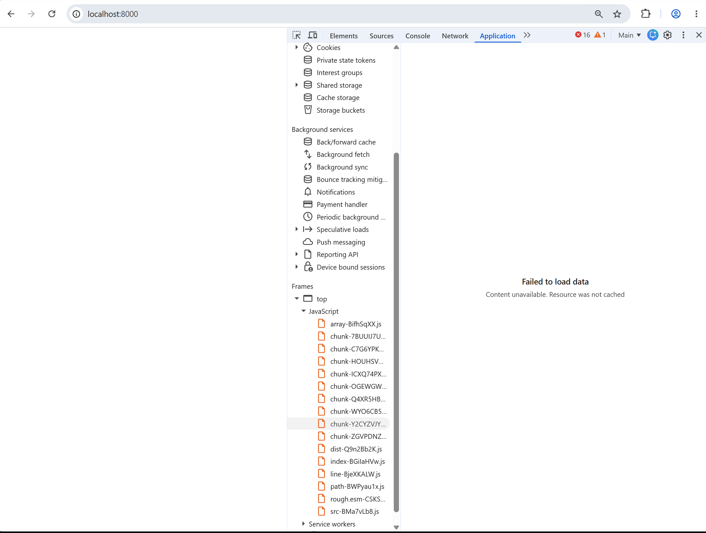


#### Confirm the Issue

Examine page source as seen on the browser

```html

<!doctype html>
<html>
<head>
  <title>Mermaid React</title>
  <script type="module" crossorigin src="/assets/index-BGiIaHVw.js"></script>
  <link rel="modulepreload" crossorigin href="/assets/chunk-Y2CYZVJY-DsF7k-Jl.js">
  <link rel="modulepreload" crossorigin href="/assets/src-BMa7vLb8.js">
  <link rel="modulepreload" crossorigin href="/assets/chunk-WYO6CB5R-C36byBU-.js">
  <link rel="modulepreload" crossorigin href="/assets/dist-Q9n2Bb2K.js">
  <link rel="modulepreload" crossorigin href="/assets/chunk-ICXQ74PX-_B4UKQEp.js">
  <link rel="modulepreload" crossorigin href="/assets/path-BWPyau1x.js">
  <link rel="modulepreload" crossorigin href="/assets/array-BifhSqXX.js">
  <link rel="modulepreload" crossorigin href="/assets/line-BjeXKALW.js">
  <link rel="modulepreload" crossorigin href="/assets/chunk-C7G6YPKG-WgqYOC9I.js">
  <link rel="modulepreload" crossorigin href="/assets/chunk-OGEWGWER-q1FVTapY.js">
  <link rel="modulepreload" crossorigin href="/assets/chunk-HOUHSVGY-BrlsNa-I.js">
  <link rel="modulepreload" crossorigin href="/assets/chunk-Q4XR5HBZ-DuMv4AAJ.js">
  <link rel="modulepreload" crossorigin href="/assets/rough.esm-CSKSodPl.js">
  <link rel="modulepreload" crossorigin href="/assets/chunk-ZGVPDNZ5-7E3CyR1q.js">
  <link rel="modulepreload" crossorigin href="/assets/chunk-7BUUIJ7U-Bb538aSH.js">
</head>
<body>
  <div id="root"></div>
</body>
</html>

```
to see it is indeed stale

#### Verify the Service Worker

Open:

```text
chrome://serviceworker-internals/
```

Locate the registration whose scope matches your application, for example:

```text
Scope: http://localhost:8000/
```

You should see information similar to:

```text
Scope: http://localhost:8000/
Storage key:
Origin: http://localhost:8000
Registration ID: 133

Active worker:
Installation Status: ACTIVATED
Running Status: RUNNING
Fetch handler existence: EXISTS

Script:
http://localhost:8000/service-worker.js

Clients:
http://localhost:8000/
...
```

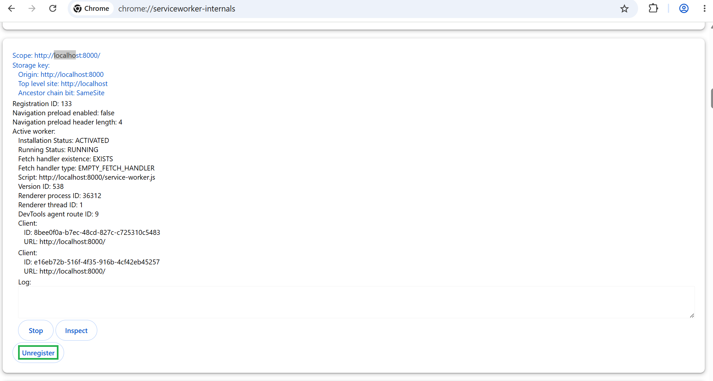

#### Recycle the stale Service Worker

1. Click **Unregister**.
2. Open **Application → Storage** in Chrome DevTools.
3. Click **Clear site data**.
4. Reload the page.

The HTTP server should now receive a normal navigation request:

```text
GET / HTTP/1.1" 200 -
```

instead of immediately requesting obsolete hashed assets.

The application should now load correctly.

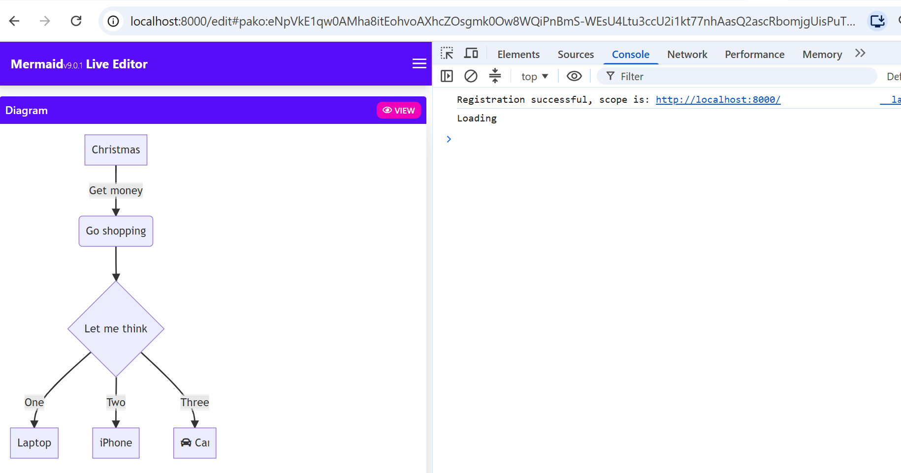

#### Notes

- A `304 Not Modified` for `service-worker.js` simply means Chrome reused the existing Service Worker because the server indicated it had not changed.
- The absence of `GET /` in the server log is a strong indicator that the Service Worker is intercepting navigation before it reaches the web server.
- This issue commonly appears after rebuilding a Vite application because each build generates new hashed asset names while an old Service Worker may continue referencing the previous ones.

As an alternative during development, you can serve the project using the VS Code **Live Server** extension instead of a manually started HTTP server. This often provides a simpler workflow for static content and makes it easier to verify that you're serving the latest build.

also if the web sevrer logs  have `304`  wirh `service-worker.js`:
```text
::1 - - [29/Jul/2026 08:48:14] code 404, message File not found
::1 - - [29/Jul/2026 08:48:14] "GET /assets/index-BGiIaHVw.js HTTP/1.1" 404 -
::1 - - [29/Jul/2026 08:48:14] code 404, message File not found
::1 - - [29/Jul/2026 08:48:14] "GET /assets/path-BWPyau1x.js HTTP/1.1" 404 -
::1 - - [29/Jul/2026 08:48:14] code 404, message File not found
::1 - - [29/Jul/2026 08:48:14] "GET /assets/array-BifhSqXX.js HTTP/1.1" 404 -
::1 - - [29/Jul/2026 08:48:14] code 404, message File not found
::1 - - [29/Jul/2026 08:48:14] code 404, message File not found
::1 - - [29/Jul/2026 08:48:14] "GET /assets/src-BMa7vLb8.js HTTP/1.1" 404 -
::1 - - [29/Jul/2026 08:48:14] code 404, message File not found
::1 - - [29/Jul/2026 08:48:14] code 404, message File not found
::1 - - [29/Jul/2026 08:48:14] "GET /assets/line-BjeXKALW.js HTTP/1.1" 404 -
::1 - - [29/Jul/2026 08:48:14] code 404, message File not found
::1 - - [29/Jul/2026 08:48:14] code 404, message File not found
::1 - - [29/Jul/2026 08:48:14] code 404, message File not found
::1 - - [29/Jul/2026 08:48:14] "GET /assets/chunk-C7G6YPKG-WgqYOC9I.js HTTP/1.1" 404 -
::1 - - [29/Jul/2026 08:48:14] "GET /assets/chunk-WYO6CB5R-C36byBU-.js HTTP/1.1" 404 -
::1 - - [29/Jul/2026 08:48:14] "GET /assets/chunk-ICXQ74PX-_B4UKQEp.js HTTP/1.1" 404 -
::1 - - [29/Jul/2026 08:48:14] "GET /assets/chunk-Y2CYZVJY-DsF7k-Jl.js HTTP/1.1" 404 -
::1 - - [29/Jul/2026 08:48:14] code 404, message File not found
::1 - - [29/Jul/2026 08:48:14] code 404, message File not found
::1 - - [29/Jul/2026 08:48:14] "GET /assets/chunk-OGEWGWER-q1FVTapY.js HTTP/1.1" 404 -
::1 - - [29/Jul/2026 08:48:14] "GET /assets/chunk-HOUHSVGY-BrlsNa-I.js HTTP/1.1" 404 -
::1 - - [29/Jul/2026 08:48:14] code 404, message File not found
::1 - - [29/Jul/2026 08:48:14] code 404, message File not found
::1 - - [29/Jul/2026 08:48:14] "GET /assets/chunk-Q4XR5HBZ-DuMv4AAJ.js HTTP/1.1" 404 -
::1 - - [29/Jul/2026 08:48:14] "GET /assets/dist-Q9n2Bb2K.js HTTP/1.1" 404 -
::1 - - [29/Jul/2026 08:48:14] "GET /assets/rough.esm-CSKSodPl.js HTTP/1.1" 404 -
::1 - - [29/Jul/2026 08:48:14] code 404, message File not found
::1 - - [29/Jul/2026 08:48:14] code 404, message File not found
::1 - - [29/Jul/2026 08:48:14] "GET /assets/chunk-7BUUIJ7U-Bb538aSH.js HTTP/1.1" 404 -
::1 - - [29/Jul/2026 08:48:14] code 404, message File not found
::1 - - [29/Jul/2026 08:48:14] "GET /assets/chunk-ZGVPDNZ5-7E3CyR1q.js HTTP/1.1" 404 -
::1 - - [29/Jul/2026 08:48:14] "GET /.well-known/appspecific/com.chrome.devtools.json HTTP/1.1" 404 -
::1 - - [29/Jul/2026 08:48:15] "GET /service-worker.js HTTP/1.1" 304 -

```


but no `GET /`, the broser may still be running the Service Worker which intercepting navigation
open
`chrome://serviceworker-internals/`
and find the service worker by scope `http://localhost:8080`

there will be
```text
Scope: http://localhost:8000/
Storage key:
Origin: http://localhost:8000
Top level site: http://localhost
Ancestor chain bit: SameSite
Registration ID: 133
Navigation preload enabled: false
Navigation preload header length: 4
Active worker:
Installation Status: ACTIVATED
Running Status: RUNNING
Fetch handler existence: EXISTS
Fetch handler type: EMPTY_FETCH_HANDLER
Script: http://localhost:8000/service-worker.js
Version ID: 538
Renderer process ID: 36312
Renderer thread ID: 1
DevTools agent route ID: 9
Client:
ID: 8bee0f0a-b7ec-48cd-827c-c725310c5483
URL: http://localhost:8000/
Client:
ID: e16eb72b-516f-4f35-916b-4cf42eb45257
URL: http://localhost:8000/
Log:

```


Click `Unregister` then navigate `Application>Storage` and click `Clear Site Daya`

Then raload
HTTP Server will log
```text
::1 - - [29/Jul/2026 09:23:22] "GET / HTTP/1.1" 200 -
```
and the page show heathy


Alternatively install [Live Server VS Code extension](https://marketplace.visualstudio.com/items?itemName=ritwickdey.LiveServer), and

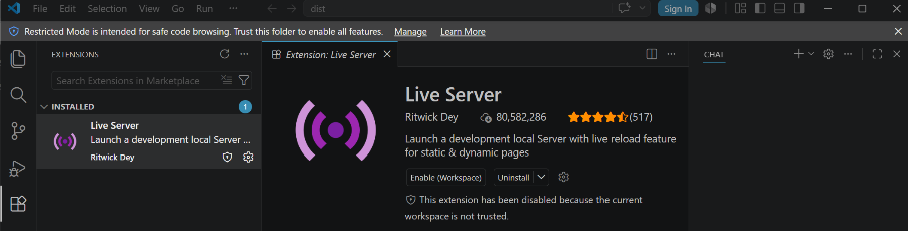

run the `index.html` with Live server

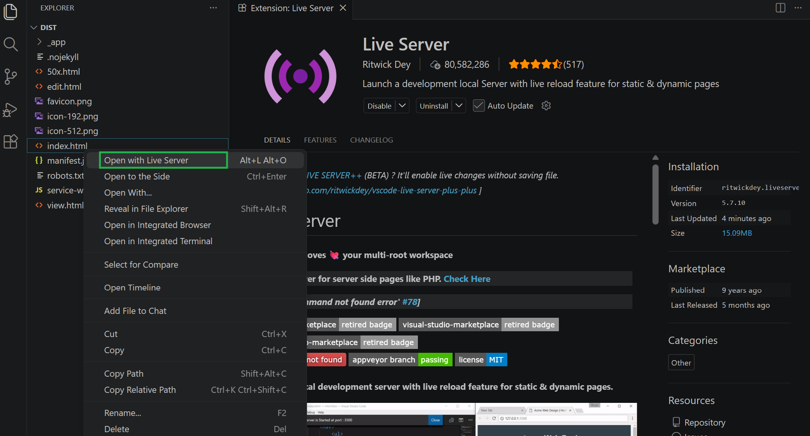

and it will automatically open `http://localhost:5000/index.html` in the browser (port will be assigned dynamically)
There is an error on the page
```text
Live reload enabled.
undefined:1  Failed to load resource: the server responded with a status of 404 (Not Found)
start-d8e4d14a.js:1 Uncaught (in promise) Error: Version check failed: 404
    at Object.l [as check] (start-d8e4d14a.js:1:10429)
    at async me (start-d8e4d14a.js:1:13827)
    at async we (start-d8e4d14a.js:1:19667)
```

### Background

`Mermaid.js` is a JavaScript library that allows users to create different types of diagrams, using a simple syntax. It supports a variety of diagram types, including [Swimlane flowcharts](https://en.wikipedia.org/wiki/Swimlane), [Sequence Diagrams](https://en.wikipedia.org/wiki/Sequence_diagram), [Gantt charts](https://en.wikipedia.org/wiki/Gantt_chart), [Entiy Relationship](https://en.wikipedia.org/wiki/Entity%E2%80%93relationship_model),  and [UML](https://en.wikipedia.org/wiki/Unified_Modeling_Language) class diagrams

__Mermaid__ diagrams can be easily embedded in websites, blogs, and documentation, making them a popular choice for technical writers, software developers, and other professionals who need to visualize complex information

[Mermaid](https://en.wikipedia.org/wiki/Mermaid_(software)) is open-source and can be integrated in both personal and commercial projects, making it a versatile tool for a variety of applications

Like many other WYSIWYG alternatives Mermaid Diagrams are authored in plain Text and possible to design
im a plain text editor (Syntax-aware editors can provide IntelliSense typcally vis extensions and plugins)
which makes it easier to version, review, and maintain compared to graphical design tools like

* [Blue Prism](https://en.wikipedia.org/wiki/Blue_Prism)
* [UiPath](https://en.wikipedia.org/wiki/UiPath)
* [Windows Workfllow Foundation](https://en.wikipedia.org/wiki/Windows_Workflow_Foundation)
* [Mule AnyPoint Design Studio Flows](https://www.mulesoft.com/platform/studio),
* Eclipse extensions and plugins for visual designing flows
* [Microsoft Visio](https://en.wikipedia.org/wiki/Microsoft_Visio)

and others.

these are very different kinds of development systems, but they share a graphical/WYSIWYG authoring model,
whereas __Mermaid__ deliberately makes the diagram itself source text.

```code
Traditional visual authoring
        │
        ▼
   Office / Visio
        │
        ▼
binary / structured document
        │
        ├── application required for editing
        ├── awkward textual diff
        ├── difficult merge semantics
        └── visual inspection
```
versus
```code
textual authoring
        │
        ▼
   Markdown + Mermaid
        │
        ▼
       source
        │
        ├── plain text
        ├── Git-friendly
        ├── diffable
        ├── mergeable
        ├── scriptable
        └── rendered when needed
```

A 2007-era .docx can effectively become a container of historical debris:
```code
10-page document
│
├── 🧾 current prose - visible content
├── 🖼 thumbnails of current diagrams
├── 🗄 embedd  ed Visio
├── 🗄 embedded Excel
├── 🗄 embedded Word 97/2003
├── ⛓ obsolete revisions
├── ✂ pasted copies
├── ⚒ OLE objects
├── 🗑 backup-ish material
└── 200 historical remnants ?
```
suddenly discoverred hundreds of embedded objects,
the mere fact that they are physically present tells you almost nothing about their current semantic relevance.

That's a fundamentally different problem from a Markdown/Mermaid source tree:
```code
README.md
diagram.md
    └── Mermaid source
```
With the Office/OLE case, you first have to perform archaeology:

  * *Is this object referenced by the document?*
  * *Is it visible?*
  * *Is it current?*
  * *Is it an alternate version?*
  * *Is it an old OLE embedding that somebody forgot to remove?*
  * *Is it merely a copied object from an earlier revision?*


But:

*Sorry, there's only one Korben Dallas — and he already boarded*

Microsoft's own development of [MarkItDown](https://markitdown.online)
 is an interesting acknowledgment of the value of extracting information from rich document formats into a more portable, text-oriented representation. The goal is not necessarily to replace Office documents, but to make their contents accessible to downstream tooling, search, automation, and AI systems.

####  Enterprise Provisioning/Policy Reality Constraint

> Enterprise note: A locally installed Office application is not necessarily a zero-cost alternative simply because the organization provides the corresponding cloud service. Local Visio may require separate justification/provisioning and licensing. This matters particularly for automation scenarios requiring the Visio COM interface, which is available only through the locally installed application.


COM automation requirement:
```code
Python
  │
  ▼
Visio COM automation
  │
  ▼
locally installed Visio
  │
  ▼
open / inspect / manipulate VSD
```
A browser/cloud Visio experience doesn't give Python the same local COM automation surface. So "use the cloud version" isn't necessarily an equivalent substitute for programmatic legacy-document archaeology.

Historically, a Word document (and its OLE object hierarchy) could easily retain artifacts of the document's revision history, making some embeddings largely duplicates of one another.
No need to spell out the entire causal chain.

__Visio processing__: Open and reconstruct the Visio document model → traverse pages/shapes/groups/connectors → resolve relationships and properties → only then extract or modify the semantic content.

Visio has its own audiophile cable:

“Five-nines oxygen-free copper. Silk insulation. Gold-coated screws. Air-gapped.”

Audiophile-grade construction — namely:
“Visio / Office: backward compatibility.”

Not merely “legacy compatibility,” but an elaborate compatibility layer that silently preserves the 1990s-era OLE/COM internal machinery — itself a substantial artifact.

And you pay that toll simply for using it, regardless of how much semantic content or contextual value you ultimately care about.


The enterprise's knowledge may still be trapped in a format that must be preserved, but that does not mean the enterprise intends to keep authoring new knowledge in that format

ou don't want to teach the AI how to keep making Office 97-compatible artifacts. You want to encode the organization's knowledge about what those artifacts mean and how to move forward from them.

If a 10 MB Visio beast becomes a 500-line Mermaid flow, that's OK. The difference is not necessarily lost knowledge — much of it may have been legacy audiophile cable

The 10 MB → 500 lines argument should not be generalized to the mainframe OS itself.

Complexity of the platform is not evidence of equivalent complexity in the business process running on it.


because the platform is doing extraordinarily sophisticated things.

The assumption is incorrect

“Look how incredibly complicated the machinery is. Therefore, what it supports must also be incredibly complicated.”

Don't confuse the complexity of the preservation mechanism with the complexity of the knowledge being preserved.

Office and other desktop applications offered automation

historically Office automation target was largely:

“How do I make a machine operate Office like a human operates Office?”

rather than:

“How do I extract the durable semantic information from an Office artifact?”

That distinction matters enormously.

The old automation model is essentially UI/procedural automation:

Open document
→ navigate to page
→ select object
→ select paragraph/line
→ apply formatting
→ save

A great deal of Office automation was designed around operating the Office object model and reproducing user actions, rather than recovering a representation-independent semantic model of the document.

It automates the interaction with the representation. Mermaid conversion is effectively  the inverse:

→ Open artifact
→ understand structure
→ identify semantic objects
→ infer relationships
→ discard representational baggage
→ produce a durable semantic representation


|Old world|Modern extraction|AI/SKILL|
|---------|-----------------|--------|
|Automate the user|Extract the artifact|Understand the knowledge|
|“Click this, select that”|“Parse this object”|“What does this mean?”|
|Preserve representation|Normalize representation|Preserve intent|
|How to operate it|How to read it|What to do with it|


In a Unix environment, this is almost natural. One works in a shell and occasionally sshs somewhere and back. Line 100 on the terminal may have been printed by machine X and line 101 by machine Y. Nobody finds this conceptually disturbing.

If the two lines need to be used together, one starts thinking about the payload — what information actually needs to cross the boundary.

Cloud computing merely makes this separation impossible to ignore: the neighboring shell windows may be thousands of miles apart.

Even on a single machine in 2026, however, Office, Visio, and Visual Studio — to varying degrees — still encourage the opposite mental model: the artifact, its application, its container, and its presentation remain one thing.

ou can launch what looks like an entire IDE/Jupyter environment in a browser tab, but architecturally you know what happened:

Browser
   │
   │ HTTP/WebSocket
   ▼
VM / container somewhere
   │
   ├── process
   ├── filesystem
   └── tiny web application

The browser isn't emotionally attached to the IDE

Cloud computing normalized the idea that the interface is not the system. Modern knowledge processing should do the same: the document is not the knowledge.

he “emotionally attached” phrase works because IDE customization used to be a form of local ownership: your machine, your IDE, your plugins, your shortcuts, your carefully cultivated environment.

The remote/browser model quietly dissolves that.


In the past — what may soon be called the distant past — there was a whole curated ecosystem of IDE-savvy people. They knew the shortcuts, customized the menus, installed plugins, tuned the workspace, arranged the windows, and accumulated years of muscle memory around their IDE.

It made sense. The IDE was your environment

But when the IDE you are looking at may have been launched thirty seconds ago inside a VM 100 miles away — and may disappear when the session ends — the attachment starts looking rather peculiar.

The browser doesn't care.

It is displaying a service. Tomorrow that service may run somewhere else, on a different VM, in a different container, or use a completely different implementation. The browser still provides the window.

The interface survived precisely because it wasn't required to own the machinery behind it.

That is the same separation we should want for enterprise knowledge:

Don't make the representation own the knowledge.

The IDE is a particularly good demonstration because we have already accepted this principle operationally. Nobody insists that the browser preserve the filesystem, process model, VM, operating system, IDE installation, plugins, and physical machine merely because those things happen to be behind the tab.

Yet with an Office artifact, we can still behave as though preserving the historical container is part of preserving the knowledge.

The browser learned to let go of the IDE.
Modernization needs to learn to let go of the container.

Neatly: Unix taught us to think in payloads; cloud made location irrelevant; browsers separated interface from machinery; AI now gives us a plausible way to separate knowledge from its historical container

### GitGraph Example

```code
%%{init: {
    "theme": "base",
    "themeVariables": {
        "git0": "#AAAAAA",
        "git1": "#AAAAFF",
        "git2": "#B5651D"
    }
}}%%

gitGraph
    commit tag: "version 1.0.0"

    branch "frontend"
    commit

    checkout main
    branch "backend"
    commit
    checkout "frontend"
    commit
    checkout "backend"
    commit
    commit
```

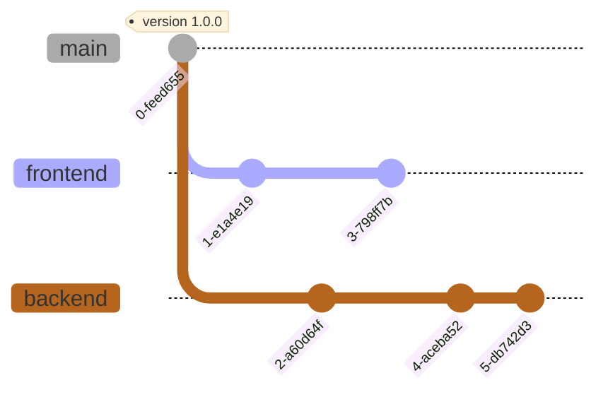
```mermaid
%%{init: {
    "theme": "base",
    "themeVariables": {
        "git0": "#AAAAAA",
        "git1": "#AAAAFF",
        "git2": "#B5651D"
    }
}}%%

gitGraph
    commit tag: "version 1.0.0"

    branch "frontend"
    commit

    checkout main
    branch "backend"
    commit
    checkout "frontend"
    commit
    checkout "backend"
    commit
    commit
```


| Time | Product / main | Frontend branch | Backend branch | Bugfix branch | Event |
|------|----------------|-----------------|----------------|---------------|-------|
| T0 | ● v1.0.0 | — | — | — | Version 1.0.0 released |
| T1 | ● | branch created | branch created | — | Two independent development streams start |
| T2 | ● | F1 | B1 | — | Continuous build/test |
| T3 | ● | F1 → F2 | B1 → B2 | — | Frontend progresses faster |
| T4 | ● | F1 → F2 → F3 ✓ | B1 → B2 → B3 | — | Frontend feature complete |
| T5 | ● | READY / waiting | B1 → B2 → B3 | branch created | Bug discovered |
| T6 | ● | READY / waiting | continuing | X | Bugfix implemented and validated |
| T7 | ● → X v1.1.0 | READY / waiting | continuing | merged | Bugfix merged to main; version 1.1.0 released |
| T8 | ● → X | F1 → F2 → F3 → X | B1 → B2 → B3 → X | — | Bugfix merged into both active branches |
| T9 | ● → X | READY AGAIN | B1 → B2 → B3 → B4 | — | Frontend immediately ready for release |
| Time | Product / main | Frontend branch | Backend branch | Bugfix branch | Event |
|------|----------------|-----------------|----------------|---------------|-------|
| T0 | ● v1.0.0 | — | — | — | Version 1.0.0 released |
| T1 | ● | branch created | branch created | — | Two independent development streams start |
| T2 | ● | F1 | B1 | — | Continuous build/test |
| T3 | ● | F1 → F2 | B1 → B2 | — | Frontend progresses faster |
| T4 | ● | F1 → F2 → F3 ✓ | B1 → B2 → B3 | — | Frontend feature complete |
| T5 | ● | READY / waiting | B1 → B2 → B3 | branch created | Bug discovered |
| T6 | ● | READY / waiting | continuing | X | Bugfix implemented and validated |
| T7 | ● → X v1.1.0 | READY / waiting | continuing | merged | Bugfix merged to main; version 1.1.0 released |
| T8 | ● → X | F1 → F2 → F3 → X | B1 → B2 → B3 → X | — | Bugfix merged into both active branches |
| T9 | ● → X | READY AGAIN | B1 → B2 → B3 → B4 | — | Frontend immediately ready for release |
| T10 | ● → X → F v2.0.0 | merged | B1 → B2 → B3 → B4 | — | Frontend merged to main; version 2.0.0 released |
| T11 | ● v2.0.0 | — | B1 → B2 → B3 → B4 → B5 | — | Backend development continues |
| T12 | ● v2.0.0 | — | B1 → B2 → B3 → B4 → B5 → B6 | — | Backend continues accumulating commits || Time | Product / main | Frontend branch | Backend branch | Bugfix branch | Event |
|------|----------------|-----------------|----------------|---------------|-------|
| T0 | ● v1.0.0 | — | — | — | Version 1.0.0 released |
| T1 | ● | branch created | branch created | — | Two independent development streams start |
| T2 | ● | F1 | B1 | — | Continuous build/test |
| T3 | ● | F1 → F2 | B1 → B2 | — | Frontend progresses faster |
| T4 | ● | F1 → F2 → F3 ✓ | B1 → B2 → B3 | — | Frontend feature complete |
| T5 | ● | READY / waiting | B1 → B2 → B3 | branch created | Bug discovered |
| T6 | ● | READY / waiting | continuing | X | Bugfix implemented and validated |
| T7 | ● → X v1.1.0 | READY / waiting | continuing | merged | Bugfix merged to main; version 1.1.0 released |
| T8 | ● → X | F1 → F2 → F3 → X | B1 → B2 → B3 → X | — | Bugfix merged into both active branches |
| T9 | ● → X | READY AGAIN | B1 → B2 → B3 → B4 | — | Frontend immediately ready for release |
| T10 | ● → X → F v2.0.0 | merged | B1 → B2 → B3 → B4 | — | Frontend merged to main; version 2.0.0 released |
| T11 | ● v2.0.0 | — | B1 → B2 → B3 → B4 → B5 | — | Backend development continues |
| T12 | ● v2.0.0 | — | B1 → B2 → B3 → B4 → B5 → B6 | — | Backend continues accumulating commits |


```code
%%{init: {
    "theme": "base",
    "themeVariables": {
        "git0": "#AAAAAA",
        "git1": "#AAAAFF",
        "git2": "#B5651D"
    }
}}%%

gitGraph
    commit tag: "version 1.0.0"

    branch "frontend"
    commit
    commit
    commit

    checkout main
    branch "backend"
    commit
    commit
    commit

    checkout main
    branch "bugfix"
    commit

    checkout main
    merge bugfix tag: "version 1.1.0"

    checkout "frontend"
    merge main
    checkout "backend"
    merge main
    commit

    checkout main
    merge "frontend" tag: "version 2.0.0"
    checkout "backend"
    commit
    commit
```
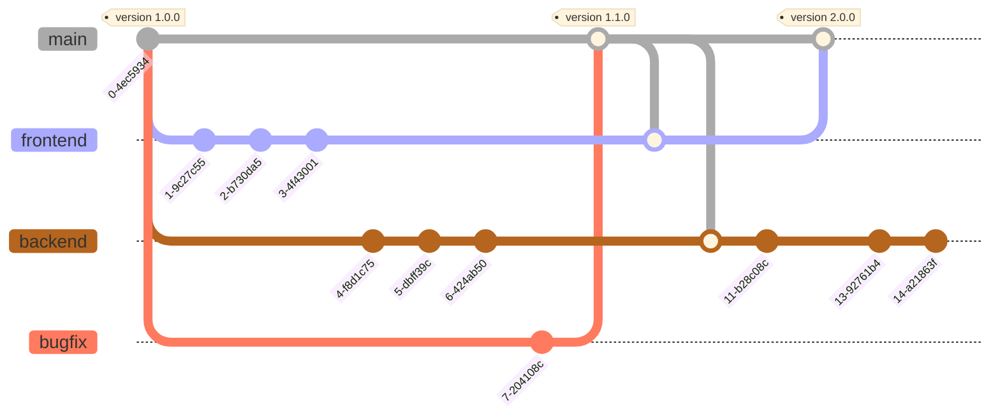
```mermaid
%%{init: {
    "theme": "base",
    "themeVariables": {
        "git0": "#AAAAAA",
        "git1": "#AAAAFF",
        "git2": "#B5651D"
    }
}}%%

gitGraph
    commit tag: "version 1.0.0"

    branch "frontend"
    commit
    commit
    commit

    checkout main
    branch "backend"
    commit
    commit
    commit
 
    checkout main
    branch "bugfix"
    commit

    checkout main
    merge bugfix tag: "version 1.1.0"

    checkout "frontend"
    merge main
    checkout "backend"
    merge main
    commit

    checkout main
    merge "frontend" tag: "version 2.0.0"
    checkout "backend"
    commit
    commit
```
```code

%%{init: {
    "theme": "base",
    "themeVariables": {
        "git0": "#AAAAAA",
        "git1": "#AAAAFF",
        "git2": "#B5651D",
        "git3": "#E5822D"
    }
}}%%

gitGraph
    commit tag: "version 1.0.0"

    branch "frontend"
    commit
    commit
    commit

    checkout main
    branch "backend"
    commit
    commit
    commit
 
    checkout main
    branch "bugfix"
    commit

    checkout main
    merge bugfix tag: "version 1.1.0"

    checkout "frontend"
    merge main

    checkout "backend"
    merge main
    commit

    checkout main
    branch "super frontend"
    commit

    checkout "backend"
    commit
    commit

    checkout main
    merge "backend" tag: "version 2.0.0"

    checkout "super frontend"
    commit

    checkout main
    merge "frontend" tag: "version 3.0.0"
```
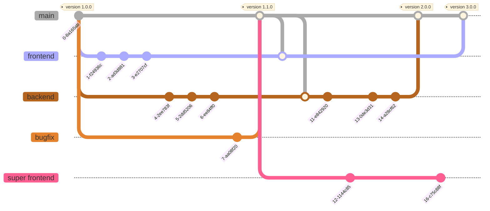
```mermaid
%%{init: {
    "theme": "base",
    "themeVariables": {
        "git0": "#AAAAAA",
        "git1": "#AAAAFF",
        "git2": "#B5651D",
        "git3": "#E5822D"
    }
}}%%

gitGraph
    commit tag: "version 1.0.0"

    branch "frontend"
    commit
    commit
    commit

    checkout main
    branch "backend"
    commit
    commit
    commit
 
    checkout main
    branch "bugfix"
    commit

    checkout main
    merge bugfix tag: "version 1.1.0"

    checkout "frontend"
    merge main

    checkout "backend"
    merge main
    commit

    checkout main
    branch "super frontend"
    commit

    checkout "backend"
    commit
    commit

    checkout main
    merge "backend" tag: "version 2.0.0"

    checkout "super frontend"
    commit

    checkout main
    merge "frontend" tag: "version 3.0.0"
```
The Git graph has now become considerably larger, but it is still well within reasonable bounds.

And the situation itself is entirely standard.

The frontend turns out to depend on a feature in the backend — a feature that we originally expected to release later. Therefore we cannot proceed with the frontend release. The original frontend work is complete, but it has to wait.

What do we do with the next frontend development effort?

We create a new branch.

The original frontend branch is effectively frozen, preserving the completed work until its backend dependency becomes available. New frontend development continues on the new branch. Meanwhile, backend development proceeds as usual.

Business as usual.

The graph grows because the history has grown. But the graph absorbs that additional complexity naturally: another branch, another line of development, and eventually another merge.

A table, on the other hand, has to be redesigned to explain every new parallel stream.

That is the difference between **telling the history** and **showing the history**.

The table is useful when we want to walk through one particular scenario step by step.

The Git graph remains useful when the scenario itself becomes more complex.

The Git graph has now become considerably larger, but it is still well within reasonable bounds.

And the situation itself is entirely standard.

The frontend turns out to depend on a feature in the backend — a feature that we originally expected to release later. Therefore we cannot proceed with the frontend release. The original frontend work is complete, but it has to wait.

What do we do with the next frontend development effort?

We create a new branch.

The original frontend branch is effectively frozen, preserving the completed work until its backend dependency becomes available. New frontend development continues on the new branch. Meanwhile, backend development proceeds as usual.

Business as usual.

The graph grows because the history has grown. But the graph absorbs that additional complexity naturally: another branch, another line of development, and eventually another merge.

A table, on the other hand, has to be redesigned to explain every new parallel stream.

That is the difference between **telling the history** and **showing the history**.

The table is useful when we want to walk through one particular scenario step by step.

The Git graph remains useful when the scenario itself becomes more complex.


The Ops Team can certainly keep this in Excel.
In fact, there is nothing technically preventing them from doing so.

The problem is that the history keeps developing while the spreadsheet is trying to describe it.

More branches. More dependencies. More exceptions. More things waiting for other things.

At some point, the spreadsheet doesn't become wrong. It simply becomes increasingly expensive to keep explaining.

And eventually the clock strikes midnight.

The carriage is still there, the Excel file is still there, and technically everything is still possible.

But the Mermaid GitGraph is already showing what happened

### Notes
Nobody needs to study it. It communicates activity without demanding attention. A hall screen can show this indefinitely and people can glance at it without asking what happened.


The third graph crosses the important threshold.

Now it isn't just:

Jane is working. Jack is working.

It becomes:

Jane's work depends on Jack's work.

And your Halloween story is perfect for making that memorable:

Jane asks Jack to fix the witch's tail on her costume because she can't reach it herself.

Excel can certainly record all three situations. The issue isn't whether the data can be represented.

It's that the third situation is naturally graph-shaped.

Once Jane's branch depends on Jack's branch, you don't merely have another row of information. You have a relationship between two previously separate streams.

that is the payoff of the three-graph progression. The Halloween story is not just decoration; it gives you a concrete miniature of the organizational problem:

Jane cannot reach the witch's tail. Jack can fix it.
Now the organization has to decide whether the tail is worth delaying the release for.

And that is where the GitGraph becomes a useful operational picture rather than merely a developer visualization.

You can have the presenter say, deadpan:

“The war team now spends an hour deciding whether the witch's tail is worth fixing.”

The paradox is:

The more complex the situation becomes, the more valuable the better representation becomes — and the less feasible it becomes to introduce it.

So the rational transition point is actually before the pain arrives.

You could put it very simply in the comment:

It is not enough to know that an alternative exists and promise to switch when the current approach becomes unmanageable. That is precisely when switching is most difficult. The low-complexity phase is the cheap time to introduce the better representation.

Or, in your slightly more metaphorical style:

Don't wait for the carriage to turn into a pumpkin before learning how to drive it.

### Fictional KYC Exaple
```code
flowchart LR
        START([Start])
        SSN{SSN valid?}
        AGE{Age valid?}
        END([End])

        START --> SSN
        SSN -- No --> END
        SSN -- Yes --> AGE
        AGE -- No --> END
        AGE -- Yes --> PROCESSING

    subgraph PROCESSING["Credit Processing"]
        CREDIT{Credit score?}
        BASIC[Basic customer]
        FAVORITE[Favorite customer]

        CREDIT -- Good --> FAVORITE
        CREDIT -- Average --> BASIC
        CREDIT -- Risky --> END
        FAVORITE --> END
        BASIC --> END
    end
```
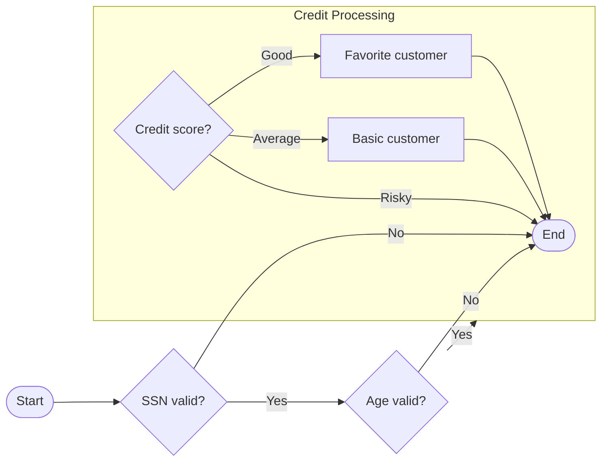
```mermaid
flowchart LR
        START([Start])
        SSN{SSN valid?}
        AGE{Age valid?}
        END([End])

        START --> SSN
        SSN -- No --> END
        SSN -- Yes --> AGE
        AGE -- No --> END
        AGE -- Yes --> PROCESSING

    subgraph PROCESSING["Credit Processing"]
        CREDIT{Credit score?}
        BASIC[Basic customer]
        FAVORITE[Favorite customer]

        CREDIT -- Good --> FAVORITE
        CREDIT -- Average --> BASIC
        CREDIT -- Risky --> END
        FAVORITE --> END
        BASIC --> END
    end
```

```code
flowchart LR
    START([Start])
    SSN{SSN valid?}
    END([End])

    START --> SSN
    SSN -- No --> END
    SSN -- Yes --> PROCESSING

    subgraph PROCESSING["Credit Processing"]
        AGE{Age valid?}
        CREDIT{Credit score?}
        JUNIOR[Junior credit]
        BASIC[Basic customer]
        FAVORITE[Favorite customer]

        AGE -- No --> JUNIOR
        AGE -- Yes --> CREDIT

        CREDIT -- Good --> FAVORITE
        CREDIT -- Average --> BASIC
        CREDIT -- Risky --> END

        JUNIOR --> END
        FAVORITE --> END
        BASIC --> END
    end
```
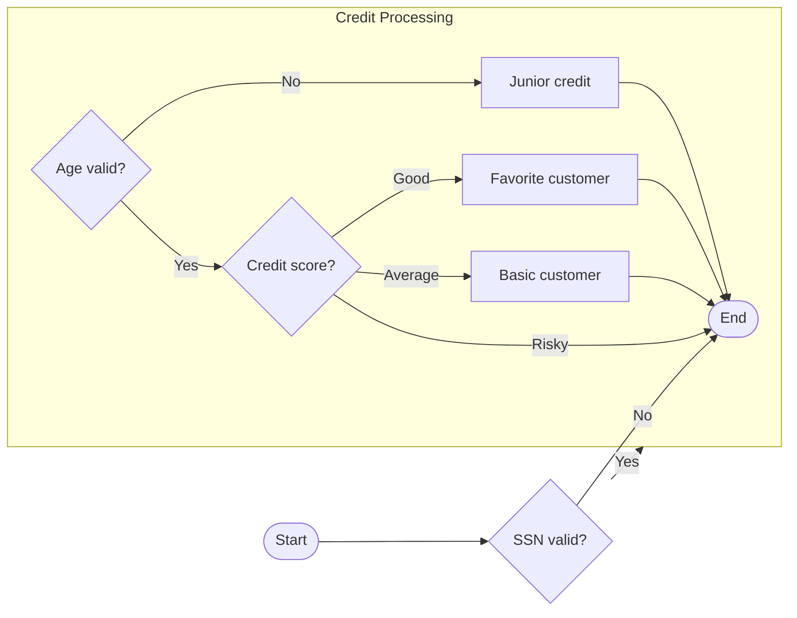
```mermaid
flowchart LR
    START([Start])
    SSN{SSN valid?}
    END([End])

    START --> SSN
    SSN -- No --> END
    SSN -- Yes --> PROCESSING

    subgraph PROCESSING["Credit Processing"]
        AGE{Age valid?}
        CREDIT{Credit score?}
        JUNIOR[Junior credit]
        BASIC[Basic customer]
        FAVORITE[Favorite customer]

        AGE -- No --> JUNIOR
        AGE -- Yes --> CREDIT

        CREDIT -- Good --> FAVORITE
        CREDIT -- Average --> BASIC
        CREDIT -- Risky --> END

        JUNIOR --> END
        FAVORITE --> END
        BASIC --> END
    end
```

Formal Rule way: **conditions** are *inputs* to the rule; **outcome** is the business *decision* produced by it.

> Regular KYC
> 
> | Rule   | Conditions                                               | Outcome                |
> | ------ | -------------------------------------------------------- | ---------------------- |
> | KYC-01 | `SSN is invalid`                                         | **Reject application** |
> | KYC-02 | `SSN is valid` AND `age is invalid`                      | **Reject application** |
> | KYC-03 | `SSN is valid` AND `age is valid` AND `credit = Good`    | **Favorite customer**  |
> | KYC-04 | `SSN is valid` AND `age is valid` AND `credit = Average` | **Basic customer**     |
> | KYC-05 | `SSN is valid` AND `age is valid` AND `credit = Risky`   | **Reject application** |

> CreditLandia KYC
> | Rule   | Conditions                                               | Outcome                |
> | ------ | -------------------------------------------------------- | ---------------------- |
> | KYC-01 | `SSN is invalid`                                         | **Reject application** |
> | KYC-02 | `SSN is valid` AND `age is invalid`                      | **Junior credit**      |
> | KYC-03 | `SSN is valid` AND `age is valid` AND `credit = Good`    | **Favorite customer**  |
> | KYC-04 | `SSN is valid` AND `age is valid` AND `credit = Average` | **Basic customer**     |
> | KYC-05 | `SSN is valid` AND `age is valid` AND `credit = Risky`   | **Reject application** |

### Visual Studio Code Rendering

__Visual Studio Code__ announces support __Mermaid__ natively starting with version [1.121](), which was released on __May__ __20__, __2026__.

* it appears that something is still misconfigured in later release

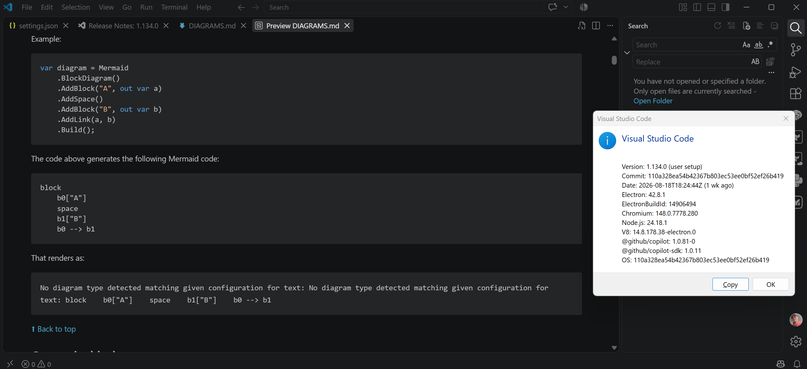

One has to be extremely careful and limit oneself to battle-proven, classic Mermaid — otherwise a perfectly valid diagram may suddenly become “unsupported” depending on which Mermaid engine happens to be rendering it.


```code
graph TD;
    A-->B;

```
that will render:


```mermaid
graph TD;
    A-->B;

```
otherwise one will find in display preview mode:
```text
No diagram type detected matching given configuration for text
```
__Key Details__: 

  * __Built-in Extension__: This update merged the popular third-party "Markdown Preview Mermaid Support" extension directly into the core editor as a built-in feature called Mermaid Markdown Features.
  * __Where It Works__: You can render Mermaid diagrams automatically inside the standard Markdown preview panel and within notebook cells without downloading extra plugins.How to Use It: Simply write your diagram syntax inside a fenced code block labeled with mermaid:

### Build Notes

Whenever you run an application in the cloud—whether it is SaaS, a serverless function (FaaS/Lambda), or a traditional web application—your code is ultimately running on some real computer somewhere

You may not see or manage that computer yourself. The cloud provider may hide it behind layers of virtualization, containers, and orchestration. But "serverless" does not mean that there are no servers: it means that someone else manages the servers for you

In practice, your application will typically be running inside a container, virtual machine, or similar isolated environment, which ultimately runs on physical hardware in a data center.

The cloud is not magic. Whenever an application runs, somewhere there is a real computer doing the work.

But getting an application onto that computer is another matter.

Packaging the application

When an application runs in a container, tools such as Docker—and, at a larger scale, Kubernetes—help arrange for the application to have what it needs to run.

This usually means packaging or describing things such as:

the application itself;
its runtime and libraries;
configuration;
supporting processes and services.

The exact division of responsibilities varies: Docker is commonly used to build and package container images, while Kubernetes is commonly used to decide where and how containers should run and to keep the desired number of them running.

The browser is sometimes another invisible part of the application

Web applications add another important twist.

Part of a modern web application may not run in the container at all. It runs inside your browser.

Web applications add another important twist.

Part of a modern web application may not run in the container at all. It runs inside your browser.

From the user's perspective, there is just "the application." But technically, part of it may be running on a server somewhere, while another part is running on the user's own computer, inside Chrome, Firefox, Edge, or another browser.

Historically—and still very commonly—the browser part is delivered as JavaScript code.

However, the code delivered to the browser is often not exactly the code the developer originally wrote.

Before deployment, the frontend source code may go through another, rather cumbersome form of packaging or transformation: modules are combined, dependencies are included, code may be transpiled or minimized, and the result is turned into a set of files suitable for a browser to download.

Eventually, those files have to come from somewhere.

A very typical arrangement looks like this:
```code
    Developer's source code 
       │
       ▼
    Frontend build process
       │
       ▼
    JavaScript/CSS/HTML files
       │
       ▼
    Web server/container
       │
       ▼ 
    Browser
       │ 
       ▼ 
    Application runs here too
```

Those frontend files may simply be stored directly inside the container running the web server. Or the browser may obtain information dynamically by making HTTP requests—often REST API calls—to another application running in a container.

So what users perceive as one web application may actually consist of two cooperating pieces:


So what users perceive as one web application may actually consist of two cooperating pieces:

A backend, running somewhere in a container, VM, or other server environment.
A frontend, running inside the user's browser.

And both pieces had to be prepared, packaged, and delivered in some form before they could run.

## The surprising case: sometimes the server can disappear

For many web applications, we instinctively imagine a permanent connection between the application in the browser and a backend running somewhere in the cloud.

But that is not always necessary.

A browser-based application may first contact a web server only to download its initial payload: HTML, JavaScript, CSS, images, and other resources. After that, the application itself is running inside the browser.

For a sufficiently self-contained application, once those files have been downloaded, the server has done its job.

You could, in principle, turn off the container or VM that delivered the application and walk away. The application already loaded in the browser may continue working perfectly well.

```
Container / VM
     │
     │  "Here is the application"
     ▼
  Browser
     │
     │  application is now running here
     ▼
┌─────────────────┐
│ JavaScript app  │
│ running locally │
└─────────────────┘

     ▲
     │
Server can disappear
without necessarily
stopping the app
```

Of course, this only works for applications that do not continuously depend on a backend.

Many applications still need a server for things such as:

* fetching or saving shared data;
* authentication;
* communicating with other users;
* accessing databases;
* performing expensive computation.

But there is a large class of "pure" browser-hosted applications where the backend's role is little more than delivering the application itself.

In that case, the server is not really where the application *runs*. It is more like a delivery mechanism.

The important distinction is:

> **The server may be needed to deliver the application, without being needed to keep the application running.**

Once loaded, the browser can become the application's actual runtime environment.


#### Time Decouling

## It does not even have to be eaten immediately

Think of a restaurant.

The fact that a meal is prepared after you order it does not mean that freshly prepared food is the only possible way to eat. You can also buy a prepared meal, put it in the refrigerator or freezer, and consume it later.

The same idea applies to browser applications.

A container may be started solely to prepare or serve the application's files. Once the browser has received them, those files do not necessarily have to be used immediately.

They can be stored locally—effectively put "in the fridge"—and used later.

So the sequence can be:

```
Container starts
      │
      ▼
Application is prepared
      │
      ▼
Browser downloads it
      │
      ▼
Container stops
      │
      ▼
Application waits locally
      │
      ▼
User opens/runs it later
```

This means that the container's lifetime and the application's useful lifetime can be completely different.

The container may exist for only a few seconds or minutes. The browser application it delivered may remain available for hours, days, or longer.

A backend is therefore not always a restaurant kitchen continuously preparing food while you eat. Sometimes it is simply a place where a batch of prepared meals was made and handed out.

> **The application can be prepared now, delivered now, and used much later—even after the container that prepared or delivered it no longer exists.**


### See Also

  * [github allows including diagrams in Markdown files with Mermaid](https://github.blog/developer-skills/github/include-diagrams-markdown-files-mermaid/) since 2022 - also embedded in GitLab, Gitea, Joplin, Notion.
There is an __Mermaid diagram previewer for Visual Studio Code__ [extension](https://marketplace.visualstudio.com/items?itemName=vstirbu.vscode-mermaid-preview)


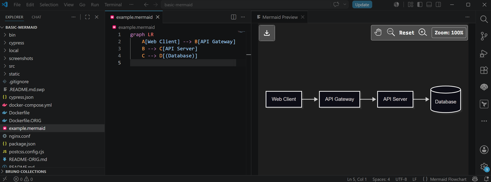

along with several other extensions

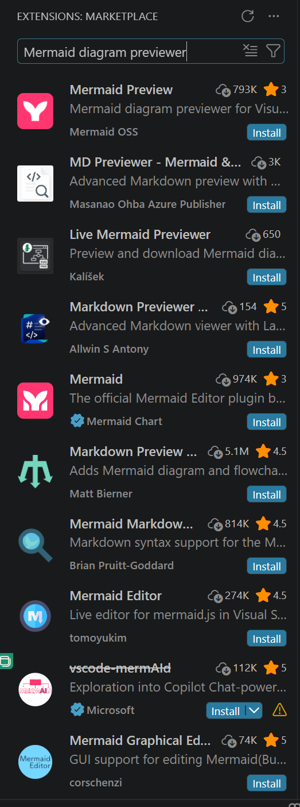

  * [InjelliJ Mermain Plugin](https://www.jetbrains.com/help/idea/markdown.html#diagrams) (disabled by default and requires additional steps)
  * [Generate and view Mermaid diagrams with Copilot](https://www.youtube.com/watch?v=SgPYIfxk4Ok)
  * __GitHub Copilot__ __Chat__ natively renders and previews __Mermaid__ diagrams directly within its [cohat interface](https://mermaid.ai/docs/plugins/github-copilot)
  * [Python adapter for rendering Mermaid fragment](https://habr.com/ru/articles/1061160/) ( basic, in Roussian)
  * [Mermaid winning the default drawing standard over PlantUML](https://habr.com/ru/news/1015912/)(in Russian):
  * [Github Doc on Creating diagrams](https://docs.github.com/en/get-started/writing-on-github/working-with-advanced-formatting/creating-diagrams)
  * [Mermaid primer](https://habr.com/ru/articles/652867)(in Russian)
  * [Mermaid User Guide](https://mermaid.ai/open-source/intro/getting-started.html)
  * [overview of creating flowcharts using Mermaid](https://ckeditor.com/blog/basic-overview-of-creating-flowcharts-using-mermaid/)
  * [diagrams in Markdown with Mermaid](https://github.blog/developer-skills/github/include-diagrams-markdown-files-mermaid/) (redundant)
  * [list of Mermaid Tutorials](https://mermaid.ai/open-source/ecosystem/tutorials.html)
  * [custom SVG shapes library for Mermaid](https://mermaid.ai/open-source/adding-new-shape.html)
  * [full emoji list](https://unicode.org/emoji/charts/full-emoji-list.html#keycap)
  * great tools are transparent
  * [Mermaid Live Editor](https://mermaid.live/edit): Online FlowChart & Diagrams Editor
  * [Diagram as Code: Comparing the Major Tools](https://diagrams.so/learn/diagram-as-code-comparison)
  * [top 6 Mermaid.js alternatives](https://swimm.io/learn/mermaid-js/top-6-mermaid-js-alternatives)
  * [MermaidJS and Graphviz side by side](https://www.devtoolsdaily.com/diagrams/graphviz_vs_mermaid/)
  * [Python MarkItDown: Convert Documents Into LLM-Ready Markdown](https://realpython.com/python-markitdown/)
  * [Mermaid Wiki](https://mermaid.ai/open-source/intro/index.html)
  * [Live App](https://mermaid.live/) to learn practice
  * official __Mermaid Live Editor__ Docker image is hosted on [GitHub Container Registry](ghcr.io/mermaid-js/mermaid-live-editor/mermaid-live-editor) (__GHCR__)
  * [samsmithnz/MermaidDotNet](https://github.com/samsmithnz/MermaidDotNet) - project to generate Mermaid graphs with .NET - apparently not standalone , but __MVC__/__Blazor__ rank app
  * [FoggyBalrog/MermaidDotNet](https://github.com/FoggyBalrog/MermaidDotNet) - an .NET library to generate Mermaid diagrams code - build into as nuget package on `netstandard2.1` - with an impressive catalog of distict mermaid shapes
  
  
---
### Author
[Serguei Kouzmine](kouzmine_serguei@yahoo.com)
