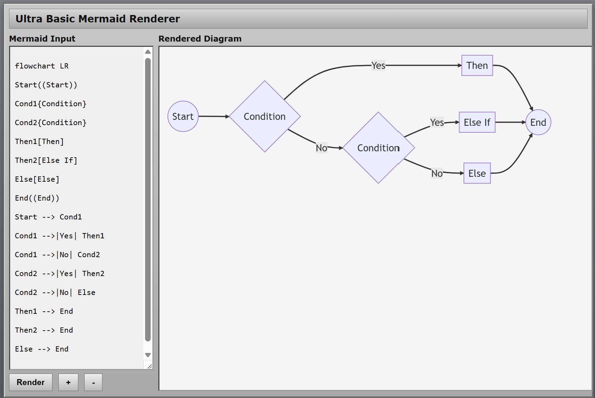

### Info

Single page browser using Mermaid 9.x releases which were the last shipped a standalone `mermaid.min.js`.

### Usage

pick an oldr version

```sh
sudo apt-get install -qqy npm
```
```sh
npm pack mermaid@9.4.3
```
```sh
tar tzvf mermaid-9.4.3.tgz  | grep mermaid\\.
```
```text
-rw-r--r-- 0/0         6165892 1985-10-26 04:15 package/dist/mermaid.js
-rw-r--r-- 0/0         2777841 1985-10-26 04:15 package/dist/mermaid.min.js
-rw-r--r-- 0/0             119 1985-10-26 04:15 package/dist/mermaid.core.mjs.map
-rw-r--r-- 0/0             101 1985-10-26 04:15 package/dist/mermaid.esm.min.mjs.map
-rw-r--r-- 0/0              97 1985-10-26 04:15 package/dist/mermaid.esm.mjs.map
-rw-r--r-- 0/0         9374816 1985-10-26 04:15 package/dist/mermaid.js.map
-rw-r--r-- 0/0         9490302 1985-10-26 04:15 package/dist/mermaid.min.js.map
-rw-r--r-- 0/0             826 1985-10-26 04:15 package/dist/mermaid.core.mjs
-rw-r--r-- 0/0             120 1985-10-26 04:15 package/dist/mermaid.esm.min.mjs
-rw-r--r-- 0/0             111 1985-10-26 04:15 package/dist/mermaid.esm.mjs
-rw-r--r-- 0/0            4712 1985-10-26 04:15 package/dist/mermaid.d.ts
-rw-r--r-- 0/0              46 1985-10-26 04:15 package/dist/mermaid.spec.d.ts

```
```sh
tar xzvf mermaid-9.4.3.tgz package/dist/mermaid.min.js
```
```sh
cp package/dist/mermaid.min.js .
```
```sh
sudo apt-get purge -qqy npm
```
alternatively

```sh
curl -skLO https://cdn.jsdelivr.net/npm/mermaid@9.4.3/dist/mermaid.min.js
```
or
```sh
wget -nv --no-cookies --no-check-certificate -O mermaid.min.js https://cdnjs.cloudflare.com/ajax/libs/mermaid/9.4.3/mermaid.min.js
```
```sh
md5sum mermaid.min.js
```
```text
e1bdcac49c3a6464a9aa3c6082b1833e *mermaid.min.js
```
```cmd
start "c:\Program Files\Google\Chrome\Application\chrome.exe" file://%cd%\page.html
```


### Background

This project uses __Mermaid__ version __9.4.3__ which is a stable legacy release of the JavaScript-based diagramming and charting tool that uses Markdown-inspired text.
it is available directly via package delivery networks like UNPKG under specific version paths

> Note: Why not using the latest version

[Mermaid](https://github.com/mermaid-js/mermaid), which originally started as a
vanilla JavaScript browser library distributed as a single deployable artifact,
has dramatically changed its distribution model in newer releases.

The functionality is now primarily packaged for modern application build
environments (`npm`/`Vite`/`Rollup`) rather than as a standalone browser script.

The new model moves responsibility to external build tools and assumes that a
build system will resolve, optimize, and bundle the internal module
dependencies.

For example, the current distribution contains module references such as:

```js
import { b9 as f } from "./mermaid-500b880f.js";
export {
  f as default
};
```
This works naturally inside a modern JavaScript application build pipeline.
However, direct browser deployment:
```js
import mermaid from "./mermaid.esm.min.mjs";
```
or:
```html
<script type="module">
```
does not provide the same experience as the previous standalone library model.

When opened directly from `file://`, the browser applies module security rules,
and the imported dependency chain fails without a server or bundling step.

For a self-contained offline viewer, __Mermaid__ __9.4.3__ was selected because it
still provides the traditional browser bundle
```html
<script src="mermaid.min.js"></script>
```
with no `Node.js`, `npm`, `bundler`, or preprocessing step required.

### See Also 

  * [Mermaid npm packge](https://www.npmjs.com/package/mermaid)
  * [Mermaid CDN](https://cdnjs.com/libraries/mermaid) 

---
### Author
[Serguei Kouzmine](kouzmine_serguei@yahoo.com)
