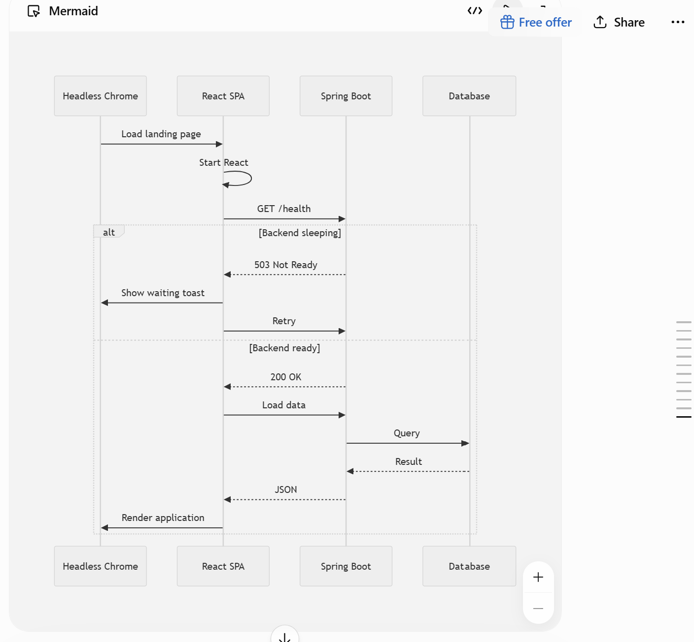
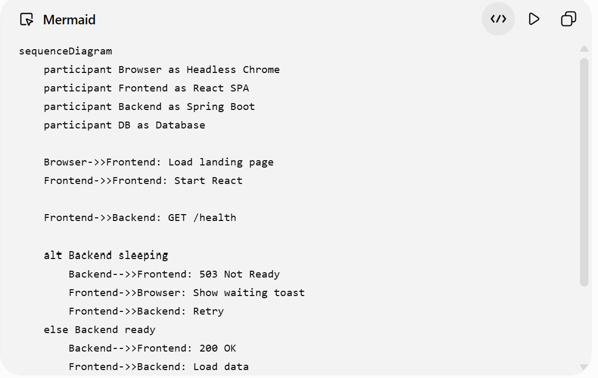
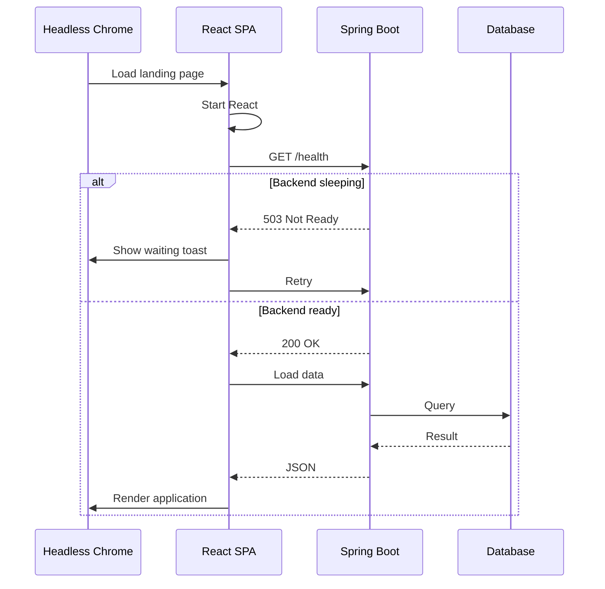
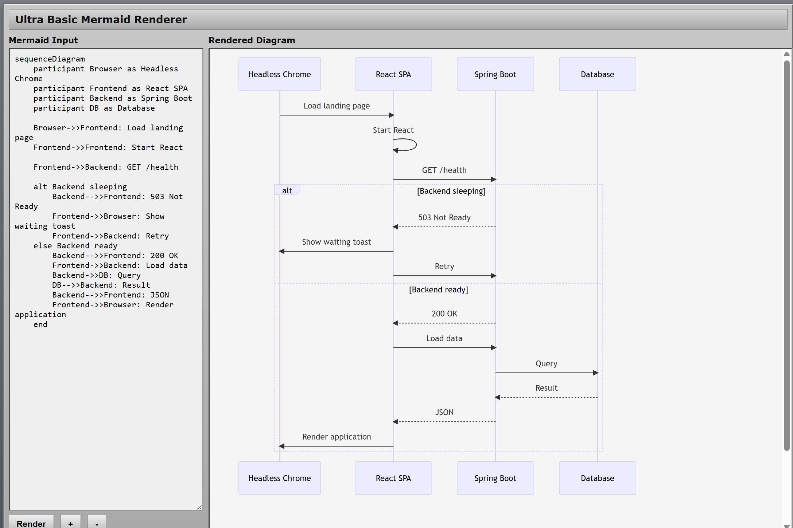
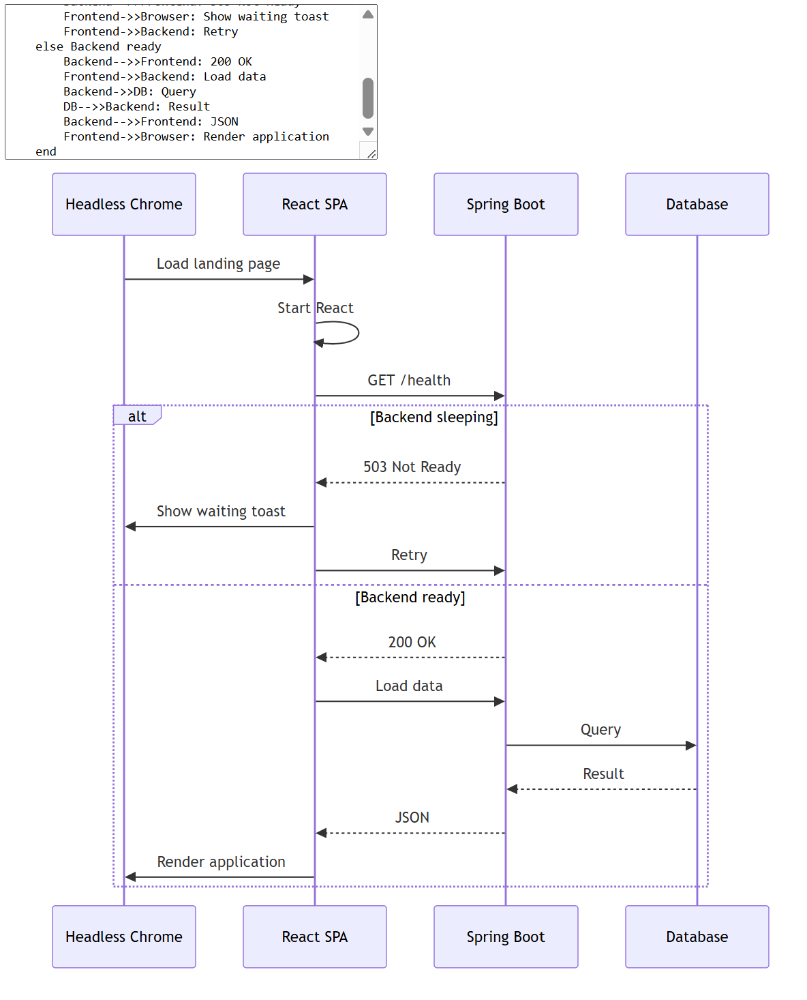
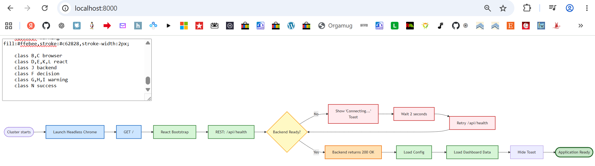
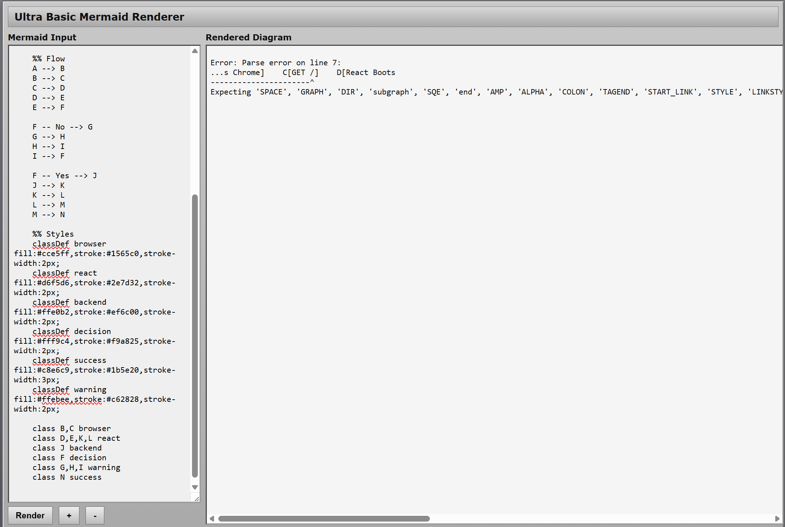

### Info

Single page browser using Mermaid 9.x releases which were the last shipped a standalone `mermaid.min.js`.

### Usage

pick an older version for vanilla JS Library release.


### Example Copilot Session

* GitHub Copilot Chat Screen - Graphics



* GitHub Copilot Chat Screen - Source



* Verbatim Source
```code
sequenceDiagram
    participant Browser as Headless Chrome
    participant Frontend as React SPA
    participant Backend as Spring Boot
    participant DB as Database

    Browser->>Frontend: Load landing page
    Frontend->>Frontend: Start React

    Frontend->>Backend: GET /health

    alt Backend sleeping
        Backend-->>Frontend: 503 Not Ready
        Frontend->>Browser: Show waiting toast
        Frontend->>Backend: Retry
    else Backend ready
        Backend-->>Frontend: 200 OK
        Frontend->>Backend: Load data
        Backend->>DB: Query
        DB-->>Backend: Result
        Backend-->>Frontend: JSON
        Frontend->>Browser: Render application
    end
```

* Rendered by GitHub

* Rendered Locally, `file:///C:/developer/sergueik/springboot_study/basic-mermaid/local/page.html`



* Rendered Locally, `http://localhost:8000/`
```sh
python -m http.server
Serving HTTP on :: port 8000 (http://[::]:8000/) ...
```



* Rendered Locally, `http://localhost:8000/`, different syntax




* fails to rended by __9.4.3__



* Source

```code
%% NOTE: requires 11.x
flowchart LR

    %% Nodes
    A([Cluster starts])
    B[Launch Headless Chrome]
    C[GET /]
    D[React Bootstrap]
    E["REST: /api/health"]

    F{"Backend Ready?"}

    G["Show 'Connecting...'<br/>Toast"]
    H["Wait 2 seconds"]
    I["Retry /api/health"]

    J["Backend returns 200 OK"]
    K["Load Config"]
    L["Load Dashboard Data"]
    M["Hide Toast"]
    N([Application Ready])

    %% Flow
    A --> B
    B --> C
    C --> D
    D --> E
    E --> F

    F -- No --> G
    G --> H
    H --> I
    I --> F

    F -- Yes --> J
    J --> K
    K --> L
    L --> M
    M --> N

    %% Styles
    classDef browser fill:#cce5ff,stroke:#1565c0,stroke-width:2px;
    classDef react fill:#d6f5d6,stroke:#2e7d32,stroke-width:2px;
    classDef backend fill:#ffe0b2,stroke:#ef6c00,stroke-width:2px;
    classDef decision fill:#fff9c4,stroke:#f9a825,stroke-width:2px;
    classDef success fill:#c8e6c9,stroke:#1b5e20,stroke-width:3px;
    classDef warning fill:#ffebee,stroke:#c62828,stroke-width:2px;

    class B,C browser
    class D,E,K,L react
    class J backend
    class F decision
    class G,H,I warning
    class N success


```
* rendered by GitHub

```mermaid
%% NOTE: requires 11.x
flowchart LR

    %% Nodes
    A([Cluster starts])
    B[Launch Headless Chrome]
    C[GET /]
    D[React Bootstrap]
    E["REST: /api/health"]

    F{"Backend Ready?"}

    G["Show 'Connecting...'<br/>Toast"]
    H["Wait 2 seconds"]
    I["Retry /api/health"]

    J["Backend returns 200 OK"]
    K["Load Config"]
    L["Load Dashboard Data"]
    M["Hide Toast"]
    N([Application Ready])

    %% Flow
    A --> B
    B --> C
    C --> D
    D --> E
    E --> F

    F -- No --> G
    G --> H
    H --> I
    I --> F

    F -- Yes --> J
    J --> K
    K --> L
    L --> M
    M --> N

    %% Styles
    classDef browser fill:#cce5ff,stroke:#1565c0,stroke-width:2px;
    classDef react fill:#d6f5d6,stroke:#2e7d32,stroke-width:2px;
    classDef backend fill:#ffe0b2,stroke:#ef6c00,stroke-width:2px;
    classDef decision fill:#fff9c4,stroke:#f9a825,stroke-width:2px;
    classDef success fill:#c8e6c9,stroke:#1b5e20,stroke-width:3px;
    classDef warning fill:#ffebee,stroke:#c62828,stroke-width:2px;

    class B,C browser
    class D,E,K,L react
    class J backend
    class F decision
    class G,H,I warning
    class N success


```




### Usage

```sh
sudo apt-get install -qqy npm
```
```sh
npm pack mermaid@9.4.3
```
```sh
tar tzvf mermaid-9.4.3.tgz  | grep mermaid\\.
```
```text
-rw-r--r-- 0/0         6165892 1985-10-26 04:15 package/dist/mermaid.js
-rw-r--r-- 0/0         2777841 1985-10-26 04:15 package/dist/mermaid.min.js
-rw-r--r-- 0/0             119 1985-10-26 04:15 package/dist/mermaid.core.mjs.map
-rw-r--r-- 0/0             101 1985-10-26 04:15 package/dist/mermaid.esm.min.mjs.map
-rw-r--r-- 0/0              97 1985-10-26 04:15 package/dist/mermaid.esm.mjs.map
-rw-r--r-- 0/0         9374816 1985-10-26 04:15 package/dist/mermaid.js.map
-rw-r--r-- 0/0         9490302 1985-10-26 04:15 package/dist/mermaid.min.js.map
-rw-r--r-- 0/0             826 1985-10-26 04:15 package/dist/mermaid.core.mjs
-rw-r--r-- 0/0             120 1985-10-26 04:15 package/dist/mermaid.esm.min.mjs
-rw-r--r-- 0/0             111 1985-10-26 04:15 package/dist/mermaid.esm.mjs
-rw-r--r-- 0/0            4712 1985-10-26 04:15 package/dist/mermaid.d.ts
-rw-r--r-- 0/0              46 1985-10-26 04:15 package/dist/mermaid.spec.d.ts

```
```sh
tar xzvf mermaid-9.4.3.tgz package/dist/mermaid.min.js
```
```sh
cp package/dist/mermaid.min.js .
```
```sh
sudo apt-get purge -qqy npm
```
alternatively

```sh
curl -skLO https://cdn.jsdelivr.net/npm/mermaid@9.4.3/dist/mermaid.min.js
```
or
```sh
wget -nv --no-cookies --no-check-certificate -O mermaid.min.js https://cdnjs.cloudflare.com/ajax/libs/mermaid/9.4.3/mermaid.min.js
```
```sh
md5sum mermaid.min.js
```
```text
e1bdcac49c3a6464a9aa3c6082b1833e *mermaid.min.js
```
```cmd
start "c:\Program Files\Google\Chrome\Application\chrome.exe" file://%cd%\page.html
```


### Background

This project uses __Mermaid__ version __9.4.3__ which is a stable legacy release of the JavaScript-based diagramming and charting tool that uses Markdown-inspired text.
it is available directly via package delivery networks like UNPKG under specific version paths

> Note: Why not using the latest version

[Mermaid](https://github.com/mermaid-js/mermaid), which originally started as a
vanilla JavaScript browser library distributed as a single deployable artifact,
has dramatically changed its distribution model in newer releases.

The functionality is now primarily packaged for modern application build
environments (`npm`/`Vite`/`Rollup`) rather than as a standalone browser script.

The new model moves responsibility to external build tools and assumes that a
build system will resolve, optimize, and bundle the internal module
dependencies.

For example, the current distribution contains module references such as:

```js
import { b9 as f } from "./mermaid-500b880f.js";
export {
  f as default
};
```
This works naturally inside a modern JavaScript application build pipeline.
However, direct browser deployment:
```js
import mermaid from "./mermaid.esm.min.mjs";
```
or:
```html
<script type="module">
```
does not provide the same experience as the previous standalone library model.

When opened directly from `file://`, the browser applies module security rules,
and the imported dependency chain fails without a server or bundling step.

The newer approach is optimized for build systems rather than direct browser use.

Therefore for a self-contained offline viewer, an older __Mermaid__ __9.4.3__ release was selected that still provides the traditional browser bundle
```html
<script src="mermaid.min.js"></script>
```
with no `Node.js`, `npm`, `bundler`, or preprocessing step required.

In other words, the

* *Just import the module*

is actually leaving implicit:

* *...provided you already have npm, a package manager, a module resolver, a bundler, a development server, and the expected project structure*

Whether this is an improvement depends on the intended deployment model. For applications already using modern JavaScript build systems, the new packaging is natural. For a lightweight offline viewer opened directly from file://, however, the older standalone distribution remains considerably simpler

> The __Mermaid__ switched to modern JavaScript modules..
> ...which means it is no longer a drop-in standalone browser library for an offline `file://` page.

In many enterprise environments:

* Internet access is monitored. Transmitting internal or confidential information outside the corporate VPN or approved channels is a serious security policy violation.
* One *may* request any external tool. It *will* become available once the business need is established and the formal review process is complete

* Installing npm packages on every workstation is undesirable.
Running a local build toolchain is unnecessary overhead.


A single HTML file plus mermaid.min.js is easy to archive, review, and redistribute internally.

An air-gapped static Mermaid page idea is actually much closer to an enterprise-friendly artifact compared  to
> Here is a wonderful Mermaid live tool. Install Docker, pull this image, build this Dockerfile, and run it

the latter "internal developer tool"  will likely never be approved:

* install a new execution platform
* execute an unknown image
* execute an unknown build chain
* download dependencies from the public internet
* run a web server
* expose a port
* trust a package supply chain
* allow a tool with unclear ownership and lifecycle

The tool itself (Mermaid rendering) is harmless. The path to obtaining the tool is what triggers concern


### See Also

  * [Mermaid npm packge](https://www.npmjs.com/package/mermaid)
  * [Mermaid CDN](https://cdnjs.com/libraries/mermaid) 
  * [collection of examples of diagrams and charts that can be created through mermaid](https://mermaid.ai/open-source/syntax/examples.html)
  * [Mac vs PC - Box](https://www.youtube.com/watch?v=1PwiljBN5-8) commercial Justin Lon noticing regarding John Hodgman: *"it sounds like you have a lot of stuff to do before you do any stuff"*

---
### Author
[Serguei Kouzmine](kouzmine_serguei@yahoo.com)
