### Info


fundamentally different user/credential interaction patterns from every OAuth extension and historical grant.

I would not make a 20-species OAuth zoo.

The useful refresher is roughly:

Authorization Code + PKCE — user + browser; the modern default
Authorization Code (confidential client) — essentially the same family, but server-side client authentication
Client Credentials — machine → machine; no user
Device Authorization — device has poor/no browser/input; user authorizes elsewhere
Refresh Token — not really a separate initial authorization flow, but important enough to show as a recurring token-renewal path

There are also the historical/deprecated ones:

Implicit — obsolete
Resource Owner Password Credentials — obsolete


```code
flowchart LR

    U[User]
    B[Browser / User Agent]
    C[Client / App]
    AS[Authorization Server]
    RS[Resource Server]

    %% Authorization Code + PKCE
    subgraph AC["1. Authorization Code + PKCE"]
        C1[Client] -->|authorize + code_challenge| AS1[Authorization Server]
        AS1 --> B1[Login / Consent]
        B1 -->|authorization code| C1
        C1 -->|code + code_verifier| AS1
        AS1 -->|access token| C1
        C1 -->|Bearer token| RS1[Resource Server]
    end

```
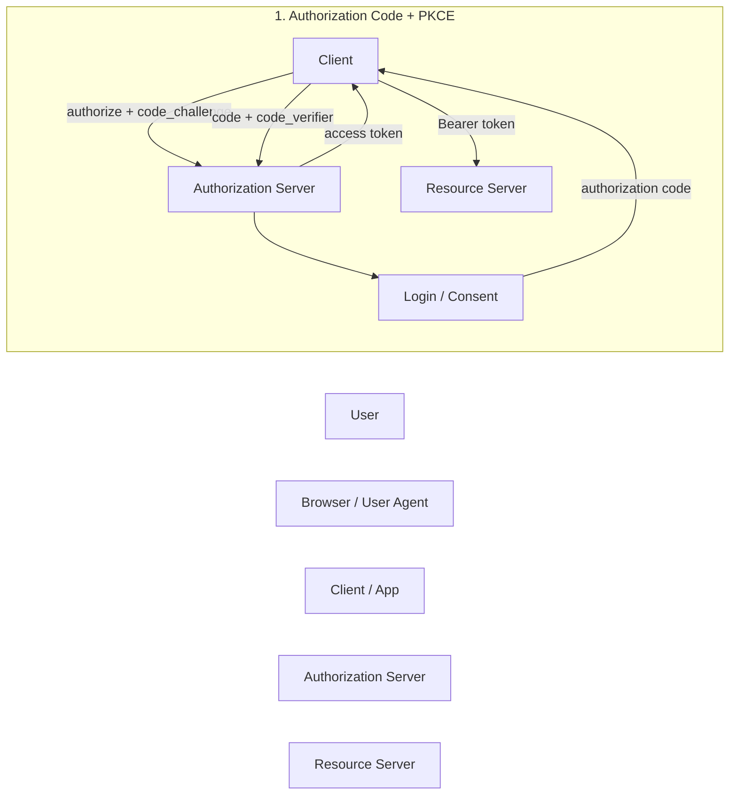

```code
flowchart LR

    U[User]
    B[Browser / User Agent]
    C[Client / App]
    AS[Authorization Server]
    RS[Resource Server]
    %% Client Credentials
    subgraph CC["2. Client Credentials"]
        C2[Service] -->|client credentials| AS2[Authorization Server]
        AS2 -->|access token| C2
        C2 -->|Bearer token| RS2[Resource Server]
    end
```

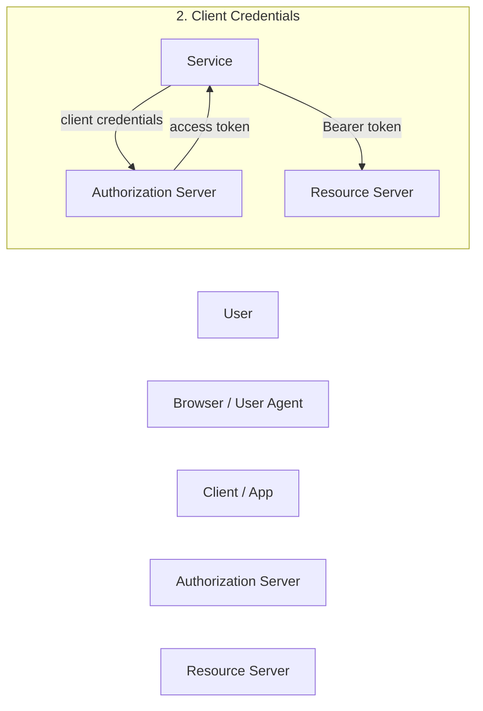


```code
    U[User]
    B[Browser / User Agent]
    C[Client / App]
    AS[Authorization Server]
    RS[Resource Server]
    %% Device
    subgraph DA["3. Device Authorization"]
        C3[TV / CLI / IoT] -->|device authorization request| AS3[Authorization Server]
        AS3 -->|device_code + user_code| C3
        C3 -->|show user_code| U3[User]
        U3 -->|authorize| B3[Browser]
        C3 -->|poll token endpoint| AS3
        AS3 -->|access token| C3
        C3 --> RS3[Resource Server]
    end
```

```mermaid 
    U[User]
    B[Browser / User Agent]
    C[Client / App]
    AS[Authorization Server]
    RS[Resource Server]
    %% Device
    subgraph DA["3. Device Authorization"]
        C3[TV / CLI / IoT] -->|device authorization request| AS3[Authorization Server]
        AS3 -->|device_code + user_code| C3
        C3 -->|show user_code| U3[User]
        U3 -->|authorize| B3[Browser]
        C3 -->|poll token endpoint| AS3
        AS3 -->|access token| C3
        C3 --> RS3[Resource Server]
    end
```


```code
    U[User]
    B[Browser / User Agent]
    C[Client / App]
    AS[Authorization Server]
    RS[Resource Server]
    %% Refresh
    subgraph RT["4. Refresh"]
        C4[Client] -->|refresh token| AS4[Authorization Server]
        AS4 -->|new access token| C4
        C4 --> RS4[Resource Server]
    end
```


```mermaid
    U[User]
    B[Browser / User Agent]
    C[Client / App]
    AS[Authorization Server]
    RS[Resource Server]
    %% Refresh
    subgraph RT["4. Refresh"]
        C4[Client] -->|refresh token| AS4[Authorization Server]
        AS4 -->|new access token| C4
        C4 --> RS4[Resource Server]
    end
```
 
```code
                 WHO IS AUTHORIZING?
                       │
          ┌────────────┴────────────┐
          │                         │
        USER                     CLIENT
          │                         │
   ┌──────┴──────┐                  │
   │             │                  │
Browser       No usable         Client Credentials
   │           browser
   │             │
Auth Code     Device Code
 + PKCE
   │
   └───────► Refresh Token
             (afterwards)
``` 

Now, __OAuth__ __2.0__ is particularly well suited to a sequence diagram, because the important thing is who talks to whom, and in what temporal order. A flowchart tends to obscure that.

And I'd slightly revise my earlier categorization: four diagrams are enough for the core modern patterns, with refresh being a branch that commonly follows Authorization Code rather than a separate authorization flow.


* Authorization Code + PKCE
```code
sequenceDiagram
    participant U as User
    participant B as Browser
    participant SPA as React SPA
    participant AS as Authorization Server
    participant API as Resource Server

    U->>B: Open application
    B->>SPA: Load SPA

    SPA->>SPA: Generate code_verifier<br/>and code_challenge
    SPA->>AS: Authorization request<br/>+ code_challenge
    AS->>B: Login / consent
    U->>B: Authenticate / approve

    AS-->>B: Redirect with authorization code
    B->>SPA: Authorization code

    SPA->>AS: Token request<br/>code + code_verifier
    AS-->>SPA: Access token (+ refresh token)

    SPA->>API: Request + access token
    API-->>SPA: Protected resource
```    

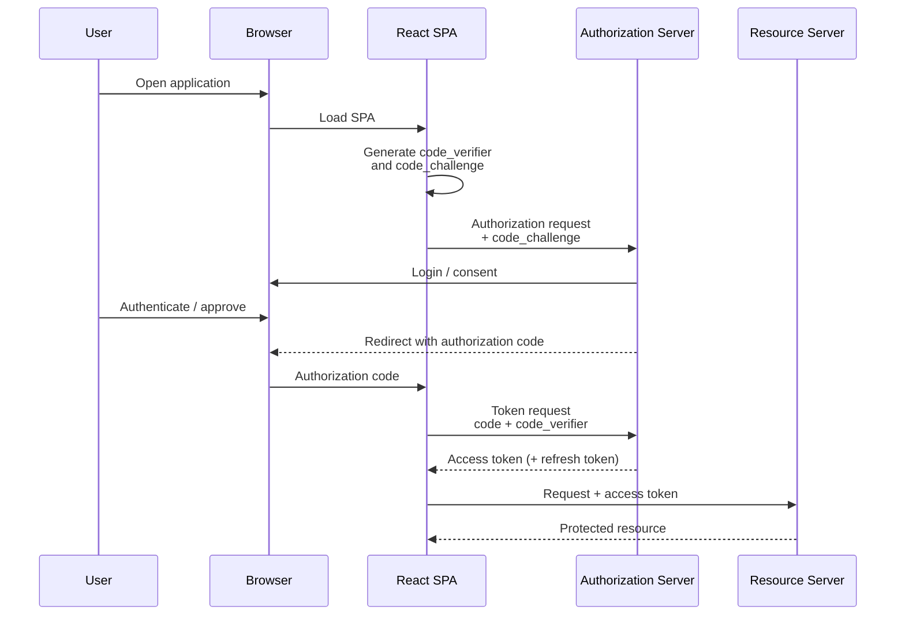

* Authorization Code — confidential/server-side client

```code
sequenceDiagram
    participant U as User
    participant B as Browser
    participant FE as Frontend
    participant BE as Spring Boot
    participant AS as Authorization Server
    participant API as Resource Server

    U->>B: Open application
    B->>FE: Load application

    FE->>BE: Start login
    BE-->>B: Redirect to Authorization Server
    B->>AS: Authorization request
    AS->>U: Login / consent
    U->>AS: Authenticate / approve

    AS-->>B: Redirect with authorization code
    B->>BE: Authorization code

    BE->>AS: Code + client authentication
    AS-->>BE: Access token (+ refresh token)

    BE->>API: Request + access token
    API-->>BE: Protected resource
    BE-->>FE: Application data
```
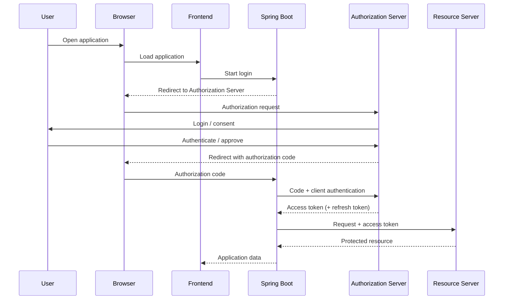

* Client Credentials — machine to machine

```code
sequenceDiagram
    participant APP as Backend Service
    participant AS as Authorization Server
    participant API as Resource Server

    APP->>AS: Token request<br/>client_id + client_secret
    AS-->>APP: Access token

    APP->>API: Request + access token
    API-->>APP: Protected resource
```
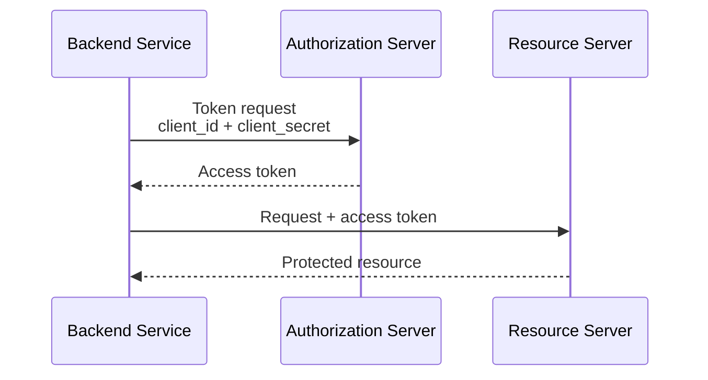

* Device Authorization — “the device can't conveniently log in”

```code
sequenceDiagram
    participant D as Device / CLI
    participant AS as Authorization Server
    participant B as User Browser
    participant U as User
    participant API as Resource Server

    D->>AS: Device authorization request
    AS-->>D: device_code + user_code + verification URI

    D->>U: Display user_code
    U->>B: Open verification URI
    B->>AS: Login
    U->>B: Authenticate / approve

    loop Polling
        D->>AS: Token request + device_code
        AS-->>D: authorization_pending
    end

    AS-->>D: Access token

    D->>API: Request + access token
    API-->>D: Protected resource
```

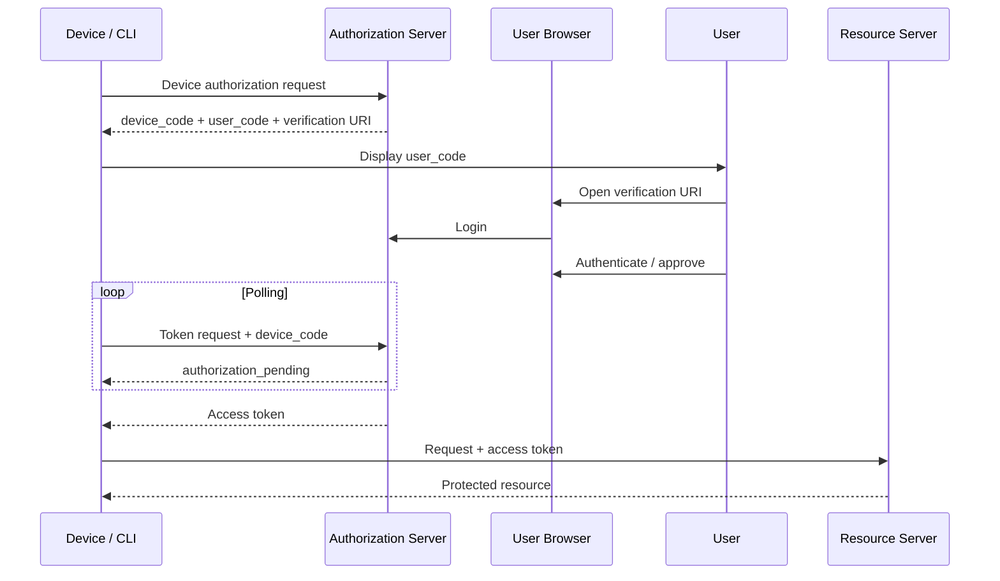


* not really another (refresh) flow
```code
sequenceDiagram
    participant C as Client
    participant AS as Authorization Server
    participant API as Resource Server

    C->>API: Request with expired access token
    API-->>C: 401 Unauthorized

    C->>AS: Refresh token
    AS-->>C: New access token

    C->>API: Retry with new access token
    API-->>C: Protected resource
```
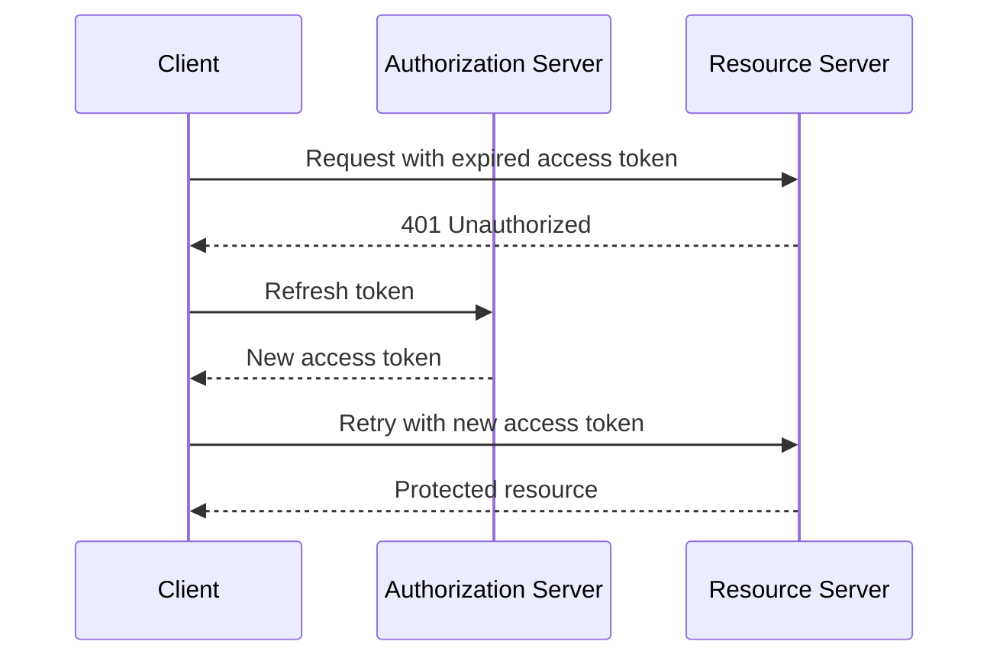


|#||Pattern||User?||Browser?||Typical case|
|-|-|-|-|-|
|1 |Authorization Code + PKCE|✅|✅|SPA/mobile/web app|
|2 |Authorization Code + confidential client|✅|✅|Server-side web app/BFF|
|3| Client Credentials|❌|❌|Service → service|
|4|Device Authorization|✅|Separate device|CLI/TV/device|
| | | | | |

> NOTE __“on behalf of the user”__ delegated authorization: a client gets a token that allows it to access a resource as the user / with the user's authority.
 - is *not* itself a separate __OAuth__ __2.0__ grant/flow.
```code

     WHOSE AUTHORITY?
                       │
          ┌────────────┴────────────┐
          │                         │
       USER'S                    CLIENT'S
      authority                  authority
          │                         │
   Authorization Code         Client Credentials
      + PKCE
          │
   "on behalf of user"

```
```code
sequenceDiagram
    participant U as User
    participant B as Browser
    participant C as Client
    participant AS as Authorization Server
    participant API as Resource Server

    U->>B: Log in
    B->>AS: User authorization
    AS-->>B: Authorization code
    B->>C: Authorization code

    C->>AS: Exchange code
    AS-->>C: Access token

    C->>API: Access token
    API-->>C: User's protected data
```

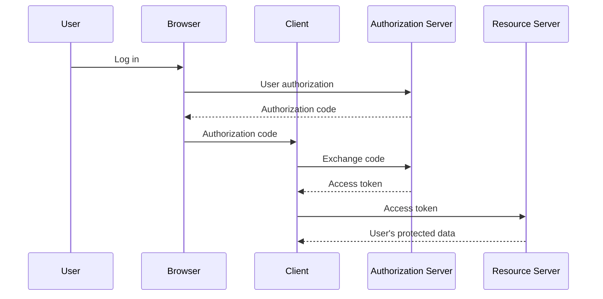
The distinction is roughly:

The client is accessing the API on behalf of the user.


__On-Behalf-Of__ (__OBO__)
*is* a particularly important pattern in __enterprise identity systems__

```code
User
  │
  │ login
  ▼
Frontend
  │
  │ user's token
  ▼
Backend A
  │
  │ "I need to call API B
  │  on behalf of this user"
  ▼
Authorization Server
  │
  │ delegated token
  ▼
API B
```
```code
sequenceDiagram
    participant U as User
    participant FE as Frontend
    participant A as Backend API A
    participant AS as Authorization Server
    participant B as Backend API B

    U->>FE: Sign in
    FE->>A: Request + user's access token

    A->>AS: Exchange user's token<br/>for token to API B
    AS-->>A: Access token for API B<br/>on behalf of user

    A->>B: Request + delegated token
    B-->>A: User-authorized data
    A-->>FE: Response
```
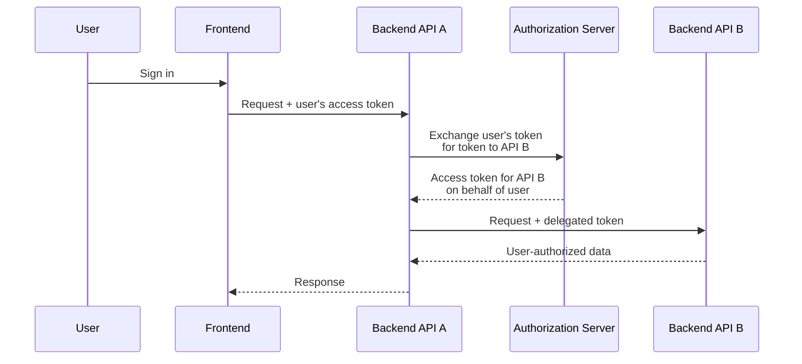

|Situation|Authority|
|---------|---------|
|Client Credentials|Application itself|
|Authorization Code|Application acting with user's delegated authority|
|OBO / token exchange|Backend __A__ acting on behalf of user when calling Backend __B__|


The Microsoft material is deeper than just the four generic OAuth diagrams we made. The key is that Microsoft organizes the subject partly by application type / where the client runs, which changes which OAuth flow is appropriate.

The useful mental model for the Azure exam

I would expand our refresher from four to somethin
That is not the ordinary OAuth Authorization Code flow.

It is a token-exchange/delegation pattern, famously exposed as the OAuth 2.0 On-Behalf-Of flow in Microsoft Entra ID.
```text


                         Microsoft Entra OAuth
                                │
              ┌─────────────────┼─────────────────┐
              │                 │                 │
           Browser           Native/mobile      Machine
              │                 │                 │
        SPA / Web app       Phone / desktop     Service
              │                 │                 │
        Auth Code + PKCE     Auth Code + PKCE    Client Credentials
              │                 │
              └────────┬────────┘
                       │
                 User involved
                       │
             "on behalf of user"
                       │
                 ┌─────┴─────┐
                 │           │
              normal       OBO
             delegation   downstream API
```

* Normal browser
```
sequenceDiagram
    participant U as User
    participant B as Browser
    participant SPA as SPA
    participant Entra as Microsoft Entra
    participant API as API

    U->>B: Use application
    B->>SPA: Run SPA

    SPA->>Entra: Authorization request + PKCE
    Entra->>B: Login / consent
    U->>B: Authenticate

    Entra-->>B: Authorization code
    B->>SPA: Code

    SPA->>Entra: Code + code_verifier
    Entra-->>SPA: Access token

    SPA->>API: Access token
    API-->>SPA: Data
```
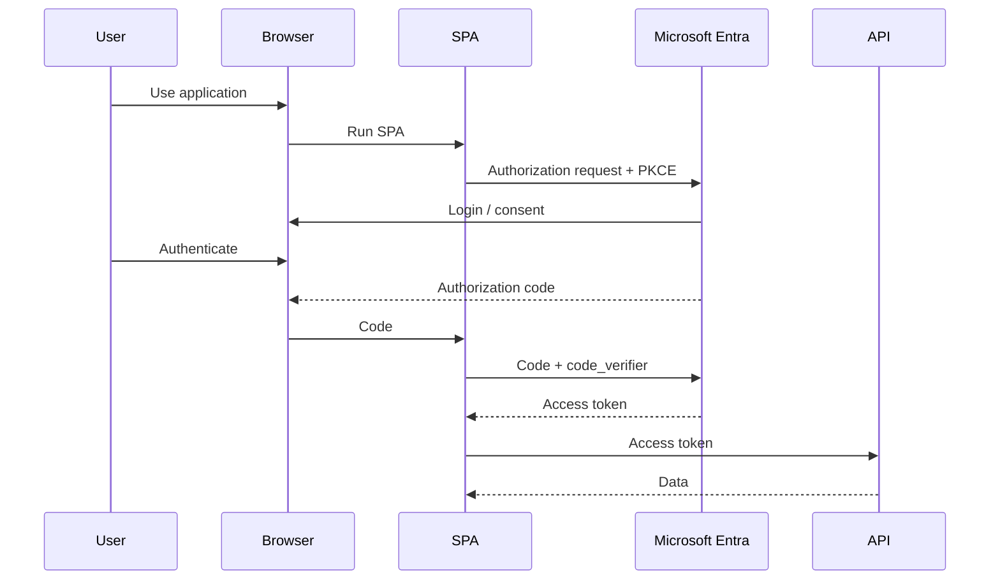

* Phone / native application 
```code
sequenceDiagram
    participant U as User
    participant APP as Mobile App
    participant B as System Browser
    participant Entra as Microsoft Entra
    participant API as API

    U->>APP: Start application

    APP->>Entra: Authorization request + PKCE
    Entra->>B: Open authentication
    U->>B: Authenticate / consent

    Entra-->>B: Authorization code
    B-->>APP: Redirect with code

    APP->>Entra: Code + code_verifier
    Entra-->>APP: Access token

    APP->>API: Access token
    API-->>APP: Data
```
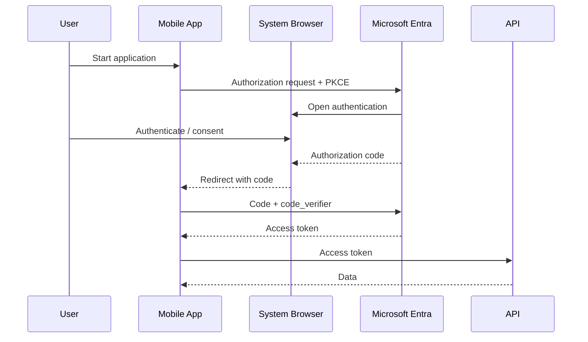

 * Device Code flow - phone does the authentication for another device
 
 ```code
 sequenceDiagram
    participant TV as TV / CLI
    participant Entra as Microsoft Entra
    participant Phone as Phone Browser
    participant U as User

    TV->>Entra: Device authorization request
    Entra-->>TV: user_code + verification URI

    TV->>U: "Go to URL and enter code"

    U->>Phone: Open verification URL
    Phone->>Entra: Authenticate
    U->>Phone: Approve

    loop Polling
        TV->>Entra: Is authorization complete?
        Entra-->>TV: Pending
    end

    Entra-->>TV: Access token
 ```
 ```mermaid
 sequenceDiagram
    participant TV as TV / CLI
    participant Entra as Microsoft Entra
    participant Phone as Phone Browser
    participant U as User

    TV->>Entra: Device authorization request
    Entra-->>TV: user_code + verification URI

    TV->>U: "Go to URL and enter code"

    U->>Phone: Open verification URL
    Phone->>Entra: Authenticate
    U->>Phone: Approve

    loop Polling
        TV->>Entra: Is authorization complete?
        Entra-->>TV: Pending
    end

    Entra-->>TV: Access token
 ```
### Learn Microsoft

https://learn.microsoft.com/en-us/

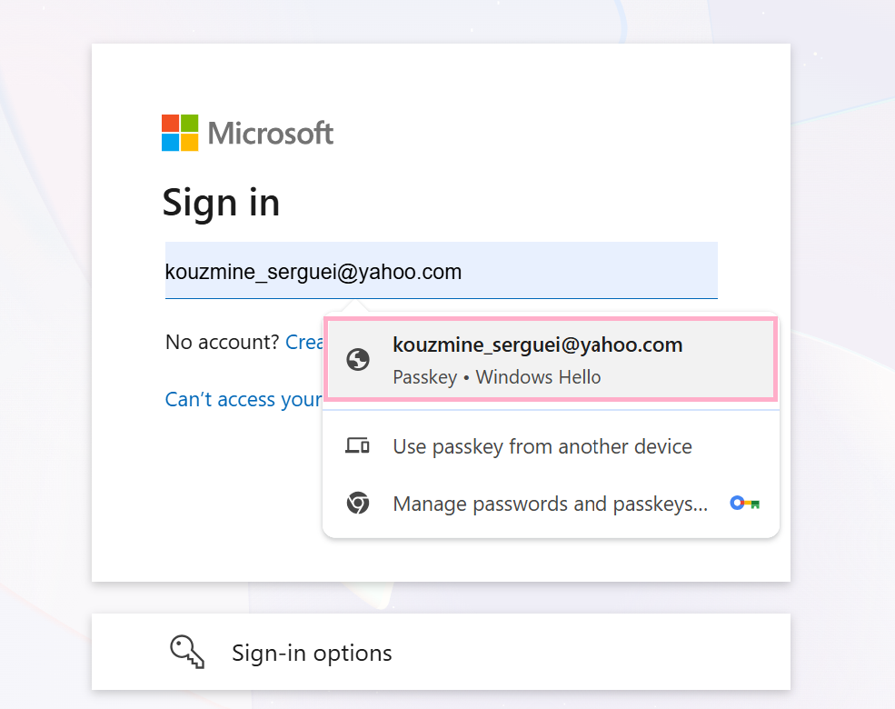

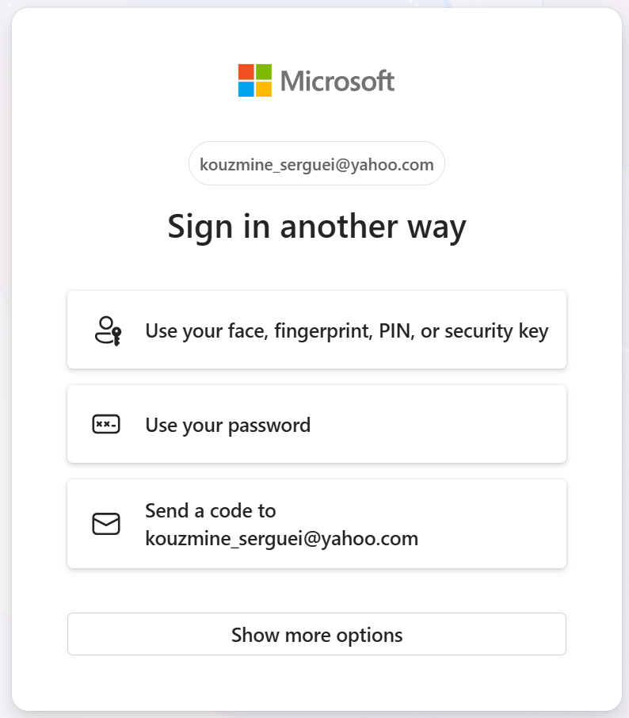

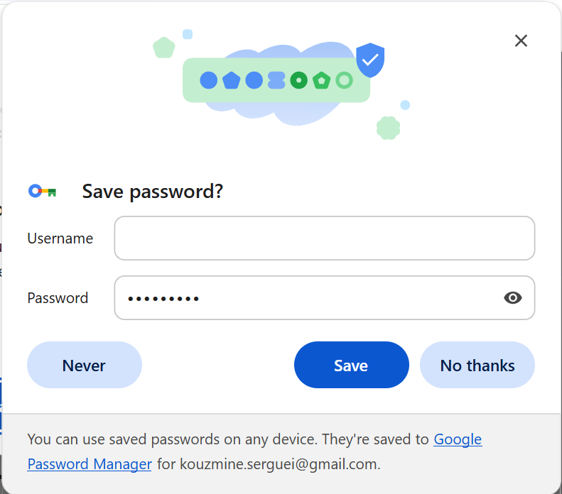


https://learn.microsoft.com/en-us/entra/architecture/auth-oauth2

https://learn.microsoft.com/en-us/entra/


https://learn.microsoft.com/en-us/
