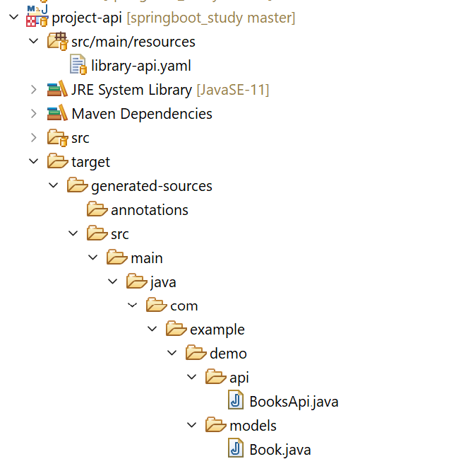

### Info

This directory project demonstrates how to use the [OpenAPI Generator Maven Plugin](https://github.com/OpenAPITools/openapi-generator/tree/master/modules/openapi-generator-maven-plugin) to automatically create a __Spring Boot__ __REST controller__ application API interfaces and Model DTO classes from an [OpenAPI (Swagger) specification](https://en.wikipedia.org/wiki/OpenAPI_Specification). It follows an [API-first approach](https://swagger.io/resources/articles/adopting-an-api-first-approach/)  — defining the API contract in banking-api.yml, then generating consistent backend code


The openapi-generator-maven-plugin is a build plugin hosted on Maven Central that automates the generation of client SDKs, server stubs, and documentation from an OpenAPI specification file creating "generated" classes in client and server namespace



### Background

__API-first__ is generally considered the more modern/default approach today, but __code-first__ is still perfectly valid

Canonical definition of __API-first__ is define the contract (e.g., an __OpenAPI__ Specification file) *before* writing implementation code (a.k.a. __YAML__ as a source of truth

This


  * Encourages contract-driven development
  * Works well with microservices + distributed teams
  * Enables early:
   + mocking
   + client SDK generation
   + parallel frontend/backend work
  * Produced by evolved tooling ecosystems like __Swagger__ / __OpenAPI Generator__
  
  * naturally supports long-lived APIs where backward compatibility matters


The __Code-first__ definition is code (controllers, annotations) is written, and later one generates the OpenAPI spec from it.

Reasons it still exists (and is doing well) include
  * Somewhat faster for small/internal services
  * Less upfront design overhead
  * Fits natural in annotation rich frameworks like:
    + __Spring Boot__
    + __ASP.NET Core__ (all variants)

is often of choice in
  * Solo dev or small team
  * Internal APIs with low external dependency
  * Rapid/Early prototyping / experimentation
  * If/When the API is tightly coupled to implementation anyway

Most mature teams end up with a __hybrid__ approach. The assertion _**API-first** = more enterprise, **code-first** = outdated_ is not quite true

### Usage

> Note: maven `build` can no longer begins with `compile`:
```sh
mvn clean compile
```
```text
[ERROR]   symbol: class Generated
[ERROR] /C:/developer/sergueik/springboot_study/basic-openapi-generator/src/main/java/com/thulasizwe/bank/controllers/CustomerController.java:[4,31] cannot find symbol
[ERROR]   symbol:   class CreateCustomerRequest
[ERROR]   location: package com.thulasizwe.bank.dto
```
the generated sources are relocable:

```sh
mvn generate-sources
cp -r target/generated-sources/openapi/src .
```
```cmd
mvn.cmd generate-sources
robocopy target\generated-sources\openapi\src src /s
```

```text
[WARNING] Exception while reading:
io.swagger.v3.parser.exception.ReadContentException: Unable to read location `src/main/resources/openapi/api-contracts

Caused by: java.io.FileNotFoundException: basic-openapi-generator\src\main\resources\openapi\api-contracts (Access is denied)


INFO] BUILD FAILURE
[ERROR] Failed to execute goal org.openapitools:openapi-generator-maven-plugin:7.4.0:generate (generate-api) on project bank: Code generation failed. See above for the full exception. -> [Help 1]
```
addressing misc. build errors is a WIP

### Example API YAML 

(fragment)

```yaml
paths:
  # Customer Endpoints
  /customers:
    post:
      tags:
        - Customer
      operationId: createCustomer
      summary: Create a new customer
      requestBody:
        required: true
        content:
          application/json:
            schema:
              $ref: '#/components/schemas/CreateCustomerRequest'
      responses:
        '201':
          description: Customer created successfully
          content:
            application/json:
              schema:
                $ref: '#/components/schemas/CustomerResponse'
        '400':
          description: Invalid request
          content:
            application/json:
              schema:
                $ref: '#/components/schemas/ErrorResponse'

```
### See Also

  * https://github.com/OpenAPITools/openapi-generator
  * https://mvnrepository.com/artifact/org.openapitools/openapi-generator-maven-plugin  
  * https://github.com/Chrimle/openapi-to-java-records-mustache-templates
  * https://github.com/zjurenjie/java-openapi-generator
  * https://habr.com/ru/companies/axenix/articles/694340/ (in Russian, vague)
  * https://github.com/emelyanovkr/OpenApiGeneratorExample (note: gradle)
  * https://github.com/sudmonkey/openapi-spring-example/ (note: java 1.7)
  * https://swagger.io/resources/articles/adopting-an-api-first-approach/
  * https://wiki.apiopenstudio.com/en/using-apiopenstudio/api-first-design
  * https://github.com/teamdigitale/api-openapi-samples/blob/master/bin/api-spec-converter.sh
  * https://github.com/speakeasy-api/spring-boot-openapi-example 

---
### Author
[Serguei Kouzmine](kouzmine_serguei@yahoo.com)
