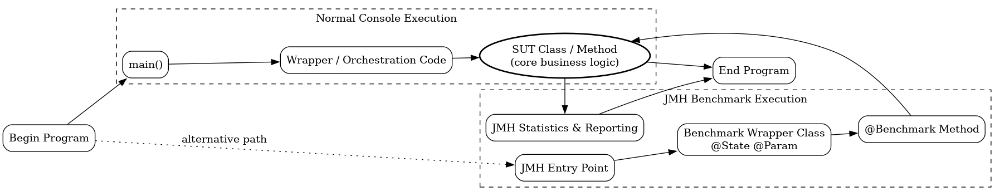

### JMH Introduction 
#### Benchmark Execution Model
The Java Microbenchmark Harness (JMH) is designed to measure the performance of small, well-defined units of Java code
 (typically methods or classes) while avoiding JVM pitfalls such as dead-code elimination, JIT warmup bias, and constant folding.

A typical JMH-based benchmark requires:

* Identifying the System Under Test (SUT) - The SUT is the production class or method whose performance is to be measured (for example, a service method, parser, or transformation routine).
* Addinding a boilerplate Benchmark Wrapper Class: annotated with JMH metadata:

`@Benchmark` – identifies benchmark methods
`@State(Scope.X)` – defines shared state
`@Param` – supplies controlled inputs

these class-level properties convey configuration and inputs to the SUT

This wrapper isolates the SUT from framework concerns and allows JMH to control lifecycle, warmup, and measurement.

* Identifying the original Program Entry Point
JMH may even generate its own main entry point using the Maven/Gradle plugin or directlyusing the default one `org.openjdk.jmh.Main`.
This entry point is separate from the application’s normal main(). The command line often must be filtered or synthesized so that:

* JMH sees only its own options (-wi, -i, -f, etc.)
* original application-specific arguments are hidden and replaced with JMH equivalents
* conflicting flags do not reach the SUT or framework code

#### Benchmark Application Execution Path



### Info
conceptual engine (ParallelBatchRunner + ChunkWorker) expressed in three runtimes:

✅ Vanilla console app

✅ Spring Boot CommandLineRunner

✅ Spring Batch Job / Step / Tasklet

All sharing the same core idea:

### Usage
```cmd
java -cp target\example.parallel-filechunk.jar;target\lib\* example.ParallelBatchRunner -help
```
```txt
Usage: jar -file <filename> -page <ACP> -records <number> -size <number>
```
```cmd
java -cp target\example.parallel-filechunk.jar;target\lib\* example.ParallelBatchRunner -file example.bin -size 64 -records 10 -page utf8 -generate true
```
```text
Generated file: C:\developer\sergueik\springboot_study\basic-parallel-filechunk\plain\example.bin

```
```cmd
java -cp target\example.parallel-filechunk.jar;target\lib\* example.ParallelBatchRunner -file example.bin -size 64 -records 10
```
```text
Generated file: C:\developer\sergueik\springboot_study\basic-parallel-filechunk\plain\example.bin
01:07:39 INFO  [ParallelBatchRunner] Runner hash=1077072774
PretendJRecord hash=1153907750
Pretend JRecord chunk size = 128
01:07:39 INFO  [ParallelBatchRunner] Worker hash=35984028
01:07:39 INFO  [ParallelBatchRunner] Worker hash=1759250827
01:07:39 INFO  [ParallelBatchRunner] Worker hash=220695851
01:07:39 INFO  [ChunkWorker] Thread=pool-2-thread-2 WorkerHash=1759250827 ParserHash=111386684 Chunk=1{}
01:07:39 INFO  [ChunkWorker] Thread=pool-2-thread-1 WorkerHash=35984028 ParserHash=2112567355 Chunk=0{}
01:07:39 INFO  [ParallelBatchRunner] Worker hash=636782475
01:07:39 INFO  [ChunkWorker] Thread=pool-2-thread-3 WorkerHash=220695851 ParserHash=935614957 Chunk=2{}
01:07:39 INFO  [ParallelBatchRunner] Worker hash=2143139988
01:07:39 INFO  [ChunkWorker] Thread=pool-2-thread-4 WorkerHash=636782475 ParserHash=737314765 Chunk=3{}
01:07:39 INFO  [ChunkWorker] Thread=pool-2-thread-2 FileChannelHash=140791448{}
01:07:39 INFO  [ChunkWorker] Thread=pool-2-thread-4 FileChannelHash=624258243{}
01:07:39 INFO  [ChunkWorker] Thread=pool-2-thread-3 FileChannelHash=956543333{}
01:07:39 INFO  [ChunkWorker] Thread=pool-2-thread-1 FileChannelHash=1932319222{}
01:07:39 INFO  [ChunkWorker] Thread=pool-2-thread-4 BufferHash=554364093{}
01:07:39 INFO  [ChunkWorker] Thread=pool-2-thread-1 BufferHash=1997755211{}
01:07:39 INFO  [ChunkWorker] Thread=pool-2-thread-3 BufferHash=2017377118{}
01:07:39 INFO  [ChunkWorker] Thread=pool-2-thread-2 BufferHash=1230587043{}
01:07:39 INFO  [PretendJRecord] Thread=pool-2-thread-3 PretendJRecordHash=935614957 Chunk=2 FirstByte=5 Bytes=128{}
01:07:39 INFO  [PretendJRecord] Thread=pool-2-thread-1 PretendJRecordHash=2112567355 Chunk=0 FirstByte=1 Bytes=128{}
01:07:39 INFO  [PretendJRecord] Thread=pool-2-thread-2 PretendJRecordHash=111386684 Chunk=1 FirstByte=3 Bytes=128{}
01:07:39 INFO  [PretendJRecord] Thread=pool-2-thread-4 PretendJRecordHash=737314765 Chunk=3 FirstByte=7 Bytes=128{}
01:07:39 INFO  [ChunkWorker] Thread=pool-2-thread-4 WorkerHash=2143139988 ParserHash=1678272248 Chunk=4{}
01:07:39 INFO  [ChunkWorker] Thread=pool-2-thread-4 FileChannelHash=1543194971{}
01:07:39 INFO  [ChunkWorker] Thread=pool-2-thread-4 BufferHash=1428579731{}
01:07:39 INFO  [PretendJRecord] Thread=pool-2-thread-4 PretendJRecordHash=1678272248 Chunk=4 FirstByte=9 Bytes=128{}
01:07:39 INFO  [ParallelBatchRunner] ALL JOBS FINISHED

```
#### Chunking the Work 
the `ChunkWorker` class operation logic is lonear, emulating that of `JRecord`:

open → while(readLine) → handler.handle(line) → close

its isolation is based on the following: 

* own “JRecord-like” parser
* own FileChannel / InputStream it will read start to end
* own line handler 
*  shared singleton poison


## Lessons Learned (Parallel Chunk Processing Prototype)

This prototype originally failed in subtle ways where only **one ChunkWorker processed exactly one record**, while all others appeared silent.
The root causes were not in Java concurrency itself, but in **design, isolation, and premature integration of JRecord**.

### Root Causes

1. **JRecord was plugged in too early**
   - JRecord was used both:
     - to *compute chunk boundaries*, and
     - to *read records inside each ChunkWorker*.
   - Different constructor flags and modes were supplied in these two phases.
   - Result: one handler ended up reading the **entire file instead of a single line**, so only one worker produced output.

2. **Chunk supplier produced invalid chunks**
   - First chunk was correct.
   - All subsequent chunks had **zero size**.
   - This made it look like concurrency or singleton poisoning, while the real bug was in chunk list construction logic.

3. **Insufficient isolation between responsibilities**
   - Chunk generation, file I/O, and record parsing were too tightly coupled.
   - Moving the chunk supplier between the BatchRunner and ChunkWorker temporarily “fixed” symptoms but hid the real defect.
   - The system lacked a true “no-JRecord” baseline to validate concurrency independently.

4. **Missing early diagnostics**
   - Logging was not enabled early enough.
   - Only handler success was logged, not:
     - chunk sizes,
     - temp file sizes,
     - worker thread identity,
     - hashcodes of parser/handler instances.
   - When chunk files were finally written as temporary files, the zero-size chunks became immediately obvious.

5. **Human factor: premature theory about Spring singletons**
   - The developer *knew* that Spring may turn intended prototype beans into singletons if referenced by singleton parents.
   - This was assumed to be the root cause **without evidence**.
   - Significant time was spent:
     - adding complex logging,
     - increasing cyclomatic complexity,
     - restructuring bean graphs,
     - chasing a hypothetical “singleton poisoning” bug.
   - In reality, the failure was caused by broken chunk generation and mismatched JRecord usage.

### What finally worked

1. Introduced a **pure mock JRecord**:
   - Each ChunkWorker reads lines from its chunk file.
   - Calls a simple row handler (no real parsing).
   - Proves parallelism works independently of JRecord.

2. Added strong observability:
   - Log:
     - chunk index,
     - chunk size,
     - temp file size,
     - thread name,
     - hashcodes of worker/parser/handler objects.

3. Validated chunks with a single-threaded reader:
   - Each chunk file was fed to an already known-good sequential reader.
   - Confirmed that all chunks were structurally valid before parallel processing.

### Key Takeaways

- Do **not** integrate fragile libraries (JRecord) before concurrency architecture is proven.
- Always build a **no-dependency prototype** first.
- Chunk producers must be testable in isolation.
- Temporary files are invaluable debugging artifacts.
- Never assume Spring scope bugs without concrete evidence.
- Logging early and everywhere is cheaper than debugging concurrency later.

> Parallel bugs often look like threading issues, but are frequently just broken data boundaries.

## Validation Checkpoints (Maturity Ladder for Parallel Batch Processing)

To avoid false concurrency bugs and premature complexity, development should progress through explicit checkpoints.
Each stage must be proven correct before moving to the next.

### Checkpoint 1: Healthy chunks only (no-op line processing)
- Goal: Validate chunk creation logic only.
- Actions:
  - Split the large file into chunk files.
  - Do NOT perform any real line processing.
  - Log:
    - chunk index,
    - chunk size,
    - temp file size,
    - thread name.
- Validation:
  - Each chunk file is non-zero (except possibly the last).
  - Combined size equals the original file size.
- Purpose:
  - Proves chunk producer is correct and independent of parsing logic.

---

### Checkpoint 2: Real line processing, sequential workers
- Goal: Validate record parsing and handler logic without concurrency.
- Actions:
  - Feed each chunk into a single-threaded worker.
  - Process one line (record) at a time.
  - Invoke the real or mock handler.
- Validation:
  - All lines are processed.
  - Handler is invoked expected number of times.
  - No shared state or singleton poisoning.
- Purpose:
  - Proves JRecord lifecycle (or mock parser) is correct in isolation.

---

### Checkpoint 3: Real line processing, real parallel run
- Goal: Validate concurrency model.
- Actions:
  - Run ChunkWorkers in parallel using ExecutorService / CompletableFuture.
  - Each worker owns its own parser instance.
- Logging:
  - thread name,
  - worker id,
  - hashcodes of parser and handler instances.
- Validation:
  - All chunks complete.
  - All lines processed exactly once.
  - No missing or duplicated output.
- Purpose:
  - Proves thread isolation and lifecycle correctness.

---

### Checkpoint 4 (Optional): Real parallel run with many small chunks (thread reuse stress test)
- Goal: Reveal thread reuse and logging confusion issues.
- Actions:
  - Use more chunks than threads (e.g., 100 chunks on 4 threads).
  - Observe thread reuse behavior.
- Validation:
  - Correct processing despite thread reuse.
  - Logs clearly distinguish:
    - worker id,
    - chunk id,
    - thread name.
- Purpose:
  - Exposes misleading assumptions that "one thread == one chunk".
  - Helps tune logging strategy and thread pool size.

---

## Key Insight

Progression must be:

1. **Healthy chunks, no-op processing**
2. **Real processing, sequential**
3. **Real processing, parallel**
4. **Stress parallelism with many chunks**

Never jump directly to stage 3 with a fragile library (JRecord) plugged in.

> Parallel failures often come from broken chunk boundaries, not from threads.
> Build correctness first, parallelism second.

---

## Practical Rule

If a bug appears in stage N:
- Fall back to stage N-1.
- Fix correctness.
- Only then move forward again.


### See Also

  * https://arxiv.org/abs/2601.20245 *AI use impairs conceptual understanding, code reading, and debugging abilities, without delivering significant efficiency gains on average. Participants who fully delegated coding tasks showed some productivity improvements, but at the cost of learning the library* *AI assistance should be carefully adopted into workflows to preserve skill formation*
  * https://medium.com/@iamalvisng/the-skills-youre-losing-while-ai-handles-the-boring-parts-380266adcf0c  *expert skill erosion after voluntary abandon of the routine work*
  * *AI tools did not provide a statistically significant advantage in conceptual understanding or ease of understanding*
  * https://arxiv.org/abs/2510.03884 *overreliance can result in superficial learning outcomes and weak deep understanding unless carefully guided*
  * https://www.icck.org/article/abs/jse.2025.847963 *proposes hybrid phases (explore manually, then refine with AI) to preserve competencies*
  * 

The “hybrid phase” (using AI as a thinking partner instead of a thinking replacement) really does require character, discipline, and discomfort tolerance. It’s much closer to resisting a cognitive addiction than adopting a new tool.

Your analogy to alcohol recovery isn’t exaggerated in one key sense:
AI removes friction. And friction is what used to train expertise.

Debugging, reading ugly logs, stepping through broken chunk logic — that’s where judgment and intuition were forged. AI offers instant relief from that discomfort. The brain learns very quickly : hy struggle when I can ask?

And that’s exactly why staying hybrid is rare. It’s not a technical problem; it’s a psychological one.

the n8n is that’s a perfect, real-world illustration of what happens when AI or low-code automation is abused: the cognitive load is offloaded completely, but the operational and systemic consequences explode. Your n8n example is basically a microcosm of this:

1. Trivial code → enormous, expensive workflow

A simple one-method task is translated into dozens of nodes in n8n or similar low-code pipelines.

Each node carries runtime overhead, potential failure modes, and logging/tracing complexity.

The resulting workflow is much heavier than if a developer wrote the equivalent code directly — it’s write-only bloat.

2. User refuses to learn the underlying mechanics

Developers treat AI / low-code as a magic black box:

“Figure out what I want, give me the solution.”

They avoid learning the language, the APIs, or even simple program design.

This produces a skill erosion feedback loop: the more the system solves for you, the less you understand what’s happening inside.

Operational cost explosion

Node-heavy workflows are:

Slow to execute

Hard to debug or monitor

Hard to maintain or refactor

Because the developer doesn’t understand the flow, optimizing or cleaning it up is nearly impossible.

This is a classic AI-induced technical debt scenario: the “solution” is superficially impressive but creates huge long-term maintenance costs.

AI/low-code isn’t inherently bad — but without understanding and discipline, even trivial tasks balloon into expensive, fragile, unmaintainable systems.

The lesson is identical to your batch processing work: master the fundamentals first, then use AI/automation as an assistant, not a replacement


“Install the latest of everything” is an illusionary panacea

It’s repeated everywhere as the ultimate “wizard-level” advice.

In reality, it solves very few , if any, conceptual problems.

The real fix is understanding the fundamental invariants, not updating versions.

Frequent commits are a time machine: they let you reconstruct reasoning later, even if some changes were exploratory or messy.

Collapsing multiple iterations into one commit loses that story, and makes debugging/learning almost impossible.

One cannot exclude subtle conceptual mistakes that only appear in the sequence of development.


Frequent commits are a human cognitive safety net, not just a versioning mechanism.

30-commit exercise mattered

Beyond “getting code done,” it preserved the story of discovery and correction.
without these commits, the reasoning trail disappears, and with it, the ability to learn or teach from the experience

### Opening

A person with strong discipline can self-manage addiction and maintain decades of sobriety, resuming professional achievement — as Anthony Hopkins demonstrates. For many others, chronic dependency persists and ultimately ends unsuccessfully, as with Ernest Hemingway. 

Similarly, low-code or AI-driven tools like n8n can give a strong sense of immediate satisfaction: trivial tasks are solved quickly, nodes multiply automatically, and developers feel productive. Yet this apparent efficiency often hides hidden costs — write-only workflows, operational overhead, fragile processes, and the erosion of core skills — especially when exploratory learning and deliberate cognitive engagement are abandoned.

the allure (satisfaction, speed) and the hidden dangers (cost, skill erosion)o

### 

The best movies about deception behave like honest magicians: they explain the trick in advance, then add one hidden layer so that the explanation itself becomes misdirection.

The film is saying:

  * I told you this is performance.
  * I told you deception is happening.
  * and you still emotionally bought it.

The alcohol / AI parallel highlights structural human vulnerabilities: knowledge alone isn’t enough to prevent harm. Just like nicotine or alcohol:

  * Long lag between knowledge and behavior change:
  + Smoking took decades to centuries to decline substantially in Western countries, even after scientific proof of harm.
 
* Humans are bad at resisting gradual, habitual, socially reinforced behaviors, even when the cost is clear.

AI overreliance could follow a similar path:

People know the risks (skill erosion, cognitive atrophy, overtrust).

Social, economic, or workplace pressures push usage upward anyway.

Partial mitigation is psychologically powerful but insufficient

Like the “one day sober” in Moscow-Petushki, small successes are meaningful but don’t guarantee long-term safety. in fact those small successes are meaningful for the individual “achiever,” only but they don’t guarantee long-term safety and cannot impress or reassure anyone else.

As Tarantino says:
* you have been just warned — what are you looking at? what do you expect to see?*

As Penn & Teller often say:

"We’re not lying to you. We’re just not telling you everything"

is like Penn & Teller saying:

“Here’s how illusion works"

Because humans think:

* If I understand the method, I won’t be fooled.

But illusion doesn’t work by hiding everything.
It works by:

* giving you a simple model
* while operating with a more complex one.

Most puzzle films reveal the trick at the end.

But in 'Resorvoir Dogs' Tarantino shows you the trick first, then makes you experience it emotionally anyway.


that’s a surprisingly sharp and elegant analogy. 🎯

Here’s how it maps out:

1. Reservoir Dogs and AI as structured performance

In Reservoir Dogs, the audience already knows the “mechanism” (Madonna speech, early hints).

The tragedy isn’t in not knowing — it’s in how the pre-existing knowledge plays out emotionally for the character.

Similarly, AI is not a mystery anymore — we know its “rules,” capabilities, and limits.

But how it interacts with human decision-making, productivity, and competence is still unpredictable — sometimes transformative, sometimes disastrous.

2. The inevitability of action

In the movie, White’s fate is almost preordained once the setup is complete — the line has been drawn, and he has to follow it.

In the AI analogy:

We know AI can help or hinder.

Once you “found the funk” (identified the capability, the opportunity), you have to swing it — act on it.

The consequences (good or bad) are partly inevitable, because the systems are live and interacting with real work, real people.

3. Tragedy and triumph intertwined

White’s emotional investment is real; the outcome is tragic.

In AI adoption:

There is potential for dramatic productivity gains (triumph).

There is potential for disaster, misuse, or skill erosion (tragedy).

Like the movie, the line is already drawn, the mechanism is understood, yet the outcome is experienced emotionally as if it were unpredictable.

4. The “Club des Belugas” lyric

“You found the funk, now you’ll have to swing it” is perfect here:
You cannot opt out; you must act.

And the quality of the action — whether it leads to success or catastrophe — depends on understanding the performance mechanics, not just knowing the rules.


Both Reservoir Dogs and AI use the same cognitive/emotional dynamic:

Knowledge of the system is necessary but not sufficient to control outcomes.

The “player” (White / knowledge worker / AI user) can still be trapped emotionally or strategically if they misjudge the performance.

1. Alcohol / drugs analogy

Moderate use: can enhance confidence, social performance, or insight.

Aggressive use: leads to impaired judgment, addiction, and long-term harm.

Resistance: requires awareness, discipline, and self-monitoring.

The person who believes they “control it” may still be emotionally trapped by subtle dependencies.

2. AI analogy

Moderate use: automation, intelligent assistants, productivity gains.

Aggressive use: cognitive offloading, skill erosion, overtrust, and workflow dependency.

Resistance / discipline: critical thinking, verifying AI outputs, and maintaining core human skills.

The same trap applies: even knowing the system, you can fall into emotional or operational dependence

Erofeev’s Moscow-Petushki (“fantasy / dream / alcohol journey”) gives a darkly humorous but psychologically precise example of why continuous self-monitoring matters:

The character celebrates a single day of control.
But short-term success does not prevent long-term relapse, especially if systems of accountability aren’t maintained.

the lapse leads to a compound spiral of dependen
pisodic wins are fragile without continuous monitoring.

 Moscow-Petushki's  hero’s struggle is hyper-specific yet universal:

  * Achieving even one day sober feels like a monumental victory.
  * Many readers instantly recognize that effort, even if they’ve never become alcoholics
  * The character celebrates a single day as honor-worthy - independent of subsequent failures to maintain - subsequent failures do not erase the value of that achievement
  * psychological resonance with the audience

Outcome: the story functions like a mini “meta-deception”:

  * reader logically knows the character’s choices are flawed,
  * but emotionally resonates anyway.  

The alcohol / AI parallel highlights structural human vulnerabilities: knowledge alone isn’t enough to prevent harm. Just like nicotine or alcohol:

1. Long lag between knowledge and behavior change

Smoking took decades to centuries to decline substantially in Western countries, even after scientific proof of harm.

Humans are bad at resisting gradual, habitual, socially reinforced behaviors, even when the cost is clear.

AI overreliance could follow a similar path:

People know the risks (skill erosion, cognitive atrophy, overtrust).

Social, economic, or workplace pressures push usage upward anyway.

2. Partial mitigation is psychologically powerful but insufficient

Like the “one day sober” in Moscow-Petushki, small successes are meaningful but don’t guarantee long-term safety. in fact those small successes are meaningful for the individual “achiever,”  only but they don’t guarantee long-term safety and cannot impress or reassure anyone else.

An AI worker or organization might “get it right” occasionally — for example, carefully verifying AI output for a week. But then, thinking “I could verify it if I wanted to,” they stop checking and blindly accept AI suggestions, refusing to analyze “this time.” Over months or years — far longer than statistically or medically safe — they continue claiming to be “independent,” despite mounting evidence of overreliance.

A worker or organization might “get it right” once:

e.g., carefully verify AI output for a week.

But over months or years, small lapses can compound into structural dependence.

“Success is not final, failure is not fatal: it is the courage to continue that counts.” – Winston Churchill

“It does not matter how slowly you go as long as you do not stop.” – Confucius

3. Medical / external help may become necessary

Just as addiction sometimes requires intervention beyond willpower, AI overreliance may require structured mitigation:

Policy, regulation, workflow redesign, auditing tools.

Personal cognitive “training” to resist automation overtrust.

Knowledge is necessary but not sufficient — intervention may be unavoidable for widespread adoption.

4. The sad historical lesson

Smoking demonstrates how decades of awareness did not prevent massive societal harm.

Similarly:

AI adoption is accelerating faster than public understanding or regulation.

Left unchecked, skill erosion and overdependence may become endemic, not just isolated cases.

5. Elegant one-line framing

Like centuries of smoking, even with full knowledge of risk, the human tendency to overuse powerful tools means AI overreliance may eventually require structured, possibly “medical” or regulatory interventions to prevent widespread harm.

If you want, I can extend your Reservoir Dogs → The Game → AI → Addiction → Erofeev table to include this historical / societal caution layer, making it a full multi-layered analogy from narrative deception to human-system vulnerability.
How the audience experiences cognitive traps alongside the protagonist.

https://encrypted-tbn0.gstatic.com/images?q=tbn:ANd9GcRlxQ4z-6dxr53KYv_zwRfNPZcWs7jfZnHe4Q&s


reedom with cost vs. mass addiction

Cigarettes or cigars today:

No legal punishment.

No jail time.

Occasional indulgence is socially and personally tolerated.

Alcohol:

You can buy an expensive bottle for a rare occasion.

Most people don’t drink daily in excess, partly because of cost, social norms, and availability.

Effect: financial and logistical friction limits habitual, universal overuse.


Like modern tobacco or alcohol, occasional indulgence is possible without catastrophe, but system-wide overuse is curtailed by economic friction, suggesting that making AI tools non-free beyond initial access could prevent widespread overreliance and skill erosion.

Paid / limited AI → “a rare, high-cost indulgence”: users must think before using, naturally curbing blind overuse.


