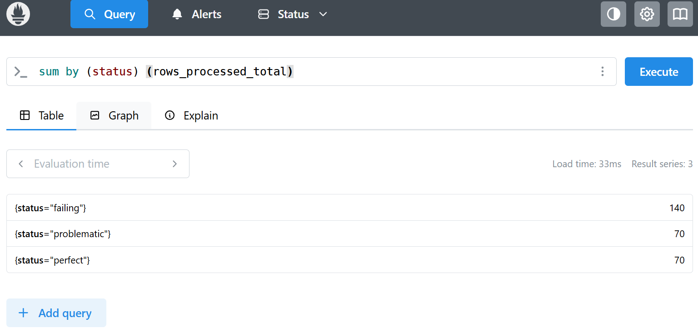
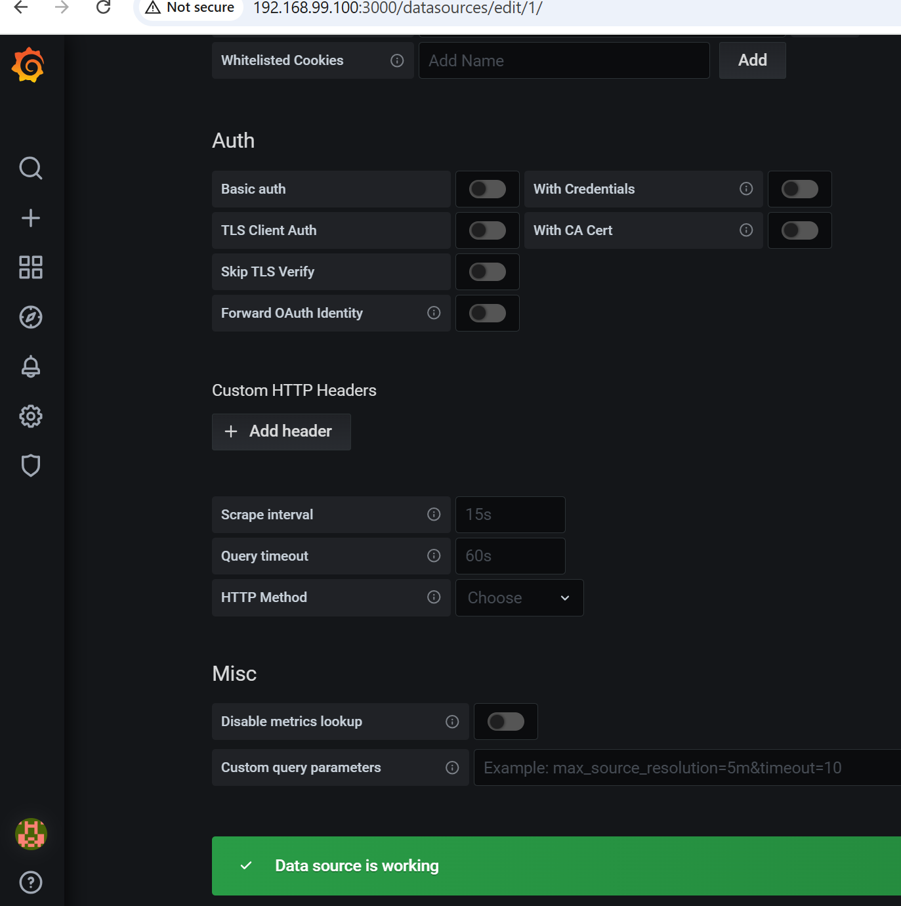
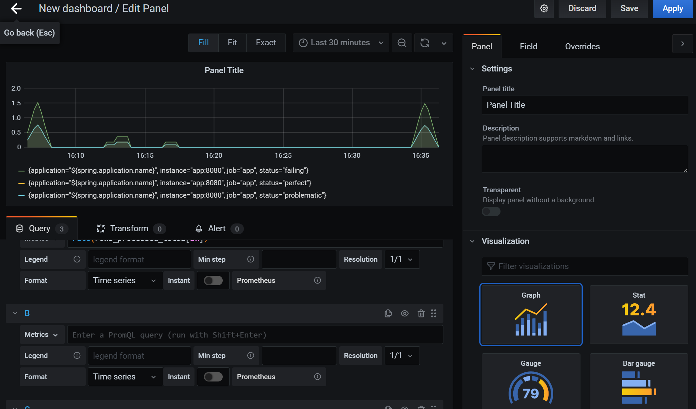
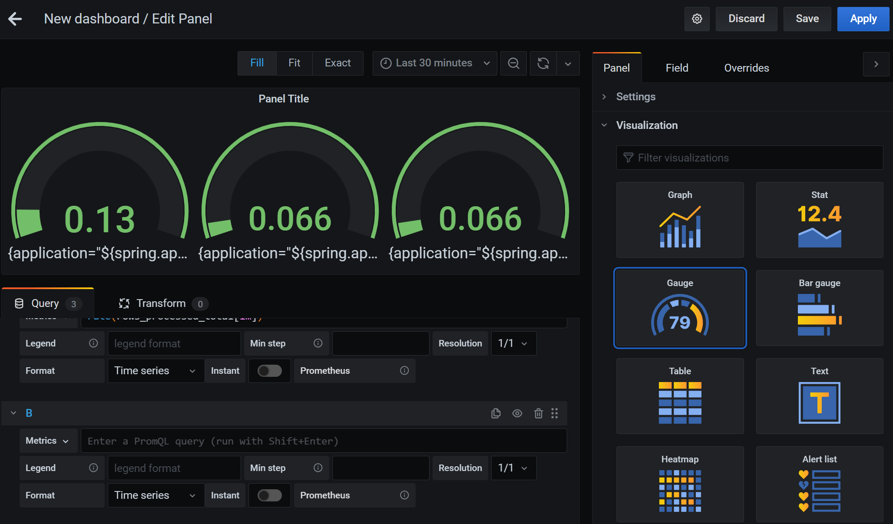

### Usage
```sh
pushd app
mvn spring-boot:run
```

```
for CNT in $(seq 1 1 5) ; do curl -X POST -H 'Conent-Type: text/plain' -d "oooooooxxxooo\noooooooooxxx\noooxxxxooo" -s http://192.168.99.100:8080/analyze > /dev/null; done
```
Note metrics (`http://localhost:8080/actuator/prometheus`):
```text
# HELP file_rows_processed_total Rows processed by status
# TYPE file_rows_processed_total counter
rows_processed{status="failing",...} 12.0
rows_processed{status="problematic",...} 6.0
rows_processed{status="perfect",...} 6.0
```
### Docker
```cmd
pushd package
mvn package
```
```
docker-compose up --build -d
```
```sh
for CNT in $(seq 1 1 5) ;  do curl -s http://192.168.99.100:8080/analyze > /dev/null; done

```
* visit Prometheus node `https://192.168.99.100:9090`




* visit Grafana node, configure data source



* create dashboard (defauly)



* choose



### Info

In __Grafana__ you can build:


-------------------------|-------------------------|-----------|
Kind                     |Query                    | Usage     |
Pie chart (distribution) | `sum by (status) (rows_processed)` | perfect vs problematic vs failing |
Rate over time (pipeline health) | `rate(rows_processed[1m])` | shows how fast issues appear |
Error ratio (very powerful) | `sum(rate(rows_processed{status="failing"}[5m]))` <br/>`/`<br/> `sum(rate(rows_processed[5m]))` | % of failing rows |
Stacked time series | `sum by (status) (rate(rows_processed[1m]))` | trend per category |

