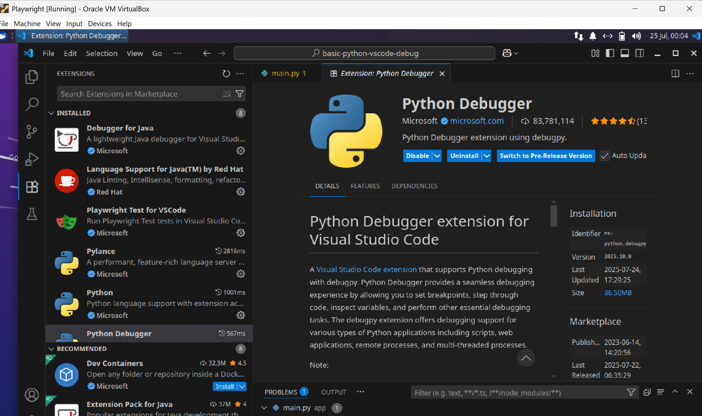

### Info

Replica of [need to debug your FastAPI application with Docker](https://github.com/Kludex/fastapi-docker-debug)
by Kludex with a proxy application passing additional arguments before calling a REST API.


__Docker Toolbox__, though EOL and no longer maintained, remains useful for older or resource-constrained systems, especially Windows __7__/__8__ and even Windows Server and non-Pro editions of Windows __10__ where __Docker Desktop__ is unsupported. It leverages __Oracle VirtualBox__, avoiding the __Hyper-V__ dependency, making it viable for legacy setups or lightweight environments where stability and compatibility outweigh the need for new features.


On a __Windows__ (especially with Docker Toolbox or non-WSL setups), named volumes lack transparent access, making file inspection or editing difficult. Unlike Unix-like systems, bind mounts to host directories often face path translation, permission issues, or require shared folder setups via VirtualBox. Visual Studio Code heavily relies on reliable mounts for DevContainers and debugging, making volume-based workflows harder without proper file system integration or WSL2.


### GCP and Other Cloud Debugging

Google’s recommended flow depends on the environment (Cloud Run, GKE, or Cloud Functions), but in general gets doown to :

#### Use Cloud Logging & Tracing

* Set up Cloud Logging and Cloud Trace with structured logs from your app.

* Add request_id or custom labels to trace logs through services.

engage Cloud Debugger (for GCE, App Engine, or GKE)

* this  needs agent installed and user authenticated.

Python must match supported versions (e.g., Python 3.7–3.9) — older/newer versions may trigger bugs.

Install agent example for Python:

```sh
pip install google-cloud-debugger
google-cloud-debugger --enable_debugger

```
```sh
gcloud auth login
```
```sh
gcloud config set project $PROJECT_ID
gcloud auth application-default login
```

Attach to running pod:

```sh
kubectl exec -it $ID -- /bin/sh
```
* Port-forward locally:

```sh
kubectl port-forward service/myapp 8080:80 5678:5678
```
or for Docker
```sh
docker run -p 5678:5678 my-python-app
```
 __5678__ is the Python debugger commonly used with VSCode

typically the following code is added:

```python
import debugpy
debugpy.listen(("0.0.0.0", 5678))
debugpy.wait_for_client()
```

* Install [Cloud Code VSCode plugin]()

* patch ```
Live debugging is harder at scale due to:

*  Multiple replicas
*  Autoscaling
*  Serverless models (e.g., Cloud Functions) which don’t persist state

the __Visual Studio Code__ is advertized as a lightweight, but under the hood it behaves more 
like a full-blown Electron-based IDE, meaning:

It consumes a lot of RAM and CPU like a browser (because it is one).

Opening multiple windows often spawns new Electron processes, not cheap tabs.

Clipboard sync, especially across windows or with plugins like Remote - SSH or Docker, is slow and buggy.

It tries to be "smart" with file watching, Git integrations, and live linting — but this can bog down low-spec or VM-based systems.

For vendors, VSCode is a dream:

"Free", but encourages use of Azure, GitHub Copilot, Codespaces.

It trains developers to depend on Microsoft's ecosystem.


Geany (C-like IDE feel)

Kate (great for larger files)

Lite (ultra-light Lua-based editor)

VSCodium (telemetry-free VSCode clone, still Electron but cleaner)

Sublime Text (fast, proprietary but stable)


### Usage

```sh
docker-compose -f docker-compose.debug.yaml up --build -d
```
connect with API via curl

```sh
curl -s http://localhost:8000/data
```

### Manual Steps

Due to its dependency on [Docker directory mapping](https://docs.docker.com/engine/storage/bind-mounts) (also known as bind mounts or volume mounts) that only works with some Windows Docker clients [Docker Desktop](https://docs.docker.com/desktop/) but not well with the [Docker  Toolbox](https://docs.bitnami.com/containers/how-to/install-docker-in-windows/)
- a *legacy desktop solution* designed and kept around on these older operating systems Windows Server, Windows _7_,_8_,_10_ by Microsoft and macOS versions __10.8__ (*Mountain Lion*) through __10.10__ (*Yosemite*) by Apple by leveraging a lightweight flat Linux virtual machine (VM) managed by [Docker Machine]() and powered by [Oracle VirtualBox](https://www.virtualbox.org/wiki/Documentation).


It is easier to install npm and vscode on a Linux machine and debug dockerized application from there:

One will still need to interactively install [Python Debugger extension for Visual Studio Code](https://marketplace.visualstudio.com/items?itemName=ms-python.debugpy) from inside [vscode](https://code.visualstudio.com/docs).
the documentation below details the steps

* Examine `.vscode/launch.json` for VS Code debugging. 
If intend to attach to the running container will need to configure `remoteRoot` and `localRoot` directory `${workspaceFolder}` without relying on named volumes which in turn depend on Windows networking (a Docker named volume that relies an SMB share as its underlying storage is somewhat more reliable):

The TCP port must match that defined in `docker-compose.debug.yaml` 

  * enable debugging in the container application:
Add this to `requirements.txt` or `Dockerfile` or `docker-composer.yml`
container command:

```sh
pip install debugpy
```
* note the PORT

```sh
python -m debugpy --listen 0.0.0.0:5678 --wait-for-client -m uvicorn main:app --host 0.0.0.0 --port 8000 --reload
```

if hosted on Windows, will need to use named volumes in Docker Compose:


```
volumes:
  - .:/app
```

there is also `.devcontainer/` folder (optional) when using VS Code’s remote containers extension.



* Inside VS Code, verify the debugger is attached:
You should have "Python: Remote Attach" or similar in `.vscode/launch.json`. Note,  this is not a istandard JSON  file, it will fail in `jq` due to comments:

```json
{
  "version": "0.2.0",
  "configurations": [
    {
      "name": "Python: Remote Attach",
      "type": "python",
      "request": "attach",
      "connect": {
        "host": "localhost",
        "port": 5678
      },
      "pathMappings": [
        {
          "localRoot": "${workspaceFolder}",
          "remoteRoot": "/app"
        }
      ]
    }
  ]
}
```
### Install VS Code

### NPM based

install VSCode on Ubuntu 22.04 without using snap or apt, and optionally use it alongside npm, npx, or Playwright development (as you did before), here's a clean, minimalistic approach using the official .tar.gz portable release

```sh
sudo mkdir -p /etc/apt/keyrings && \
curl -fsSL https://packages.microsoft.com/keys/microsoft.asc | \
  gpg --dearmor | sudo tee /etc/apt/keyrings/microsoft.gpg > /dev/null && \
echo "deb [arch=amd64 signed-by=/etc/apt/keyrings/microsoft.gpg] https://packages.microsoft.com/repos/code stable main" | \
  sudo tee /etc/apt/sources.list.d/vscode.list > /dev/null && \
sudo apt update
```
follower with
```sh
sudo apt install code
```
if was not installed already or
```sh
sudo apt upgrade
```
otherwise

alternatively grab the whole package
```sh
mkdir -p ~/tools/vscode && cd ~/tools/vscode
wget -O vscode.tar.gz "https://update.code.visualstudio.com/latest/linux-x64/stable"
```
```sh
tar -xzf vscode.tar.gz
cd VSCode-linux-x64
./code
```
```sh
ln -s ~/tools/vscode/VSCode-linux-x64/code ~/bin/code
```

and add `code.desktop`
```text
[Desktop Entry]
Name=Visual Studio Code
Comment=Code Editing. Redefined.
GenericName=Text Editor
Exec=/usr/share/code/code %F
Icon=vscode
Type=Application
StartupNotify=false
StartupWMClass=Code
Categories=TextEditor;Development;IDE;
MimeType=application/x-code-workspace;
Actions=new-empty-window;
Keywords=vscode;

[Desktop Action new-empty-window]
Name=New Empty Window
Name[cs]=Nové prázdné okno
Name[de]=Neues leeres Fenster
Name[es]=Nueva ventana vacía
Name[fr]=Nouvelle fenêtre vide
Name[it]=Nuova finestra vuota
Name[ja]=新しい空のウィンドウ
Name[ko]=새 빈 창
Name[ru]=Новое пустое окно
Name[zh_CN]=新建空窗口
Name[zh_TW]=開新空視窗
Exec=/usr/share/code/code --new-window %F
Icon=vscode


```
is in `/usr/share/applications/code.desktop`
if it is not there one cah have local file
with the same content and install it
with command
```sh
update-desktop-database ~/.local/share/applications
```

```sn
curl -fsSL https://deb.nodesource.com/setup_20.x | sudo -E bash -
sudo apt install -y nodejs
```
```sh
dpkg -l | grep '^ii' | grep code
```

```text
ii  code                                   1.101.1-1750254731                      amd64        Code editing. Redefined.
```
```sh
code -v
```
```text
1.101.1
```
### Repository based
install VSCode on Ubuntu __22.04__ with relying on `apt` and official Microsoft APT repository:

```sh
sudo apt install software-properties-common apt-transport-https wget gpg
```
```sh
wget -qO- https://packages.microsoft.com/keys/microsoft.asc | gpg --dearmor > packages.microsoft.gpg
sudo install -D -o root -g root -m 644 packages.microsoft.gpg /etc/apt/keyrings/packages.microsoft.gpg
```
* In VS Code, click Run and Debug (__F5__), then choose “Python: Remote Attach”, hit Start Debugging. Alternatively set a breakpoint and execute correspondent endpoint

* Your app should pause at `--wait-for-client` until VS Code connects.
### Note

if VS Code is attached it appears that rebuilding the container is not stable 

```sh
docker-compose -f docker-compose.debug.yaml up --build -d
```
(slightly truncated):

```text
Sending build context to Docker daemon  369.7kB
Step 1/5 : FROM python:3.8
 ---> 3ea6eaad4f17
Step 2/5 : WORKDIR /app/
 ---> Using cache
 ---> 7630379507fc
Step 3/5 : COPY . /app/
 ---> 1f5033c3c93b
Step 4/5 : RUN pip install -r requirements.txt
 ---> Running in 20f051f22059
Collecting fastapi==0.63.0
  Downloading fastapi-0.63.0-py3-none-any.whl (50 kB)
     ━━━━━━━━━━━━━━━━━━━━━━━━━━━━━━━━━━━━━━━ 50.5/50.5 kB 896.3 kB/s eta 0:00:00
Collecting uvicorn[standard]==0.13.3
  Downloading uvicorn-0.13.3-py3-none-any.whl (45 kB)
     ━━━━━━━━━━━━━━━━━━━━━━━━━━━━━━━━━━━━━━━━ 45.7/45.7 kB 1.9 MB/s eta 0:00:00
Collecting httpx==0.28.1
  Downloading httpx-0.28.1-py3-none-any.whl (73 kB)
     ━━━━━━━━━━━━━━━━━━━━━━━━━━━━━━━━━━━━━━━━ 73.5/73.5 kB 1.1 MB/s eta 0:00:00
Collecting starlette==0.13.6
  Downloading starlette-0.13.6-py3-none-any.whl (59 kB)
     ━━━━━━━━━━━━━━━━━━━━━━━━━━━━━━━━━━━━━━━━ 60.0/60.0 kB 1.8 MB/s eta 0:00:00
Collecting pydantic<2.0.0,>=1.0.0
  Downloading pydantic-1.10.22-cp38-cp38-manylinux_2_17_x86_64.manylinux2014_x86_64.whl (3.2 MB)
     ━━━━━━━━━━━━━━━━━━━━━━━━━━━━━━━━━━━━━━━━ 3.2/3.2 MB 2.5 MB/s eta 0:00:00
Collecting click==7.*
  Downloading click-7.1.2-py2.py3-none-any.whl (82 kB)
     ━━━━━━━━━━━━━━━━━━━━━━━━━━━━━━━━━━━━━━━━ 82.8/82.8 kB 2.4 MB/s eta 0:00:00
Collecting h11>=0.8
  Downloading h11-0.16.0-py3-none-any.whl (37 kB)
Collecting uvloop>=0.14.0
  Downloading uvloop-0.21.0-cp38-cp38-manylinux_2_17_x86_64.manylinux2014_x86_64.whl (4.3 MB)
     ━━━━━━━━━━━━━━━━━━━━━━━━━━━━━━━━━━━━━━━━ 4.3/4.3 MB 3.0 MB/s eta 0:00:00
Collecting httptools==0.1.*
  Downloading httptools-0.1.2-cp38-cp38-manylinux1_x86_64.whl (229 kB)
     ━━━━━━━━━━━━━━━━━━━━━━━━━━━━━━━━━━━━━━━ 229.6/229.6 kB 5.6 MB/s eta 0:00:00
Collecting watchgod<0.7,>=0.6
  Downloading watchgod-0.6-py35.py36.py37-none-any.whl (10 kB)
Collecting python-dotenv>=0.13
  Downloading python_dotenv-1.0.1-py3-none-any.whl (19 kB)
Collecting websockets==8.*
  Downloading websockets-8.1-cp38-cp38-manylinux2010_x86_64.whl (78 kB)
     ━━━━━━━━━━━━━━━━━━━━━━━━━━━━━━━━━━━━━━━━ 78.4/78.4 kB 2.6 MB/s eta 0:00:00
Collecting PyYAML>=5.1
  Downloading PyYAML-6.0.2-cp38-cp38-manylinux_2_17_x86_64.manylinux2014_x86_64.whl (746 kB)
     ━━━━━━━━━━━━━━━━━━━━━━━━━━━━━━━━━━━━━━━ 746.5/746.5 kB 2.6 MB/s eta 0:00:00
Collecting certifi
  Downloading certifi-2025.7.14-py3-none-any.whl (162 kB)
     ━━━━━━━━━━━━━━━━━━━━━━━━━━━━━━━━━━━━━━━ 162.7/162.7 kB 2.7 MB/s eta 0:00:00
Collecting anyio
  Downloading anyio-4.5.2-py3-none-any.whl (89 kB)
     ━━━━━━━━━━━━━━━━━━━━━━━━━━━━━━━━━━━━━━━━ 89.8/89.8 kB 2.8 MB/s eta 0:00:00
Collecting httpcore==1.*
  Downloading httpcore-1.0.9-py3-none-any.whl (78 kB)
     ━━━━━━━━━━━━━━━━━━━━━━━━━━━━━━━━━━━━━━━━ 78.8/78.8 kB 2.5 MB/s eta 0:00:00
Collecting idna
  Downloading idna-3.10-py3-none-any.whl (70 kB)
     ━━━━━━━━━━━━━━━━━━━━━━━━━━━━━━━━━━━━━━━━ 70.4/70.4 kB 2.2 MB/s eta 0:00:00
Collecting typing-extensions>=4.2.0
  Downloading typing_extensions-4.13.2-py3-none-any.whl (45 kB)
     ━━━━━━━━━━━━━━━━━━━━━━━━━━━━━━━━━━━━━━━━ 45.8/45.8 kB 2.0 MB/s eta 0:00:00
Collecting exceptiongroup>=1.0.2
  Downloading exceptiongroup-1.3.0-py3-none-any.whl (16 kB)
Collecting sniffio>=1.1
  Downloading sniffio-1.3.1-py3-none-any.whl (10 kB)
Installing collected packages: httptools, websockets, watchgod, uvloop, typing-extensions, starlette, sniffio, PyYAML, python-dotenv, idna, h11, click, certifi, uvicorn, pydantic, httpcore, exceptiongroup, fastapi, anyio, httpx
Successfully installed PyYAML-6.0.2 anyio-4.5.2 certifi-2025.7.14 click-7.1.2 exceptiongroup-1.3.0 fastapi-0.63.0 h11-0.16.0 httpcore-1.0.9 httptools-0.1.2 httpx-0.28.1 idna-3.10 pydantic-1.10.22 python-dotenv-1.0.1 sniffio-1.3.1 starlette-0.13.6 typing-extensions-4.13.2 uvicorn-0.13.3 uvloop-0.21.0 watchgod-0.6 websockets-8.1
WARNING: Running pip as the 'root' user can result in broken permissions and conflicting behaviour with the system package manager. It is recommended to use a virtual environment instead: https://pip.pypa.io/warnings/venv

[notice] A new release of pip is available: 23.0.1 -> 25.0.1
[notice] To update, run: pip install --upgrade pip
 ---> Removed intermediate container 20f051f22059
 ---> 6d301346501f
Step 5/5 : CMD uvicorn app.main:app --reload --host 0.0.0.0 --port 8000
 ---> Running in 624994c3862a
 ---> Removed intermediate container 624994c3862a
 ---> a58f09216deb
Successfully built a58f09216deb
Successfully tagged basic-python-vscode-debug_app:latest
Recreating basic-python-vscode-debug_app_1 ...

ERROR: for basic-python-vscode-debug_app_1  'ContainerConfig'

ERROR: for app  'ContainerConfig'
Traceback (most recent call last):
  File "/usr/bin/docker-compose", line 33, in <module>
    sys.exit(load_entry_point('docker-compose==1.29.2', 'console_scripts', 'docker-compose')())
  File "/usr/lib/python3/dist-packages/compose/cli/main.py", line 81, in main
    command_func()
  File "/usr/lib/python3/dist-packages/compose/cli/main.py", line 203, in perform_command
    handler(command, command_options)
  File "/usr/lib/python3/dist-packages/compose/metrics/decorator.py", line 18, in wrapper
    result = fn(*args, **kwargs)
  File "/usr/lib/python3/dist-packages/compose/cli/main.py", line 1186, in up
    to_attach = up(False)
  File "/usr/lib/python3/dist-packages/compose/cli/main.py", line 1166, in up
    return self.project.up(
  File "/usr/lib/python3/dist-packages/compose/project.py", line 697, in up
    results, errors = parallel.parallel_execute(
  File "/usr/lib/python3/dist-packages/compose/parallel.py", line 108, in parallel_execute
    raise error_to_reraise
  File "/usr/lib/python3/dist-packages/compose/parallel.py", line 206, in producer
    result = func(obj)
  File "/usr/lib/python3/dist-packages/compose/project.py", line 679, in do
    return service.execute_convergence_plan(
  File "/usr/lib/python3/dist-packages/compose/service.py", line 579, in execute_convergence_plan
    return self._execute_convergence_recreate(
  File "/usr/lib/python3/dist-packages/compose/service.py", line 499, in _execute_convergence_recreate
    containers, errors = parallel_execute(
  File "/usr/lib/python3/dist-packages/compose/parallel.py", line 108, in parallel_execute
    raise error_to_reraise
  File "/usr/lib/python3/dist-packages/compose/parallel.py", line 206, in producer
    result = func(obj)
  File "/usr/lib/python3/dist-packages/compose/service.py", line 494, in recreate
    return self.recreate_container(
  File "/usr/lib/python3/dist-packages/compose/service.py", line 612, in recreate_container
    new_container = self.create_container(
  File "/usr/lib/python3/dist-packages/compose/service.py", line 330, in create_container
    container_options = self._get_container_create_options(
  File "/usr/lib/python3/dist-packages/compose/service.py", line 921, in _get_container_create_options
    container_options, override_options = self._build_container_volume_options(
  File "/usr/lib/python3/dist-packages/compose/service.py", line 960, in _build_container_volume_options
    binds, affinity = merge_volume_bindings(
  File "/usr/lib/python3/dist-packages/compose/service.py", line 1548, in merge_volume_bindings
    old_volumes, old_mounts = get_container_data_volumes(
  File "/usr/lib/python3/dist-packages/compose/service.py", line 1579, in get_container_data_volumes
    container.image_config['ContainerConfig'].get('Volumes') or {}
KeyError: 'ContainerConfig'

```
 
* NOTE: Likely Cause: VSCode `Node.js` Debugger Using Docker Metadata Internally
In certain setups (especially with remote containers, or npm tasks configured in `launch.json`), the VSCode debug adapter (or some npm CLI plugin) may call out to Docker and rely on `Dockerode` or similar to inspect containers.


js
Copy
Edit
container.ContainerConfig  // undefined or missing
Then something like:

js
Copy
Edit
const config = container['ContainerConfig'];  // KeyError in Python, undefined in JS

and one has to recycle and rebuild fully:
```sh
 docker-compose -f docker-compose.debug.yaml stop ; docker-compose -f docker-compose.debug.yaml  rm  -f ; docker-compose -f docker-compose.debug.yaml  up --build -d
```
```text
Going to remove 1fc5c80e488c_basic-python-vscode-debug_app_1
Removing 1fc5c80e488c_basic-python-vscode-debug_app_1 ... done
Building app
DEPRECATED: The legacy builder is deprecated and will be removed in a future release.
            Install the buildx component to build images with BuildKit:
            https://docs.docker.com/go/buildx/

Sending build context to Docker daemon  369.7kB
Step 1/5 : FROM python:3.8
 ---> 3ea6eaad4f17
Step 2/5 : WORKDIR /app/
 ---> Using cache
 ---> 7630379507fc
Step 3/5 : COPY . /app/
 ---> Using cache
 ---> 1f5033c3c93b
Step 4/5 : RUN pip install -r requirements.txt
 ---> Using cache
 ---> 6d301346501f
Step 5/5 : CMD uvicorn app.main:app --reload --host 0.0.0.0 --port 8000
 ---> Using cache
 ---> a58f09216deb
Successfully built a58f09216deb
Successfully tagged basic-python-vscode-debug_app:latest
Creating basic-python-vscode-debug_app_1 ... done

```
### Summary

### See Also
  * [debug Python within a container](https://code.visualstudio.com/docs/containers/debug-python)

  * [introduction to Docker Toolbox](https://www.educba.com/docker-toolbox/)
  * [Docker - Toolbox vs. Desktop](https://www.geeksforgeeks.org/devops/docker-toolbox)
  * [docker Machine on Windows - How To Setup You Hosts](https://dzone.com/articles/docker-machine-windows-how)
  * [docker machine chocolatey](https://community.chocolatey.org/packages/docker-machine)

### Author
[Serguei Kouzmine](kouzmine_serguei@yahoo.com)
