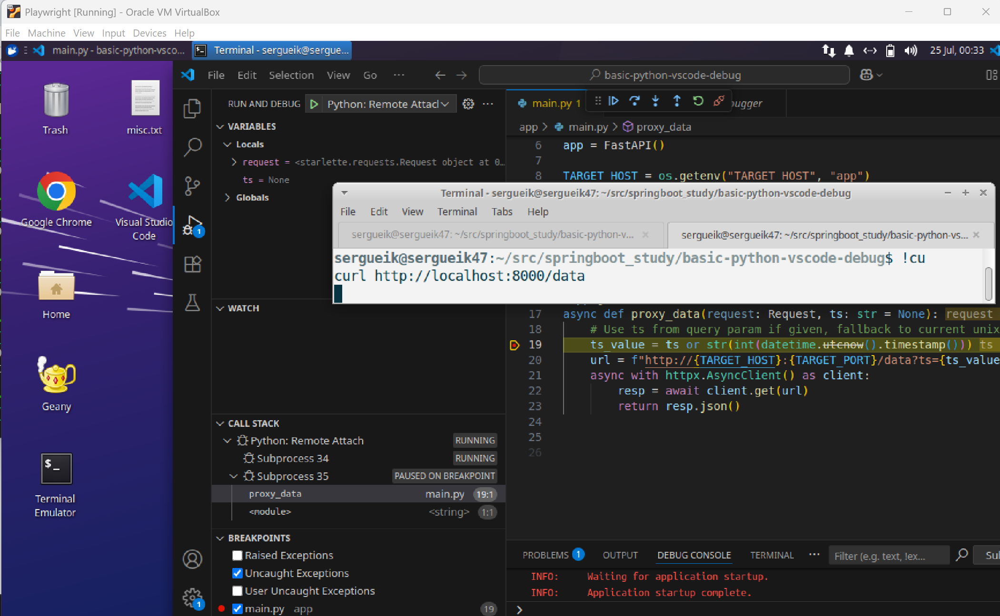

### Info
Replica of
[need to debug your FastAPI application with Docker](https://github.com/Kludex/fastapi-docker-debug)
by Kludex


### Usage

```sh
docker-compose -f docker-compose.debug.yaml up --build -d
```
connect with API via curl

```sh
curl -s http://localhost:8000/data
```

### See Also
  * [debug Python within a container](https://code.visualstudio.com/docs/containers/debug-python)

  
### Author
[Serguei Kouzmine](kouzmine_serguei@yahoo.com)
