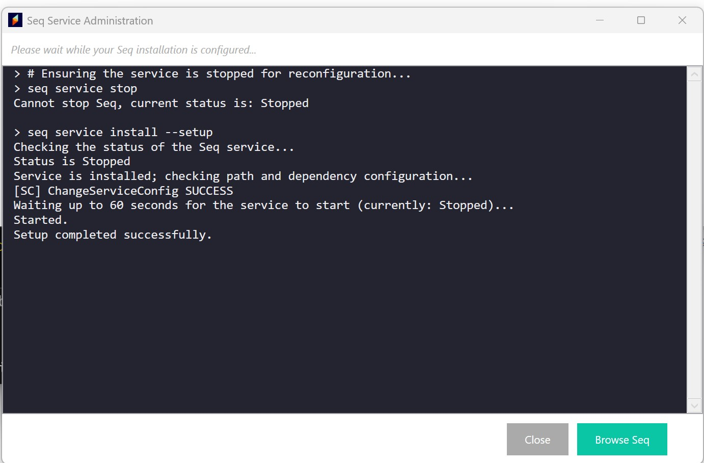
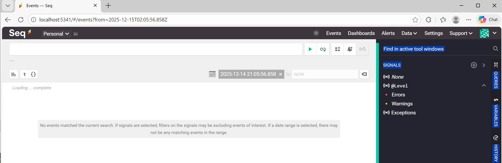
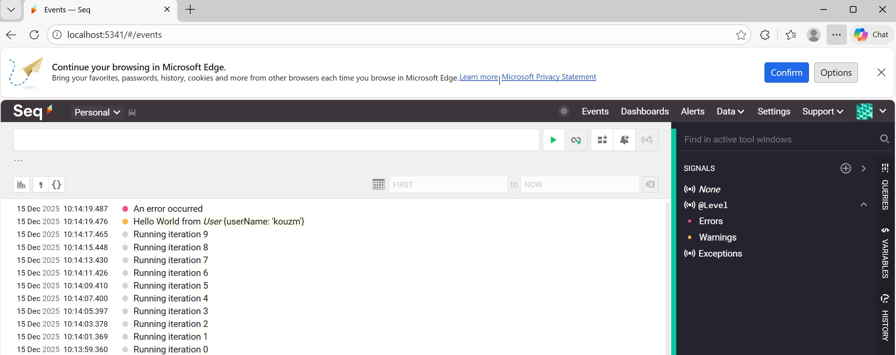
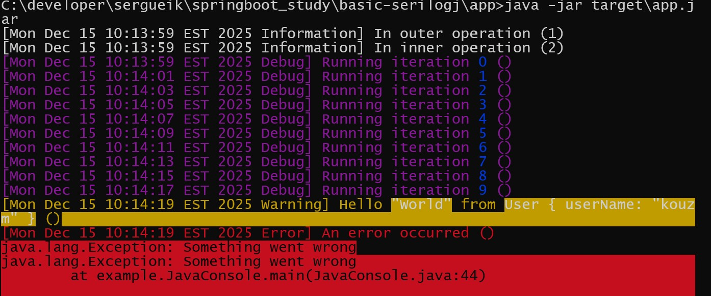

### Info

this directory contains a replica of [serilogj](https://github.com/serilogj/serilogj) - a *direct* __Java__ port of __.NET__ [Serilog](https://serilog.net/)

### More Info

The following [sinks](https://github.com/serilog/serilog/wiki/Provided-Sinks) have been provided by the upstream Java project:

* coloredconsole
* periodicbatching
* rollingfile
* seq


Overal due to mainly *ecosystem and historical inertia*, not *lack of ambition*
the __SerilogJ__ never happen to take off because __Java__ is *fragmented*, typed differently, and structured logging isn't first-class

there is not real effort from Serilog community to invade Java domain. on the other hand *The invader does not care about the enemy; he hopes the winner will not be criticized, even in the niche target.*

in other words, *There is no lie outrageous enough to stop them from telling it* 
### TODO

Step 1: example and driver code are *intermixed* - separate concerns (framework vs examples)

Step 2: containerize everything

Step 3: Filebeat as a temporary bridge

Step 4: experiment with direct ELK sink

Step 5: remove intermediaries once stability is achieved

### Usage

#### Local Test

* download specific release from `https://datalust.co/Download/All`:
```cmd
curl -sLko ~/Downloads/Seq-2022.1.7378.msi https://datalust.co/download/begin?version=2022.1.7378
```
run it an let it start admin panel 



and launch seq from there



* run the app

```cmd
java -jar target\app.jar
```



NOTE: the demo Exception logging in the app needs study (WIP)



```text
[Mon Dec 15 10:13:59 EST 2025 Information] In outer operation (1)
[Mon Dec 15 10:13:59 EST 2025 Information] In inner operation (2)
[Mon Dec 15 10:13:59 EST 2025 Debug] Running iteration 0 ()
[Mon Dec 15 10:14:01 EST 2025 Debug] Running iteration 1 ()
[Mon Dec 15 10:14:03 EST 2025 Debug] Running iteration 2 ()
[Mon Dec 15 10:14:05 EST 2025 Debug] Running iteration 3 ()
[Mon Dec 15 10:14:07 EST 2025 Debug] Running iteration 4 ()
[Mon Dec 15 10:14:09 EST 2025 Debug] Running iteration 5 ()
[Mon Dec 15 10:14:11 EST 2025 Debug] Running iteration 6 ()
[Mon Dec 15 10:14:13 EST 2025 Debug] Running iteration 7 ()
[Mon Dec 15 10:14:15 EST 2025 Debug] Running iteration 8 ()
[Mon Dec 15 10:14:17 EST 2025 Debug] Running iteration 9 ()
[Mon Dec 15 10:14:19 EST 2025 Warning] Hello "World" from User { userName: "kouzm" } ()
[Mon Dec 15 10:14:19 EST 2025 Error] An error occurred ()
java.lang.Exception: Something went wrong
java.lang.Exception: Something went wrong
        at example.JavaConsole.main(JavaConsole.java:44)


```
with older version of `serilogj` the console log was:

```text
[Sun Dec 14 21:19:13 EST 2025 Information] In outer operation (1)
[Sun Dec 14 21:19:13 EST 2025 Information] In inner operation (2)
[Sun Dec 14 21:19:13 EST 2025 Debug] Running iteration 0 ()
[Sun Dec 14 21:19:15 EST 2025 Debug] Running iteration 1 ()
[Sun Dec 14 21:19:17 EST 2025 Debug] Running iteration 2 ()
[Sun Dec 14 21:19:19 EST 2025 Debug] Running iteration 3 ()
[Sun Dec 14 21:19:21 EST 2025 Debug] Running iteration 4 ()
[Sun Dec 14 21:19:23 EST 2025 Debug] Running iteration 5 ()
[Sun Dec 14 21:19:25 EST 2025 Debug] Running iteration 6 ()
[Sun Dec 14 21:19:27 EST 2025 Debug] Running iteration 7 ()
[Sun Dec 14 21:19:29 EST 2025 Debug] Running iteration 8 ()
[Sun Dec 14 21:19:31 EST 2025 Debug] Running iteration 9 ()
Exception in thread "main" java.lang.ExceptionInInitializerError
        at io.advantageous.boon.core.reflection.Reflection.<clinit>(Reflection.java:114)
        at serilogj.parameters.PropertyValueConverter.getProperties(PropertyValueConverter.java:209)
        at serilogj.parameters.PropertyValueConverter.createPropertyValue(PropertyValueConverter.java:195)
        at serilogj.parameters.PropertyValueConverter.createPropertyValue(PropertyValueConverter.java:132)
        at serilogj.parameters.PropertyValueConverter.access$100(PropertyValueConverter.java:55)
        at serilogj.parameters.PropertyValueConverter$DepthLimiter.createPropertyValue(PropertyValueConverter.java:263)
        at example.UserDestructor.tryDestructure(UserDestructor.java:24)
        at serilogj.parameters.PropertyValueConverter.createPropertyValue(PropertyValueConverter.java:162)
        at serilogj.parameters.PropertyValueConverter.createPropertyValue(PropertyValueConverter.java:128)
        at serilogj.parameters.PropertyBinder.constructProperty(PropertyBinder.java:100)
        at serilogj.parameters.PropertyBinder.constructNamedProperties(PropertyBinder.java:92)
        at serilogj.parameters.PropertyBinder.constructProperties(PropertyBinder.java:45)
        at serilogj.parameters.MessageTemplateProcessor.process(MessageTemplateProcessor.java:35)
        at serilogj.core.Logger.write(Logger.java:159)
        at serilogj.core.Logger.write(Logger.java:142)
        at serilogj.core.Logger.warning(Logger.java:204)
        at example.JavaConsole.main(JavaConsole.java:42)
Caused by: java.lang.ClassCastException: class [B cannot be cast to class [C ([B and [C are in module java.base of loader 'bootstrap')
        at io.advantageous.boon.core.reflection.FastStringUtils$StringImplementation$1.toCharArray(FastStringUtils.java:93)
        at io.advantageous.boon.core.reflection.FastStringUtils.toCharArray(FastStringUtils.java:178)
        at io.advantageous.boon.core.Str.underBarCase(Str.java:538)
        at io.advantageous.boon.core.Sys.sysProp(Sys.java:329)
        at io.advantageous.boon.core.timer.TimeKeeperBasic.<init>(TimeKeeperBasic.java:52)
        at io.advantageous.boon.core.Sys.<clinit>(Sys.java:171)
        ... 17 more


```

###  Building Driver Locally
```cmd
type c:\Users\kouzm\.m2\repository\org\serilogj\serilogj\maven-metadata-local.xml
```
```xml
<?xml version="1.0" encoding="UTF-8"?>
<metadata>
  <groupId>org.serilogj</groupId>
  <artifactId>serilogj</artifactId>
  <versioning>
    <versions>
      <version>0.7.0-SNAPSHOT</version>
    </versions>
    <lastUpdated>20251215132259</lastUpdated>
  </versioning>
</metadata>

```
```sh
mvn help:evaluate -Dexpression=project.groupId -q -DforceStdout
```
```text
org.serilogj
```
```sh
mvn help:evaluate -Dexpression=project.artifactId -q -DforceStdout
```
```text
serilogj
```
```sh
mvn help:evaluate -Dexpression=project.version -q -DforceStdout
```
```text
0.7.0-SNAPSHOT
```
### NOTE 

while in __.Net__  domain [sink collection](https://github.com/serilog/serilog/wiki/Provided-Sinks) there is [ElasticSearch Sink](https://github.com/serilog/serilog-sinks-elasticsearch) (actually more than one attemp existed historically) there is not one in __Java__ domain

### See Also

  * [maven cenral](https://mvnrepository.com/artifact/org.serilogj) - last Release on Nov 1, __ 2017__

---
### Author


[Serguei Kouzmine](mailto:kouzmine_serguei@yahoo.com)
