### Info

#### Skill Skimmer

* *skim the ocean of skills*
* *There are hundreds of thousands of skills. Naturally, we need a piece of precision pool equipment.*
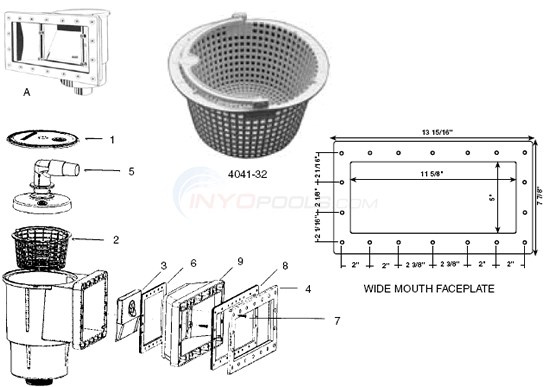


Artifacts from [majiayu000/claude-skill-registry](https://github.com/majiayu000/claude-skill-registry/tree/main/skills) — apparently an aggregator describing itself as *"the most comprehensive Claude Code skills registry | Web Search"*.

* Converted into a searchable **Excel 2007** resource or a standalone searchable static web page with a vanilla JavaScript.

> NOTE The Office or browser-hosted searchable page promises a slightly more practical way to explore the aggregated catalog than browsing the repository directly.

> **NOTE:** The browser-hosted searchable page is intended specifically for exploring the catalog.

The massive size of this and similar skill-aggregator repositories exposes a practical limitation of GitHub's web interface: while GitHub is well suited for hosting and versioning these resources, its web UI is not particularly convenient for exploring very large generated/catalog files.


This motivates creating an adequate tool for exploring these valuable resources.*


## What are Agent Skills?

[Agent Skills](https://agentskills.io/home) are a standardized way to give AI agents new capabilities and domain expertise.

Under the Agent Skills standard, every skill includes a required `SKILL.md` file that combines structured metadata
with human-readable instructions. This allows Large Language Model (LLM) agents to reuse knowledge and procedures beyond a single conversation.

A `SKILL.md` consists of two main parts:

- **frontmatter** – written in YAML – describes the skill and tells the agent when it should be used - uses YAML
- **body** – written in [Markdown](https://en.wikipedia.org/wiki/Markdown) ; contains instructions, procedures, examples, and references that guide the agent

> YAML is used for structured metadata that the agent can efficiently discover and index.
> Markdown is used for the human-readable instructions because it is a lightweight, widely supported plain-text format that
> is easy to author, review, version-control, and diff.
> Markdown is already a de facto enterprise standard. We're not introducing a niche format; we're reusing one that our existing tools already understand.


  * VS Code has native Markdown preview.
  * IntelliJ IDEA has native Markdown support.
  * GitHub renders Markdown.
  * GitLab renders Markdown.
  * Azure DevOps renders Markdown.
  * Most code review systems treat Markdown as a first-class format.
  * It is plain UTF-8 text, so it diffs cleanly in Git.

> one is no longer asking to adopt __Markdown__  one are pointing out that they are already surrounded by it.

A `SKILL.md` file has properties that align naturally with engineering workflows:

* it needs version control;
* changes need to be reviewable;
* a history of modifications matters;
* branching and merging may matter;
* automated tooling needs to parse it;
* agents need a predictable structure.

__Agents__ load __skills__ through progressive disclosure, in three stages to minimize context usage:

|       |             |
|-------|-------------|
| **Discovery** | At startup, the agent reads only the name and description of each available skill |
| **Activation** | When a task matches a skill's description, the agent loads the full `SKILL.md` into its context |
| **Execution** | The agent follows the instructions, loads referenced files as needed, and, when applicable, executes bundled code. Most skills consist solely of documentation and supporting resources. |

Because complete instructions are loaded only when needed, an agent can have access to thousands of skills
while consuming only a small amount of context

### Example

The YAML frontmatter describes the skill metadata:

```yaml
---
name: code-reviewer
description: Reviews code for bugs, security issues, and style violations. Use when the user asks to review code or check a pull request.
---
```

The Markdown body contains the actual guidance:

```code
# Spring Boot Testing

This skill provides guidance for testing Spring Boot 4 applications using modern patterns and best practices.

## Core Principles

1. Test Pyramid
2. Use the narrowest test slice that provides confidence.
3. Prefer AssertJ for fluent assertions.
4. Prefer MockMvcTester and RestTestClient for modern Spring Boot testing.
...
```
Optionally, a skill may include additional files containing scripts, templates, reference material, datasets, or other supporting assets.

Recently, AI skills recognition  have become explosive

Agent Skills have rapidly emerged as a practical way to extend Large Language Model (LLM) agents beyond the immediate prompt. Rather than repeating detailed instructions in every conversation, developers can package reusable expertise into portable skills.
Tools developed to convert other classig presentation formats: Video, PDF, etc. into Skills are highly popular.

### Info

[Agent Skills](https://agentskills.io/home) is standardized way to give AI agents new capabilities and expertise.

Under the current standard, Agent Skills are `SKILL.md` files that combine instructions with supporting resources, enabling Large Language Model (LLM) agents to reuse procedures beyond a single conversation. There is an YAML area and markdown area in the `SKILL.md`, that is the findamental compomnent.

__Agents__ load __skills__ through progressive disclosure, in three stages:

|          |                                             |
|----------|---------------------------------------------|
|Discovery | At startup, agents load only the name and description of each available skill, just enough to know when it might be relevant|
|Activation | When a task matches a skill’s description, the agent reads the full SKILL.md instructions into context|
|Execution | The agent follows the instructions, optionally executing bundled code or loading referenced files as needed|

Tactically, full instructions load only when a task calls for them, thus agents can keep many skills on hand with only a small context footprint.

Recently, AI skills have become widelyy recognized as a highly practical way to extend Large Language Model (LLM) agents beyond the immediate prompt.

Under the Agent Skills standard, a skill at a minimum is packaged as a `SKILL.md` file: frontmatter
```yaml
---
name: code-reviewer
description: Reviews code for bugs, security issues, and style violations. Use when the user asks to review code or check a pull request.
---

```
tells the agent when to load it, the body gives instructions, and optional files provide scripts, references, or assets. In this form, skills turn task experience into reusable software artifacts
### Usage
```sh
git clone --depth 1 https://github.com/majiayu000/claude-skill-registry/tree/main/skills
pushd claude-skill-registry
find skills -iname 'SKILL.md' | tee ../catalog.txt
popd
```

```powershell
. ./catlog-rebuilder.ps1
```
```powedshell
. .\catalog-rebuilder.ps1 -output k8.html -data .\catalog.k8.txt
```
```text
reading 0 rows from C:\developer\sergueik\springboot_study\basic-skill-registry\.\catalog.k8.txt
Reading 744 |Returning: 744 results
Exporting 744 entries
Reading 744 /
```
it generates the flat HTML table with search.
```powershell
start k8.html
```

you can search through skill registry.

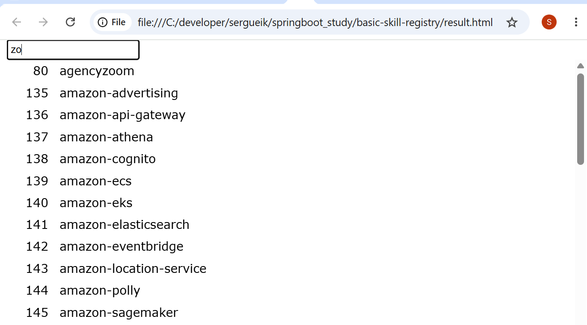

>NOTE: this still does not scale over the full 100+MB file
### Background


"Traditional" code assistant aids focused on helping the developer write code *faster*:

* **IntelliSense** — suggests answers to the natural developer question: *"What can we do with this?"*
  A developer-oriented echo of the broader 1990s software-era message captured by Microsoft's famous campaign:
  **"Where do you want to go today?"**
* **Refactoring** — structural code changes such as extracting methods, creating classes, and reorganizing code safely.
* **Syntax highlighting** — visual structure assistance (color vision matters).
* **Static analysis** — detecting potential defects before execution.
* **Code coverage** — measuring which parts of the code are exercised by tests.

In a sharp turn, modern AI coding assistants often spend a surprising amount of time helping the developer *avoid* writing code manually at all:

* "generate this class"
* "create the API client"
* "write the unit tests"
* "convert this function"
* "explain this repository"
* "make this configuration"
The conceptual transition is actually very strong:

Traditional assistants:

"Help me write what I already know I need."

AI assistants:

"Help me produce something without manually writing every detail."

That makes the next section about SKILL.md almost inevitable, because once the assistant is producing more of the artifact, the critical question becomes:

"How does the assistant know the way this project expects things to be done?"


### Usage
```sh
git clone --depth 1 https://github.com/majiayu000/claude-skill-registry/tree/main/skills
pushd claude-skill-registry
find skills -iname 'SKILL.md' | tee ../catalog.txt
popd
```

```powershell
. ./catlog-rebuilder.ps1
```
it generates the flat HTML table with search.

### Background


"Traditional" code assistant aids focused on helping the developer write code *faster*:

* **IntelliSense** — suggests answers to the natural developer question: *"What can we do with this?"*
  A developer-oriented echo of the broader 1990s software-era message captured by Microsoft's famous campaign:
  **"Where do you want to go today?"**
* **Refactoring** — structural code changes such as extracting methods, creating classes, and reorganizing code safely.
* **Syntax highlighting** — visual structure assistance (color vision matters).
* **Static analysis** — detecting potential defects before execution.
* **Code coverage** — measuring which parts of the code are exercised by tests.

In a sharp turn, modern AI coding assistants often spend a surprising amount of time helping the developer *avoid* writing code manually at all:

* "generate this class"
* "create the API client"
* "write the unit tests"
* "convert this function"
* "explain this repository"
* "make this configuration"
The conceptual transition is actually very strong:

Traditional assistants:

"Help me write what I already know I need."

AI assistants:

"Help me produce something without manually writing every detail."

That makes the next section about SKILL.md almost inevitable, because once the assistant is producing more of the artifact, the critical question becomes:

"How does the assistant know the way this project expects things to be done?"


"What are you doing here?"
"Eating my frugal bread and water dinner.  Enjoying the wonderful smell from your kitchen."
"You must pay for what you have consumed!
"Here is the payment." (tinkling the coin in the wallet)
"But were is the no money."
"Do you hear the sound of coins?"
"yes"
"We are even."

## The Value Exchange

> A small story about different measurements of value.
```code

sequenceDiagram
    participant K as Kitchen Owner
    participant V as Visitor

    K->>V: What are you doing here?

    V->>K: Eating my frugal bread-and-water dinner.<br/>Enjoying the wonderful smell from your kitchen.

    K->>V: You must pay for what you have consumed!

    V->>K: Here is the payment.
    V->>V: 🔔 *Tinkling coins in the wallet*

    K->>V: But there is no money.

    V->>K: Do you hear the sound of coins?

    K->>V: Yes.

    V->>K: Then we are even.
```

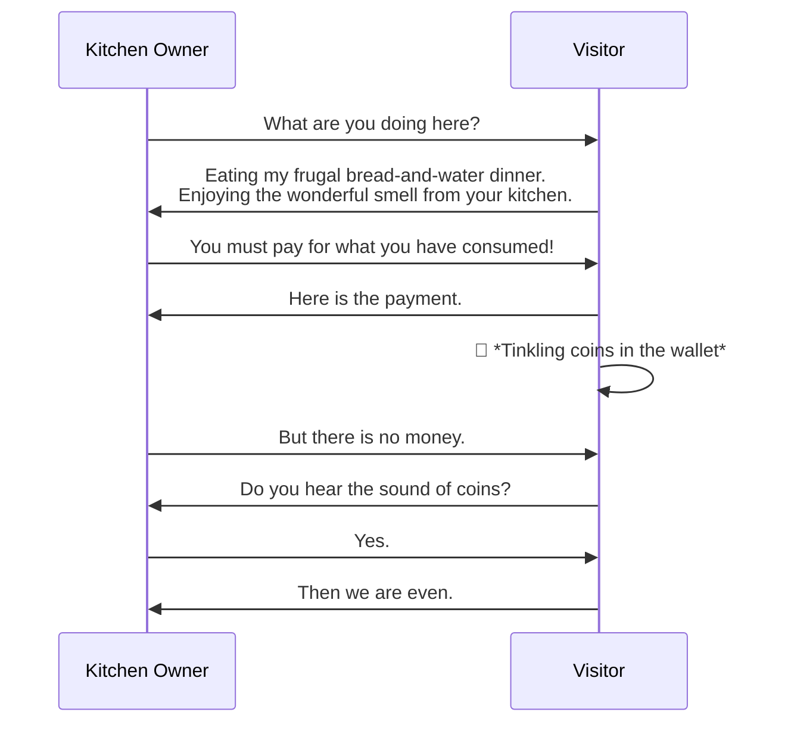

The question is not only what value exists, but which unit of value is being measured.

Different consumers may require different forms of the same knowledge:
- humans may value presentation and collaboration,
- machines may value structure, metadata, and repeatable procedures.

4. Gold Rush Claim Dilemma

This one has several layers.

Level 1 — Uncertainty

A mining claim is only a claim.

Nobody knows whether it contains gold.

Likewise:

A document exists.

Nobody knows whether it contains reusable knowledge.

Level 2 — Surface richness

One claim has shiny nuggets.

Another looks ordinary.

The second may contain the real vein.

Likewise

beautiful screenshots
timestamps
audit trail
names

may look richer than

SKILL.md

while containing less reusable knowledge.

Level 3 — Extraction

Gold underground has no value until extracted.

Knowledge buried inside

screenshots
PDFs
Word documents
SharePoint pages

has little operational value until extracted into reusable form.

A SKILL.md is almost an ore concentrate.

Possible titles

I like these.

The Gold Rush Claim Dilemma

probably my favorite.

The Mining Claim Problem

slightly more formal.

Surface Gold vs Deep Vein

easy to remember.

The Nugget Fallacy

people judge the nugget,
not the mine.

The Richest Claim Isn't Always the Richest Mine

excellent presentation title.

The Hidden Vein Principle

good if discussing AI.

Ore vs Gold

simple.

Raw documents are ore.

Skills are refined metal.

5. C# → PowerShell

One of my favorite analogies from our discussion.

Windows Forms
        │
        ▼
PowerShell representation

This isn't translation.

It is creating a representation for another consumer.

Exactly what Agent Skills do.

6. Representation Principle

Perhaps the deepest idea.

Every representation serves its next consumer.

Examples

SQL
    ↓
database users

REST
    ↓
applications

Markdown
    ↓
humans

SKILL.md
    ↓
humans + AI

PowerShell projection
    ↓
operations

The question isn't

Is it beautiful?

It is

Does it transfer the important knowledge?

7. Evidence vs Knowledge

This one appeared almost accidentally.

Evidence answers

What happened?

Knowledge answers

What should happen next time?

Example

Screenshot

Evidence.

Bob removed comment on line 10.

Evidence.

When removing this comment,
verify X,
check Y,
run Z.

Knowledge.

8. The AI Argument (carefully stated)

Instead of

AI prefers Markdown.

I'd say

The future consumer of this intellectual property is increasingly not only a human.

or

Knowledge should be represented in a form equally consumable by humans and machines.

I think this will age very well.

My favorite one-liner

Of everything we discussed, this is the one I'd keep in my pocket:

The richest-looking claim is not always the richest mine.

It is memorable, non-confrontational, and people immediately understand it.

And if someone asks "What do you mean?"—that's when you bring out the screenshots, the SharePoint pages, the SKILL.md, and let the analogy do the work instead of making the argument directly.

I have a feeling this collection is going to grow. It already feels less like a set of isolated metaphors and more like a coherent "language" for explaining why knowledge representation matters more than knowledge storage. That theme connects the Gold Rush, the soup story, the "Jump!" button, your Windows Forms → PowerShell projection, and Agent Skills remarkably well.
### Manual Skill for Gap

### Manual Skill for Gap

This skill was created from a practical integration need.

Microsoft provides comprehensive guidance for the individual building blocks:
Microsoft Entra ID, OAuth2/OpenID Connect, MSAL libraries, Azure Identity,
and Spring Boot integration.

During application development, however, the implementation effort often
requires combining guidance from several areas:

- React SPA authentication flow
- Microsoft Entra application registration
- OAuth2 Authorization Code Flow with PKCE
- MSAL client configuration
- Spring Security 6 resource server configuration
- JWT validation and authorization mapping

This skill captures the recurring decisions and implementation patterns
required when these components are assembled into a single application.

The intent is not to replace existing documentation, but to provide an
agent-oriented integration guide for a common enterprise application pattern.

Create the initial skill structure:
### Manual Skill for Gap

This skill was created from a practical integration need.

Microsoft provides comprehensive guidance for the individual building blocks:
Microsoft Entra ID, OAuth2/OpenID Connect, MSAL libraries, Azure Identity,
and Spring Boot integration.

During application development, however, the implementation effort often
requires combining guidance from several areas:

- React SPA authentication flow
- Microsoft Entra application registration
- OAuth2 Authorization Code Flow with PKCE
- MSAL client configuration
- Spring Security 6 resource server configuration
- JWT validation and authorization mapping

This skill captures the recurring decisions and implementation patterns
required when these components are assembled into a single application.

The intent is not to replace existing documentation, but to provide an
agent-oriented integration guide for a common enterprise application pattern.

Create the initial skill structure:

```sh
mkdir -p custom/skills/entra-springboot-react-auth
mkdir -p custom/skills/entra-springboot-react-auth/{examples,references,checklists,diagrams}

for D in examples references checklists diagrams
do
  touch custom/skills/entra-springboot-react-auth/$D/.gitkeep
done

# author:
custom/skills/entra-springboot-react-auth/SKILL.md
custom/skills/entra-springboot-react-auth/examples/README.md
...
```
The supporting directories establish extension points for future contributions.
The initial change intentionally keeps the artifact set small so that review
can focus on the skill structure and guidance.

This contribution establishes the skill and its information architecture.
The skill is immediately usable. Supporting material has an obvious home
and can be expanded incrementally as common implementation patterns emerge.

The initial scope intentionally focuses on reusable guidance rather than a
large collection of examples. Additional production patterns and references
can be added as the skill evolves.


### Why this skill is useful

Authentication and authorization are among the strongest and most security-sensitive
areas of the Azure development ecosystem.

Microsoft Entra ID provides enterprise-grade identity capabilities, but using
those capabilities correctly requires coordinating several layers:

- identity provider configuration
- OAuth2/OIDC protocol flows
- application registration
- frontend authentication libraries
- token acquisition
- backend token validation
- authorization mapping

The complexity comes less from any individual component and more from the
number of components that must align correctly.

Capturing these integration patterns as a skill helps developers and agents
apply the established approach consistently.

### Timing

This skill is intentionally introduced early in the development cycle. The objective is to provide an initial architectural reference before implementation patterns become embedded in the codebase.

### Excel Storage

|format | max rows|
|-------|---------|
|.xls   | 65,536  |
|.xlsx  | 1,048,576 |

#### Setup

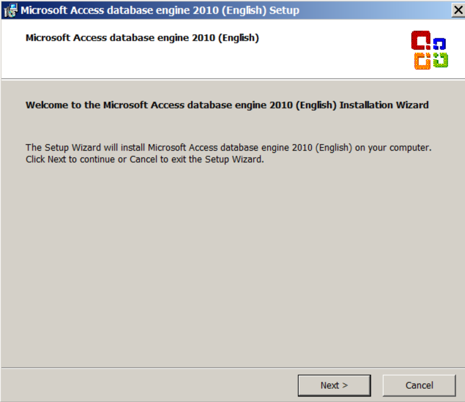


On older Windows, one may also switch to using
`Provider=Microsoft.Jet.OLEDB.4.0`

For Windows 7 or later, the __Microsoft Access Database Engine__ __2016__ Redistributable,
preferably the 32-bit (`accessdatabaseengine.exe`)

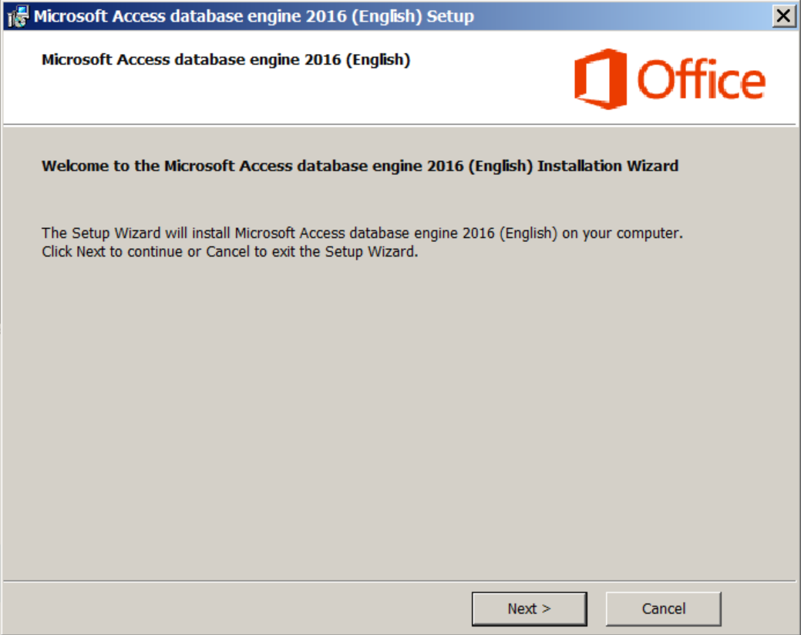

According to Microsoft documentation the __2016__ engine can be used with: `Provider=Microsoft.ACE.OLEDB.12.0`

Probing the success is critical: the install may silently fail
```powershell
$provider = 'Microsoft.ACE.OLEDB.12.0';
[System.Data.OleDb.OleDbEnumerator]::GetRootEnumerator() | where-object {  $_.SOURCES_NAME -eq $provider } |format-list *
```
or more Registry oriented:
```powershell
$clsid = (Get-ItemProperty -Path 'HKLM:\SOFTWARE\Classes\Microsoft.ACE.OLEDB.12.0\CLSID').'(default)'

Write-Host "CLSID: ${clsid}"

$inprocPath = 'HKLM:\SOFTWARE\Classes\CLSID\{0}\InprocServer32' -f $clsid

write-host "InProcServer32: ${inprocPath}"

(get-ItemProperty -Path ($inprocPath)).'(default)'

```
> NOTE
```cmd
sc.exe stop wuauserv
sc.exe config wuauserv start=disabled
sc.exe queryex wuauserv
```
or
```powershell
Stop-Service -Name wuauserv -Force
Set-Service -Name wuauserv -StartupType Disabled
Get-Service -Name wuauserv
```

```text
[SC] ChangeServiceConfig SUCCESS
```
```text
SERVICE_NAME: wuauserv
        TYPE               : 20  WIN32_SHARE_PROCESS
        STATE              : 3  STOP_PENDING
                                (NOT_STOPPABLE, NOT_PAUSABLE, IGNORES_SHUTDOWN)
        WIN32_EXIT_CODE    : 0  (0x0)
        SERVICE_EXIT_CODE  : 0  (0x0)
        CHECKPOINT         : 0x2
        WAIT_HINT          : 0x7530
        PID                : 1000
        FLAGS              :

```
```text
SERVICE_NAME: wuauserv
        TYPE               : 20  WIN32_SHARE_PROCESS
        STATE              : 1  STOPPED
        WIN32_EXIT_CODE    : 0  (0x0)
        SERVICE_EXIT_CODE  : 0  (0x0)
        CHECKPOINT         : 0x0
        WAIT_HINT          : 0x0
        PID                : 0
        FLAGS              :
```
occasionally

```cmd
sc.exe queryex wuauserv
```
```text
Not enough memory resources are available to process this command.
```
```cmd
pushd C:\Windows\SoftwareDistribution
del /s/q *.*
popd
```

```cmd
shutdown.exe -r -t 0
```
```cmd
Get-ScheduledTask |
    Where-Object {
        $_.TaskPath -like '\Microsoft\Windows\WindowsUpdate\*' -or
        $_.TaskPath -like '\Microsoft\Windows\UpdateOrchestrator\*'
    } |
    Select-Object TaskPath, TaskName, State
```

```text
TaskPath                          TaskName           State
--------                          --------           -----
\Microsoft\Windows\WindowsUpdate\ Scheduled Start Disabled
```

```powershell
get-cimInstance Win32_OperatingSystem |select-Object -property TotalVisibleMemorySize, FreePhysicalMemory,TotalVirtualMemorySize,FreeVirtualMemory
```
#### Excel 8.0

We will still be using the old __Excel__ __8.0__ / `.xls` format:

```cmd
. .\catalog-rebuilder.ps1 -count 40000
```
```text
reading 40000 rows from C:\developer\sergueik\catalog.txt
Reading 40000 ⠋  Elapsed: 00:01:06.3391869Returning: 40000 results
Exporting 40000 entries
Inserred 40000 ⠇ Elapsed: 00:03:00.
```
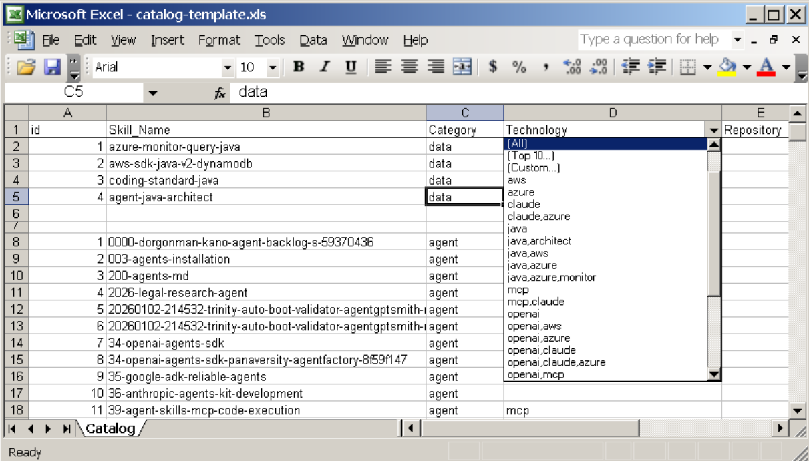

```powershell
. .\catalog-rebuilder.ps1 -template_filename catalog-template.xls -count 10 -outputfile result.xls
```
```text
reading 10 rows from catalog.txt
Reading 9 ⠋  Elapsed: 00:00:05.1121441
Returning: 10 results
Exporting 10 entries
writing temporary file: C:\Documents and Settings\Admin\Local Settings\Temp\tmp26.xls
```
```powershell
 dir "C:\Documents and Settings\Admin\Local Settings\Temp\tmp26.xls", .\catalog-template.xls
```
```text
    Directory: C:\Documents and Settings\Admin\Local Settings\Temp


Mode                LastWriteTime     Length Name
----                -------------     ------ ----
-a---         8/10/2026   6:37 AM      14848 tmp26.xls


    Directory: C:\developer\sergueik


Mode                LastWriteTime     Length Name
----                -------------     ------ ----
-a---         8/10/2026  12:13 AM       6656 catalog-template.xls
```

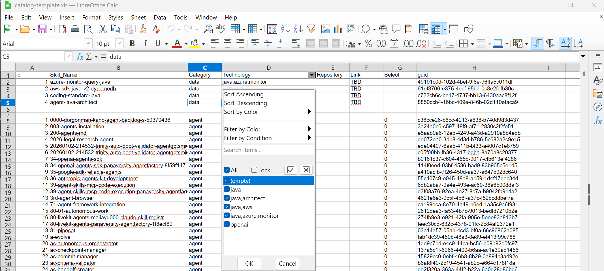

> NOTE An `.xls` worksheet has a *maximum capacity* of __65,536__ rows

```cmd
. .\catalog-rebuilder.ps1
```
```text
reading rows from C:\developer\sergueik\catalog.txt
Reading 203634 ⠸  Elapsed: 00:02:43.4498979
Returning: 203634 results
Exporting 203634 entries
ERROR inserting row: 65524
Skill: v3-performance-optimization
Exception: Spreadsheet is full.
Spreadsheet is full.
At catalog-rebuilder.ps1:329 char:10
+     throw <<<<
    + CategoryInfo          : OperationStopped: (:) [], OleDbException
    + FullyQualifiedErrorId : Spreadsheet is full.
```
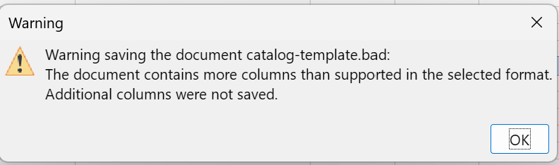


with __Excel 2007__
```powershell
. .\catalog-rebuilder.ps1 -template_filename catalog-template.xlsx
```
```text
reading C:\developer\sergueik\catalog.txt
Reading 203633 ⠸  Elapsed: 00:01:12Returning: 203634 results
Exporting 203634 entries
Inserred 203000 ⠹ Elapsed: 00:05:59
```
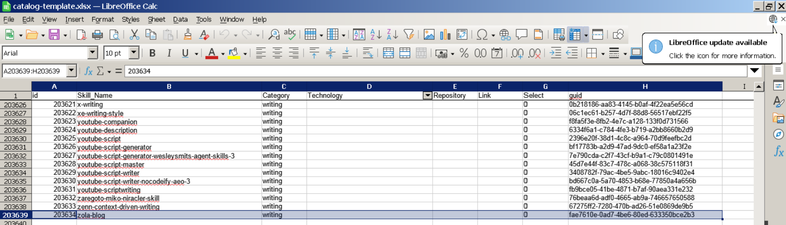


| Tool / Technology | Role | Status | Notes |
|---|---|:---:|---|
| **OpenXML** | Inspect/extract embedded document artifacts | ✅ | Used to expose embedded Visio content in the original documents |
| **Visio** | Native rendering / authoritative interpretation of `.vsd` diagrams | ⏳ | Installation required enterprise approval and delivery of ~4 GB install media; now available |
| **WSL2** | Linux-side execution of conversion/XML tooling | ⚠️ | Only partly operational through the vendor application layer; Windows ↔ Linux transfer required `\\WSL$` and similar workarounds |
| **RHEL** | Existing Linux processing environment | ❓ | Pandoc was initially assumed by Copilot, but its availability on RHEL was not initially verified |
| **LibreOffice** | Convert legacy Visio artifacts to inspectable formats | ✅ | Successfully converted `.vsd` artifacts, including to Draw/FODG |
| **Python** | Auxiliary extraction and processing | ✅ | Used for processing and experimentation around the extracted artifacts |
| **XMLStarlet** | Inspect and validate XML structure | ✅ | Confirmed the XML nature of converted Draw/FODG artifacts and assisted structural analysis |
| **Mermaid** | Alternative / reconstructed representation of diagram flow | ⚠️ | Used experimentally as a target for reconstructing meaningful flow from recovered structures |
| **MarkItDown** | Document-to-Markdown extraction | ❓ | Considered as an alternative extraction path |
| **VS Code extensions** | Interactive inspection / visualization | ❓ | Considered as an interactive aid rather than the core conversion mechanism |
| **Windows host** | Primary authoring and coordination environment | ✅ | Authoring and interactive work remained on Windows |
| **VM** | Labor-intensive XML interpretation and reconstruction | ✅ | The more intellectually demanding work of combining XML fragments into meaningful flow was performed here |
| **Clipboard** | Exchange of intermediate artifacts between environments | ⚠️ | Became a practical integration mechanism where filesystem/application integration was inadequate |


### Process Flow


```code
flowchart TB
    subgraph SOURCES["Skill sources"]
        MS["Microsoft<br/>~10⁵ SKILL.md"]
        UIP["UiPath<br/>~10³ SKILL.md"]
        VEN["Other vendor repositories"]
        AGG["Community / scraper repositories<br/>e.g. skill registries"]
    end

    subgraph WORK["Work / scratch area"]
        GIT["Git acquisition"]
        EXT["Extract / normalize"]
    end

    subgraph INDEX["Search aid"]
        CAT["Catalog"]
        META["Metadata + provenance"]
        RX["Cached search columns<br/>regex-friendly"]
    end

    subgraph RESULT["Distributable result"]
        ACE["Jet / ACE"]
        XLS["Excel / Office"]
        HTML["HTML / browser"]
    end

    MS --> GIT
    UIP --> GIT
    VEN --> GIT
    AGG --> GIT

    GIT --> EXT

    EXT --> CAT
    EXT --> META
    CAT --> RX
    META --> RX

    RX --> ACE
    RX --> XLS
    RX --> HTML
```

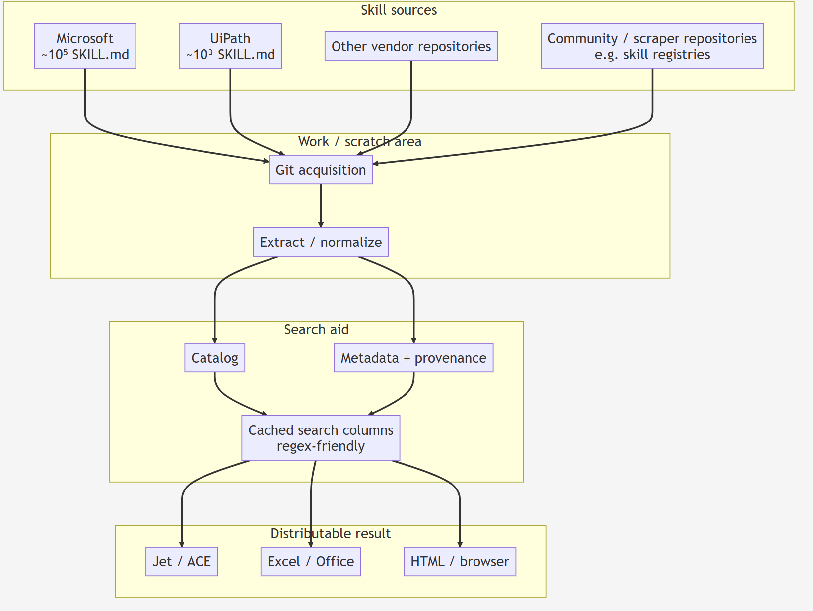

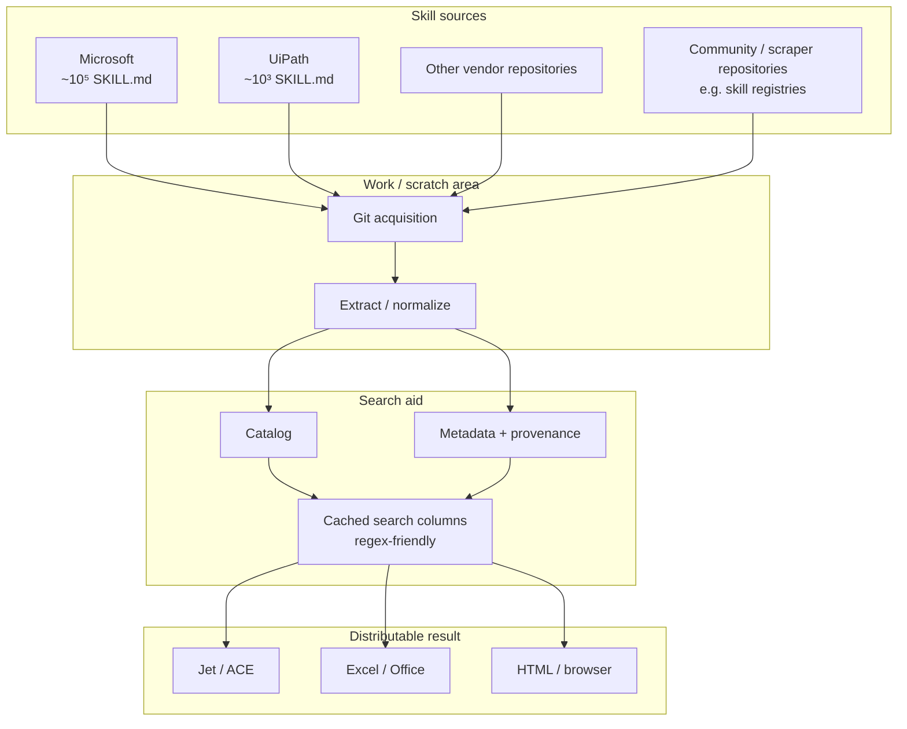

### ASCII
```
                         ┌───────────────┐
                         │  Original     │
                         │  Document     │
                         │  + embedded   │
                         │  Visio        │
                         └───────┬───────┘
                                 │
                                 ▼
                         ┌───────────────┐
                         │   OpenXML     │
                         │   extraction  │
                         └───────┬───────┘
                                 │
                    ┌────────────┴────────────┐
                    │                         │
                    ▼                         ▼
              ┌──────────┐              ┌──────────┐
              │ Windows  │◄────────────►│  WSL2    │
              │ authoring│   \\WSL$     │ tooling  │
              └────┬─────┘              └────┬─────┘
                   │                         │
                   │                    ┌────▼─────┐
                   │                    │  RHEL /  │
                   │                    │ Linux    │
                   │                    └────┬─────┘
                   │                         │
                   │                    ┌────▼─────┐
                   │                    │ Libre-   │
                   │                    │ Office   │
                   │                    └────┬─────┘
                   │                         │
                   │                         ▼
                   │                    ┌──────────┐
                   │                    │ FODG /   │
                   │                    │ XML      │
                   │                    └────┬─────┘
                   │                         │
                   │                    ┌────▼─────┐
                   │                    │XMLStarlet│
                   │                    └────┬─────┘
                   │                         │
                   │              ┌──────────▼─────────┐
                   │              │ XML fragments /    │
                   │              │ structural pieces  │
                   │              └──────────┬─────────┘
                   │                         │
                   │                    ┌────▼─────┐
                   │                    │   VM     │
                   │                    │reconstruct│
                   │                    └────┬─────┘
                   │                         │
                   │                    clipboard
                   │                         │
                   └─────────────────────────▼
                                      ┌────────────┐
                                      │ meaningful │
                                      │ flow /     │
                                      │ Mermaid    │
                                      └────────────┘
```

### DOCX vs. Markdown

Neither DOCX nor Markdown is intended to be retained in source control as part of
the extracted artifacts. Both are transient working products: they are copied
locally, evaluated or annotated, and subsequently removed.

The distinction therefore becomes practical rather than archival.

For ordinary document processing, DOCX may be useful because it preserves the
original OpenXML document structure and presentation. However, when the
investigation produces an observation that needs to be communicated to an SME —
for example, a suspected **"missing link"** in the reconstructed flow —
Markdown is considerably more attractive. It is lightweight, trivially
annotable, easy to edit, and produces an intelligible textual diff.

By contrast, modifying or annotating the corresponding OpenXML/DOCX artifact
introduces a large amount of structural markup. Even a small conceptual change
can result in a substantial and largely unintelligible diff.

Thus the practical rule is:

| Purpose | Preferred transient format |
|---|---|
| Preserve / process the original document structure | **DOCX / OpenXML** |
| Inspect or annotate extracted information | **Markdown** |
| Communicate an observation or suspected missing link to an SME | **Markdown** |
| Commit either artifact to source control | **Neither** |


### Blue Prism

one may explore alternive route 

__Blue Prism__ actually had a concept called "Skills" years before the current `SKILL.md` movement. 
With __Blue Prism__ digital exchange (DX) there is  the rich collection links including 

the [Blue Prism Core VBOs](https://digitalexchange.blueprism.com/cardDetails?id=138317) - download page.

The `Blue Prism Enterprise - Core VBOs.zip` is arvhive containing *all* of the core __BP__ __VBO__s that use to be included in the __Blue Prism__ software installer.

```sh
unzip -ql ~/Downloads/Blue\ Prism\ Enterprise\ -\ Core\ VBOs_20260511.zip | awk '{$1="";$2="";$3="";print $0}'
```
```text
   Name
   ----
   Blue Prism Enterprise - Core VBOs/
   Blue Prism Enterprise - Core VBOs/Data - OLEDB v10.2.bpobject
   Blue Prism Enterprise - Core VBOs/Data - SQL Server 10.2.bpobject
   Blue Prism Enterprise - Core VBOs/Email - POP3 SMTP IMAP 10.5.0.bpobject
   Blue Prism Enterprise - Core VBOs/Google Drive API VBO v1.0.0.bprelease
   Blue Prism Enterprise - Core VBOs/Microsoft Outlook Email VBO (NetOffice) v10.4.7.bpobject
   Blue Prism Enterprise - Core VBOs/Microsoft Outlook Email VBO v10.4.7.bpobject
   Blue Prism Enterprise - Core VBOs/MS Excel VBO v10.6.4.bpobject
   Blue Prism Enterprise - Core VBOs/MS Word VBO v10.2.0.bpobject
   Blue Prism Enterprise - Core VBOs/System - Active Directory v10.1.bpobject
   Blue Prism Enterprise - Core VBOs/Utility - Collection Manipulation V10.4.0.bpobject
   Blue Prism Enterprise - Core VBOs/Utility - Date and Time Manipulation V10.1.bpobject
   Blue Prism Enterprise - Core VBOs/Utility - Encryption v10.0.bpobject
   Blue Prism Enterprise - Core VBOs/Utility - Environment v10.1.8.bpobject
   Blue Prism Enterprise - Core VBOs/Utility - File Management v10.3.5.bpobject
   Blue Prism Enterprise - Core VBOs/Utility - Foreground Locker v10.0.0.bpobject
   Blue Prism Enterprise - Core VBOs/Utility - General v10.0.bpobject
   Blue Prism Enterprise - Core VBOs/Utility - HTTP v10.0.2.bpobject
   Blue Prism Enterprise - Core VBOs/Utility - Image Manipulation v10.1.0.bpobject
   Blue Prism Enterprise - Core VBOs/Utility - JSON V10.0.3.bpobject
   Blue Prism Enterprise - Core VBOs/Utility - Locking v10.0.bpobject
   Blue Prism Enterprise - Core VBOs/Utility - Network v10.0.2.bpobject
   Blue Prism Enterprise - Core VBOs/Utility - Numeric Operations v10.0.bpobject
   Blue Prism Enterprise - Core VBOs/Utility - Strings v10.0.bpobject
   Blue Prism Enterprise - Core VBOs/Utility - Windows Compressed File v10.0.bpobject
   Blue Prism Enterprise - Core VBOs/Webservices - OAuth2 v10.0.bpobject
   Blue Prism Enterprise - Core VBOs/Webservices - REST v10.0.bpobject


```
And instead of adding another gigantic collection of generic AI skills, you'd be demonstrating that existing specialist developer ecosystems contain thousands of latent skills that can potentially be compiled into Agent Skills.

Can some of those be turned it into a proper SKILL.md and we can judge whether the result is genuinely useful rather than merely an LLM-generated description. 

```sh
unzip -x ~/Downloads/Blue\ Prism\ Enterprise\ -\ Core\ VBOs_20260511.zip  "Blue Prism Enterprise - Core VBOs/Utility - Collection Manipulation V10.4.0.bpobject"
cp Blue\ Prism\ Enterprise\ -\ Core\ VBOs/*bpobject .
```

```text
Archive:  /c/Users/kouzm/Downloads/Blue Prism Enterprise - Core VBOs_20260511.zip
  inflating: Blue Prism Enterprise - Core VBOs/Utility - Collection Manipulation V10.4.0.bpobject
```
confirmed via xmlstarlert / xmllint it is a valid XML but unlike e.g. Maven xml, it does not have explicit schema. The elemenrs are recognized by 
the *"vendor shell"*
the vendor XML element grammar is examined next

```sh
xml.exe sel -t -m '//*' -v 'name()' -n  "Utility - Collection Manipulation V10.4.0.bpobject" | sort | uniq -c |sort -nr | tee collection-manipulation.element-vocabulary.txt /dev/stderr 
```
```text
    347 stage
    347 display
    341 subsheetid
    172 loginhibit
    150 input
    135 datatype
    134 alwaysinit
    132 private
    105 output
     91 onsuccess
     71 outputs
     71 inputs
     63 initialvalue
     56 condition
     45 narrative
     41 field
     35 zoom
     35 view
     35 cameray
     35 camerax
     34 subsheet
     34 name
     33 code
     29 preconditions
     22 postconditions
     19 font
     15 ontrue
     15 onfalse
     15 decision
     14 import
      9 exception
      8 row
      6 reference
      6 groupid
      5 calculation
      4 resource
      4 collectioninfo
      3 looptype
      3 loopdata
      2 processid
      1 type
      1 steps
      1 references
      1 pythonenvpath
      1 pythondllpath
      1 process
      1 language
      1 imports
      1 id
      1 globalcode
      1 endpoint
      1 element
      1 diagnose
      1 basetype
      1 appdef

```  
> NOTE    The windows package of xmlstarlet executable name  is (drum roll). xml.exe 

There is the separation between:
```
stage
  ├── input
  ├── output
  ├── condition
  ├── calculation
  ├── decision
  ├── code
  ├── looptype
  └── ...
```
and the higher-level:
```
subsheet
collectioninfo
resource
references
globalcode
appdef
```
That is beginning to look like an AST-ish representation of the __Blue Prism__ __Object Studio__ 
rather than merely a configuration file.
```sh
xml.exe el -u "Utility - Collection Manipulation V10.4.0.bpobject" | tee collection-manipulation.grammar.txt /dev/stderr
```
```text
process
├── appdef
│   └── element
│       ├── basetype
│       ├── datatype
│       ├── diagnose
│       ├── id
│       └── type
├── endpoint
├── preconditions
├── stage
│   ├── alwaysinit
│   ├── calculation
│   ├── code
│   ├── collectioninfo
│   │   └── field
│   ├── datatype
│   ├── decision
│   ├── display
│   ├── exception
│   ├── font
│   ├── globalcode
│   ├── groupid
│   ├── imports
│   │   └── import
│   ├── initialvalue
│   │   └── row
│   │       └── field
│   ├── inputs
│   │   └── input
│   ├── language
│   ├── loginhibit
│   ├── loopdata
│   ├── looptype
│   ├── narrative
│   ├── onfalse
│   ├── onsuccess
│   ├── ontrue
│   ├── outputs
│   │   └── output
│   ├── postconditions
│   │   └── condition
│   ├── preconditions
│   │   └── condition
│   ├── private
│   ├── processid
│   ├── pythondllpath
│   ├── pythonenvpath
│   ├── references
│   │   └── reference
│   ├── resource
│   ├── steps
│   │   └── calculation
│   └── subsheetid
├── subsheet
│   ├── name
│   └── view
│       ├── camerax
│       ├── cameray
│       └── zoom
└── view
    ├── camerax
    ├── cameray
    └── zoom    
```

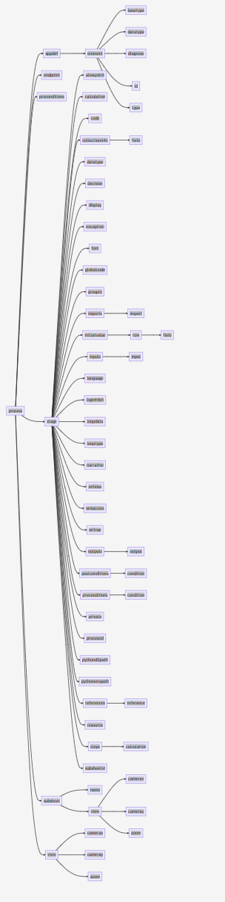


```code

flowchart RL
    process["process"]

    process --> appdef["appdef"]
    process --> endpoint["endpoint"]
    process --> preconditions["preconditions"]
    process --> stage["stage"]
    process --> subsheet["subsheet"]
    process --> view["view"]

    appdef --> element["element"]
    element --> basetype["basetype"]
    element --> datatype["datatype"]
    element --> diagnose["diagnose"]
    element --> id["id"]
    element --> type["type"]

    stage --> alwaysinit["alwaysinit"]
    stage --> calculation["calculation"]
    stage --> code["code"]
    stage --> collectioninfo["collectioninfo"]
    stage --> datatype_stage["datatype"]
    stage --> decision["decision"]
    stage --> display["display"]
    stage --> exception["exception"]
    stage --> font["font"]
    stage --> globalcode["globalcode"]
    stage --> groupid["groupid"]
    stage --> imports["imports"]
    stage --> initialvalue["initialvalue"]
    stage --> inputs["inputs"]
    stage --> language["language"]
    stage --> loginhibit["loginhibit"]
    stage --> loopdata["loopdata"]
    stage --> looptype["looptype"]
    stage --> narrative["narrative"]
    stage --> onfalse["onfalse"]
    stage --> onsuccess["onsuccess"]
    stage --> ontrue["ontrue"]
    stage --> outputs["outputs"]
    stage --> postconditions["postconditions"]
    stage --> preconditions_stage["preconditions"]
    stage --> private["private"]
    stage --> processid["processid"]
    stage --> pythondllpath["pythondllpath"]
    stage --> pythonenvpath["pythonenvpath"]
    stage --> references["references"]
    stage --> resource["resource"]
    stage --> steps["steps"]
    stage --> subsheetid["subsheetid"]

    collectioninfo --> field["field"]

    imports --> import_element["import"]

    initialvalue --> row["row"]
    row --> row_field["field"]

    inputs --> input["input"]

    outputs --> output["output"]

    postconditions --> postcondition_condition["condition"]

    preconditions_stage --> precondition_condition["condition"]

    references --> reference["reference"]

    steps --> step_calculation["calculation"]

    subsheet --> subsheet_name["name"]
    subsheet --> subsheet_view["view"]
    subsheet_view --> camerax_subsheet["camerax"]
    subsheet_view --> cameray_subsheet["cameray"]
    subsheet_view --> zoom_subsheet["zoom"]

    view --> camerax["camerax"]
    view --> cameray["cameray"]
    view --> zoom["zoom"]
```


```mermaid
flowchart LR
    process["process"]

    process --> appdef["appdef"]
    process --> endpoint["endpoint"]
    process --> preconditions["preconditions"]
    process --> stage["stage"]
    process --> subsheet["subsheet"]
    process --> view["view"]

    appdef --> element["element"]
    element --> basetype["basetype"]
    element --> datatype["datatype"]
    element --> diagnose["diagnose"]
    element --> id["id"]
    element --> type["type"]

    stage --> alwaysinit["alwaysinit"]
    stage --> calculation["calculation"]
    stage --> code["code"]
    stage --> collectioninfo["collectioninfo"]
    stage --> datatype_stage["datatype"]
    stage --> decision["decision"]
    stage --> display["display"]
    stage --> exception["exception"]
    stage --> font["font"]
    stage --> globalcode["globalcode"]
    stage --> groupid["groupid"]
    stage --> imports["imports"]
    stage --> initialvalue["initialvalue"]
    stage --> inputs["inputs"]
    stage --> language["language"]
    stage --> loginhibit["loginhibit"]
    stage --> loopdata["loopdata"]
    stage --> looptype["looptype"]
    stage --> narrative["narrative"]
    stage --> onfalse["onfalse"]
    stage --> onsuccess["onsuccess"]
    stage --> ontrue["ontrue"]
    stage --> outputs["outputs"]
    stage --> postconditions["postconditions"]
    stage --> preconditions_stage["preconditions"]
    stage --> private["private"]
    stage --> processid["processid"]
    stage --> pythondllpath["pythondllpath"]
    stage --> pythonenvpath["pythonenvpath"]
    stage --> references["references"]
    stage --> resource["resource"]
    stage --> steps["steps"]
    stage --> subsheetid["subsheetid"]

    collectioninfo --> field["field"]

    imports --> import_element["import"]

    initialvalue --> row["row"]
    row --> row_field["field"]

    inputs --> input["input"]

    outputs --> output["output"]

    postconditions --> postcondition_condition["condition"]

    preconditions_stage --> precondition_condition["condition"]

    references --> reference["reference"]

    steps --> step_calculation["calculation"]

    subsheet --> subsheet_name["name"]
    subsheet --> subsheet_view["view"]
    subsheet_view --> camerax_subsheet["camerax"]
    subsheet_view --> cameray_subsheet["cameray"]
    subsheet_view --> zoom_subsheet["zoom"]

    view --> camerax["camerax"]
    view --> cameray["cameray"]
    view --> zoom["zoom"]
```

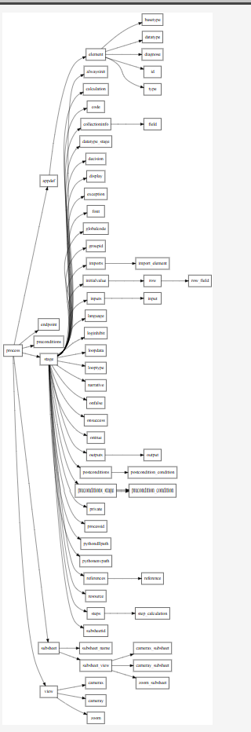

```code

digraph BPObject {
    rankdir=TB;
    node [shape=box];

    process -> appdef;
    process -> endpoint;
    process -> preconditions;
    process -> stage;
    process -> subsheet;
    process -> view;

    appdef -> element;
    element -> basetype;
    element -> datatype;
    element -> diagnose;
    element -> id;
    element -> type;

    stage -> alwaysinit;
    stage -> calculation;
    stage -> code;
    stage -> collectioninfo;
    stage -> datatype_stage;
    stage -> decision;
    stage -> display;
    stage -> exception;
    stage -> font;
    stage -> globalcode;
    stage -> groupid;
    stage -> imports;
    stage -> initialvalue;
    stage -> inputs;
    stage -> language;
    stage -> loginhibit;
    stage -> loopdata;
    stage -> looptype;
    stage -> narrative;
    stage -> onfalse;
    stage -> onsuccess;
    stage -> ontrue;
    stage -> outputs;
    stage -> postconditions;
    stage -> preconditions_stage;
    stage -> private;
    stage -> processid;
    stage -> pythondllpath;
    stage -> pythonenvpath;
    stage -> references;
    stage -> resource;
    stage -> steps;
    stage -> subsheetid;

    collectioninfo -> field;

    imports -> import_element;

    initialvalue -> row;
    row -> row_field;

    inputs -> input;

    outputs -> output;

    postconditions -> postcondition_condition;

    preconditions_stage -> precondition_condition;

    references -> reference;

    steps -> step_calculation;

    subsheet -> subsheet_name;
    subsheet -> subsheet_view;
    subsheet_view -> camerax_subsheet;
    subsheet_view -> cameray_subsheet;
    subsheet_view -> zoom_subsheet;

    view -> camerax;
    view -> cameray;
    view -> zoom;
}
```
### See Also
  * https://openreview.net/pdf/3a0ffc73b487443feb8f2abdacbf3200299cf7o97.pdf
  * [Agent Skills Specification](https://agentskills.io/specification) - complete format specification for Agent Skill
  * [vibe coding cases overview](https://habr.com/ru/articles/1065582/) (in Russian)
  * https://www.markdownguide.org/basic-syntax/
  * https://www.markdownguide.org/extended-syntax/
  * [Microsoft Access Database Engine 2016 Redistributable](https://www.microsoft.com/en-us/download/details.aspx?id=54920&msockid=2cabb1f015b366df1b68a73514bf67b7)
  * [misleading Link related to Access Database Engine Redistributable 2010](https://www.microsoft.com/en-us/microsoft-365/blog/2010/05/10/download-access-2010-runtime-database-engine-redistributable-and-source-code-control/)
  * [Access Database Engine Redistributable 2010 download](https://download.cnet.com/microsoft-access-database-engine-2010-redistributable-32-bit/3000-10254_4-75452795.html)
  * https://habrastorage.org/vid/s1/0f55/8d1a/c6d3/0f558d1ac6d3f6de5d4b7cc3dd5d4e11.webm
  * https://habrastorage.org/vid/s1/6f8b/a676/2fbc/6f8ba6762fbc6f1920d24b5dd2017388.webm
  * https://habrastorage.org/vid/s1/4a49/6d02/a780/4a496d02a780e2951fd2eef7dba8e441.mp4
  * [majiayu000/claude-skill-registry](https://github.com/majiayu000/claude-skill-registry/tree/main/skills) - the most comprehensive Claude Code skills registry | Web Search: - note massive 
  * [skills for interfacing UiPath capabilities to external developers](https://github.com/UiPath/skills) - these are focused on __UiPath__ but there is almost 1700 individual files so browsing aid is needed
  * https://github.com/membranedev/application-skills/tree/main/skills
  * https://developercommunity.visualstudio.com/t/Add-Emojis-for-Quick-Responses-In-PR-Rev/10651469?ftype=idea&q=quick+add+default+file+
  
  
https://icons8.com/icons/set/shared-folder
https://icons8.com/icons/set/docker-containers


https://icons8.com/icon/kUIdznZvxAud/docker

https://icons8.com icon for podman
https://icons8.com/icon/120105/shared-folder
https://icons8.com/icon/25902/virtualbox

---
### Author
[Serguei Kouzmine](kouzmine_serguei@yahoo.com)
