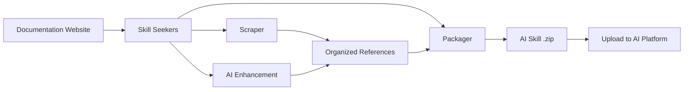

### Info

replica of [usufkaraaslan/Skill_Seekers](https://github.com/yusufkaraaslan/Skill_Seekers) - python library to convert the documentation websites, GitHub repositories, and PDFs into Claude AI skills. The tool offers [Scraping Guide](https://github.com/yusufkaraaslan/Skill_Seekers/blob/development/docs/user-guide/02-scraping.md) covering its distinguished 18 source types
and [tutorials](https://github.com/yusufkaraaslan/Skill_Seekers/blob/development/README.md) *with multiple translations*

Tool arvhived source [releases](https://github.com/yusufkaraaslan/Skill_Seekers/releases/tag/v3.9.1) are available. 

What were GitHub's __#1__ and __#2__ repositories of the day? I don't know—I would guess they were AI-related. But, fortunately, I *do* remember __#3__: __Skill Seekers__, a tool for generating `SKILL.md` artifacts from documentation, GitHub repositories, PDF and the like

__Skill Seekers__  is ranked the __#3__ __GitHub Repository of the day__

it has a logo

### How It Works

### Background

The rapid adoption of `SKILLS.md` collections and the rise of "vibe coding" appear to reinforce each other. As developers increasingly rely on AI agents for implementation, there is greater demand for reusable behavioral guidance such as `SKILLS.md`. Conversely, the availability of curated skills makes AI-assisted development more capable and encourages broader adoption of agent-driven workflows.

Once established, curated skill collections further boosts AI-assisted ("vibe") development, creating a positive feedback loop

Chronology supports this:

  * Large language models became capable coding assistants.
  * Developers began relying on them for increasingly complex tasks ("vibe coding").
  * People realized that repeatedly describing project conventions and workflows was inefficient.
  * `SKILL.md`-style reusable instructions emerged as a way to package that knowledge.
  * Better skills made the assistants more effective, encouraging even more AI-assisted development.

The relationship between `SKILL.md` collections and AI-assisted ("vibe") coding is best described as co-evolution rather than simple cause and effect.

### See Also
  * [Skill Seekers Discussions](https://github.com/yusufkaraaslan/Skill_Seekers/discussions)

  * [related post](https://habr.com/ru/news/1006516/) (in Russian)

  * [aggregation project](https://github.com/majiayu000/claude-skill-registry/tree/main/skills) - automatically generated aggregation and distribution registry for Agent Skills - its scale illustrates the rapid emergence of a machine-curated skill ecosyste (the 200,000+ skills one found there being generated artifacts, rather than hand-maintained source).
  * [Evidence from 138K SKILL.md Files](https://openreview.net/pdf/3a0ffc73b487443feb8f2abdacbf3200299cf797.pdf)
