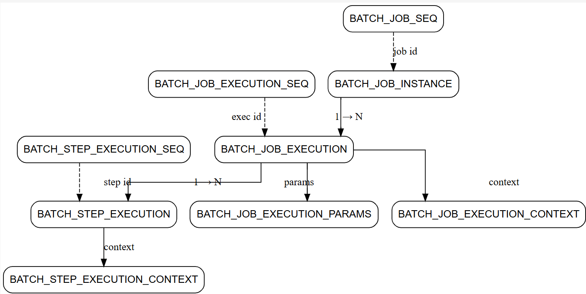
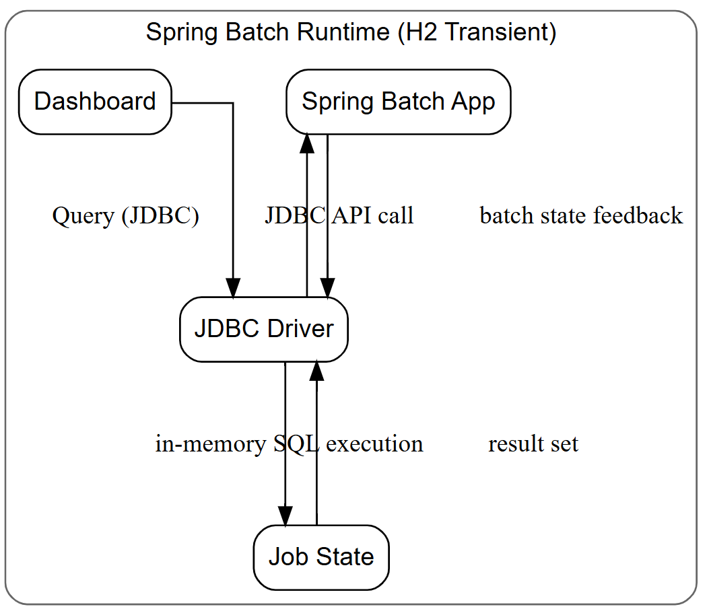
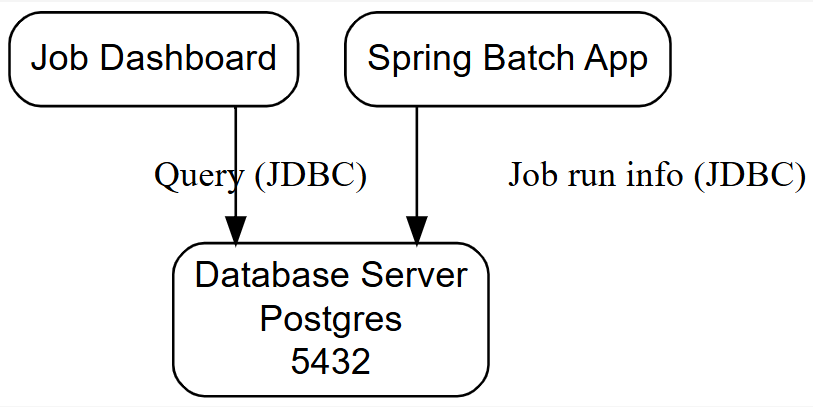
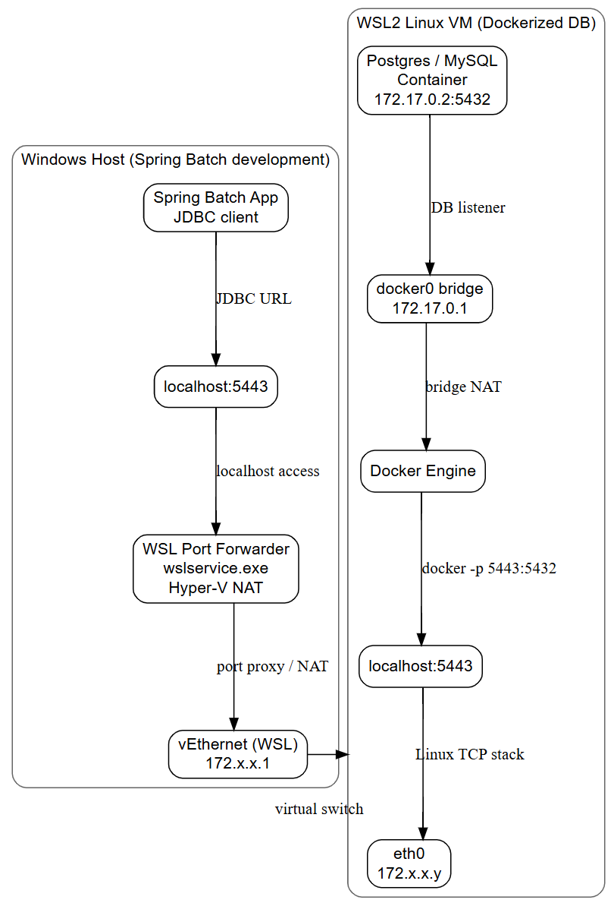
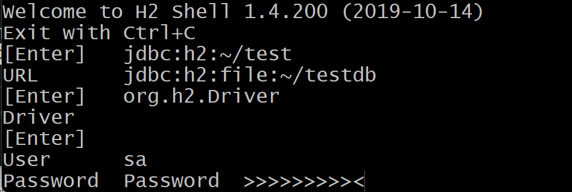
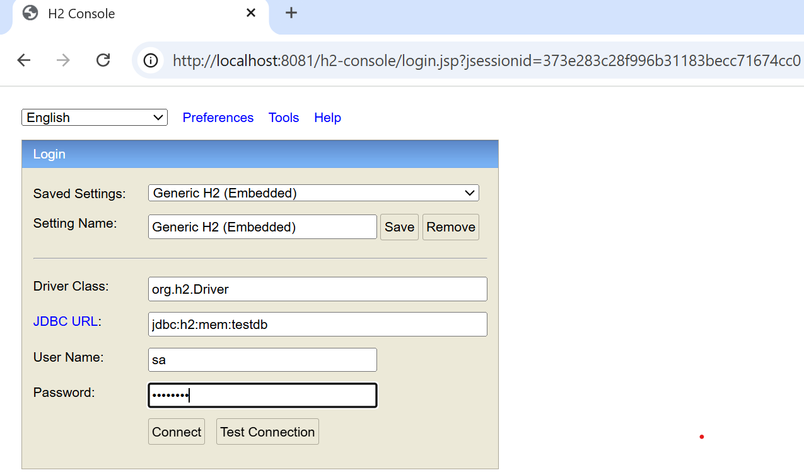
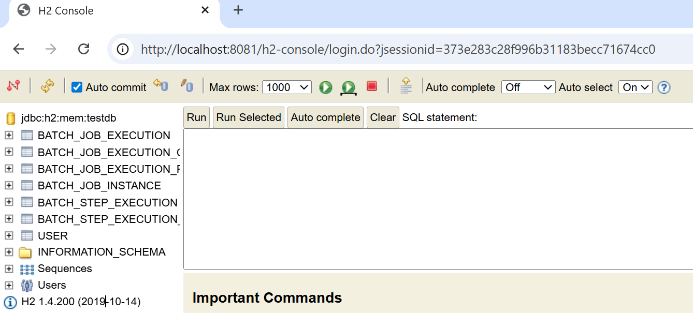
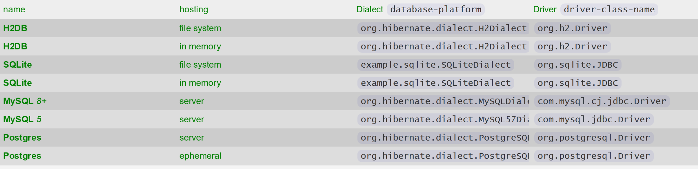

### Info

### Schema


Basic docker-compose basic spring batch Demo [spring-batch](https://github.com/EalenXie/springboot-batch) downgraded to MySQL __5.7__.

### Background


Classic Spring Batch metadata tables (NOTE: __H2__ / legacy __MySQL__-style schema) simplified) for readability, hierarchy, and relationship flow — no raw DDL noise:














### Argument Combining

These variations do not require any code change and are entirely configuration-driven:

One wants  a clean separation:

  * JVM args → infrastructure (memory, agent, logging baseline)
  * Spring profiles → entire environment switching (DB, dialect, batch behavior)
  * CLI args → only job parameters

This is achieved through "Spring Batch Job Inventory" profile crafting:

`application-mysql.yaml`:

```yaml
spring:
  datasource:
    url: jdbc:mysql://localhost:3306/example_db?useSSL=false&allowPublicKeyRetrieval=true&serverTimezone=UTC
    driverClassName: com.mysql.jdbc.Driver
    username: example_db_user
    password: example_db_pass
  jpa:
    database-platform: org.hibernate.dialect.MySQL57Dialect

  logging:
    level:
      org.springframework.jdbc: WARN
```
`application-h2-transient.yaml`:
```yaml
spring:
  datasource:
    url: jdbc:h2:mem:testdb
    driverClassName: org.h2.Driver
    username: sa
    password: password
  jpa:
    database-platform: org.hibernate.dialect.H2Dialect
  batch:
    jdbc:
      initialize-schema: always
  h2:
    console:
      enabled: true
      path: /h2-console
```
`application-h2-peristent.yaml`:
```yaml
spring:
  datasource:
    url: jdbc:h2:file:${user.home}/testdb;AUTO_SERVER=TRUE
    driverClassName: org.h2.Driver
    username: sa
    password: password
  jpa:
    database-platform: org.hibernate.dialect.H2Dialect
  h2:
    console:
      enabled: true
      path: /h2-console

  logging:
    level:
      org.springframework.jdbc: DEBUG

```
which will naturally merge with already existing "Environment" progfile(s):

```sh
java \
  -javaagent:/opt/monitoring/jmx_prometheus_javaagent.jar=9404:/opt/monitoring/config.yaml \
  -Xms512m \
  -Xmx2048m \
  -jar target/spring-batch.jar \
  --spring.profiles.active=h2-transient,dev \
  --job.name=customerImportJob \
  --job.runDate=2026-04-23
```

The only differences between Spring Batch Inventory profiles are in dialect the JPA statement are translated into SQL (`jpa.database-platform`) and connector the actual Database is accessed (`datasource.url`) and optional logging differences.


Furthermore the pure [H2 Database](https://en.wikipedia.org/wiki/H2_Database_Engine) which is a pure Java SQL Database Engine implementation also offfers



console

and



web Dashboards
from where one can examine the very same database Spring Batch Job inventories are stored:


After the Java Spring "fat" jar is packaged one can find out the exact version of the JDBC dependency that was used

```cmd
mvn dependency:tree | grep -i MySQL
```

```text
[INFO] \- mysql:mysql-connector-java:jar:5.1.49:runtime

```
and either extract it from the jar:

```sh
jar tf target\example.springboot-batch.jar| findstr -i mysql
```
```text
BOOT-INF/lib/mysql-connector-java-5.1.49.jar
```

or locate it in the Maven cache and combine it in the command to launch the dashboard which will be able to connect to the same database during or after the Spring Batch application run
```sh
java -cp h2.jar:mysql-connector-j.jar org.h2.tools.Console
```

```sh
java -cp ~/.m2/repository/mysql/mysql-connector-java/5.1.49/mysql-connector-java-5.1.49.jar:~/.m2/repository/com/h2database/h2/1.4.200/h2-1.4.200.jar org.h2.tools.Console
```
```sh
java ~/.m2/repository/com/h2database/h2/*/h2*jar org.h2.tools.Shell
```
In fact during development one may tune the Database schema in one provider and then port it to another.

There are several choices of provider and cons and pros to consder. There is absoilutely no need to start with the final vendor

### Database Driver Choices

| name | hosting | Dialect `database-platform` | Driver `driver-class-name`  |
|-----|----------|-----------------------------|-----------------------------|
| __H2DB__  | file system | `org.hibernate.dialect.H2Dialect` | `org.h2.Driver`|
| __H2DB__  | in memory  | `org.hibernate.dialect.H2Dialect` | `org.h2.Driver` |
| __SQLite__ |file system  | `example.sqlite.SQLiteDialect` | `org.sqlite.JDBC`|
| __SQLite__ |in memory    | `example.sqlite.SQLiteDialect` | `org.sqlite.JDBC`|
| __MySQL__ _8+_ |server   | `org.hibernate.dialect.MySQLDialect`| `com.mysql.cj.jdbc.Driver`|
| __MySQL__ _5_ |server    | `org.hibernate.dialect.MySQL57Dialect`| `com.mysql.jdbc.Driver`|
| __Postgres__| server     | `org.hibernate.dialect.PostgreSQL95Dialect`|`org.postgresql.Driver` |
| __Postgres__| ephemeral  | `org.hibernate.dialect.PostgreSQL95Dialect`|`org.postgresql.Driver` |

NOTE: Many so-called “embedded” solutions—especially *embedded* __PostgreSQL__ or *embedded* __Microsoft__ __SQL Server__ wrappers—are not truly embedded like __SQLite__ or __H2__ Database Engine. The *__Embeded PostgreSQL__ database*  will actually requre: run under maven goal when `ru.yandex.qatools.embed.postgresql-embedded.jar` and would download a full `~200` Mb __Postgresql__ [installer](https://www.postgresql.org/download/linux/ubuntu/) and unpack it in hidden folder under user home directory `~/.embedpostgresql`, create data dir under `$TEMP`, launch a full actual sever (daemon process) locally bound to a user `TCP` port.

So it feels less like:

  * embedded database

and closer to:

  * secretly installed local server

and have also observed to be unstable on Windows if configured to do ddl




NOTE: The __H2__ __SQL__ is closer to traditional server databases (__PostgreSQL__ / __Oracle__ / __MySQL__ style) because it was designed as a pure Java __RDBMS__ with __JDBC__ compatibility and testing support.

The __SQLite__ __SQL__ is its own lightweight dialect with looser typing and many special behaviorso

This difference may cause some surprises in __JPA__ tests, and the same warning applies to schema-heavy, transaction-sensitive frameworks like __Spring Batch__: using __SQLite__ as a stand-in for a “real” server __RDBMS__ like Microsoft SQL Server, PostgreSQL, or Oracle Database is often risky, but __SQLite__ is ideal for

  * offline analysis
  * simple debugging
  * quick reports
  * restart diagnostics

To reiterate __SQLite__ is optimized for embedded/local usage -  __Spring Batch__ assumes stronger enterprise-style __RDBMS__ behavior

### Usage

```sh
pushd app
mvn clean package
popd
```
```sh
docker-compose up --build -d
```
```sh
docker-compose ps
```
```text
          Name                        Command                State                              Ports
----------------------------------------------------------------------------------------------------------------------------
basic-spring-batch2_app_1   java -jar /app.jar            Up             0.0.0.0:8080->8080/tcp,:::8080->8080/tcp
mysql-server                docker-entrypoint.sh mysqld   Up (healthy)   0.0.0.0:3306->3306/tcp,:::3306->3306/tcp, 33060/tcp
```
```sh
docker-compose exec mysql-server sh
```


```sh
mysql -u example_db_user -p
```

```sh
mysql> show databases;
```
```text
+--------------------+
| Database           |
+--------------------+
| information_schema |
| example_db         |
+--------------------+
2 rows in set (0.00 sec)
```
```sh

mysql> use example_db
```
```text
Database changed
```
```sh
mysql> show tables ;
```
```text
+------------------------------+
| Tables_in_example_db         |
+------------------------------+
| BATCH_JOB_EXECUTION          |
| BATCH_JOB_EXECUTION_CONTEXT  |
| BATCH_JOB_EXECUTION_PARAMS   |
| BATCH_JOB_EXECUTION_SEQ      |
| BATCH_JOB_INSTANCE           |
| BATCH_JOB_SEQ                |
| BATCH_STEP_EXECUTION         |
| BATCH_STEP_EXECUTION_CONTEXT |
| BATCH_STEP_EXECUTION_SEQ     |
+------------------------------+
10 rows in set (0.00 sec)
```
```sh
docker-compose logs --no-color app | less
```
```text
Attaching to basic-spring-batch2_app_1
app_1           | waiting for mysql
app_1           | waiting for mysql
app_1           |
app_1           |   .   ____          _            __ _ _
app_1           |  /\\ / ___'_ __ _ _(_)_ __  __ _ \ \ \ \
app_1           | ( ( )\___ | '_ | '_| | '_ \/ _` | \ \ \ \
app_1           |  \\/  ___)| |_)| | | | | || (_| |  ) ) ) )
app_1           |   '  |____| .__|_| |_|_| |_\__, | / / / /
app_1           |  =========|_|==============|___/=/_/_/_/
app_1           |  :: Spring Boot ::        (v2.3.4.RELEASE)
app_1           |
app_1           | 2026-04-18 02:24:32.663  INFO 1 --- [           main] name.ealen.SpringBatchApplication        : Starting SpringBatchApplication v0.1.0-SNAPSNOT on 3a7c99382add with PID 1 (/app.jar started by root in /)
app_1           | 2026-04-18 02:24:32.674  INFO 1 --- [           main] name.ealen.SpringBatchApplication        : No active profile set, falling back to default profiles: default
app_1           | 2026-04-18 02:24:34.445  INFO 1 --- [           main] .s.d.r.c.RepositoryConfigurationDelegate : Bootstrapping Spring Data JPA repositories in DEFERRED mode.
app_1           | 2026-04-18 02:24:34.512  INFO 1 --- [           main] .s.d.r.c.RepositoryConfigurationDelegate : Finished Spring Data repository scanning in 35ms. Found 0 JPA repository interfaces.
app_1           | 2026-04-18 02:24:35.679  INFO 1 --- [           main] o.s.s.concurrent.ThreadPoolTaskExecutor  : Initializing ExecutorService 'threadPoolTaskExecutor'
app_1           | 2026-04-18 02:24:35.712  INFO 1 --- [           main] com.zaxxer.hikari.HikariDataSource       : HikariPool-1 - Starting...
app_1           | 2026-04-18 02:24:36.315  INFO 1 --- [           main] com.zaxxer.hikari.HikariDataSource       : HikariPool-1 - Start completed.
app_1           | 2026-04-18 02:24:36.583  INFO 1 --- [      Data-Job1] o.hibernate.jpa.internal.util.LogHelper  : HHH000204: Processing PersistenceUnitInfo [name: default]
app_1           | 2026-04-18 02:24:36.940  INFO 1 --- [      Data-Job1] org.hibernate.Version                    : HHH000412: Hibernate ORM core version 5.4.21.Final
app_1           | 2026-04-18 02:24:37.194  WARN 1 --- [           main] o.s.b.a.batch.JpaBatchConfigurer         : JPA does not support custom isolation levels, so locks may not be taken when launching Jobs
app_1           | 2026-04-18 02:24:37.212  INFO 1 --- [           main] o.s.b.c.r.s.JobRepositoryFactoryBean     : No database type set, using meta data indicating: MYSQL
app_1           | 2026-04-18 02:24:37.744  INFO 1 --- [      Data-Job1] o.hibernate.annotations.common.Version   : HCANN000001: Hibernate Commons Annotations {5.1.0.Final}
app_1           | 2026-04-18 02:24:37.876  INFO 1 --- [           main] o.s.b.c.l.support.SimpleJobLauncher      : No TaskExecutor has been set, defaulting to synchronous executor.
app_1           | 2026-04-18 02:24:38.231  INFO 1 --- [           main] DeferredRepositoryInitializationListener : Triggering deferred initialization of Spring Data repositories…
app_1           | 2026-04-18 02:24:38.240  INFO 1 --- [           main] DeferredRepositoryInitializationListener : Spring Data repositories initialized!
app_1           | 2026-04-18 02:24:38.265  INFO 1 --- [           main] name.ealen.SpringBatchApplication        : Started SpringBatchApplication in 6.754 seconds (JVM running for 7.776)
app_1           | 2026-04-18 02:24:38.275  INFO 1 --- [           main] o.s.b.a.b.JobLauncherApplicationRunner   : Running default command line with: []
app_1           | 2026-04-18 02:24:38.412  INFO 1 --- [      Data-Job1] org.hibernate.dialect.Dialect            : HHH000400: Using dialect: org.hibernate.dialect.MySQL57Dialect
app_1           | 2026-04-18 02:24:40.312  INFO 1 --- [      Data-Job1] o.h.e.t.j.p.i.JtaPlatformInitiator       : HHH000490: Using JtaPlatform implementation: [org.hibernate.engine.transaction.jta.platform.internal.NoJtaPlatform]
app_1           | 2026-04-18 02:24:40.337  INFO 1 --- [      Data-Job1] j.LocalContainerEntityManagerFactoryBean : Initialized JPA EntityManagerFactory for persistence unit 'default'
app_1           | 2026-04-18 02:24:40.678  INFO 1 --- [           main] o.s.b.c.l.support.SimpleJobLauncher      : Job: [SimpleJob: [name=dataHandleJob]] launched with the following parameters: [{run.id=1}]
app_1           | 2026-04-18 02:24:40.762  INFO 1 --- [           main] name.ealen.listener.JobListener          : job before {run.id=1}
app_1           | 2026-04-18 02:24:40.813  INFO 1 --- [           main] o.s.batch.core.job.SimpleStepHandler     : Executing step: [getData]
app_1           | 2026-04-18 02:24:41.275  INFO 1 --- [           main] name.ealen.batch.DataBatchConfiguration  : processor data : Access{id=1, username='ealenxie', shopName='*', categoryName='*', brandName='null', shopId='null', omit='null', updateTime='2018-05-11 10:25:17', deleteStatus=false, createTime='null', description='测试数据'}
app_1           | 2026-04-18 02:24:41.278  INFO 1 --- [           main] name.ealen.batch.DataBatchConfiguration  : processor data : Access{id=2, username='li.je.3', shopName='*', categoryName='*', brandName='null', shopId='null', omit='null', updateTime='2018-05-11 10:25:17', deleteStatus=false, createTime='null', description='null'}
app_1           | 2026-04-18 02:24:41.279  INFO 1 --- [           main] name.ealen.batch.DataBatchConfiguration  : processor data : Access{id=3, username='dng.j.2', shopName='*', categoryName='HAIR_CARE', brandName='null', shopId='null', omit='null', updateTime='2018-05-11 10:25:17', deleteStatus=false, createTime='null', description='null'}
app_1           | 2026-04-18 02:24:41.280  INFO 1 --- [           main] name.ealen.batch.DataBatchConfiguration  : processor data : Access{id=4, username='xu.jan.2', shopName='*', categoryName='*', brandName='null', shopId='null', omit='null', updateTime='2018-05-11 10:25:17', deleteStatus=false, createTime='null', description='null'}
app_1           | 2026-04-18 02:24:41.280  INFO 1 --- [           main] name.ealen.batch.DataBatchConfiguration  : processor data : Access{id=5, username='huang.ra.1', shopName='*', categoryName='*', brandName='null', shopId='null', omit='null', updateTime='2018-05-11 10:25:17', deleteStatus=false, createTime='null', description='null'}
app_1           | 2026-04-18 02:24:41.280  INFO 1 --- [           main] name.ealen.batch.DataBatchConfiguration  : processor data : Access{id=6, username='zye.y.4', shopName='*', categoryName='*', brandName='null', shopId='null', omit='null', updateTime='2018-05-11 10:25:17', deleteStatus=false, createTime='null', description='null'}
app_1           | 2026-04-18 02:24:41.280  INFO 1 --- [           main] name.ealen.batch.DataBatchConfiguration  : processor data : Access{id=7, username='wu.ti.2', shopName='VIP', categoryName='*', brandName='null', shopId='null', omit='null', updateTime='2018-05-11 10:25:17', deleteStatus=false, createTime='null', description='null'}
app_1           | 2026-04-18 02:24:41.280  INFO 1 --- [           main] name.ealen.batch.DataBatchConfiguration  : processor data : Access{id=8, username='zhou.li.5', shopName='*', categoryName='*', brandName='null', shopId='null', omit='null', updateTime='2018-05-11 10:25:18', deleteStatus=false, createTime='null', description='null'}
...
app_1           | 2026-04-18 02:24:42.037  INFO 1 --- [           main] name.ealen.batch.DataBatchConfiguration  : processor data : Access{id=406, username='wu.j.5', shopName='XX_Braun', categoryName='*', brandName='null', shopId='null', omit='null', updateTime='2018-05-11 10:25:31', deleteStatus=false, createTime='null', description='null'}
app_1           | 2026-04-18 02:24:42.037  INFO 1 --- [           main] name.ealen.batch.DataBatchConfiguration  : processor data : Access{id=407, username='wu.j.5', shopName='XX_Gillette', categoryName='*', brandName='null', shopId='null', omit='null', updateTime='2018-05-11 10:25:31', deleteStatus=false, createTime='null', description='null'}
app_1           | 2026-04-18 02:24:42.037  INFO 1 --- [           main] name.ealen.batch.DataBatchConfiguration  : processor data : Access{id=408, username='wu.j.5', shopName='XX_Global', categoryName='*', brandName='null', shopId='null', omit='null', updateTime='2018-05-11 10:25:31', deleteStatus=false, createTime='null', description='null'}
app_1           | 2026-04-18 02:24:42.037  INFO 1 --- [           main] name.ealen.batch.DataBatchConfiguration  : processor data : Access{id=409, username='wu.j.5', shopName='XX_Olay', categoryName='*', brandName='null', shopId='null', omit='null', updateTime='2018-05-11 10:25:31', deleteStatus=false, createTime='null', description='null'}
app_1           | 2026-04-18 02:24:42.037  INFO 1 --- [           main] name.ealen.batch.DataBatchConfiguration  : processor data : Access{id=410, username='wu.j.5', shopName='XX_Oral-B', categoryName='*', brandName='null', shopId='null', omit='null', updateTime='2018-05-11 10:25:31', deleteStatus=false, createTime='null', description='null'}
app_1           | 2026-04-18 02:24:42.037  INFO 1 --- [           main] name.ealen.batch.DataBatchConfiguration  : processor data : Access{id=411, username='wu.j.5', shopName='XX_P&G', categoryName='*', brandName='null', shopId='null', omit='null', updateTime='2018-05-11 10:25:31', deleteStatus=false, createTime='null', description='null'}
app_1           | 2026-04-18 02:24:42.037  INFO 1 --- [           main] name.ealen.batch.DataBatchConfiguration  : processor data : Access{id=412, username='wu.j.5', shopName='XX_Pampers', categoryName='*', brandName='null', shopId='null', omit='null', updateTime='2018-05-11 10:25:31', deleteStatus=false, createTime='null', description='null'}
app_1           | 2026-04-18 02:24:42.038  INFO 1 --- [           main] name.ealen.batch.DataBatchConfiguration  : processor data : Access{id=413, username='wu.j.5', shopName='XX_SKII', categoryName='*', brandName='null', shopId='null', omit='null', updateTime='2018-05-11 10:25:31', deleteStatus=false, createTime='null', description='null'}
app_1           | 2026-04-18 02:24:42.038  INFO 1 --- [           main] name.ealen.batch.DataBatchConfiguration  : processor data : Access{id=414, username='wu.j.5', shopName='XX_VS', categoryName='*', brandName='null', shopId='null', omit='null', updateTime='2018-05-11 10:25:31', deleteStatus=false, createTime='null', description='null'}
app_1           | 2026-04-18 02:24:42.038  INFO 1 --- [           main] name.ealen.batch.DataBatchConfiguration  : processor data : Access{id=415, username='wu.j.5', shopName='Tmall_Super', categoryName='*', brandName='null', shopId='null', omit='null', updateTime='2018-05-11 10:25:31', deleteStatus=false, createTime='null', description='null'}
app_1           | 2026-04-18 02:24:42.038  INFO 1 --- [           main] name.ealen.batch.DataBatchConfiguration  : processor data : Access{id=416, username='Zhou.k.5', shopName='JD', categoryName='*', brandName='null', shopId='null', omit='null', updateTime='2018-05-11 10:25:32', deleteStatus=false, createTime='null', description='null'}
app_1           | 2026-04-18 02:24:42.038  INFO 1 --- [           main] name.ealen.batch.DataBatchConfiguration  : processor data : Access{id=417, username='du.yu', shopName='*', categoryName='HAIR_CARE', brandName='null', shopId='null', omit='null', updateTime='2018-05-11 10:25:32', deleteStatus=false, createTime='null', description='null'}
app_1           | 2026-04-18 02:24:42.038  INFO 1 --- [           main] name.ealen.batch.DataBatchConfiguration  : processor data : Access{id=418, username='yuksel.s.1', shopName='*', categoryName='HAIR_CARE', brandName='null', shopId='null', omit='null', updateTime='2018-05-11 10:25:32', deleteStatus=false, createTime='null', description='null'}
app_1           | 2026-04-18 02:24:42.038  INFO 1 --- [           main] name.ealen.batch.DataBatchConfiguration  : processor data : Access{id=419, username='li.lu.1', shopName='*', categoryName='HAIR_CARE', brandName='null', shopId='null', omit='null', updateTime='2018-05-11 10:25:32', deleteStatus=false, createTime='null', description='null'}
app_1           | 2026-04-18 02:24:42.038  INFO 1 --- [           main] name.ealen.batch.DataBatchConfiguration  : processor data : Access{id=420, username='lee.km', shopName='*', categoryName='HAIR_CARE', brandName='null', shopId='null', omit='null', updateTime='2018-05-11 10:25:32', deleteStatus=false, createTime='null', description='null'}
app_1           | 2026-04-18 02:24:42.038  INFO 1 --- [           main] name.ealen.batch.DataBatchConfiguration  : processor data : Access{id=421, username='he.sw', shopName='VIP', categoryName='SKIN_CARE', brandName='null', shopId='null', omit='null', updateTime='2018-05-11 10:25:32', deleteStatus=false, createTime='null', description='null'}
app_1           | 2026-04-18 02:24:42.038  INFO 1 --- [           main] name.ealen.batch.DataBatchConfiguration  : processor data : Access{id=422, username='guan.we', shopName='VIP', categoryName='PRESTIGE', brandName='null', shopId='null', omit='null', updateTime='2018-05-11 10:25:32', deleteStatus=false, createTime='null', description='null'}
app_1           | 2026-04-18 02:24:42.038  INFO 1 --- [           main] name.ealen.batch.DataBatchConfiguration  : processor data : Access{id=423, username='zhang.z.26', shopName='VIP', categoryName='*', brandName='null', shopId='null', omit='null', updateTime='2018-05-11 10:25:32', deleteStatus=false, createTime='null', description='null'}
app_1           | 2026-04-18 02:24:42.039  INFO 1 --- [           main] name.ealen.batch.DataBatchConfiguration  : processor data : Access{id=424, username='zhang.z.26', shopName='SUNING', categoryName='*', brandName='null', shopId='null', omit='null', updateTime='2018-05-11 10:25:32', deleteStatus=false, createTime='null', description='null'}
app_1           | 2026-04-18 02:24:42.039  INFO 1 --- [           main] name.ealen.batch.DataBatchConfiguration  : processor data : Access{id=425, username='null', shopName='*', categoryName='*', brandName='null', shopId='null', omit='null', updateTime='2018-05-11 10:25:32', deleteStatus=false, createTime='null', description='null'}
app_1           | 2026-04-18 02:24:42.039  INFO 1 --- [           main] name.ealen.batch.DataBatchConfiguration  : processor data : Access{id=426, username='null', shopName='VIP', categoryName='PRESTIGE', brandName='null', shopId='null', omit='null', updateTime='2018-05-11 10:25:32', deleteStatus=false, createTime='null', description='null'}
app_1           | 2026-04-18 02:24:42.039  INFO 1 --- [           main] name.ealen.batch.DataBatchConfiguration  : processor data : Access{id=427, username='null', shopName='*', categoryName='*', brandName='null', shopId='null', omit='null', updateTime='2018-05-11 10:25:32', deleteStatus=false, createTime='null', description='null'}
app_1           | 2026-04-18 02:24:42.039  INFO 1 --- [           main] name.ealen.batch.DataBatchConfiguration  : write data : Access{id=401, username='lin.r.5', shopName='Tmall_Super', categoryName='*', brandName='null', shopId='null', omit='null', updateTime='2018-05-11 10:25:31', deleteStatus=false, createTime='null', description='null'}
app_1           | 2026-04-18 02:24:42.039  INFO 1 --- [           main] name.ealen.batch.DataBatchConfiguration  : write data : Access{id=402, username='zhang.yu.2', shopName='VIP', categoryName='*', brandName='null', shopId='null', omit='null', updateTime='2018-05-11 10:25:31', deleteStatus=false, createTime='null', description='null'}
app_1           | 2026-04-18 02:24:42.039  INFO 1 --- [           main] name.ealen.batch.DataBatchConfiguration  : write data : Access{id=403, username='zhang.yu.2', shopName='SUNING', categoryName='*', brandName='null', shopId='null', omit='null', updateTime='2018-05-11 10:25:31', deleteStatus=false, createTime='null', description='null'}
app_1           | 2026-04-18 02:24:42.039  INFO 1 --- [           main] name.ealen.batch.DataBatchConfiguration  : write data : Access{id=404, username='#', shopName='*', categoryName='HAIR_CARE', brandName='null', shopId='null', omit='null', updateTime='2018-05-11 10:25:31', deleteStatus=false, createTime='null', description='null'}
app_1           | 2026-04-18 02:24:42.039  INFO 1 --- [           main] name.ealen.batch.DataBatchConfiguration  : write data : Access{id=405, username='kang.j.4', shopName='*', categoryName='HAIR_CARE', brandName='null', shopId='null', omit='null', updateTime='2018-05-11 10:25:31', deleteStatus=false, createTime='null', description='null'}
app_1           | 2026-04-18 02:24:42.039  INFO 1 --- [           main] name.ealen.batch.DataBatchConfiguration  : write data : Access{id=406, username='wu.j.5', shopName='XX_Braun', categoryName='*', brandName='null', shopId='null', omit='null', updateTime='2018-05-11 10:25:31', deleteStatus=false, createTime='null', description='null'}
app_1           | 2026-04-18 02:24:42.039  INFO 1 --- [           main] name.ealen.batch.DataBatchConfiguration  : write data : Access{id=407, username='wu.j.5', shopName='XX_Gillette', categoryName='*', brandName='null', shopId='null', omit='null', updateTime='2018-05-11 10:25:31', deleteStatus=false, createTime='null', description='null'}
app_1           | 2026-04-18 02:24:42.039  INFO 1 --- [           main] name.ealen.batch.DataBatchConfiguration  : write data : Access{id=408, username='wu.j.5', shopName='XX_Global', categoryName='*', brandName='null', shopId='null', omit='null', updateTime='2018-05-11 10:25:31', deleteStatus=false, createTime='null', description='null'}
app_1           | 2026-04-18 02:24:42.039  INFO 1 --- [           main] name.ealen.batch.DataBatchConfiguration  : write data : Access{id=409, username='wu.j.5', shopName='XX_Olay', categoryName='*', brandName='null', shopId='null', omit='null', updateTime='2018-05-11 10:25:31', deleteStatus=false, createTime='null', description='null'}
app_1           | 2026-04-18 02:24:42.040  INFO 1 --- [           main] name.ealen.batch.DataBatchConfiguration  : write data : Access{id=410, username='wu.j.5', shopName='XX_Oral-B', categoryName='*', brandName='null', shopId='null', omit='null', updateTime='2018-05-11 10:25:31', deleteStatus=false, createTime='null', description='null'}
app_1           | 2026-04-18 02:24:42.040  INFO 1 --- [           main] name.ealen.batch.DataBatchConfiguration  : write data : Access{id=411, username='wu.j.5', shopName='XX_P&G', categoryName='*', brandName='null', shopId='null', omit='null', updateTime='2018-05-11 10:25:31', deleteStatus=false, createTime='null', description='null'}
app_1           | 2026-04-18 02:24:42.040  INFO 1 --- [           main] name.ealen.batch.DataBatchConfiguration  : write data : Access{id=412, username='wu.j.5', shopName='XX_Pampers', categoryName='*', brandName='null', shopId='null', omit='null', updateTime='2018-05-11 10:25:31', deleteStatus=false, createTime='null', description='null'}
app_1           | 2026-04-18 02:24:42.040  INFO 1 --- [           main] name.ealen.batch.DataBatchConfiguration  : write data : Access{id=413, username='wu.j.5', shopName='XX_SKII', categoryName='*', brandName='null', shopId='null', omit='null', updateTime='2018-05-11 10:25:31', deleteStatus=false, createTime='null', description='null'}
app_1           | 2026-04-18 02:24:42.040  INFO 1 --- [           main] name.ealen.batch.DataBatchConfiguration  : write data : Access{id=414, username='wu.j.5', shopName='XX_VS', categoryName='*', brandName='null', shopId='null', omit='null', updateTime='2018-05-11 10:25:31', deleteStatus=false, createTime='null', description='null'}
app_1           | 2026-04-18 02:24:42.040  INFO 1 --- [           main] name.ealen.batch.DataBatchConfiguration  : write data : Access{id=415, username='wu.j.5', shopName='Tmall_Super', categoryName='*', brandName='null', shopId='null', omit='null', updateTime='2018-05-11 10:25:31', deleteStatus=false, createTime='null', description='null'}
app_1           | 2026-04-18 02:24:42.040  INFO 1 --- [           main] name.ealen.batch.DataBatchConfiguration  : write data : Access{id=416, username='Zhou.k.5', shopName='JD', categoryName='*', brandName='null', shopId='null', omit='null', updateTime='2018-05-11 10:25:32', deleteStatus=false, createTime='null', description='null'}
app_1           | 2026-04-18 02:24:42.040  INFO 1 --- [           main] name.ealen.batch.DataBatchConfiguration  : write data : Access{id=417, username='du.yu', shopName='*', categoryName='HAIR_CARE', brandName='null', shopId='null', omit='null', updateTime='2018-05-11 10:25:32', deleteStatus=false, createTime='null', description='null'}
app_1           | 2026-04-18 02:24:42.040  INFO 1 --- [           main] name.ealen.batch.DataBatchConfiguration  : write data : Access{id=418, username='yuksel.s.1', shopName='*', categoryName='HAIR_CARE', brandName='null', shopId='null', omit='null', updateTime='2018-05-11 10:25:32', deleteStatus=false, createTime='null', description='null'}
app_1           | 2026-04-18 02:24:42.040  INFO 1 --- [           main] name.ealen.batch.DataBatchConfiguration  : write data : Access{id=419, username='li.lu.1', shopName='*', categoryName='HAIR_CARE', brandName='null', shopId='null', omit='null', updateTime='2018-05-11 10:25:32', deleteStatus=false, createTime='null', description='null'}
app_1           | 2026-04-18 02:24:42.040  INFO 1 --- [           main] name.ealen.batch.DataBatchConfiguration  : write data : Access{id=420, username='lee.km', shopName='*', categoryName='HAIR_CARE', brandName='null', shopId='null', omit='null', updateTime='2018-05-11 10:25:32', deleteStatus=false, createTime='null', description='null'}
app_1           | 2026-04-18 02:24:42.040  INFO 1 --- [           main] name.ealen.batch.DataBatchConfiguration  : write data : Access{id=421, username='he.sw', shopName='VIP', categoryName='SKIN_CARE', brandName='null', shopId='null', omit='null', updateTime='2018-05-11 10:25:32', deleteStatus=false, createTime='null', description='null'}
app_1           | 2026-04-18 02:24:42.040  INFO 1 --- [           main] name.ealen.batch.DataBatchConfiguration  : write data : Access{id=422, username='guan.we', shopName='VIP', categoryName='PRESTIGE', brandName='null', shopId='null', omit='null', updateTime='2018-05-11 10:25:32', deleteStatus=false, createTime='null', description='null'}
app_1           | 2026-04-18 02:24:42.040  INFO 1 --- [           main] name.ealen.batch.DataBatchConfiguration  : write data : Access{id=423, username='zhang.z.26', shopName='VIP', categoryName='*', brandName='null', shopId='null', omit='null', updateTime='2018-05-11 10:25:32', deleteStatus=false, createTime='null', description='null'}
app_1           | 2026-04-18 02:24:42.040  INFO 1 --- [           main] name.ealen.batch.DataBatchConfiguration  : write data : Access{id=424, username='zhang.z.26', shopName='SUNING', categoryName='*', brandName='null', shopId='null', omit='null', updateTime='2018-05-11 10:25:32', deleteStatus=false, createTime='null', description='null'}
app_1           | 2026-04-18 02:24:42.040  INFO 1 --- [           main] name.ealen.batch.DataBatchConfiguration  : write data : Access{id=425, username='null', shopName='*', categoryName='*', brandName='null', shopId='null', omit='null', updateTime='2018-05-11 10:25:32', deleteStatus=false, createTime='null', description='null'}
app_1           | 2026-04-18 02:24:42.041  INFO 1 --- [           main] name.ealen.batch.DataBatchConfiguration  : write data : Access{id=426, username='null', shopName='VIP', categoryName='PRESTIGE', brandName='null', shopId='null', omit='null', updateTime='2018-05-11 10:25:32', deleteStatus=false, createTime='null', description='null'}
app_1           | 2026-04-18 02:24:42.042  INFO 1 --- [           main] name.ealen.batch.DataBatchConfiguration  : write data : Access{id=427, username='null', shopName='*', categoryName='*', brandName='null', shopId='null', omit='null', updateTime='2018-05-11 10:25:32', deleteStatus=false, createTime='null', description='null'}

app_1           | 2026-04-18 02:24:42.061  INFO 1 --- [           main] o.s.batch.core.step.AbstractStep         : Step: [getData] executed in 1s248ms
app_1           | 2026-04-18 02:24:42.075  INFO 1 --- [           main] name.ealen.listener.JobListener          : JOB STATUS : COMPLETED
app_1           | 2026-04-18 02:24:42.076  INFO 1 --- [           main] name.ealen.listener.JobListener          : JOB FINISHED
app_1           | 2026-04-18 02:24:42.077  INFO 1 --- [           main] o.s.s.concurrent.ThreadPoolTaskExecutor  : Shutting down ExecutorService 'threadPoolTaskExecutor'
app_1           | 2026-04-18 02:24:42.079  INFO 1 --- [           main] name.ealen.listener.JobListener          : Job Cost Time : 1317ms
app_1           | 2026-04-18 02:24:42.088  INFO 1 --- [           main] o.s.b.c.l.support.SimpleJobLauncher      : Job: [SimpleJob: [name=dataHandleJob]] completed with the following parameters: [{run.id=1}] and the following status: [COMPLETED] in 1s329ms
app_1           | 2026-04-18 02:24:42.100  INFO 1 --- [extShutdownHook] j.LocalContainerEntityManagerFactoryBean : Closing JPA EntityManagerFactory for persistence unit 'default'
app_1           | 2026-04-18 02:24:42.105  INFO 1 --- [extShutdownHook] o.s.s.concurrent.ThreadPoolTaskExecutor  : Shutting down ExecutorService 'threadPoolTaskExecutor'
app_1           | 2026-04-18 02:24:42.108  INFO 1 --- [extShutdownHook] com.zaxxer.hikari.HikariDataSource       : HikariPool-1 - Shutdown initiated...
app_1           | 2026-04-18 02:24:42.125  INFO 1 --- [extShutdownHook] com.zaxxer.hikari.HikariDataSource       : HikariPool-1 - Shutdown completed.

```

### Examination of Job Run
```
docker-compose exec mysql-server sh
```


```sh
mysql -u example_db_user -p
```

```sh
mysql> use example_db
```
```text

Database changed
```

```sh
mysql> select * from BATCH_JOB_INSTANCE;
```
```text
+-----------------+---------+---------------+----------------------------------+
| JOB_INSTANCE_ID | VERSION | JOB_NAME      | JOB_KEY                          |
+-----------------+---------+---------------+----------------------------------+
|               1 |       0 | dataHandleJob | 853d3449e311f40366811cbefb3d93d7 |
+-----------------+---------+---------------+----------------------------------+
```

```sh
mysql> select
    JOB_EXECUTION_ID,
    JOB_INSTANCE_ID,
    START_TIME,
    END_TIME,
    STATUS,
    EXIT_CODE,
    EXIT_MESSAGE,
    CREATE_TIME,
    LAST_UPDATED
from BATCH_JOB_EXECUTION;
```
```text
+------------------+-----------------+---------------------+---------------------+-----------+-----------+--------------+---------------------+---------------------+
| JOB_EXECUTION_ID | JOB_INSTANCE_ID | START_TIME          | END_TIME            | STATUS    | EXIT_CODE | EXIT_MESSAGE | CREATE_TIME         | LAST_UPDATED        |
+------------------+-----------------+---------------------+---------------------+-----------+-----------+--------------+---------------------+---------------------+
|                1 |               1 | 2026-04-18 02:24:41 | 2026-04-18 02:24:42 | COMPLETED | COMPLETED |              | 2026-04-18 02:24:41 | 2026-04-18 02:24:42 |
+------------------+-----------------+---------------------+---------------------+-----------+-----------+--------------+---------------------+---------------------+

```
```sh
mysql> select * from BATCH_JOB_EXECUTION_PARAMS;
```
```text
+------------------+---------+----------+------------+---------------------+----------+------------+-------------+
| JOB_EXECUTION_ID | TYPE_CD | KEY_NAME | STRING_VAL | DATE_VAL            | LONG_VAL | DOUBLE_VAL | IDENTIFYING |
+------------------+---------+----------+------------+---------------------+----------+------------+-------------+
|                1 | LONG    | run.id   |            | 1970-01-01 00:00:00 |        1 |          0 | Y           |
+------------------+---------+----------+------------+---------------------+----------+------------+-------------+

```

```sh
mysql> select
    STEP_EXECUTION_ID,
    STEP_NAME,
    START_TIME,
    END_TIME,
    STATUS,
    COMMIT_COUNT,
    READ_COUNT,
    WRITE_COUNT,
    FILTER_COUNT,
    READ_SKIP_COUNT,
    WRITE_SKIP_COUNT
from BATCH_STEP_EXECUTION;

```
```text
+-------------------+-----------+---------------------+---------------------+-----------+--------------+------------+-------------+--------------+-----------------+------------------+
| STEP_EXECUTION_ID | STEP_NAME | START_TIME          | END_TIME            | STATUS    | COMMIT_COUNT | READ_COUNT | WRITE_COUNT | FILTER_COUNT | READ_SKIP_COUNT | WRITE_SKIP_COUNT |
+-------------------+-----------+---------------------+---------------------+-----------+--------------+------------+-------------+--------------+-----------------+------------------+
|                 1 | getData   | 2026-04-18 02:24:41 | 2026-04-18 02:24:42 | COMPLETED |            5 |        427 |         427 |            0 |               0 |                0 |
+-------------------+-----------+---------------------+---------------------+-----------+--------------+------------+-------------+--------------+-----------------+------------------+
```

```sh
mysql> select
    ji.JOB_NAME,
    je.STATUS as JOB_STATUS,
    se.STEP_NAME,
    se.STATUS as STEP_STATUS,
    se.READ_COUNT,
    se.WRITE_COUNT
from BATCH_JOB_INSTANCE ji
join BATCH_JOB_EXECUTION je
    on ji.JOB_INSTANCE_ID = je.JOB_INSTANCE_ID
join BATCH_STEP_EXECUTION se
    on je.JOB_EXECUTION_ID = se.JOB_EXECUTION_ID;
```
```text
+---------------+------------+-----------+-------------+------------+-------------+
| JOB_NAME      | JOB_STATUS | STEP_NAME | STEP_STATUS | READ_COUNT | WRITE_COUNT |
+---------------+------------+-----------+-------------+------------+-------------+
| dataHandleJob | COMPLETED  | getData   | COMPLETED   |        427 |         427 |
+---------------+------------+-----------+-------------+------------+-------------+
```

### Re-Running

* if the `run.id` does not change one will get the `JobInstanceAlreadyCompleteException`

```sh
docker-compose ps
```
```         Name                         Command               State                   Ports
----------------------------------------------------------------------------------------------------------
basic-spring-batch2_app_1   sh -c until nc -z mysql-se ...   Exit 0
mysql-server                docker-entrypoint.sh mysqld      Up       0.0.0.0:3306->3306/tcp,:::3306-                                                                           >3306/tcp, 33060/tcp
```
```sh
docker-compose run app
```

repeating the SQL, see now
```text
+------------------+---------+----------+------------+---------------------+----------+------------+-------------+
| JOB_EXECUTION_ID | TYPE_CD | KEY_NAME | STRING_VAL | DATE_VAL            | LONG_VAL | DOUBLE_VAL | IDENTIFYING |
+------------------+---------+----------+------------+---------------------+----------+------------+-------------+
|                1 | LONG    | run.id   |            | 1970-01-01 00:00:00 |        1 |          0 | Y           |
|                2 | LONG    | run.id   |            | 1970-01-01 00:00:00 |        2 |          0 | Y           |
+------------------+---------+----------+------------+---------------------+----------+------------+-------------+
```

```sh
mysql> SELECT
         bse.STEP_NAME,
         bse.READ_COUNT,
         bse.WRITE_COUNT,
         bse.COMMIT_COUNT,
         bse.STATUS
     FROM BATCH_STEP_EXECUTION bse
     ORDER BY bse.STEP_EXECUTION_ID DESC;
```
```text
+-----------+------------+-------------+--------------+-----------+
| STEP_NAME | READ_COUNT | WRITE_COUNT | COMMIT_COUNT | STATUS    |
+-----------+------------+-------------+--------------+-----------+
| getData   |        427 |         427 |            5 | COMPLETED |
| getData   |        427 |         427 |            5 | COMPLETED |
+-----------+------------+-------------+--------------+-----------+
```

### Cleanup


```sh
docker-compose stop
docker-compose rm -f
```

```sh
rm -fr app/target
find . -type f | xargs -IX sed -i 's|\r$||g' X
```
### Run Vendor Docker Images with Minimal Bootstrap

Because schema can be created interactively, in the H2 Web Console there is no need to support bootstrap and container synchronizarion for the task.

* MySQL
```sh
docker run -d \
  --name mysql-demo \
  -p 3306:3306 \
  -e MYSQL_DATABASE=batchdb \
  -e MYSQL_USER=batchuser \
  -e MYSQL_PASSWORD=batchpass \
  -e MYSQL_ROOT_PASSWORD=rootpass \
  mysql:latest
```

* PostgreSQL
```sh
docker run -d \
  --name postgres-demo \
  -p 5432:5432 \
  -e POSTGRES_DB=batchdb \
  -e POSTGRES_USER=batchuser \
  -e POSTGRES_PASSWORD=batchpass \
  postgres:latest
```

Alternatively one may use bootstrap direcrtory via `Dockerfile`
```docker
FROM mysql:latest
COPY ./src/main/resources/metadata/batch_innodb.sql /docker-entrypoint-initdb.d/
```
```docker
FROM postgres:latest

COPY ./src/main/resources/metadata/batch_postgres.sql \
     /docker-entrypoint-initdb.d/
```

All PostgreSQL and MySQL official image automatically execute:

  * `*.sql`
  * `*.sql.gz`
  * `*.sh`

found in:

`/docker-entrypoint-initdb.d/`

— only during first initialization, when the data directory is empty.
There is also a init style convention to honor
numeric prefix allowing developer control execution order or scripts.

Alternarively one may use `docker-compose` volumes
```yaml
    volumes:
     - ${PWD}/src/main/resources/metadata/batch_postgres.sql:/docker-entrypoint-initdb.d/
```
> NOTE: the explicit filename on the destination is considered more robust

### H2 Database Engine

The [H2 Database Engine]() technically can run in several primary configurations: embedded within a Java application offering endpoint, or as a standalone server accessed over TCP. It can also run purely in-memory for transient data need.

Core features include a web-based and text-based consoles for data operation and schema management. As a SQL engine it offers __SQL-92__ compliance, triggers, stored procedured, user defined funcions.  It has very light memory footprint.


### Build Docker Image Locally

* build the alpine based  mysql 5.x Docker image:

```sh
export SERVER_IMAGE=alpine-mysql
docker build -f Dockerfile -t $SERVER_IMAGE .
```
* run it with environments matching the `application.properties`:
```sh
export SERVER=alpine-mysql
docker run --name $SERVER -e MYSQL_ROOT_PASSWORD=password -e MYSQL_USER=example_db_user -e MYSQL_DATABASE=example_db -e MYSQL_PASSWORD=example_db_pass -d $SERVER_IMAGE
```
to recall settings afterwards, use the command
```sh
docker container inspect $SERVER -f {{.Config.Env}}
```
the output will not be formatted
```text
[MYSQL_ROOT_PASSWORD=password MYSQL_USER=example_db_user MYSQL_DATABASE=example_db MYSQL_PASSWORD=example_db_pass PATH=/usr/local/sbin:/usr/local/bin:/usr/sbin:/usr/bin:/sbin:/bin]
```
in about two minutes, observe

```sh
docker container ls | grep $SERVER
```
```text
efdd52b2d1e4        alpine-mysql        "/startup.sh"       28 seconds ago      Up 29 seconds (health: starting)   3306/tcp            alpine-mysql
```
```text
efdd52b2d1e4        alpine-mysql   "/startup.sh"   About a minute ago   Up About a minute (unhealthy)   3306/tcp   alpine-mysql
```
the container will be initially failing `HEALTHCHECK`:
```sh
HEALTHCHECK --interval=10s --timeout=30s --retries=10 CMD nc -z 127.0.0.1 3306 || exit 1
```
* observe the successful start log message in `mysql-server` container:
```sh
docker logs $SERVER
```
```text
2026-04-23 12:39:39 0 [Note] Plugin 'FEEDBACK' is disabled.
2026-04-23 12:39:39 0 [Note] Reading of all Master_info entries succeeded
2026-04-23 12:39:39 0 [Note] Added new Master_info '' to hash table
2026-04-23 12:39:39 0 [Note] /usr/bin/mysqld: ready for connections.
O[OVersion: '10.3.25-MariaDB-log'  socket: '/tmp/mysqld.sock'  port: 0  MariaDB Server

```
* verify the console connection:
```sh
docker exec -it $SERVER mysql -P 3306 --protocol=socket --socket=/tmp/mysqld.sock -h localhost -u java -ppassword -e "set @var = '1'; select @var ;"
```
NOTE: some issues observed with authentication, if seeing error:
```text
ERROR 1045 (28000): Access denied for user 'java'@'localhost' (using password: YES)
```

repeat the command without `-ppassword argument`:

```sh
docker exec -it $SERVER mysql -P 3306 --protocol=socket --socket=/tmp/mysqld.sock -h localhost -u root -e "set @var = '1'; select @var ;"
```
```text
+------+
| @var |
+------+
| 1    |
+------+
```
both `root` and `java` users will be allowed to connect without the password

```sh
docker cp src/main/resources/metadata/batch_innodb.sql $SERVER:/tmp
```
```sh
docker exec -it $SERVER sh -c "mysql -P 3306 --protocol=socket --socket=/tmp/mysqld.sock -h localhost -u root -D example_db < /tmp/batch_innodb.sql"
```

```sh
docker exec -it $SERVER mysql -P 3306 --protocol=socket --socket=/tmp/mysqld.sock -h localhost -u root -e "use example_db;show tables;show databases;"

```
```text
+------------------------------+
| Tables_in_test               |
+------------------------------+
| BATCH_JOB_EXECUTION          |
| BATCH_JOB_EXECUTION_CONTEXT  |
| BATCH_JOB_EXECUTION_PARAMS   |
| BATCH_JOB_EXECUTION_SEQ      |
| BATCH_JOB_INSTANCE           |
| BATCH_JOB_SEQ                |
| BATCH_STEP_EXECUTION         |
| BATCH_STEP_EXECUTION_CONTEXT |
| BATCH_STEP_EXECUTION_SEQ     |
+------------------------------+

+--------------------+
| Database           |
+--------------------+
| example_db         |
| information_schema |
| mysql              |
| performance_schema |
| test               |
+--------------------+
```
### Connecting to other DB
after the launch of the console, the following file is created: `~/.h2.server.properties`:
```text
#H2 Server Properties
#Wed Apr 22 19:54:29 EDT 2026
0=Generic JNDI Data Source|javax.naming.InitialContext|java\:comp/env/jdbc/Test|sa
1=Generic Teradata|com.teradata.jdbc.TeraDriver|jdbc\:teradata\://whomooz/|
10=Generic DB2|com.ibm.db2.jcc.DB2Driver|jdbc\:db2\://localhost/test|
11=Generic Oracle|oracle.jdbc.driver.OracleDriver|jdbc\:oracle\:thin\:@localhost\:1521\:XE|sa
12=Generic MS SQL Server 2000|com.microsoft.jdbc.sqlserver.SQLServerDriver|jdbc\:microsoft\:sqlserver\://localhost\:1433;DatabaseName\=sqlexpress|sa
13=Generic MS SQL Server 2005|com.microsoft.sqlserver.jdbc.SQLServerDriver|jdbc\:sqlserver\://localhost;DatabaseName\=test|sa
14=Generic PostgreSQL|org.postgresql.Driver|jdbc\:postgresql\:test|
15=Generic MySQL|com.mysql.jdbc.Driver|jdbc\:mysql\://localhost\:3306/test|
16=Generic HSQLDB|org.hsqldb.jdbcDriver|jdbc\:hsqldb\:test;hsqldb.default_table_type\=cached|sa
17=Generic Derby (Server)|org.apache.derby.jdbc.ClientDriver|jdbc\:derby\://localhost\:1527/test;create\=true|sa
18=Generic Derby (Embedded)|org.apache.derby.jdbc.EmbeddedDriver|jdbc\:derby\:test;create\=true|sa
19=Generic H2 (Server)|org.h2.Driver|jdbc\:h2\:tcp\://localhost/~/test|sa
2=Generic Snowflake|com.snowflake.client.jdbc.SnowflakeDriver|jdbc\:snowflake\://accountName.snowflakecomputing.com|
20=Generic H2 (Embedded)|org.h2.Driver|jdbc\:h2\:~/testdb|sa
3=Generic Redshift|com.amazon.redshift.jdbc42.Driver|jdbc\:redshift\://endpoint\:5439/database|
4=Generic Impala|org.cloudera.impala.jdbc41.Driver|jdbc\:impala\://clustername\:21050/default|
5=Generic Hive 2|org.apache.hive.jdbc.HiveDriver|jdbc\:hive2\://clustername\:10000/default|
6=Generic Hive|org.apache.hadoop.hive.jdbc.HiveDriver|jdbc\:hive\://clustername\:10000/default|
7=Generic Azure SQL|com.microsoft.sqlserver.jdbc.SQLServerDriver|jdbc\:sqlserver\://name.database.windows.net\:1433|
8=Generic Firebird Server|org.firebirdsql.jdbc.FBDriver|jdbc\:firebirdsql\:localhost\:c\:/temp/firebird/test|sysdba
9=Generic SQLite|org.sqlite.JDBC|jdbc\:sqlite\:test|sa
webAllowOthers=false
webPort=8082
webSSL=false
```
### Examine Job Databases


The __H2 Database Engine Console__ can act as a generic __JDBC__ browser, not  limited for __H2__ databases.

During development/prototyping phase one can use the same __H2__ web console __UI__ to inspect a
Docker-hosted __MySQL__ database

The H2 console is basically: a small JDBC web client

It can connect to whatever it mentions in its configuration file, typically:

* __H2__
* __MySQL__
* __PostgreSQL__
* __Oracle__
* __SQL Server__
* few others

provided the correct __JDBC__ driver jar is available - it is not limited to H2.

What one needs
1. MySQL JDBC driver

Typically:

MySQL Connector/J

for example:

mysql-connector-j-8.x.jar

or older:

mysql-connector-java-5.x.jar
2. Start H2 console with both JARs

Example:

java -cp h2.jar:mysql-connector-j.jar org.h2.tools.Console

(on Linux/macOS)

or

java -cp h2.jar;mysql-connector-j.jar org.h2.tools.Console

(on Windows)

your Spring Boot app is packaged as a fat JAR (target/app.jar), the MySQL JDBC driver is usually already inside it, and you can extract it.

That said, it is a little uglier than using .m2, because Spring Boot uses nested JARs.

But yes, it can be done.

Where the driver lives inside the Spring Boot JAR

Typically:

BOOT-INF/lib/mysql-connector-j-8.x.x.jar

or older:

BOOT-INF/lib/mysql-connector-java-5.x.x.jar

Your app jar looks like:

target/myapp.jar

and inside:

BOOT-INF/lib/

contains all dependency jars.

Quick inspection

You can check with:

jar tf target/myapp.jar | grep -i mysql

or:

unzip -l target/myapp.jar | grep -i mysql

You should see something like:

BOOT-INF/lib/mysql-connector-j-8.3.0.jar
How to extract it

Example:

mkdir extracted
cd extracted

jar xf ../target/myapp.jar BOOT-INF/lib/mysql-connector-j-8.3.0.jar

or:

unzip ../target/myapp.jar BOOT-INF/lib/mysql-connector-j-8.3.0.jar

Then use:

extracted/BOOT-INF/lib/mysql-connector-j-8.3.0.jar

in your classpath.

Launch H2 console using extracted driver
java -cp \
~/.m2/repository/com/h2database/h2/1.4.200/h2-1.4.200.jar:\
./extracted/BOOT-INF/lib/mysql-connector-j-8.3.0.jar \
org.h2.tools.Console

Works fine.

Even more direct trick (sometimes)

Sometimes you can even do:

java -Djarmode=layertools -jar target/app.jar list

for Spring Boot layered jars.

Useful for inspection.

My honest opinion

Technically:

yes, extract from fat jar works

Practically:

.m2 is much cleaner

because:

no unpacking
no guessing version
easier scripting

But for:

“I want to prove the exact packaged app dependency”

extracting from fat jar is perfectly valid.

Small warning

Do NOT try:

java -cp target/app.jar org.h2.tools.Console

This won’t work for dependency reuse because Spring Boot fat jars are not normal flat classpaths.

You need the nested jar extracted.

Short answer

Yes — you can extract the MySQL connector from:

BOOT-INF/lib/

inside the Spring Boot fat jar and use it for the H2 console, but it is less convenient than reusing the Maven cache copy.

3. Use MySQL JDBC URL

Example:

jdbc:mysql://localhost:3306/mydb

with:

user
password

matching your Docker container config.

Example for Spring Batch demo

Suppose Docker Compose runs:

mysql:
  ports:
    - "3306:3306"

Then H2 console can inspect:

jdbc:mysql://localhost:3306/batchdb

and you can query:

SELECT * FROM BATCH_JOB_EXECUTION;

Very convenient.

Is it a good idea?

For:

demos
debugging
quick SQL checks
lightweight local work
yes, absolutely

For:

serious DBA work
schema migration management
production admin
better use dedicated tools

like:

DBeaver
or
SQuirreL SQL Client

One caveat

H2 Console UI is:

old
simple
not amazing for MySQL-specific admin

but for:

“did Spring Batch write the rows?”

it is more than enough.

My honest recommendation

For your progression:

H2 Console → MySQL Docker → later SQuirreL

is actually a very good path.

No need to overcomplicate early.

Short answer

Yes — the same H2 console app can be used as a JDBC browser for your Docker-hosted MySQL Spring Batch database, as long as you add the MySQL JDBC driver to the classpath.
### See Also

   * __SQuirreL SQL Client__ [sourcforge](https://sourceforge.net/projects/squirrel-sql/) [github](https://github.com/squirrel-sql-client/squirrel-sql-code) pure Java / Swing - allows to browse database metadata, execute SQL queries, and visualize data structures. supports __SQLite__, __MySQL__, __PostgreSQL__, __Oracle__ Database, and Microsoft SQL Server__ through __JDBC__
  * [DB Browser for SQLite](https://sqlitebrowser.org/) - best available Windows, macOS, and most versions of Linux and Unix (native code)

---
### Author
[Serguei Kouzmine](kouzmine_serguei@yahoo.com)
