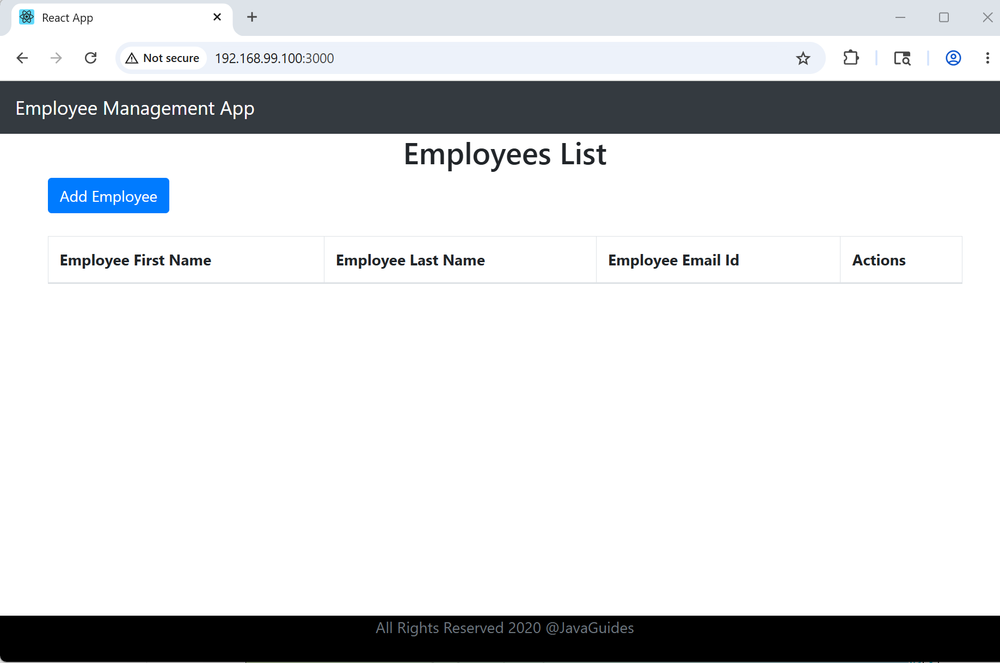

### Info

replica of  [ReactJS-Spring-Boot-CRUD-Full-Stack-App](https://github.com/RameshMF/ReactJS-Spring-Boot-CRUD-Full-Stack-App)

### Usage

```sh
sed -i 's|\r||g' docker-entrypoint.sh
IMAGE=nodejs-alpine
docker build -f Dockerfile -t $IMAGE . 
```
### Note

* cannot install modules:
```sh
NAME=nodejs-alpine
docker run --name $NAME -p 3000:3000 -it nodejs-alpine sh
```
```sh
NAME=nodejs-alpine
docker cp frontend $NAME:/tmp
```
```sh
cd /tmp/frontend
npm install react-scripts --save
```
> NOTE: this step will be quite time consuming:
```text
added 1643 packages, and audited 1644 packages in 5m

63 packages are looking for funding
  run `npm fund` for details
```
```sh
npm run build
```
this will fail:
```text
Error: error:0308010C:digital envelope routines::unsupported
    at new Hash (node:internal/crypto/hash:71:19)
    at Object.createHash (node:crypto:133:10)
    at module.exports (/tmp/frontend/node_modules/webpack/lib/util/createHash.js:135:53)
    at NormalModule._initBuildHash (/tmp/frontend/node_modules/webpack/lib/NormalModule.js:417:16)
    at /tmp/frontend/node_modules/webpack/lib/NormalModule.js:452:10
    at /tmp/frontend/node_modules/webpack/lib/NormalModule.js:323:13
    at /tmp/frontend/node_modules/loader-runner/lib/LoaderRunner.js:367:11
    at /tmp/frontend/node_modules/loader-runner/lib/LoaderRunner.js:233:18
    at context.callback (/tmp/frontend/node_modules/loader-runner/lib/LoaderRunner.js:111:13)
    at /tmp/frontend/node_modules/babel-loader/lib/index.js:59:103 {
  opensslErrorStack: [ 'error:03000086:digital envelope routines::initialization error' ],
  library: 'digital envelope routines',
  reason: 'unsupported',
  code: 'ERR_OSSL_EVP_UNSUPPORTED'

```
this is because `18` is too new 
```sh
NODE_OPTIONS=--openssl-legacy-provider npm run build
```

```text
> react-frontend@0.1.0 build
> react-scripts build

Creating an optimized production build...
Browserslist: caniuse-lite is outdated. Please run:
npx browserslist@latest --update-db
Compiled with warnings.

./src/App.js
  Line 2:8:  'logo' is defined but never used                     no-unused-vars
  Line 9:8:  'UpdateEmployeeComponent' is defined but never used  no-unused-vars

Search for the keywords to learn more about each warning.
To ignore, add // eslint-disable-next-line to the line before.

File sizes after gzip:

  52.63 KB  build/static/js/2.adf17f9f.chunk.js
  22.47 KB  build/static/css/2.af3c1da9.chunk.css
  2.1 KB    build/static/js/main.8cc14d25.chunk.js
  778 B     build/static/js/runtime-main.d43be887.js
  593 B     build/static/css/main.e2bc9fc6.chunk.css

The project was built assuming it is hosted at /.
You can control this with the homepage field in your package.json.

The build folder is ready to be deployed.
You may serve it with a static server:

  npm install -g serve
  serve -s build

Find out more about deployment here:

  bit.ly/CRA-deploy

/tmp/frontend #

```
```sh
NODE_OPTIONS=--openssl-legacy-provider npm start
```
```text
Starting the development server...

Browserslist: caniuse-lite is outdated. Please run:
npx browserslist@latest --update-db


```
```sh
docker exec -it $NAME sh
```
```sh
/program # netstat -ant
```
```text
Active Internet connections (servers and established)
Proto Recv-Q Send-Q Local Address           Foreign Address         State
tcp        0      0 0.0.0.0:3000            0.0.0.0:*               LISTEN


```
if run in Docker Toolbox,
```
docker-machine ssh
```
```text
   ( '>')
  /) TC (\   Core is distributed with ABSOLUTELY NO WARRANTY.
 (/-_--_-\)           www.tinycorelinux.net
```
```sh
netstat -atn | grep 3000 | grep LISTEN
```

```text
tcp        0      0 :::3000                 :::*                    LISTEN
```

Open in nthe browser `http://192.168.99.100:3000`



### See Also
  * [fullstack-spring-boot-and-react](https://github.com/amigoscode/spring-boot-react-fullstack)


