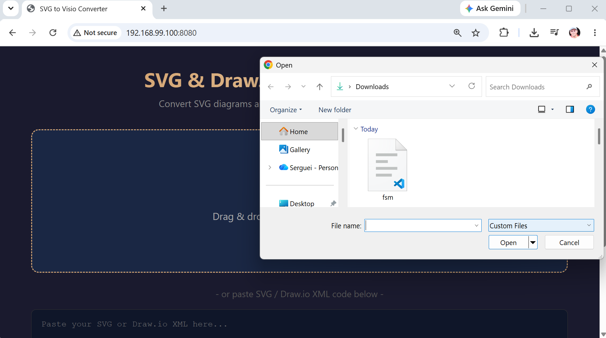
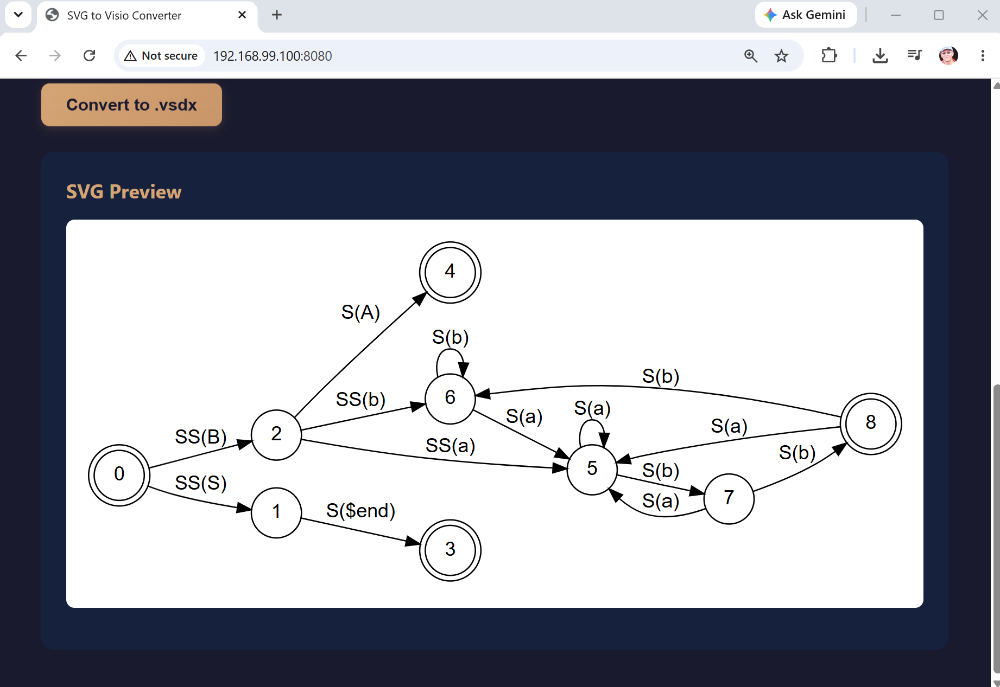
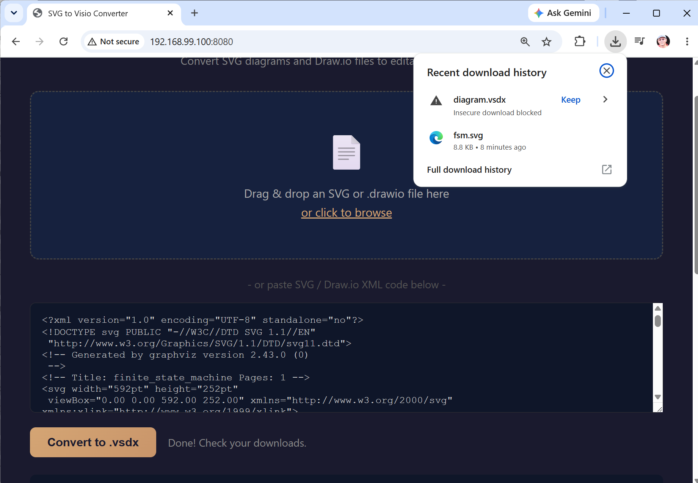
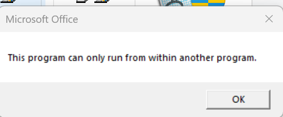
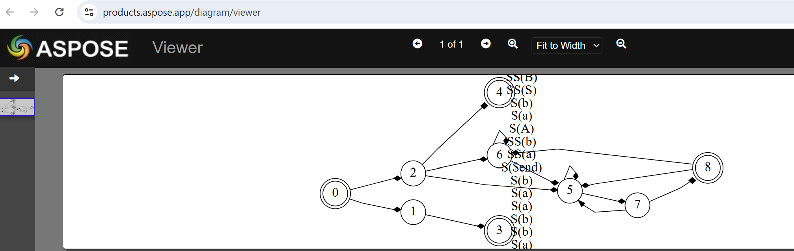

### Info

replica of [McMarius11/svgtovisio](https://github.com/McMarius11/svgtovisio) the standalone browser hosted __SVG__ & __Draw.io__ to __Visio__ Converter

### Usage

```sh
docker pull node:22.12.0-alpine
docker pull nginx:1.30.3-alpine3.23
```
```sh
IMAGE=svg2visio
docker build -t $IMAGE -f Dockerfile .
```
```text
docker build -t $IMAGE -f Dockerfile .
Sending build context to Docker daemon  409.6kB
Step 1/16 : FROM node:22.12.0-alpine AS builder
 ---> 3448d7ddbc59
Step 2/16 : WORKDIR /app
 ---> Using cache
 ---> 69abba8f2619
Step 3/16 : COPY package*.json /app/
 ---> Using cache
 ---> f7eb6028edb9
Step 4/16 : ARG NPM_REGISTRY
 ---> Using cache
 ---> 91f431337aa8
Step 5/16 : RUN if [ -n "$NPM_REGISTRY" ]; then npm config set registry "$NPM_REGISTRY"; fi
 ---> Using cache
 ---> 291bacf1504f
Step 6/16 : RUN npm install || { cat /root/.npm/_logs/*.log; exit 1; }
 ---> Using cache
 ---> 3496d37d4270
Step 7/16 : COPY app.js build.js index.html drawio-parser.js vsdx-builder.js test.js test-samples/ ./
 ---> 1e440d1cd4dc
Step 8/16 : RUN node build.js
 ---> Running in a6dfadd6477e
Inlined: jszip.min.js (95.3 KB)
Inlined: pako.min.js (45.8 KB)
WARNING: svg-parser.js not found
Inlined: drawio-parser.js (14.1 KB)
Inlined: vsdx-builder.js (27.6 KB)
Inlined: app.js (13.0 KB)

Built: dist/index.html (202.0 KB)
Removing intermediate container a6dfadd6477e
 ---> f63177fc1666
Step 9/16 : RUN node build.js
 ---> Running in 43a80e04b40c
Inlined: jszip.min.js (95.3 KB)
Inlined: pako.min.js (45.8 KB)
WARNING: svg-parser.js not found
Inlined: drawio-parser.js (14.1 KB)
Inlined: vsdx-builder.js (27.6 KB)
Inlined: app.js (13.0 KB)

Built: dist/index.html (202.0 KB)
Removing intermediate container 43a80e04b40c
 ---> 1ffb578f5d43
Step 10/16 : FROM nginx:1.30.3-alpine3.23
 ---> d0701bd41f82
Step 11/16 : WORKDIR /usr/share/nginx/html
 ---> Running in cbfb77b36510
Removing intermediate container cbfb77b36510
 ---> d1f04cc1055f
Step 12/16 : COPY --from=builder /app/dist/index.html ./
 ---> ca69ab2b7fc5
Step 13/16 : COPY --from=builder /app/*js ./
 ---> bfb9e9ce26a8
Step 14/16 : RUN  touch .nojekyll
 ---> Running in 90eecdd28338
Removing intermediate container 90eecdd28338
 ---> af39794ff2e6
Step 15/16 : EXPOSE 80
 ---> Running in 408fe8bdb10f
Removing intermediate container 408fe8bdb10f
 ---> a97d06fb0d75
Step 16/16 : CMD ["nginx", "-g", "daemon off;"]
 ---> Running in 31ef01cac884
Removing intermediate container 31ef01cac884
 ---> 8ad353555803
Successfully built 8ad353555803
Successfully tagged mermaid-svg2visio:latest
```
```sh    
NAME=$IMAGE
docker run --name $NAME -d -p 8080:80 $IMAGE
```



### Background

Convert [SVG](https://en.wikipedia.org/wiki/SVG) diagrams and [Draw.io](https://en.wikipedia.org/wiki/Diagrams.net) files to editable legacy [Visio](https://en.wikipedia.org/wiki/Microsoft_Visio) `.vsdx` files (a well documented [DatadiagramML](https://github.com/slebok/zoo/blob/master/zoo/markup/graphical/datadiagramml/xform/README.txt) XML schema honoring successor of the original Visio's `VSD` proprietary binary-file format that is still the default here and there).

### Note

May be useful for creating Visio resources *without* the __Visio__ itself

 * Download the __Graphviz__ binaries from [Graphviz](https://graphviz.org/download/)

```sh
curl -skLo ~/Downloads/graphviz-installer.exe https://gitlab.com/api/v4/projects/4207231/packages/generic/graphviz-releases/15.1.1/windows_10_cmake_Release_graphviz-install-15.1.1-win64.exe
```
and install it

* Pick any of gallery examples e.e. [Finite Automaton](https://graphviz.org/Gallery/directed/fsm.html) and convert it to SVG remotely or locally.
```sh
curl -skLo ~/Downloads/fsm.svg https://graphviz.org/Gallery/directed/fsm.svg
```
* convert to VISIO using the static page form:



The app simply downloads the result



Use MS [Free Visio Viewer](https://www.microsoft.com/en-us/microsoft-365/visio/free-visio-viewer) 
> CAUTION! Desktop app requires some kind of installation. Consider the risks!
> NOTE:  the default page contains *no* download link. The real download is available on [old page](https://www.microsoft.com/en-us/microsoft-365/blog/2012/11/28/download-the-free-microsoft-visio-viewer) [link](https://www.microsoft.com/en-us/download/details.aspx?id=35811)
```cmd
 curl -skLo ~/Downloads/visioviewer64bit.exe https://download.microsoft.com/download/a/6/8/a682a83b-4866-4f88-ae83-61388629a891/visioviewer64bit.exe

```
```text
PS C:\Program Files\Microsoft Office\Office15> get-item .\VPREVIEW.EXE | select-object -property *


PSPath            : Microsoft.PowerShell.Core\FileSystem::C:\Program
                    Files\Microsoft Office\Office15\VPREVIEW.EXE
PSParentPath      : Microsoft.PowerShell.Core\FileSystem::C:\Program
                    Files\Microsoft Office\Office15
PSChildName       : VPREVIEW.EXE
PSDrive           : C
PSProvider        : Microsoft.PowerShell.Core\FileSystem
PSIsContainer     : False
Mode              : -a----
VersionInfo       : File:             C:\Program Files\Microsoft
                    Office\Office15\VPREVIEW.EXE
                    InternalName:     VPREVIEW.EXE
                    OriginalFilename: VPREVIEW.EXE
                    FileVersion:      15.0.4420.1017
                    FileDescription:  Microsoft Office Visio Previewer
                    Product:          Microsoft Office 2013
                    ProductVersion:   15.0.4420.1017
                    Debug:            False
```

turns out the `VPREVIEW.EXE` isn't really a conventional standalone viewer application. It's essentially the executable/component that Office uses to provide Visio preview functionality, and it expects to be invoked through its Office integration/host mechanism.





> NOTE: aprose is server side

### Cleanup

```sh
IMAGE=svg2visio
NAME=$IMAGE
docker stop $NAME
docker container prune -f
docker image prune -f
docker image rm $IMAGE node:22.12.0-alpine nginx:1.30.3-alpine3.23
```
### NOTE

**QA in the era of agentic development**

As agentic coding makes implementation increasingly cheap, QA value shifts from code-level verification toward **product-level semantic understanding**: architecture awareness, knowledge of the product’s failure history, recognition of business-critical behavior, and the ability to identify risks that are not explicit in the current specification.

This makes QA not less relevant, but potentially **more strategic**: the QA function becomes a source of accumulated product knowledge and an adversarial semantic layer around increasingly autonomous software development.


Agentic development makes implementation increasingly cheap, shifting the value of QA toward the semantic layer: understanding product architecture, reconstructing intent behind requirements and failures, and recognizing risks from accumulated product history.

QA therefore becomes both **an independent adversarial layer and a keeper of product wisdom**—preserving what is learned by digging from a visible symptom through its apparent cause to the actual RCA, and applying that knowledge to future changes.

In this sense, QA plays for software failures a role somewhat analogous to semantic transcription for speech: **not merely recording what happened, but reconstructing what was actually meant or caused.**


Transcribe reconstructs intent behind imperfect speech; QA reconstructs causality behind imperfect software behavior.

A test failure is often just the surface manifestation. The real QA value begins when someone refuses to stop at:

Test failed.”

and keeps asking:

  * Why?
  * Why really?
  * Why did the system allow this?
  * Why didn't we see it earlier?
  * What does this tell us about the product?

That last answer is the thing worth __keeping__.

### See Also


  * [live](https://McMarius11.github.io/svgtovisio)
  * [related reddit discussion](https://www.reddit.com/r/drawio/comments/1r9j05c/free_tool_to_convert_between_visio_and_drawio/)
  * __Google Transcribe__  latest speech-to-text model designed for precise and intelligent real-time transcription.
    + [release new feature info](https://habr.com/ru/news/1075046/) (in Russian)
 - the model able to understand not only the words, but also what the person meant to convey
 + [original](https://blog.google/innovation-and-ai/models-and-research/gemini-models/gemini-3-5-transcribe/)

---  

### Author
[Serguei Kouzmine](kouzmine_serguei@yahoo.com)
