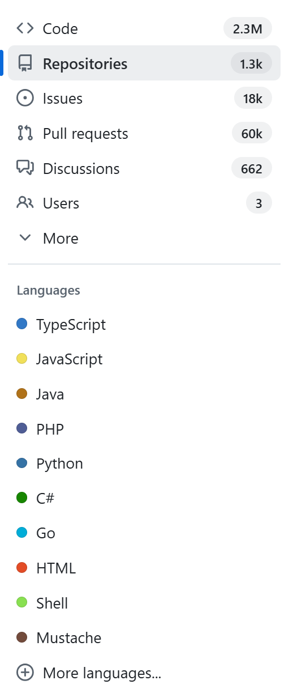

### Info

The [API-first] lifecycle is where the API is defined first, packaged as a versioned JAR, and then consumed by server and client projects without any checked-in POJOs.




### Usage

```sh
mvn -ntp dependency:go-offline
```
```sh
mvn generate-sources
```
this gives
```sh
tree src
```
```txt
└───main
    └───resources

```
```sh
tree target\generated-sources
```
```txt
├───annotations
└───src
    └───main
        └───java
            └───com
                └───example
                    └───demo
                        ├───api
                        └───models

```
continue
```sh
mvn clean package
```
```sh
mvn spring-boot:run
```
```sh
curl -s http://localhost:8080/books | jq '.'
```
```json
[
  {
    "name": "Harry Potter",
    "author": "J.K. Rowling"
  },
  {
    "name": "Lord of the Rings",
    "author": "J.R.R. Tolkien"
  }
]

```

### Troubleshooting
```sh
"c:\Program Files\7-Zip\7z.exe" l target\project-api-0.0.1-SNAPSHOT.jar
```
```text
7-Zip 21.07 (x64) : Copyright (c) 1999-2021 Igor Pavlov : 2021-12-26

Scanning the drive for archives:
1 file, 5572 bytes (6 KiB)

Listing archive: target\project-api-0.0.1-SNAPSHOT.jar

--
Path = target\project-api-0.0.1-SNAPSHOT.jar
Type = zip
Physical Size = 5572

   Date      Time    Attr         Size   Compressed  Name
------------------- ----- ------------ ------------  ------------------------
2026-01-01 14:22:06 .....          156          127  META-INF\MANIFEST.MF
2026-01-01 14:22:06 D....            0            0  META-INF
2026-01-01 14:21:54 D....            0            0  com
2026-01-01 14:21:54 D....            0            0  com\example
2026-01-01 14:21:54 D....            0            0  com\example\demo
2026-01-01 14:22:06 D....            0            0  com\example\demo\api
2026-01-01 14:22:06 D....            0            0  com\example\demo\models
2026-01-01 14:22:06 D....            0            0  META-INF\maven
2026-01-01 14:22:06 D....            0            0  META-INF\maven\com.example
2026-01-01 14:22:06 D....            0            0  META-INF\maven\com.example\project-api
2026-01-01 14:22:06 .....         1737          830  com\example\demo\api\BooksApi.class
2026-01-01 14:22:06 .....         2742         1321  com\example\demo\models\Book.class
2026-01-01 14:21:52 .....         1445          520  library-api.yaml
2026-01-01 14:17:34 .....         2392          798  META-INF\maven\com.example\project-api\pom.xml
2026-01-01 14:22:06 .....           69           70  META-INF\maven\com.example\project-api\pom.properties
------------------- ----- ------------ ------------  ------------------------
2026-01-01 14:22:06               8541         3666  6 files, 9 folders

```

```text
[ERROR] Failed to execute goal on project project-service: Could not resolve dependencies for project com.example:project-service:jar:0.0.1-SNAPSHOT: Failed to collect dependencies at com.example:project-api:jar:0.0.1-SNAPSHOT: Failed to read artifact descriptor for com.example:project-api:jar:0.0.1-SNAPSHOT: Could not find artifact com.example:OpenAPI-example:pom:0.0.1-SNAPSHOT in local (file://C:\Users\kouzm/.m2/repository) -> [Help 1]
```
org.apache.maven.lifecycle.LifecycleExecutionException: Failed to execute goal on project project-service:
Could not resolve dependencies for project com.example:project-service:jar:0.0.1-SNAPSHOT:
Failed to collect dependencies at com.example:project-api:jar:0.0.1-SNAPSHOT
    at org.apache.maven.lifecycle.internal.LifecycleDependencyResolver.getDependencies (LifecycleDependencyResolver.java:269)
    ...
    at org.codehaus.plexus.classworlds.launcher.Launcher.main (Launcher.java:347)
Caused by: org.apache.maven.project.DependencyResolutionException:
Could not resolve dependencies for project com.example:project-service:jar:0.0.1-SNAPSHOT:
Failed to collect dependencies at com.example:project-api:jar:0.0.1-SNAPSHOT
    at org.apache.maven.project.DefaultProjectDependenciesResolver.resolve (DefaultProjectDependenciesResolver.java:178)
    ...
    at org.codehaus.plexus.classworlds.launcher.Launcher.main (Launcher.java:347)
Caused by: org.eclipse.aether.collection.DependencyCollectionException:
Failed to collect dependencies at com.example:project-api:jar:0.0.1-SNAPSHOT
    at org.eclipse.aether.internal.impl.collect.DefaultDependencyCollector.collectDependencies (DefaultDependencyCollector.java:284)
    ...
    at org.codehaus.plexus.classworlds.launcher.Launcher.main (Launcher.java:347)
Caused by: org.eclipse.aether.resolution.ArtifactDescriptorException:
Failed to read artifact descriptor for com.example:project-api:jar:0.0.1-SNAPSHOT
    at org.apache.maven.repository.internal.DefaultArtifactDescriptorReader.loadPom (DefaultArtifactDescriptorReader.java:302)
    ...
    at org.codehaus.plexus.classworlds.launcher.Launcher.main (Launcher.java:347)
Caused by: org.apache.maven.model.resolution.UnresolvableModelException:
Failure to find com.example:OpenAPI-example:pom:0.0.1-SNAPSHOT in file://C:\Users\kouzm/.m2/repository was cached in the local repository,
resolution will not be reattempted until the update interval of local has elapsed or updates are forced
    at org.apache.maven.repository.internal.DefaultModelResolver.resolveModel (DefaultModelResolver.java:176)
    ...
    at org.codehaus.plexus.classworlds.launcher.Launcher.main (Launcher.java:347)
Caused by: org.eclipse.aether.resolution.ArtifactResolutionException:
Failure to find com.example:OpenAPI-example:pom:0.0.1-SNAPSHOT in file://C:\Users\kouzm/.m2/repository was cached in the local repository, resolution will not be reattempted until the update interval of local has elapsed or updates are forced
    at org.eclipse.aether.internal.impl.DefaultArtifactResolver.resolve (DefaultArtifactResolver.java:423)
    ...
    at org.codehaus.plexus.classworlds.launcher.Launcher.main (Launcher.java:347)
Caused by: org.eclipse.aether.transfer.ArtifactNotFoundException:
Failure to find com.example:OpenAPI-example:pom:0.0.1-SNAPSHOT in file://C:\Users\kouzm/.m2/repository
was cached in the local repository, resolution will not be reattempted until the update interval of local has elapsed or updates are forced
    at org.eclipse.aether.internal.impl.DefaultUpdateCheckManager.newException (DefaultUpdateCheckManager.java:219)
    ...
    at org.codehaus.plexus.classworlds.launcher.Launcher.main (Launcher.java:347)
[ERROR]
[ERROR] Re-run Maven using the -X switch to enable full debug logging.
[ERROR]

```

```
 Directory of c:\Users\kouzm\.m2\repository\com\example\OpenAPI-example\0.0.1-SNAPSHOT

01/01/2026  02:56 PM    <DIR>          .
01/01/2026  02:48 PM    <DIR>          ..
01/01/2026  02:56 PM               998 OpenAPI-example-0.0.1-SNAPSHOT.pom.lastUpdated
01/01/2026  02:56 PM               710 resolver-status.properties
```

solved by running 
```sh
mvn install
```

in the parent project

```text
 Directory of c:\Users\kouzm\.m2\repository\com\example\OpenAPI-example\0.0.1-SNAPSHOT

01/01/2026  03:11 PM    <DIR>          .
01/01/2026  03:11 PM    <DIR>          ..
01/01/2026  03:14 PM               548 maven-metadata-local.xml
01/01/2026  02:56 PM             2,865 OpenAPI-example-0.0.1-SNAPSHOT.pom
01/01/2026  02:56 PM               998 OpenAPI-example-0.0.1-SNAPSHOT.pom.lastUpdated
01/01/2026  02:56 PM               710 resolver-status.properties
01/01/2026  03:14 PM               180 _remote.repositories


```

```
mvn -X compile | findstr -i LombokProcessor
```

expect to see

```txt
Running lombok.javac.apt.LombokProcessor
```

but one of the annotations prevents this

```sh
mvn dependency:tree | findstr slf4j-api
```

```text
[INFO] +- org.slf4j:slf4j-api:jar:1.7.30:compile
```


* install parent project pom artifact
```sh
mvn install
```
```sh
ls -l ~/.m2/repository/com/example/swagger-generator/0.3.0-SNAPSHOT/
```
```text
total 12
-rw-rw-r-- 1 sergueik sergueik  550 Jan  1 23:20 maven-metadata-local.xml
-rw-rw-r-- 1 sergueik sergueik  179 Jan  1 23:20 _remote.repositories
-rw-rw-r-- 1 sergueik sergueik 2778 Jan  1 23:19 swagger-generator-0.3.0-SNAPSHOT.pom

```
```sh
pushd project-api
mvn generate-sources
mvn install   
popd
```
```sh
pushd project-service
mvn compile
mvn package
mvn spring-boot:run
popd
```

```text
2026-01-01 23:27:14.026  INFO 4052 --- [           main] o.s.b.w.embedded.tomcat.TomcatWebServer  : Tomcat started on port(s): 8080 (http) with context path ''
2026-01-01 23:27:14.035  INFO 4052 --- [           main] com.example.demo.Application             : Started Application in 1.885 seconds (JVM running for 2.219)
```

On Windows 11 see the following error, with Java 1.8, 11.
```sh
mvn compile
```
```
[ERROR] /C:/developer/sergueik/springboot_study/basic-swagger-generator/project-service/src/main/java/com/example/demo/controllers/BookController.java:[20,9] cannot find symbol
[ERROR]   symbol:   variable log
[ERROR]   location: class com.example.demo.controllers.BookController
```

### See Also

   * https://swagger.io/resources/articles/adopting-an-api-first-approach/

---

### Author
[Serguei Kouzmine](kouzmine_serguei@yahoo.com)
