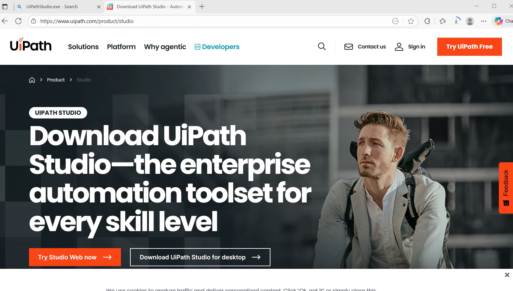
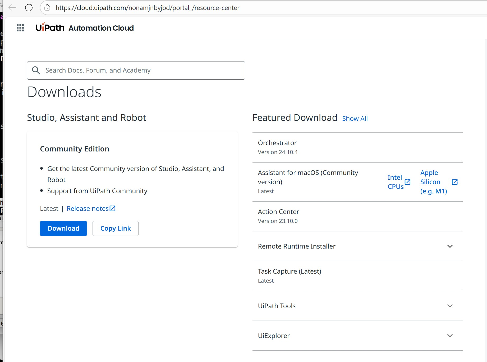
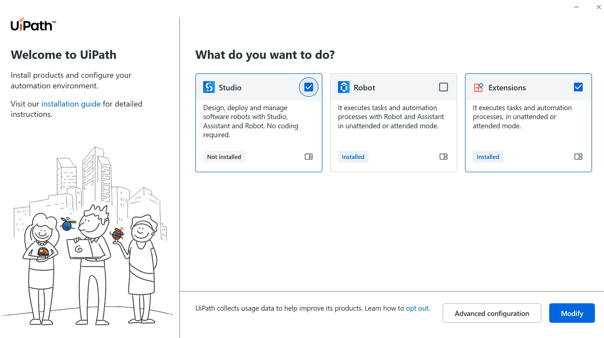
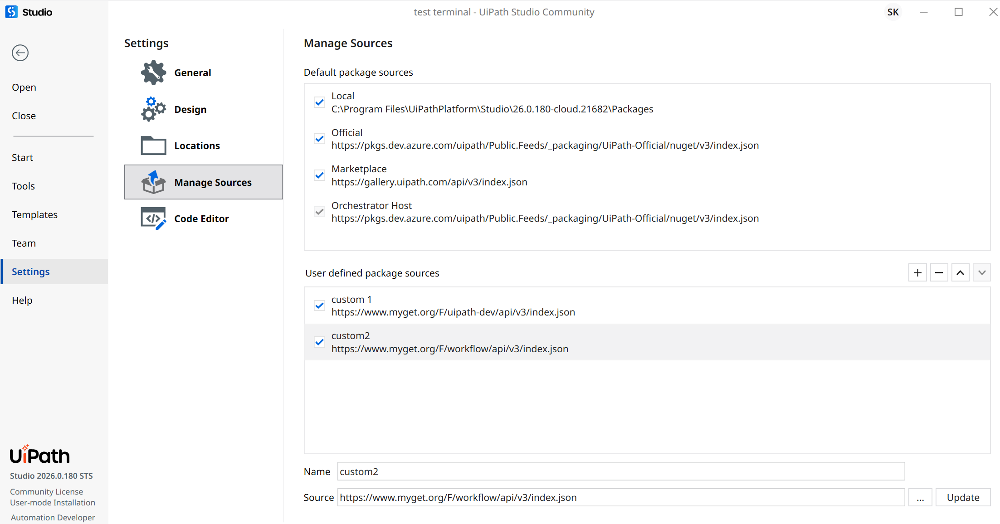
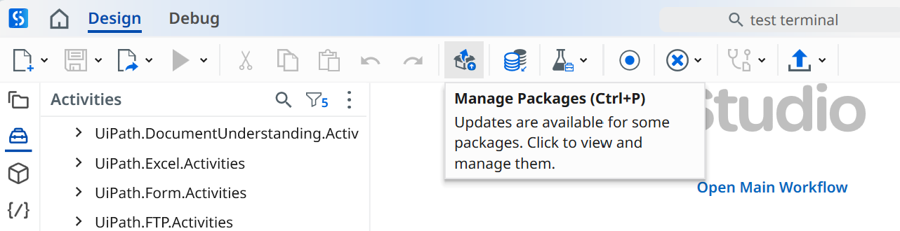
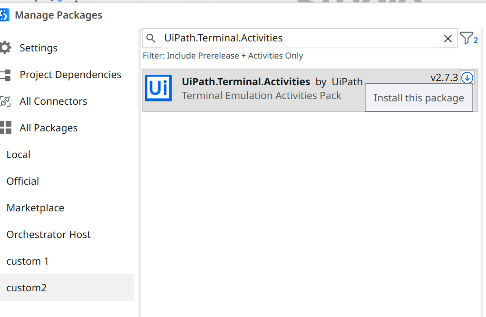
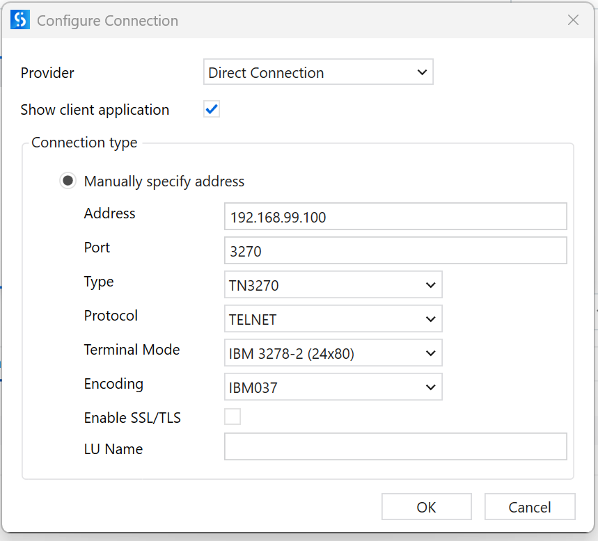

### UiPath

Note the __Download UPiPath for Desktop__ link is actually pointing the location `https://download.uipath.com/UiPathStudioCloud.msi`. File name `UiPathStudioCloud.msi` is confusing. 



In addition the installer refuses to continue when the __UiPath Connected Platform Installation__ product is present on the machine.  
Another freely available installer `UiPathPlatform.msi` representing the latter does not appear to really contain or install the __UiPath Studio__ . It advertises it but not really




One can download adequate installer from the obscure link "install locally"
which is the page `https://cloud.uipath.com/nonamjnbyjbd/portal_/resource-center`



it turns out one can select exactly one but not bot from 
  * Studio
  * Robot
  

- one can run installer multiple times. Note:  it is  web installer, not a standalone

you will need to explicitly  install the `UiPath.Terminal.Activities` nuget package from within __UiPath Studio__

There isn’t a well-supported “thin‑install” or truly portable Thinstall‑style version of UiPath Studio / Robot for Community Edition.OUiPath does use Windows registry keys, and their installation is not fully "portable" in the traditional sense.


The is a `HKEY_LOCAL_MACHINE\SOFTWARE\UiPath`, `HKEY_CURRENT_USER\SOFTWARE\UiPath` keys and  files in `%PROGRAMDATA%\UiPath`, `%LOCALAPPDATA%\UiPath` application directories
### Tweaks

Studio install can tehcnically be in a profile mode that hides developer features. However try this first
* __Settings__ __Manage Sources__ : Add  user managed source 



url:`https://www.myget.org/F/workflow/api/v3/index.json`
* __New Project__ __Process__ __Manage Packages__  





* in the search enter `terminal` 


* drag an drop __Terminal Session__ into __Main Sequence__ 
* configure connection



 **Add Terminal Session**

   - Drag **Terminal Session** into the workflow (Main Sequence / Do container).  
   - Configure connection:
     - Protocol: `TELNET`  
     - Host: `192.168.99.100`  
     - Port: `3270`  
     - Encoding: `IBM-037` (or appropriate IBM EBCDIC code page)  

4. **Add Terminal Steps (Do container)**

   - **Set Field** for username:
     - Text: `"MYUSERNAME"` (literal string)  
     - FollowedBy: `Enter`  
   - **Set Field** for password:
     - Text: `"MYPASSWORD"` (literal string)  
     - FollowedBy: `Enter`  
   - **Wait Field Text** (optional):
     - Text: `"MAIN MENU"`  
     - FollowedBy: `None`  
   - **Get Field** (optional): capture a value from screen into a variable  
   - **Send Control Key**: e.g., `F2` to exit session

5. **Save Workflow**

   - Press **Ctrl+S** to save all changes.

6. **Run Workflow** 

F5

### Sut

One can emulate a mainframe terminal using open-source software like:

  * TN3270 emulator: emulates IBM 3270 terminals (green-screen)
  * z/OS or Hercules emulator: Hercules can emulate a full mainframe CPU and OS, but for beginners, it’s overkill.

There are no direct TN3270 emulator applications available as standalone images on Docker Hub, as emulators like x3270 are typically desktop applications.

Users typically run a mainframe system emulator in a Docker container, and then connect to it using a standard TN3270   emulator installed on their local machine.
```cmd
msiexec.exe /uninstall UiPathStudio.msi KEEP_USER_DATA=1
```


* pull the [tk4-helcules](https://hub.docker.com/r/skunklabz/tk4-hercules) image

```sh
docker image pull skunklabz/tk4-hercules:latest
```

```sh
 docker images skunklabz/tk4-hercules
```
```txt
REPOSITORY               TAG                 IMAGE ID            CREATED             SIZE
skunklabz/tk4-hercules   latest              9e5995edb029        5 years ago         310MB
```

* pin the image if possible

```sh
ID=$(docker image ls | grep tk4-hercules | awk '{print $3 }')
echo $ID
```
```txt
9e5995edb029
```

```sh
docker image inspect --format='{{index .RepoDigests 0}}' $ID
```
```txt
skunklabz/tk4-hercules@sha256:bac92c3d232423a101c90f272dcc0be565b98f4b6ef7b61a1dcb5adceeb5e8aa
```

```sh
docker image inspect --format '{{.RepoTags}}' $ID
```


### Test

```sh
ID=$(docker ps --filter 'ancestor=skunklabz/tk4-hercules' --format '{{.ID}}')
``
``sh
docker rm -f $ID

```
```sh
docker run -d -p 23:23 -p 8038:8038 -p3270:3270 --name tn3270 skunklabz/tk4-hercules
```
### Remark

#### About UiPath Workflows (XAML)

__UiPath__ workflows are stored as **XAML files**, which are essentially **Windows Workflow Foundation (WF) declarative XML** under the hood.  

A few observations from a 25-year WF retrospective:

- **Pros:**
  - Fully declarative and machine-readable  
  - Supports complex sequences, variables, arguments, and custom activities  
  - Enables drag-and-drop tooling in UiPath Studio  

- **Cons / quirks:**
  - Extremely verbose — in a typical `Main.xaml`, **90–99% of the file is boilerplate, tags, and metadata**, not actual logic  
  - Red borders or “invalid” flags can appear if a Terminal field or activity isn’t resolved correctly  
  - Hard to visually parse at a glance; diffs in source control are noisy  

- **Octane meter remark:**  
  XAML is **very low-octane fuel** — most of its “weight” is decoration characters, not executable logic. But this overhead is what allows Studio and UiPath Robot to **serialize, deserialize, and run workflows reliably**, even across machines and versions.  

> In short: WF may be a quarter-century old, but with UiPath it finds a practical second life — especially for terminal automation, TN3270 emulation, and green-screen workflows.

### Note

Yes, there are CICS emulators, including cicsterm and cicsprnt provided with IBM's CICS Transaction Gateway, and commercial options like the Raincode QIX CICS emulator for modern platforms like .NET and Azure.

Rocket Software (formerly Micro Focus) Enterprise Server: A leading solution in the field that provides a comprehensive environment for compiling and running mainframe COBOL and CICS applications on distributed systems.
Raincode CICS emulator (Raincode QIX): An emulator specifically designed for the Microsoft .NET and Azure platforms, enabling CICS applications to run in a scalable cloud environment and integrate with C# or VB.NET code.
IBM z Development and Test Environment (zD&T): A proper, licensed emulator of the entire IBM z/OS mainframe architecture, used for development and testing purposes. A free trial version is sometimes available via the IBM Z trial program.### See Also

Hercules: An open-source, community-driven mainframe emulator that can run older MVS systems (like the TK4- distribution), allowing enthusiasts to learn and explore the mainframe environment for free

The choice of "most popular" often depends on the user's specific goals:
For enterprise development and migration, commercial products like Rocket Enterprise Server and Raincode QIX are dominant.
For accessing a running mainframe, IBM PCOMM is a common terminal emulator.
For learning or personal exploration, the open-source Hercules emulator is a popular free option


 * [automating Terminals and Mainframes](https://www.uipath.com/kb-articles/automating-terminals-and-mainframes)
 * [guide To Seamless Mainframe Automation](https://www.uipath.com/blog/automation/guide-to-seamless-mainframe-automation)

