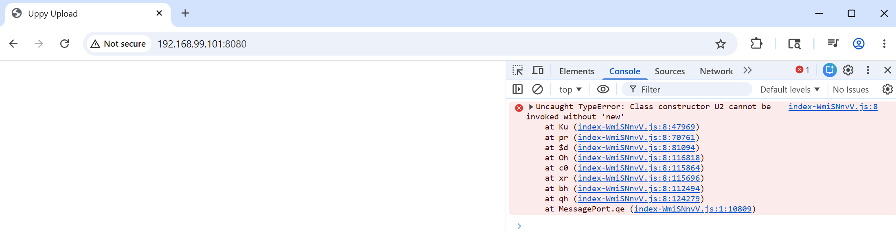

### Info
https://github.com/judsonc/react-upload-uppy
https://uppy.io/
https://github.com/transloadit/uppy with over 10K commits
### Usage


```
  docker build -t example -f Dockerfile  .
```
```text
Sending build context to Docker daemon  20.72MB
Step 1/14 : FROM node:22.18.0-alpine AS react_builder
 ---> 8a3ae2e7d0c5
Step 2/14 : WORKDIR /app
 ---> Using cache
 ---> adabb6bdda8e
Step 3/14 : COPY frontend /app/
 ---> d7150baf1e9b
Step 4/14 : RUN cd /app   && rm -rf node_modules package-lock.json   && npm install     @uppy/core@5.2.0     @uppy/dashboard@5.1.1     @uppy/xhr-upload@5.2.0     @uppy/react@5.1.1
 ---> Running in f015b46bbd16

added 95 packages, and audited 96 packages in 47s

16 packages are looking for funding
  run `npm fund` for details

found 0 vulnerabilities
npm notice
npm notice New major version of npm available! 10.9.3 -> 11.15.0
npm notice Changelog: https://github.com/npm/cli/releases/tag/v11.15.0
npm notice To update run: npm install -g npm@11.15.0
npm notice
Removing intermediate container f015b46bbd16
 ---> b1d0baa5640a
Step 5/14 : RUN npm run build
 ---> Running in ccdb5c8885ad

> uppy-react-upload@1.0.0 build
> vite build

vite v7.3.3 building client environment for production...
transforming...
✓ 212 modules transformed.
rendering chunks...
computing gzip size...
dist/index.html                   0.31 kB │ gzip:   0.22 kB
dist/assets/index-D9e3sqm0.css   65.60 kB │ gzip:  10.45 kB
dist/assets/index-WmiSNnvV.js   377.90 kB │ gzip: 118.39 kB
✓ built in 9.39s
Removing intermediate container ccdb5c8885ad
 ---> 3262381c6300
Step 6/14 : FROM maven:3.9.5-eclipse-temurin-11-alpine as builder
 ---> 37ef041f8432
Step 7/14 : WORKDIR /app
 ---> Running in 12f364c6e2ab
Removing intermediate container 12f364c6e2ab
 ---> cb7dd4b470ab
Step 8/14 : COPY backend /app/
 ---> 43bfd8bc7824
Step 9/14 : COPY --from=react_builder /app/dist /app/src/main/resources/static/
 ---> ab9f4b0ae722
Step 10/14 : RUN cd /app && mvn package -DskipTests

```



### Background


React is very complex. Over the years.

creating the frontend from scratch with Vite React template is what is recmmended instead of manually assembling:

`package.json`
`Babel`
`webpack`
`React` bootstrap files
`ESLint`
`build config`


However this seems seriously feels backwards if you come from:

Java
Maven
C/C++
PowerShell
traditional build systems

where source layout is explicit and inspectable

