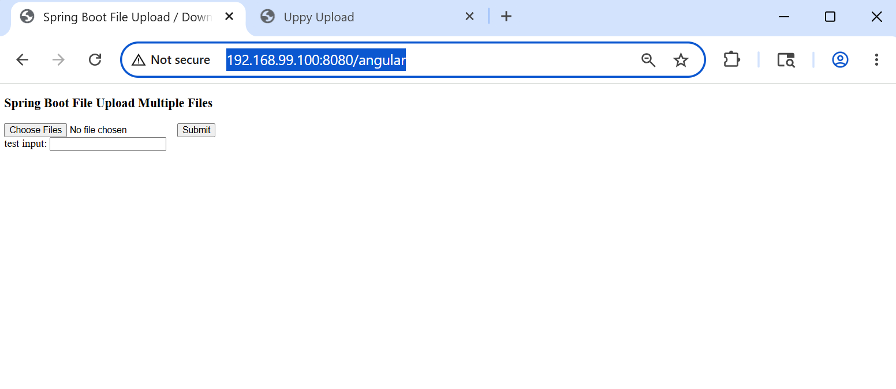
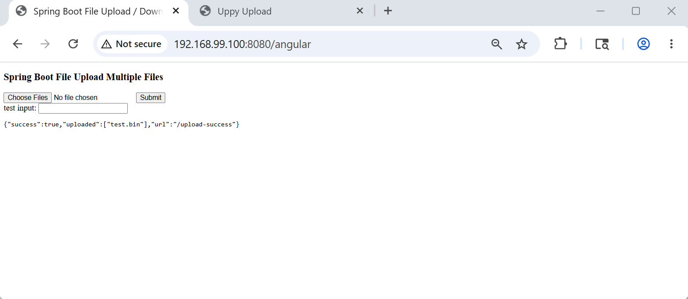
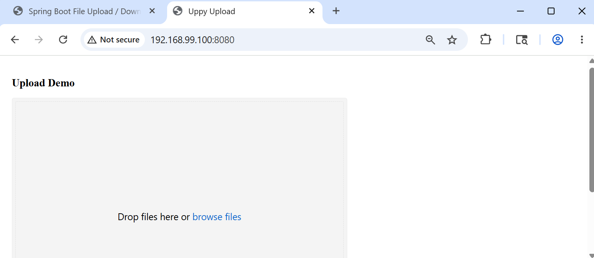
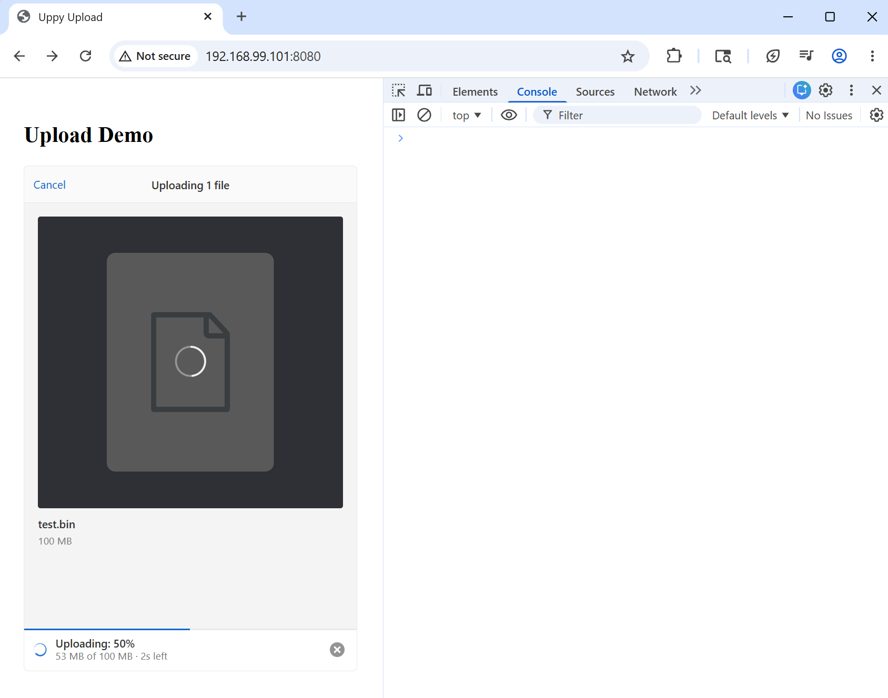
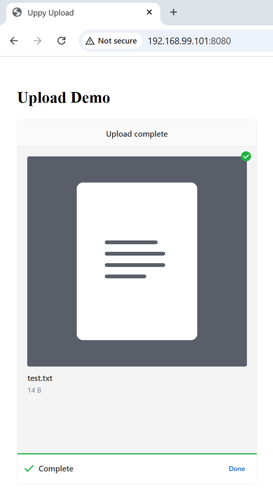

### Info
https://github.com/judsonc/react-upload-uppy
https://uppy.io/
https://github.com/transloadit/uppy with over 10K commits

### Usage


```sh
docker pull node:22.18.0-alpine
docker pull maven:3.9.5-eclipse-temurin-11-alpine
docker pull eclipse-temurin:11-jre-alpine
```

```sh
IMAGE=uppy-react
docker build -t $IMAGE -f Dockerfile .
```
the `Dockerfile` compiles `react` frontend and puts it into Spring as static resource then packages the jar:


```text
Step 1/15 : FROM node:22.18.0-alpine AS react_builder
 ---> 8a3ae2e7d0c5
Step 2/15 : WORKDIR /app
 ---> Running in c220d46b825d
Removing intermediate container c220d46b825d
 ---> e93a4c73beb2
Step 3/15 : COPY frontend /app/
 ---> 1b3ccda6b500
Step 4/15 : RUN cd /app   && rm -rf node_modules package-lock.json   && npm install     @uppy/core@5.2.0     @uppy/dashboard@5.1.1     @uppy/xhr-upload@5.2.0     @uppy/react@5.1.1
 ---> Running in 1bb8ac5018e6

added 95 packages, and audited 96 packages in 44s

16 packages are looking for funding
  run `npm fund` for details

found 0 vulnerabilities
npm notice
npm notice New major version of npm available! 10.9.3 -> 11.15.0
npm notice Changelog: https://github.com/npm/cli/releases/tag/v11.15.0
npm notice To update run: npm install -g npm@11.15.0
npm notice
Removing intermediate container 1bb8ac5018e6
 ---> baa8e4643a12
Step 5/15 : RUN npm run build
 ---> Running in ffcff40738c9

> uppy-react-upload@1.0.0 build
> vite build

vite v7.3.3 building client environment for production...
transforming...
✓ 212 modules transformed.
rendering chunks...
computing gzip size...
dist/index.html                   0.31 kB │ gzip:   0.22 kB
dist/assets/index-D9e3sqm0.css   65.60 kB │ gzip:  10.45 kB
dist/assets/index-BpCiVfFe.js   377.96 kB │ gzip: 118.41 kB
✓ built in 8.21s
Removing intermediate container ffcff40738c9
 ---> 812ae8962c65
Step 6/15 : FROM maven:3.9.5-eclipse-temurin-11-alpine as builder
 ---> 37ef041f8432
Step 7/15 : WORKDIR /app
 ---> Using cache
 ---> cb7dd4b470ab
Step 8/15 : COPY backend /app/
 ---> bfe19ff22fe1
Step 9/15 : COPY --from=react_builder /app/dist /app/src/main/resources/static/
 ---> d101b966ccef
Step 10/15 : RUN cd /app && mvn dependency:go-offline -q
 ---> Running in 436b669e40f5
Removing intermediate container 436b669e40f5
 ---> 0fec68d3a68a
Step 11/15 : RUN cd /app && mvn package -DskipTests -q
 ---> Running in bf520793b4a5
Removing intermediate container bf520793b4a5
 ---> 3dd394c259e7
Step 12/15 : FROM eclipse-temurin:11-jre-alpine as run
 ---> 642de1708b20
Step 13/15 : COPY --from=builder /app/target/example.uppy-react-multipart-upload-backend.jar /app/app.jar
Step 14/17 : RUN apk update     && apk add --update --no-cache curl     && rm -rf /var/cache/*     && m                                     kdir /var/cache/apk
 ---> Running in c0367ea9ce57
v3.23.4-268-gdcc713e014f [https://dl-cdn.alpinelinux.org/alpine/v3.23/main]
v3.23.4-271-g3e9e0da6943 [https://dl-cdn.alpinelinux.org/alpine/v3.23/community]
OK: 27581 distinct packages available
(1/5) Installing c-ares (1.34.6-r0)
(2/5) Installing nghttp2-libs (1.69.0-r0)
(3/5) Installing libpsl (0.21.5-r3)
(4/5) Installing libcurl (8.19.0-r0)
(5/5) Installing curl (8.19.0-r0)
Executing busybox-1.37.0-r30.trigger
OK: 41.8 MiB in 78 packages
Removing intermediate container c0367ea9ce57 
 ---> 77267e2fec25
Step 15/15 : ENTRYPOINT ["java", "-jar", "/app/app.jar"]
 ---> Running in 6791750bfdd7
Removing intermediate container 6791750bfdd7
 ---> f0605d87417e
Step 16/17 : HEALTHCHECK --interval=30s --timeout=5s --start-period=10s CMD curl -f http://localhost:80                                     80/upload || exit 1
 ---> Running in 6b05c52541ef
Removing intermediate container 6b05c52541ef
Step 17/15 : EXPOSE 8080
 ---> Running in c80e26adccc4
Removing intermediate container c80e26adccc4
 ---> 8e645532396e
Successfully built 8e645532396e
Successfully tagged example:latest
```

```sh
IMAGE=uppy-react
CONTAINER=example
docker create --name $CONTAINER $IMAGE
docker export $CONTAINER |tar tv | grep /app/app.jar
```
```text
-rw-r--r-- 0/0        18133112 2026-05-25 11:14 app/app.jar
```
```sh
docker export $CONTAINER |tar xv app/app.jar
docker container rm -f $CONTAINER
```
```sh
unzip -ql app/app.jar |grep -E '(static|templates)'
```

```text
        0  2026-06-05 17:34   BOOT-INF/classes/static/
        0  2026-06-05 17:34   BOOT-INF/classes/static/assets/
      311  2026-06-05 17:34   BOOT-INF/classes/static/index.html
    65603  2026-06-05 17:34   BOOT-INF/classes/static/assets/index-D9e3sqm0.css
   378022  2026-06-05 17:34   BOOT-INF/classes/static/assets/index-CY9HpG0p.js
```
In earlier versions it has both AngularJS (bare-bones non-styled, without drop zone) and [ReactJS](https://legacy.reactjs.org/) A JavaScript library for building user interfaces) driven upload pages with [uppy](https://uppy.io/) 
```text
        0  2026-05-25 15:33   BOOT-INF/classes/templates/
        0  2026-05-25 15:33   BOOT-INF/classes/static/
        0  2026-05-25 15:33   BOOT-INF/classes/static/js/
        0  2026-05-25 15:33   BOOT-INF/classes/static/css/
        0  2026-05-25 15:33   BOOT-INF/classes/static/assets/
     1240  2026-05-25 15:33   BOOT-INF/classes/templates/upload.html
     3151  2026-05-25 15:33   BOOT-INF/classes/static/js/main.js
      311  2026-05-25 15:33   BOOT-INF/classes/static/index.html
       56  2026-05-25 15:33   BOOT-INF/classes/static/css/style.css
   378022  2026-05-25 15:33   BOOT-INF/classes/static/assets/index-C6DRwziu.js
    65603  2026-05-25 15:33   BOOT-INF/classes/static/assets/index-D9e3sqm0.css
```

run both frontend and backend on port `8080`:
```sh
IMAGE=uppy-react
CONTAINER=example
docker container rm $CONTAINER
docker run -d -p 8080:8080 --name $CONTAINER $IMAGE
```
```sh
docker ps
```
```txt
CONTAINER ID        IMAGE               COMMAND                  CREATED             STATUS                                                                  PORTS                    NAMES
9fac7e1b533d        example             "java -jar /app/app.…"   27 seconds ago      Up 26 seconds (health: starting)   0.0.0.0:8080->8080/tcp   example
```
```txt
CONTAINER ID        IMAGE               COMMAND                  CREATED              STATUS                        PORTS                    NAMES
9fac7e1b533d        example             "java -jar /app/app.…"   About a minute ago   Up About a minute (healthy)   0.0.0.0:8080->8080/tcp   example
```
```sh
docker logs -f $CONTAINER
```
```text

  .   ____          _            __ _ _
 /\\ / ___'_ __ _ _(_)_ __  __ _ \ \ \ \
( ( )\___ | '_ | '_| | '_ \/ _` | \ \ \ \
 \\/  ___)| |_)| | | | | || (_| |  ) ) ) )
  '  |____| .__|_| |_|_| |_\__, | / / / /
 =========|_|==============|___/=/_/_/_/
 :: Spring Boot ::                (v2.7.8)

2026-05-23 18:48:01.808  INFO 1 --- [           main] example.Application                      : Starting Application v0.2.0-SNAPSHOT using Java 11.0.31 on 466676c927ab with PID 1 (/app/app.jar started by root in /)
2026-05-23 18:48:01.826  INFO 1 --- [           main] example.Application                      : No active profile set, falling back to 1 default profile: "default"
2026-05-23 18:48:01.834 DEBUG 1 --- [           main] o.s.boot.SpringApplication               : Loading source class example.Application
2026-05-23 18:48:02.172 DEBUG 1 --- [           main] ConfigServletWebServerApplicationContext : Refreshing org.springframework.boot.web.servlet.context.AnnotationConfigServletWebServerApplicationContext@561b6512
2026-05-23 18:48:09.922 DEBUG 1 --- [           main] .s.b.w.e.t.TomcatServletWebServerFactory : Code archive: /app/app.jar
2026-05-23 18:48:09.927 DEBUG 1 --- [           main] .s.b.w.e.t.TomcatServletWebServerFactory : Code archive: /app/app.jar
2026-05-23 18:48:09.931 DEBUG 1 --- [           main] .s.b.w.e.t.TomcatServletWebServerFactory : None of the document roots [src/main/webapp, public, static] point to a directory and will be ignored.
2026-05-23 18:48:10.142  INFO 1 --- [           main] o.s.b.w.embedded.tomcat.TomcatWebServer  : Tomcat initialized with port(s): 8080 (http)
2026-05-23 18:48:10.249  INFO 1 --- [           main] o.apache.catalina.core.StandardService   : Starting service [Tomcat]
2026-05-23 18:48:10.253  INFO 1 --- [           main] org.apache.catalina.core.StandardEngine  : Starting Servlet engine: [Apache Tomcat/9.0.71]
2026-05-23 18:48:10.926  INFO 1 --- [           main] o.a.c.c.C.[Tomcat].[localhost].[/]       : Initializing Spring embedded WebApplicationContext
2026-05-23 18:48:10.927 DEBUG 1 --- [           main] w.s.c.ServletWebServerApplicationContext : Published root WebApplicationContext as ServletContext attribute with name [org.springframework.web.context.WebApplicationContext.ROOT]
2026-05-23 18:48:10.927  INFO 1 --- [           main] w.s.c.ServletWebServerApplicationContext : Root WebApplicationContext: initialization completed in 8755 ms
2026-05-23 18:48:12.860 DEBUG 1 --- [           main] o.s.b.w.s.ServletContextInitializerBeans : Mapping filters: characterEncodingFilter urls=[/*] order=-2147483648, formContentFilter urls=[/*] order=-9900, requestContextFilter urls=[/*] order=-105
2026-05-23 18:48:12.866 DEBUG 1 --- [           main] o.s.b.w.s.ServletContextInitializerBeans : Mapping servlets: dispatcherServlet urls=[/]
2026-05-23 18:48:13.116 DEBUG 1 --- [           main] o.s.b.w.s.f.OrderedRequestContextFilter  : Filter 'requestContextFilter' configured for use
2026-05-23 18:48:13.122 DEBUG 1 --- [           main] s.b.w.s.f.OrderedCharacterEncodingFilter : Filter 'characterEncodingFilter' configured for use
2026-05-23 18:48:13.123 DEBUG 1 --- [           main] o.s.b.w.s.f.OrderedFormContentFilter     : Filter 'formContentFilter' configured for use
2026-05-23 18:48:14.540 DEBUG 1 --- [           main] s.w.s.m.m.a.RequestMappingHandlerAdapter : ControllerAdvice beans: 0 @ModelAttribute, 0 @InitBinder, 1 RequestBodyAdvice, 1 ResponseBodyAdvice
2026-05-23 18:48:14.864  INFO 1 --- [           main] o.s.b.a.w.s.WelcomePageHandlerMapping    : Adding welcome page: class path resource [static/index.html]
2026-05-23 18:48:15.255 DEBUG 1 --- [           main] s.w.s.m.m.a.RequestMappingHandlerMapping : 6 mappings in 'requestMappingHandlerMapping'
2026-05-23 18:48:15.528 DEBUG 1 --- [           main] o.s.w.s.handler.SimpleUrlHandlerMapping  : Patterns [/webjars/**, /**] in 'resourceHandlerMapping'
2026-05-23 18:48:15.614 DEBUG 1 --- [           main] .m.m.a.ExceptionHandlerExceptionResolver : ControllerAdvice beans: 0 @ExceptionHandler, 1 ResponseBodyAdvice
2026-05-23 18:48:16.168  INFO 1 --- [           main] o.s.b.w.embedded.tomcat.TomcatWebServer  : Tomcat started on port(s): 8080 (http) with context path ''
2026-05-23 18:48:16.273  INFO 1 --- [           main] example.Application                      : Started Application in 18.944 seconds (JVM running for 22.097)
2026-05-23 18:48:16.289 DEBUG 1 --- [           main] o.s.b.a.ApplicationAvailabilityBean      : Application availability state LivenessState changed to CORRECT
2026-05-23 18:48:16.313 DEBUG 1 --- [           main] o.s.b.a.ApplicationAvailabilityBean      : Application availability state ReadinessState changed to ACCEPTING_TRAFFIC

```

and 

```text
2026-06-05 15:11:58.069 DEBUG 1 --- [nio-8080-exec-6] o.s.web.servlet.DispatcherServlet        : GET "/", parameters={}
2026-06-05 15:11:58.070 DEBUG 1 --- [nio-8080-exec-6] o.s.w.s.v.ContentNegotiatingViewResolver : Selected '*/*' given [*/*]
2026-06-05 15:11:58.070 DEBUG 1 --- [nio-8080-exec-6] o.s.w.servlet.view.InternalResourceView  : View [InternalResourceView], model {}
2026-06-05 15:11:58.070 DEBUG 1 --- [nio-8080-exec-6] o.s.w.servlet.view.InternalResourceView  : Forwarding to [index.html]
2026-06-05 15:11:58.071 DEBUG 1 --- [nio-8080-exec-6] o.s.web.servlet.DispatcherServlet        : "FORWARD" dispatch for GET "/index.html", parameters={}
2026-06-05 15:11:58.071 DEBUG 1 --- [nio-8080-exec-6] o.s.w.s.handler.SimpleUrlHandlerMapping  : Mapped to ResourceHttpRequestHandler [classpath [META-INF/resources/], classpath [resources/], classpath [static/], classpath [public/], ServletContext [/]]
2026-06-05 15:11:58.073 DEBUG 1 --- [nio-8080-exec-6] o.s.web.servlet.DispatcherServlet        : Exiting from "FORWARD" dispatch, status 200
2026-06-05 15:11:58.073 DEBUG 1 --- [nio-8080-exec-6] o.s.web.servlet.DispatcherServlet        : Completed 200 OK
```
construct dummy upload not exceeding the `spring.servlet.multipart.max-request-size`:

```sh
dd if=/dev/urandom of=test.bin bs=1M count=100
```
```text
100+0 records in
100+0 records out
104857600 bytes (105 MB, 100 MiB) copied, 0.13182 s, 795 MB/s
```
launch application

#### Angular




#### React






observe success on the frontend:


The application console log shows similar information in both scenarios:
```text
Servlet        : POST "/uploadMultipleFiles", parameters={multipart}
2026-05-23 18:49:11.469 DEBUG 1 --- [nio-8080-exec-4] s.w.s.m.m.a.RequestMappingHandlerMapping : Mapped to example.controller.FileUploadController#uploadMultipleFiles(MultipartFile[], Integer, Integer)
2026-05-23 18:49:11.602  INFO 1 --- [nio-8080-exec-4] example.controller.FileUploadController  : upload 1 files: [test.bin]
2026-05-23 18:49:11.610  INFO 1 --- [nio-8080-exec-4] example.controller.FileUploadController  : Received full payload (non-chunked): test.bin
2026-05-23 18:49:11.640  INFO 1 --- [nio-8080-exec-4] example.controller.FileUploadController  : upload file: test.bin
2026-05-23 18:49:11.646  INFO 1 --- [nio-8080-exec-4] example.service.FileStorageService       : UploadDir defined: /tmp/upload
2026-05-23 18:49:12.643  INFO 1 --- [nio-8080-exec-4] example.service.FileStorageService       : UploadDir: /tmp/upload
2026-05-23 18:49:12.656  INFO 1 --- [nio-8080-exec-4] example.controller.FileUploadController  : Listing: test.bin
2026-05-23 18:49:12.672 DEBUG 1 --- [nio-8080-exec-4] m.m.a.RequestResponseBodyMethodProcessor : Using 'application/json', given [*/*] and supported [application/json]
2026-05-23 18:49:12.722 DEBUG 1 --- [nio-8080-exec-4] m.m.a.RequestResponseBodyMethodProcessor : Writing [{success=true, uploaded=[test.bin], url=/upload-success}]
2026-05-23 18:49:12.880 DEBUG 1 --- [nio-8080-exec-4] o.s.web.servlet.DispatcherServlet        : Completed 200 OK
```
and the file is present on container:
```sh
docker exec -it example ls -hl /tmp/upload/test.bin
```
```
-rw-r--r-- 1 root root 100M May 23 17:07 /tmp/upload/test.bin
```
```sh
docker exec -it example sha256sum /tmp/upload/test.bin
```
```text
e37c10c86f56c0ca4778727e8bc8cdc7e428a68ac2daaddfd73429d134a7dd3e  /tmp/upload/test.bin
```
```sh
sha256sum.exe test.bin
```
```text
e37c10c86f56c0ca4778727e8bc8cdc7e428a68ac2daaddfd73429d134a7dd3e *test.bin
```
> NOTE: the "test.bin" is sufficiently large to test file chunking

with `300` __MB__  attempt, the `FileSizeLimitExceededException` error before  controller fully processed the request
```
org.apache.tomcat.util.http.fileupload.impl.FileSizeLimitExceededException: The field files exceeds its maximum permitted size of 209715200 bytes.
        at org.apache.tomcat.util.http.fileupload.impl.FileItemStreamImpl$1.raiseError(FileItemStreamImpl.java:117) ~[tomcat-embed-core-9.0.71.jar!/:na]

2026-05-23 19:25:52.569 ERROR 1 --- [io-8080-exec-10] o.a.c.c.C.[.[.[/].[dispatcherServlet]    : Servlet.service() for servlet [dispatcherServlet] in context with path [] threw exception [Request processing failed; nested exception is org.springframework.web.multipart.MaxUploadSizeExceededException: Maximum upload size exceeded; nested exception is java.lang.IllegalStateException: org.apache.tomcat.util.http.fileupload.impl.FileSizeLimitExceededException: The field files exceeds its maximum permitted size of 209715200 bytes.] with root cause

...

2026-05-23 19:25:52.576 DEBUG 1 --- [io-8080-exec-10] o.s.web.servlet.DispatcherServlet        : "ERROR" dispatch for POST "/error", parameters={multipart}
2026-05-23 19:25:52.580 DEBUG 1 --- [io-8080-exec-10] o.s.web.servlet.DispatcherServlet        : Multipart resolution previously failed for current request - skipping re-resolution for undisturbed error rendering
2026-05-23 19:25:52.582 DEBUG 1 --- [io-8080-exec-10] s.w.s.m.m.a.RequestMappingHandlerMapping : Mapped to org.springframework.boot.autoconfigure.web.servlet.error.BasicErrorController#error(HttpServletRequest)

```
- frontend still retries full upload 4 or so more times before concluding 0 of  file uploaded 

with `190` __MB__ - stil one  chunk:
```
HandlerMapping : Mapped to example.controller.FileUploadController#uploadMultipleFiles(HttpServletRequest, MultipartFile[], Integer, Integer)
2026-05-23 19:30:39.508  INFO 1 --- [nio-8080-exec-6] example.controller.FileUploadController  : Content-Type: multipart/form-data; boundary=----WebKitFormBoundary9MBEBwXB9rODKLN0
2026-05-23 19:30:39.509  INFO 1 --- [nio-8080-exec-6] example.controller.FileUploadController  : Content-Length: 199229637
2026-05-23 19:30:39.511  INFO 1 --- [nio-8080-exec-6] example.controller.FileUploadController  : Servlet parts count: 1
2026-05-23 19:30:39.512  INFO 1 --- [nio-8080-exec-6] example.controller.FileUploadController  : part name=files submittedFileName=test.bin size=199229440 contentType=application/octet-stream
2026-05-23 19:30:39.513  INFO 1 --- [nio-8080-exec-6] example.controller.FileUploadController  : upload 1 files: [test.bin]
2026-05-23 19:30:39.517  INFO 1 --- [nio-8080-exec-6] example.controller.FileUploadController  : Received full payload (non-chunked): test.bin
```
conclusion:

the config:
```js
chunking: {
  enabled: true,
  size: 5 * 1024 * 1024
}
```
in `XHRUpload` is not a guaranteed "server-visible chunk protocol" switch.

With `@uppy/xhr-upload`, it generally still behaves like:
```
ONE POST request
ONE multipart body
```
### Simulation

to simulate
  * chunking
  * resumability
  * extra safety
  * better reliability

in `curl`: 

```sh
i=0
for f in chunk_*; do
  curl -X POST http://$(docker-machine ip):8080/uploadChunk \
    -F "chunk=@$f" \
    -F "index=$i" \
    -F "fileName=test.bin"
  i=$((i+1))
done
```
one also needs to implement assbmbly the result on the backend.

### Profile

```sh
docker build -t example_build -f Dockerfile.build .
```
```text
Sending build context to Docker daemon  738.3kB
Step 1/7 : FROM maven:3.9.5-eclipse-temurin-11-alpine
 ---> 37ef041f8432
Step 2/7 : RUN apk add --no-cache nodejs npm
 ---> Running in b95eeab3274e
fetch https://dl-cdn.alpinelinux.org/alpine/v3.18/main/x86_64/APKINDEX.tar.gz
fetch https://dl-cdn.alpinelinux.org/alpine/v3.18/community/x86_64/APKINDEX.tar.gz
(1/7) Installing c-ares (1.19.1-r1)
(2/7) Installing libgcc (12.2.1_git20220924-r10)
(3/7) Installing icu-data-en (73.2-r2)
Executing icu-data-en-73.2-r2.post-install
*
* If you need ICU with non-English locales and legacy charset support, install
* package icu-data-full.
*
(4/7) Installing libstdc++ (12.2.1_git20220924-r10)
(5/7) Installing icu-libs (73.2-r2)
(6/7) Installing nodejs (18.20.1-r0)
(7/7) Installing npm (9.6.6-r0)
Executing busybox-1.36.1-r5.trigger
OK: 94 MiB in 56 packages
Removing intermediate container b95eeab3274e
 ---> 43886baaa5f9
Step 3/7 : WORKDIR /app
 ---> Running in 396508b3c916
Removing intermediate container 396508b3c916
 ---> 3b7935a06eba
Step 4/7 : COPY . /app
 ---> bd7f45adc722
Step 5/7 : RUN node --version
 ---> Running in c9fe445cb98a
v18.20.1
Removing intermediate container c9fe445cb98a
 ---> 20d4ab0ee57c
Step 6/7 : RUN npm --version
 ---> Running in d919df3cb533
9.6.6
Removing intermediate container d919df3cb533
 ---> 47aa9d060e05
Step 7/7 : RUN mvn -Preact clean package
 ---> Running in 470a2c9b3e3d
[INFO] Scanning for projects...
```
then
```text
Downloading from central: https://repo.maven.apache.org/maven2/org/springframework/boot/spring-boot-starter-parent/2.7.8/spring-boot-starter-parent-2.7.8.pom
Downloaded from central: https://repo.maven.apache.org/maven2/org/springframework/boot/spring-boot-starter-parent/2.7.8/spring-boot-starter-parent-2.7.8.pom (9.2 kB at 5.2 kB/s)
...
Downloaded from central: https://repo.maven.apache.org/maven2/org/springframework/session/spring-session-bom/2021.2.0/spring-session-bom-2021.2.0.pom (3.1 kB at 23 kB/s)
[INFO]
[INFO] ------------< example:uppy-react-multipart-upload-backend >-------------
[INFO] Building example:uppy-react-multipart-upload-backend 0.5.0-SNAPSHOT
[INFO]   from pom.xml
[INFO] --------------------------------[ jar ]---------------------------------
Downloading from central: https://repo.maven.apache.org/maven2/org/springframework/boot/spring-boot-maven-plugin/2.7.8/spring-boot-maven-plugin-2.7.8.pom
Downloaded from central: https://repo.maven.apache.org/maven2/org/springframework/boot/spring-boot-maven-plugin/2.7.8/spring-boot-maven-plugin-2.7.8.pom (3.0 kB at 15 kB/s)
...
Downloaded from central: https://repo.maven.apache.org/maven2/org/apache/tomcat/embed/tomcat-embed-core/9.0.71/tomcat-embed-core-9.0.71.jar (3.4 MB at 323 kB/s)
[INFO]
[INFO] --- clean:3.2.0:clean (default-clean) @ uppy-react-multipart-upload-backend ---
Downloading from central: https://repo.maven.apache.org/maven2/org/apache/maven/shared/maven-shared-utils/3.3.4/maven-shared-utils-3.3.4.pom
...
Downloaded from central: https://repo.maven.apache.org/maven2/commons-io/commons-io/2.6/commons-io-2.6.jar (215 kB at 1.1 MB/s)
[INFO]
[INFO] --- frontend:1.15.0:install-node-and-npm (install-node-and-npm) @ uppy-react-multipart-upload-backend ---
Downloading from central: https://repo.maven.apache.org/maven2/com/github/eirslett/frontend-plugin-core/1.15.0/frontend-plugin-core-1.15.0.pom
...
Downloaded from central: https://repo.maven.apache.org/maven2/org/apache/httpcomponents/httpclient/4.5.13/httpclient-4.5.13.jar (780 kB at 244 kB/s)
[INFO] Installing node version v22.18.0
[INFO] Downloading https://unofficial-builds.nodejs.org/download/release/v22.18.0/node-v22.18.0-linux-x64-musl.tar.gz to /root/.m2/repository/com/github/eirslett/node/22.18.0/node-22.18.0-linux-x64-musl.tar.gz
[INFO] No proxies configured
[INFO] No proxy was configured, downloading directly
[INFO] Unpacking /root/.m2/repository/com/github/eirslett/node/22.18.0/node-22.18.0-linux-x64-musl.tar.gz into /app/frontend/node/tmp
[INFO] Copying node binary from /app/frontend/node/tmp/node-v22.18.0-linux-x64-musl/bin/node to /app/frontend/node/node
[INFO] Extracting NPM
[INFO] Installed node locally.
```
> NOTE: the node `v22.18.0` is installed by `frontend-maven-plugin` - the system version `v18.20.1` is ignored

then
```text
[INFO]
[INFO] --- frontend:1.15.0:npm (npm-install) @ uppy-react-multipart-upload-backend ---
[INFO] Running 'npm install' in /app/frontend
[INFO] Error relocating /app/frontend/node/node: _ZNSt7__cxx1112basic_stringIcSt11char_traitsIcESaIcEE15_M_replace_coldEPcmPKcmm: symbol not found
[INFO] ------------------------------------------------------------------------
[INFO] BUILD FAILURE
[INFO] ------------------------------------------------------------------------
[INFO] Total time:  03:20 min
[INFO] Finished at: 2026-06-04T14:55:20Z
[INFO] ------------------------------------------------------------------------
[ERROR] Failed to execute goal com.github.eirslett:frontend-maven-plugin:1.15.0:npm (npm-install) on project uppy-react-multipart-upload-backend: Failed to run task: 'npm install' failed. org.apache.commons.exec.ExecuteException: Process exited with an error: 127 (Exit value: 127) -> [Help 1]
[ERROR]

```

>NOTE: when the docker build is retried, all downloads will run again, making it quote time consuming


This is because `frontend-maven-plugin` is not using the system Node 18. It downloaded its own Node binary into `frontend/node/` and is attempting to execute it.

The downloaded binary appears incompatible with the __Alpine__ environment 

  * Alpine -> `musl` `libc`
  * Most Node binaries -> `glibc`

and the error often manifests as:

 * `symbol not found`
 * `Error relocating`
 * `ld-linux-x86-64.so.2` not found

and similar.

```sh
docker container stop $CONTAINER
docker container   rm $CONTAINER
```
#### Use Debian Temurin Maven Based Dockerfile

```sh
docker build -t uppy-react-build1 -f Dockerfile.build1 .
```
```text
INFO] --- frontend:1.15.0:npm (npm-build) @ uppy-react-multipart-upload-backend ---
[INFO] Running 'npm run build' in /app/frontend
[INFO] 
[INFO] > uppy-react-upload@1.0.0 build
[INFO] > vite build
[INFO] 
[INFO] vite v7.3.5 building client environment for production...
[INFO] transforming...
[INFO] ✓ 212 modules transformed.
[INFO] rendering chunks...
[INFO] computing gzip size...
[INFO] dist/index.html                   0.31 kB │ gzip:   0.22 kB
[INFO] dist/assets/index-D9e3sqm0.css   65.60 kB │ gzip:  10.45 kB
[INFO] dist/assets/index-CY9HpG0p.js   378.02 kB │ gzip: 118.44 kB
[INFO] ✓ built in 3.04s
[INFO] 

...
 ---> Removed intermediate container 0b9ec55bae74
 ---> fadcfb45af84
Successfully built fadcfb45af84
Successfully tagged uppy-react-build1:latest
```

```
IMAGE=uppy-react-build1
CONTAINER=example
docker container stop $CONTAINER
docker container rm $CONTAINER
docker run -d -p 8080:8080 --name $CONTAINER $IMAGE java -jar target/example.uppy-react-multipart-upload-backend.jar
```


```sh
docker logs $CONTAINER
```

```text
2026-06-06 01:45:14.891  INFO 1 --- [           main] o.s.b.w.embedded.tomcat.TomcatWebServer  : Tomcat started on port(s): 8080 (http) with context path ''
2026-06-06 01:45:14.904  INFO 1 --- [           main] example.Application                      : Started Application in 2.361 seconds (JVM running for 2.753)
2026-06-06 01:45:14.906 DEBUG 1 --- [           main] o.s.b.a.ApplicationAvailabilityBean      : Application availability state LivenessState changed to CORRECT
2026-06-06 01:45:14.907 DEBUG 1 --- [           main] o.s.b.a.ApplicationAvailabilityBean      : Application availability state ReadinessState changed to ACCEPTING_TRAFFIC

```
#### Use Node Based Dockerfile and System Node.js

```sh
docker pull node:22-bookworm
```
```sh
docker run -it --rm node:22-bookworm node --version
```
```text
v22.22.3
```
```sh
docker build -t uppy-react-build2 -f Dockerfile.build2 .
```
NOTE: it still does install an extra copy even inn this configuration (the version of node present on the system matches exactly thre plugin spec).

```text
INFO] Installing node version v22.22.3
[INFO] Downloading https://nodejs.org/dist/v22.22.3/node-v22.22.3-linux-x64.tar.gz to /root/.m2/repository/com/github/eirslett/node/22.22.3/node-22.22.3-linux-x64.tar.gz
[INFO] No proxies configured
[INFO] No proxy was configured, downloading directly
[INFO] Unpacking /root/.m2/repository/com/github/eirslett/node/22.22.3/node-22.22.3-linux-x64.tar.gz into /app/frontend/node/tmp
[INFO] Copying node binary from /app/frontend/node/tmp/node-v22.22.3-linux-x64/bin/node to /app/frontend/node/node
[INFO] Extracting NPM
[INFO] Installed node locally.
[INFO] 
[INFO] --- frontend-maven-plugin:1.15.0:npm (npm-install) @ uppy-react-multipart-upload-backend ---
[INFO] Running 'npm install' in /app/frontend
[INFO] 
[INFO] added 95 packages, and audited 96 packages in 14s
[INFO] 
[INFO] 16 packages are looking for funding
[INFO]   run `npm fund` for details
```
```text
[INFO] --- frontend-maven-plugin:1.15.0:npm (npm-build) @ uppy-react-multipart-upload-backend ---
[INFO] Running 'npm run build' in /app/frontend
[INFO] 
[INFO] > uppy-react-upload@1.0.0 build
[INFO] > vite build
[INFO] 
[INFO] vite v7.3.5 building client environment for production...
[INFO] transforming...
[INFO] ??? 212 modules transformed.
[INFO] rendering chunks...
[INFO] computing gzip size...
[INFO] dist/index.html                   0.31 kB ??? gzip:   0.22 kB
[INFO] dist/assets/index-D9e3sqm0.css   65.60 kB ??? gzip:  10.45 kB
[INFO] dist/assets/index-CY9HpG0p.js   378.02 kB ??? gzip: 118.44 kB
[INFO] ??? built in 2.49s
[INFO] 
[INFO] --- maven-resources-plugin:3.3.1:resources (default-resources) @ uppy-react-multipart-upload-backend ---
Downloading from central: https://repo.maven.apache.org/maven2/org/codehaus/plexus/plexus-utils/3.5.1/plexus-utils-3.5.1.pom
Downloaded from central: https://repo.maven.apache.org/maven2/org/codehaus/plexus/plexus-utils/3.5.1/plexus-utils-3.5.1.pom (8.8 kB at 59 kB/s)
Downloading from central: https://repo.maven.apache.org/maven2/org/codehaus/plexus/plexus/10/plexus-10.pom
Downloaded from central: https://repo.maven.apache.org/maven2/org/codehaus/plexus/plexus/10/plexus-10.pom (25 kB at 213 kB/s)
Downloading from central: https://repo.maven.apache.org/maven2/org/apache/maven/shared/maven-filtering/3.3.1/maven-filtering-3.3.1.pom
Downloaded from central: https://repo.maven.apache.org/maven2/org/apache/maven/shared/maven-filtering/3.3.1/maven-filtering-3.3.1.pom (6.0 kB at 50 kB/s)
Downloading from central: https://repo.maven.apache.org/maven2/org/apache/maven/shared/maven-shared-components/39/maven-shared-components-39.pom
Downloaded from central: https://repo.maven.apache.org/maven2/org/apache/maven/shared/maven-shared-components/39/maven-shared-components-39.pom (3.2 kB at 36 kB/s)
Downloading from central: https://repo.maven.apache.org/maven2/org/codehaus/plexus/plexus-utils/3.5.0/plexus-utils-3.5.0.pom
Downloaded from central: https://repo.maven.apache.org/maven2/org/codehaus/plexus/plexus-utils/3.5.0/plexus-utils-3.5.0.pom (8.0 kB at 66 kB/s)
Downloading from central: https://repo.maven.apache.org/maven2/org/codehaus/plexus/plexus-utils/3.5.1/plexus-utils-3.5.1.jar
Downloading from central: https://repo.maven.apache.org/maven2/org/apache/maven/shared/maven-filtering/3.3.1/maven-filtering-3.3.1.jar
Downloaded from central: https://repo.maven.apache.org/maven2/org/apache/maven/shared/maven-filtering/3.3.1/maven-filtering-3.3.1.jar (55 kB at 534 kB/s)
Downloaded from central: https://repo.maven.apache.org/maven2/org/codehaus/plexus/plexus-utils/3.5.1/plexus-utils-3.5.1.jar (269 kB at 1.8 MB/s)
[INFO] Copying 1 resource from src/main/resources to target/classes
[INFO] Copying 4 resources from src/main/resources to target/classes
[INFO] 
[INFO] --- maven-resources-plugin:3.3.1:copy-resources (copy-react-build) @ uppy-react-multipart-upload-backend ---
[INFO] Copying 3 resources from frontend/dist to target/classes/static
[INFO] 
[INFO] --- maven-compiler-plugin:3.10.1:compile (default-compile) @ uppy-react-multipart-upload-backend ---
[INFO] Changes detected - recompiling the module!
[INFO] Compiling 6 source files to /app/target/classes
[INFO] 
[INFO] --- maven-resources-plugin:3.3.1:testResources (default-testResources) @ uppy-react-multipart-upload-backend ---
[INFO] skip non existing resourceDirectory /app/src/test/resources
[INFO] 
[INFO] --- maven-compiler-plugin:3.10.1:testCompile (default-testCompile) @ uppy-react-multipart-upload-backend ---
[INFO] No sources to compile
[INFO] 
[INFO] --- maven-surefire-plugin:2.22.2:test (default-test) @ uppy-react-multipart-upload-backend ---
[INFO] No tests to run.
[INFO] 
[INFO] --- maven-jar-plugin:3.2.2:jar (default-jar) @ uppy-react-multipart-upload-backend ---
[INFO] Building jar: /app/target/uppy-react-multipart-upload-backend-0.5.0-SNAPSHOT.jar
[INFO] 
[INFO] --- spring-boot-maven-plugin:2.7.8:repackage (repackage) @ uppy-react-multipart-upload-backend ---
[INFO] Replacing main artifact with repackaged archive
[INFO] ------------------------------------------------------------------------
[INFO] BUILD SUCCESS
[INFO] ------------------------------------------------------------------------
[INFO] Total time:  43.226 s
[INFO] Finished at: 2026-06-05T14:14:39Z
[INFO] ------------------------------------------------------------------------
 ---> Removed intermediate container 76a358a7afe6
 ---> f1a27d246070
Successfully built f1a27d246070
Successfully tagged uppy-react-build2:latest
```
```
IMAGE=uppy-react-build2
CONTAINER=example
docker create --name $CONTAINER $IMAGE
docker export $CONTAINER |tar tv | grep /app/target/example.uppy-react-multipart-upload-backend.jar
```
```text
-rw-r--r-- 0/0        19650713 2026-06-05 11:22 app/target/example.uppy-react-multipart-upload-backend.jar
```
```sh
IMAGE=uppy-react-build2
CONTAINER=example
docker container rm $CONTAINER
docker run -d -p 8080:8080 --name $CONTAINER $IMAGE java -jar target/example.uppy-react-multipart-upload-backend.jar
```

```sh
docker ps
```

```text
CONTAINER ID   IMAGE               COMMAND                  CREATED         STATUS         PORTS                                         NAMES
b0fabdc52eac   uppy-react-build2   "docker-entrypoint.s…"   2 minutes ago   Up 2 minutes   0.0.0.0:8080->8080/tcp, [::]:8080->8080/tcp   example
```


```sh
docker logs $CONTAINER
```
```text
  .   ____          _            __ _ _
 /\\ / ___'_ __ _ _(_)_ __  __ _ \ \ \ \
( ( )\___ | '_ | '_| | '_ \/ _` | \ \ \ \
 \\/  ___)| |_)| | | | | || (_| |  ) ) ) )
  '  |____| .__|_| |_|_| |_\__, | / / / /
 =========|_|==============|___/=/_/_/_/
 :: Spring Boot ::                (v2.7.8)
...
2026-06-06 01:43:25.913  INFO 1 --- [           main] o.s.b.w.embedded.tomcat.TomcatWebServer  : Tomcat started on port(s): 8080 (http) with context path ''
2026-06-06 01:43:25.925  INFO 1 --- [           main] example.Application                      : Started Application in 2.242 seconds (JVM running for 2.6)
2026-06-06 01:43:25.927 DEBUG 1 --- [           main] o.s.b.a.ApplicationAvailabilityBean      : Application availability state LivenessState changed to CORRECT
2026-06-06 01:43:25.929 DEBUG 1 --- [           main] o.s.b.a.ApplicationAvailabilityBean      : Application availability state ReadinessState changed to ACCEPTING_TRAFFIC
```
browse `http://localhost:8080/react`

```sh
docker container stop $CONTAINER 
docker container rm $CONTAINER
```
#### Compare Images
```text
uppy-react-build1:latest        fadcfb45af84        1.8GB             0B        
uppy-react-build2:latest        94a426b3f647       2.18GB             0B
uppy-react:latest               923b5c4ec24a        193MB             0B    
```

### Windows Build

```sh
curl -skLo ~/Downloads/node.msi https://nodejs.org/dist/v22.18.0/node-v22.18.0-x64.msi
```
```cmd
msiexec.exe /l*vx "install.log" /qn /i %USERPROFILE%\Downloads\node.msi
```
examine the `install.log`
```txt
Action ended 23:34:39: WixBroadcastEnvironmentChange. Return value 1.
Action ended 23:34:39: INSTALL. Return value 1.
Property(S): ALLUSERS = 1
Property(S): ARPPRODUCTICON = NodeIcon
Property(S): ApplicationFolderName = nodejs
Property(S): WIXUI_INSTALLDIR = INSTALLDIR
Property(S): INSTALLDIR = C:\Program Files\nodejs\
Property(S): WixShellExecTarget = [#InstallToolsBat]
Property(S): DefaultUIFont = WixUI_Font_Normal
Property(S): WixUI_Mode = FeatureTree
Property(S): WIXUI_EXITDIALOGOPTIONALTEXT = Node.js has been successfully installed.
Property(S): Manufacturer = Node.js Foundation
Property(S): ProductCode = {DDBAF135-0177-467C-9C52-495EA778B218}
Property(S): ProductLanguage = 1033
Property(S): ProductName = Node.js
Property(S): ProductVersion = 22.18.0
Property(S): UpgradeCode = {47C07A3A-42EF-4213-A85D-8F5A59077C28}
Property(S): ErrorDialog = ErrorDlg
Property(S): WixUIRMOption = UseRM
Property(S): SecureCustomProperties = BURNMSIMODIFY;BURNMSIREPAIR;BURNMSIUNINSTALL;EARLY_IO_DETECTED;INSTALLDIR;NODE_0X_DETECTED;WIX_DOWNGRADE_DETECTED;WIX_UPGRADE_DETECTED
Property(S): ApplicationProgramsFolder = C:\ProgramData\Microsoft\Windows\Start Menu\Programs\Node.js\
Property(S): ProgramMenuFolder = C:\ProgramData\Microsoft\Windows\Start Menu\Programs\
Property(S): ProgramFiles64Folder = C:\Program Files\
Property(S): NpmFolder = C:\Program Files\nodejs\node_modules\npm\
Property(S): NodeModulesFolder = C:\Program Files\nodejs\node_modules\
Property(S): dirTiA7JcpxSTlEZ23O12BxmoWk2HM = C:\Program Files\nodejs\node_modules\corepack\
Property(S): dirqIncVs5c60xArtPE3B33fnwswpo = C:\Program Files\nodejs\node_modules\corepack\dist\
Property(S): dirlSlPjn6_vbTgLIBGe2pJVFxy.9I = C:\Program Files\nodejs\node_modules\corepack\dist\lib\
...
Property(S): dir91QdlEXejgAq6y2TzGht7YkFxWg = C:\Program Files\nodejs\node_modules\npm\node_modules\write-file-atomic\lib\
Property(S): dirpy0sbmHKcWeK_j.LF51NrFNGUfU = C:\Program Files\nodejs\node_modules\npm\node_modules\yallist\
Property(S): TARGETDIR = C:\
Property(S): SourceDir = C:\Users\kouzm\Downloads\

```
> NOTE - typical size of `install.log`: 15K+ lines.
```
set PATH=%PATH%;c:\Program Files\nodejs
mvn -Preact2 package
mvn spring-boot:run
```

open in the browser `http://localhost:8080/react` 

#### Cleanup

```cmd
msiexec.exe /l*vx "uninstall.log" /qn /x %USERPROFILE%\Downloads\node.msi
```
find in `uninstall.log`:
```text
MSI (s) (74:B0) [00:33:54:941]: Product: Node.js -- Removal completed successfully.

MSI (s) (74:B0) [00:33:54:941]: Windows Installer removed the product. Product Name: Node.js. Product Version: 22.18.0. Product Language: 1033. Manufacturer: Node.js Foundation. Removal success or error status: 0.

```
#### Troubleshooting

if the install is not successful and the log contains

```text
MSI (s) (C8:D4) [23:30:45:230]: Product: Node.js -- Error 1925. You do not have sufficient privileges to complete this installation for all users of the machine. Log on as administrator and then retry this installation.

Error 1925. You do not have sufficient privileges to complete this installation for all users of the machine. Log on as administrator and then retry this installation.
MSI (s) (C8:D4) [23:30:45:236]: Note: 1: 2265 2:  3: -2147287035
MSI (s) (C8:D4) [23:30:45:236]: User policy value 'DisableRollback' is 0
MSI (s) (C8:D4) [23:30:45:236]: Machine policy value 'DisableRollback' is 0
Action ended 23:30:45: InstallFinalize. Return value 3.
MSI (s) (C8:D4) [23:30:45:236]: Note: 1: 2318 2:


MSI (s) (C8:D4) [23:30:45:297]: Note: 1: 1708
MSI (s) (C8:D4) [23:30:45:297]: Product: Node.js -- Installation failed.
...

MSI (s) (C8:D4) [23:30:45:298]: Windows Installer installed the product. Product Name: Node.js. Product Version: 22.18.0. Product Language: 1033. Manufacturer: Node.js Foundation. Installation success or error status: 1603.
```
The error disappears if the `msiexec.exe` run by `Administrator` user elevated shell.
> NOTE: The Exit code `1603` is a generic Microsoft Installer (MSI) error meaning "Fatal error during installation" a.k.a. the famous "something went wrong, good luck"

to find the actual error via grep:
```sh
file install.FAILED.log
```
```text
install.FAILED.log: Unicode text, UTF-16, little-endian text, with CRLF line terminators
```
```sh
iconv -f UTF-16LE -t UTF-8 install.FAILED.log > install.FAILED.utf8.log
grep -n "Return value 3" install.FAILED.utf8.log
```
```txt
6785:Action ended 23:30:45: InstallFinalize. Return value 3.
6795:Action ended 23:30:45: INSTALL. Return value 3.
```
alternatively
```sh
strings -e l install.FAILED.log | grep "Return value 3"
```
> NOTE: `strings` may be absent in Git Bash

```sh
perl -CS -MEncode -ne '
  print decode("UTF-16LE", $_)
' install.FAILED.log | grep "Return value
```
> NOTE: this may not work as expected
the correct command is to instuct Perl to "slurp the whole file as raw bytes):

```sh
perl -MEncode -0777 -ne '
  print encode("UTF-8", decode("UTF-16LE", $_))
' install.FAILED.log | grep 'Return value 3'
```
```text
Action ended 23:30:45: InstallFinalize. Return value 3.
Action ended 23:30:45: INSTALL. Return value 3.
```
### Cleanup
```sh
docker stop example; docker container prune -f ; docker image prune -f
```

### Use System Node.js

The `frontend-maven-plugin` by default cannot directly use a globally installed system `Node.js` binary:
the plugin's core philosophy is to always download and isolate a local `Node` installation
to guarantee identical build environments across different machines.
To use system node, switch to plugin `exec-maven-plugin` - this is done in profile 'react2'

### Background

__React__ is very unbeleivably complex - age?. Over the years.

creating the frontend from scratch with __Vite__ __React__ *template* is what is recmmended instead of manually assembling:

  * `package.json`
  * `Babel`
  * `webpack`
  * `React` bootstrap files
  * `ESLint`
  * `build config`


However this seems seriously feels backwards if you come from traditional build systems where source layout is explicit and inspectable. One has to accept it.


### See Also

  * [React Introduction](https://www.geeksforgeeks.org/reactjs/reactjs-introduction/)
  * [AngularJS Tutorial](https://www.geeksforgeeks.org/angular-js/angularjs/)
  * [AngularJS Examples](https://www.geeksforgeeks.org/angular-js/angularjs-examples/)


---

### Author
[Serguei Kouzmine](kouzmine_serguei@yahoo.com)
