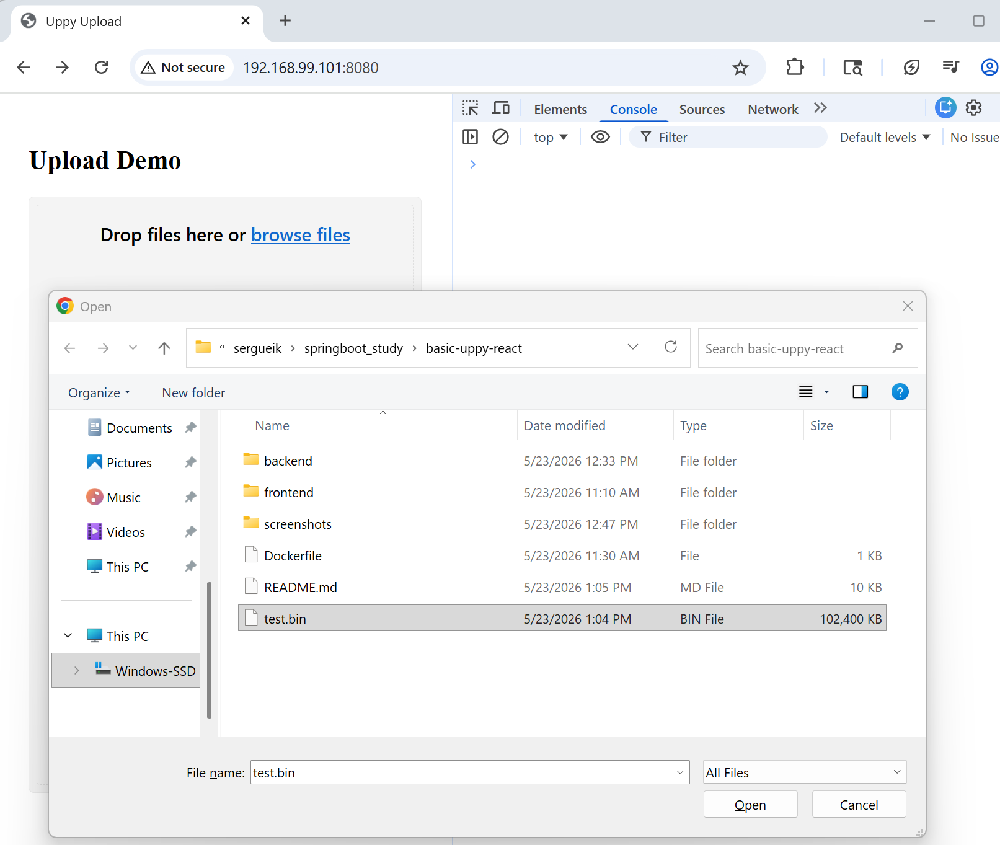

### Info
https://github.com/judsonc/react-upload-uppy
https://uppy.io/
https://github.com/transloadit/uppy with over 10K commits

### Usage


```sh
docker pull node:22.18.0-alpine
docker pull maven:3.9.5-eclipse-temurin-11-alpine
docker pull eclipse-temurin:11-jre-alpine
docker build -t example -f Dockerfile .
```
```text
Sending build context to Docker daemon  20.72MB
Step 1/14 : FROM node:22.18.0-alpine AS react_builder
 ---> 8a3ae2e7d0c5
Step 2/14 : WORKDIR /app
 ---> Using cache
 ---> adabb6bdda8e
Step 3/14 : COPY frontend /app/
 ---> d7150baf1e9b
Step 4/14 : RUN cd /app   && rm -rf node_modules package-lock.json   && npm install     @uppy/core@5.2.0     @uppy/dashboard@5.1.1     @uppy/xhr-upload@5.2.0     @uppy/react@5.1.1
 ---> Running in f015b46bbd16

added 95 packages, and audited 96 packages in 47s

16 packages are looking for funding
  run `npm fund` for details

found 0 vulnerabilities
npm notice
npm notice New major version of npm available! 10.9.3 -> 11.15.0
npm notice Changelog: https://github.com/npm/cli/releases/tag/v11.15.0
npm notice To update run: npm install -g npm@11.15.0
npm notice
Removing intermediate container f015b46bbd16
 ---> b1d0baa5640a
Step 5/14 : RUN npm run build
 ---> Running in ccdb5c8885ad

> uppy-react-upload@1.0.0 build
> vite build

vite v7.3.3 building client environment for production...
transforming...
✓ 212 modules transformed.
rendering chunks...
computing gzip size...
dist/index.html                   0.31 kB │ gzip:   0.22 kB
dist/assets/index-D9e3sqm0.css   65.60 kB │ gzip:  10.45 kB
dist/assets/index-WmiSNnvV.js   377.90 kB │ gzip: 118.39 kB
✓ built in 9.39s
Removing intermediate container ccdb5c8885ad
 ---> 3262381c6300
Step 6/14 : FROM maven:3.9.5-eclipse-temurin-11-alpine as builder
 ---> 37ef041f8432
Step 7/14 : WORKDIR /app
 ---> Running in 12f364c6e2ab
Removing intermediate container 12f364c6e2ab
 ---> cb7dd4b470ab
Step 8/14 : COPY backend /app/
 ---> 43bfd8bc7824
Step 9/14 : COPY --from=react_builder /app/dist /app/src/main/resources/static/
 ---> ab9f4b0ae722
Step 10/14 : RUN cd /app && mvn package -DskipTests

```


```
  docker build -t example -f Dockerfile  .
```
```text
Step 1/15 : FROM node:22.18.0-alpine AS react_builder
 ---> 8a3ae2e7d0c5
Step 2/15 : WORKDIR /app
 ---> Running in c220d46b825d
Removing intermediate container c220d46b825d
 ---> e93a4c73beb2
Step 3/15 : COPY frontend /app/
 ---> 1b3ccda6b500
Step 4/15 : RUN cd /app   && rm -rf node_modules package-lock.json   && npm install     @uppy/core@5.2.0     @uppy/dashboard@5.1.1     @uppy/xhr-upload@5.2.0     @uppy/react@5.1.1
 ---> Running in 1bb8ac5018e6

added 95 packages, and audited 96 packages in 44s

16 packages are looking for funding
  run `npm fund` for details

found 0 vulnerabilities
npm notice
npm notice New major version of npm available! 10.9.3 -> 11.15.0
npm notice Changelog: https://github.com/npm/cli/releases/tag/v11.15.0
npm notice To update run: npm install -g npm@11.15.0
npm notice
Removing intermediate container 1bb8ac5018e6
 ---> baa8e4643a12
Step 5/15 : RUN npm run build
 ---> Running in ffcff40738c9

> uppy-react-upload@1.0.0 build
> vite build

vite v7.3.3 building client environment for production...
transforming...
✓ 212 modules transformed.
rendering chunks...
computing gzip size...
dist/index.html                   0.31 kB │ gzip:   0.22 kB
dist/assets/index-D9e3sqm0.css   65.60 kB │ gzip:  10.45 kB
dist/assets/index-BpCiVfFe.js   377.96 kB │ gzip: 118.41 kB
✓ built in 8.21s
Removing intermediate container ffcff40738c9
 ---> 812ae8962c65
Step 6/15 : FROM maven:3.9.5-eclipse-temurin-11-alpine as builder
 ---> 37ef041f8432
Step 7/15 : WORKDIR /app
 ---> Using cache
 ---> cb7dd4b470ab
Step 8/15 : COPY backend /app/
 ---> bfe19ff22fe1
Step 9/15 : COPY --from=react_builder /app/dist /app/src/main/resources/static/
 ---> d101b966ccef
Step 10/15 : RUN cd /app && mvn dependency:go-offline -q
 ---> Running in 436b669e40f5
Removing intermediate container 436b669e40f5
 ---> 0fec68d3a68a
Step 11/15 : RUN cd /app && mvn package -DskipTests
 ---> Running in bf520793b4a5
[INFO] Scanning for projects...
[INFO]
[INFO] ------------< example:uppy-react-multipart-upload-backend >-------------
[INFO] Building example:uppy-react-multipart-upload-backend 0.1.0-SNAPSHOT
[INFO]   from pom.xml
[INFO] --------------------------------[ jar ]---------------------------------
Downloading from atlassian-3rd-P: https://maven.atlassian.com/3rdparty/org/slf4j/slf4j-api/1.7.36/slf4j-api-1.7.36.jar
Downloading from ossrh: https://oss.sonatype.org/content/repositories/snapshots/org/slf4j/slf4j-api/1.7.36/slf4j-api-1.7.36.jar
Downloading from maven-central: https://mvnrepository.com/repos/central/org/slf4j/slf4j-api/1.7.36/slf4j-api-1.7.36.jar
Downloading from osgeo: https://download.osgeo.org/webdav/geotools/org/slf4j/slf4j-api/1.7.36/slf4j-api-1.7.36.jar
Downloading from seasar: https://www.seasar.org/maven/maven2/org/slf4j/slf4j-api/1.7.36/slf4j-api-1.7.36.jar
Downloading from jcenter: https://jcenter.bintray.com/org/slf4j/slf4j-api/1.7.36/slf4j-api-1.7.36.jar
Downloaded from jcenter: https://jcenter.bintray.com/org/slf4j/slf4j-api/1.7.36/slf4j-api-1.7.36.jar (41 kB at 54 kB/s)
[INFO]
[INFO] --- resources:3.2.0:resources (default-resources) @ uppy-react-multipart-upload-backend ---
[INFO] Using 'UTF-8' encoding to copy filtered resources.
[INFO] Using 'UTF-8' encoding to copy filtered properties files.
[INFO] Copying 1 resource
[INFO] Copying 3 resources
[INFO]
[INFO] --- compiler:3.10.1:compile (default-compile) @ uppy-react-multipart-upload-backend ---
[INFO] Changes detected - recompiling the module!
[INFO] Compiling 5 source files to /app/target/classes
[INFO]
[INFO] --- resources:3.2.0:testResources (default-testResources) @ uppy-react-multipart-upload-backend ---
[INFO] Using 'UTF-8' encoding to copy filtered resources.
[INFO] Using 'UTF-8' encoding to copy filtered properties files.
[INFO] skip non existing resourceDirectory /app/src/test/resources
[INFO]
[INFO] --- compiler:3.10.1:testCompile (default-testCompile) @ uppy-react-multipart-upload-backend ---
[INFO] No sources to compile
[INFO]
[INFO] --- surefire:2.22.2:test (default-test) @ uppy-react-multipart-upload-backend ---
[INFO] Tests are skipped.
[INFO]
[INFO] --- jar:3.2.2:jar (default-jar) @ uppy-react-multipart-upload-backend ---
[INFO] Building jar: /app/target/uppy-react-multipart-upload-backend-0.1.0-SNAPSHOT.jar
[INFO]
[INFO] --- spring-boot:2.7.8:repackage (repackage) @ uppy-react-multipart-upload-backend ---
[WARNING]  Parameter 'finalName' is read-only, must not be used in configuration
[INFO] Replacing main artifact with repackaged archive
[INFO] ------------------------------------------------------------------------
[INFO] BUILD SUCCESS
[INFO] ------------------------------------------------------------------------
[INFO] Total time:  18.926 s
[INFO] Finished at: 2026-05-23T15:34:28Z
[INFO] ------------------------------------------------------------------------
Removing intermediate container bf520793b4a5
 ---> 3dd394c259e7
Step 12/15 : FROM eclipse-temurin:11-jre-alpine as run
 ---> 642de1708b20
Step 13/15 : COPY --from=builder /app/target/example.uppy-react-multipart-upload-backend.jar /app/app.jar
 ---> 77267e2fec25
Step 14/15 : ENTRYPOINT ["java", "-jar", "/app/app.jar"]
 ---> Running in 6791750bfdd7
Removing intermediate container 6791750bfdd7
 ---> f0605d87417e
Step 15/15 : EXPOSE 8080
 ---> Running in c80e26adccc4
Removing intermediate container c80e26adccc4
```
```
docker run -d -p 8080:8080 --name example example
```
```sh
dd if=/dev/urandom of=test.bin bs=1M count=100
```
```text
100+0 records in
100+0 records out
104857600 bytes (105 MB, 100 MiB) copied, 0.13182 s, 795 MB/s
```



The success on the frontend:


The application console log:
```text
2026-05-23 17:07:48.667 DEBUG 1 --- [io-8080-exec-10] o.s.web.servlet.DispatcherServlet        : POST "/uploadMultipleFiles", parameters={multipart}
2026-05-23 17:07:52.889 DEBUG 1 --- [io-8080-exec-10] s.w.s.m.m.a.RequestMappingHandlerMapping : Mapped to example.controller.FileUploadController#uploadMultipleFiles(MultipartFile[])
2026-05-23 17:07:52.891  INFO 1 --- [io-8080-exec-10] example.controller.FileUploadController  : upload 1 files: [test.bin]
2026-05-23 17:07:52.893  INFO 1 --- [io-8080-exec-10] example.controller.FileUploadController  : upload file: test.bin
2026-05-23 17:07:53.398  INFO 1 --- [io-8080-exec-10] example.service.FileStorageService       : UploadDir: /tmp/upload
2026-05-23 17:07:53.400  INFO 1 --- [io-8080-exec-10] example.controller.FileUploadController  : Listing: test.bin,test.txt
2026-05-23 17:07:53.403 DEBUG 1 --- [io-8080-exec-10] m.m.a.RequestResponseBodyMethodProcessor : Using 'application/json', given [*/*] and supported [application/json]
2026-05-23 17:07:53.410 DEBUG 1 --- [io-8080-exec-10] m.m.a.RequestResponseBodyMethodProcessor : Writing [{success=true, uploaded=[test.bin], url=/upload-success}]
2026-05-23 17:07:53.442 DEBUG 1 --- [io-8080-exec-10] o.s.web.servlet.DispatcherServlet        : Completed 200 OK
```
and the file is present on container:
```sh
docker exec -it example ls -hl /tmp/upload/test.bin
```
```
-rw-r--r-- 1 root root 100M May 23 17:07 /tmp/upload/test.bin
```
```sh
docker exec -it example sha256sum /tmp/upload/test.bin
```
```text
e37c10c86f56c0ca4778727e8bc8cdc7e428a68ac2daaddfd73429d134a7dd3e  /tmp/upload/test.bin
```
```sh
sha256sum.exe test.bin
```
```text
e37c10c86f56c0ca4778727e8bc8cdc7e428a68ac2daaddfd73429d134a7dd3e *test.bin
```
> NOTE: the "test.bin" is sufficiently large to test file chunking

### Cleanup
```sh
docker stop example; docker container prune -f ; docker image prune -f
```
### Background

__React__ is very unbeleivably complex - age?. Over the years.

creating the frontend from scratch with __Vite__ __React__ *template* is what is recmmended instead of manually assembling:

  * `package.json`
  * `Babel`
  * `webpack`
  * `React` bootstrap files
  * `ESLint`
  * `build config`


However this seems seriously feels backwards if you come from traditional build systems where source layout is explicit and inspectable. One has to accept it.

