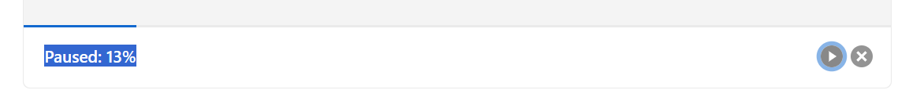
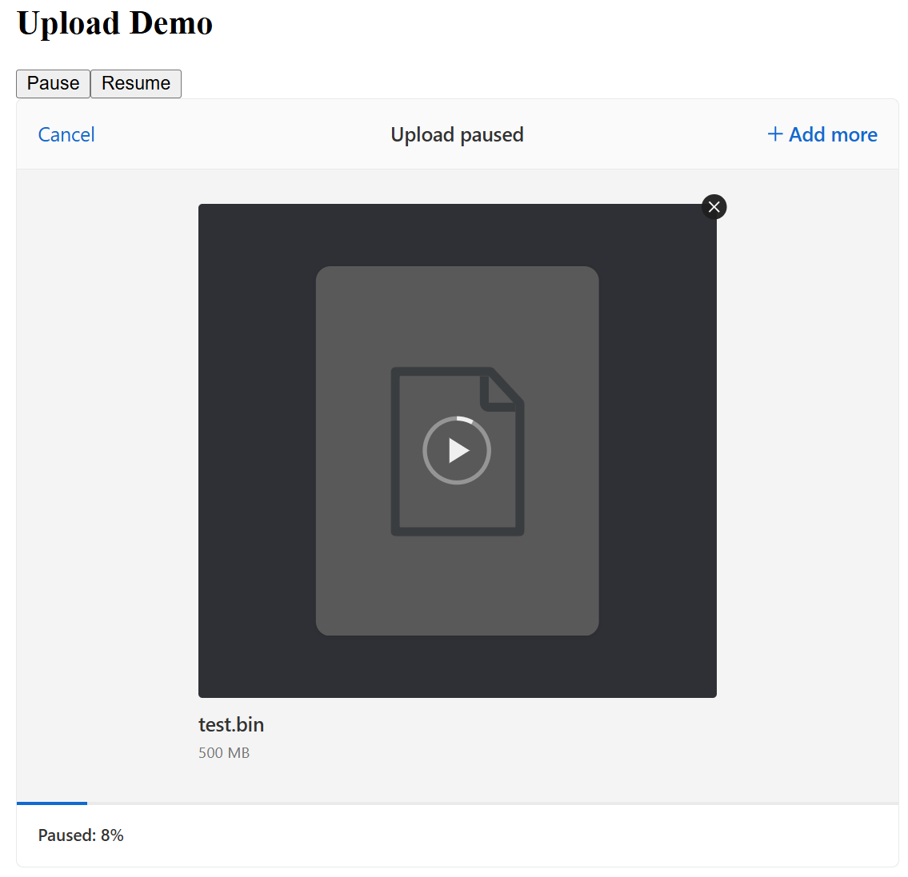

### Info


https://github.com/judsonc/react-upload-uppy

https://uppy.io/

### Background

https://github.com/transloadit/uppy with over 10K commits

### Usage


```sh
docker pull node:18.1.0-alpine
docker pull maven:3.9.5-eclipse-temurin-11-alpine
docker pull eclipse-temurin:11-jre-alpine
```

```sh
IMAGE=uppy-tus-react
docker build -t $IMAGE -f Dockerfile .
```

run both frontend and backend on port `8080`:
```sh
IMAGE=uppy-tus-react
CONTAINER=example
docker container rm $CONTAINER
docker run -d -p 8080:8080 --name $CONTAINER $IMAGE
```
after the upload verify the file:
```sh
docker exec -it $CONTAINER sha256sum target/data/de59f17c-de11-4ccc-a892-66b944e450b6
```
```txt
2886a81556fad0999ddff880956d6e452a45c09f73b8eedf5193e5fc0371d0d4  target/data/de59f17c-de11-4ccc-a892-66b944e450b6
```
compare to local:
```sh
sha256sum.exe  test.bin
```
```text
2886a81556fad0999ddff880956d6e452a45c09f73b8eedf5193e5fc0371d0d4 *test.bin
```

Browser console
```text
finalize:  200 {filename: 'example.bin', uploadId: '0b2fdb09-7281-4250-bd6e-79210ea26fd0', status: 'OK'}
index-D1PlX4wM.js:81 client side:  2886a81556fad0999ddff880956d6e452a45c09f73b8eedf5193e5fc0371d0d4
index-D1PlX4wM.js:81 verify:  200 {uploadHash: '2886a81556fad0999ddff880956d6e452a45c09f73b8eedf5193e5fc0371d0d4', filename: 'example.bin', uploadId: '0b2fdb09-7281-4250-bd6e-79210ea26fd0', hash: '2886A81556FAD0999DDFF880956D6E452A45C09F73B8EEDF5193E5FC0371D0D4', status: 'OK'}
```
```sh
docker logs $CONTAINER
```

```
LoggingFilter      : Before request [POST /api/upload, client=0:0:0:0:0:0:0:1, headers=[host:"localhost:8080", connection:"keep-alive", content-length:"0", sec-ch-ua-platform:""Windows"", tus-resumable:"1.0.0", user-agent:"Mozilla/5.0 (Windows NT 10.0; Win64; x64) AppleWebKit/537.36 (KHTML, like Gecko) Chrome/149.0.0.0 Safari/537.36", upload-length:"447", sec-ch-ua:""Google Chrome";v="149", "Chromium";v="149", "Not)A;Brand";v="24"", upload-metadata:"relativePath bnVsbA==,name dGVzdC50eHQ=,type dGV4dC9wbGFpbg==,filetype dGV4dC9wbGFpbg==,filename dGVzdC50eHQ=", sec-ch-ua-mobile:"?0", accept:"*/*", origin:"http://192.168.99.100:8080", sec-fetch-site:"cross-site", sec-fetch-mode:"cors", sec-fetch-dest:"empty", referer:"http://192.168.99.100:8080/", accept-encoding:"gzip, deflate, br, zstd", accept-language:"en-US,en;q=0.9"]]
2026-06-18 15:18:50.314  INFO 34304 --- [nio-8080-exec-6] m.d.t.s.c.CreationPostRequestHandler     : Created upload with ID 21b73f31-647a-45be-b010-6701031015da at 1781810330301 for ip address 0:0:0:0:0:0:0:1 with location /api/upload/21b73f31-647a-45be-b010-6701031015da
2026-06-18 15:18:50.315  INFO 34304 --- [nio-8080-exec-6] e.controller.TusFileUploadController     : upload not started
2026-06-18 15:18:50.316 DEBUG 34304 --- [nio-8080-exec-6] o.s.w.f.CommonsRequestLoggingFilter      : After request [POST /api/upload, client=0:0:0:0:0:0:0:1, headers=[host:"localhost:8080", connection:"keep-alive", content-length:"0", sec-ch-ua-platform:""Windows"", tus-resumable:"1.0.0", user-agent:"Mozilla/5.0 (Windows NT 10.0; Win64; x64) AppleWebKit/537.36 (KHTML, like Gecko) Chrome/149.0.0.0 Safari/537.36", upload-length:"447", sec-ch-ua:""Google Chrome";v="149", "Chromium";v="149", "Not)A;Brand";v="24"", upload-metadata:"relativePath bnVsbA==,name dGVzdC50eHQ=,type dGV4dC9wbGFpbg==,filetype dGV4dC9wbGFpbg==,filename dGVzdC50eHQ=", sec-ch-ua-mobile:"?0", accept:"*/*", origin:"http://192.168.99.100:8080", sec-fetch-site:"cross-site", sec-fetch-mode:"cors", sec-fetch-dest:"empty", referer:"http://192.168.99.100:8080/", accept-encoding:"gzip, deflate, br, zstd", accept-language:"en-US,en;q=0.9"]]
2026-06-18 15:18:50.324 DEBUG 34304 --- [nio-8080-exec-3] o.s.w.f.CommonsRequestLoggingFilter      : Before request [OPTIONS /api/upload/21b73f31-647a-45be-b010-6701031015da, client=0:0:0:0:0:0:0:1, headers=[host:"localhost:8080", connection:"keep-alive", accept:"*/*", access-control-request-method:"PATCH", access-control-request-headers:"content-type,tus-resumable,upload-offset", origin:"http://192.168.99.100:8080", user-agent:"Mozilla/5.0 (Windows NT 10.0; Win64; x64) AppleWebKit/537.36 (KHTML, like Gecko) Chrome/149.0.0.0 Safari/537.36", sec-fetch-mode:"cors", sec-fetch-site:"cross-site", sec-fetch-dest:"empty", referer:"http://192.168.99.100:8080/", accept-encoding:"gzip, deflate, br, zstd", accept-language:"en-US,en;q=0.9"]]
2026-06-18 15:18:50.327 DEBUG 34304 --- [nio-8080-exec-3] o.s.w.f.CommonsRequestLoggingFilter      : After request [OPTIONS /api/upload/21b73f31-647a-45be-b010-6701031015da, client=0:0:0:0:0:0:0:1, headers=[host:"localhost:8080", connection:"keep-alive", accept:"*/*", access-control-request-method:"PATCH", access-control-request-headers:"content-type,tus-resumable,upload-offset", origin:"http://192.168.99.100:8080", user-agent:"Mozilla/5.0 (Windows NT 10.0; Win64; x64) AppleWebKit/537.36 (KHTML, like Gecko) Chrome/149.0.0.0 Safari/537.36", sec-fetch-mode:"cors", sec-fetch-site:"cross-site", sec-fetch-dest:"empty", referer:"http://192.168.99.100:8080/", accept-encoding:"gzip, deflate, br, zstd", accept-language:"en-US,en;q=0.9"]]
2026-06-18 15:18:50.332 DEBUG 34304 --- [io-8080-exec-10] o.s.w.f.CommonsRequestLoggingFilter      : Before request [PATCH /api/upload/21b73f31-647a-45be-b010-6701031015da, client=0:0:0:0:0:0:0:1, headers=[host:"localhost:8080", connection:"keep-alive", content-length:"447", sec-ch-ua-platform:""Windows"", tus-resumable:"1.0.0", user-agent:"Mozilla/5.0 (Windows NT 10.0; Win64; x64) AppleWebKit/537.36 (KHTML, like Gecko) Chrome/149.0.0.0 Safari/537.36", sec-ch-ua:""Google Chrome";v="149", "Chromium";v="149", "Not)A;Brand";v="24"", upload-offset:"0", sec-ch-ua-mobile:"?0", accept:"*/*", origin:"http://192.168.99.100:8080", sec-fetch-site:"cross-site", sec-fetch-mode:"cors", sec-fetch-dest:"empty", referer:"http://192.168.99.100:8080/", accept-encoding:"gzip, deflate, br, zstd", accept-language:"en-US,en;q=0.9", Content-Type:"application/offset+octet-stream;charset=UTF-8"]]
2026-06-18 15:18:50.365  INFO 34304 --- [io-8080-exec-10] m.d.t.s.core.CorePatchRequestHandler     : Upload with ID 21b73f31-647a-45be-b010-6701031015da at location /api/upload/21b73f31-647a-45be-b010-6701031015da finished successfully
2026-06-18 15:18:50.385  INFO 34304 --- [io-8080-exec-10] e.controller.TusFileUploadController     : upload complete
2026-06-18 15:18:50.398  INFO 34304 --- [io-8080-exec-10] e.controller.TusFileUploadController     : info: id: 21b73f31-647a-45be-b010-6701031015da filename: test.txt local path: C:\Users\kouzm\AppData\Local\Temp\tus\uploads\21b73f31-647a-45be-b010-6701031015da\data
2026-06-18 15:18:50.398 DEBUG 34304 --- [io-8080-exec-10] o.s.w.f.CommonsRequestLoggingFilter      : After request [PATCH /api/upload/21b73f31-647a-45be-b010-6701031015da, client=0:0:0:0:0:0:0:1, headers=[host:"localhost:8080", connection:"keep-alive", content-length:"447", sec-ch-ua-platform:""Windows"", tus-resumable:"1.0.0", user-agent:"Mozilla/5.0 (Windows NT 10.0; Win64; x64) AppleWebKit/537.36 (KHTML, like Gecko) Chrome/149.0.0.0 Safari/537.36", sec-ch-ua:""Google Chrome";v="149", "Chromium";v="149", "Not)A;Brand";v="24"", upload-offset:"0", sec-ch-ua-mobile:"?0", accept:"*/*", origin:"http://192.168.99.100:8080", sec-fetch-site:"cross-site", sec-fetch-mode:"cors", sec-fetch-dest:"empty", referer:"http://192.168.99.100:8080/", accept-encoding:"gzip, deflate, br, zstd", accept-language:"en-US,en;q=0.9", Content-Type:"application/offset+octet-stream;charset=UTF-8"]]

...
```
```text
2026-06-22 22:02:00.502  INFO 1 --- [nio-8080-exec-5] e.controller.TusFileUploadController     : info: id: 0b2fdb09-7281-4250-bd6e-79210ea26fd0 filename: example.bin local path: /tmp/tus/uploads/0b2fdb09-7281-4250-bd6e-79210ea26fd0/data
2026-06-22 22:02:00.504 DEBUG 1 --- [nio-8080-exec-5] o.s.w.f.CommonsRequestLoggingFilter      : After request [PATCH /api/upload/0b2fdb09-7281-4250-bd6e-79210ea26fd0, client=192.168.99.1, headers=[host:"192.168.99.101:8080", connection:"keep-alive", content-length:"5242880", tus-resumable:"1.0.0", user-agent:"Mozilla/5.0 (Windows NT 10.0; Win64; x64) AppleWebKit/537.36 (KHTML, like Gecko) Chrome/149.0.0.0 Safari/537.36", upload-offset:"47185920", accept:"*/*", origin:"http://192.168.99.101:8080", referer:"http://192.168.99.101:8080/", accept-encoding:"gzip, deflate", accept-language:"en-US,en;q=0.9", Content-Type:"application/offset+octet-stream;charset=UTF-8"]]
2026-06-22 22:02:00.532 DEBUG 1 --- [nio-8080-exec-6] o.s.w.f.CommonsRequestLoggingFilter      : Before request [POST /api/uploads/finalize, client=192.168.99.1, headers=[host:"192.168.99.101:8080", connection:"keep-alive", content-length:"51", user-agent:"Mozilla/5.0 (Windows NT 10.0; Win64; x64) AppleWebKit/537.36 (KHTML, like Gecko) Chrome/149.0.0.0 Safari/537.36", accept:"*/*", origin:"http://192.168.99.101:8080", referer:"http://192.168.99.101:8080/", accept-encoding:"gzip, deflate", accept-language:"en-US,en;q=0.9", Content-Type:"application/json;charset=UTF-8"]]
2026-06-22 22:02:00.740  INFO 1 --- [nio-8080-exec-6] example.controller.FinalizeController    : move /tmp/tus/uploads/0b2fdb09-7281-4250-bd6e-79210ea26fd0/data to /target/data/0b2fdb09-7281-4250-bd6e-79210ea26fd0
2026-06-22 22:02:00.744  INFO 1 --- [nio-8080-exec-6] example.controller.FinalizeController    : Returning status: {filename=example.bin, uploadId=0b2fdb09-7281-4250-bd6e-79210ea26fd0, status=OK}
2026-06-22 22:02:00.759 DEBUG 1 --- [nio-8080-exec-6] o.s.w.f.CommonsRequestLoggingFilter      : After request [POST /api/uploads/finalize, client=192.168.99.1, headers=[host:"192.168.99.101:8080", connection:"keep-alive", content-length:"51", user-agent:"Mozilla/5.0 (Windows NT 10.0; Win64; x64) AppleWebKit/537.36 (KHTML, like Gecko) Chrome/149.0.0.0 Safari/537.36", accept:"*/*", origin:"http://192.168.99.101:8080", referer:"http://192.168.99.101:8080/", accept-encoding:"gzip, deflate", accept-language:"en-US,en;q=0.9", Content-Type:"application/json;charset=UTF-8"]]
2026-06-22 22:02:01.776 DEBUG 1 --- [nio-8080-exec-7] o.s.w.f.CommonsRequestLoggingFilter      : Before request [POST /api/uploads/validate, client=192.168.99.1, headers=[host:"192.168.99.101:8080", connection:"keep-alive", content-length:"125", user-agent:"Mozilla/5.0 (Windows NT 10.0; Win64; x64) AppleWebKit/537.36 (KHTML, like Gecko) Chrome/149.0.0.0 Safari/537.36", accept:"*/*", origin:"http://192.168.99.101:8080", referer:"http://192.168.99.101:8080/", accept-encoding:"gzip, deflate", accept-language:"en-US,en;q=0.9", Content-Type:"application/json;charset=UTF-8"]]
2026-06-22 22:02:01.790 DEBUG 1 --- [nio-8080-exec-8] o.s.w.f.CommonsRequestLoggingFilter      : Before request [GET /, client=127.0.0.1, headers=[host:"localhost:8080", user-agent:"curl/8.19.0", accept:"*/*"]]
2026-06-22 22:02:01.799  INFO 1 --- [nio-8080-exec-7] example.controller.ValidateController    : Loading request: {uploadHash=2886a81556fad0999ddff880956d6e452a45c09f73b8eedf5193e5fc0371d0d4, uploadId=0b2fdb09-7281-4250-bd6e-79210ea26fd0, status=UNKNOWN}
2026-06-22 22:02:01.823 DEBUG 1 --- [nio-8080-exec-8] o.s.w.f.CommonsRequestLoggingFilter      : After request [GET /, client=127.0.0.1, headers=[host:"localhost:8080", user-agent:"curl/8.19.0", accept:"*/*"]]
2026-06-22 22:02:01.835  INFO 1 --- [nio-8080-exec-7] example.controller.ValidateController    : validate hash of the upload /target/data/0b2fdb09-7281-4250-bd6e-79210ea26fd0 2886a81556fad0999ddff880956d6e452a45c09f73b8eedf5193e5fc0371d0d4
2026-06-22 22:02:02.856  INFO 1 --- [nio-8080-exec-7] example.controller.ValidateController    : Digest input: /target/data/0b2fdb09-7281-4250-bd6e-79210ea26fd0 hash: 2886A81556FAD0999DDFF880956D6E452A45C09F73B8EEDF5193E5FC0371D0D4
2026-06-22 22:02:02.858  INFO 1 --- [nio-8080-exec-7] example.controller.ValidateController    : Processed 52428800 bytes in 1018 ms
2026-06-22 22:02:02.860  INFO 1 --- [nio-8080-exec-7] example.controller.ValidateController    : delete the upload /api/upload/0b2fdb09-7281-4250-bd6e-79210ea26fd0
2026-06-22 22:02:02.895  INFO 1 --- [nio-8080-exec-7] example.controller.ValidateController    : cleanup
2026-06-22 22:02:02.905  INFO 1 --- [nio-8080-exec-7] example.controller.ValidateController    : Returning status: {uploadHash=2886a81556fad0999ddff880956d6e452a45c09f73b8eedf5193e5fc0371d0d4, filename=example.bin, uploadId=0b2fdb09-7281-4250-bd6e-79210ea26fd0, hash=2886A81556FAD0999DDFF880956D6E452A45C09F73B8EEDF5193E5FC0371D0D4, status=OK}
2026-06-22 22:02:02.917 DEBUG 1 --- [nio-8080-exec-7] o.s.w.f.CommonsRequestLoggingFilter      : After request [POST /api/uploads/validate, client=192.168.99.1, headers=[host:"192.168.99.101:8080", connection:"keep-alive", content-length:"125", user-agent:"Mozilla/5.0 (Windows NT 10.0; Win64; x64) AppleWebKit/537.36 (KHTML, like Gecko) Chrome/149.0.0.0 Safari/537.36", accept:"*/*", origin:"http://192.168.99.101:8080", referer:"http://192.168.99.101:8080/", accept-encoding:"gzip, deflate", accept-language:"en-US,en;q=0.9", Content-Type:"application/json;charset=UTF-8"]]
```

```sh
curl -X POST -d '{"uploadId":"30dacb9b-1ca6-49cb-9b5f-fc1af9d740df"}' -H 'Content-Type: application/json' http://192.168.99.100:8080/api/uploads/finalize
```
```json
{
  "filename": "example.bin",
  "uploadId": "30dacb9b-1ca6-49cb-9b5f-fc1af9d740df",
  "status": "OK"
}
```

```sh
dd if=/dev/urandom of=test.bin bs=1M count=50
```

### Pause / Resume

The dasbhoard has `pause` / `resume` functioality default styled in walkman button fashion:



it is possible to hide and provide a custom buttons



### See Also

  * official Docker image for running a tus server is [tusproject/tusd](https://hub.docker.com/r/tusproject/tusd) . Images are alpine based
  * https://blog.rasc.ch/2019/06/upload-with-tus.html
  * https://tus.io/protocols/resumable-upload#core-protocol
  * https://aiundecided.com/posts/tus-uppy-resumable-upload-architecture/
  * [tus implementations](https://tus.io/implementations). Notably, GitHub's tus-protocol topic currently shows roughly 60+ public repositories implementing or extending the protocol across multiple languages
  * `PATCH` Method for `HTTP` [RFC5789](https://www.rfc-editor.org/info/rfc5789/)

### Author

[Serguei Kouzmine](kouzmine_serguei@yahoo.com)
