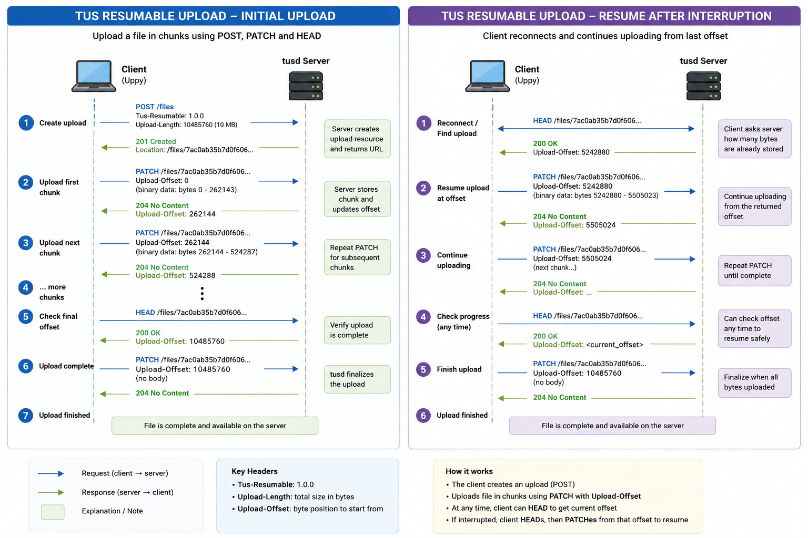
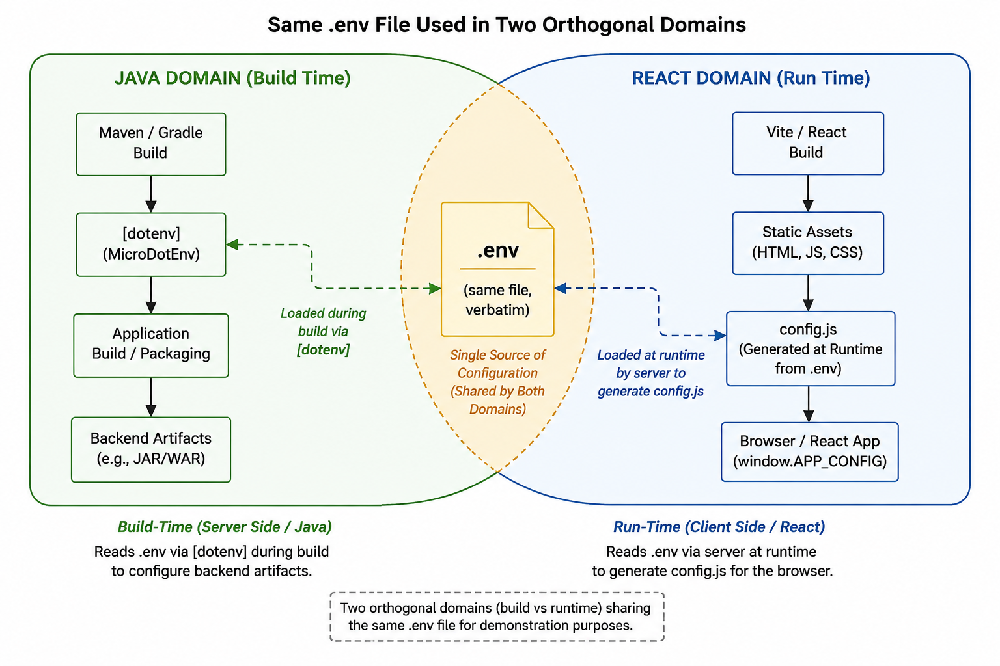
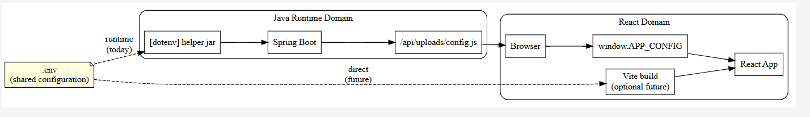
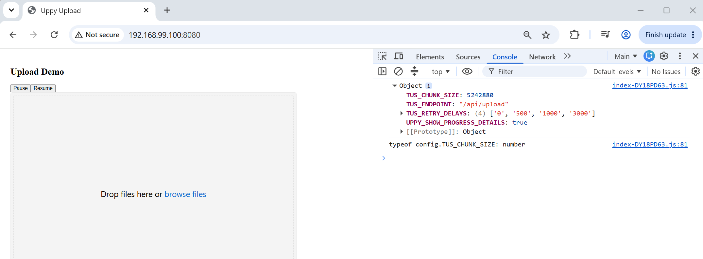
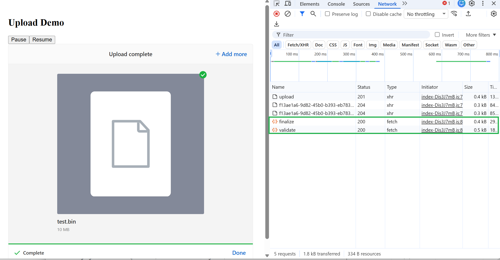
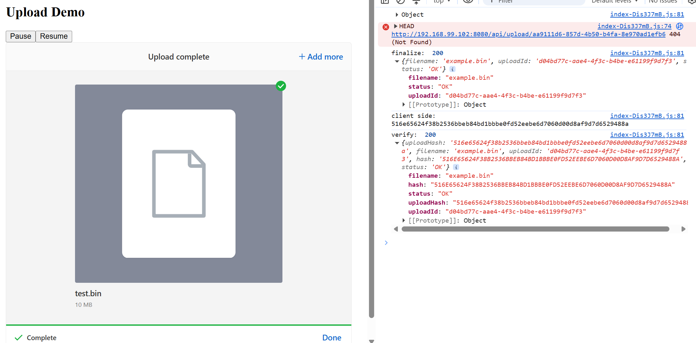
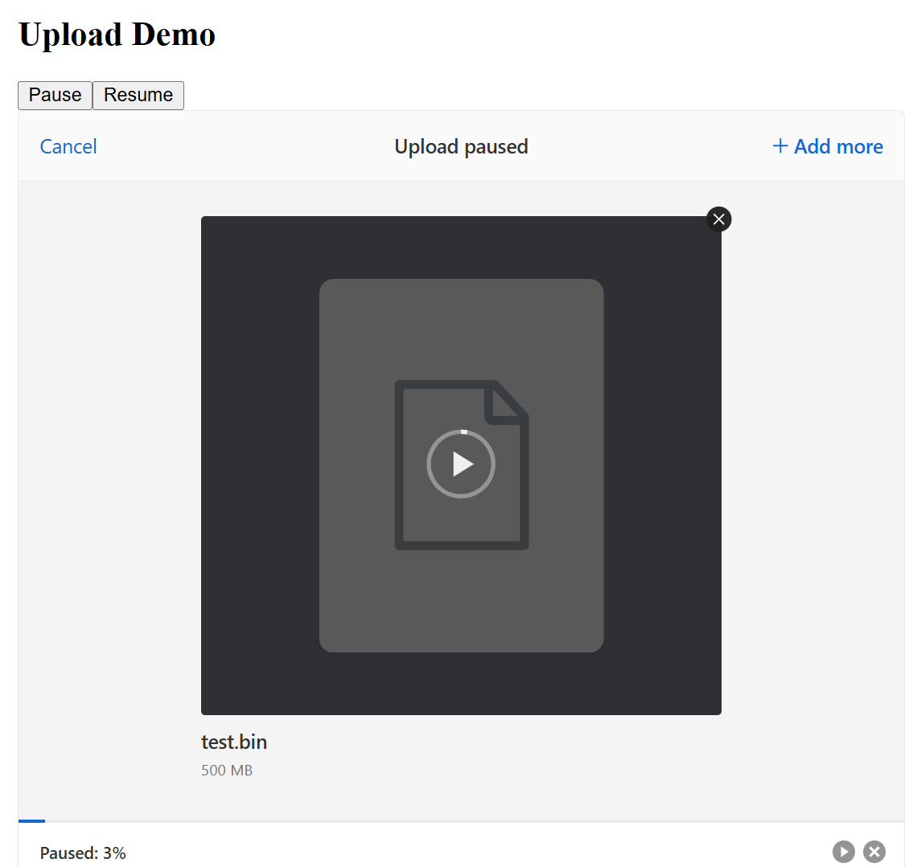
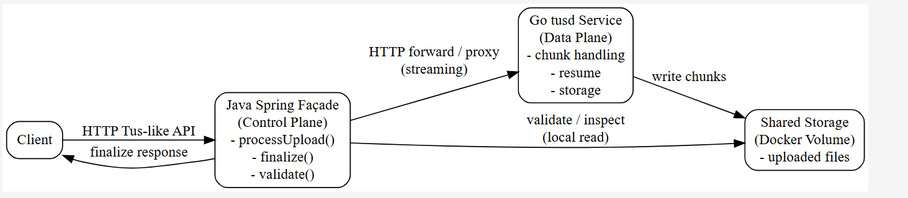

### Info


https://github.com/judsonc/react-upload-uppy



https://uppy.io/

### Background

https://github.com/transloadit/uppy with over 10K commits

### Usage






```sh
docker pull node:18.1.0-alpine
docker pull maven:3.9.5-eclipse-temurin-11-alpine
docker pull eclipse-temurin:11-jre-alpine
```

```sh
IMAGE=uppy-tus-react
docker build -t $IMAGE -f Dockerfile.spa .
```

```text
$ docker build -t $IMAGE -f Dockerfile.spa .
Sending build context to Docker daemon  57.01MB
Step 1/21 : FROM node:18.1.0-alpine AS react_builder
 ---> d94913fe64df
Step 2/21 : WORKDIR /app
 ---> Running in febeb108d3fe
Removing intermediate container febeb108d3fe
 ---> 42233862edb1
Step 3/21 : COPY frontend/package*.json ./
 ---> 5865484ea0c1
Step 4/21 : RUN npm ci --silent
 ---> Running in af7bb7c63487
npm notice
npm notice New major version of npm available! 8.8.0 -> 11.18.0
npm notice Changelog: <https://github.com/npm/cli/releases/tag/v11.18.0>
npm notice Run `npm install -g npm@11.18.0` to update!
npm notice
Removing intermediate container af7bb7c63487
 ---> a8620208db96
Step 5/21 : COPY frontend/ ./
 ---> 2b0df5cb39e2
Step 6/21 : RUN npm run build
 ---> Running in 36f0d06809aa

> uppy-react-upload@1.0.0 build
> vite build

vite v5.4.19 building for production...
transforming...
✓ 254 modules transformed.
rendering chunks...
computing gzip size...
dist/index.html                   0.48 kB │ gzip:   0.30 kB
dist/assets/index-C_U7NcPb.css   66.05 kB │ gzip:  10.51 kB
dist/assets/index-CXOVey5E.js   456.24 kB │ gzip: 139.28 kB
✓ built in 9.56s
Removing intermediate container 36f0d06809aa
 ---> 899a3857092e
Step 7/21 : FROM maven:3.9.5-eclipse-temurin-11-alpine as builder
 ---> 37ef041f8432
Step 8/21 : WORKDIR /app
 ---> Running in a5ac2315bd62
Removing intermediate container a5ac2315bd62
 ---> 69ed292cac90
Step 9/21 : COPY pom.xml /app/
 ---> 54dc117e6f07
Step 10/21 : RUN mvn dependency:go-offline -q
 ---> Running in ecd7c3ca6247
Removing intermediate container ecd7c3ca6247
 ---> b5ed077850ab
Step 11/21 : ADD src /app/src/
 ---> c62383495566
Step 12/21 : COPY --from=react_builder /app/dist /app/src/main/resources/public/
 ---> be6d4ff8475b
Step 13/21 : RUN mvn clean package -DskipTests -q
 ---> Running in 7eb0553e8b77
Removing intermediate container 7eb0553e8b77
 ---> ad6bd4d0b3cb
Step 14/21 : FROM eclipse-temurin:11-jre-alpine as run
 ---> eda029f40d3e
Step 15/21 : COPY --from=builder /app/target/example.tus-java-server.jar /app/app.jar
 ---> 75487c4b4aff
Step 16/21 : COPY --from=react_builder /app/.env /app
 ---> 23c81a39c689
Step 17/21 : RUN apk update     && apk add --update --no-cache curl     && rm -rf /var/cache/*     && mkdir /var/cache/apk
 ---> Running in 8f740fa13bc0
v3.23.5-31-g3b811432299 [https://dl-cdn.alpinelinux.org/alpine/v3.23/main]
v3.23.5-31-g3b811432299 [https://dl-cdn.alpinelinux.org/alpine/v3.23/community]
OK: 27587 distinct packages available
(1/5) Installing c-ares (1.34.6-r0)
(2/5) Installing nghttp2-libs (1.69.0-r0)
(3/5) Installing libpsl (0.21.5-r3)
(4/5) Installing libcurl (8.19.0-r0)
(5/5) Installing curl (8.19.0-r0)
Executing busybox-1.37.0-r30.trigger
OK: 41.8 MiB in 78 packages
Removing intermediate container 8f740fa13bc0
 ---> 14f54afdb1a1
Step 18/21 : WORKDIR /app
 ---> Running in c4857add6ffb
Removing intermediate container c4857add6ffb
 ---> 18b948aa9659
Step 19/21 : HEALTHCHECK --interval=30s --timeout=5s --start-period=10s CMD curl -f http://localhost:8080/ || exit 1
 ---> Running in 4eda485dde50
Removing intermediate container 4eda485dde50
 ---> 8c7912ad3d44
Step 20/21 : ENTRYPOINT ["java", "-jar", "/app/app.jar"]
 ---> Running in 9bf14f846f92
Removing intermediate container 9bf14f846f92
 ---> 848f5dff5372
Step 21/21 : EXPOSE 8080
 ---> Running in 163205dacbbd
Removing intermediate container 163205dacbbd
 ---> fc63153d8343
Successfully built fc63153d8343
Successfully tagged uppy-tus-react:latest
SECURITY WARNING: You are building a Docker image from Windows against a non-Windows Docker host. All files and directories added to build context will have '-rwxr-xr-x' permissions. It is recommended to double check and reset permissions for sensitive files and directories.
```
run both frontend and backend on port `8080`:
```sh
IMAGE=uppy-tus-react
CONTAINER=example
docker container rm -f $CONTAINER
docker run -d -p 8080:8080 --name $CONTAINER $IMAGE
```
```sh
docker ps
```
```text
CONTAINER ID        IMAGE               COMMAND                  CREATED             STATUS                            PORTS                    NAMES
e40092782a3f        uppy-tus-react      "java -jar /app/app.…"   8 seconds ago       Up 7 seconds (health: starting)   0.0.0.0:8080->8080/tcp   example
```

perform preflight test to see the CORS headers through CLI (curl does not react on response in a strict way the browser does:

```sh
curl -si -v -X OPTIONS http://192.168.99.101:8080/api/upload -H 'Origin: http://192.168.99.101:3000' -H 'Access-Control-Request-Method: PATCH' -H 'Access-Control-Request-Headers: Tus-Resumable,Upload-Offset,Content-Type'
```
```text
HTTP/1.1 200
Vary: Origin
Vary: Access-Control-Request-Method
Vary: Access-Control-Request-Headers
Access-Control-Allow-Origin: *
Access-Control-Allow-Methods: POST,PATCH,HEAD,DELETE,OPTIONS,GET
Access-Control-Allow-Headers: Tus-Resumab;e, Upload-Offset, Content-Type
Access-Control-Max-Age: 1800
Allow: GET, HEAD, POST, PUT, DELETE, OPTIONS, PATCH
Content-Length: 0
Date: Tue, 07 Jul 2026 00:19:45 GMT

* Uses proxy env variable no_proxy == '192.168.99.100,192.168.99.101,192.168.99.102'
*   Trying 192.168.99.101:8080...
* Connected to 192.168.99.101 (192.168.99.101) port 8080 (#0)
> OPTIONS /api/upload HTTP/1.1
> Host: 192.168.99.101:8080
> User-Agent: curl/7.84.0
> Accept: */*
> Origin: http://192.168.99.101:3000
> Access-Control-Request-Method: PATCH
> Access-Control-Request-Headers: Tus-Resumab;e,Upload-Offset,Content-Type
>
* Mark bundle as not supporting multiuse
< HTTP/1.1 200
< Vary: Origin
< Vary: Access-Control-Request-Method
< Vary: Access-Control-Request-Headers
< Access-Control-Allow-Origin: *
< Access-Control-Allow-Methods: POST,PATCH,HEAD,DELETE,OPTIONS,GET
< Access-Control-Allow-Headers: Tus-Resumab;e, Upload-Offset, Content-Type
< Access-Control-Max-Age: 1800
< Allow: GET, HEAD, POST, PUT, DELETE, OPTIONS, PATCH
< Content-Length: 0
< Date: Tue, 07 Jul 2026 00:19:45 GMT
<
* Connection #0 to host 192.168.99.101 left intact
```
NOTE the `Access-Control-Allow-Origin` header and `Allow` list of HTTP methods (TUS uses additional methods compared to Spring). Sometimes there is also `Access-Control-Expose-Headers` header.

try a real `POST` (but without the expected headers) note the `Access-Control-Allow-Origin` response header:

```sh
curl -si -X POST -v http://192.168.99.101:8080/api/upload -H 'Origin: http://192.168.99.101:3000'
```
```text
HTTP/1.1 412
Vary: Origin
Vary: Access-Control-Request-Method
Vary: Access-Control-Request-Headers
Access-Control-Allow-Origin: *
Tus-Resumable: 1.0.0
Content-Type: application/json
Transfer-Encoding: chunked
Date: Tue, 07 Jul 2026 00:31:17 GMT

{"timestamp":"2026-07-07T00:31:17.887+00:00","status":412,"error":"Precondition Failed","path":"/api/upload"}
```
Alternatively do it in Powershell:

```powershell
$response = invoke-webrequest -uri 'http://192.168.99.101:8080/api/upload' -Method 'OPTIONS'  -headers @{ 'Origin'= 'http://192.168.99.101:3000' ; 'Access-Control-Request-Method'= 'PATCH';  'Access-Control-Request-Headers'='Tus-Resumable,Upload-Offset,Content-Type' } -verbose 
```

```text
Security Warning: Script Execution Risk
Invoke-WebRequest parses the content of the web page. Script code in the web
page might be run when the page is parsed.
      RECOMMENDED ACTION:
      Use the -UseBasicParsing switch to avoid script code execution.

      Do you want to continue?

[Y] Yes  [A] Yes to All  [N] No  [L] No to All  [S] Suspend  [?] Help
(default is "N"):
```

```text
Y
```
```powershell
$response.StatusCode
```
```
200
```
```powershell
$response.Headers
```
```text
Key                          Value
---                          -----
Vary                         Origin,Access-Control-Request-Method,Access-Con...
Access-Control-Allow-Origin  *
Access-Control-Allow-Methods POST,PATCH,HEAD,DELETE,OPTIONS,GET
Access-Control-Allow-Headers Tus-Resumable, Upload-Offset, Content-Type
Access-Control-Max-Age       1800
Allow                        GET, HEAD, POST, PUT, DELETE, OPTIONS, PATCH
Content-Length               0
Date                         Tue, 07 Jul 2026 00:42:34 GMT
```

interact with application  through the browser

after the upload verify the file:
```sh
docker exec -it $CONTAINER sha256sum target/data/de59f17c-de11-4ccc-a892-66b944e450b6
```
```txt
2886a81556fad0999ddff880956d6e452a45c09f73b8eedf5193e5fc0371d0d4  target/data/de59f17c-de11-4ccc-a892-66b944e450b6
```
compare to local:
```sh
sha256sum.exe  test.bin
```
```text
2886a81556fad0999ddff880956d6e452a45c09f73b8eedf5193e5fc0371d0d4 *test.bin
```

Browser console
```text
finalize:  200 {filename: 'example.bin', uploadId: '0b2fdb09-7281-4250-bd6e-79210ea26fd0', status: 'OK'}
index-D1PlX4wM.js:81 client side:  2886a81556fad0999ddff880956d6e452a45c09f73b8eedf5193e5fc0371d0d4
index-D1PlX4wM.js:81 verify:  200 {uploadHash: '2886a81556fad0999ddff880956d6e452a45c09f73b8eedf5193e5fc0371d0d4', filename: 'example.bin', uploadId: '0b2fdb09-7281-4250-bd6e-79210ea26fd0', hash: '2886A81556FAD0999DDFF880956D6E452A45C09F73B8EEDF5193E5FC0371D0D4', status: 'OK'}
```
```sh
CONTAINER=example
docker logs $CONTAINER
```
open the url `http://192.168.99.100:8080/` in the browser. Update with the IP address of Docker Toolbox machine



confirm the back end
```text
2026-07-03 03:09:10.388 DEBUG 1 --- [nio-8080-exec-5] o.s.w.f.CommonsRequestLoggingFilter      : After request [GET /api/uploads/config.js, client=192.168.99.1, headers=[host:"192.168.99.100:8080", connection:"keep-alive", user-agent:"Mozilla/5.0 (Windows NT 10.0; Win64; x64) AppleWebKit/537.36 (KHTML, like Gecko) Chrome/149.0.0.0 Safari/537.36", accept:"*/*", referer:"http://192.168.99.100:8080/", accept-encoding:"gzip, deflate", accept-language:"en-US,en;q=0.9"]]
```
and
```text
2026-07-03 15:01:06.466  INFO 1 --- [nio-8080-exec-8] e.controller.DotnetConfigController      : Returning javascript: window.APP_CONFIG = {"MAX_FILE_SIZE_BYTES":2147439648,"TUS_RETRY_DELAYS":["0","500","1000","3000"],"MAX_NUMBER_OF_FILES":1,"TUS_ENDPOINT":"/api/upload","TUS_CHUNK_SIZE":5242880};
2026-07-03 15:01:06.498 DEBUG 1 --- [nio-8080-exec-8] o.s.w.f.CommonsRequestLoggingFilter      : After request [GET /api/uploads/config.js, client=192.168.99.1, headers=[host:"192.168.99.100:8080", connection:"keep-alive", user-agent:"Mozilla/5.0 (Windows NT 10.0; Win64; x64) AppleWebKit/537.36 (KHTML, like Gecko) Chrome/150.0.0.0 Safari/537.36", accept:"*/*", referer:"http://192.168.99.100:8080/", accept-encoding:"gzip, deflate", accept-language:"en-US,en;q=0.9"]]
```
and

```text

2026-07-03 15:23:10.791 DEBUG 1 --- [nio-8080-exec-3] o.s.w.f.CommonsRequestLoggingFilter      : Before request [GET /api/uploads/config, client=192.168.99.1, headers=[host:"192.168.99.100:8080", connection:"keep-alive", upgrade-insecure-requests:"1", user-agent:"Mozilla/5.0 (Windows NT 10.0; Win64; x64) AppleWebKit/537.36 (KHTML, like Gecko) Chrome/150.0.0.0 Safari/537.36", accept:"text/html,application/xhtml+xml,application/xml;q=0.9,image/avif,image/webp,image/apng,*/*;q=0.8,application/signed-exchange;v=b3;q=0.7", accept-encoding:"gzip, deflate", accept-language:"en-US,en;q=0.9"]]
2026-07-03 15:23:10.802  INFO 1 --- [nio-8080-exec-3] example.service.DotnetConfigService      : Working dir: /app
2026-07-03 15:23:10.806  INFO 1 --- [nio-8080-exec-3] example.service.DotnetConfigService      : dotenv: VITE_TUS_CHUNK_SIZE=5 * 1024 * 1024
2026-07-03 15:23:10.807  INFO 1 --- [nio-8080-exec-3] example.service.DotnetConfigService      : dotenv: VITE_TUS_RETRY_DELAYS=0,500,1000,3000
2026-07-03 15:23:10.808  INFO 1 --- [nio-8080-exec-3] example.service.DotnetConfigService      : dotenv: VITE_TUS_ENDPOINT=/api/upload
2026-07-03 15:23:10.808  INFO 1 --- [nio-8080-exec-3] example.service.DotnetConfigService      : dotenv: VITE_MAX_NUMBER_OF_FILES=1
2026-07-03 15:23:10.808  INFO 1 --- [nio-8080-exec-3] example.service.DotnetConfigService      : dotenv: VITE_MAX_FILE_SIZE_BYTES=2147439648
2026-07-03 15:23:10.808  INFO 1 --- [nio-8080-exec-3] example.service.DotnetConfigService      : dotenv: VITE_UPPY_SHOW_PROGRESS_DETAILS=true
2026-07-03 15:23:10.809  INFO 1 --- [nio-8080-exec-3] example.service.DotnetConfigService      : dotenv: VITE_JOB_REDIRECT_DELAY_MS=500
2026-07-03 15:23:10.809  INFO 1 --- [nio-8080-exec-3] example.service.DotnetConfigService      : dotenv: LANGUAGE=en_US:en
2026-07-03 15:23:10.809  INFO 1 --- [nio-8080-exec-3] example.service.DotnetConfigService      : dotenv: PATH=/opt/java/openjdk/bin:/usr/local/sbin:/usr/local/bin:/usr/sbin:/usr/bin:/sbin:/bin
2026-07-03 15:23:10.809  INFO 1 --- [nio-8080-exec-3] example.service.DotnetConfigService      : dotenv: HOSTNAME=a30747860229
2026-07-03 15:23:10.810  INFO 1 --- [nio-8080-exec-3] example.service.DotnetConfigService      : dotenv: LC_ALL=en_US.UTF-8
2026-07-03 15:23:10.810  INFO 1 --- [nio-8080-exec-3] example.service.DotnetConfigService      : dotenv: LD_LIBRARY_PATH=/opt/java/openjdk/lib/server:/opt/java/openjdk/lib:/opt/java/openjdk/../lib
2026-07-03 15:23:10.810  INFO 1 --- [nio-8080-exec-3] example.service.DotnetConfigService      : dotenv: JAVA_HOME=/opt/java/openjdk
2026-07-03 15:23:10.812  INFO 1 --- [nio-8080-exec-3] example.service.DotnetConfigService      : dotenv: JAVA_VERSION=jdk-11.0.31+11
2026-07-03 15:23:10.812  INFO 1 --- [nio-8080-exec-3] example.service.DotnetConfigService      : dotenv: LANG=en_US.UTF-8
2026-07-03 15:23:10.812  INFO 1 --- [nio-8080-exec-3] example.service.DotnetConfigService      : dotenv: HOME=/root
2026-07-03 15:23:10.813  INFO 1 --- [nio-8080-exec-3] example.service.DotnetConfigService      : vite.tus.chunk.size=5 * 1024 * 1024
2026-07-03 15:23:10.814  INFO 1 --- [nio-8080-exec-3] e.controller.DotnetConfigController      : Returning config JSON: {"MAX_FILE_SIZE_BYTES":2147439648,"TUS_RETRY_DELAYS":["0","500","1000","3000"],"MAX_NUMBER_OF_FILES":1,"TUS_ENDPOINT":"/api/upload","TUS_CHUNK_SIZE":5242880}
2026-07-03 15:23:10.844 DEBUG 1 --- [nio-8080-exec-3] o.s.w.f.CommonsRequestLoggingFilter      : After request [GET /api/uploads/config, client=192.168.99.1, headers=[host:"192.168.99.100:8080", connection:"keep-alive", upgrade-insecure-requests:"1", user-agent:"Mozilla/5.0 (Windows NT 10.0; Win64; x64) AppleWebKit/537.36 (KHTML, like Gecko) Chrome/150.0.0.0 Safari/537.36", accept:"text/html,application/xhtml+xml,application/xml;q=0.9,image/avif,image/webp,image/apng,*/*;q=0.8,application/signed-exchange;v=b3;q=0.7", accept-encoding:"gzip, deflate", accept-language:"en-US,en;q=0.9"]]
```
```text
LoggingFilter      : Before request [POST /api/upload, client=0:0:0:0:0:0:0:1, headers=[host:"localhost:8080", connection:"keep-alive", content-length:"0", sec-ch-ua-platform:""Windows"", tus-resumable:"1.0.0", user-agent:"Mozilla/5.0 (Windows NT 10.0; Win64; x64) AppleWebKit/537.36 (KHTML, like Gecko) Chrome/149.0.0.0 Safari/537.36", upload-length:"447", sec-ch-ua:""Google Chrome";v="149", "Chromium";v="149", "Not)A;Brand";v="24"", upload-metadata:"relativePath bnVsbA==,name dGVzdC50eHQ=,type dGV4dC9wbGFpbg==,filetype dGV4dC9wbGFpbg==,filename dGVzdC50eHQ=", sec-ch-ua-mobile:"?0", accept:"*/*", origin:"http://192.168.99.100:8080", sec-fetch-site:"cross-site", sec-fetch-mode:"cors", sec-fetch-dest:"empty", referer:"http://192.168.99.100:8080/", accept-encoding:"gzip, deflate, br, zstd", accept-language:"en-US,en;q=0.9"]]
2026-06-18 15:18:50.314  INFO 34304 --- [nio-8080-exec-6] m.d.t.s.c.CreationPostRequestHandler     : Created upload with ID 21b73f31-647a-45be-b010-6701031015da at 1781810330301 for ip address 0:0:0:0:0:0:0:1 with location /api/upload/21b73f31-647a-45be-b010-6701031015da
2026-06-18 15:18:50.315  INFO 34304 --- [nio-8080-exec-6] e.controller.TusFileUploadController     : upload not started
2026-06-18 15:18:50.316 DEBUG 34304 --- [nio-8080-exec-6] o.s.w.f.CommonsRequestLoggingFilter      : After request [POST /api/upload, client=0:0:0:0:0:0:0:1, headers=[host:"localhost:8080", connection:"keep-alive", content-length:"0", sec-ch-ua-platform:""Windows"", tus-resumable:"1.0.0", user-agent:"Mozilla/5.0 (Windows NT 10.0; Win64; x64) AppleWebKit/537.36 (KHTML, like Gecko) Chrome/149.0.0.0 Safari/537.36", upload-length:"447", sec-ch-ua:""Google Chrome";v="149", "Chromium";v="149", "Not)A;Brand";v="24"", upload-metadata:"relativePath bnVsbA==,name dGVzdC50eHQ=,type dGV4dC9wbGFpbg==,filetype dGV4dC9wbGFpbg==,filename dGVzdC50eHQ=", sec-ch-ua-mobile:"?0", accept:"*/*", origin:"http://192.168.99.100:8080", sec-fetch-site:"cross-site", sec-fetch-mode:"cors", sec-fetch-dest:"empty", referer:"http://192.168.99.100:8080/", accept-encoding:"gzip, deflate, br, zstd", accept-language:"en-US,en;q=0.9"]]
2026-06-18 15:18:50.324 DEBUG 34304 --- [nio-8080-exec-3] o.s.w.f.CommonsRequestLoggingFilter      : Before request [OPTIONS /api/upload/21b73f31-647a-45be-b010-6701031015da, client=0:0:0:0:0:0:0:1, headers=[host:"localhost:8080", connection:"keep-alive", accept:"*/*", access-control-request-method:"PATCH", access-control-request-headers:"content-type,tus-resumable,upload-offset", origin:"http://192.168.99.100:8080", user-agent:"Mozilla/5.0 (Windows NT 10.0; Win64; x64) AppleWebKit/537.36 (KHTML, like Gecko) Chrome/149.0.0.0 Safari/537.36", sec-fetch-mode:"cors", sec-fetch-site:"cross-site", sec-fetch-dest:"empty", referer:"http://192.168.99.100:8080/", accept-encoding:"gzip, deflate, br, zstd", accept-language:"en-US,en;q=0.9"]]
2026-06-18 15:18:50.327 DEBUG 34304 --- [nio-8080-exec-3] o.s.w.f.CommonsRequestLoggingFilter      : After request [OPTIONS /api/upload/21b73f31-647a-45be-b010-6701031015da, client=0:0:0:0:0:0:0:1, headers=[host:"localhost:8080", connection:"keep-alive", accept:"*/*", access-control-request-method:"PATCH", access-control-request-headers:"content-type,tus-resumable,upload-offset", origin:"http://192.168.99.100:8080", user-agent:"Mozilla/5.0 (Windows NT 10.0; Win64; x64) AppleWebKit/537.36 (KHTML, like Gecko) Chrome/149.0.0.0 Safari/537.36", sec-fetch-mode:"cors", sec-fetch-site:"cross-site", sec-fetch-dest:"empty", referer:"http://192.168.99.100:8080/", accept-encoding:"gzip, deflate, br, zstd", accept-language:"en-US,en;q=0.9"]]
2026-06-18 15:18:50.332 DEBUG 34304 --- [io-8080-exec-10] o.s.w.f.CommonsRequestLoggingFilter      : Before request [PATCH /api/upload/21b73f31-647a-45be-b010-6701031015da, client=0:0:0:0:0:0:0:1, headers=[host:"localhost:8080", connection:"keep-alive", content-length:"447", sec-ch-ua-platform:""Windows"", tus-resumable:"1.0.0", user-agent:"Mozilla/5.0 (Windows NT 10.0; Win64; x64) AppleWebKit/537.36 (KHTML, like Gecko) Chrome/149.0.0.0 Safari/537.36", sec-ch-ua:""Google Chrome";v="149", "Chromium";v="149", "Not)A;Brand";v="24"", upload-offset:"0", sec-ch-ua-mobile:"?0", accept:"*/*", origin:"http://192.168.99.100:8080", sec-fetch-site:"cross-site", sec-fetch-mode:"cors", sec-fetch-dest:"empty", referer:"http://192.168.99.100:8080/", accept-encoding:"gzip, deflate, br, zstd", accept-language:"en-US,en;q=0.9", Content-Type:"application/offset+octet-stream;charset=UTF-8"]]
2026-06-18 15:18:50.365  INFO 34304 --- [io-8080-exec-10] m.d.t.s.core.CorePatchRequestHandler     : Upload with ID 21b73f31-647a-45be-b010-6701031015da at location /api/upload/21b73f31-647a-45be-b010-6701031015da finished successfully
2026-06-18 15:18:50.385  INFO 34304 --- [io-8080-exec-10] e.controller.TusFileUploadController     : upload complete
2026-06-18 15:18:50.398  INFO 34304 --- [io-8080-exec-10] e.controller.TusFileUploadController     : info: id: 21b73f31-647a-45be-b010-6701031015da filename: test.txt local path: C:\Users\kouzm\AppData\Local\Temp\tus\uploads\21b73f31-647a-45be-b010-6701031015da\data
2026-06-18 15:18:50.398 DEBUG 34304 --- [io-8080-exec-10] o.s.w.f.CommonsRequestLoggingFilter      : After request [PATCH /api/upload/21b73f31-647a-45be-b010-6701031015da, client=0:0:0:0:0:0:0:1, headers=[host:"localhost:8080", connection:"keep-alive", content-length:"447", sec-ch-ua-platform:""Windows"", tus-resumable:"1.0.0", user-agent:"Mozilla/5.0 (Windows NT 10.0; Win64; x64) AppleWebKit/537.36 (KHTML, like Gecko) Chrome/149.0.0.0 Safari/537.36", sec-ch-ua:""Google Chrome";v="149", "Chromium";v="149", "Not)A;Brand";v="24"", upload-offset:"0", sec-ch-ua-mobile:"?0", accept:"*/*", origin:"http://192.168.99.100:8080", sec-fetch-site:"cross-site", sec-fetch-mode:"cors", sec-fetch-dest:"empty", referer:"http://192.168.99.100:8080/", accept-encoding:"gzip, deflate, br, zstd", accept-language:"en-US,en;q=0.9", Content-Type:"application/offset+octet-stream;charset=UTF-8"]]

...
```
```text
2026-06-22 22:02:00.502  INFO 1 --- [nio-8080-exec-5] e.controller.TusFileUploadController     : info: id: 0b2fdb09-7281-4250-bd6e-79210ea26fd0 filename: example.bin local path: /tmp/tus/uploads/0b2fdb09-7281-4250-bd6e-79210ea26fd0/data
2026-06-22 22:02:00.504 DEBUG 1 --- [nio-8080-exec-5] o.s.w.f.CommonsRequestLoggingFilter      : After request [PATCH /api/upload/0b2fdb09-7281-4250-bd6e-79210ea26fd0, client=192.168.99.1, headers=[host:"192.168.99.101:8080", connection:"keep-alive", content-length:"5242880", tus-resumable:"1.0.0", user-agent:"Mozilla/5.0 (Windows NT 10.0; Win64; x64) AppleWebKit/537.36 (KHTML, like Gecko) Chrome/149.0.0.0 Safari/537.36", upload-offset:"47185920", accept:"*/*", origin:"http://192.168.99.101:8080", referer:"http://192.168.99.101:8080/", accept-encoding:"gzip, deflate", accept-language:"en-US,en;q=0.9", Content-Type:"application/offset+octet-stream;charset=UTF-8"]]
2026-06-22 22:02:00.532 DEBUG 1 --- [nio-8080-exec-6] o.s.w.f.CommonsRequestLoggingFilter      : Before request [POST /api/uploads/finalize, client=192.168.99.1, headers=[host:"192.168.99.101:8080", connection:"keep-alive", content-length:"51", user-agent:"Mozilla/5.0 (Windows NT 10.0; Win64; x64) AppleWebKit/537.36 (KHTML, like Gecko) Chrome/149.0.0.0 Safari/537.36", accept:"*/*", origin:"http://192.168.99.101:8080", referer:"http://192.168.99.101:8080/", accept-encoding:"gzip, deflate", accept-language:"en-US,en;q=0.9", Content-Type:"application/json;charset=UTF-8"]]
2026-06-22 22:02:00.740  INFO 1 --- [nio-8080-exec-6] example.controller.FinalizeController    : move /tmp/tus/uploads/0b2fdb09-7281-4250-bd6e-79210ea26fd0/data to /target/data/0b2fdb09-7281-4250-bd6e-79210ea26fd0
2026-06-22 22:02:00.744  INFO 1 --- [nio-8080-exec-6] example.controller.FinalizeController    : Returning status: {filename=example.bin, uploadId=0b2fdb09-7281-4250-bd6e-79210ea26fd0, status=OK}
2026-06-22 22:02:00.759 DEBUG 1 --- [nio-8080-exec-6] o.s.w.f.CommonsRequestLoggingFilter      : After request [POST /api/uploads/finalize, client=192.168.99.1, headers=[host:"192.168.99.101:8080", connection:"keep-alive", content-length:"51", user-agent:"Mozilla/5.0 (Windows NT 10.0; Win64; x64) AppleWebKit/537.36 (KHTML, like Gecko) Chrome/149.0.0.0 Safari/537.36", accept:"*/*", origin:"http://192.168.99.101:8080", referer:"http://192.168.99.101:8080/", accept-encoding:"gzip, deflate", accept-language:"en-US,en;q=0.9", Content-Type:"application/json;charset=UTF-8"]]
2026-06-22 22:02:01.776 DEBUG 1 --- [nio-8080-exec-7] o.s.w.f.CommonsRequestLoggingFilter      : Before request [POST /api/uploads/validate, client=192.168.99.1, headers=[host:"192.168.99.101:8080", connection:"keep-alive", content-length:"125", user-agent:"Mozilla/5.0 (Windows NT 10.0; Win64; x64) AppleWebKit/537.36 (KHTML, like Gecko) Chrome/149.0.0.0 Safari/537.36", accept:"*/*", origin:"http://192.168.99.101:8080", referer:"http://192.168.99.101:8080/", accept-encoding:"gzip, deflate", accept-language:"en-US,en;q=0.9", Content-Type:"application/json;charset=UTF-8"]]
2026-06-22 22:02:01.790 DEBUG 1 --- [nio-8080-exec-8] o.s.w.f.CommonsRequestLoggingFilter      : Before request [GET /, client=127.0.0.1, headers=[host:"localhost:8080", user-agent:"curl/8.19.0", accept:"*/*"]]
2026-06-22 22:02:01.799  INFO 1 --- [nio-8080-exec-7] example.controller.ValidateController    : Loading request: {uploadHash=2886a81556fad0999ddff880956d6e452a45c09f73b8eedf5193e5fc0371d0d4, uploadId=0b2fdb09-7281-4250-bd6e-79210ea26fd0, status=UNKNOWN}
2026-06-22 22:02:01.823 DEBUG 1 --- [nio-8080-exec-8] o.s.w.f.CommonsRequestLoggingFilter      : After request [GET /, client=127.0.0.1, headers=[host:"localhost:8080", user-agent:"curl/8.19.0", accept:"*/*"]]
2026-06-22 22:02:01.835  INFO 1 --- [nio-8080-exec-7] example.controller.ValidateController    : validate hash of the upload /target/data/0b2fdb09-7281-4250-bd6e-79210ea26fd0 2886a81556fad0999ddff880956d6e452a45c09f73b8eedf5193e5fc0371d0d4
2026-06-22 22:02:02.856  INFO 1 --- [nio-8080-exec-7] example.controller.ValidateController    : Digest input: /target/data/0b2fdb09-7281-4250-bd6e-79210ea26fd0 hash: 2886A81556FAD0999DDFF880956D6E452A45C09F73B8EEDF5193E5FC0371D0D4
2026-06-22 22:02:02.858  INFO 1 --- [nio-8080-exec-7] example.controller.ValidateController    : Processed 52428800 bytes in 1018 ms
2026-06-22 22:02:02.860  INFO 1 --- [nio-8080-exec-7] example.controller.ValidateController    : delete the upload /api/upload/0b2fdb09-7281-4250-bd6e-79210ea26fd0
2026-06-22 22:02:02.895  INFO 1 --- [nio-8080-exec-7] example.controller.ValidateController    : cleanup
2026-06-22 22:02:02.905  INFO 1 --- [nio-8080-exec-7] example.controller.ValidateController    : Returning status: {uploadHash=2886a81556fad0999ddff880956d6e452a45c09f73b8eedf5193e5fc0371d0d4, filename=example.bin, uploadId=0b2fdb09-7281-4250-bd6e-79210ea26fd0, hash=2886A81556FAD0999DDFF880956D6E452A45C09F73B8EEDF5193E5FC0371D0D4, status=OK}
2026-06-22 22:02:02.917 DEBUG 1 --- [nio-8080-exec-7] o.s.w.f.CommonsRequestLoggingFilter      : After request [POST /api/uploads/validate, client=192.168.99.1, headers=[host:"192.168.99.101:8080", connection:"keep-alive", content-length:"125", user-agent:"Mozilla/5.0 (Windows NT 10.0; Win64; x64) AppleWebKit/537.36 (KHTML, like Gecko) Chrome/149.0.0.0 Safari/537.36", accept:"*/*", origin:"http://192.168.99.101:8080", referer:"http://192.168.99.101:8080/", accept-encoding:"gzip, deflate", accept-language:"en-US,en;q=0.9", Content-Type:"application/json;charset=UTF-8"]]
```

```sh
curl -X POST -d '{"uploadId":"30dacb9b-1ca6-49cb-9b5f-fc1af9d740df"}' -H 'Content-Type: application/json' http://192.168.99.100:8080/api/uploads/finalize
```
```json
{
  "filename": "example.bin",
  "uploadId": "30dacb9b-1ca6-49cb-9b5f-fc1af9d740df",
  "status": "OK"
}
```

```sh
dd if=/dev/urandom of=test.bin bs=1M count=50
```
At the end a few regular REST calls are made:





leading baskend to move the upload session data into final position and clear the upload state:

```text
-52e4-4934-8e82-963deb16c268, client=192.168.99.1, headers=[host:"192.168.99.102:8080", connection:"keep-alive", content-length:"5242880", tus-resumable:"1.0.0", user-agent:"Mozilla/5.0 (Windows NT 10.0; Win64; x64) AppleWebKit/537.36 (KHTML, like Gecko) Chrome/149.0.0.0 Safari/537.36", upload-offset:"519045120", accept:"*/*", origin:"http://192.168.99.102:8080", referer:"http://192.168.99.102:8080/", accept-encoding:"gzip, deflate", accept-language:"en-US,en;q=0.9", Content-Type:"application/offset+octet-stream;charset=UTF-8"]]
2026-06-23 14:09:11.200 DEBUG 1 --- [nio-8080-exec-4] o.s.w.f.CommonsRequestLoggingFilter      : Before request [POST /api/uploads/finalize, client=192.168.99.1, headers=[host:"192.168.99.102:8080", connection:"keep-alive", content-length:"51", user-agent:"Mozilla/5.0 (Windows NT 10.0; Win64; x64) AppleWebKit/537.36 (KHTML, like Gecko) Chrome/149.0.0.0 Safari/537.36", accept:"*/*", origin:"http://192.168.99.102:8080", referer:"http://192.168.99.102:8080/", accept-encoding:"gzip, deflate", accept-language:"en-US,en;q=0.9", Content-Type:"application/json;charset=UTF-8"]]
2026-06-23 14:09:11.489  INFO 1 --- [nio-8080-exec-4] example.service.FinalizeService          : move /tmp/tus/uploads/7007a5d3-52e4-4934-8e82-963deb16c268/data to /target/data/7007a5d3-52e4-4934-8e82-963deb16c268
2026-06-23 14:09:11.495  INFO 1 --- [nio-8080-exec-4] example.controller.FinalizeController    : Returning status: {filename=example.bin, uploadId=7007a5d3-52e4-4934-8e82-963deb16c268, status=OK}
2026-06-23 14:09:11.507 DEBUG 1 --- [nio-8080-exec-4] o.s.w.f.CommonsRequestLoggingFilter      : After request [POST /api/uploads/finalize, client=192.168.99.1, headers=[host:"192.168.99.102:8080", connection:"keep-alive", content-length:"51", user-agent:"Mozilla/5.0 (Windows NT 10.0; Win64; x64) AppleWebKit/537.36 (KHTML, like Gecko) Chrome/149.0.0.0 Safari/537.36", accept:"*/*", origin:"http://192.168.99.102:8080", referer:"http://192.168.99.102:8080/", accept-encoding:"gzip, deflate", accept-language:"en-US,en;q=0.9", Content-Type:"application/json;charset=UTF-8"]]
2026-06-23 14:09:19.790 DEBUG 1 --- [nio-8080-exec-5] o.s.w.f.CommonsRequestLoggingFilter      : Before request [POST /api/uploads/validate, client=192.168.99.1, headers=[host:"192.168.99.102:8080", connection:"keep-alive", content-length:"125", user-agent:"Mozilla/5.0 (Windows NT 10.0; Win64; x64) AppleWebKit/537.36 (KHTML, like Gecko) Chrome/149.0.0.0 Safari/537.36", accept:"*/*", origin:"http://192.168.99.102:8080", referer:"http://192.168.99.102:8080/", accept-encoding:"gzip, deflate", accept-language:"en-US,en;q=0.9", Content-Type:"application/json;charset=UTF-8"]]
2026-06-23 14:09:19.797  INFO 1 --- [nio-8080-exec-5] example.controller.ValidateController    : Loading request: {uploadHash=3ac95eae554ed0a131ea5baad2c0d43e6829220f697ff3e237cf03ee7728f953, uploadId=7007a5d3-52e4-4934-8e82-963deb16c268, status=UNKNOWN}
2026-06-23 14:09:19.800  INFO 1 --- [nio-8080-exec-5] example.controller.ValidateController    : validate hash of the upload /target/data/7007a5d3-52e4-4934-8e82-963deb16c268 3ac95eae554ed0a131ea5baad2c0d43e6829220f697ff3e237cf03ee7728f953
2026-06-23 14:09:27.822  INFO 1 --- [nio-8080-exec-5] example.service.DigestService            : Digest input: /target/data/7007a5d3-52e4-4934-8e82-963deb16c268 hash: 3AC95EAE554ED0A131EA5BAAD2C0D43E6829220F697FF3E237CF03EE7728F953
2026-06-23 14:09:27.823  INFO 1 --- [nio-8080-exec-5] example.service.DigestService            : Processed 524288000 bytes in 8023 ms
2026-06-23 14:09:27.825  INFO 1 --- [nio-8080-exec-5] example.controller.ValidateController    : delete the upload /api/upload/7007a5d3-52e4-4934-8e82-963deb16c268
2026-06-23 14:09:27.835  INFO 1 --- [nio-8080-exec-5] example.controller.ValidateController    : cleanup
2026-06-23 14:09:27.841  INFO 1 --- [nio-8080-exec-5] example.controller.ValidateController    : Returning status: {uploadHash=3ac95eae554ed0a131ea5baad2c0d43e6829220f697ff3e237cf03ee7728f953, filename=example.bin, uploadId=7007a5d3-52e4-4934-8e82-963deb16c268, hash=3AC95EAE554ED0A131EA5BAAD2C0D43E6829220F697FF3E237CF03EE7728F953, status=OK}
2026-06-23 14:09:27.843 DEBUG 1 --- [nio-8080-exec-5] o.s.w.f.CommonsRequestLoggingFilter      : After request [POST /api/uploads/validate
```
### Pause / Resume

The dashboard offers its own `pause` / `position` / `resume` transport panel - styled in an miniature walkman fashion:


but it is entirely possible to hide and provide a custom skinned buttons


which is actuallty a pure CSS manipulation


```css
.uppy-StatusBar-actionCircleBtn svg {
  display: none !important;
}
```
### Docker Compose with Vendor Server

```sh
mkdir $USERPROFILE/Documents/tus_data
```
```sh
docker-compose up -d --build
```

health check

```sh
curl -s http://192.168.99.101:8080/files
```
this will return
```text
method not allowed
```
this is expected — `tusd` does not list uploads

* follow the protocol (headers are mandatory):

```sh
curl -vs -X POST -H 'Tus-Resumable: 1.0.0' -H 'Upload-Length: 0' http://192.168.99.101:8080/files
```

this will provide important information about the created session through the response headers:

```text
* Uses proxy env variable no_proxy == '192.168.99.100,192.168.99.101,192.168.99.102'
*   Trying 192.168.99.101:8080...
* Connected to 192.168.99.101 (192.168.99.101) port 8080 (#0)
> POST /files HTTP/1.1
> Host: 192.168.99.101:8080
> User-Agent: curl/7.84.0
> Accept: */*
> Tus-Resumable: 1.0.0
> Upload-Length: 0
>
* Mark bundle as not supporting multiuse
< HTTP/1.1 201 Created
< Location: http://192.168.99.101:8080/files/bd0413160e9b645a6882c2617bd52caa
< Tus-Resumable: 1.0.0
< X-Content-Type-Options: nosniff
< Date: Mon, 22 Jun 2026 23:58:38 GMT
< Content-Length: 0
```
use the `docker-machine ip` address instead of `192.168.99.101` in the `frontend/src/App.jsx`

`http://192.168.99.101:3000/`

NOTE: The application will not work as designed if hosted on Windows host (HTFS does not support the hard links):

examine Chrome Dev Tools console log:

```text
index-22dXv-bu.js:74
 HEAD http://192.168.99.101:8080/files/0f6e531… 500 (Internal Server Error)

index-22dXv-bu.js:74
 PATCH http://192.168.99.101:8080/files/4d3260f… net::ERR_CONNECTION_RESET
```

```sh
docker container ls
```
```text
CONTAINER ID        IMAGE                           COMMAND                  CREATED             STATUS              PORTS                    NAMES
491298cfba58        basic-uppy-tus-react_frontend   "docker-entrypoint.s…"   7 minutes ago       Up 7 minutes        0.0.0.0:3000->3000/tcp   react_runtime
a50005f94a2b        tusproject/tusd:v2.9.1          "/usr/local/share/do…"   7 minutes ago       Up 7 minutes        0.0.0.0:8080->8080/tcp   tusd_server

```
```sh
docker container logs a500
```
```text
2026/06/23 00:16:15.985927 level=INFO event=RequestIncoming method=PATCH path=b75472975df68e2bbc5b87e968daa006 requestId=""
2026/06/23 00:16:15.998819 level=ERROR event=InternalServerError method=PATCH path=b75472975df68e2bbc5b87e968daa006 requestId="" id=b75472975df68e2bbc5b87e968daa006 message="link /data/b75472975df68e2bbc5b87e968daa006.lock.3461794582 /data/b75472975df68e2bbc5b87e968daa006.lock: operation not permitted"
2026/06/23 00:16:16.001792 level=INFO event=ResponseOutgoing method=PATCH path=b75472975df68e2bbc5b87e968daa006 requestId="" id=b75472975df68e2bbc5b87e968daa006 status=500 body="ERR_INTERNAL_SERVER_ERROR: link /data/b75472975df68e2bbc5b87e968daa006.lock.3461794582 /data/b75472975df68e2bbc5b87e968daa006.lock: operation not permitted\n"
```
check the VFS
```sh
ls /c/Users/$USERNAME/Documents/tus_data/ac9*
```
```text
/c/Users/kouzm/Documents/tus_data/ac9e4151f6dd3cb6fda4e3d56dee20b2  /c/Users/kouzm/Documents/tus_data/ac9e4151f6dd3cb6fda4e3d56dee20b2.info
```
It means `tusd` is trying to do atomic file locking using hard links, and the filesystem backing /data does NOT support it.

mounted into a __Docker Toolbox__ VM.

That means:

* VirtualBox shared folder (vboxsf)
* this is __NOT__ a real Linux filesystem
   + does NOT support:
   + hard links
   + lacks some POSIX atomic rename semantics
lock file strategies used by `tusd`

So `tusd` crashes during PATCH when it tries:
```sh
ln /data/file.lock.tmp /data/file.lock
```
and gets:
```text
operation not permitted
```
### React Application Configuration

Vite's .env mechanism is primarily a build-time configuration system, not a Node runtime requirement.

Vite roughly doesi reads and merges in precedence order:

  * `.env`
  * `.env.local`
  * `.env.[mode]`
  * `.env.[mode].local`

Spring Boot already has a similar concept
of has layered configurations:


  * OS environment variabl`es
  * JVM `-D` system properties
  * `application.properties`
  * `application.yml`
  * profile-specific files mapped by filename suffix (`application-dev.yml`, `application-prod.yml`)
  * command-line arguments

Spring own property resolution system is actually quite sophisticated.

Spring does not natively parse `.env` files in the same way Vite does, but it is easy to retrofit:

* load `.env` explicitly:
```java
var dotenv = Dotenv.configure().ignoreIfMissing().load();
String apiUrl = dotenv.get("API_URL");
```

 using the library dependency:
```xml
<dependency>
  <groupId>io.github.cdimascio</groupId>
  <artifactId>java-dotenv</artifactId>
  <version>5.2.2</version>
</dependency>
```
This implements the closest equivalent to Node dotenv.

* populate system properties

```java
var dotenv = Dotenv.load();

dotenv.entries().forEach(entry ->
    System.setProperty(
        entry.getKey().toLowerCase().replace('_', '.'),
        entry.getValue()
    )
);
```
Then Spring can simply use `@Value` annotation:
```java
@Value("${my.api.url}")
private String url;
```
or
```java
service:
  endpoint: ${MY_API_URL:http://localhost:8080}

```
Advanced – custom precedence strategy like Vite:

  * `.env`
  * `.env.local`
  * `.env.dev`
  * `.env.dev.local`

load them in certain order:

```java
var properties = new Properties();
properties.load(".env");
properties.load(".env.local");
properties.load(".env.dev");
properties.load(".env.dev.local");
```

A complication is that browser JavaScript cannot read server environment variables after deployment is addressed via runtime injection:

```js
const cfg = await fetch('/api/uploads/config')
  .then(r => r.json());
```
where Spring backend returns just data (not Javascript code):

```json
{
  "TUS_CHUNK_SIZE": 5242880
}
```
the other option is to update response headers accordingly and make Spring backend return a real Javascript code:
```js
window.APP_CONFIG = {  "TUS_CHUNK_SIZE": 5242880 };
```
Then React uses `window.APP_CONFIG.apiUrl` after rendering the HTML:
```html
<script src="/config.js"></script>
```

This pattern is fairly common in enterprise deployments because it allows changing endpoints without rebuilding the React bundle.

```text
Uncaught ReferenceError: envValue is not defined at index-DQCLnW4U.js:81:9244
```
### Troubheslooting

```
[ERROR] Failed to execute goal on project tus-java-server: Could not resolve dependencies for project example:tus-java-server:jar:0.19.0-SNAPSHOT: The following artifacts could not be resolved: org.jetbrains.kotlin:kotlin-stdlib:jar:1.6.21 (absent), org.slf4j:slf4j-api:jar:1.7.36 (absent), net.minidev:json-smart:jar:2.4.8 (absent), net.bytebuddy:byte-buddy:jar:1.12.22 (absent), net.bytebuddy:byte-buddy-agent:jar:1.12.22 (absent): Cannot access central (https://repo.maven.apache.org/maven2) in offline mode and the artifact org.jetbrains.kotlin:kotlin-stdlib:jar:1.6.21 has not been downloaded from it before. -> [Help 1]
[ERROR]
[ERROR] To see the full stack trace of the errors, re-run Maven with the -e switch.
```
commenting the setting
```java
VITE_TUS_CHUNK_SIZE=5 * 1024 * 1024
```
leads to tus sending everyhing in one `PATCH` and failure
```text
2026-06-30 22:00:09.543 DEBUG 1 --- [nio-8080-exec-6] o.s.w.f.CommonsRequestLoggingFilter      : Before request [POST /api/upload, client=192.168.99.1, headers=[host:"192.168.99.100:8080", connection:"keep-alive", content-length:"0", tus-resumable:"1.0.0", user-agent:"Mozilla/5.0 (Windows NT 10.0; Win64; x64) AppleWebKit/537.36 (KHTML, like Gecko) Chrome/149.0.0.0 Safari/537.36", upload-length:"10485760", upload-metadata:"filetype YXBwbGljYXRpb24vb2N0ZXQtc3RyZWFt,filename ZXhhbXBsZS5iaW4=,relativePath bnVsbA==,name dGVzdC5iaW4=,type YXBwbGljYXRpb24vb2N0ZXQtc3RyZWFt", accept:"*/*", origin:"http://192.168.99.100:8080", referer:"http://192.168.99.100:8080/", accept-encoding:"gzip, deflate", accept-language:"en-US,en;q=0.9"]]
2026-06-30 22:00:09.686  INFO 1 --- [nio-8080-exec-6] m.d.t.s.c.CreationPostRequestHandler     : Created upload with ID a6738ae3-816f-4c6b-8ef9-bbbb97746d39 at 1782856809607 for ip address 192.168.99.1 with location /api/upload/a6738ae3-816f-4c6b-8ef9-bbbb97746d39
2026-06-30 22:00:09.702  INFO 1 --- [nio-8080-exec-6] e.controller.TusFileUploadController     : upload not started
2026-06-30 22:00:09.707 DEBUG 1 --- [nio-8080-exec-6] o.s.w.f.CommonsRequestLoggingFilter      : After request [POST /api/upload, client=192.168.99.1, headers=[host:"192.168.99.100:8080", connection:"keep-alive", content-length:"0", tus-resumable:"1.0.0", user-agent:"Mozilla/5.0 (Windows NT 10.0; Win64; x64) AppleWebKit/537.36 (KHTML, like Gecko) Chrome/149.0.0.0 Safari/537.36", upload-length:"10485760", upload-metadata:"filetype YXBwbGljYXRpb24vb2N0ZXQtc3RyZWFt,filename ZXhhbXBsZS5iaW4=,relativePath bnVsbA==,name dGVzdC5iaW4=,type YXBwbGljYXRpb24vb2N0ZXQtc3RyZWFt", accept:"*/*", origin:"http://192.168.99.100:8080", referer:"http://192.168.99.100:8080/", accept-encoding:"gzip, deflate", accept-language:"en-US,en;q=0.9"]]
2026-06-30 22:00:09.733 DEBUG 1 --- [nio-8080-exec-7] o.s.w.f.CommonsRequestLoggingFilter      : Before request [PATCH /api/upload/a6738ae3-816f-4c6b-8ef9-bbbb97746d39, client=192.168.99.1, headers=[host:"192.168.99.100:8080", connection:"keep-alive", content-length:"10485760", tus-resumable:"1.0.0", user-agent:"Mozilla/5.0 (Windows NT 10.0; Win64; x64) AppleWebKit/537.36 (KHTML, like Gecko) Chrome/149.0.0.0 Safari/537.36", upload-offset:"0", accept:"*/*", origin:"http://192.168.99.100:8080", referer:"http://192.168.99.100:8080/", accept-encoding:"gzip, deflate", accept-language:"en-US,en;q=0.9", Content-Type:"application/offset+octet-stream;charset=UTF-8"]]
2026-06-30 22:00:10.232  INFO 1 --- [nio-8080-exec-7] m.d.t.s.core.CorePatchRequestHandler     : Upload with ID a6738ae3-816f-4c6b-8ef9-bbbb97746d39 at location /api/upload/a6738ae3-816f-4c6b-8ef9-bbbb97746d39 finished successfully
2026-06-30 22:00:10.245  INFO 1 --- [nio-8080-exec-7] e.controller.TusFileUploadController     : upload complete
2026-06-30 22:00:10.272  INFO 1 --- [nio-8080-exec-7] e.controller.TusFileUploadController     : info: id: a6738ae3-816f-4c6b-8ef9-bbbb97746d39 filename: example.bin local path: /tmp/tus/uploads/a6738ae3-816f-4c6b-8ef9-bbbb97746d39/data
2026-06-30 22:00:10.275 DEBUG 1 --- [nio-8080-exec-7] o.s.w.f.CommonsRequestLoggingFilter      : After request [PATCH /api/upload/a6738ae3-816f-4c6b-8ef9-bbbb97746d39, client=192.168.99.1, headers=[host:"192.168.99.100:8080", connection:"keep-alive", content-length:"10485760", tus-resumable:"1.0.0", user-agent:"Mozilla/5.0 (Windows NT 10.0; Win64; x64) AppleWebKit/537.36 (KHTML, like Gecko) Chrome/149.0.0.0 Safari/537.36", upload-offset:"0", accept:"*/*", origin:"http://192.168.99.100:8080", referer:"http://192.168.99.100:8080/", accept-encoding:"gzip, deflate", accept-language:"en-US,en;q=0.9", Content-Type:"application/offset+octet-stream;charset=UTF-8"]]
2026-06-30 22:00:10.286 DEBUG 1 --- [nio-8080-exec-8] o.s.w.f.CommonsRequestLoggingFilter      : Before request [POST /api/uploads/finalize, client=192.168.99.1, headers=[host:"192.168.99.100:8080", connection:"keep-alive", content-length:"51", user-agent:"Mozilla/5.0 (Windows NT 10.0; Win64; x64) AppleWebKit/537.36 (KHTML, like Gecko) Chrome/149.0.0.0 Safari/537.36", accept:"*/*", origin:"http://192.168.99.100:8080", referer:"http://192.168.99.100:8080/", accept-encoding:"gzip, deflate", accept-language:"en-US,en;q=0.9", Content-Type:"application/json;charset=UTF-8"]]
2026-06-30 22:00:10.485  WARN 1 --- [nio-8080-exec-8] .w.s.m.s.DefaultHandlerExceptionResolver : Resolved [org.springframework.http.converter.HttpMessageNotReadableException: JSON parse error: Cannot construct instance of `example.dto.FinalizeRequest` (although at least one Creator exists): cannot deserialize from Object value (no delegate- or property-based Creator); nested exception is com.fasterxml.jackson.databind.exc.MismatchedInputException: Cannot construct instance of `example.dto.FinalizeRequest` (although at least one Creator exists): cannot deserialize from Object value (no delegate- or property-based Creator)<EOL> at [Source: (org.springframework.util.StreamUtils$NonClosingInputStream); line: 1, column: 2]]
2026-06-30 22:00:10.488 DEBUG 1 --- [nio-8080-exec-8] o.s.w.f.CommonsRequestLoggingFilter      : After request [POST /api/uploads/finalize, client=192.168.99.1, headers=[host:"192.168.99.100:8080", connection:"keep-alive", content-length:"51", user-agent:"Mozilla/5.0 (Windows NT 10.0; Win64; x64) AppleWebKit/537.36 (KHTML, like Gecko) Chrome/149.0.0.0 Safari/537.36", accept:"*/*", origin:"http://192.168.99.100:8080", referer:"http://192.168.99.100:8080/", accept-encoding:"gzip, deflate", accept-language:"en-US,en;q=0.9", Content-Type:"application/json;charset=UTF-8"]]
2026-06-30 22:00:10.652 DEBUG 1 --- [nio-8080-exec-9] o.s.w.f.CommonsRequestLoggingFilter      : Before request [POST /api/uploads/validate, client=192.168.99.1, headers=[host:"192.168.99.100:8080", connection:"keep-alive", content-length:"125", user-agent:"Mozilla/5.0 (Windows NT 10.0; Win64; x64) AppleWebKit/537.36 (KHTML, like Gecko) Chrome/149.0.0.0 Safari/537.36", accept:"*/*", origin:"http://192.168.99.100:8080", referer:"http://192.168.99.100:8080/", accept-encoding:"gzip, deflate", accept-language:"en-US,en;q=0.9", Content-Type:"application/json;charset=UTF-8"]]
2026-06-30 22:00:10.693  INFO 1 --- [nio-8080-exec-9] example.controller.ValidateController    : Loading request: {uploadHash=516e65624f38b2536bbeb84bd1bbbe0fd52eebe6d7060d00d8af9d7d6529488a, uploadId=a6738ae3-816f-4c6b-8ef9-bbbb97746d39, status=UNKNOWN}
2026-06-30 22:00:10.714  INFO 1 --- [nio-8080-exec-9] example.controller.ValidateController    : validate hash of the upload /app/target/data/a6738ae3-816f-4c6b-8ef9-bbbb97746d39 516e65624f38b2536bbeb84bd1bbbe0fd52eebe6d7060d00d8af9d7d6529488a
2026-06-30 22:00:10.726 DEBUG 1 --- [nio-8080-exec-9] o.s.w.f.CommonsRequestLoggingFilter      : After request [POST /api/uploads/validate, client=192.168.99.1, headers=[host:"192.168.99.100:8080", connection:"keep-alive", content-length:"125", user-agent:"Mozilla/5.0 (Windows NT 10.0; Win64; x64) AppleWebKit/537.36 (KHTML, like Gecko) Chrome/149.0.0.0 Safari/537.36", accept:"*/*", origin:"http://192.168.99.100:8080", referer:"http://192.168.99.100:8080/", accept-encoding:"gzip, deflate", accept-language:"en-US,en;q=0.9", Content-Type:"application/json;charset=UTF-8"]]
2026-06-30 22:00:10.746 ERROR 1 --- [nio-8080-exec-9] o.a.c.c.C.[.[.[/].[dispatcherServlet]    : Servlet.service() for servlet [dispatcherServlet] in context with path [] threw exception

java.nio.file.NoSuchFileException: /app/target/data/a6738ae3-816f-4c6b-8ef9-bbbb97746d39
	at java.base/sun.nio.fs.UnixException.translateToIOException(Unknown Source) ~[na:na]
```

```text
2026-06-30 22:42:50.102  INFO 1 --- [nio-8080-exec-8] e.controller.TusFileUploadController     : upload in progress: offset: 0 length: 26214400 / {}
2026-06-30 22:42:50.103 DEBUG 1 --- [nio-8080-exec-8] o.s.w.f.CommonsRequestLoggingFilter      : After request [PATCH /api/upload/c716feaa-ba6d-4ea4-9ae6-8e931f718ca2, client=192.168.99.1, headers=[host:"192.168.99.100:8080", connection:"keep-alive", content-length:"0", tus-resumable:"1.0.0", user-agent:"Mozilla/5.0 (Windows NT 10.0; Win64; x64) AppleWebKit/537.36 (KHTML, like Gecko) Chrome/149.0.0.0 Safari/537.36", upload-offset:"0", accept:"*/*", origin:"http://192.168.99.100:8080", referer:"http://192.168.99.100:8080/", accept-encoding:"gzip, deflate", accept-language:"en-US,en;q=0.9", Content-Type:"application/offset+octet-stream;charset=UTF-8"]]
2026-06-30 22:42:50.111 DEBUG 1 --- [nio-8080-exec-7] o.s.w.f.CommonsRequestLoggingFilter      : Before request [PATCH /api/upload/c716feaa-ba6d-4ea4-9ae6-8e931f718ca2, client=192.168.99.1, headers=[host:"192.168.99.100:8080", connection:"keep-alive", content-length:"0", tus-resumable:"1.0.0", user-agent:"Mozilla/5.0 (Windows NT 10.0; Win64; x64) AppleWebKit/537.36 (KHTML, like Gecko) Chrome/149.0.0.0 Safari/537.36", upload-offset:"0", accept:"*/*", origin:"http://192.168.99.100:8080", referer:"http://192.168.99.100:8080/", accept-encoding:"gzip, deflate", accept-language:"en-US,en;q=0.9", Content-Type:"application/offset+octet-stream;charset=UTF-8"]]
2026-06-30 22:42:50.116  INFO 1 --- [nio-8080-exec-7] e.controller.TusFileUploadController     : upload in progress: offset: 0 length: 26214400 / {}
2026-06-30 22:42:50.117 DEBUG 1 --- [nio-8080-exec-7] o.s.w.f.CommonsRequestLoggingFilter      : After request [PATCH /api/upload/c716feaa-ba6d-4ea4-9ae6-8e931f718ca2, client=192.168.99.1, headers=[host:"192.168.99.100:8080", connection:"keep-alive", content-length:"0", tus-resumable:"1.0.0", user-agent:"Mozilla/5.0 (Windows NT 10.0; Win64; x64) AppleWebKit/537.36 (KHTML, like Gecko) Chrome/149.0.0.0 Safari/537.36", upload-offset:"0", accept:"*/*", origin:"http://192.168.99.100:8080", referer:"http://192.168.99.100:8080/", accept-encoding:"gzip, deflate", accept-language:"en-US,en;q=0.9", Content-Type:"application/offset+octet-stream;charset=UTF-8"]]
2026-06-30 22:42:50.124 DEBUG 1 --- [nio-8080-exec-6] o.s.w.f.CommonsRequestLoggingFilter      : Before request [PATCH /api/upload/c716feaa-ba6d-4ea4-9ae6-8e931f718ca2, client=192.168.99.1, headers=[host:"192.168.99.100:8080", connection:"keep-alive", content-length:"0", tus-resumable:"1.0.0", user-agent:"Mozilla/5.0 (Windows NT 10.0; Win64; x64) AppleWebKit/537.36 (KHTML, like Gecko) Chrome/149.0.0.0 Safari/537.36", upload-offset:"0", accept:"*/*", origin:"http://192.168.99.100:8080", referer:"http://192.168.99.100:8080/", accept-encoding:"gzip, deflate", accept-language:"en-US,en;q=0.9", Content-Type:"application/offset+octet-stream;charset=UTF-8"]]
2026-06-30 22:42:50.127  INFO 1 --- [nio-8080-exec-6] e.controller.TusFileUploadController     : upload in progress: offset: 0 length: 26214400 / {}
2026-06-30 22:42:50.128 DEBUG 1 --- [nio-8080-exec-6] o.s.w.f.CommonsRequestLoggingFilter      : After request [PATCH /api/upload/c716feaa-ba6d-4ea4-9ae6-8e931f718ca2, client=192.168.99.1, headers=[host:"192.168.99.100:8080", connection:"keep-alive", content-length:"0", tus-resumable:"1.0.0", user-agent:"Mozilla/5.0 (Windows NT 10.0; Win64; x64) AppleWebKit/537.36 (KHTML, like Gecko) Chrome/149.0.0.0 Safari/537.36", upload-offset:"0", accept:"*/*", origin:"http://192.168.99.100:8080", referer:"http://192.168.99.100:8080/", accept-encoding:"gzip, deflate", accept-language:"en-US,en;q=0.9", Content-Type:"application/offset+octet-stream;charset=UTF-8"]]
```
### Summary of Architecture Discussion – Resumable Upload Approaches and Operational Trade-Offs

This discussion reviewed different approaches to large file transfer and resumable upload handling, focusing on trade-offs between custom chunk-based implementations and standardized protocols such as tus.

The key distinction is not performance under ideal conditions, but system behavior under partial failure and operational recovery scenarios. Chunk-based approaches typically defer usability until full reconstruction, whereas streaming or tus-like models preserve meaningful partial state throughout the transfer lifecycle.

This directly impacts observability, debugging capability, and recovery during incidents where transfers are incomplete or interrupted.

A custom implementation also introduces a dependency on the availability of a compatible client and precise protocol documentation to support troubleshooting and recovery when issues occur deep within the transfer pipeline. In contrast, standardized protocols provide broadly understood semantics and existing tooling that reduce reliance on system-specific knowledge.

### Risk Assessment Illustration

“It’s like ordering dinner versus cooking yourself—the interface stays simple while execution is delegated to a specialized system.”

"A jigsaw puzzle derives its value primarily from complete reconstruction. Even a small number of missing pieces can significantly reduce its usefulness and may discourage further assembly altogether"

| Approach| Tag|Essentials |
|---------|----|------------------|
|Streaming / Tus-like |cassette tape |continuous, marginal recoverable damage|
|Custom chunked | jigsaw |piecewise, value emerges after assembly|


|Approach	|Tag	|Essentials|
|---------------|-------|----------|
|Streaming / Tus-like|	Cassette tape	|Continuous transfer; partial progress remains meaningful; damage is typically local and partially recoverable|
|Custom chunked	|Jigsaw puzzle|	Piecewise transfer; value emerges after assembly; a missing piece may ruin the usefulness of the whole|


Jigsaw puzzle: Value depends on successful assembly; a missing piece may render the result unusable. For example, when acceptance requires an exact checksum match, the payload is rejected regardless of whether the missing bytes were "important" or seemingly insignificant. A checksum can verify integrity but cannot reconstruct missing information, so an incomplete payload cannot be recovered from the checksum alone.

The acceptance policy belongs to the payload owner, not to the transport mechanism

In hybrid cloud environments, this often translates into better interoperability and more consistent integration with managed services. Overall, the primary evaluation criterion is operational recoverability and long-term maintainability rather than marginal gains in transfer speed.


### TUS Proxy Architecture (Conceptual Summary)



1. System Flow
---------------
```
Client
  → Java Spring Façade (control plane)
      → Go tusd service (data plane)
          → Shared storage (Docker volume)
```
2. Responsibilities split
-------------------------
Java Spring Façade:
- Receives Tus-like HTTP requests
- Implements processUpload(HttpServletRequest, HttpServletResponse)
- Forwards upload traffic to tusd (streaming proxy)
- Handles finalize endpoint (retrieve metadata, completion logic)
- Performs validate endpoint (reads local stored file, runs checks)
- Maintains business-level state and orchestration

Go tusd service:
- Handles actual chunked upload protocol
- Manages resume, offsets, partial uploads
- Writes file data to storage volume
- Ensures streaming correctness and efficiency

Shared storage:
- Persistent file location used by tusd
- Read by Java for validation and post-processing

3. Key design idea
------------------
- Java = control plane (business logic, orchestration, validation)
- Go tusd = data plane (high-performance streaming upload engine)

4. Important architectural property
-----------------------------------
- Java façade can act as a transparent reverse proxy
- Upload semantics remain Tus-compliant if streaming is preserved
- Finalization and validation happen outside upload path

5. Why this works well
----------------------
- Offloads complex streaming logic to tusd
- Keeps Java focused on business rules
- Enables clean separation of failure domains
- Makes system easier to replace or evolve independently

### Minimal Calculator

```sh
javac src\main\java\example\utils\MinimalCalculator.java
```
```
cd src\main\java

java -cp . example.utils.MinimalCalculator
```
```text
2 + 3 * 4 = 14 / Expected: 14
2 + 2 - 1 = 3 / Expected: 3
2 * 3 + 4 * 5 = 26 / Expected: 26
2 + 0 * 4  = 2 / Expected: 2
20 - 6 / 2 = 17 / Expected: 17
```

> NOTE

```sh
mvn -DskipTests package
```
```sh
java -cp target\example.tus-java-server.jar example.utils.MinimalCalculator
```
```
Error: Could not find or load main class example.utils.MinimalCalculator
Caused by: java.lang.ClassNotFoundException: example.utils.MinimalCalculator
```
```sh
unzip -ql target\example.tus-java-server.jar | findstr -i Calc
```
```
     2552  2026-07-03 10:18   BOOT-INF/classes/example/utils/MinimalCalculator$Parser.class
      718  2026-07-03 10:18   BOOT-INF/classes/example/utils/MinimalCalculator$Token.class
     1392  2026-07-03 10:18   BOOT-INF/classes/example/utils/MinimalCalculator$Type.class
     4003  2026-07-03 10:18   BOOT-INF/classes/example/utils/MinimalCalculator.class
```

how to run it ? other than. The
```
java -cp target\example.tus-java-server.jar example.utils.MinimalCalculator
```
will never work
```sh
java -cp target\classes example.utils.MinimalCalculator
```
```text
2 + 3 * 4 = 14 / Expected: 14
2 + 2 - 1 = 3 / Expected: 3
2 * 3 + 4 * 5 = 26 / Expected: 26
2 + 0 * 4  = 2 / Expected: 2
20 - 6 / 2 = 17 / Expected: 17
```
### See Also


  * official Docker image for running a tus server is [tusproject/tusd](https://hub.docker.com/r/tusproject/tusd) . Images are alpine based
  * https://blog.rasc.ch/2019/06/upload-with-tus.html
  * https://tus.io/protocols/resumable-upload#core-protocol
  * https://aiundecided.com/posts/tus-uppy-resumable-upload-architecture/
  * [tus implementations](https://tus.io/implementations). Notably, GitHub search `tus-protocol` topic currently shows roughly 60+ public repositories implementing or extending the protocol across multiple languages
  * [tus-java-server](https://github.com/tomdesair/tus-java-server)
  * `PATCH` Method for `HTTP` [RFC5789](https://www.rfc-editor.org/info/rfc5789/)
  * [Guide to Java FileChannel](https://www.baeldung.com/java-filechannel)
  * [dotenv-java](https://github.com/cdimascio/dotenv-java) - is a no-dep, pure Java module that loads environment variables from a .env file

### Author

[Serguei Kouzmine](kouzmine_serguei@yahoo.com)
