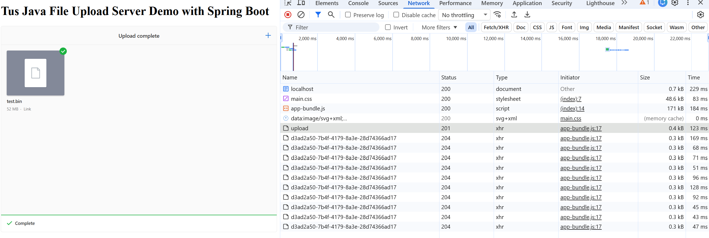

### Info

replica of [tus-java-server-spring-demo](https://github.com/tomdesair/tus-java-server-spring-demo) 
and [tus-java-server](https://github.com/tomdesair/tus-java-server)
with minimal twaks to trigger chunking and logging added
server side

### Intro

[Uppy](https://uppy.io/) has excellent support for resumable, chunked uploads. It handles this primarily through the [Tus](https://tus.io/) protocol, which splits files into smaller chunks and sends them sequentially, ensuring that dropped connections or browser crashes don't force you to start from scratch


The __tus__ protocol was [created](https://tus.io/blog) in 2013 (the __tus 1.0__ was released in 2015) by the team at Transloadit (Kevin van Zonneveld and Tim Koschützki). It was designed as an open-source standard to allow resumable file uploads over HTTP, meaning large file transfers can be paused or recovered after network drops without restarting



The protocol has:

  - official specification
  - reference server
  - official JS client
  - official Java client
  - official Node server
  - iOS client
  - Android client
  - conformance testing tools
  - cloud storage integrations
  - documented production users including [Vimeo](https://en.wikipedia.org/wiki/Vimeo)


#### Publicly documented users

__Vimeo__

* Early adopter
* Contributor to protocol design
* Uses __TUS__ for large video uploads
* Uses __TUS__-related infrastructure internally as well

__Transloadit__

* Creator of __TUS__
* Uses it in production for its own upload/processing platform
* Reports moving very large volumes of uploaded content through the protocol

__San Diego Supercomputer Center__ (__SDSC__)

* Mentioned as having rolled out __TUS__ support for scientific data transfer workloads

Should one use a mature upload ecosystem instead of inventing one?

> NOTE: most Java shops do not expose Java as the public upload endpoint.  A very common architecture is:

```sh
Browser (Uppy)
        |
        v
TUS endpoint
        |
        v
S3 / Blob Storage
        |
        v
Java backend processing
```
 
### Usage

> NOTE: some of the original project workflow is currently unused (webpack, maven `frontend-maven-plugin` plugin pending replacement with `exec-maven-plugin` plugin). The `tus-java-server` source is not currently used - the jar is uploaded from [maven central](https://mvnrepository.com/artifact/me.desair.tus/tus-java-server)


```cmd
pushd uppy-file-upload
npm install
npm run build
copy /y target\classes\META-INF\resources\webjars\uppy-spring-file-upload\0.0.1-SNAPSHOT\app-bundle.js ..\spring-boot-rest\src\main\resources\public
popd
pushd spring-boot-rest
mvn clean spring-boot:run
```
navigate to `http://localhost:8080`

```sh
dd if=/dev/urandom of=test.bin bs=1M count=100
```
Processing the TUS upload

The server logs
```text
2026-06-12 17:15:03.236 DEBUG 15800 --- [nio-8080-exec-1] o.s.w.f.CommonsRequestLoggingFilter      : Before request [HEAD /api/upload/3704fec5-1362-49b1-a379-0b323328e4a6, client=0:0:0:0:0:0:0:1, headers=[host:"localhost:8080", connection:"keep-alive", sec-ch-ua-platform:""Windows"", tus-resumable:"1.0.0", user-agent:"Mozilla/5.0 (Windows NT 10.0; Win64; x64) AppleWebKit/537.36 (KHTML, like Gecko) Chrome/149.0.0.0 Safari/537.36", sec-ch-ua:""Google Chrome";v="149", "Chromium";v="149", "Not)A;Brand";v="24"", sec-ch-ua-mobile:"?0", accept:"*/*", sec-fetch-site:"same-origin", sec-fetch-mode:"cors", sec-fetch-dest:"empty", referer:"http://localhost:8080/", accept-encoding:"gzip, deflate, br, zstd", accept-language:"en-US,en;q=0.9"]]
2026-06-12 17:15:03.262  WARN 15800 --- [nio-8080-exec-1] m.d.tus.server.TusFileUploadService      : Unable to process request HEAD http://localhost:8080/api/upload/3704fec5-1362-49b1-a379-0b323328e4a6. Sent response status 404 with message "The upload for path /api/upload/3704fec5-1362-49b1-a379-0b323328e4a6 and owner null was not found."
2026-06-12 17:15:03.272 DEBUG 15800 --- [nio-8080-exec-1] o.s.w.f.CommonsRequestLoggingFilter      : After request [HEAD /api/upload/3704fec5-1362-49b1-a379-0b323328e4a6, client=0:0:0:0:0:0:0:1, headers=[host:"localhost:8080", connection:"keep-alive", sec-ch-ua-platform:""Windows"", tus-resumable:"1.0.0", user-agent:"Mozilla/5.0 (Windows NT 10.0; Win64; x64) AppleWebKit/537.36 (KHTML, like Gecko) Chrome/149.0.0.0 Safari/537.36", sec-ch-ua:""Google Chrome";v="149", "Chromium";v="149", "Not)A;Brand";v="24"", sec-ch-ua-mobile:"?0", accept:"*/*", sec-fetch-site:"same-origin", sec-fetch-mode:"cors", sec-fetch-dest:"empty", referer:"http://localhost:8080/", accept-encoding:"gzip, deflate, br, zstd", accept-language:"en-US,en;q=0.9"]]
2026-06-12 17:15:03.331 DEBUG 15800 --- [nio-8080-exec-2] o.s.w.f.CommonsRequestLoggingFilter      : Before request [POST /api/upload, client=0:0:0:0:0:0:0:1, headers=[host:"localhost:8080", connection:"keep-alive", content-length:"0", sec-ch-ua-platform:""Windows"", tus-resumable:"1.0.0", user-agent:"Mozilla/5.0 (Windows NT 10.0; Win64; x64) AppleWebKit/537.36 (KHTML, like Gecko) Chrome/149.0.0.0 Safari/537.36", upload-length:"209715200", sec-ch-ua:""Google Chrome";v="149", "Chromium";v="149", "Not)A;Brand";v="24"", upload-metadata:"relativePath bnVsbA==,name dGVzdC5iaW4=,type YXBwbGljYXRpb24vb2N0ZXQtc3RyZWFt,filetype YXBwbGljYXRpb24vb2N0ZXQtc3RyZWFt,filename dGVzdC5iaW4=", sec-ch-ua-mobile:"?0", accept:"*/*", origin:"http://localhost:8080", sec-fetch-site:"same-origin", sec-fetch-mode:"cors", sec-fetch-dest:"empty", referer:"http://localhost:8080/", accept-encoding:"gzip, deflate, br, zstd", accept-language:"en-US,en;q=0.9"]]
2026-06-12 17:15:03.338  INFO 15800 --- [nio-8080-exec-2] m.d.t.s.c.CreationPostRequestHandler     : Created upload with ID d7d31ad7-e4cf-46cc-b837-a1de53ba4487 at 1781298903333 for ip address 0:0:0:0:0:0:0:1 with location /api/upload/d7d31ad7-e4cf-46cc-b837-a1de53ba4487
2026-06-12 19:04:25.106  INFO 3008 --- [nio-8080-exec-4] example.controller.FileUploadController  : upload complete
2026-06-12 19:04:25.126  INFO 3008 --- [nio-8080-exec-4] example.controller.FileUploadController  : info: id: d7d31ad7-e4cf-46cc-b837-a1de53ba4487 filename: test.bin local path: C:\Users\kouzm\AppData\Local\Temp\tus\uploads\d7d31ad7-e4cf-46cc-b837-a1de53ba4487\data
```
the code in the client example to read that information:

```java
	@Autowired
	private Environment env;

	@RequestMapping(value = { "", "/**" }, method = { RequestMethod.POST, RequestMethod.PATCH, RequestMethod.HEAD,
			RequestMethod.DELETE, RequestMethod.OPTIONS, RequestMethod.GET })
	public void processUpload(final HttpServletRequest servletRequest, final HttpServletResponse servletResponse)
			throws IOException, TusException {
		tusFileUploadService.process(servletRequest, servletResponse);
		UploadInfo info = tusFileUploadService.getUploadInfo(servletRequest.getRequestURI());
		logger.info("info: id: {} filename: {} local path: {}", info.getId(), info.getFileName(),
					tusStorageResolver.resolve(info));


```
the file is found under `${java.tmpdir}/$ID`:
```text
Directory of C:\Users\kouzm\AppData\Local\Temp\tus\uploads\d7d31ad7-e4cf-46cc-b837-a1de53ba4487

06/12/2026  05:15 PM       209,715,200 data
```

it is the same file:
```cmd
pushd %TEMP%
sha256sum.exe tus\uploads\d7d31ad7-e4cf-46cc-b837-a1de53ba4487\data
```
```text
\f8ebb932e2dab47e96c90260e2a0539bb14f92f8b909c6de6304eb4a2c2e68de *tus\\uploads\\d7d31ad7-e4cf-46cc-b837-a1de53ba4487\\data
```
```sh
$ sha256sum test.bin
f8ebb932e2dab47e96c90260e2a0539bb14f92f8b909c6de6304eb4a2c2e68de *test.bin
```
### Background

With a tus upload, the interesting part is not the usual Spring MVC controller logging because the upload is handled by the `TusFileUploadService` directly through the `servlet` `request`/`response` objects. The protocol consists of multiple HTTP requests:

  * `OPTIONS` `/api/upload`
  * `POST` `/api/upload` (create upload)
  * `HEAD` `/api/upload/{id}` (query offset)
  * `PATCH` `/api/upload/{id}` (upload chunk)
  * additional `HEAD` / `PATCH` cycles until completion.

To see these requests, I would start with a request logging filter
{endpoint:"http://localhost:8080/api/upload"

```
2026-06-09 19:53:41.782  INFO 19720 --- [  restartedMain] me.desair.spring.tus.App                 : Starting App on sergueik59 with PID 19720 (C:\developer\sergueik\springboot_study\basic-uppy-tus\spring-boot-rest\target\classes started by kouzm in C:\developer\sergueik\springboot_study\basic-uppy-tus\spring-boot-rest)
2026-06-09 19:53:41.790  INFO 19720 --- [  restartedMain] me.desair.spring.tus.App                 : The following profiles are active: dev
2026-06-09 19:53:41.889  INFO 19720 --- [  restartedMain] .e.DevToolsPropertyDefaultsPostProcessor : Devtools property defaults active! Set 'spring.devtools.add-properties' to 'false' to disable
2026-06-09 19:53:41.890  INFO 19720 --- [  restartedMain] .e.DevToolsPropertyDefaultsPostProcessor : For additional web related logging consider setting the 'logging.level.web' property to 'DEBUG'
2026-06-09 19:53:44.002  INFO 19720 --- [  restartedMain] o.s.b.w.embedded.tomcat.TomcatWebServer  : Tomcat initialized with port(s): 8080 (http)
2026-06-09 19:53:44.029  INFO 19720 --- [  restartedMain] o.apache.catalina.core.StandardService   : Starting service [Tomcat]
2026-06-09 19:53:44.030  INFO 19720 --- [  restartedMain] org.apache.catalina.core.StandardEngine  : Starting Servlet engine: [Apache Tomcat/9.0.38]
2026-06-09 19:53:44.203  INFO 19720 --- [  restartedMain] o.a.c.c.C.[Tomcat].[localhost].[/]       : Initializing Spring embedded WebApplicationContext
2026-06-09 19:53:44.205  INFO 19720 --- [  restartedMain] w.s.c.ServletWebServerApplicationContext : Root WebApplicationContext: initialization completed in 2312 ms
2026-06-09 19:53:44.280 DEBUG 19720 --- [  restartedMain] o.s.w.f.CommonsRequestLoggingFilter      : Filter 'requestLoggingFilter' configured for use
2026-06-09 19:53:44.592  INFO 19720 --- [  restartedMain] o.s.s.concurrent.ThreadPoolTaskExecutor  : Initializing ExecutorService 'applicationTaskExecutor'
2026-06-09 19:53:44.693  INFO 19720 --- [  restartedMain] o.s.b.a.w.s.WelcomePageHandlerMapping    : Adding welcome page: class path resource [public/index.html]
2026-06-09 19:53:44.819  INFO 19720 --- [  restartedMain] o.s.b.d.a.OptionalLiveReloadServer       : LiveReload server is running on port 35729
2026-06-09 19:53:44.889  INFO 19720 --- [  restartedMain] o.s.b.w.embedded.tomcat.TomcatWebServer  : Tomcat started on port(s): 8080 (http) with context path ''
2026-06-09 19:53:44.908  INFO 19720 --- [  restartedMain] me.desair.spring.tus.App                 : =======================================
2026-06-09 19:53:44.910  INFO 19720 --- [  restartedMain] me.desair.spring.tus.App                 : App running with active profiles: dev
2026-06-09 19:53:44.917  INFO 19720 --- [  restartedMain] me.desair.spring.tus.App                 : =======================================
2026-06-09 19:53:44.930  INFO 19720 --- [  restartedMain] me.desair.spring.tus.App                 : Started App in 4.155 seconds (JVM running for 5.039)
```
after file upload starts the log shows:
```
2026-06-09 19:56:41.053 DEBUG 25120 --- [nio-8080-exec-6] o.s.w.f.CommonsRequestLoggingFilter      : Before request [POST /api/upload, client=0:0:0:0:0:0:0:1, headers=[host:"localhost:8080", connection:"keep-alive", content-length:"0", sec-ch-ua-platform:""Windows"", tus-resumable:"1.0.0", user-agent:"Mozilla/5.0 (Windows NT 10.0; Win64; x64) AppleWebKit/537.36 (KHTML, like Gecko) Chrome/148.0.0.0 Safari/537.36", upload-length:"52428800", sec-ch-ua:""Chromium";v="148", "Google Chrome";v="148", "Not/A)Brand";v="99"", upload-metadata:"relativePath bnVsbA==,name dGVzdC5iaW4=,type YXBwbGljYXRpb24vb2N0ZXQtc3RyZWFt,filetype YXBwbGljYXRpb24vb2N0ZXQtc3RyZWFt,filename dGVzdC5iaW4=", sec-ch-ua-mobile:"?0", accept:"*/*", origin:"http://localhost:8080", sec-fetch-site:"same-origin", sec-fetch-mode:"cors", sec-fetch-dest:"empty", referer:"http://localhost:8080/", accept-encoding:"gzip, deflate, br, zstd", accept-language:"en-US,en;q=0.9"]]
2026-06-09 19:56:41.243  INFO 25120 --- [nio-8080-exec-6] m.d.t.s.c.CreationPostRequestHandler     : Created upload with ID 76494ffe-ba65-49af-8d4a-f60f045ad76a at 1781049401170 for ip address 0:0:0:0:0:0:0:1 with location /api/upload/76494ffe-ba65-49af-8d4a-f60f045ad76a
2026-06-09 19:56:41.251 DEBUG 25120 --- [nio-8080-exec-6] o.s.w.f.CommonsRequestLoggingFilter      : After request [POST /api/upload, client=0:0:0:0:0:0:0:1, headers=[host:"localhost:8080", connection:"keep-alive", content-length:"0", sec-ch-ua-platform:""Windows"", tus-resumable:"1.0.0", user-agent:"Mozilla/5.0 (Windows NT 10.0; Win64; x64) AppleWebKit/537.36 (KHTML, like Gecko) Chrome/148.0.0.0 Safari/537.36", upload-length:"52428800", sec-ch-ua:""Chromium";v="148", "Google Chrome";v="148", "Not/A)Brand";v="99"", upload-metadata:"relativePath bnVsbA==,name dGVzdC5iaW4=,type YXBwbGljYXRpb24vb2N0ZXQtc3RyZWFt,filetype YXBwbGljYXRpb24vb2N0ZXQtc3RyZWFt,filename dGVzdC5iaW4=", sec-ch-ua-mobile:"?0", accept:"*/*", origin:"http://localhost:8080", sec-fetch-site:"same-origin", sec-fetch-mode:"cors", sec-fetch-dest:"empty", referer:"http://localhost:8080/", accept-encoding:"gzip, deflate, br, zstd", accept-language:"en-US,en;q=0.9"]]
2026-06-09 19:56:41.289 DEBUG 25120 --- [nio-8080-exec-4] o.s.w.f.CommonsRequestLoggingFilter      : Before request [PATCH /api/upload/76494ffe-ba65-49af-8d4a-f60f045ad76a, client=0:0:0:0:0:0:0:1, headers=[host:"localhost:8080", connection:"keep-alive", content-length:"52428800", sec-ch-ua-platform:""Windows"", tus-resumable:"1.0.0", user-agent:"Mozilla/5.0 (Windows NT 10.0; Win64; x64) AppleWebKit/537.36 (KHTML, like Gecko) Chrome/148.0.0.0 Safari/537.36", sec-ch-ua:""Chromium";v="148", "Google Chrome";v="148", "Not/A)Brand";v="99"", upload-offset:"0", sec-ch-ua-mobile:"?0", accept:"*/*", origin:"http://localhost:8080", sec-fetch-site:"same-origin", sec-fetch-mode:"cors", sec-fetch-dest:"empty", referer:"http://localhost:8080/", accept-encoding:"gzip, deflate, br, zstd", accept-language:"en-US,en;q=0.9", Content-Type:"application/offset+octet-stream;charset=UTF-8"]]
2026-06-09 19:56:42.504  INFO 25120 --- [nio-8080-exec-4] m.d.t.s.core.CorePatchRequestHandler     : Upload with ID 76494ffe-ba65-49af-8d4a-f60f045ad76a at location /api/upload/76494ffe-ba65-49af-8d4a-f60f045ad76a finished successfully
2026-06-09 19:56:42.514 DEBUG 25120 --- [nio-8080-exec-4] o.s.w.f.CommonsRequestLoggingFilter      : After request [PATCH /api/upload/76494ffe-ba65-49af-8d4a-f60f045ad76a, client=0:0:0:0:0:0:0:1, headers=[host:"localhost:8080", connection:"keep-alive", content-length:"52428800", sec-ch-ua-platform:""Windows"", tus-resumable:"1.0.0", user-agent:"Mozilla/5.0 (Windows NT 10.0; Win64; x64) AppleWebKit/537.36 (KHTML, like Gecko) Chrome/148.0.0.0 Safari/537.36", sec-ch-ua:""Chromium";v="148", "Google Chrome";v="148", "Not/A)Brand";v="99"", upload-offset:"0", sec-ch-ua-mobile:"?0", accept:"*/*", origin:"http://localhost:8080", sec-fetch-site:"same-origin", sec-fetch-mode:"cors", sec-fetch-dest:"empty", referer:"http://localhost:8080/", accept-encoding:"gzip, deflate, br, zstd", accept-language:"en-US,en;q=0.9", Content-Type:"application/offset+octet-stream;charset=UTF-8"]]
```

there is only one Upload-Offset

because the file was only 50MB

Patched the client
```javascript
    .use(Tus, { endpoint: 'http://localhost:8080/api/upload', chunkSize: 5 * 1024 * 1024  })

```

and observe TUS protocol in action:
```text

.   ____          _            __ _ _
 /\\ / ___'_ __ _ _(_)_ __  __ _ \ \ \ \
( ( )\___ | '_ | '_| | '_ \/ _` | \ \ \ \
 \\/  ___)| |_)| | | | | || (_| |  ) ) ) )
  '  |____| .__|_| |_|_| |_\__, | / / / /
 =========|_|==============|___/=/_/_/_/
 :: Spring Boot ::        (v2.3.4.RELEASE)

2026-06-09 20:08:19.196  INFO 23540 --- [  restartedMain] me.desair.spring.tus.App                 : Starting App on sergueik59 with PID 23540 (C:\developer\sergueik\springboot_study\basic-uppy-tus\spring-boot-rest\target\classes started by kouzm in C:\developer\sergueik\springboot_study\basic-uppy-tus\spring-boot-rest)
2026-06-09 20:08:19.197  INFO 23540 --- [  restartedMain] me.desair.spring.tus.App                 : The following profiles are active: dev
2026-06-09 20:08:19.227  INFO 23540 --- [  restartedMain] .e.DevToolsPropertyDefaultsPostProcessor : Devtools property defaults active! Set 'spring.devtools.add-properties' to 'false' to disable
2026-06-09 20:08:19.227  INFO 23540 --- [  restartedMain] .e.DevToolsPropertyDefaultsPostProcessor : For additional web related logging consider setting the 'logging.level.web' property to 'DEBUG'
2026-06-09 20:08:19.880  INFO 23540 --- [  restartedMain] o.s.b.w.embedded.tomcat.TomcatWebServer  : Tomcat initialized with port(s): 8080 (http)
2026-06-09 20:08:19.887  INFO 23540 --- [  restartedMain] o.apache.catalina.core.StandardService   : Starting service [Tomcat]
2026-06-09 20:08:19.888  INFO 23540 --- [  restartedMain] org.apache.catalina.core.StandardEngine  : Starting Servlet engine: [Apache Tomcat/9.0.38]
2026-06-09 20:08:19.934  INFO 23540 --- [  restartedMain] o.a.c.c.C.[Tomcat].[localhost].[/]       : Initializing Spring embedded WebApplicationContext
2026-06-09 20:08:19.937  INFO 23540 --- [  restartedMain] w.s.c.ServletWebServerApplicationContext : Root WebApplicationContext: initialization completed in 709 ms
2026-06-09 20:08:19.971 DEBUG 23540 --- [  restartedMain] o.s.w.f.CommonsRequestLoggingFilter      : Filter 'requestLoggingFilter' configured for use
2026-06-09 20:08:20.083  INFO 23540 --- [  restartedMain] o.s.s.concurrent.ThreadPoolTaskExecutor  : Initializing ExecutorService 'applicationTaskExecutor'
2026-06-09 20:08:20.117  INFO 23540 --- [  restartedMain] o.s.b.a.w.s.WelcomePageHandlerMapping    : Adding welcome page: class path resource [public/index.html]
2026-06-09 20:08:20.157  INFO 23540 --- [  restartedMain] o.s.b.d.a.OptionalLiveReloadServer       : LiveReload server is running on port 35729
2026-06-09 20:08:20.180  INFO 23540 --- [  restartedMain] o.s.b.w.embedded.tomcat.TomcatWebServer  : Tomcat started on port(s): 8080 (http) with context path ''
2026-06-09 20:08:20.185  INFO 23540 --- [  restartedMain] me.desair.spring.tus.App                 : =======================================
2026-06-09 20:08:20.185  INFO 23540 --- [  restartedMain] me.desair.spring.tus.App                 : App running with active profiles: dev
2026-06-09 20:08:20.186  INFO 23540 --- [  restartedMain] me.desair.spring.tus.App                 : =======================================
2026-06-09 20:08:20.189  INFO 23540 --- [  restartedMain] me.desair.spring.tus.App                 : Started App in 1.234 seconds (JVM running for 1.515)
2026-06-09 20:08:48.182  INFO 23540 --- [nio-8080-exec-1] o.a.c.c.C.[Tomcat].[localhost].[/]       : Initializing Spring DispatcherServlet 'dispatcherServlet'
2026-06-09 20:08:48.187  INFO 23540 --- [nio-8080-exec-1] o.s.web.servlet.DispatcherServlet        : Initializing Servlet 'dispatcherServlet'
2026-06-09 20:08:48.211  INFO 23540 --- [nio-8080-exec-1] o.s.web.servlet.DispatcherServlet        : Completed initialization in 21 ms
...
2026-06-09 20:09:05.471 DEBUG 23540 --- [nio-8080-exec-5] o.s.w.f.CommonsRequestLoggingFilter      : Before request [POST /api/upload, client=0:0:0:0:0:0:0:1, headers=[host:"localhost:8080", connection:"keep-alive", content-length:"0", sec-ch-ua-platform:""Windows"", tus-resumable:"1.0.0", user-agent:"Mozilla/5.0 (Windows NT 10.0; Win64; x64) AppleWebKit/537.36 (KHTML, like Gecko) Chrome/148.0.0.0 Safari/537.36", upload-length:"52428800", sec-ch-ua:""Chromium";v="148", "Google Chrome";v="148", "Not/A)Brand";v="99"", upload-metadata:"relativePath bnVsbA==,name dGVzdC5iaW4=,type YXBwbGljYXRpb24vb2N0ZXQtc3RyZWFt,filetype YXBwbGljYXRpb24vb2N0ZXQtc3RyZWFt,filename dGVzdC5iaW4=", sec-ch-ua-mobile:"?0", accept:"*/*", origin:"http://localhost:8080", sec-fetch-site:"same-origin", sec-fetch-mode:"cors", sec-fetch-dest:"empty", referer:"http://localhost:8080/", accept-encoding:"gzip, deflate, br, zstd", accept-language:"en-US,en;q=0.9"]]
2026-06-09 20:09:05.568  INFO 23540 --- [nio-8080-exec-5] m.d.t.s.c.CreationPostRequestHandler     : Created upload with ID d3ad2a50-7b4f-4179-8a3e-28d74366ad17 at 1781050145527 for ip address 0:0:0:0:0:0:0:1 with location /api/upload/d3ad2a50-7b4f-4179-8a3e-28d74366ad17
2026-06-09 20:09:05.571 DEBUG 23540 --- [nio-8080-exec-5] o.s.w.f.CommonsRequestLoggingFilter      : After request [POST /api/upload, client=0:0:0:0:0:0:0:1, headers=[host:"localhost:8080", connection:"keep-alive", content-length:"0", sec-ch-ua-platform:""Windows"", tus-resumable:"1.0.0", user-agent:"Mozilla/5.0 (Windows NT 10.0; Win64; x64) AppleWebKit/537.36 (KHTML, like Gecko) Chrome/148.0.0.0 Safari/537.36", upload-length:"52428800", sec-ch-ua:""Chromium";v="148", "Google Chrome";v="148", "Not/A)Brand";v="99"", upload-metadata:"relativePath bnVsbA==,name dGVzdC5iaW4=,type YXBwbGljYXRpb24vb2N0ZXQtc3RyZWFt,filetype YXBwbGljYXRpb24vb2N0ZXQtc3RyZWFt,filename dGVzdC5iaW4=", sec-ch-ua-mobile:"?0", accept:"*/*", origin:"http://localhost:8080", sec-fetch-site:"same-origin", sec-fetch-mode:"cors", sec-fetch-dest:"empty", referer:"http://localhost:8080/", accept-encoding:"gzip, deflate, br, zstd", accept-language:"en-US,en;q=0.9"]]
2026-06-09 20:09:05.584 DEBUG 23540 --- [nio-8080-exec-9] o.s.w.f.CommonsRequestLoggingFilter      : Before request [PATCH /api/upload/d3ad2a50-7b4f-4179-8a3e-28d74366ad17, client=0:0:0:0:0:0:0:1, headers=[host:"localhost:8080", connection:"keep-alive", content-length:"5242880", sec-ch-ua-platform:""Windows"", tus-resumable:"1.0.0", user-agent:"Mozilla/5.0 (Windows NT 10.0; Win64; x64) AppleWebKit/537.36 (KHTML, like Gecko) Chrome/148.0.0.0 Safari/537.36", sec-ch-ua:""Chromium";v="148", "Google Chrome";v="148", "Not/A)Brand";v="99"", upload-offset:"0", sec-ch-ua-mobile:"?0", accept:"*/*", origin:"http://localhost:8080", sec-fetch-site:"same-origin", sec-fetch-mode:"cors", sec-fetch-dest:"empty", referer:"http://localhost:8080/", accept-encoding:"gzip, deflate, br, zstd", accept-language:"en-US,en;q=0.9", Content-Type:"application/offset+octet-stream;charset=UTF-8"]]
2026-06-09 20:09:05.748 DEBUG 23540 --- [nio-8080-exec-9] o.s.w.f.CommonsRequestLoggingFilter      : After request [PATCH /api/upload/d3ad2a50-7b4f-4179-8a3e-28d74366ad17, client=0:0:0:0:0:0:0:1, headers=[host:"localhost:8080", connection:"keep-alive", content-length:"5242880", sec-ch-ua-platform:""Windows"", tus-resumable:"1.0.0", user-agent:"Mozilla/5.0 (Windows NT 10.0; Win64; x64) AppleWebKit/537.36 (KHTML, like Gecko) Chrome/148.0.0.0 Safari/537.36", sec-ch-ua:""Chromium";v="148", "Google Chrome";v="148", "Not/A)Brand";v="99"", upload-offset:"0", sec-ch-ua-mobile:"?0", accept:"*/*", origin:"http://localhost:8080", sec-fetch-site:"same-origin", sec-fetch-mode:"cors", sec-fetch-dest:"empty", referer:"http://localhost:8080/", accept-encoding:"gzip, deflate, br, zstd", accept-language:"en-US,en;q=0.9", Content-Type:"application/offset+octet-stream;charset=UTF-8"]]
2026-06-09 20:09:05.755 DEBUG 23540 --- [nio-8080-exec-7] o.s.w.f.CommonsRequestLoggingFilter      : Before request [PATCH /api/upload/d3ad2a50-7b4f-4179-8a3e-28d74366ad17, client=0:0:0:0:0:0:0:1, headers=[host:"localhost:8080", connection:"keep-alive", content-length:"5242880", sec-ch-ua-platform:""Windows"", tus-resumable:"1.0.0", user-agent:"Mozilla/5.0 (Windows NT 10.0; Win64; x64) AppleWebKit/537.36 (KHTML, like Gecko) Chrome/148.0.0.0 Safari/537.36", sec-ch-ua:""Chromium";v="148", "Google Chrome";v="148", "Not/A)Brand";v="99"", upload-offset:"5242880", sec-ch-ua-mobile:"?0", accept:"*/*", origin:"http://localhost:8080", sec-fetch-site:"same-origin", sec-fetch-mode:"cors", sec-fetch-dest:"empty", referer:"http://localhost:8080/", accept-encoding:"gzip, deflate, br, zstd", accept-language:"en-US,en;q=0.9", Content-Type:"application/offset+octet-stream;charset=UTF-8"]]
2026-06-09 20:09:05.818 DEBUG 23540 --- [nio-8080-exec-7] o.s.w.f.CommonsRequestLoggingFilter      : After request [PATCH /api/upload/d3ad2a50-7b4f-4179-8a3e-28d74366ad17, client=0:0:0:0:0:0:0:1, headers=[host:"localhost:8080", connection:"keep-alive", content-length:"5242880", sec-ch-ua-platform:""Windows"", tus-resumable:"1.0.0", user-agent:"Mozilla/5.0 (Windows NT 10.0; Win64; x64) AppleWebKit/537.36 (KHTML, like Gecko) Chrome/148.0.0.0 Safari/537.36", sec-ch-ua:""Chromium";v="148", "Google Chrome";v="148", "Not/A)Brand";v="99"", upload-offset:"5242880", sec-ch-ua-mobile:"?0", accept:"*/*", origin:"http://localhost:8080", sec-fetch-site:"same-origin", sec-fetch-mode:"cors", sec-fetch-dest:"empty", referer:"http://localhost:8080/", accept-encoding:"gzip, deflate, br, zstd", accept-language:"en-US,en;q=0.9", Content-Type:"application/offset+octet-stream;charset=UTF-8"]]
2026-06-09 20:09:05.828 DEBUG 23540 --- [nio-8080-exec-8] o.s.w.f.CommonsRequestLoggingFilter      : Before request [PATCH /api/upload/d3ad2a50-7b4f-4179-8a3e-28d74366ad17, client=0:0:0:0:0:0:0:1, headers=[host:"localhost:8080", connection:"keep-alive", content-length:"5242880", sec-ch-ua-platform:""Windows"", tus-resumable:"1.0.0", user-agent:"Mozilla/5.0 (Windows NT 10.0; Win64; x64) AppleWebKit/537.36 (KHTML, like Gecko) Chrome/148.0.0.0 Safari/537.36", sec-ch-ua:""Chromium";v="148", "Google Chrome";v="148", "Not/A)Brand";v="99"", upload-offset:"10485760", sec-ch-ua-mobile:"?0", accept:"*/*", origin:"http://localhost:8080", sec-fetch-site:"same-origin", sec-fetch-mode:"cors", sec-fetch-dest:"empty", referer:"http://localhost:8080/", accept-encoding:"gzip, deflate, br, zstd", accept-language:"en-US,en;q=0.9", Content-Type:"application/offset+octet-stream;charset=UTF-8"]]
2026-06-09 20:09:05.892 DEBUG 23540 --- [nio-8080-exec-8] o.s.w.f.CommonsRequestLoggingFilter      : After request [PATCH /api/upload/d3ad2a50-7b4f-4179-8a3e-28d74366ad17, client=0:0:0:0:0:0:0:1, headers=[host:"localhost:8080", connection:"keep-alive", content-length:"5242880", sec-ch-ua-platform:""Windows"", tus-resumable:"1.0.0", user-agent:"Mozilla/5.0 (Windows NT 10.0; Win64; x64) AppleWebKit/537.36 (KHTML, like Gecko) Chrome/148.0.0.0 Safari/537.36", sec-ch-ua:""Chromium";v="148", "Google Chrome";v="148", "Not/A)Brand";v="99"", upload-offset:"10485760", sec-ch-ua-mobile:"?0", accept:"*/*", origin:"http://localhost:8080", sec-fetch-site:"same-origin", sec-fetch-mode:"cors", sec-fetch-dest:"empty", referer:"http://localhost:8080/", accept-encoding:"gzip, deflate, br, zstd", accept-language:"en-US,en;q=0.9", Content-Type:"application/offset+octet-stream;charset=UTF-8"]]
2026-06-09 20:09:05.901 DEBUG 23540 --- [nio-8080-exec-6] o.s.w.f.CommonsRequestLoggingFilter      : Before request [PATCH /api/upload/d3ad2a50-7b4f-4179-8a3e-28d74366ad17, client=0:0:0:0:0:0:0:1, headers=[host:"localhost:8080", connection:"keep-alive", content-length:"5242880", sec-ch-ua-platform:""Windows"", tus-resumable:"1.0.0", user-agent:"Mozilla/5.0 (Windows NT 10.0; Win64; x64) AppleWebKit/537.36 (KHTML, like Gecko) Chrome/148.0.0.0 Safari/537.36", sec-ch-ua:""Chromium";v="148", "Google Chrome";v="148", "Not/A)Brand";v="99"", upload-offset:"15728640", sec-ch-ua-mobile:"?0", accept:"*/*", origin:"http://localhost:8080", sec-fetch-site:"same-origin", sec-fetch-mode:"cors", sec-fetch-dest:"empty", referer:"http://localhost:8080/", accept-encoding:"gzip, deflate, br, zstd", accept-language:"en-US,en;q=0.9", Content-Type:"application/offset+octet-stream;charset=UTF-8"]]
2026-06-09 20:09:05.945 DEBUG 23540 --- [nio-8080-exec-6] o.s.w.f.CommonsRequestLoggingFilter      : After request [PATCH /api/upload/d3ad2a50-7b4f-4179-8a3e-28d74366ad17, client=0:0:0:0:0:0:0:1, headers=[host:"localhost:8080", connection:"keep-alive", content-length:"5242880", sec-ch-ua-platform:""Windows"", tus-resumable:"1.0.0", user-agent:"Mozilla/5.0 (Windows NT 10.0; Win64; x64) AppleWebKit/537.36 (KHTML, like Gecko) Chrome/148.0.0.0 Safari/537.36", sec-ch-ua:""Chromium";v="148", "Google Chrome";v="148", "Not/A)Brand";v="99"", upload-offset:"15728640", sec-ch-ua-mobile:"?0", accept:"*/*", origin:"http://localhost:8080", sec-fetch-site:"same-origin", sec-fetch-mode:"cors", sec-fetch-dest:"empty", referer:"http://localhost:8080/", accept-encoding:"gzip, deflate, br, zstd", accept-language:"en-US,en;q=0.9", Content-Type:"application/offset+octet-stream;charset=UTF-8"]]
2026-06-09 20:09:05.954 DEBUG 23540 --- [io-8080-exec-10] o.s.w.f.CommonsRequestLoggingFilter      : Before request [PATCH /api/upload/d3ad2a50-7b4f-4179-8a3e-28d74366ad17, client=0:0:0:0:0:0:0:1, headers=[host:"localhost:8080", connection:"keep-alive", content-length:"5242880", sec-ch-ua-platform:""Windows"", tus-resumable:"1.0.0", user-agent:"Mozilla/5.0 (Windows NT 10.0; Win64; x64) AppleWebKit/537.36 (KHTML, like Gecko) Chrome/148.0.0.0 Safari/537.36", sec-ch-ua:""Chromium";v="148", "Google Chrome";v="148", "Not/A)Brand";v="99"", upload-offset:"20971520", sec-ch-ua-mobile:"?0", accept:"*/*", origin:"http://localhost:8080", sec-fetch-site:"same-origin", sec-fetch-mode:"cors", sec-fetch-dest:"empty", referer:"http://localhost:8080/", accept-encoding:"gzip, deflate, br, zstd", accept-language:"en-US,en;q=0.9", Content-Type:"application/offset+octet-stream;charset=UTF-8"]]
2026-06-09 20:09:06.040 DEBUG 23540 --- [io-8080-exec-10] o.s.w.f.CommonsRequestLoggingFilter      : After request [PATCH /api/upload/d3ad2a50-7b4f-4179-8a3e-28d74366ad17, client=0:0:0:0:0:0:0:1, headers=[host:"localhost:8080", connection:"keep-alive", content-length:"5242880", sec-ch-ua-platform:""Windows"", tus-resumable:"1.0.0", user-agent:"Mozilla/5.0 (Windows NT 10.0; Win64; x64) AppleWebKit/537.36 (KHTML, like Gecko) Chrome/148.0.0.0 Safari/537.36", sec-ch-ua:""Chromium";v="148", "Google Chrome";v="148", "Not/A)Brand";v="99"", upload-offset:"20971520", sec-ch-ua-mobile:"?0", accept:"*/*", origin:"http://localhost:8080", sec-fetch-site:"same-origin", sec-fetch-mode:"cors", sec-fetch-dest:"empty", referer:"http://localhost:8080/", accept-encoding:"gzip, deflate, br, zstd", accept-language:"en-US,en;q=0.9", Content-Type:"application/offset+octet-stream;charset=UTF-8"]]
2026-06-09 20:09:06.057 DEBUG 23540 --- [nio-8080-exec-1] o.s.w.f.CommonsRequestLoggingFilter      : Before request [PATCH /api/upload/d3ad2a50-7b4f-4179-8a3e-28d74366ad17, client=0:0:0:0:0:0:0:1, headers=[host:"localhost:8080", connection:"keep-alive", content-length:"5242880", sec-ch-ua-platform:""Windows"", tus-resumable:"1.0.0", user-agent:"Mozilla/5.0 (Windows NT 10.0; Win64; x64) AppleWebKit/537.36 (KHTML, like Gecko) Chrome/148.0.0.0 Safari/537.36", sec-ch-ua:""Chromium";v="148", "Google Chrome";v="148", "Not/A)Brand";v="99"", upload-offset:"26214400", sec-ch-ua-mobile:"?0", accept:"*/*", origin:"http://localhost:8080", sec-fetch-site:"same-origin", sec-fetch-mode:"cors", sec-fetch-dest:"empty", referer:"http://localhost:8080/", accept-encoding:"gzip, deflate, br, zstd", accept-language:"en-US,en;q=0.9", Content-Type:"application/offset+octet-stream;charset=UTF-8"]]
2026-06-09 20:09:06.177 DEBUG 23540 --- [nio-8080-exec-1] o.s.w.f.CommonsRequestLoggingFilter      : After request [PATCH /api/upload/d3ad2a50-7b4f-4179-8a3e-28d74366ad17, client=0:0:0:0:0:0:0:1, headers=[host:"localhost:8080", connection:"keep-alive", content-length:"5242880", sec-ch-ua-platform:""Windows"", tus-resumable:"1.0.0", user-agent:"Mozilla/5.0 (Windows NT 10.0; Win64; x64) AppleWebKit/537.36 (KHTML, like Gecko) Chrome/148.0.0.0 Safari/537.36", sec-ch-ua:""Chromium";v="148", "Google Chrome";v="148", "Not/A)Brand";v="99"", upload-offset:"26214400", sec-ch-ua-mobile:"?0", accept:"*/*", origin:"http://localhost:8080", sec-fetch-site:"same-origin", sec-fetch-mode:"cors", sec-fetch-dest:"empty", referer:"http://localhost:8080/", accept-encoding:"gzip, deflate, br, zstd", accept-language:"en-US,en;q=0.9", Content-Type:"application/offset+octet-stream;charset=UTF-8"]]
2026-06-09 20:09:06.191 DEBUG 23540 --- [nio-8080-exec-3] o.s.w.f.CommonsRequestLoggingFilter      : Before request [PATCH /api/upload/d3ad2a50-7b4f-4179-8a3e-28d74366ad17, client=0:0:0:0:0:0:0:1, headers=[host:"localhost:8080", connection:"keep-alive", content-length:"5242880", sec-ch-ua-platform:""Windows"", tus-resumable:"1.0.0", user-agent:"Mozilla/5.0 (Windows NT 10.0; Win64; x64) AppleWebKit/537.36 (KHTML, like Gecko) Chrome/148.0.0.0 Safari/537.36", sec-ch-ua:""Chromium";v="148", "Google Chrome";v="148", "Not/A)Brand";v="99"", upload-offset:"31457280", sec-ch-ua-mobile:"?0", accept:"*/*", origin:"http://localhost:8080", sec-fetch-site:"same-origin", sec-fetch-mode:"cors", sec-fetch-dest:"empty", referer:"http://localhost:8080/", accept-encoding:"gzip, deflate, br, zstd", accept-language:"en-US,en;q=0.9", Content-Type:"application/offset+octet-stream;charset=UTF-8"]]
2026-06-09 20:09:06.271 DEBUG 23540 --- [nio-8080-exec-3] o.s.w.f.CommonsRequestLoggingFilter      : After request [PATCH /api/upload/d3ad2a50-7b4f-4179-8a3e-28d74366ad17, client=0:0:0:0:0:0:0:1, headers=[host:"localhost:8080", connection:"keep-alive", content-length:"5242880", sec-ch-ua-platform:""Windows"", tus-resumable:"1.0.0", user-agent:"Mozilla/5.0 (Windows NT 10.0; Win64; x64) AppleWebKit/537.36 (KHTML, like Gecko) Chrome/148.0.0.0 Safari/537.36", sec-ch-ua:""Chromium";v="148", "Google Chrome";v="148", "Not/A)Brand";v="99"", upload-offset:"31457280", sec-ch-ua-mobile:"?0", accept:"*/*", origin:"http://localhost:8080", sec-fetch-site:"same-origin", sec-fetch-mode:"cors", sec-fetch-dest:"empty", referer:"http://localhost:8080/", accept-encoding:"gzip, deflate, br, zstd", accept-language:"en-US,en;q=0.9", Content-Type:"application/offset+octet-stream;charset=UTF-8"]]
2026-06-09 20:09:06.279 DEBUG 23540 --- [nio-8080-exec-2] o.s.w.f.CommonsRequestLoggingFilter      : Before request [PATCH /api/upload/d3ad2a50-7b4f-4179-8a3e-28d74366ad17, client=0:0:0:0:0:0:0:1, headers=[host:"localhost:8080", connection:"keep-alive", content-length:"5242880", sec-ch-ua-platform:""Windows"", tus-resumable:"1.0.0", user-agent:"Mozilla/5.0 (Windows NT 10.0; Win64; x64) AppleWebKit/537.36 (KHTML, like Gecko) Chrome/148.0.0.0 Safari/537.36", sec-ch-ua:""Chromium";v="148", "Google Chrome";v="148", "Not/A)Brand";v="99"", upload-offset:"36700160", sec-ch-ua-mobile:"?0", accept:"*/*", origin:"http://localhost:8080", sec-fetch-site:"same-origin", sec-fetch-mode:"cors", sec-fetch-dest:"empty", referer:"http://localhost:8080/", accept-encoding:"gzip, deflate, br, zstd", accept-language:"en-US,en;q=0.9", Content-Type:"application/offset+octet-stream;charset=UTF-8"]]
2026-06-09 20:09:06.319 DEBUG 23540 --- [nio-8080-exec-2] o.s.w.f.CommonsRequestLoggingFilter      : After request [PATCH /api/upload/d3ad2a50-7b4f-4179-8a3e-28d74366ad17, client=0:0:0:0:0:0:0:1, headers=[host:"localhost:8080", connection:"keep-alive", content-length:"5242880", sec-ch-ua-platform:""Windows"", tus-resumable:"1.0.0", user-agent:"Mozilla/5.0 (Windows NT 10.0; Win64; x64) AppleWebKit/537.36 (KHTML, like Gecko) Chrome/148.0.0.0 Safari/537.36", sec-ch-ua:""Chromium";v="148", "Google Chrome";v="148", "Not/A)Brand";v="99"", upload-offset:"36700160", sec-ch-ua-mobile:"?0", accept:"*/*", origin:"http://localhost:8080", sec-fetch-site:"same-origin", sec-fetch-mode:"cors", sec-fetch-dest:"empty", referer:"http://localhost:8080/", accept-encoding:"gzip, deflate, br, zstd", accept-language:"en-US,en;q=0.9", Content-Type:"application/offset+octet-stream;charset=UTF-8"]]
2026-06-09 20:09:06.326 DEBUG 23540 --- [nio-8080-exec-4] o.s.w.f.CommonsRequestLoggingFilter      : Before request [PATCH /api/upload/d3ad2a50-7b4f-4179-8a3e-28d74366ad17, client=0:0:0:0:0:0:0:1, headers=[host:"localhost:8080", connection:"keep-alive", content-length:"5242880", sec-ch-ua-platform:""Windows"", tus-resumable:"1.0.0", user-agent:"Mozilla/5.0 (Windows NT 10.0; Win64; x64) AppleWebKit/537.36 (KHTML, like Gecko) Chrome/148.0.0.0 Safari/537.36", sec-ch-ua:""Chromium";v="148", "Google Chrome";v="148", "Not/A)Brand";v="99"", upload-offset:"41943040", sec-ch-ua-mobile:"?0", accept:"*/*", origin:"http://localhost:8080", sec-fetch-site:"same-origin", sec-fetch-mode:"cors", sec-fetch-dest:"empty", referer:"http://localhost:8080/", accept-encoding:"gzip, deflate, br, zstd", accept-language:"en-US,en;q=0.9", Content-Type:"application/offset+octet-stream;charset=UTF-8"]]
2026-06-09 20:09:06.365 DEBUG 23540 --- [nio-8080-exec-4] o.s.w.f.CommonsRequestLoggingFilter      : After request [PATCH /api/upload/d3ad2a50-7b4f-4179-8a3e-28d74366ad17, client=0:0:0:0:0:0:0:1, headers=[host:"localhost:8080", connection:"keep-alive", content-length:"5242880", sec-ch-ua-platform:""Windows"", tus-resumable:"1.0.0", user-agent:"Mozilla/5.0 (Windows NT 10.0; Win64; x64) AppleWebKit/537.36 (KHTML, like Gecko) Chrome/148.0.0.0 Safari/537.36", sec-ch-ua:""Chromium";v="148", "Google Chrome";v="148", "Not/A)Brand";v="99"", upload-offset:"41943040", sec-ch-ua-mobile:"?0", accept:"*/*", origin:"http://localhost:8080", sec-fetch-site:"same-origin", sec-fetch-mode:"cors", sec-fetch-dest:"empty", referer:"http://localhost:8080/", accept-encoding:"gzip, deflate, br, zstd", accept-language:"en-US,en;q=0.9", Content-Type:"application/offset+octet-stream;charset=UTF-8"]]
2026-06-09 20:09:06.370 DEBUG 23540 --- [nio-8080-exec-5] o.s.w.f.CommonsRequestLoggingFilter      : Before request [PATCH /api/upload/d3ad2a50-7b4f-4179-8a3e-28d74366ad17, client=0:0:0:0:0:0:0:1, headers=[host:"localhost:8080", connection:"keep-alive", content-length:"5242880", sec-ch-ua-platform:""Windows"", tus-resumable:"1.0.0", user-agent:"Mozilla/5.0 (Windows NT 10.0; Win64; x64) AppleWebKit/537.36 (KHTML, like Gecko) Chrome/148.0.0.0 Safari/537.36", sec-ch-ua:""Chromium";v="148", "Google Chrome";v="148", "Not/A)Brand";v="99"", upload-offset:"47185920", sec-ch-ua-mobile:"?0", accept:"*/*", origin:"http://localhost:8080", sec-fetch-site:"same-origin", sec-fetch-mode:"cors", sec-fetch-dest:"empty", referer:"http://localhost:8080/", accept-encoding:"gzip, deflate, br, zstd", accept-language:"en-US,en;q=0.9", Content-Type:"application/offset+octet-stream;charset=UTF-8"]]
2026-06-09 20:09:06.411  INFO 23540 --- [nio-8080-exec-5] m.d.t.s.core.CorePatchRequestHandler     : Upload with ID d3ad2a50-7b4f-4179-8a3e-28d74366ad17 at location /api/upload/d3ad2a50-7b4f-4179-8a3e-28d74366ad17 finished successfully
2026-06-09 20:09:06.413 DEBUG 23540 --- [nio-8080-exec-5] o.s.w.f.CommonsRequestLoggingFilter      : After request [PATCH /api/upload/d3ad2a50-7b4f-4179-8a3e-28d74366ad17, client=0:0:0:0:0:0:0:1, headers=[host:"localhost:8080", connection:"keep-alive", content-length:"5242880", sec-ch-ua-platform:""Windows"", tus-resumable:"1.0.0", user-agent:"Mozilla/5.0 (Windows NT 10.0; Win64; x64) AppleWebKit/537.36 (KHTML, like Gecko) Chrome/148.0.0.0 Safari/537.36", sec-ch-ua:""Chromium";v="148", "Google Chrome";v="148", "Not/A)Brand";v="99"", upload-offset:"47185920", sec-ch-ua-mobile:"?0", accept:"*/*", origin:"http://localhost:8080", sec-fetch-site:"same-origin", sec-fetch-mode:"cors", sec-fetch-dest:"empty", referer:"http://localhost:8080/", accept-encoding:"gzip, deflate, br, zstd", accept-language:"en-US,en;q=0.9", Content-Type:"application/offset+octet-stream;charset=UTF-8"]]
```
Server creates:
```
Location: /api/upload/$ID
```
(`ID` is `d3ad2a50-7b4f-4179-8a3e-28d74366ad17`)
Then a sequence of PATCH requests:
```
PATCH
Upload-Offset: 0
Content-Length: 5242880
```
followed by:
```
PATCH
Upload-Offset: 5242880
Content-Length: 5242880
```
then:
```
PATCH
Upload-Offset: 10485760
Content-Length: 5242880
```
and so on until:
```
Upload-Offset: 47185920
```
for the final chunk of a 50 MB file.

TUS upload is usually not initiated by uploading any file bytes. The first request is typically a resource creation request.

The simplest TUS flow is:

1. Create upload
```
POST /api/upload
Tus-Resumable: 1.0.0
Upload-Length: 1234567
Upload-Metadata: filename Zm9vLnppcA==
```
No file body is sent.

Server responds:
```
HTTP/1.1 201 Created
Location: /api/upload/d3ad2a50-7b4f-4179-8a3e-28d74366ad17
Tus-Resumable: 1.0.0
```
The important thing is the `Location` header.

At this point the server has created an upload resource but has received zero bytes.

2. Upload first chunk
```
PATCH /api/upload/d3ad2a50-7b4f-4179-8a3e-28d74366ad17
Tus-Resumable: 1.0.0
Content-Type: application/offset+octet-stream
Upload-Offset: 0
```
followed by
```
<binary bytes>
```
Server replies:
```
204 No Content
Upload-Offset: 5242880
```
meaning *I have `5 MB` now*.

3. Continue

Client sends another PATCH:
```
PATCH /api/upload/d3ad2a50-7b4f-4179-8a3e-28d74366ad17
Upload-Offset: 5242880
```
with the next chunk.

4. Resume after interruption

Before sending more data, client asks:
```
HEAD /api/upload/d3ad2a50-7b4f-4179-8a3e-28d74366ad17
Tus-Resumable: 1.0.0
```
Server replies:

```text
204 No Content
Upload-Offset: 5242880
```

Client learns where to continue.

Internally __tus__ was doing roughly:

| step| effect |
|---|---|
|`POST`  | create upload|
|`PATCH` | chunk #1|
|`PATCH` | chunk #2|
|`PATCH` | chunk #3|
|...     |         |
|`HEAD`  | recover after interruption|
|`PATCH` | continue |

How to explore with curl

You can manually create an upload:
```
curl -i \
  -X POST \
  -H "Tus-Resumable: 1.0.0" \
  -H "Upload-Length: 1000" \
  http://localhost:8080/api/upload
```
Look at the `Location:` header in the response:

Then pipe the data through curl:
```sh
dd if=test.bin bs=100 count=1 | \
curl -i -X PATCH -H 'Tus-Resumable: 1.0.0' -H 'Content-Type: application/offset+octet-stream' -H 'Upload-Offset: 0' \
http://localhost:8080/api/upload/<id>  --data-binary @- 
```			
Then:
```sh
curl -i -X HEAD -H 'Tus-Resumable: 1.0.0' http://localhost:8080/api/upload/<id>
```
to see the current offset.

How I'd learn it

Since you've already got an Uppy client talking to your Spring server, open your browser DevTools Network tab and filter by:

  * `POST`
  * `PATCH`
  * `HEAD`

Then upload a small file (10 MB is good).


### TUS ecosystem

|Component	|Language	|GitHub Stars| Forks|
|-----------|-----------|------------|------|
|Uppy       |TypeScript<br/>Browser upload framework|30k| |
|tusd *          | 	Go          | 3800      | 550 |
|tus-js-client   | JavaScript	| 2600      | 338  |
|tus-node-server |	TypeScript/Node	|1100   | 227  |
|tusdotnet       |.NET Server       | 750   |      |
|tus-java-client |	Java         	| 230    |      |
| tus-java-server |  Java           | 170    |      |
| TUSKit         | iOS              | 240    |      |
|tus-android-client|Android         |180     |      |


notably,
Uppy and TUS solve different problems:
```
Uppy
  |
  +-- Dashboard UI
  +-- Drag & Drop
  +-- Progress bars
  +-- Retry handling
  +-- File selection
  +-- React integration
  +-- Companion integrations
  |
  +-- TUS plugin
          |
          +-- TUS protocol
```

Notable about __.NET__:

The .NET implementation is not a tiny hobby project.

  * tusdotnet GitHub
  * ASP.NET Core support
  * .NET Framework support
  * Implements all major TUS extensions
  * Recent commits in 2026
  * Active NuGet releases in 2026


The .NET implementation is particularly useful as a reference implementation because modern .NET projects often emphasize API discoverability, strong typing, XML/API documentation, unit testing, and readable framework integration. Even in organizations that do not deploy .NET in production, the tusdotnet source can be a valuable learning resource for understanding protocol internals and extension points.

What this says about adoption

The ecosystem center of gravity is clearly:

  * Browser / JavaScript
  * Go servers
  * Node servers
  * Mobile clients
  * Java

This is not surprising because resumable uploads are primarily a browser problem.

### Growth Scenarios

Architectural Evolution of Large File Upload Infrastructure
Executive Summary

Adopting Uppy and the TUS protocol provides benefits beyond resumable uploads.

The primary architectural advantage is preserving future deployment options while avoiding a proprietary upload protocol. Initial implementations may use a monolithic architecture where the business application directly receives uploaded files. As upload volume and file sizes grow, the upload tier can be separated from the business tier without requiring frontend changes.

Phase 1 - Initial Deployment

The application directly receives uploaded files.

Characteristics
Simple deployment
Minimal infrastructure
Suitable for moderate upload volume
Business application owns upload lifecycle
Responsibilities of the Business Application
Authentication
Upload reception
Chunk assembly
Resumability state
Temporary storage
Validation
Business processing
Diagram
digraph phase1 {
    rankdir=TB;

    Browser [label="Browser\n(Uppy + TUS)"];
    Spring [label="Spring Boot\nApplication"];
    Storage [label="Filesystem / Storage"];

    Browser -> Spring;
    Spring -> Storage;
}
Phase 2 - Growth

As file sizes and upload volume increase, the application begins spending substantial resources on upload management rather than business processing.

Typical Growth Drivers
100 MB uploads become 1 GB uploads
1 GB uploads become 10+ GB uploads
Increased user concurrency
Increased storage requirements
Longer upload durations
Emerging Challenges
Network I/O saturation
Memory pressure
Temporary storage management
Retry handling
Upload state persistence
Horizontal scalability

At this stage the upload subsystem becomes an infrastructure concern rather than a business concern.

Phase 3 - Dedicated Upload Tier

Upload processing is separated from business processing.

Characteristics
Dedicated upload infrastructure
Independent scaling
Reduced load on business services
Improved operational flexibility
Diagram
digraph phase3 {
    rankdir=LR;

    Browser [label="Browser\n(Uppy + TUS)"];

    LB [label="Load Balancer"];

    Upload [label="TUS Upload Tier"];

    API [label="Business API\n(Spring Boot)"];

    Storage [label="Shared Storage"];

    Browser -> LB;

    LB -> Upload;
    LB -> API;

    Upload -> Storage;
    API -> Storage;
}
Workflow
Browser uploads file to TUS endpoint.
Upload tier stores data.
Upload completion event is generated.
Business application receives metadata.
Business processing begins.

Example completion notification:

{
  "uploadId": "12345",
  "fileName": "archive.zip",
  "size": 1234567890,
  "location": "/uploads/12345"
}
Phase 4 - Infrastructure Optimization

The upload tier may be replaced without changing browser behavior.

Possible implementations include:

Embedded Java TUS server
Dedicated Java TUS cluster
tusd (Go reference implementation)
ASP.NET TUS server
Cloud storage upload gateway
Managed upload service
Diagram
digraph phase4 {
    rankdir=TB;

    Browser [label="Browser\n(Uppy + TUS)"];

    Upload [label="Any TUS-Compatible\nUpload Service"];

    Backend [label="Business Services"];

    Storage [label="Shared Storage"];

    Browser -> Upload;
    Upload -> Storage;
    Backend -> Storage;
}
Strategic Benefit of TUS

The primary value of TUS is not resumable uploads alone.

The primary value is establishing a stable protocol boundary between:

Upload infrastructure
Business applications
TUS-Based Architecture
Browser
    |
    | TUS Protocol
    v
Upload Service
    |
    v
Storage

Any TUS-compliant server can potentially replace another implementation with minimal impact on the frontend.

Custom Upload Protocol
Browser
    |
    | Proprietary Protocol
    v
Custom Java Endpoint

The frontend and backend become tightly coupled.

Future migration to:

tusd
cloud-native upload services
dedicated upload appliances
alternate technology stacks

typically requires protocol redesign and frontend changes.

Long-Term Architectural Conclusion

Adopting Uppy and TUS today preserves future architectural options.

A project may evolve through:

Monolithic Java upload handling
Dedicated upload subsystem
Horizontally scaled upload infrastructure
Specialized upload middleware
Cloud-native storage gateways

while maintaining a consistent browser-side integration.

This reduces long-term technical debt and avoids ownership of a proprietary upload protocol.

### Shell Client

#### Broken Version (one byte mismatch)

```sh
./client.sh
```
```text
Uploading:
RESP=HTTP/1.1 201
Vary: Origin
Vary: Access-Control-Request-Method
Vary: Access-Control-Request-Headers
Tus-Resumable: 1.0.0
Location: /api/upload/62b1dc5f-636b-4c77-938e-e7fa0ce74fe9
Access-Control-Expose-Headers: Location,Upload-Offset,Upload-Length
Content-Length: 0
Date: Sun, 14 Jun 2026 23:23:21 GMT
Create upload LOCATION: /api/upload/62b1dc5f-636b-4c77-938e-e7fa0ce74fe9
Get file size: 446
Uploading to : http://localhost:8080/api/upload/62b1dc5f-636b-4c77-938e-e7fa0ce74fe9
Uploading: offset=0 len=256
curl -si -X PATCH "http://localhost:8080/api/upload/62b1dc5f-636b-4c77-938e-e7fa0ce74fe9" -H 'Tus-Resumable: 1.0.0' -H "Upload-Offset: 0" -H 'Content-Type: application/offset+octet-stream' --data-binary "Lorem ipsum dolor sit amet, consectetur adipiscing elit, sed do eiusmod tempor incididunt ut labore et dolore magna aliqua. Ut enim ad minim veniam, quis nostrud exercitation ullamco laboris nisi ut aliquip ex ea commodo consequat. Duis aute irure dolor in"
HTTP/1.1 204
Vary: Origin
Vary: Access-Control-Request-Method
Vary: Access-Control-Request-Headers
Tus-Resumable: 1.0.0
Upload-Offset: 256
Access-Control-Expose-Headers: Location,Upload-Offset,Upload-Length
Date: Sun, 14 Jun 2026 23:23:21 GMT

Uploading: offset=256 len=190
curl -si -X PATCH "http://localhost:8080/api/upload/62b1dc5f-636b-4c77-938e-e7fa0ce74fe9" -H 'Tus-Resumable: 1.0.0' -H "Upload-Offset: 256" -H 'Content-Type: application/offset+octet-stream' --data-binary " reprehenderit in voluptate velit esse cillum dolore eu fugiat nulla pariatur. Excepteur sint occaecat cupidatat non proident, sunt in culpa qui officia deserunt mollit anim id est laborum."
HTTP/1.1 204
Vary: Origin
Vary: Access-Control-Request-Method
Vary: Access-Control-Request-Headers
Tus-Resumable: 1.0.0
Upload-Offset: 445
Access-Control-Expose-Headers: Location,Upload-Offset,Upload-Length
Date: Sun, 14 Jun 2026 23:23:21 GMT
```
and the final check
```text
56293a80e0394d252e995f2debccea8223e4b5b2b150bee212729b3b39ac4d46 *test.txt
2d8c2f6d978ca21712b5f6de36c9d31fa8e96a4fa5d8ff8b0188dfb9e7c171bb */tmp/tus/uploads/62b1dc5f-636b-4c77-938e-e7fa0ce74fe9/data
```
reveals the mismatch which is otherwise easy to overlook:
```txt
Uploading: offset=256 len=190
```
vs:
```text
Upload-Offset: 445
```

#### Fixed Version
```sh
./client.sh
```
```text
Uploading:
RESP=HTTP/1.1 201
Vary: Origin
Vary: Access-Control-Request-Method
Vary: Access-Control-Request-Headers
Tus-Resumable: 1.0.0
Location: /api/upload/a7e9464e-c1c8-4156-999a-0543edd5afd7
Access-Control-Expose-Headers: Location,Upload-Offset,Upload-Length
Content-Length: 0
Date: Sun, 14 Jun 2026 23:46:33 GMT
Create upload LOCATION: /api/upload/a7e9464e-c1c8-4156-999a-0543edd5afd7
Get file size: 446
Uploading to : http://localhost:8080/api/upload/a7e9464e-c1c8-4156-999a-0543edd5afd7
Uploading: offset=0 len=256
curl -si -X PATCH "http://localhost:8080/api/upload/a7e9464e-c1c8-4156-999a-0543edd5afd7" -H 'Tus-Resumable: 1.0.0' -H "Upload-Offset: 0" -H 'Content-Type: application/offset+octet-stream' --data-binary "@/tmp/tmp.Phhg5k04v9"
HTTP/1.1 204
Vary: Origin
Vary: Access-Control-Request-Method
Vary: Access-Control-Request-Headers
Tus-Resumable: 1.0.0
Upload-Offset: 256
Access-Control-Expose-Headers: Location,Upload-Offset,Upload-Length
Date: Sun, 14 Jun 2026 23:46:33 GMT

Uploading: offset=256 len=190
curl -si -X PATCH "http://localhost:8080/api/upload/a7e9464e-c1c8-4156-999a-0543edd5afd7" -H 'Tus-Resumable: 1.0.0' -H "Upload-Offset: 256" -H 'Content-Type: application/offset+octet-stream' --data-binary "@/tmp/tmp.K2yTYSfdEd"
HTTP/1.1 204
Vary: Origin
Vary: Access-Control-Request-Method
Vary: Access-Control-Request-Headers
Tus-Resumable: 1.0.0
Upload-Offset: 446
Access-Control-Expose-Headers: Location,Upload-Offset,Upload-Length
Date: Sun, 14 Jun 2026 23:46:33 GMT

56293a80e0394d252e995f2debccea8223e4b5b2b150bee212729b3b39ac4d46 *test.txt
56293a80e0394d252e995f2debccea8223e4b5b2b150bee212729b3b39ac4d46 */tmp/tus/uploads/a7e9464e-c1c8-4156-999a-0543edd5afd7/data

```

```
python client.py -h
```
```text
usage: client.py [-h] [--file FILE] [--url URL] [--chunk-size CHUNK_SIZE]
                 [--create] [--resume] [--from-offset FROM_OFFSET]
                 file url

Simple TUS upload CLI client

positional arguments:
  file                  File to upload
  url                   TUS server base URL (e.g. http://localhost:8080/api/upload)

options:
  -h, --help            show this help message and exit
  --file FILE           File to upload
  --url URL             TUS server base URL 
  --chunk-size CHUNK_SIZE
                        Chunk size (e.g. 256K, 10M, 1GB)
  --create              Create new upload before uploading
  --resume              Resume upload from server offset
  --from-offset FROM_OFFSET
                        Force start offset (advanced override)
```
```sh

python client.py --chunk-size 5242880 test.bin http://localhost:8080/api/upload --create
```
```text
Created upload: http://localhost:8080/api/upload/928d9439-947a-497f-b35e-7bd6ebdade03
Uploaded 10240/10240 bytes (100.00%)
Done.
```
### Alternatives

#### Frontend & Modular Uploaders

__Uppy__: Built by the same team that created tus, Uppy is a sleek, modular JavaScript file uploader that acts perfectly as a frontend for tus servers, but also connects to AWS S3 or XHR uploads.

__Resumable.js__: An older but reliable JavaScript library that provides multiple simultaneous, stable, and resumable uploads via the HTML5 File API.

__Fine Uploader__: A highly customizable library supporting chunked uploads, auto-resume, and integrations with numerous cloud storage platforms.

#### Backend & All-in-One File APIs

__Uploadcare__: A comprehensive cloud-based file management platform that covers uploading, processing, and CDN delivery, offering a robust alternative to building an infrastructure from scratch.

__Filestack__: An all-in-one file upload and transformation service designed to easily integrate directly into your web applications, bypassing the need for low-level protocol development.

__Dropzone.js__: A popular open-source library that provides drag-and-drop file uploads with image previews. Though traditionally XHR-based, it can be configured for chunked and resumable workflows.

#### Cloud Storage Native Uploads, SAAS, BAAS,

__AWS S3 Direct Uploads__: If your main goal is simply storing large files securely, you can skip third-party protocols and use the Amazon S3 multipart upload API directly from the client.

__Uploadthing__: Highly popular in the React/Next.js ecosystem, it provides fully typed, built-in endpoints and S3-backed storage.

__Uploadcare__: An enterprise-grade, all-in-one file uploader and CDN that handles adaptive delivery, image cropping, and resumable chunks without needing a custom tus backend.

__Bytescale__: A lightweight, developer-friendly alternative with client SDKs that handles CDN, storage, and media processing in one API.

### Ranking Solutions


When looking for resumable, high-volume file upload solutions, __tus__ is the most widely adopted open standard, favored for its agnostic nature and robust ecosystem of client/server implementations

if not taking tus, one may try:

#### All-in-One Self-Hosted Servers:

__Copyparty__ & __Filebrowser__ : If you need an immediately deployable server with a Web UI and resumable uploads rather than a custom developer integration, look to these community favorites:

__Copyparty__: Highly recommended on the r/selfhosted subreddit. It features built-in chunked/resumable uploads, zero file size limits, parallel transfer speeds, and write-only guest drop folders without requiring user authentication.

__Filebrowser__: A highly popular, lightweight Docker container with over 20k+ stars. It provides a clean, searchable, folder-based file management UI with fine-grained, resumable file uploading capabilities.

__Sharry__: A self-hosted Java web application that allows users to upload files and generates tokenized, expiring URLs for easy sharing.

#### Direct Cloud / Object Storage Approaches

For high volume and maximum scalability without dedicated UI servers, organizations rely on the following APIs:

__MinIO__: A high-performance, S3-compatible object storage server that supports direct chunked S3 Multipart uploads.

__Google Cloud Storage__ / __AWS S3__: Both have native APIs for resumable stream uploads and can be paired with an NGINX proxy to rate-limit traffic


### CLI Test

```powershell
. .\client3.ps1 -filename .\test.bin
```
```text
Getting upload location
Response status code: 201
Response:
/api/upload/c4a8844e-9da2-48b2-8dd5-23b7153f42ba
send the 256 bytes to http://localhost:8080/api/upload/c4a8844e-9da2-48b2-8dd5-23b7153f42ba
payload:
���ܾ�8�c���bY��ب���9'en^X���
���=��7�G��z��ia������@tFiը���r^�@��ڵ�h�Ze�>7I�K�b
�������ТCp�S�>V�$��ŗM�i�cI

<�␦��N �1�nQ`�PV��Z�9��4�1A(HDЬ_;��$��7�N       qy�FJ<W�<�e�ĹRư��%���PQҊ�,3]�P�w+Eb��gp-��
���E}�'����
Response status code: 204
Response: Upload-Offset: 256
new offset: 256 length: 10240
send the 256 bytes to http://localhost:8080/api/upload/c4a8844e-9da2-48b2-8dd5-23b7153f42ba
payload:
...
new offset: 9984 length: 10240
send the 256 bytes to http://localhost:8080/api/upload/c4a8844e-9da2-48b2-8dd5-23b7153f42ba
payload:
��h�*��̎m����{��+r_`C\�/&��r+�1P��j�:'Xo4����G�v
...

Response status code: 204
Response: Upload-Offset: 10240
Response status code: 204
Response: Upload-Offset: 10240
new offset: 10240 length: 10240
send the 256 bytes to http://localhost:8080/api/upload/c4a8844e-9da2-48b2-8dd5-23b7153f42ba
Response status code: 204
Response: Upload-Offset: 10240
new offset: 10240 length: 10240
Done
connecting to http://localhost:8080/api/uploads/finalize
Response status code: 202
Response:
{"uploadId":"c4a8844e-9da2-48b2-8dd5-23b7153f42ba","status":"IN PROGRESS"}
{"uploadId":"c4a8844e-9da2-48b2-8dd5-23b7153f42ba","status":"IN PROGRESS"}
connecting to http://localhost:8080/api/uploads/validate
Response status code: 200
Response:
{"uploadHash":"48FA43FD09B0911D95794A93AE7515830D97D0961C60078F20C569D73C0A8EE6","filename":"c4a8844e-9da2-48b2-8dd5-23b7153f42ba","uploadId":"c4a8844e-9da2-48b2-8dd5-23b7153f42ba","hash":"48FA43FD09B0911D95794A93AE7515830D97D0961C60078F20C569D73C0A8EE6","status":"OK"}
{"uploadHash":"48FA43FD09B0911D95794A93AE7515830D97D0961C60078F20C569D73C0A8EE6","filename":"c4a8844e-9da2-48b2-8dd5-23b7153f42ba","uploadId":"c4a8844e-9da2-48b2-8dd5-23b7153f42ba","hash":"48FA43FD09B0911D95794A93AE7515830D97D0961C60078F20C569D73C0A8EE6","status":"OK"}
```


```sh
docker pull tusproject/tusd:v2.9.1
docker run -d -p 8080:8080 tusproject/tusd:v2.9.1
```
### See Also

  * official Docker image for running a tus server is [tusproject/tusd](https://hub.docker.com/r/tusproject/tusd) . Images are alpine based
  * https://blog.rasc.ch/2019/06/upload-with-tus.html
  * https://tus.io/protocols/resumable-upload#core-protocol
  * https://aiundecided.com/posts/tus-uppy-resumable-upload-architecture/
  * [tus implementations](https://tus.io/implementations). Notably, GitHub's tus-protocol topic currently shows roughly 60+ public repositories implementing or extending the protocol across multiple languages
  * `PATCH` Method for `HTTP` [RFC5789](https://www.rfc-editor.org/info/rfc5789/)
  * [tusdotnet/tusdotnet](https://github.com/tusdotnet/tusdotnet) .Net implementation of TUS Server supporting platformes ranging from __net452__, __net6.0__
  * [nuget package](https://www.nuget.org/packages/tusdotnet). NOTE: latest suported version is __2.11.1__, first release __1.0.0__ is from 2016. This versioning schema is unrelated to tus protocol version which is currenty __1.0.0__ (the __1.0.3__ relies on Java 17 features. Running on a Windows machine might require configuring IIS.
  * [gerdus/tus-dotnet-client](https://github.com/gerdus/tus-dotnet-client) - tus.io Client for .Net (supported range of NDP from .Net __4.0__)
  * .Net __5.0__ [Tus.Net.Client](https://github.com/hoss-green/Tus.Net.Client)
  * .Net __9.0__ [Newex/solidTUS](https://github.com/Newex/solidTUS) - .net TUS Server
  * .Net  __5.0__ and newer [bluetianx/BirdMessenger](https://github.com/bluetianx/BirdMessenger) Tus client
  * https://github.com/FuGuangzhi1/tus-demo - uses `tusdotnet`
  * [TwistingTwists/tusd-node-uppy---resumable-upload](https://github.com/TwistingTwists/tusd-node-uppy---resumable-upload) - node.js backend (presumably swappable) and uppy/tus frontend (elementary)
  * [RFC 3659](https://datatracker.ietf.org/doc/html/rfc3659) - FTP commands to obtain listings of remote directories in a defined format, and to permit restarts of interrupted data transfers in STREAM mode
  * [RFC959](https://www.w3.org/Protocols/rfc959/4_FileTransfer.html) to resume an interrupted FTP download exactly where it left off client sends the REST (Restart) command specifying the exact byte offset, followed immediately by the RETR (Retrieve) command.

### Author

[Serguei Kouzmine](kouzmine_serguei@yahoo.com)
